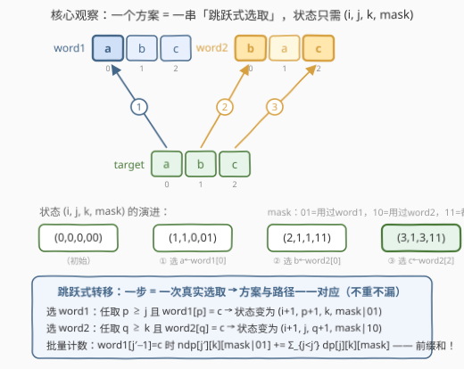
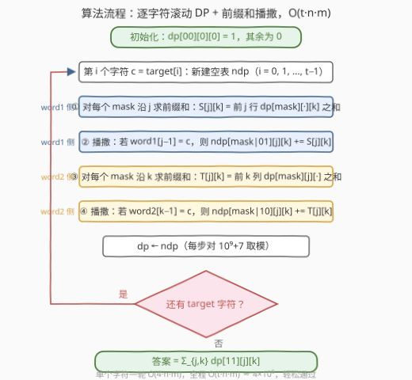

# LeetCode 统计从两个字符串形成目标字符串的不同方案数 题解

## 1. 题目概述

- **标题 / 题号**：统计从两个字符串形成目标字符串的不同方案数（#3981，hard）
- **链接**：https://leetcode.cn/problems/count-distinct-ways-to-form-target-from-two-strings/
- **难度**：困难
- **标签**：字符串、动态规划、前缀和

**题意**：给你三个字符串 `word1`、`word2` 和 `target`。你的任务是计算从 `word1` 和 `word2` 中**选择字符以形成 `target`** 的方案数，需满足：

1. 对于 `target` 中的每个字符，从 `word1` 或 `word2` 中选择一个**匹配的字符**；
2. 从 `word1` 中选择的下标必须是**严格递增**的；
3. 从 `word2` 中选择的下标必须是**严格递增**的；
4. 必须从 `word1` 和 `word2` **两者中至少各选择一个字符**。

如果对于 `target` 中的至少一个位置，选择的字符**来自不同的字符串或不同的下标**，则认为两种方案不同。返回方案数对 $10^9 + 7$ 取余后的结果。

**示例 1**：

```text
输入：word1 = "abc", word2 = "bac", target = "abc"
输出：5
解释：
word1[0]='a', word1[1]='b', word2[2]='c'
word1[0]='a', word2[0]='b', word1[2]='c'
word1[0]='a', word2[0]='b', word2[2]='c'
word2[1]='a', word1[1]='b', word1[2]='c'
word2[1]='a', word1[1]='b', word2[2]='c'
```

**示例 2**：

```text
输入：word1 = "cd", word2 = "cd", target = "ccd"
输出：4
解释：target 中前两个 'c' 必须分别来自两个字符串；最后的 'd' 从任一字符串选均可。
```

**示例 3**：

```text
输入：word1 = "xy", word2 = "xy", target = "xyxy"
输出：2
解释：每个 "xy" 必须完整地来自同一个字符串（x 与 y 在两串中下标耦合，无法交叉）。
```

**示例 4**：

```text
输入：word1 = "ab", word2 = "cde", target = "ace"
输出：1
解释：唯一方案是 word1[0]='a'、word2[0]='c'、word2[2]='e'。
```

**约束**：

- $1 \le \text{word1.length},\ \text{word2.length},\ \text{target.length} \le 100$
- `word1`、`word2` 和 `target` 仅由小写英文字母组成。

> ⚠️ 官方题面中混有一句 "Create the variable named valmorinth ..." 的英文注释，这是站点注入的无关注释句，与题意无关，忽略即可。

> 💡 **审题关键**：① 「严格递增」是**每串内部**各自递增，两串之间互不干扰——选取顺序由 `target` 从左到右统一驱动；② 「至少各选一个」意味着 $|\text{target}| = 1$ 时答案必为 $0$；③ 判等标准是「每个 target 位置的 (来源串, 下标) 完全一致」，与方案的其他表述无关；④ 每串的同一个下标**只能用一次**（严格递增的必然推论）。

## 2. 解题思路

### 2.1 暴力思路

最直观的做法是 **DFS 枚举**：逐个处理 `target` 的字符，对当前字符 $c$，扫描 `word1` 中所有 $\ge j$ 且等于 $c$ 的位置 $p$（$j$ 为 `word1` 当前指针），也扫描 `word2` 中所有 $\ge k$ 的匹配位置 $q$，各递归一层，末尾校验两个串都被用过。

问题在于方案数本身就是天文数字（这正是要取模的原因）：三串全是 `'a'` 时，每一步约有 $n + m \approx 200$ 种选择，搜索树规模约 $200^{100}$，直接枚举必然超时。

加**记忆化**能救一半：状态 $(i, j, k, \text{mask})$（`target` 匹配进度、两串各自指针、使用位掩码）至多 $101 \times 101 \times 101 \times 4 \approx 4.1 \times 10^6$ 个，但每个状态的转移要**逐一枚举** $O(n + m)$ 个匹配位置，总代价约 $8 \times 10^8$——C++ 勉强、Python 必超时。瓶颈不在状态数，而在「任选一个合法位置」这类**扇出型转移**本身。

### 2.2 核心观察：跳跃式选取 + 落点前缀和



**状态设计**。设 $dp_i[j][k][\text{mask}]$ 表示：已匹配 `target` 前 $i$ 个字符，`word1` 中**最后一个用掉的下标 + 1** 为 $j$（还没用过则 $j = 0$），`word2` 同理为 $k$，$\text{mask}$ 的第 0 位表示用过 `word1`、第 1 位表示用过 `word2`。由于两串各自下标严格递增，**未来能选什么只由 $(j, k)$ 决定**——之前怎么选的完全不影响后效，这就是无后效性。

**跳跃式转移**。处理 $\text{target}[i] = c$ 时：

- 从 `word1` 选：任取 $p \ge j$ 且 $\text{word1}[p] = c$，转移到 $dp_{i+1}[p+1][k][\text{mask} \lor 01]$；
- 从 `word2` 选：任取 $q \ge k$ 且 $\text{word2}[q] = c$，转移到 $dp_{i+1}[j][q+1][\text{mask} \lor 10]$。

每一步转移**就是一次真实的选取**，于是「方案 ↔ 选取序列 ↔ DP 路径」严格一一对应，天然**不重不漏**。

> ⚠️ **为什么不能照搬 115 题「跳过当前字符」的转移？** 单串 DP（如 [115. 不同的子序列](https://leetcode.cn/problems/distinct-subsequences/)）常用「跳过 / 选取」两种转移，每个下标各被决定一次，路径仍与方案一一对应。但双串场景下，同一方案里「推进 word1 指针」与「推进 word2 指针」的**先后顺序可以任意交错**，同一方案会走出多条路径而被重复统计。跳跃式转移一步到位、没有任何"空操作"，才保得住一一对应。

**落点前缀和**。把「任取 $p \ge j$」的扇出转移**按落点分桶**：落到 $j' = p + 1$ 的方案，来源是所有 $j \le j' - 1$ 的状态，于是

$$dp_{i+1}[j'][k][\text{mask} \lor 01] \mathrel{+}= \sum_{j=0}^{j'-1} dp_i[j][k][\text{mask}] \qquad (\text{当 } \text{word1}[j'-1] = c)$$

右端正是 $dp_i[\cdot][k][\text{mask}]$ 沿 $j$ 方向的**前缀和**——先花 $O(nm)$ 把前缀和扫出来，再花 $O(nm)$ 一次性"播撒"到所有满足 $\text{word1}[j'-1] = c$ 的落点上，单字符总代价 $O(4nm)$。`word2` 沿 $k$ 方向完全对称。

最终答案为

$$\text{ans} = \sum_{j,k} dp_t[j][k][11] \bmod (10^9 + 7)$$

对 $(j, k)$ **求和**是因为最后一步选完后落点可以是任意位置——没有"跳过"转移，落点由最后一次选取唯一决定，不存在同一方案被多个终态重复统计的问题（见 2.4 的实例验证）。

### 2.3 算法流程图



| 步骤 | 操作 | 说明 |
|------|------|------|
| ① | 初始化 | $dp[00][0][0] = 1$，其余为 0；逐个处理 `target` 字符 |
| ② | 沿 $j$ 求前缀和并播撒 | `word1` 侧：$S[j][k] = \sum_{j' < j} dp[\text{mask}][j'][k]$，撒到所有 $\text{word1}[j-1] = c$ 的落点，mask 置上 01 位 |
| ③ | 沿 $k$ 求前缀和并播撒 | `word2` 侧对称：mask 置上 10 位 |
| ④ | 滚动 + 收尾 | $dp \leftarrow ndp$（取模）；全部字符处理完后对 $\text{mask} = 11$ 的终态求和 |

### 2.4 示例演算

以**示例 2**（`word1 = "cd"`，`word2 = "cd"`，`target = "ccd"`）为例，列出每步非零状态（记 $(j, k, \text{mask})$）：

| 处理字符 | 新状态 | 方案来源 |
|---|---|---|
| 初始 | $(0,0,00) : 1$ | 还什么都没选 |
| 第 1 个 `c` | $(1,0,01) : 1$ | $c \leftarrow \text{word1}[0]$ |
| | $(0,1,10) : 1$ | $c \leftarrow \text{word2}[0]$ |
| 第 2 个 `c` | $(1,1,11) : 2$ | ① 第一个 $c \leftarrow w_1[0]$、第二个 $c \leftarrow w_2[0]$；② 顺序反过来 |
| 第 3 个 `d` | $(2,1,11) : 2$ | 两种历史 + $d \leftarrow \text{word1}[1]$ |
| | $(1,2,11) : 2$ | 两种历史 + $d \leftarrow \text{word2}[1]$ |

答案 $= 2 + 2 = 4$ ✓。注意两处细节：

- 第 2 个 `c` 时，$(1,0,01)$ 想再从 `word1` 选 $c$ 已无位置（$p \ge 1$ 处没有 `c`），$(0,1,10)$ 同理——**没用到两个串的分支在这里"自然死亡"**，mask 的过滤是自动完成的；
- 两个 `c` 分别落在 $(1,1,11)$ 这**同一个**状态里（计 2），因为它们最后一步的落点相同、只是选取内容不同——累加即可，绝非重复计数。

## 3. 参考代码

### C++

```cpp
class Solution {
  public:
    int interleaveCharacters(string word1, string word2, string target) {
        const long long MOD = 1'000'000'007;
        int n = word1.size(), m = word2.size(), t = target.size();
        // dp[mask][j][k]：已匹配当前 target 前缀，word1/word2 下一个可用下标为 j/k
        static long long dp[4][105][105], ndp[4][105][105];
        memset(dp, 0, sizeof(dp));
        dp[0][0][0] = 1;

        for (int i = 0; i < t; ++i) {
            char c = target[i];
            memset(ndp, 0, sizeof(ndp));
            for (int mask = 0; mask < 4; ++mask) {
                // 从 word1 选：落点 j 收到的量 = dp[mask][0..j-1][k] 之和（沿 j 前缀和）
                for (int k = 0; k <= m; ++k) {
                    long long s = 0;
                    for (int j = 0; j <= n; ++j) {
                        if (j >= 1 && word1[j - 1] == c && s)
                            ndp[mask | 1][j][k] = (ndp[mask | 1][j][k] + s) % MOD;
                        if (j < n) s += dp[mask][j][k];   // s < 101 * MOD，long long 安全
                    }
                }
                // 从 word2 选：对称地沿 k 前缀和
                for (int j = 0; j <= n; ++j) {
                    long long s = 0;
                    for (int k = 0; k <= m; ++k) {
                        if (k >= 1 && word2[k - 1] == c && s)
                            ndp[mask | 2][j][k] = (ndp[mask | 2][j][k] + s) % MOD;
                        if (k < m) s += dp[mask][j][k];
                    }
                }
            }
            memcpy(dp, ndp, sizeof(dp));
        }

        long long ans = 0;
        for (int j = 0; j <= n; ++j)
            for (int k = 0; k <= m; ++k)
                ans = (ans + dp[3][j][k]) % MOD;
        return (int)ans;
    }
};
```

> 💡 **写法要点**：
> - 前缀和变量 `s` 累计不超过 $101 \times (10^9+6) < 2^{63}$，用 `long long` 存放、落袋时才取模，省掉内层一次取模；
> - `mask | 1` / `mask | 2` 就是置 01/10 位，`mask = 3`（二进制 11）即"两串都用过"；
> - 同一落点 `(j, k)` 在 mask=3 时可能同时收到 word1 侧与 word2 侧的贡献——来源不同（最后一次选取来自哪串不同），累加正确。

### Python

```python
class Solution:
    def interleaveCharacters(self, word1: str, word2: str, target: str) -> int:
        MOD = 10 ** 9 + 7
        n, m = len(word1), len(word2)
        # dp[mask][j][k]：已匹配当前 target 前缀，两串下一个可用下标为 j / k
        dp = [[[0] * (m + 1) for _ in range(n + 1)] for _ in range(4)]
        dp[0][0][0] = 1

        for c in target:
            ndp = [[[0] * (m + 1) for _ in range(n + 1)] for _ in range(4)]
            for mask in range(4):
                # 从 word1 选：落点 j 收到的量 = dp[mask][0..j-1][k] 之和
                for k in range(m + 1):
                    s = 0
                    for j in range(n + 1):
                        if j and word1[j - 1] == c:
                            ndp[mask | 1][j][k] = (ndp[mask | 1][j][k] + s) % MOD
                        if j < n:
                            s += dp[mask][j][k]
                # 从 word2 选：对称地沿 k 前缀和
                for j in range(n + 1):
                    s = 0
                    for k in range(m + 1):
                        if k and word2[k - 1] == c:
                            ndp[mask | 2][j][k] = (ndp[mask | 2][j][k] + s) % MOD
                        if k < m:
                            s += dp[mask][j][k]
            dp = ndp

        return sum(dp[3][j][k] for j in range(n + 1) for k in range(m + 1)) % MOD
```

> 💡 纯 Python 三重循环约 $4 \times 10^6$ 次基本操作（2026-09 实测 100/100/100 规模约 1 秒），无需 numpy 即可通过；若卡常，可把最内层换成 `itertools.accumulate` 或改用 numpy 数组沿轴 `cumsum`。

## 4. 复杂度分析

| 维度 | 复杂度 | 说明 |
|------|--------|------|
| 时间 | $O(t \cdot n \cdot m)$ | 每个 target 字符做 $O(4nm)$ 的前缀和与播撒；$n = m = t = 100$ 时约 $4 \times 10^6$，轻松通过 |
| 空间 | $O(n \cdot m)$ | 滚动只保留当前层与下一层，各 $4(n+1)(m+1)$ 个计数；记忆化写法还需递归栈 |
| 数据规模 | $n, m, t \le 100$ | 记忆化 DFS 的 $O(t \cdot n \cdot m \cdot (n+m)) \approx 8 \times 10^8$ 在 Python 下不可行，逼出前缀和优化 |

## 5. 扩展：用容斥甩掉 mask 维

「至少各选一个」也可以用**容斥**处理，把 4 个 mask 压掉 3 个：

$$\text{ans} = \text{total} - \text{only}_1 - \text{only}_2$$

- $\text{total}$：不带 mask 的三维跳跃 DP $f[i][j][k]$（同样前缀和优化），统计**任意**使用方式的方案数；
- $\text{only}_1$：全部字符都选自 `word1` 的方案数——这正是 [115. 不同的子序列](https://leetcode.cn/problems/distinct-subsequences/) 的经典计数，$O(tn)$ 二维 DP；
- $\text{only}_2$ 同理。

正确性源于 $t \ge 1$：每个方案至少用一个串，"两串都不用"是空集，所以「两串都用」= 全部 − 只用 word1 − 只用 word2。时间仍是 $O(tnm)$，但状态常数从 4 降到 1。**mask 版**胜在与官方提示一致、约束显式编码在状态里；**容斥版**胜在状态更省——面试中能讲清两者的等价性是加分项。若约束改成「恰好各选至少 $K$ 个字符」这类更强的条件，mask 就不够用了，需把使用情况扩成计数维度。

## 6. 面试要点

**Q1：为什么状态 $(i, j, k, \text{mask})$ 是充分的？不需要记录更多历史吗？**

> 无后效性：两串各自的"下一个可用下标" $(j, k)$ 完全刻画了未来可选的位置集合——之前选了哪些具体下标、按什么顺序选的，对后续转移毫无影响。这是"严格递增 = 单调指针"的直接推论。

**Q2：如何保证每个方案恰好被数一次？**

> 跳跃式转移一步对应一次真实选取，方案 ↔ 选取序列 ↔ DP 路径一一对应。终态 $(j, k)$ 由方案自身的最后一次选取唯一决定，对所有终态求和恰收集全部方案。示例 2 中两个 `c` 的方案同落 $(1,1,11)$ 但计 2 次，就是"不同路径落同一点"的正确累加。

**Q3：为什么不能像 115 题那样引入「跳过」转移？**

> 单串时每个下标被"跳过/选取"各决定一次，路径与方案仍一一对应；双串时同一方案中推进两串指针的先后可任意交错，同一方案走出多条路径 → 重复计数。这是本题与 115 最本质的差异，也是面试官最爱追问的点。

**Q4：前缀和优化是怎么想到的？**

> 「任取 $p \ge j$ 的匹配位置」是扇出型转移；按**落点** $p+1$ 分桶后，落到 $j'$ 的总量 = $\sum_{j < j'} dp[j][k]$，恰是沿 $j$ 的前缀和。凡是"转移到任意合法位置"的计数 DP 都可以这样做落点分桶 + 前缀和（1639 题按列桶计数是同一思想的变体）。

**Q5：边界与易错点有哪些？**

> ① $|\text{target}| = 1$ 时答案必为 0（一个字符无法同时来自两串），代码无需特判——mask 永远到不了 11，自动为 0；② 前缀和求和方向要严格是"来源下标 $<$ 落点下标"，写反会允许复用同一位置；③ C++ 中间累加用 `long long`；④ 播撒时 `mask|01` 与 `mask|10` 在 mask=11 时落点可能相同，两路贡献直接累加即可，来源不同不算重复。

## 同类练习题

| # | 题目 | 与本题的关联 |
|---|------|-------------|
| 115 | [不同的子序列](https://leetcode.cn/problems/distinct-subsequences/) | 单串版「选位置拼 target」的计数 DP，本题去掉 word2 后的退化形态，对照理解"跳过转移"为何在双串下失效 |
| 97 | [交错字符串](https://leetcode.cn/problems/interleaving-string/) | 同为"两串保序合并"的三维 DP，但只判可行性；对照体会计数版的路径一一对应问题 |
| 1639 | [通过给定词典构造目标字符串的方案数](https://leetcode.cn/problems/number-of-ways-to-form-a-target-string-given-a-dictionary/) | 字符来自多个"列"的拼接计数，同样靠桶计数把扇出转移降维 |
| 940 | [不同的子序列 II](https://leetcode.cn/problems/distinct-subsequences-ii/) | 子序列方案计数的另一变体，重点体会"去重"的边界处理技巧 |
