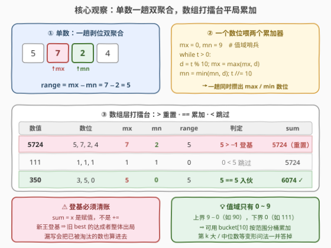
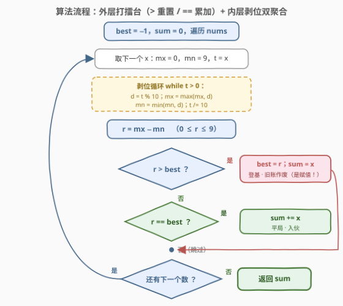

# LeetCode 最大数字范围的整数之和 题解

## 1. 题目概述

- **标题 / 题号**：最大数字范围的整数之和（#3982，easy）
- **链接**：https://leetcode.cn/problems/sum-of-integers-with-maximum-digit-range/
- **难度**：简单
- **标签**：数组、数学、数位枚举

**题意**：给你一个整数数组 `nums`。一个整数的**数字范围**定义为其**最大**数字与**最小**数字之间的差。例如，$5724$ 的数字范围为 $7 - 2 = 5$。

返回 `nums` 中所有**数字范围等于数组中最大数字范围**的整数之和。

**示例 1**：

```text
输入：nums = [5724, 111, 350]
输出：6074
解释：
      nums[i]  最大数字  最小数字  数字范围
      5724       7         2         5
      111        1         1         0
      350        5         0         5
最大数字范围为 5。数字范围为 5 的整数是 5724 和 350，
因此答案为 5724 + 350 = 6074。
```

**示例 2**：

```text
输入：nums = [90, 900]
输出：990
解释：两个数的数字范围都是 9（最大 9、最小 0），
     因此答案为 90 + 900 = 990。
```

**约束**：

- $1 \le \text{nums.length} \le 100$
- $10 \le \text{nums}[i] \le 10^5$

> 💡 **审题关键**：① 答案是「**达到**最大范围的那些数」之**和**，不是最大范围本身——「最值 + 达到者聚合」是打擂台的定型组合拳；② 每个数的两个原料（最大数位、最小数位）出自**同一组数位**，一趟「取模剥个位 + 除 10 丢个位」循环能同时攒出来；③ $10 \le \text{nums}[i]$ 保证每个数**至少两位**，剥位循环必然至少执行一轮，没有 $x=0$ 的边界；数字范围值域只有 $0 \sim 9$ 十种取值。

## 2. 解题思路

### 2.1 暴力思路：两遍扫描直译

按题面直译：第一遍对每个 `nums[i]` 转字符串（或剥位循环）算出数字范围，存进 `ranges[]`，扫完取最大值 `best`；第二遍把 `ranges[i] == best` 的 `nums[i]` 累加。写起来零思考成本，$n \le 100$、位数 $L \le 6$，复杂度毫无压力。考点同样不在复杂度，而在两处可以合并的观察：单数内部 max/min 可以**一趟双聚合**，数组层面「求最大 + 按最大过滤求和」也可以**一趟打擂台**收掉——两遍变一遍，顺便拿到一个值域只有 10 的分桶视角。

### 2.2 核心观察：单数双聚合 + 数组打擂台平局累加



**观察一（单数内部：一趟双聚合）**。最大数位与最小数位作用在同一组数位上，剥位循环里每个数位 $d$ 落地时**同时**喂给两个累加器：

```text
mx = 0, mn = 9          # 数位值域 [0,9]，初值取边界
while x > 0:
    d = x % 10          # 剥个位
    mx = max(mx, d)     # 喂最大
    mn = min(mn, d)     # 喂最小
    x //= 10            # 丢个位
# 循环结束时 range = mx − mn
```

`mx` 初值 0、`mn` 初值 9 是「值域边界哨兵」：任何数位 $d \in [0, 9]$ 必然 $\ge 0$ 且 $\le 9$，且 $x \ge 10$ 保证循环至少跑一轮，哨兵必然被真实数位覆盖（3079 求「最大数位 + 位数」同款双聚合骨架）。

**观察二（数组层面：打擂台平局累加）**。「最大值 + 达到最大值的元素之和」是 top-1 聚合的定型模式，一趟维护 `(best, sum)` 二元组：

- $\text{range} > \text{best}$：新王登基——**重置** `best = range`，`sum = x`（旧王的旧账全部作废）；
- $\text{range} == \text{best}$：平局入伙——`sum += x`；
- $\text{range} < \text{best}$：过气王侯——直接跳过。

⚠️ 最容易翻车的是「新王登基时忘记清空旧和」：`5724 → 350` 一路累加会把已被淘汰的数也计入。重置分支必须**赋值** `sum = x` 而不是 `sum += x`。

**观察三（值域分桶视角）**。数字范围 $\in [0, 9]$ 只有十种取值——开一个 `bucket[10]`，把每个数**按自己的 range 累加进对应桶**，最后从 9 往下找第一个非空桶即是答案。$n$ 再大十万倍，这个分桶也只花 $O(10)$ 的收尾；它是「计数排序 $k=10$ 特例」在聚合问题上的投影，也解释了为什么本题连排序都不需要。

> 💡 **一句话总结**：每个数一趟剥位同时攒 max/min，数组层一趟打擂台——`>` 重置、`==` 累加、`<` 跳过，收尾返回 `sum`。

### 2.3 算法流程图



| 步骤 | 操作 | 说明 |
|------|------|------|
| ① | `best = -1, sum = 0` | 打擂台初值：−1 是值域下界，保证首个数必然登基 |
| ② | 取下一个 `x`，`mx = 0, mn = 9, t = x` | 值域边界哨兵；`t` 是剥位工作副本（`x` 原值留着求和） |
| ③ | `t > 0` ? | 还有数位没剥就继续内层循环 |
| ④ | `d = t % 10`，`mx = max(mx, d)`，`mn = min(mn, d)`，`t //= 10` | 一个数位同时喂两个累加器 |
| ⑤ | `r = mx − mn` | 该数的数字范围，$0 \le r \le 9$ |
| ⑥ | `r > best` ? → `best = r, sum = x` | 新王登基，旧账作废（赋值不是累加） |
| ⑦ | `r == best` ? → `sum += x` | 平局入伙 |
| ⑧ | 遍历结束，返回 `sum` | `best` 只是过程量，答案始终在 `sum` 里 |

### 2.4 示例演算

以示例 1 `nums = [5724, 111, 350]` 走一趟打擂台：

| $x$ | 数位 | mx | mn | range | 与 best 比较 | best | sum |
|-----|------|----|----|-------|--------------|------|-----|
| 5724 | 5, 7, 2, 4 | 7 | 2 | 5 | $5 > -1$ 登基 | 5 | **5724** |
| 111 | 1, 1, 1 | 1 | 1 | 0 | $0 < 5$ 跳过 | 5 | 5724 |
| 350 | 3, 5, 0 | 5 | 0 | 5 | $5 == 5$ 入伙 | 5 | **6074** |

三个细节各有一行示范：`5724` 演示**登基重置**（sum 从 0 直接赋值为 5724）；`111` 演示**数字范围可以为 0**（全部数位相同，range = 1 − 1 = 0，它只是被 5 压住才出局）；`350` 演示**平局累加**。示例 2 `[90, 900]` 则是「两个数都取到值域上界 9（数位 9 与 0 同框）」的特例——range 上界 9 由 $9 - 0$ 达成，两位数 `90` 就能拿到。

## 3. 参考代码

### C++（一趟打擂台）

```cpp
class Solution {
public:
    int maxDigitRange(vector<int>& nums) {
        int best = -1, sum = 0;
        for (int x : nums) {
            int mx = 0, mn = 9, t = x;   // 值域边界哨兵 + 剥位工作副本
            while (t > 0) {
                int d = t % 10;          // 剥个位
                mx = max(mx, d);         // 一个数位喂两个累加器
                mn = min(mn, d);
                t /= 10;                 // 丢个位
            }
            int r = mx - mn;
            if (r > best) {              // 新王登基：旧账作废
                best = r;
                sum = x;                 // ⚠️ 赋值，不是 +=
            } else if (r == best) {      // 平局入伙
                sum += x;
            }
        }
        return sum;
    }
};
```

> 💡 **写法要点**：
> - 剥位会毁掉 `x`，先用 `t = x` 留副本，`x` 原值留给求和分支用；
> - `best` 初值取 $-1$（值域下界 0 再减一），保证第一个数必然走登基分支，无需哨兵元素；
> - 和上界 $100 \times 10^5 = 10^7 < 2^{31} - 1$，`int` 安全；range 上界 9，`int` 更是绰绰有余。

### Python（同款一趟版）

```python
class Solution:
    def maxDigitRange(self, nums: List[int]) -> int:
        best, total = -1, 0
        for x in nums:
            mx, mn, t = 0, 9, x
            while t:
                d = t % 10
                mx = max(mx, d)
                mn = min(mn, d)
                t //= 10
            r = mx - mn
            if r > best:          # 登基：重置
                best, total = r, x
            elif r == best:       # 平局：累加
                total += x
        return total
```

> 💡 **写法要点**：
> - `best, total = r, x` 是 Python 的元组赋值，一行完成「登基 + 重置」，不会出现先改 best 再忘改 total 的手误；
> - 字符串两遍流也完全正确（`max(map(int, str(x)))` 一步出最大数位），先全体求 range 再过滤求和，可读性优先时是合理选择；
> - 分桶版见第 5 节。

## 4. 复杂度分析

| 维度 | 复杂度 | 说明 |
|------|--------|------|
| 时间 | $O(nL)$，$L \le 6$ | 每个数剥位轮数 = 位数 $= \lfloor \log_{10} x \rfloor + 1$；$x \le 10^5$ 时 $L \le 6$（$10^5$ 本身是唯一的 6 位数） |
| 空间 | $O(1)$ | 只用 `mx / mn / best / sum` 四个标量；两遍流或分桶版也只是 $O(1)$ 额外（桶大小恒为 10） |

$n \le 100$、$L \le 6$，总计至多 600 次数位操作——本题是纯签到难度，复杂度分析的价值在于说出「轮数 = 位数」这一定量关系。

## 5. 扩展：分桶视角与其他数位统计量

**变体一：值域分桶版**。数字范围只有 $0 \sim 9$ 十种取值，按 range 分桶累加、从高到低找第一个非空桶：

```python
class Solution:
    def maxDigitRange(self, nums: List[int]) -> int:
        bucket, best = [0] * 10, -1
        for x in nums:
            ds = list(map(int, str(x)))
            r = max(ds) - min(ds)
            bucket[r] += x
            best = max(best, r)
        return bucket[best]
```

分桶时顺手 `best = max(best, r)`，收尾 `bucket[best]` 一步取和（$x \ge 10 > 0$ 保证非空桶的和必为正，不会与空桶混淆）。分桶的真正收益在**变形问法**：若答案改成「数字范围等于**第 k 大**的整数之和」「范围的中位数」或「统计每个范围各有多少个数」，一趟分桶后任意序统计都是 $O(10)$ 收尾，而打擂台只答得出 top-1。

**变体二：换数位统计量**。把「最大数位 − 最小数位」换成**数位和**（2535）、**数位积**（1281）、**最大数位**（2815、3079）——骨架分毫不差：单数一趟剥位攒统计量，数组层按统计量聚合。识别出「数位统计量 + 数组聚合」两层结构，这一族题就是同一道题。

**变体三：放大到 64 位 / 大数**。若 $x$ 大到 $10^{18}$，C++ 剥位循环照常工作（轮数 $L \le 19$），只是求和须换 `long long`；Python 无溢出问题。若 $x$ 是 $10^{30}$ 级大数，转字符串逐字符处理即可——数位枚举天然对「数值大小」不敏感，只对「位数」敏感。

## 6. 面试要点

**Q1：为什么可以一趟完成？两遍扫描版错在哪？**

> 都对。两遍版（先全体求 range 取 max，再过滤求和）与一趟打擂台语义等价：`>` 分支重置保证了 `sum` 始终等于「当前 best 的达成者之和」这一不变式——best 只增不减，被淘汰的达成者永远不会回来。两遍版要 $O(n)$ 额外数组存 ranges（或重算一遍 range），一趟版四个标量收工；面试先说两遍版理清题意、再指出可合并，是稳妥的展示路径。

**Q2：`mx = 0, mn = 9` 的初值为什么这样设？**

> 值域边界哨兵：数位 $d \in [0, 9]$，任何 $d$ 必然 $\ge 0 = mx_0$ 且 $\le 9 = mn_0$，哨兵不产生假数据；$x \ge 10$ 保证循环至少执行一轮，哨兵必然被真实数位覆盖。⚠️ 若约束放宽到允许 $x = 0$，`while (t > 0)` 一次不进，`range = 0 − 9 = −9` 就是 bug——修法是 `mn` 初始化为 0、或改 `do-while` 保证至少枚举一次（258 各位相加同款边界意识）。

**Q3：登基分支为什么要「赋值」而不是「累加」？**

> `sum` 的语义是「**当前**最大范围达成者之和」。新王登基意味着旧 best 的所有达成者整体出局，旧 `sum` 必须作废；若误写 `sum += x`，示例 1 会把已被 350 淘汰过程中的中间值一路带上（若输入为 `[111, 5724, 350]`，正确答案 6074，错误累加版会把 111 也计入得 6185）。这是本题唯一的实质陷阱。

**Q4：答案会溢出吗？数字范围的值域多大？**

> 和上界 $100 \times 10^5 = 10^7 < 2^{31} - 1 \approx 2.1 \times 10^9$，`int` 安全（放大 $n$ 或 $x$ 时先算清楚再定 `long long`）。数字范围 $\in [0, 9]$：上界由数位 9 与 0 同框达成（如 `90`），下界 0 对应全部数位相同（如 `111`）——range 可以合法地为 0，别在比较时把 0 当非法值。

**Q5：本题与 2815 数组中的最大数对和的区别？**

> 同属「数位键 + 数组聚合」：2815 按**最大数位**分组、组内取最大两两配对求最大数对和，聚合是「分组 + 组内 top-2」；本题按**数字范围**过滤求和，聚合是「全局 top-1 + 达成者求和」。前者分组后各组独立出候选，后者所有达成者直接相加——识别「键怎么定、组内怎么聚合」两问，这一族题的审题就完成了。

> 💡 **一句话总结**：一趟剥位双聚合攒 max/min，数组层打擂台「`>` 重置、`==` 累加」——签到题的两滴蜜：单数内部可合并、数组层面可合并；陷阱只有一个：登基要清账。

## 同类练习题

| # | 题目 | 与本题的关联 |
|---|------|-------------|
| 1281 | [整数的各位积和之差](https://leetcode.cn/problems/subtract-the-product-and-sum-of-digits-of-an-integer/)（[题解](../1201-1300/1281_整数各位积和之差.md)） | 同一趟剥位循环同时攒两个数位统计量，「单数内部双聚合」的入门形态 |
| 2815 | [数组中的最大数对和](https://leetcode.cn/problems/max-pair-sum-in-an-array/)（[题解](../2801-2900/2815_数组中的最大数对和.md)） | 同样以「最大数位」为数组分组键，组内 top-2 配对——本题的分组近亲 |
| 2535 | [数组元素和与数字和的绝对差](https://leetcode.cn/problems/difference-between-element-sum-and-digit-sum-of-an-array/)（[题解](../2501-2600/2535_数组元素和与数字和的绝对差.md)） | 数组级数位统计量的求和消元，聚合方向相反的同族题 |
| 258 | [各位相加](https://leetcode.cn/problems/add-digits/)（[题解](../0201-0300/258_各位相加.md)） | 数位和反复折叠成数根，`x = 0` 边界与哨兵初值的经典讨论场 |
| 728 | [自除数](https://leetcode.cn/problems/self-dividing-numbers/)（[题解](../0701-0800/728_自除数.md)） | 逐位取模条件判定 + 区间枚举，数位枚举套上外层循环的形态 |
