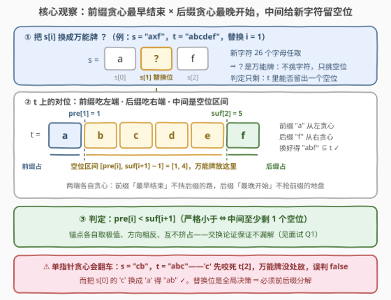
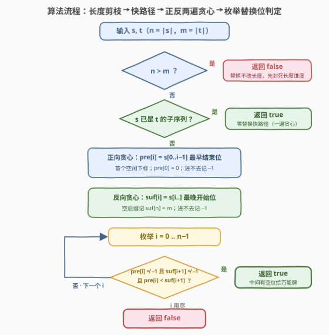

# 一次替换后的子序列

- **题目名称**：一次替换后的子序列
- **链接**：[3983. 一次替换后的子序列](https://leetcode.cn/problems/subsequence-after-one-replacement/)
- **难度**：中等
- **标签**：双指针、字符串、贪心

## 1. 题目概述

给你两个由小写英文字母组成的字符串 `s` 和 `t`。

你**最多**可以选择 `s` 中的一个下标，并将该下标处的字符**替换**为任意小写英文字母。

如果可以使 `s` 成为 `t` 的一个**子序列**，返回 `true`；否则返回 `false`。

**子序列**是指：通过删除另一个字符串中的某些字符（或不删除），且不改变剩余字符相对顺序得到的字符串。

**示例 1**：

```text
输入：s = "cat", t = "chat"
输出：true
解释：将 s[1] 从 'a' 替换为 'h'，得到 "cht"，是 "chat" 的子序列
      （'c'、'h'、't' 按顺序匹配）。
```

**示例 2**：

```text
输入：s = "plane", t = "apple"
输出：false
解释：'p'、'l'、'e' 可以在 t 中按序匹配，但其余字符无法匹配；
      即使替换 s 中任意一个字符，也无法使 s 成为 t 的子序列。
```

**约束条件**：

- $1 \le \text{s.length}, \text{t.length} \le 10^5$
- `s` 和 `t` 仅由小写英文字母组成

> 💡 **审题关键**：① 替换发生在 **s 上**且**至多一次**——零次也合法，`s` 本身已是子序列时直接 `true`；② 替换**不改变长度**，而子序列长度不能超过 $m$，故 $n > m$ 直接 `false`，先把长度维度封死；③ 新字符**任取** ⇒ 被替换位相当于一张「**万能牌**」：不挑字符，只挑位置——整个判定只剩一个问题：`t` 中能否给这张牌留出一个空位。

---

## 2. 解题思路

### 2.1 暴力思路：枚举替换位，逐个判定

最直白的做法：枚举替换位置 $i \in [0, n)$ 与新字符 $c \in [26]$，对每个 $s' = s[0..i) + c + s(i..n)$ 做一遍 392 式贪心子序列判定。单次判定 $O(n + m)$，总计 $O(26\,n(n+m)) \approx 10^{12}$，完全不可行。

第一个观察先消掉字符维度：新字符任取，所以固定 $i$ 时「存在可用的 $c$」$\iff$「`t` 中存在一个前后缀都没占用的下标 $p$」——把牌放进 $p$，取 $c = t[p]$ 即可。于是只需枚举 $i$，但每个 $i$ 仍要 $O(n+m)$ 判定，$O(n(n+m)) \approx 2 \times 10^{10}$，依然超时。

**突破口**：把「每个 $i$ 的判定」降到 $O(1)$——预先算好替换位左右两段的信息，判定只剩一次比较。

### 2.2 核心观察：前后缀分解——左边最早结束，右边最晚开始，中间留空位



**观察一（替换位的两侧互不相干）**。固定替换位置 $i$ 后，`s` 被拆成三段：前缀 $s[0..i)$、万能牌 $?$、后缀 $s(i..n)$。判定独立成两个子问题 + 一个空位存在性：

- 前缀 $s[0..i)$ 匹配进 `t` 的某个**前段**；
- 后缀 $s(i..n)$ 匹配进 `t` 的某个**后段**（且在前段右边）；
- 两段之间**至少剩 1 个下标**给 $?$。

**观察二（两个贪心锚点）**。定义：

- $pre[i]$：从左往右贪心匹配 $s[0..i)$ 的**最早结束位置**（`t` 中首个空闲下标；$pre[0] = 0$；匹配不进 `t` 记 $-1$）；
- $suf[i]$：从右往左贪心匹配 $s[i..n)$ 的**最晚开始位置**（空后缀 $suf[n] = m$；匹配不进记 $-1$）。

那么替换位 $i$ 可行 $\iff$

$$pre[i] \ne -1 \;\wedge\; suf[i{+}1] \ne -1 \;\wedge\; pre[i] < suf[i{+}1]$$

**严格小于**正是「中间至少留一个空位」：取 $p = pre[i]$，前缀恰好装进 $t[0..p)$，后缀装进 $t[suf[i{+}1]..m)$，把 $s[i]$ 替换成 $t[p]$ 即构造出解。

**观察三（两个锚点各自取极值，为何不漏解——交换论证）**。若存在某个可行摆放 $p$（前缀进 $t[0..p)$、后缀进 $t(p..m)$），则贪心前缀**不晚于**任何一种摆法结束：$pre[i] \le p$；贪心后缀**不早于**任何一种摆法开始：$suf[i{+}1] \ge p{+}1$。串联得 $pre[i] \le p < p{+}1 \le suf[i{+}1]$，判定条件必然命中。反之判定命中时取 $p = pre[i]$ 直接构造出解——**条件不漏不重**。直觉上，两个锚点在**相反方向**上各自「让利」：前缀越早结束越不挡后缀的路，后缀越晚开始越不抢前缀的地盘，中间的空位只会更大，所以独立取极值不会互相挤占。

> ⚠️ **为什么不能单指针贪心（遇到失配才打万能牌）**？反例 $s = $ `"cb"`，$t = $ `"abc"`：贪心让 `'c'` 先咬死 $t[2]$（它是 `'c'` 的唯一出现处），随后 `'b'` 无处可去、万能牌也没空位可放，误判 `false`；而正确答案是把 $s[0]$ 的 `'c'` 换成 `'a'` 得 `"ab"` $\subseteq$ `"abc"`。**万能牌打在哪一位是全局决策**，局部信息无法确定——这正是本题从 392 的「一遍贪心」升级成「前后缀分解」的考点。

> 💡 **一句话总结**：正向贪心攒 $pre$、反向贪心攒 $suf$，答案 $= \bigvee_{i}\, pre[i] < suf[i{+}1]$（另含零替换快路径）。

### 2.3 算法流程图



| 步骤 | 操作 | 说明 |
|------|------|------|
| ① | $n > m$ ? | 替换不改长度、子序列最长 $m$ ⇒ 直接 `false` |
| ② | 一遍贪心判 `s` 是否已是 `t` 的子序列 | 「至多一次」含零次 ⇒ 已是则直接 `true`（快路径，可被 ⑤ 覆盖，见面试 Q3） |
| ③ | 正向贪心求 $pre[0..n]$ | 指针只前进：$pre[i{+}1] = $（$s[i]$ 在 $t[pre[i]..m)$ 中首个出现位置）$+\,1$；找不到则**其后**全记 $-1$ |
| ④ | 反向贪心求 $suf[0..n]$ | 指针只后退：$suf[i] = $ $s[i]$ 在 $t[0..suf[i{+}1])$ 中最后出现位置；找不到则**其前**全记 $-1$；$suf[n] = m$ |
| ⑤ | 枚举 $i \in [0, n)$，判 $pre[i] < suf[i{+}1]$ | 两端均 $\ne -1$ 且严格小于 ⇒ 有空位，`true`；枚举完仍无 ⇒ `false` |

### 2.4 示例演算

以 $s = $ `"axf"`，$t = $ `"abcdef"` 走一遍：快路径中 `'x'` 匹配不进 `t`，进入主流程。

| $i$ | $pre[i]$（前缀最早结束） | $suf[i{+}1]$（后缀最晚开始） | 判定 $pre[i] < suf[i{+}1]$ |
|-----|--------------------------|------------------------------|-----------------------------|
| 0 | $0$（空前缀） | $-1$（后缀 `"xf"` 含 `'x'`，进不去） | ✗ |
| 1 | $1$（`"a"` 吃掉 $t[0]$） | $5$（`"f"` 最右在 $t[5]$） | $1 < 5$ ✓ |
| 2 | $-1$（前缀 `"ax"` 含 `'x'`，进不去） | $6$（空后缀） | ✗ |

$i = 1$ 命中：空位区间 $[1, 4]$ 任取其一（如把 `'x'` 换成 $t[1] = $ `'b'`，得 `"abf"` $\subseteq$ `"abcdef"`），返回 `true`。两行 $-1$ 正好演示了**硬伤位置决定断点**：`'x'` 在替换位的哪一侧，哪一侧的贪心就在哪里断掉，且断点单向传染。

官方示例的落点：示例 1 `"cat"`/`"chat"` 走**快路径**（贪心对齐 $c(0), a(2), t(3)$，本身已是子序列）直接 `true`；示例 2 `"plane"`/`"apple"` 中 $pre$ 算到 $pre[2] = 4$ 后断（`'a'` 在 $t[4]$ 之后找不到）、$suf$ 只撑出 `"e"` 一段（`'n'` 不在 `t` 中，$suf[3] = -1$），每个 $i$ 至少一端为 $-1$，返回 `false`。

---

## 3. 参考代码

### C++（前后缀分解 + 快路径）

```cpp
class Solution {
public:
    bool canMakeSubsequence(string s, string t) {
        int n = s.size(), m = t.size();
        if (n > m) return false;                 // 替换不改长度，先封死长度维度
        {   // 快路径：s 本身已是 t 的子序列（零替换也合法）
            int j = 0;
            for (char c : t) if (j < n && c == s[j]) ++j;
            if (j == n) return true;
        }
        vector<int> pre(n + 1, -1), suf(n + 1, -1);
        pre[0] = 0;                              // 空前缀：结束于 0
        for (int i = 0, j = 0; i < n; ++i) {     // 正向贪心：指针只前进
            while (j < m && t[j] != s[i]) ++j;
            if (j == m) break;                   // s[0..i] 进不去，后面更进不去
            pre[i + 1] = ++j;                    // 最早结束位 = 首个空闲下标
        }
        suf[n] = m;                              // 空后缀：起点可取 m
        for (int i = n - 1, j = m - 1; i >= 0; --i) {  // 反向贪心：指针只后退
            while (j >= 0 && t[j] != s[i]) --j;
            if (j < 0) break;                    // s[i..] 进不去，前面更进不去
            suf[i] = j--;                        // 最晚开始位
        }
        for (int i = 0; i < n; ++i)              // 万能牌判定：中间有空位吗？
            if (pre[i] != -1 && suf[i + 1] != -1 && pre[i] < suf[i + 1])
                return true;
        return false;
    }
};
```

> 💡 **写法要点**：
> - 两遍贪心里的 `break` 之后数组剩余位置保持 $-1$：前缀断点传染给**更大的下标**、后缀断点传染给**更小的下标**——由「前缀/后缀的失败会传染」保证，无需显式填充；
> - `pre[i + 1] = ++j`：先自增再赋值，恰是「匹配位 $+\,1$ = 首个空闲位」；`suf[i] = j--` 同理；
> - $n, m \le 10^5$，两个 `int` 数组共约 800 KB，安全。

### Python（同款前后缀分解）

```python
class Solution:
    def canMakeSubsequence(self, s: str, t: str) -> bool:
        n, m = len(s), len(t)
        if n > m:
            return False
        j = 0                                    # 快路径：零替换
        for c in t:
            if j < n and c == s[j]:
                j += 1
        if j == n:
            return True

        pre = [-1] * (n + 1)
        pre[0] = 0
        j = 0
        for i in range(n):                       # 正向贪心：最早结束位
            while j < m and t[j] != s[i]:
                j += 1
            if j == m:
                break
            pre[i + 1] = j + 1
            j += 1

        suf = [-1] * (n + 1)
        suf[n] = m                               # 空后缀
        j = m - 1
        for i in range(n - 1, -1, -1):           # 反向贪心：最晚开始位
            while j >= 0 and t[j] != s[i]:
                j -= 1
            if j < 0:
                break
            suf[i] = j
            j -= 1

        return any(pre[i] != -1 and suf[i + 1] != -1
                   and pre[i] < suf[i + 1] for i in range(n))
```

> 💡 **写法要点**：
> - `any(...)` 生成器短路：找到第一个可行 $i$ 立即返回；
> - 快路径其实可省（见面试 Q3），保留它让「零替换 / 一次替换」两种情况在代码里各自成段，可读性更好；
> - 想省常数可把快路径与正向贪心合并：一遍贪心中 $j$ 到达 $n$ 即 `true`。

---

## 4. 复杂度分析

| 维度 | 复杂度 | 说明 |
|------|--------|------|
| 时间 | $O(n + m)$ | 快路径、正反两遍贪心、枚举判定四趟线性扫，指针单调移动，总计至多 $2n + 3m$ 步 |
| 空间 | $O(n)$ | `pre`、`suf` 两个长度 $n{+}1$ 的数组；可省掉 `pre`（先算好 `suf`，再正向贪心边跑边判），但仍是 $O(n)$，仅常数减半 |

$n, m \le 10^5$：纯 Python 实测约 30 ms。本题卡的不是常数，是**思路从 $O(n(n+m))$ 到 $O(n+m)$ 的跨越**——把每个替换位的判定压成一次比较。

---

## 5. 扩展：同一副骨架的变体们

**变体一：改成「删除 `s` 的一个字符」**。判定条件从 $pre[i] < suf[i{+}1]$ **放宽为** $pre[i] \le suf[i{+}1]$——没有新字符，前后缀直接拼起来，不再需要留空位。骨架分毫不动，只换一个比较符。

**变体二：允许 $k$ 次替换**。前后缀分解只对「一张万能牌」成立；$k$ 张时需要 DP：$f[i][j][u]$ 表示 $s[0..i)$ 用 $u$ 次替换后能否匹配进 $t[0..j)$，转移三选一（跳过 $t[j{-}1]$ / 原字符匹配 / 消耗一次替换），$O(nmk)$。$k = 1$ 时 $O(nm) \approx 10^{10}$ 依然超时——反衬出前后缀分解 $O(n+m)$ 的价值：**一张牌的特例恰好能被两个贪心锚点无损刻画**。

**变体三：要求「恰好一次」且新字符必须与原字符不同**。条件变为空位区间 $[pre[i],\, suf[i{+}1] - 1]$ 中存在 $t[p] \ne s[i]$：预处理 26 个字母的前缀计数，区间内「异于 $s[i]$」的字符数 = 区间长度 $-$ $s[i]$ 的区间计数，$O(26m + n)$ 判定。

---

## 6. 面试要点

**Q1：为什么前缀取「最早结束」、后缀取「最晚开始」，两者不会互相挤占？**

> 交换论证双向封死：若有可行摆放 $p$，则 $pre[i] \le p$（贪心前缀不晚于任何摆法结束）且 $suf[i{+}1] \ge p{+}1$（贪心后缀不早于任何摆法开始），串联即 $pre[i] < suf[i{+}1]$，判定必然命中；反之判定命中时取 $p = pre[i]$ 直接构造出解。两个锚点在**相反方向**上各自让利——前缀越早结束、后缀越晚开始，中间空位只会更大——独立取极值不漏解。

**Q2：`pre`/`suf` 里匹配不进去为什么可以整段记 $-1$，`break` 后不用管剩余位置？**

> 失败会传染：$s[0..i)$ 已匹配不进 `t`，更长的 $s[0..i')$（$i' > i$）以它为前缀，自然也进不去；后缀对称（$s[i..)$ 进不去则 $s[i'..)$（$i' < i$）也进不去）。所以一趟贪心首次失败处即断点，断点之后（之前）保持 $-1$ 哨兵即可。⚠️ 方向别记反：**前缀断点传染给更大的下标，后缀断点传染给更小的下标**。

**Q3：开头判「`s` 已是子序列」的快路径，以及 $n > m$ 的剪枝，能去掉吗？**

> 都能，答案不变。若 `s` 已是子序列，则 $pre[n] \le m$ 且贪心匹配位置严格递增，于是 $pre[n{-}1] < pre[n] \le m = suf[n]$，枚举到 $i = n{-}1$ 必命中。$n > m$ 时对任意 $i$：$pre[i] \ge i$、$suf[i{+}1] \le m - (n{-}1{-}i)$，两者夹不出空位（条件成立可推出 $n \le m$），主循环自动 `false`。两处保留只是常数优化 + 语义显式化。

**Q4：能不能用「带一张万能牌的单指针贪心」一遍扫过去？**

> 不行，反例 $s = $ `"cb"`、$t = $ `"abc"`：任何单指针策略都会让 `'c'` 抢占 $t[2]$，随后 `'b'` 无处可去；而万能牌若提前打在 $s[0]$（换成 `'a'`）本可成功。**牌打在哪一位是全局决策**，局部信息无法确定——这正是本题从 392「一遍贪心」升级为「前后缀分解」的考点。

**Q5：与 2565（最少得分子序列）的前后缀分解有何异同？**

> 同：都是「前缀贪心 + 后缀贪心 + 枚举中间分界」的三段式。异：本题中间段是**恰好 1 个**可任意替换的字符，判定 $pre[i] < suf[i{+}1]$（要留空位）；2565 中间段是 `t` 中**任意长**的可删除连续段，求 $\min\big(suf[j] - pre[i]\big)$（要最短）。识别「中间段给什么权限」是这一族题的审题核心：留空位 / 求最短 / 求方案数，判定形态随之而变。

> 💡 **一句话总结**：一张万能牌 = 前缀最早结束与后缀最晚开始之间留一个空位——$pre[i] < suf[i{+}1]$ 一个不等式收掉；两个贪心锚点方向相反、各自取极值，交换论证保证不漏解。

---

## 7. 同类练习题

- [392. 判断子序列](https://leetcode.cn/problems/is-subsequence/)（[题解](../0301-0400/392_判断子序列.md)）：本题的 $k = 0$ 特例，一遍贪心双指针的地基
- [2486. 追加字符以获得子序列](https://leetcode.cn/problems/append-characters-to-string-to-make-subsequence/)（[题解](../2401-2500/2486_追加字符以获得子序列.md)）：同样只改 `s`（尾部追加），同样只看贪心前缀吃到哪
- [792. 匹配子序列的单词数](https://leetcode.cn/problems/number-of-matching-subsequences/)（[题解](../0701-0800/792_匹配子序列的单词数.md)）：子序列判定批量化，桶优化避免 $m \cdot n$ 逐个暴力
- [524. 通过删除字母匹配到字典里最长单词](https://leetcode.cn/problems/longest-word-in-dictionary-through-deleting/)（[题解](../0501-0600/524_通过删除字母匹配到字典里最长单词.md)）：子序列判定套上枚举 + 字典序外壳
- [2565. 最少得分子序列](https://leetcode.cn/problems/subsequence-with-the-minimum-score/)（[题解](../2501-2600/2565_最少得分子序列.md)）：前后缀分解的进阶版，中间段放宽为任意长的可删除连续段
