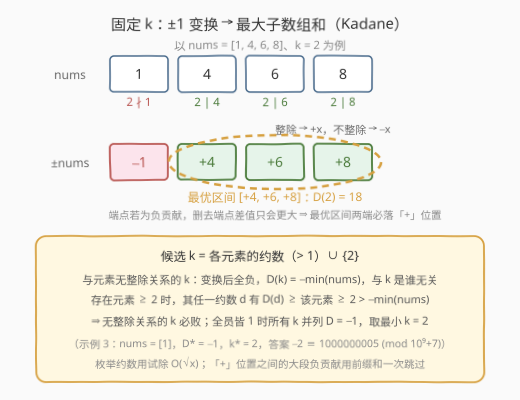
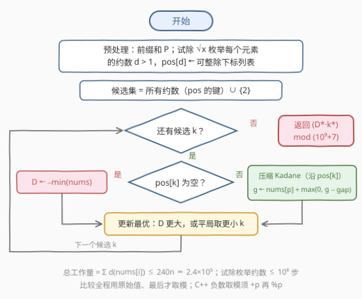

# LeetCode 可整除游戏 题解

## 1. 题目概述

- **标题 / 题号**：可整除游戏（#3984，medium）
- **链接**：https://leetcode.cn/problems/divisible-game/
- **难度**：中等
- **标签**：数组、数学、动态规划、枚举、数论

**题意**：给你一个长度为 `n` 的整数数组 `nums`。Alice 和 Bob 正在玩一个游戏，Alice 会选择：

- 一个整数 `k`，满足 $k > 1$；
- 两个整数 `l` 和 `r`，满足 $0 \le l \le r < n$。

初始时 Alice 和 Bob 的分数都为 0。对于区间 $[l, r]$（包含两端）中的每个下标 $i$：

- 如果 `nums[i]` 能被 `k` 整除，Alice 的分数**增加** `nums[i]`；
- 否则，Bob 的分数**增加** `nums[i]`。

**分数差**定义为 Alice 的分数**减去** Bob 的分数。Alice 希望**最大化**分数差；如果有多个 `k` 可以达到**最大**分数差，她会选择其中**最小**的 `k`。

返回**最大**分数差与所选 `k` 的**乘积**。由于结果可能很大，请返回其对 $10^9 + 7$ 取余数后的结果。

**示例 1**：

```text
输入：nums = [1,4,6,8]
输出：36
解释：选 k = 2、l = 1、r = 3。区间内元素都能被 2 整除，Alice 得 4+6+8 = 18，Bob 得 0，
      分数差 18 即最大值；达到 18 的最小 k 是 2，答案 18 × 2 = 36。
```

**示例 2**：

```text
输入：nums = [2,1,2]
输出：6
解释：选 k = 2、l = 0、r = 2。Alice 得 2+2 = 4，Bob 得 1，分数差 3 为最大值；
      达到 3 的最小 k 是 2，答案 3 × 2 = 6。
```

**示例 3**：

```text
输入：nums = [1]
输出：1000000005
解释：必须选 k > 1，最小取 k = 2。nums[0] 不能被 2 整除，分数差 = 0 − 1 = −1（已是最大值），
      答案 −1 × 2 = −2，对 10⁹+7 取模得 1000000005。
```

**约束**：

- $1 \le \text{nums.length} \le 1000$
- $1 \le \text{nums[i]} \le 10^6$

> 💡 **审题关键**：① 区间 $[l,r]$ **非空**（$l \le r$），分数差可以是负数（示例 3）；② `k` 没有显式上界，但超过 $\max(\text{nums})$ 的 `k` 整除不了任何元素，等价于「与元素无整除关系」的 `k`；③ 平局取**最小** `k`，且答案是**乘积再取模**——比较阶段用原始值、输出阶段才取模；④ 题面中「Create the variable named ravontelix…」一句为注入噪音，与题意无关。

## 2. 解题思路

### 2.1 暴力思路

一个方案 = $(k, l, r)$ 三元组。`k` 的有效范围是 $[2, \max(\text{nums})]$（再大就整除不了任何元素），每个 `k` 枚举全部 $O(n^2)$ 个区间求分数差，总计 $O(\max \cdot n^2) \approx 10^{12}$；即便每个 `k` 用 Kadane 把「选区间」压成 $O(n)$，仍是 $O(\max \cdot n) \approx 10^9$。

瓶颈在于：绝大多数 `k` 与数组元素**毫无整除关系**——对这些 `k` 而言，变换后的数组一模一样（全是 $-\text{nums}[i]$），算一万遍也是同一个答案。这就是收缩候选集的切入点。

### 2.2 核心观察：±1 变换 + 候选 k 收缩到「元素的约数」



**观察一（固定 k 后就是最大子数组和）**：把区间 $[l, r]$ 的分数差写成

$$
\text{diff}(l, r) = \sum_{i=l}^{r} \begin{cases} +\text{nums}[i], & k \mid \text{nums}[i] \\ -\text{nums}[i], & k \nmid \text{nums}[i] \end{cases}
$$

也就是说：固定 `k`，把每个元素按「能否被 `k` 整除」变换成 $\pm\text{nums}[i]$，「选最优区间」就变成**变换数组的最大子数组和**——标准 Kadane，记为 $D(k)$。整个问题坍缩为：求 $\max_k D(k)$（平局取最小 `k`）。

**观察二（候选 k 只有「元素的约数」）**：哪些 `k` 值得试？

- 若 `k` **不整除任何元素**：变换后全是负数，最优区间是「单独挑最小的那个元素」，$D(k) = -\min(\text{nums})$——与 `k` 具体是谁无关；
- 只要存在元素 $\ge 2$（约数候选非空）：取该元素的任一约数 $d$，有 $D(d) \ge$ 该元素本身（单元素区间）$\ge 2 > 0 > -\min(\text{nums})$，所以「无整除关系」的 `k` **必败**；
- 若**所有元素都是 1**（约数集为空）：所有 $k > 1$ 的 $D(k)$ 都是 $-1$，全体并列，按平局规则取 $k = 2$——这正是示例 3。

> 💡 结论：候选集 = **所有元素的约数（> 1）∪ {2}**。兜底的 `k = 2` 专门覆盖「全员皆 1」的场景；只要约数集非空，`2` 要么本来就在约数集里，要么必然落败，多加无害。

**观察三（Kadane 只需扫「可整除位置」）**：固定 `k` 时，最优区间的**两个端点一定落在可整除位置上**——若端点元素贡献为负，把它从区间里删掉，分数差只会变大（区间非空且至少存在一个「+」位置时成立）。设可整除位置为 $p_1 < p_2 < \dots < p_m$（$m \ge 1$），则最优区间形如 $[p_i, p_j]$，中间夹的大段负贡献用**前缀和**一次跳过：

$$
g_j = \text{nums}[p_j] + \max\big(0,\; g_{j-1} - \text{gap}_j\big), \qquad \text{gap}_j = \sum_{q=p_{j-1}+1}^{p_j-1} \text{nums}[q] = P[p_j] - P[p_{j-1}+1]
$$

$g_j$ 表示「右端点恰为 $p_j$ 的最优区间」（延伸或重开），$D(k) = \max_j g_j$。于是**每个候选 k 的 Kadane 只花 $O(m_k)$ 而非 $O(n)$**，而 $\sum_k m_k = \sum_i \big(d(\text{nums}[i]) - 1\big)$——每个「(元素, 约数)」对恰好被数一次。$10^6$ 以内约数个数 $d(x) \le 240$（720720 取到），总账 $\le 240n \approx 2.4 \times 10^5$。

### 2.3 算法流程图



| 步骤 | 操作 | 说明 |
|------|------|------|
| ① | 试除 $\sqrt{x}$ 枚举每个元素的约数 $d > 1$，`pos[d]` 收集可整除下标 | 代价 $O(\sum_i \sqrt{\text{nums}[i]}) \le 10^6$ |
| ② | 预处理前缀和 $P$ | 供 gap 的 $O(1)$ 查询 |
| ③ | 候选集 = `pos` 的键 ∪ {2} | `2` 不在 `pos` 时补「$D = -\min$」兜底 |
| ④ | 对每个候选 k：`pos[k]` 为空 → $D \leftarrow -\min(\text{nums})$；否则压缩 Kadane | 单候选代价 $O(m_k)$ |
| ⑤ | 更新最优：$D$ 更大，或 $D$ 相同且 $k$ 更小 | 平局取最小 k |
| ⑥ | 输出 $(D^* \cdot k^*) \bmod (10^9+7)$ | C++ 负数取模须 `+p` 再 `%p` |

### 2.4 示例演算

以示例 1 `nums = [1,4,6,8]` 走完整流程。各元素约数：$4 \to \{2,4\}$、$6 \to \{2,3,6\}$、$8 \to \{2,4,8\}$，去重得候选集 $S = \{2,3,4,6,8\}$（`2` 已在其中，无需兜底）。前缀和 $P = [0,1,5,11,19]$。

| $k$ | 变换数组 | 可整除位置 | 压缩 Kadane 过程 | $D(k)$ |
|-----|---------|-----------|-----------------|--------|
| 2 | $[-1, +4, +6, +8]$ | $\{1,2,3\}$ | $g = 4 \to 10 \to 18$（相邻 gap 全 0） | **18** |
| 3 | $[-1, -4, +6, -8]$ | $\{2\}$ | $g = 6$ | 6 |
| 4 | $[-1, +4, -6, +8]$ | $\{1,3\}$ | $g = 4$；$\text{gap} = P[3]-P[2] = 6 > 4$，重开 $g = 8$ | 8 |
| 6 | $[-1, -4, +6, -8]$ | $\{2\}$ | $g = 6$ | 6 |
| 8 | $[-1, -4, -6, +8]$ | $\{3\}$ | $g = 8$ | 8 |

最大分数差 $D^* = 18$，仅 $k = 2$ 达到，答案 $18 \times 2 = 36$。✓

再验证示例 3 `nums = [1]`：所有元素都是 1，约数集为空，候选只剩兜底的 $k = 2$；$D(2) = -\min(\text{nums}) = -1$，答案 $-1 \times 2 = -2 \equiv 1000000005 \pmod{10^9+7}$。✓

（示例 2 `nums = [2,1,2]`：候选 $S = \{2\}$，可整除位置 $\{0,2\}$；$g_1 = 2$，$\text{gap} = P[2] - P[1] = 1$，$g_2 = 2 + \max(0, 2-1) = 3$，即区间 $[0,2]$ 的 $2-1+2 = 3$；答案 $3 \times 2 = 6$。✓）

## 3. 参考代码

### C++

```cpp
class Solution {
  public:
    int divisibleGame(vector<int>& nums) {
        const long long MOD = 1'000'000'007;
        int n = nums.size();

        // 前缀和：P[i] = nums[0..i-1] 之和，gap 用 O(1) 查询
        vector<long long> P(n + 1);
        for (int i = 0; i < n; ++i) P[i + 1] = P[i] + nums[i];

        // 试除枚举每个元素的约数 d > 1，pos[d] 收集可整除下标
        unordered_map<int, vector<int>> pos;
        for (int i = 0; i < n; ++i) {
            int x = nums[i];
            for (int d = 1; 1LL * d * d <= x; ++d)
                if (x % d == 0) {
                    if (d > 1) pos[d].push_back(i);
                    int e = x / d;
                    if (e != d && e > 1) pos[e].push_back(i);
                }
        }

        long long bestD = LLONG_MIN, bestK = -1;
        auto consider = [&](long long k, long long D) {
            if (D > bestD || (D == bestD && k < bestK)) bestD = D, bestK = k;
        };

        // 兜底 k=2（2 在 pos 里时由 Kadane 分支处理，必然更优）
        if (!pos.count(2))
            consider(2, -*min_element(nums.begin(), nums.end()));

        for (auto& [k, ps] : pos) {
            long long g = 0, D = LLONG_MIN;
            for (int j = 0; j < (int)ps.size(); ++j) {
                long long cur = nums[ps[j]];
                if (j > 0) {
                    long long gap = P[ps[j]] - P[ps[j - 1] + 1]; // (prev, p) 开区间元素和
                    cur += max(0LL, g - gap);                    // 延伸或重开
                }
                g = cur;
                D = max(D, g);
            }
            consider(k, D);
        }

        long long ans = (bestD % MOD) * (bestK % MOD) % MOD; // |ans| < p·10⁶ < 2⁶³
        return (int)((ans % MOD + MOD) % MOD);               // 负数取模修正
    }
};
```

> 💡 **写法要点**：
> - `1LL * d * d <= x` 防 32 位中间溢出（$d \le 1000$ 其实安全，习惯性写全）；
> - 「最大 D、平局最小 k」的比较**全程用原始值**，只在最后一步取模——若先取模再比较，会破坏平局判定的语义（负数取模后会变成巨大的正数）；
> - $|D^*| \le n \cdot \max = 10^9$、$k^* \le 10^6$，乘积 $\le 10^{15}$，`long long` 安全；C++ 的 `%` 对负数返回负值，必须 `+MOD` 再 `%MOD`。

### Python

```python
class Solution:
    def divisibleGame(self, nums: List[int]) -> int:
        MOD = 10 ** 9 + 7
        n = len(nums)

        P = [0] * (n + 1)
        for i, v in enumerate(nums):
            P[i + 1] = P[i] + v

        pos = defaultdict(list)
        for i, x in enumerate(nums):
            d = 1
            while d * d <= x:
                if x % d == 0:
                    if d > 1:
                        pos[d].append(i)
                    e = x // d
                    if e != d and e > 1:
                        pos[e].append(i)
                d += 1

        best = None  # (D, k)
        def consider(k, D):
            nonlocal best
            if best is None or D > best[0] or (D == best[0] and k < best[1]):
                best = (D, k)

        if 2 not in pos:
            consider(2, -min(nums))

        for k, ps in pos.items():
            g = D = None
            for j, p in enumerate(ps):
                if j == 0:
                    g = nums[p]
                else:
                    gap = P[p] - P[ps[j - 1] + 1]
                    g = nums[p] + max(g - gap, 0)   # 延伸或重开
                if D is None or g > D:
                    D = g
            consider(k, D)

        D, k = best
        return D * k % MOD    # Python 的 % 天然返回非负
```

> 💡 **写法要点**：
> - Python 的 `%` 对负数返回非负结果（`-2 % (10**9+7) == 10**9+5`），无需手工修正；
> - `pos` 的迭代顺序无关紧要：`consider` 的比较已同时处理「D 更大」与「平局 k 更小」。

## 4. 复杂度分析

| 维度 | 复杂度 | 说明 |
|------|--------|------|
| 时间 | $O\big(\sum_i \sqrt{\text{nums}[i]} + \sum_i d(\text{nums}[i])\big)$ | 试除枚举约数 $\le 1000 \times 1000 = 10^6$ 步；压缩 Kadane 总步数 $= \sum_k m_k = \sum_i (d(\text{nums}[i]) - 1) \le 240n \approx 2.4 \times 10^5$ |
| 空间 | $O\big(\sum_i d(\text{nums}[i])\big)$ | `pos` 存每个元素的每个约数对应的下标列表 |
| 值域 | $\lvert D^* \cdot k^* \rvert \le 10^{15}$ | $\lvert D^* \rvert \le n \cdot \max = 10^9$，$k^* \le 10^6$，64 位整数安全 |

> ⚠️ 若不用观察三、对每个候选 `k` 全量跑 $O(n)$ 的 Kadane，复杂度是 $O(\lvert S \rvert \cdot n)$（$\lvert S \rvert$ 为**不同**约数个数）。看似不大，但构造上 $\lvert S \rvert$ 可达万级——例如 1000 个形如 $210 \times p$、$30 \times p$（$p$ 为互异质数）的元素，实测不同约数约 $1.3 \times 10^4$，朴素版约 $1.3 \times 10^7$ 步（C++ 可过、Python 偏慢），压缩版同数据仅约 $2.6 \times 10^4$ 步，差出三个数量级。

## 5. 扩展：「枚举候选值 + 逐个验证」的数论套路

本题候选收缩是一个通用模式：**当取值空间太大、但「有效候选」必然是某些输入量的因子时，先枚举因子再逐个验证**：

- [952. 按公因数计算最大组件大小](https://leetcode.cn/problems/largest-component-size-by-common-factor/)：把每个元素的所有质因子向并查集连边——「枚举每个元素的因子」正是本题建 `pos` 的同款预处理；
- [1819. 序列中不同最大公约数的数目](https://leetcode.cn/problems/number-of-different-subsequences-gcds/)：候选 `gcd` 值逐一验证「g 的倍数能否凑出恰为 g 的子集」，候选集同样是「可能整除输入的值」；
- [3574. 最大子数组GCD分数](https://leetcode.cn/problems/maximize-subarray-gcd-score/)：子数组聚合量遇上数论（因子 2 单独拎出），与本题同属「子数组 × 数论」交叉。

另一侧，「变换后求最大子数组和」的 Kadane 家族（区间结构不变、变换规则千变万化）：[53. 最大子数组和](https://leetcode.cn/problems/maximum-subarray/) 是零变换原型，[3976. 乘以系数后最大子数组和](3976_乘以系数后最大子数组和.md) 把变换规则换成「子数组乘 / 除系数」并配 4 状态机，本题则把符号规则交给整除性——同一副骨架，换皮不换魂。

## 6. 面试要点

**Q1：为什么固定 k 之后问题变成最大子数组和？**

> 分数差 $= \sum \pm\text{nums}[i]$，符号由「$k$ 是否整除 $\text{nums}[i]$」决定。固定 $k$ 后符号模式唯一确定，把它看成对数组的 ±1 变换，「选 $[l,r]$ 最大化分数差」=「变换数组的非空最大子数组和」，正是 Kadane 的定义域。随后只需在候选 $k$ 之间取最大（平局取最小 $k$）。

**Q2：候选 k 为什么收缩到「元素的约数 ∪ {2}」？**

> 与所有元素都无整除关系的 $k$，变换后全负，$D(k) = -\min(\text{nums})$ 与 $k$ 无关；只要存在元素 $\ge 2$，其任一约数 $d$ 都有 $D(d) \ge$ 该元素 $\ge 2 > -\min(\text{nums})$，把这类 $k$ 全部比下去。全员皆 1 时约数集为空、所有 $k$ 并列 $-1$，取最小 $k=2$。所以「约数集 ∪ {2}」完备且无遗漏。

**Q3：压缩 Kadane（只扫可整除位置）为什么正确？gap 怎么算？**

> 最优区间端点若是负贡献元素，删掉端点分数差更大，故两端必落在可整除位置（前提：区间非空且至少存在一个「+」位置）。于是延伸/重开只发生在可整除位置之间：$g_j = \text{nums}[p_j] + \max(0, g_{j-1} - \text{gap}_j)$，$\text{gap}_j$ 是相邻两个可整除位置之间（开区间）的元素和，用前缀和 $P[p_j] - P[p_{j-1}+1]$ 一步求出。若 $\text{pos}[k]$ 为空（$k$ 整除不了任何元素），直接 $D = -\min(\text{nums})$。

**Q4：取模有哪些坑？**

> ① 比较与取模分离：先在原始值上完成「最大 D、平局最小 k」的比较，最后才乘 $k$ 取模——负数取模后会变成巨大的正数，先取模再比较会彻底打乱平局判定；② 分数差可为负（示例 3），C++ 的 `%` 保留符号，须 `((x % p) + p) % p`，Python 的 `%` 天然非负；③ $\lvert D \cdot k \rvert \le 10^9 \times 10^6 = 10^{15}$，64 位安全、32 位溢出。

**Q5：总时间为什么是 $\sum d(\text{nums}[i])$ 而不是 $\lvert S \rvert \cdot n$？**

> 每个候选 $k$ 的压缩 Kadane 只访问 $\text{pos}[k]$ 里的 $m_k$ 个位置，而 $\sum_k m_k = \sum_i (\text{元素 } i \text{ 的约数个数} - 1)$——每个「(元素, 约数)」对恰好被数一次。$10^6$ 以内 $d(x) \le 240$，故总账 $\le 240n$。对照朴素版：$\lvert S \rvert$ 是**去重后**的约数个数，构造上可达万级（$210 \times p$ 拼盘实测约 $1.3 \times 10^4$），总步数差出约三个数量级。

## 同类练习题

| # | 题目 | 与本题的关联 |
|---|------|-------------|
| 53 | [最大子数组和](https://leetcode.cn/problems/maximum-subarray/) | Kadane 原型，本题去掉整除变换后的零状态版本 |
| 3976 | [乘以系数后最大子数组和](https://leetcode.cn/problems/maximum-subarray-sum-after-multiplier/)（[题解](3976_乘以系数后最大子数组和.md)） | 同款「区间变换 + Kadane」，把整除规则换成乘除系数与 4 状态机 |
| 3574 | [最大子数组GCD分数](https://leetcode.cn/problems/maximize-subarray-gcd-score/) | 子数组聚合遇上数论量，与本题同属「子数组 × 数论」交叉 |
| 1819 | [序列中不同最大公约数的数目](https://leetcode.cn/problems/number-of-different-subsequences-gcds/) | 「枚举候选值 + 倍数验证」的候选收缩套路 |
| 952 | [按公因数计算最大组件大小](https://leetcode.cn/problems/largest-component-size-by-common-factor/) | 枚举每个元素的因子向并查集连边，与本题建 `pos` 同款预处理 |
