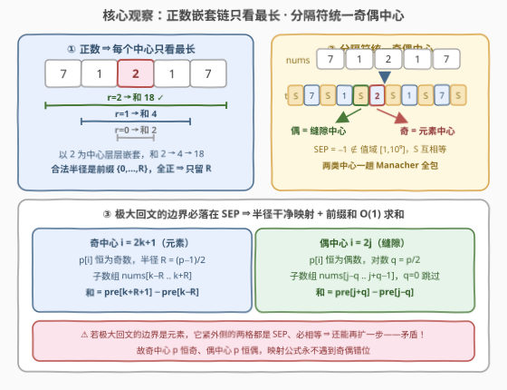
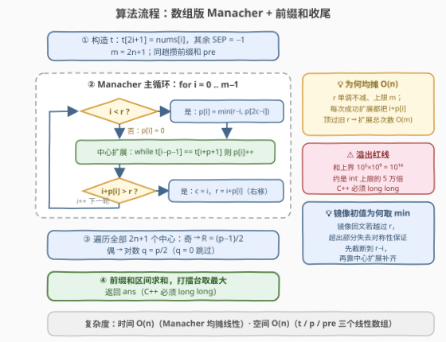

# LeetCode 回文子数组求和 题解

## 1. 题目概述

- **标题 / 题号**：回文子数组求和（#3985，hard）
- **链接**：https://leetcode.cn/problems/palindromic-subarray-sum/
- **难度**：困难
- **标签**：数组、Manacher 算法、前缀和、二分查找、字符串哈希

**题意**：给你一个整数数组 `nums`。你的任务是找出 `nums` 中一个**回文子数组**的**最大**元素和，返回这样的子数组的最大元素和。

- **子数组**是数组中一个连续的**非空**元素序列；
- 如果一个子数组**正着读和反着读都相同**，则称其为**回文**。

**示例 1**：

```text
输入：nums = [10,10]
输出：20
解释：整个数组 [10,10] 是回文子数组，最大元素和为 10 + 10 = 20。
```

**示例 2**：

```text
输入：nums = [1,2,3,2,1,5,6]
输出：9
解释：连续子数组 [1,2,3,2,1] 是回文子数组，元素和为 9，且这是最大元素和。
```

**示例 3**：

```text
输入：nums = [7,1,2,1,7,3,4,3,4]
输出：18
解释：连续子数组 [7,1,2,1,7] 是回文子数组，元素和为 7+1+2+1+7 = 18。
```

**示例 4**：

```text
输入：nums = [1,2,3,4,5]
输出：5
解释：不存在长度大于 1 的回文子数组，数组中的最大元素是 5，因此答案为 5。
```

**示例 5**：

```text
输入：nums = [1000]
输出：1000
解释：只包含一个元素的子数组也是回文子数组。
```

**约束**：

- $1 \le \text{nums.length} \le 10^5$
- $1 \le \text{nums}[i] \le 10^9$

> 💡 **审题关键**：① 「子数组 + 回文」与字符串完全同构——本题就是 [5. 最长回文子串](https://leetcode.cn/problems/longest-palindromic-substring/) 的**数组平移版**，只是目标从「长度」换成「和」；② **元素全正**（$1 \le \text{nums}[i]$）是全题的承重墙：固定中心下半径越大和越大，每个中心只需考察**最长**回文；③ $n = 10^5$ 把中心扩展 $O(n^2)$ 判了死刑（全等数组直接退化到 $\sim n^2/4$ 次比较），必须 Manacher $O(n)$ 或 二分+哈希 $O(n \log n)$；④ 答案上界 $10^5 \times 10^9 = 10^{14}$，C++ 必须 `long long`。题面 `nalviretho` 句为注入噪音，忽略即可。

## 2. 解题思路

### 2.1 暴力思路：中心扩展 O(n²) 为何阵亡

最自然的暴力是「枚举中心 + 双指针扩展」：共 $2n-1$ 个中心（$n$ 个元素中心 + $n-1$ 个缝隙中心），每个中心向两侧扩展到不能扩为止，得到该中心的最长回文半径，配前缀和 $O(1)$ 求和打擂台。逻辑完全正确，复杂度 $O(n^2)$——当 $n = 10^5$ 且数组全等（如 `[7,7,…,7]`）时，每个中心都一路扩到数组两端，操作数约 $n^2/4 = 2.5 \times 10^9$，稳稳超时。

瓶颈不在求和而在「找每个中心的最长半径」：中心扩展对每个中心**从零开始**比较，大回文内部的对称信息没有被复用。而回文嵌套回文的结构恰恰意味着——右边的中心可以**白嫖**左边中心的比较结果。把这个「白嫖」制度化，就是 Manacher。

### 2.2 核心观察：正数嵌套链 + 分隔符统一奇偶



**观察一（正数 ⇒ 每中心只看最长）**。固定一个中心（奇中心 = 某个元素，偶中心 = 相邻两元素间的缝隙），若半径 $R$ 合法（以该中心、该半径的子数组是回文），则一切 $0 \le r \le R$ 都合法——大回文**内部**以同中心截出的子段必然回文（对称位置在大回文里相等）。于是同一中心的合法半径构成**前缀** $\{0, 1, \dots, R_{\max}\}$，回文子数组层层嵌套；元素全正 ⇒ 外层严格包含内层、和必然更大。因此**每个中心只需半径最大的那一个**：答案 = 全部 $2n+1$ 个中心的「最长回文之和」的最大值。

**观察二（分隔符统一奇偶中心）**。字符串 Manacher 的经典技巧平移到数组：取 $\text{SEP} = -1$（不在值域 $[1, 10^9]$ 内，永不与元素误判相等），构造

$$t = [\text{SEP},\ \text{nums}[0],\ \text{SEP},\ \text{nums}[1],\ \dots,\ \text{SEP}],\quad m = 2n+1$$

$t$ 中奇下标是元素（**奇回文中心**）、偶下标是缝隙（**偶回文中心**），一趟 Manacher 同时算出两类中心的极大半径 $p[i]$（即 $t[i-p[i]..i+p[i]]$ 是回文）。

**观察三（$p$ 的奇偶被钉死 ⇒ 干净的半径映射）**。所有 SEP 两两相等 ⇒ 若某极大回文的**边界是元素**，则边界紧外侧的两格都是 SEP、互相相等，必能再扩一步——矛盾。故极大回文的边界必落在 SEP 上（数组两端的 $t[0]$、$t[m-1]$ 本就是 SEP），于是：

| 中心类型 | $t$ 下标 | $p[i]$ 奇偶 | 映射 | 子数组 | 和（前缀和 $O(1)$） |
|----------|----------|------------|------|--------|----------------------|
| 奇（元素） | $i = 2k+1$ | 恒为奇 | $R = (p[i]-1)/2$ | $\text{nums}[k-R..k+R]$ | $\text{pre}[k+R+1] - \text{pre}[k-R]$ |
| 偶（缝隙） | $i = 2j$ | 恒为偶 | 对数 $q = p[i]/2$ | $\text{nums}[j-q..j+q-1]$ | $\text{pre}[j+q] - \text{pre}[j-q]$ |

$R = 0$（单元素）天然被奇中心覆盖，$q = 0$（空）跳过——「子数组非空」的边界自动满足。

> 💡 **一句话总结**：正数把「最大和」坍缩成「每中心最长回文」，分隔符把奇偶中心坍缩成一条 $t$ 数组，Manacher 线性扫出全部极大半径，前缀和 $O(1)$ 收尾。

### 2.3 算法流程图



| 步骤 | 操作 | 说明 |
|------|------|------|
| ① | 构造 $t$ 与 $\text{pre}$ | $t$ 长 $2n+1$，$\text{SEP}=-1$；$\text{pre}[i+1] = \text{pre}[i] + \text{nums}[i]$ |
| ② | Manacher 主循环 | 维护「最右回文」$(c, r)$：$p[i]$ 初值 $= \min(r-i,\ p[2c-i])$（镜像复用，$2c-i$ 是 $i$ 关于 $c$ 的镜像） |
| ③ | 中心扩展 | `while t[i-p-1] == t[i+p+1]` 则 `p[i]++` |
| ④ | 推进最右边界 | $i + p[i] > r$ 时更新 $c = i,\ r = i + p[i]$ |
| ⑤ | 收尾映射求和 | 奇中心 $\to R=(p-1)/2$、偶中心 $\to q=p/2$，前缀和求和打擂台 |

**Manacher 为什么均摊 $O(n)$**：$p[i]$ 初值被 $\min(r-i, \dots)$ 夹在 $r - i$ 以内，此后 `while` 每成功一次，都把 $i + p[i]$ 向右顶过旧 $r$；而 $r$ 单调不减且上限为 $m$，故全部扩展成功次数总和 $O(m) = O(n)$，加上每轮至多一次的失败比较，总计线性。

### 2.4 示例演算

以示例 3 `nums = [7,1,2,1,7,3,4,3,4]` 演算（记 SEP 为 S，$m = 19$）：

```text
t = [S,7,S,1,S,2,S,1,S,7,S,3,S,4,S,3,S,4,S]
      index: 0 1 2 3 4 5 6 7 8 9 10 11 12 13 14 15 16 17 18
```

关键中心的扩展结果（其余奇中心两侧第一步即失配，卡在 $p=1$，退化为单元素；偶中心无一相邻相等，$q=0$ 全跳过）：

| $t$ 中心 $i$ | 类型 | 对应位置 | $p[i]$ | 映射 | 子数组 | 和 |
|--------------|------|----------|--------|------|--------|-----|
| 5 | 奇（元素 2） | $k=2$ | 5 | $R=2$ | `[7,1,2,1,7]` | **18** ✓ |
| 13 | 奇（元素 4） | $k=6$ | 3 | $R=1$ | `[3,4,3]` | 10 |
| 15 | 奇（元素 3） | $k=7$ | 3 | $R=1$ | `[4,3,4]` | 11 |
| 9 | 奇（元素 7） | $k=4$ | 1 | $R=0$ | `[7]` | 7 |
| 任意偶 | 缝隙 | — | 0 | $q=0$ | 空 | 跳过 |

中心 5 的扩展轨迹：$t[4]{=}S{=}t[6]$ ✓ → $t[3]{=}1{=}t[7]$ ✓ → $t[2]{=}S{=}t[8]$ ✓ → $t[1]{=}7{=}t[9]$ ✓ → $t[0]{=}S{=}t[10]$ ✓ → $t[-1]$ 越界停，$p=5$、$R=2$、和 $= \text{pre}[5] - \text{pre}[0] = 18$。示例 2 的 `[1,2,3,2,1]` 同款：中心 5 → $p=5$ → $R=2$ → 和 9。

## 3. 参考代码

### C++（数组版 Manacher）

```cpp
class Solution {
public:
    long long getSum(vector<int>& nums) {
        int n = nums.size();
        int m = 2 * n + 1;
        vector<int> t(m, -1);                  // SEP = -1，不在值域 [1,1e9]
        for (int i = 0; i < n; i++) t[2 * i + 1] = nums[i];

        vector<long long> pre(n + 1, 0);       // 前缀和：和上界 1e14，必须 long long
        for (int i = 0; i < n; i++) pre[i + 1] = pre[i] + nums[i];

        vector<int> p(m, 0);                   // p[i]: t 中极大回文半径
        int c = 0, r = 0;                      // 当前最右回文 [c-r, c+r]
        for (int i = 0; i < m; i++) {
            if (i < r) p[i] = min(r - i, p[2 * c - i]);   // 镜像复用，截断到保证范围内
            while (i - p[i] - 1 >= 0 && i + p[i] + 1 < m
                   && t[i - p[i] - 1] == t[i + p[i] + 1])
                p[i]++;                                    // 中心扩展
            if (i + p[i] > r) { c = i; r = i + p[i]; }     // 推进最右边界
        }

        long long ans = 0;
        for (int i = 0; i < m; i++) {
            if (i & 1) {                       // 奇中心 i=2k+1：p 恒奇，R=(p-1)/2
                int k = (i - 1) / 2, R = (p[i] - 1) / 2;
                ans = max(ans, pre[k + R + 1] - pre[k - R]);
            } else if (p[i] > 0) {             // 偶中心 i=2j：p 恒偶，对数 q=p/2
                int j = i / 2, q = p[i] / 2;
                ans = max(ans, pre[j + q] - pre[j - q]);
            }
        }
        return ans;
    }
};
```

> 💡 **写法要点**：
> - `p[i]` 的含义是「$t[i-p[i]..i+p[i]]$ 是回文」的极大半径，含中心本身；奇偶中心的映射公式依赖 2.2 观察三的奇偶钉死结论，不会遇到错位；
> - `min(r - i, p[2*c - i])` 的截断是正确性关键：镜像回文若越过 $r$，超出部分不再有对称性背书；
> - `ans` 初值 0 安全：单元素回文恒存在（$R=0$），答案 $\ge \max(\text{nums}) \ge 1$。

### Python（同款）

```python
class Solution:
    def getSum(self, nums: List[int]) -> int:
        n = len(nums)
        t = [-1] * (2 * n + 1)                     # SEP = -1
        for i, x in enumerate(nums):
            t[2 * i + 1] = x

        pre = [0] * (n + 1)
        for i, x in enumerate(nums):
            pre[i + 1] = pre[i] + x

        m = 2 * n + 1
        p = [0] * m
        c = r = 0                                   # 最右回文 [c-r, c+r]
        for i in range(m):
            if i < r:
                p[i] = min(r - i, p[2 * c - i])     # 镜像复用
            while (i - p[i] - 1 >= 0 and i + p[i] + 1 < m
                   and t[i - p[i] - 1] == t[i + p[i] + 1]):
                p[i] += 1                           # 中心扩展
            if i + p[i] > r:
                c, r = i, i + p[i]

        ans = 0
        for i in range(m):
            if i & 1:                               # 奇中心：R = (p-1)//2
                k, rad = (i - 1) // 2, (p[i] - 1) // 2
                ans = max(ans, pre[k + rad + 1] - pre[k - rad])
            elif p[i]:                              # 偶中心：对数 q = p//2
                j, q = i // 2, p[i] // 2
                ans = max(ans, pre[j + q] - pre[j - q])
        return ans
```

> 💡 **写法要点**：
> - Python 大整数无溢出之忧，`pre` 直接存 Python int；
> - 两段循环（Manacher、收尾映射）也可合并进主循环收尾处，拆开写更贴近 2.3 的流程表；
> - 实测 $n = 10^5$ 全等数组 0.2s 出头（同一数据二分+哈希版约 3.8s），线性算法的优势肉眼可见。

## 4. 复杂度分析

| 维度 | 复杂度 | 说明 |
|------|--------|------|
| 时间 | $O(n)$ | Manacher 均摊线性：$r$ 只增不减，每次成功扩展必把 $i+p[i]$ 顶过旧 $r$，扩展总次数 $O(m) = O(n)$；收尾遍历 $2n+1$ 个中心 $O(n)$ |
| 空间 | $O(n)$ | $t$（$2n+1$）、$p$（$2n+1$）、$\text{pre}$（$n+1$）三个线性数组 |

横向对比：中心扩展 $O(n^2)$ 在全等数组上要打 $\sim 2.5 \times 10^9$ 次比较；二分+哈希 $O(n \log n)$ 约 $1.7 \times 10^6$ 次；Manacher $O(n)$ 约 $2 \times 10^5$ 次——三个数量级的差距正是本题「困难」定级的来源。

## 5. 扩展：二分 + 哈希路线与负数变体

**变体一：二分 + 滚动哈希（官方标签路线）**。标签里的 Binary Search / Hash Function 指向另一条可行解：对 `nums` 与其反串 `rev` 各建**双模数**滚动哈希；子数组 `nums[l..r]` 是回文 ⟺ 其哈希等于反串对应段 `rev[n-1-r .. n-1-l]` 的哈希。固定中心后「半径 $r$ 合法」关于 $r$ 单调（大回文的内层子段必回文），对每个中心二分最大半径即可。双模数把碰撞概率压到可忽略。$O(n \log n)$：

```python
class Solution:
    def getSum(self, nums: List[int]) -> int:
        n = len(nums)
        pre = [0] * (n + 1)
        for i, x in enumerate(nums):
            pre[i + 1] = pre[i] + x
        M1, M2, B = 1_000_000_007, 998_244_353, 131

        def build(a):
            m = len(a)
            h1 = [0] * (m + 1); h2 = [0] * (m + 1)
            p1 = [1] * (m + 1); p2 = [1] * (m + 1)
            for i, x in enumerate(a):
                h1[i + 1] = (h1[i] * B + x) % M1
                h2[i + 1] = (h2[i] * B + x) % M2
                p1[i + 1] = p1[i] * B % M1
                p2[i + 1] = p2[i] * B % M2
            return h1, h2, p1, p2

        def seg(h, p, mod, l, r):                  # [l, r) 的哈希值
            return (h[r] - h[l] * p[r - l]) % mod

        rev = nums[::-1]
        h1, h2, p1, p2 = build(nums)
        g1, g2, q1, q2 = build(rev)

        def is_pal(l, r):                          # nums[l..r] 是否回文
            a, b = n - 1 - r, n - 1 - l            # 反串对应段
            return (seg(h1, p1, M1, l, r + 1) == seg(g1, q1, M1, a, b + 1)
                    and seg(h2, p2, M2, l, r + 1) == seg(g2, q2, M2, a, b + 1))

        ans = 0
        for k in range(n):                         # 奇中心：二分半径
            lo, hi = 0, min(k, n - 1 - k)
            while lo < hi:
                mid = (lo + hi + 1) // 2
                if is_pal(k - mid, k + mid): lo = mid
                else: hi = mid - 1
            ans = max(ans, pre[k + lo + 1] - pre[k - lo])
        for j in range(1, n):                      # 偶中心：二分对数
            lo, hi = 0, min(j, n - j)
            while lo < hi:
                mid = (lo + hi + 1) // 2
                if is_pal(j - mid, j + mid - 1): lo = mid
                else: hi = mid - 1
            if lo:
                ans = max(ans, pre[j + lo] - pre[j - lo])
        return ans
```

**变体二：元素含负数会怎样？**「每中心只看最长」依赖正数：一旦出现负数，嵌套链外层的和未必更大（如 $[-5, 1, -5]$ 取中心和 $1$ 优于整段 $-9$），必须对每个中心在 $\{0, \dots, R_{\max}\}$ 全体合法半径里挑最大前缀和——合法半径总数在全等数组下达 $O(n^2)$，「只看最长」的坍缩失效，本题的线性解法不再直接成立。对照：若求「最长回文子数组的**长度**」而非和，与元素正负无关，Manacher 直接适用。

**变体三：本题 = 5 的数组平移 + 目标换「和」**。字符串版的全家桶（中心扩展 / Manacher / 二分+哈希）原样照搬，迁移点只有三处：分隔符从 `'#'` 换成值域外的 $-1$；目标从长度换成和（靠正数条件坍缩）；溢出从「无」变「必须 `long long`」。反过来，字符串上若问「ASCII 和最大的回文子串」且字符权值全正，同款坍缩照样成立——识别「同构迁移点」正是本题的练习价值。

## 6. 面试要点

**Q1：为什么每个中心只考察最长回文？**

> 同中心的合法半径构成前缀 $\{0..R_{\max}\}$：大回文以同中心截出的内层子段必回文（对称位置在大回文里相等），故回文层层嵌套；元素全正 ⇒ 外层和 ≥ 内层（半径真变大时严格更大）。于是全局最大和必在某个中心的最长回文处取到。⚠️ 该论证的承重墙是正数——元素可负时见第 5 节变体二。

**Q2：SEP 为什么取 −1？取 0 行不行？**

> 行。只要不在元素值域 $[1, 10^9]$ 内即可，0 和 −1 都合格。SEP 需要的两条性质是「与任何元素都不相等」+「SEP 之间互相相等」——前者保证 t 中回文的对称结构不被伪造（若 SEP 撞进值域，某元素会被误当分隔符参与对称），后者是 2.2 观察三（p 的奇偶钉死）的前提。字符串版用 `'#'` 是同款道理。

**Q3：Manacher 凭什么是 O(n) 而不是 O(n²)？**

> 均摊论证：维护最右回文 $(c, r)$。$p[i]$ 初值 $= \min(r-i, p[2c-i])$ 被夹在 $r-i$ 以内；`while` 每成功一次都把 $i + p[i]$ 顶过旧 $r$ 一步以上，随后 $r$ 更新为 $i + p[i]$。$r$ 单调不减且 $\le m$，故全部成功扩展次数 $\le m$；失败比较每轮至多一次。总计 $O(m) = O(n)$。反例是中心扩展：它不维护 $(c, r)$、每个中心从零比起到 $O(n)$，全等数组上总和 $O(n^2)$。

**Q4：溢出与边界要注意什么？**

> 和上界 $n \cdot \max = 10^5 \times 10^9 = 10^{14}$，超 `int32` 约 5 万倍，C++ 的返回值与 `pre` 数组必须 `long long`（题目签名已是）；Python 天然大整数。边界：$n=1$ 时 $t = [\text{SEP}, x, \text{SEP}]$，奇中心 $p=1 \to R=0 \to$ 答案 $x$；偶中心 $q=0$ 跳过；单元素回文恒存在 ⇒ 答案 $\ge \max(\text{nums}) \ge 1$，`ans` 初值 0 安全。

**Q5：与 5 最长回文子串的差异在哪？**

> 三处：① 数据从字符变整数，分隔符不能再用 `'#'`，换成值域外的 $-1$（或 0）；② 目标从「长度」变「和」，靠正数条件把「全体回文」坍缩到「每中心最长」；③ 溢出从「无需考虑」变「必须 64 位」。算法骨架分毫不动——面试里能主动指出这三个迁移点，比背出 Manacher 模板更能证明理解。

> 💡 **一句话总结**：正数让「最大和」坍缩成「每中心最长」，分隔符让奇偶中心坍缩成一条数组，Manacher 线性收割全部半径，前缀和 O(1) 结账——困难题的三步坍缩，每一步都在砍掉一个维度。

## 同类练习题

| # | 题目 | 与本题的关联 |
|---|------|-------------|
| 5 | [最长回文子串](https://leetcode.cn/problems/longest-palindromic-substring/)（[题解](../0001-0100/5_最长回文子串.md)） | 字符串版原型，中心扩展与 Manacher 的招牌教学场 |
| 647 | [回文子串](https://leetcode.cn/problems/palindromic-substrings/)（[题解](../0601-0700/647_回文子串.md)） | 把「找最长」换成「数个数」，Manacher 半径数组直接求和 |
| 1960 | [两个回文子字符串长度的最大乘积](https://leetcode.cn/problems/maximum-product-of-the-length-of-two-palindromic-substrings/)（[题解](../1901-2000/1960_两个回文子字符串长度的最大乘积.md)） | Manacher 半径数组的前后缀极值二次加工 |
| 1745 | [分割回文串 IV](https://leetcode.cn/problems/palindrome-partitioning-iv/)（[题解](../1701-1800/1745_分割回文串IV.md)） | 回文判定预处理（DP / Manacher）+ 划分决策的组合 |
| 214 | [最短回文串](https://leetcode.cn/problems/shortest-palindrome/)（[题解](../0201-0300/214_最短回文串.md)） | 回文半径的另一极端用法——KMP 失配函数求最长回文前缀 |
