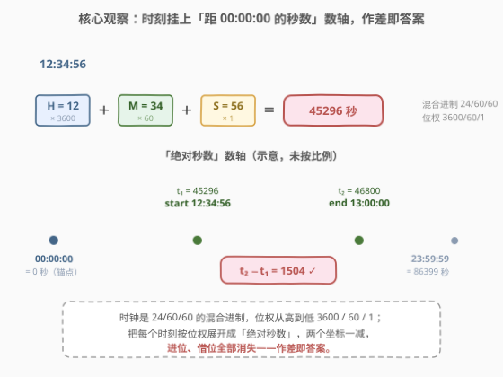
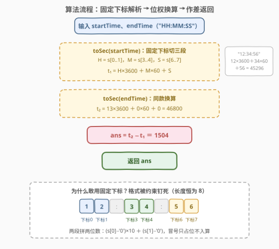

# 统计起止时间经过的秒数

- **题目名称**：统计起止时间经过的秒数
- **链接**：[3986. 统计起止时间经过的秒数](https://leetcode.cn/problems/number-of-elapsed-seconds-between-two-times/)
- **难度**：简单
- **标签**：数学、字符串

## 1. 题目概述

给你两个有效时间 `startTime` 和 `endTime`，它们均以字符串形式表示，格式为 `"HH:MM:SS"`。返回从 `startTime` 到 `endTime` 经过的秒数（包含两个端点）。

**示例 1**：

```text
输入：startTime = "01:00:00", endTime = "01:00:25"
输出：25
解释：endTime 比 startTime 晚 25 秒。
```

**示例 2**：

```text
输入：startTime = "12:34:56", endTime = "13:00:00"
输出：1504
解释：endTime 比 startTime 晚 25 分 4 秒，共计 1504 秒。
```

**约束条件**：

- `startTime.length == 8`，`endTime.length == 8`
- 两个字符串均为格式 `"HH:MM:SS"` 的有效时间
- $00 \le \text{HH} \le 23$，$00 \le \text{MM} \le 59$，$00 \le \text{SS} \le 59$
- `endTime` 不早于 `startTime`

> 💡 **审题关键**：① 「经过的秒数」按示例校准语义：答案就是两个时刻的**秒数差** $S(\text{end}) - S(\text{start})$——示例 1 中 $01:00:00 \to 01:00:25$ 答案是 25 而非 26，说明不是「端点时刻计数」，两时刻相同则答案为 0；② `endTime` 不早于 `startTime` 保证差值非负，无需取绝对值或跨午夜处理；③ 字符串长度恒为 8、格式钉死，**固定下标切三段**即可完成解析，连 split 都不是必需的。

---

## 2. 解题思路

### 2.1 暴力思路：逐秒模拟时钟

按题面直译：从 `startTime` 出发，让一个软时钟每步 `+1` 秒——秒位满 60 清零并向分位进位，分位满 60 清零并向时位进位——每走一步计数 `+1`，直到软时钟追上 `endTime`。正确性无可挑剔，复杂度 $O(\Delta)$（$\Delta$ 为答案秒数，最坏 $23:59:59 - 00:00:00 = 86399$ 步），本题数据下也完全能过。

但这个写法把「进位」当成了要伺候的麻烦：模拟中 99% 的工作量花在维护 HH:MM:SS 三个字段的进位一致性上。而观察一下进位的本质——**秒满 60 才进一分，分满 60 才进一时**——这正是「60 秒 = 1 分钟、3600 秒 = 1 小时」的单位换算关系。进位不是麻烦，进位本身就是钥匙。

### 2.2 核心观察：单位换算 + 锚点作差



**观察一（HH:MM:SS 是混合进制）**。时间戳的本质是一个 **24/60/60 混合进制数**：时位权 $3600$、分位权 $60$、秒位权 $1$。按位权展开，任何时刻都唯一对应一个「从 $00:00:00$ 起经过的绝对秒数」：

$$
\text{toSec}(\text{"HH:MM:SS"}) = \text{HH} \times 3600 + \text{MM} \times 60 + \text{SS}
$$

一天总共 $24 \times 3600 = 86400$ 秒，值域 $[0, 86399]$，`int` 绰绰有余。

**观察二（锚点作差）**。把 `startTime` 和 `endTime` 都挂到「绝对秒数」这条数轴上，答案就是两个坐标之差 $t_2 - t_1$——**混合进制的进位/借位在展开成单一单位的那一刻全部消失**。这与 1360「日期之间隔几天」的套路完全同构：把日期转成「距某纪元的绝对天数」再相减，只是本题的纪元是 $00:00:00$、单位是秒。凡是「两个复合单位表示之间的间隔」，都可以用「**统一锚点 + 化成单一单位 + 作差**」三板斧收掉。

**观察三（解析零成本）**。格式被约束钉死（长度恒 8、冒号固定在下标 2 和 5），所以 `H = s[0..1]`、`M = s[3..4]`、`S = s[6..7]` 固定下标直取，冒号只占位不入算。两位数字段拼数：$(s[0] - '0') \times 10 + (s[1] - '0')$。

> 💡 **一句话总结**：一个 `toSec` 位权展开函数（$\times 3600, \times 60, \times 1$），答案就是 `toSec(end) - toSec(start)`——解析、换算、作差，三步各一行。

### 2.3 算法流程图



| 步骤 | 操作 | 说明 |
|------|------|------|
| ① | 读入 `startTime`、`endTime` | 两个长度恒为 8 的 `"HH:MM:SS"` 串 |
| ② | `t₁ = toSec(startTime)` | 固定下标切 H/M/S，按位权 $3600/60/1$ 展开 |
| ③ | `t₂ = toSec(endTime)` | 同款换算，无任何分支 |
| ④ | `ans = t₂ − t₁` | 约束保证 `endTime ≥ startTime`，差值非负 |
| ⑤ | 返回 `ans` | 值域 $[0, 86399]$，`int` 安全 |

### 2.4 示例演算

以示例 2 `startTime = "12:34:56"`、`endTime = "13:00:00"` 走一遍：

| 字符串 | H×3600 | M×60 | S | 绝对秒数 |
|--------|--------|------|---|----------|
| `"12:34:56"` | $12 \times 3600 = 43200$ | $34 \times 60 = 2040$ | $56$ | $t_1 = 45296$ |
| `"13:00:00"` | $13 \times 3600 = 46800$ | $0$ | $0$ | $t_2 = 46800$ |

答案 $= t_2 - t_1 = 46800 - 45296 = 1504$，即「25 分 4 秒」，与示例一致。示例 1 更简单：$3625 - 3600 = 25$。

值得留意的一行是 `"13:00:00"`：分、秒全零时**没有任何进位噪声**，展开直接就是 $13 \times 3600$——这正说明混合进制展开对「整点」类边界毫无特殊处理（逐秒模拟版却要老老实实从 $12:34:56$ 一步步爬到 $13:00:00$，爬 1504 步）。

---

## 3. 参考代码

### C++（toSec 辅助函数）

```cpp
class Solution {
public:
    int secondsBetweenTimes(string startTime, string endTime) {
        return toSec(endTime) - toSec(startTime);
    }
private:
    int toSec(const string& t) {
        int h = (t[0] - '0') * 10 + (t[1] - '0');   // 下标 0-1：时
        int m = (t[3] - '0') * 10 + (t[4] - '0');   // 下标 3-4：分
        int s = (t[6] - '0') * 10 + (t[7] - '0');   // 下标 6-7：秒
        return h * 3600 + m * 60 + s;
    }
};
```

> 💡 **写法要点**：
> - 长度恒为 8、冒号恒在下标 2 和 5，固定下标直取无需 `substr` / `stoi`，也避免了 `stringstream` 的开销；
> - `t` 按值传入再 `- '0'` 是安全的——本题无空串边界（约束钉死长度 8）；
> - 若想少写两行，`sscanf(t.c_str(), "%d:%d:%d", &h, &m, &s)` 一行完成解析，格式串里的冒号自动对位。

### Python（split 一行流）

```python
class Solution:
    def secondsBetweenTimes(self, startTime: str, endTime: str) -> int:
        def to_sec(t: str) -> int:
            h, m, s = map(int, t.split(':'))
            return h * 3600 + m * 60 + s
        return to_sec(endTime) - to_sec(startTime)
```

> 💡 **写法要点**：
> - `map(int, t.split(':'))` 对固定格式三段解包，是 Python 侧最短且最不易错的解析；
> - 更紧凑的位权 zip 版：`sum(int(x) * w for x, w in zip(t.split(':'), (3600, 60, 1)))`——把「位权」写进数据结构，扩展到任意复合单位（如周/天/时）只改元组；
> - 库函数版：`datetime.strptime(t, "%H:%M:%S")` 转时间对象再作差，正确但重——面试建议手写换算展示对位权的理解。

---

## 4. 复杂度分析

| 维度 | 复杂度 | 说明 |
|------|--------|------|
| 时间 | $O(1)$ | 字符串长度被约束钉死为 8，解析与换算都是常数次操作；即便按长度 $L$ 计也是 $O(L)$ |
| 空间 | $O(1)$ | 只用 `h / m / s` 三个标量（Python 的 split 会产生 $O(1)$ 个短字符串，仍视作常数） |

对比逐秒模拟的 $O(\Delta)$（最坏 86399 步），换算作差是真正意义上的 $O(1)$——差距不在数据规模（本题两者都能过），而在**把「逐格爬行」升级成「坐标相减」**的思维层级。

---

## 5. 扩展：跨午夜、多区间与最小间隔

**变体一：允许 `endTime` 早于 `startTime`（跨午夜）**。题目约束免除了这个分支，但放松后只需一行：`(t2 - t1) % 86400`。因为一天 86400 秒构成循环数轴，作差取模自动落在 $[0, 86399]$——「锚点作差」升级为「**循环数轴作差**」，539「最小时间差」的正解正是这个套路。

**变体二：多个区间求总时长**。若输入变成若干对 `(startTime_i, endTime_i)`，逐对作差再求和即可；若区间可能重叠（如 495「提莫攻击」），则需要先按起点排序、合并重叠段后再作差求和——「换算作差」负责单段，排序合并负责段间关系，两层解耦。

**变体三：单位换成日期**。把 $3600/60/1$ 的位权换成「每月天数前缀和 / 365 / 闰年修正」，就得到 1154「一年中的第几天」与 1360「日期之间隔几天」；把纪元推到 1970-01-01，就是 Unix 时间戳的定义本身。**混合进制展开 + 锚点作差**是从时钟到日历再到时间戳系统的通用骨架。

---

## 6. 面试要点

**Q1：「包含两个端点」会不会意味着答案是差值加一？**

> 不会，用示例校准语义：$01:00:00 \to 01:00:25$ 答案是 25 而不是 26，官方 hint 也明确「the difference between the two converted values」。这里的「包含两个端点」应理解为**起止时刻本身计入经过过程**（即从 start 那一秒开始数到 end），而「经过的秒数」就是坐标差 $S(\text{end}) - S(\text{start})$；两时刻相同时答案为 0。拿示例反推语义，是防止被翻译措辞带偏的标准动作。

**Q2：为什么固定下标解析是安全的？什么时候必须改用 split？**

> 约束钉死了 `length == 8` 且格式为 `"HH:MM:SS"`——冒号必然在下标 2 和 5，两个数字段的位置完全确定，固定下标直取没有任何越界或错位风险。一旦约束放松（如可能出现 `"H:MM:SS"` 单数字时、`"1:2:3"` 无前导零，或字符串来自不可信输入），就必须回到 `split(':')` / `sscanf` 这类「按分隔符切」的鲁棒解析。**解析方式跟着约束走**，这是字符串题的通用判断。

**Q3：答案的值域多大？需要考虑溢出吗？**

> 一天至多 $86399$ 秒，差值上界 $86399 < 2^{31} - 1$，`int` 完全安全。真正需要升级类型的是扩展场景：毫秒/微秒精度（$\times 10^3 / \times 10^6$ 后到 $8.6 \times 10^{10}$，C++ 须 `long long`）、多区间求和（区间数乘单区间上界）。**溢出检查的时机是「单位换算改变量级」的那一刻**，本题不涉及。

**Q4：为什么不用 `mktime` / `datetime` 这类库函数？**

> 能用，但有隐性成本：C++ 的 `mktime` 按本地时区解释 `struct tm`，跨环境（UTC 容器 vs 东八区机器）行为可能不一致，作差时若一侧混入夏令时偏移会悄悄出错；Python 的 `strptime` 则比手写换算慢一个数量级。面试中库函数版可以提，但手写位权展开更能展示「时间戳 = 混合进制按位权展开」的理解，且无环境依赖。

**Q5：本题与 1360「日期之间隔几天」的异同？**

> 同一套「统一锚点 + 单一单位 + 作差」骨架：1360 把两个日期各转成距 0001-01-01 的绝对天数再相减，本题把两个时刻各转成距 00:00:00 的绝对秒数再相减。差异只在位权表——日期的「位权」是每月天数（还要叠加闰年修正，必须借前缀和数组），时钟的位权是纯常数 $3600/60/1$，连查表都省了。识别出「复合单位表示 → 位权展开 → 锚点作差」这条流水线，两题就是同一道题。

> 💡 **一句话总结**：`toSec` 位权展开（$\times 3600 / \times 60 / \times 1$）把混合进制拍平成数轴坐标，作差即答案；唯一要拿示例校准的是「端点」语义——差值，不加一。

---

## 7. 同类练习题

- [1360. 日期之间隔几天](https://leetcode.cn/problems/number-of-days-between-two-dates/)（[题解](../1301-1400/1360_日期之间隔几天.md)）：同款「统一锚点 + 单一单位 + 作差」，位权从时钟的常数表换成日期的天数前缀和
- [2224. 转化时间需要的最少操作数](https://leetcode.cn/problems/minimum-number-of-operations-to-convert-time/)（[题解](../2201-2300/2224_转化时间需要的最少操作数.md)）：同样解析 HH:MM 求分钟差，作差之后再套贪心凑硬币
- [539. 最小时间差](https://leetcode.cn/problems/minimum-time-difference/)（[题解](../0501-0600/539_最小时间差.md)）：把全部时刻展开成分钟数排序作差，外加跨午夜取模一圈的循环数轴
- [1154. 一年中的第几天](https://leetcode.cn/problems/day-of-the-year/)（[题解](../1101-1200/1154_一年中的第几天.md)）：单位换算的单侧形态——只展开一个日期成绝对天数，不作差
- [495. 提莫攻击](https://leetcode.cn/problems/teemo-attacking/)（[题解](../0401-0500/495_提莫攻击.md)）：时间轴上多区间合并后求总时长，「作差」叠加「区间去重」的组合
