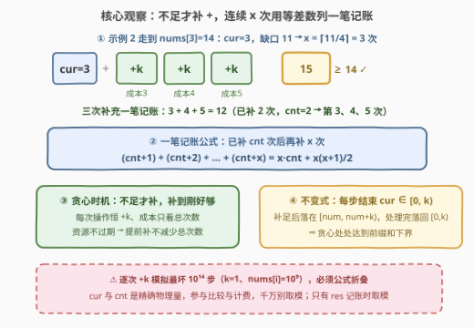
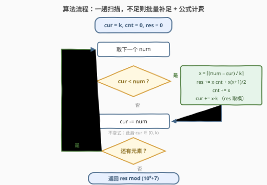

# 处理所有元素的成本

- **题目名称**：处理所有元素的成本
- **链接**：[3987. 处理所有元素的成本](https://leetcode.cn/problems/minimum-total-cost-to-process-all-elements/)
- **难度**：中等
- **标签**：数组、数学、模拟

## 1. 题目概述

给你一个整数数组 `nums` 和一个整数 `k`。初始时你拥有 $k$ 单位**资源**，必须**从左到右**依次处理 `nums` 中的元素，处理第 $i$ 个元素消耗 `nums[i]` 单位资源。

若处理某个元素前**当前资源不足**（$< \text{nums}[i]$），可以执行「补充操作」：每次使资源增加 $k$（$k$ 固定不变）。第 1 次操作成本为 1，第 2 次为 2，依此类推——**第 $j$ 次操作的成本恰为 $j$**。返回处理完所有元素的**最小总成本**，对 $10^9 + 7$ 取模。

**示例 1**：

```text
输入：nums = [1,2,3,4], k = 4
输出：3
解释：处理 1、2 后剩 1；处理 3 前不足，补 1 次（成本 1），剩 1+4-3=2；
      处理 4 前不足，补 1 次（成本 2）。总成本 1+2 = 3。
```

**示例 2**：

```text
输入：nums = [1,1,7,14], k = 4
输出：15
解释：处理 1、1 后剩 2；处理 7 前补 2 次（成本 1+2=3），剩 2+8-7=3；
      处理 14 前补 3 次（成本 3+4+5=12）。总成本 3+12 = 15。
```

**示例 3**：

```text
输入：nums = [1,2,3,4], k = 10
输出：0
解释：初始资源足够处理所有元素，无需任何操作。
```

**约束条件**：

- $1 \le \text{nums.length} \le 10^5$
- $1 \le \text{nums}[i] \le 10^9$
- $1 \le k \le 10^9$

> 💡 **审题关键**：① 操作只有一种效果（资源 $+k$），成本却**随全局执行次数递增**——第 $j$ 次（无论何时执行）恒为 $j$，总成本只由**总次数**决定；② 元素**必须从左到右**处理，补充时机只能在「当前元素处理前」，不存在重排；③ 答案取模，但**资源多少与操作次数必须精确维护**，只有输出才取模。

---

## 2. 解题思路

### 2.1 暴力思路：逐次补充的直译模拟

按题面直译：维护当前资源 `cur`，从左到右扫；一旦 `cur < nums[i]`，就**一次一次**执行 `cur += k`，每执行一次全局计数 `cnt` 加一并累加 `cnt` 到答案，直到够用。逻辑零思考成本，但复杂度爆炸：$k = 1$、$\text{nums}[i] = 10^9$ 时单个元素就要补 $10^9$ 次，$n = 10^5$ 个元素总计约 $10^{14}$ 步——模拟的「步数」是**操作次数**而非元素个数，必须在数学层面把连续 $x$ 次补充折叠成一笔计算。

### 2.2 核心观察：不足才补的贪心 + 等差数列一笔记账



**观察一（贪心正确性：资源不过期，推迟补充不亏）**。总成本 $= 1 + 2 + \cdots + x = \frac{x(x+1)}{2}$ 只依赖总操作次数 $x$，与操作发生的时刻无关。而资源是**单调可攒的**：早补的资源不会过期，晚补也不会更便宜（每次都加 $k$）。于是「提前囤资源」没有任何收益——它不能减少总次数的下界，反而可能白补。**只在 `cur < nums[i]` 的当口补，且一次补到刚好够**，就是最优策略。进一步可以证明（见第 5 节闭式）：任何可行方案处理完前 $i$ 个元素的累计操作数不少于 $\left\lceil \frac{S_i - k}{k} \right\rceil$（$S_i$ 为前缀和，$S_i > k$ 时），贪心恰好处处取等。

**观察二（批量计费：等差数列一笔记账）**。设已执行 `cnt` 次，当前缺口需要再补 $x = \left\lceil \frac{\text{nums}[i] - \text{cur}}{k} \right\rceil$ 次，这 $x$ 次的成本是第 $\text{cnt}+1$ 到第 $\text{cnt}+x$ 次：

$$
(\text{cnt}+1) + (\text{cnt}+2) + \cdots + (\text{cnt}+x) = x \cdot \text{cnt} + \frac{x(x+1)}{2}
$$

一行公式替代 $x$ 次循环（至多 $10^9$ 次），这是本题从 $10^{14}$ 步降到 $O(n)$ 的唯一杠杆。计费后 `cnt += x`、`cur += x·k`，再 `cur -= nums[i]`。

**观察三（不变式：每步结束资源落在 $[0, k)$）**。补足时恰好补到 `cur + x·k ∈ [nums[i], nums[i] + k)`，处理完落在 $[0, k)$；若本来就够（`cur < k` 且 `nums[i] ≥ 1`），处理完同样落回 $[0, k)$。这个不变式说明**资源永远不虚存**——它同时是第 5 节闭式解的证明基石，也是查验实现的快速手测标准。

> 💡 **一句话总结**：从左到右扫一遍，`cur < nums[i]` 时用 $x = \lceil (\text{nums}[i]-\text{cur})/k \rceil$ 算出补充次数，成本 $x \cdot \text{cnt} + \frac{x(x+1)}{2}$ 一笔入账——贪心定时机，等差数列定价格。

### 2.3 算法流程图



| 步骤 | 操作 | 说明 |
|------|------|------|
| ① | `cur = k, cnt = 0, res = 0` | 初始资源 $k$；`cnt` 是**精确**的全局操作计数，不取模 |
| ② | 取下一个 `num`，判断 `cur < num` ? | 资源够则直接跳到 ④，一步不出循环 |
| ③ | `x = ⌈(num - cur)/k⌉`；`res += x·cnt + x(x+1)/2`；`cnt += x`；`cur += x·k` | 批量补足 + 等差数列计费；`res` 随手取模 |
| ④ | `cur -= num` | 消耗当前元素；不变式保证此后 `cur ∈ [0, k)` |
| ⑤ | 还有元素 ? → 回到 ② | 一趟 $O(n)$ |
| ⑥ | 返回 `res mod (10⁹+7)` | 成本只在输出层取模 |

### 2.4 示例演算

以示例 2 `nums = [1,1,7,14], k = 4` 走一遍（建议先自己手推，再用不变式 `cur ∈ [0,4)` 逐行核对）：

| $i$ | nums[i] | cur（处理前） | 不足? | $x$ | 计费 | cnt | cur（处理后） |
|----|---------|--------------|-------|-----|--------------|-----|--------------|
| 0 | 1 | 4 | 否 | — | — | 0 | 3 |
| 1 | 1 | 3 | 否 | — | — | 0 | 2 |
| 2 | 7 | 2 | 是 | $\lceil 5/4 \rceil = 2$ | $1+2=3$ | 2 | $2+8-7=3$ |
| 3 | 14 | 3 | 是 | $\lceil 11/4 \rceil = 3$ | $3+4+5=12$ | 5 | $3+12-14=1$ |

总成本 $3 + 12 = 15$ ✓。示例 1 同法得 $x$ 依次为 $1, 1$，成本 $1 + 2 = 3$；示例 3 全程无缺口，成本 $0$。

---

## 3. 参考代码

### C++（贪心 + 等差数列计费）

```cpp
class Solution {
public:
    int minimumCost(vector<int>& nums, int k) {
        const long long MOD = 1e9 + 7, INV2 = (MOD + 1) / 2;  // 2 的模逆元
        long long cur = k, cnt = 0, res = 0;                  // cnt 精确计数，不取模
        for (int num : nums) {
            if (cur < num) {
                long long x = (num - cur + k - 1) / k;        // 需要补的次数，≥1
                res = (res + x % MOD * (cnt % MOD)) % MOD;    // x·cnt 拆模防溢出
                res = (res + x % MOD * ((x + 1) % MOD) % MOD * INV2) % MOD;  // x(x+1)/2
                cnt += x;
                cur += x * k;
            }
            cur -= num;                                       // 不变式：cur ∈ [0, k)
        }
        return (int)res;
    }
};
```

> 💡 **写法要点**：
> - `cnt` 真实值可达 $n \cdot \max(\text{nums}) / k \approx 10^{14}$，`long long` 可容（上限约 $9.2 \times 10^{18}$），但 `x * cnt` 直接乘会到 $10^{23}$ **溢出**——必须拆成 `(x % MOD) * (cnt % MOD)`；
> - $\frac{x(x+1)}{2}$ 用模逆元 `INV2 = 500000004` 计算，避免 `x+1` 恰为 $10^9+7$ 的倍数时先除后模出错；
> - `cur` 最大约 $\text{nums}[i] + k \le 2 \times 10^9$，超 `int` 范围，`long long` 别省。

### Python（同款一趟版）

```python
class Solution:
    def minimumCost(self, nums: List[int], k: int) -> int:
        MOD = 10 ** 9 + 7
        cur, cnt, res = k, 0, 0
        for num in nums:
            if cur < num:
                x = (num - cur + k - 1) // k      # 需要补的次数
                res += x * cnt + x * (x + 1) // 2 # 大整数直接算，无溢出之忧
                cnt += x
                cur += x * k
            cur -= num
        return res % MOD
```

> 💡 **写法要点**：
> - Python 大整数天然免疫溢出，`x * cnt + x*(x+1)//2` 直接算，最后取一次模即可；
> - 计费公式的**顺序**是坑点：先累加 `cnt += x` 再计费会把本元素的费用错算到下一档，务必「先计费、后更新」；
> - `(num - cur + k - 1) // k` 是向上取整的通用写法，`x` 必然 $\ge 1$（仅在 `cur < num` 分支内）。

---

## 4. 复杂度分析

| 维度 | 复杂度 | 说明 |
|------|--------|------|
| 时间 | $O(n)$ | 每个元素至多触发一次分支，缺口计算与计费均为 $O(1)$；对比逐次模拟的 $O(n \cdot \max(\text{nums}) / k)$（最坏 $10^{14}$） |
| 空间 | $O(1)$ | 只维护 `cur / cnt / res` 三个标量，不随输入规模增长 |

关键在于「循环次数 = 元素个数」而非「操作次数」：等差数列公式把至多 $10^9$ 次连续补充折叠成一次乘加，这是本题复杂度的全部来源。

---

## 5. 扩展：前缀和闭式解与贪心的下界证明

**闭式解**。由不变式「处理完每个元素后 $\text{cur} \in [0, k)$」可以推出：贪心策略下处理完前 $i$ 个元素（前缀和 $S_i$）的累计操作数恰为

$$
\text{cnt}_i = \max\left(0,\ \left\lceil \frac{S_i - k}{k} \right\rceil\right)
$$

而 $\text{cnt}_i$ 随 $i$ 单调不减（前缀和递增），故**总操作次数**就是所有前缀上的最大值，答案一步到位：

```python
class Solution:
    def minimumCost(self, nums: List[int], k: int) -> int:
        MOD, s, x = 10 ** 9 + 7, 0, 0
        for num in nums:
            s += num
            x = max(x, (s - k + k - 1) // k)   # max(0, ⌈(S−k)/k⌉)，S<k 时为非正
        return x * (x + 1) // 2 % MOD
```

**下界证明（贪心最优性的另一面）**。任何可行方案中，处理完前 $i$ 个元素时资源非负：

$$
k + \text{cnt}_i \cdot k - S_i \ge 0 \implies \text{cnt}_i \ge \left\lceil \frac{S_i - k}{k} \right\rceil
$$

对所有 $i$ 取最大值即总次数的下界，而贪心处处取等，故贪心最优。两式互为镜像：不变式给出**可达性**（贪心取到该值），资源非负给出**必要性**（谁也低于该值不可行）——上界与下界夹出唯一答案。

**为什么 871 最低加油次数不能这么算？** 那题的加油站**顺序可选**（路过即可选择加或不加），需要反悔堆/DP 在「何时用哪个油箱」上做决策；本题补充操作**无差别且必须就地**，前缀和下界直接闭合。识别「补充物是否同质、时机是否受限」是这类资源补充题的分水岭。

---

## 6. 面试要点

**Q1：为什么「资源不足才补」的贪心是最优的？提前补一点会不会更省？**

> 不会。每次操作效果恒为 $+k$，成本第 $j$ 次恒为 $j$——总成本只由总次数决定，与时机无关。提前补不能减少总次数（下界 $\max_i \lceil (S_i - k)/k \rceil$ 由前缀和决定，与策略无关），反而可能在「之后根本不缺」的分支里白花次数。资源不过期 + 操作同质，推迟到必要时刻永远不亏。

**Q2：逐次模拟为什么会超时？差多少？**

> 模拟的步数是**操作总次数**而非 $n$：$k=1$、$\text{nums}[i]=10^9$、$n=10^5$ 时约 $10^{14}$ 步。等差数列公式把连续 $x$ 次补充折叠成 $x \cdot \text{cnt} + \frac{x(x+1)}{2}$ 一次乘加，步数降回元素个数 $n$。面试中先指出「循环变量是谁」这一步，比直接写公式更加分。

**Q3：取模有哪些坑？哪些量不能取模？**

> 三个层次：① `cur` 与 `cnt` 是**物理量**，参与后续比较与计费，绝不能取模；② `res` 是账面量，随时取模安全；③ 计费时 `x·cnt` 在 C++ 中可达 $10^{23}$ 溢出 `long long`，须拆成 `(x % MOD) * (cnt % MOD)`；$\frac{x(x+1)}{2}$ 用模逆元 500000004。判断 `cur < num` 用的是精确值，取模只发生在「记账」层面。

**Q4：`cnt` 最大能到多少？`long long` 装得下吗？**

> `cnt` 上界 $\approx \sum \text{nums}[i] / k \le 10^5 \times 10^9 = 10^{14}$，`long long`（约 $9.2 \times 10^{18}$）安全；但 `cnt` 与 $x$（至多 $10^9$）**相乘**即溢出，这就是 Q3 拆模的原因。`cur` 上界约 $\text{nums}[i] + k \le 2 \times 10^9$，超 `int`，C++ 中需 `long long`。

**Q5：本题和「最低加油次数」（871）看起来一样，解法差在哪？**

> 模型同为「资源不足时补充」，但 871 的加油站**各有油量、路过可选**，本质是「顺序约束下的选择」问题，用最大堆反悔贪心或 DP；本题补充操作**同质（恒 +k）、成本随次数递增、时机受限（就地）」，前缀和直接给出总次数的闭式。判断标准：补充物是否无差别、能否推迟或挑选——能挑选就是堆/DP，无差别就地补就是前缀和一步算。

> 💡 **一句话总结**：贪心定时机（不足才补）、等差数列定价格（$x \cdot \text{cnt} + \frac{x(x+1)}{2}$）、闭式定本质（$\max_i \lceil (S_i - k)/k \rceil$ 次操作）——三件套里唯一的新知识是把「连续 $x$ 次同质操作」折叠成一笔记账。

---

## 7. 同类练习题

- [871. 最低加油次数](https://leetcode.cn/problems/minimum-number-of-refueling-stops/)（[题解](../0801-0900/871_最低加油次数.md)）：同为「资源不足时补充」，但加油站各不相同、路过可选——反悔堆与本题无差别补充的分水岭
- [1894. 找到需要补充粉笔的学生编号](https://leetcode.cn/problems/find-the-student-that-will-replace-the-chalk/)（[题解](../1801-1900/1894_找到需要补充粉笔的学生.md)）：循环消耗资源的模拟，前缀和 + 取余定位，练「物理量不取模」的边界感
- [1413. 逐步求和得到正数的最小值](https://leetcode.cn/problems/minimum-value-to-get-positive-step-by-step-sum/)（[题解](../1401-1500/1413_逐步求和得到正数的最小值.md)）：前缀和最小值反推初始量的闭式修正，与本文第 5 节闭式解同构
- [2028. 找出缺失的观测数据](https://leetcode.cn/problems/find-missing-observations/)（[题解](../2001-2100/2028_找出缺失的观测数据.md)）：总和约束下的分配模拟，「数学折叠掉循环」的又一实例
