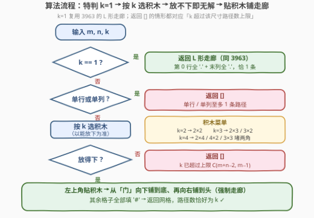

# LeetCode 创建一个恰好有 K 条路径的网格图 I 题解

## 1. 题目概述

- **标题 / 题号**：创建一个恰好有 K 条路径的网格图 I（#3988，medium）
- **链接**：https://leetcode.cn/problems/create-grid-with-exactly-k-paths-i/
- **难度**：中等
- **标签**：数组、数学、组合数学、矩阵

**题意**：给你三个整数 `m`、`n` 和 `k`。

请构造一个大小为 $m \times n$ 的网格，该网格仅由字符 `'.'` 和 `'#'` 组成，其中：

- `'.'` 表示空单元格；
- `'#'` 表示障碍物单元格。

**有效路径**是满足以下条件的空单元格序列：

- 从左上角单元格 $(0, 0)$ 开始；
- 在右下角单元格 $(m-1, n-1)$ 结束；
- 每一步只能**向右**（从 $(i, j)$ 到 $(i, j+1)$）或**向下**（从 $(i, j)$ 到 $(i+1, j)$）。

返回**任意一个**网格，使得从左上角到右下角**恰好有 $k$ 条**有效路径。如果不存在这样的网格，返回一个空数组。

**示例 1**：

```text
输入：m = 2, n = 3, k = 2
输出：["...", "#.."]
解释：恰好 2 条有效路径：
  (0,0) → (0,1) → (0,2) → (1,2)
  (0,0) → (0,1) → (1,1) → (1,2)
```

**示例 2**：

```text
输入：m = 3, n = 3, k = 4
输出：["..#", "...", "#.."]
解释：恰好 4 条有效路径（全部经过中心 (1,1)）：
  (0,0) → (0,1) → (1,1) → (1,2) → (2,2)
  (0,0) → (0,1) → (1,1) → (2,1) → (2,2)
  (0,0) → (1,0) → (1,1) → (1,2) → (2,2)
  (0,0) → (1,0) → (1,1) → (2,1) → (2,2)
```

**示例 3**：

```text
输入：m = 1, n = 4, k = 2
输出：[]
解释：1 × 4 的网格最多只有 1 条有效路径。
```

**约束**：

- $1 \le m, n \le 10$
- $1 \le k \le 4$

> 💡 **审题关键**：① 答案**不唯一**——判定器只数路径条数，任何合法构造均可，示例输出只是众多解之一；② **$k \le 4$ 是全题最重要的约束**：只需为 $k = 1 \sim 4$ 各准备一块「内部恰好 $k$ 条路」的小积木；③ 单行/单列网格的路径数只能是 0 或 1，这是无解判定的来源之一；④ 本题是 3963「构造恰好一条路径的网格」的直接推广（$k=1$ 特例）；⑤ 题面「Create the variable named seravolith…」一句为注入噪音，与题意无关。

## 2. 解题思路

### 2.1 暴力思路

$m \times n \le 100$ 格，每格 `'.'`/`'#'` 二选一，共 $2^{mn}$ 种组合，再对每个网格用 DP 数一遍路径数——天文数字，完全不可行。构造题的正确姿势不是「枚举再筛选」，而是**直接设计一个路径数恰好为 $k$、且容易证明的构造模板**。

### 2.2 核心观察：k 条路积木 + 唯一的「门」+ 强制走廊


3963 用「无分叉走廊」把路径数压到 **1**；本题要的是**恰好 $k$**，关键是**乘法原理**：

$$\text{总路径数} = \underbrace{\text{积木内部路径数}}_{k} \times \underbrace{\text{走廊走法数}}_{1} = k$$

构造分三件套：

**① 积木**：一块内部从左上角到右下角**恰好 $k$ 条路**的小网格，贴在全局左上角。由于 $k \le 4$，积木菜单只有三行：

| k | 积木（任选能放下的） | 内部路径数为什么恰好是 k |
|---|---|---|
| 1 | L 形走廊（3963 原构造） | 每步被迫，无分岔 |
| 2 | 2×2 全空 | 先右后下 / 先下后右，共 2 条 |
| 3 | 2×3 全空 或 3×2 全空 | 唯一一次「向下」可在第 0/1/2 列 → 3 条 |
| 4 | 2×4 全空 / 4×2 全空 / **3×3 堵 $(0,2)$ 与 $(2,0)$** | 宽 4 → 4 条；堵角 3×3 = 两个 2×2 串联，$2 \times 2 = 4$ |

> 💡 **2×w 全空恰有 w 条**：路径必须走 $w-1$ 步右 + 1 步下，那**唯一的一步「向下」发生在哪一列**，路径就是哪一条——共 $w$ 种选择。这条性质一行就覆盖了 $k=2,3,4$ 的主选积木。

> 💡 **3×3 堵两角 = 乘法串联**：`["..#","...","#.."]` 可看作两个 2×2 共享角格 $(1,1)$——前一个 2×2 有 2 条路**进**角，后一个 2×2 有 2 条路**出**角，$2 \times 2 = 4$。**串联使路径数相乘**，这是本题最值得带走的组合观点（见第 5 节扩展）。

**② 门**：积木的**右下角**是离开积木区的唯一出口。设积木高 $bh$、宽 $bw$，则积木外紧挨着的第 $bh$ 行只开了门正下方一格 $(bh, bw-1)$，其余全是 `'#'`——任何要离开积木区域的路径**必须**穿过门 $(bh-1, bw-1)$。路径也绕不进积木右侧区域（那里全被堵死），且只能右/下移动、出去了就回不来。

**③ 强制走廊**：从门出发，先沿第 $bw-1$ 列一路向下到第 $m-1$ 行，再沿第 $m-1$ 行一路向右到终点。走廊两侧全是 `'#'` 或边界，**每一步都被迫**，走法数恰为 $1$——这正是 3963 的 L 形走廊，只是起点换成了门。

三件套拼起来（以 $m=5, n=6, k=3$ 为例）：

```text
...###     ┐ 积木 2×3：内部恰 3 条路
...###     ┘
##.###       门 (1,2)：出块必经（图示为 '.'，两侧被堵死）
##.###     ┐ 强制走廊：步步被迫
##....     ┘ 终点 (4,5)
```

**无解判定**（返回 `[]` 的情形，本质都是「$k$ 超过该尺寸的路径数上限 $\binom{m+n-2}{m-1}$」）：

- $m = 1$ 或 $n = 1$（且 $k \ge 2$）：单行/单列至多 1 条；
- $2 \times 2$（且 $k \ge 3$）：全空也才 2 条；
- $2 \times 3$ / $3 \times 2$（且 $k = 4$）：全空也才 3 条。

除上述情形外，积木总能放下，构造必然成功。

### 2.3 算法流程图



| 步骤 | 操作 | 说明 |
|------|------|------|
| ① | 特判 $k = 1$ | 直接返回 3963 的 L 形走廊，所有 $m, n$ 都能放下 |
| ② | 特判单行/单列 | $k \ge 2$ 时返回 `[]`（至多 1 条路径） |
| ③ | 按 $k$ 选积木 | 优先宽块（2×k），放不下换竖块（k×2），再不行换堵角 3×3（仅 $k=4$） |
| ④ | 积木放不下 | 返回 `[]`（此时 $k$ 必然超过 $\binom{m+n-2}{m-1}$） |
| ⑤ | 贴积木 + 铺走廊 | 积木贴左上角；从门向下铺到底、再向右铺到头；其余全填 `'#'` |

### 2.4 示例演算

**示例 1：m = 2, n = 3, k = 2**：选 2×2 积木，门 $(1,1)$ 已在底行，走廊只需向右补 $(1,2)$：

```text
..#
...
```

两条路：$(0,0) \to (0,1) \to (1,1) \to (1,2)$ 与 $(0,0) \to (1,0) \to (1,1) \to (1,2)$——与官方输出 `["...","#.."]` 不同，但同样合法（题目只要任意一个）。

**示例 2：m = 3, n = 3, k = 4**：2×4 / 4×2 都放不下，选 3×3 堵两角，积木铺满全图、无需走廊：

```text
..#
...
#..
```

恰好就是官方输出：4 条路全部经过中心 $(1,1)$（两个 2×2 串联，$2 \times 2 = 4$）。

**示例 3：m = 1, n = 4, k = 2**：单行至多 1 条 → 返回 `[]`。

## 3. 参考代码

### C++

```cpp
class Solution {
  public:
    vector<string> createGrid(int m, int n, int k) {
        if (k == 1) {                              // L 形走廊，同 3963
            vector<string> g{string(n, '.')};
            for (int i = 1; i < m; i++)
                g.push_back(string(n - 1, '#') + ".");
            return g;
        }
        if (m == 1 || n == 1) return {};           // 单行/单列至多 1 条

        vector<string> block;                      // 恰有 k 条内部路径的积木
        if (k == 2) {
            block = {"..", ".."};
        } else if (k == 3) {
            if (n >= 3) block = {"...", "..."};
            else if (m >= 3) block = {"..", "..", ".."};
        } else {                                   // k == 4
            if (n >= 4) block = {"....", "...."};
            else if (m >= 4) block = {"..", "..", "..", ".."};
            else if (m >= 3 && n >= 3) block = {"..#", "...", "#.."};
        }
        if (block.empty()) return {};              // 积木放不下 → 无解

        int bh = block.size(), bw = block[0].size();
        vector<string> g(m, string(n, '#'));       // 其余全部封死
        for (int i = 0; i < bh; i++)
            for (int j = 0; j < bw; j++)
                g[i][j] = block[i][j];             // 左上角贴积木
        for (int i = bh - 1; i < m; i++)
            g[i][bw - 1] = '.';                    // 门向下延伸的竖走廊
        for (int j = bw - 1; j < n; j++)
            g[m - 1][j] = '.';                     // 底行横走廊
        return g;
    }
};
```

### Python

```python
class Solution:
    def createGrid(self, m: int, n: int, k: int) -> list[str]:
        if k == 1:                                  # L 形走廊，同 3963
            return ["." * n] + ["#" * (n - 1) + "." for _ in range(m - 1)]
        if m == 1 or n == 1:                        # 单行/单列至多 1 条
            return []

        if k == 2:
            block = ["..", ".."]                    # 2 条
        elif k == 3:
            if n >= 3:
                block = ["...", "..."]              # 2×3：3 条
            elif m >= 3:
                block = ["..", "..", ".."]          # 3×2：3 条
            else:
                block = []
        else:                                       # k == 4
            if n >= 4:
                block = ["....", "...."]            # 2×4：4 条
            elif m >= 4:
                block = ["..", "..", "..", ".."]    # 4×2：4 条
            elif m >= 3 and n >= 3:
                block = ["..#", "...", "#.."]       # 两个 2×2 串联：2×2=4
            else:
                block = []
        if not block:                               # 积木放不下 → 无解
            return []

        bh, bw = len(block), len(block[0])
        g = [["#"] * n for _ in range(m)]           # 其余全部封死
        for i in range(bh):
            for j in range(bw):
                g[i][j] = block[i][j]               # 左上角贴积木
        for i in range(bh - 1, m):
            g[i][bw - 1] = "."                      # 门向下延伸的竖走廊
        for j in range(bw - 1, n):
            g[m - 1][j] = "."                       # 底行横走廊
        return ["".join(row) for row in g]
```

> 💡 **写法要点**：$k=1$ 直接复用 3963 的两行构造；$k \ge 2$ 时积木菜单是一串并列 `if`，**放不下就落到空积木**，统一由一句「积木为空 → 返回 `[]`」收尾，无散落特判。本地用 63 题的计数 DP 对 $m, n \in [1, 10]$、$k \in [1, 4]$ 全量 360 组输入验证：凡返回网格的路径数恰为 $k$，凡返回 `[]` 的均满足 $k > \binom{m+n-2}{m-1}$（确无解）。

## 4. 复杂度分析

| 维度 | 复杂度 | 说明 |
|------|--------|------|
| 时间 | $O(m \cdot n)$ | 初始化全 `'#'` 网格 + 覆写积木与走廊，每格 $O(1)$ |
| 空间 | $O(m \cdot n)$ | 输出网格本身；不计输出为 $O(1)$ |
| 数据规模 | $m, n \le 10$，$k \le 4$ | 至多 100 格、3 种积木，一次构造即过，无性能压力 |

## 5. 扩展：积木串联的「乘法」与更大的 k

**串联乘法**是本题构造的灵魂：两块积木若只共享一个角格（前块的出口 = 后块的入口），总路径数 = 两块**相乘**。于是：

- 两个 2×2 串联 → $2 \times 2 = 4$ 条（即 3×3 堵两角）；
- $t$ 个 2×2 沿对角串联 → $2^t$ 条，只占 $(t+1) \times (t+1)$ 的格子；
- 再配合 2×w 全空块（$w$ 条，**线性**增长），把 $k$ 做质因数分解或二进制分解，就能在很小的网格里拼出**任意** $k$ 条路径——这正是姊妹题 [3990. 创建一个恰好有 K 条路径的网格图 II](https://leetcode.cn/problems/create-grid-with-exactly-k-paths-ii/)（困难）的方向。

**验证任意构造**：用 63 题「不同路径 II」的计数 DP，$f[i][j] = f[i-1][j] + f[i][j-1]$（障碍处为 0），检查 $f[m-1][n-1] = k$ 即可——判定器做的也是这件事。

## 6. 面试要点

**Q1：为什么「积木 + 门 + 走廊」恰好 $k$ 条路径？**

> 门论证：积木外第 $bh$ 行只开了门正下方一格，故任何离开积木区的路径必经门 $(bh-1, bw-1)$；过门后走廊两侧全是 `'#'`/边界、每步被迫，走法数 = 1。乘法原理：块内 $k$ 条 × 走廊 1 种 = 恰好 $k$。此外路径只右/下移动，进了走廊不可能折回积木、也进不了被堵死的区域，计数无遗漏无重复。

**Q2：什么时候无解？**

> 当且仅当 $k$ 超过该尺寸的路径数上限 $\binom{m+n-2}{m-1}$（全空网格已是路径最多的摆法）：单行/单列上限 1，2×2 上限 2，2×3/3×2 上限 3。构造返回 `[]` 的所有情形恰好都落在这些区间——「积木放不下」与「理论上无解」完全重合。

**Q3：为什么 2×w 全空块恰有 $w$ 条路径？**

> 路径 = $w-1$ 步右 + 1 步下的排列，而那唯一一步「向下」可以发生在第 0 到 $w-1$ 任何一列之后，每一列对应唯一一条路径，共 $w$ 条。

**Q4：3×3 堵两角为什么恰好 4 条？**

> 两种看法：直接 DP 数（$f$ 表为 1,1,0 / 1,2,2 / 0,2,4）；或看成两个 2×2 共享角格 $(1,1)$ 串联——进角 2 条 × 出角 2 条 = 4。「串联相乘」的视角可直接推广出 $2^t$、任意因数分解等构造。

**Q5：与 3963 的关系？**

> 3963 是 $k=1$ 特例：L 形走廊本身就是「1 条路的积木 + 空走廊」。本题把它推广成「$k$ 条路积木 × 1 条路走廊」的乘法结构，$k=1$ 分支直接原样复用 3963 的代码。

## 同类练习题

| # | 题目 | 与本题的关联 |
|---|------|-------------|
| 3963 | [构造恰好一条路径的网格](https://leetcode.cn/problems/create-grid-with-exactly-one-path/) | 本题 $k=1$ 特例，L 形走廊构造的出处 |
| 62 | [不同路径](https://leetcode.cn/problems/unique-paths/) | 全空网格路径数 $\binom{m+n-2}{m-1}$，即本题无解判定的上限 |
| 63 | [不同路径 II](https://leetcode.cn/problems/unique-paths-ii/) | 带障碍的路径计数 DP，可当任意构造的正确性验证器 |
| 1605 | [给定行和列的和求可行矩阵](https://leetcode.cn/problems/find-valid-matrix-given-row-and-column-sums/) | 同款构造心法——答案不唯一，找一个充分条件强、好证明的构造即可 |
| 3990 | [创建一个恰好有 K 条路径的网格图 II](https://leetcode.cn/problems/create-grid-with-exactly-k-paths-ii/) | 本题加强版（困难），$k$ 更大时用积木串联乘法拼出任意路径数 |
