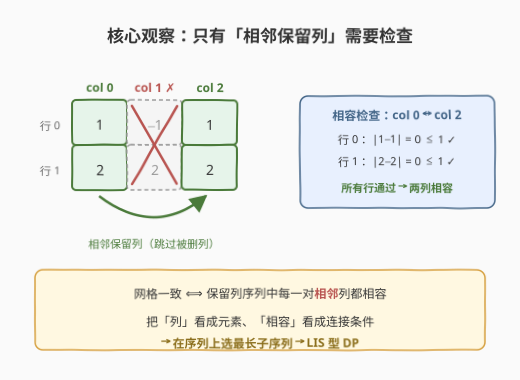
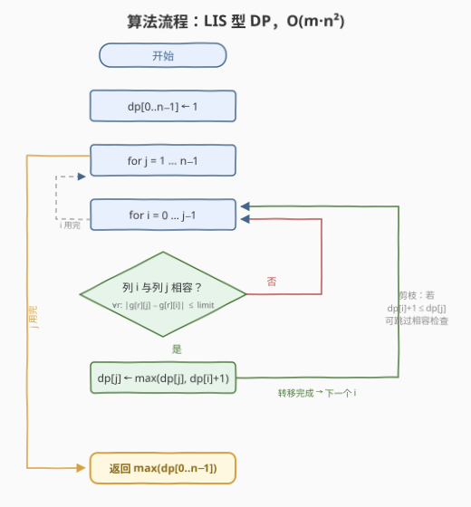

# LeetCode 网格中保持一致的最大列数 题解

## 1. 题目概述

- **标题 / 题号**：网格中保持一致的最大列数（#3989，hard）
- **链接**：https://leetcode.cn/problems/maximum-consistent-columns-in-a-grid/
- **难度**：困难
- **标签**：数组、动态规划、矩阵

**题意**：给你一个大小为 $m \times n$ 的二维整数数组 `grid`，和一个整数 `limit`。

你可以从网格中移除零个或多个列，但必须**至少保留一列**，且剩余列的**相对顺序保持不变**。

如果对于**每一行** $i$，以及**每一对相邻的剩余列** $a$ 和 $b$（其中 $a < b$），都满足

$$|\text{grid}[i][b] - \text{grid}[i][a]| \le \text{limit}$$

则称该网格是**一致**的。返回网格成为一致网格所能保留的**最大**列数。

**示例 1**：

```text
输入：grid = [[-2,0,3]], limit = 2
输出：2
解释：移除列 2 并保留列 0 和列 1，
     |grid[0][1] − grid[0][0]| = |0 − (−2)| = 2 ≤ 2，一致。
```

**示例 2**：

```text
输入：grid = [[1,-1,1],[2,2,2]], limit = 1
输出：2
解释：移除列 1 并保留列 0 和列 2，
     |1−1| = 0 ≤ 1 且 |2−2| = 0 ≤ 1，一致。
```

**示例 3**：

```text
输入：grid = [[-5,5]], limit = 9
输出：1
解释：|5 − (−5)| = 10 > 9，两列无法共存，只能保留一列。
```

**约束**：

- $1 \le m = \text{grid.length} \le 250$
- $1 \le n = \text{grid[i].length} \le 250$
- $-10^5 \le \text{grid[i][j]} \le 10^5$
- $0 \le \text{limit} \le 10^5$

> 💡 **审题关键**：① 「移除列 + 保序」= 在列序列 $0..n-1$ 上**选子序列**；② 合法性只约束**相邻**的保留列——不相邻的保留列之间差值再大也无所谓；③ 「至少保留一列」保证答案 $\ge 1$，且 $n=1$ 时直接返回 1；④ $m, n \le 250$ 暗示 $O(m \cdot n^2) \approx 1.6 \times 10^7$ 的立方级做法就是预期复杂度。

## 2. 解题思路

### 2.1 暴力思路：枚举列子集

最直接的想法是枚举保留列集合的所有 $2^n$ 个子集，对每个子集按原顺序取出列，逐行检查所有相邻对是否满足约束。单次检查 $O(m \cdot n)$，总复杂度 $O(2^n \cdot m \cdot n)$——$n = 250$ 时指数爆炸，完全不可行。

问题出在「按集合枚举」无视了**顺序天然固定**这一结构：列只能按原下标顺序保留，合法性与否又只取决于相邻对。这正是**子序列型 DP**（最长递增子序列 LIS 的推广）的标志。

### 2.2 核心观察：LIS 型动态规划



**观察一（二元关系「相容」）**：定义两列 $a < b$ **相容**，当且仅当**每一行**都满足 $|\text{grid}[r][b] - \text{grid}[r][a]| \le \text{limit}$。相容与否只取决于这两列自身的 $m$ 个数对，与保留序列里的其他列无关。

**观察二（合法性 = 相邻对相容）**：一个保留列序列合法，当且仅当序列中**每对相邻保留列**都相容。于是「最多保留多少列」=「在序列 $0..n-1$ 上找最长的子序列，使得相邻两项满足二元关系『相容』」——这就是把 LIS 中的「$<$」替换成「相容」的**LIS 直接推广**。

**观察三（DP 定义与转移）**：与 LIS 完全同构：

$$\text{dp}[j] = \text{以列 } j \text{ 结尾的最长合法保留列数}$$

$$\text{dp}[j] = \max\bigl(1,\ \max_{\substack{i < j \\ \text{列 } i \text{ 与列 } j \text{ 相容}}} (\text{dp}[i] + 1)\bigr)$$

答案为 $\max_j \text{dp}[j]$。转移中每对 $(i, j)$ 的相容检查代价 $O(m)$。

> 💡 **一句话总结**：列是元素、「相容」是连接边、保序是子序列方向——题目本质是**二元关系上的最长子序列**，照抄 LIS 的 $O(n^2)$ DP，把 `nums[i] < nums[j]` 换成「$O(m)$ 检查两列相容」即可。

### 2.3 算法流程图



| 步骤 | 操作 | 说明 |
|------|------|------|
| ① | `dp[0..n−1] ← 1` | 每列单独成序列，长度至少为 1 |
| ② | 外层循环 $j = 1 \dots n-1$ | 枚举子序列结尾列 |
| ③ | 内层循环 $i = 0 \dots j-1$ | 枚举倒数第二列（保序要求 $i < j$） |
| ④ | 剪枝：`dp[i]+1 ≤ dp[j]` 则跳过 | 转移不可能更优时，省掉 $O(m)$ 的相容检查 |
| ⑤ | 相容检查：所有行 $r$ 满足 $\|\text{grid}[r][j] - \text{grid}[r][i]\| \le \text{limit}$ | 任一行超限立即短路退出 |
| ⑥ | 相容则 `dp[j] ← max(dp[j], dp[i]+1)` | LIS 标准转移 |
| ⑦ | 循环结束，返回 `max(dp)` | 至少保留一列，`dp` 恒非空 |

### 2.4 示例演算

**示例 2**：`grid = [[1,-1,1],[2,2,2]]`，`limit = 1`。把每列看成一个竖向量：

| 列对 $(i,j)$ | 逐行检查 | 相容？ |
|-------------|----------|--------|
| $(0,1)$ | 行 0：$\|-1-1\| = 2 > 1$ ✗ | 否（行 0 超限，短路） |
| $(0,2)$ | 行 0：$\|1-1\| = 0$；行 1：$\|2-2\| = 0$ | **是** |
| $(1,2)$ | 行 0：$\|1-(-1)\| = 2 > 1$ ✗ | 否 |

DP 过程：

| $j$ | 候选转移 | dp[$j$] |
|-----|----------|---------|
| 0 | （初始） | 1 |
| 1 | $i=0$ 不相容 | 1 |
| 2 | $i=0$ 相容 → $\text{dp}[0]+1=2$；$i=1$ 不相容 | **2** |

答案 $\max(\text{dp}) = 2$，即保留列 0 和列 2、删除列 1，与示例解释一致。

**示例 3**：`grid = [[-5,5]]`，`limit = 9`。唯一列对 $(0,1)$：$\|5-(-5)\| = 10 > 9$ 不相容，`dp = [1,1]`，答案 1。

## 3. 参考代码

### C++

```cpp
class Solution {
  public:
    int maxConsistentColumns(vector<vector<int>>& grid, int limit) {
        int m = grid.size(), n = grid[0].size();
        vector<int> dp(n, 1);                     // ① dp[j]：以列 j 结尾的最长合法保留列数
        for (int j = 1; j < n; ++j) {             // ② 枚举结尾列
            for (int i = 0; i < j; ++i) {         // ③ 枚举前一列（保序：i < j）
                if (dp[i] + 1 <= dp[j]) continue; // ④ 剪枝：转移不可能更优
                bool ok = true;                   // ⑤ 相容检查 O(m)，逐行短路
                for (int r = 0; r < m; ++r) {
                    if (abs(grid[r][j] - grid[r][i]) > limit) {
                        ok = false;
                        break;
                    }
                }
                if (ok) dp[j] = dp[i] + 1;        // ⑥ LIS 标准转移
            }
        }
        return *max_element(dp.begin(), dp.end()); // ⑦ 答案
    }
};
```

> 💡 **写法要点**：
> - 剪枝 `dp[i] + 1 <= dp[j]` 放在 $O(m)$ 相容检查**之前**，且从左往右枚举 $i$ 时 `dp[j]` 单调不减，平均能省掉大量行扫描；
> - 相容检查遇超限行**立即 break**，实际常数远小于理论上界；
> - `abs` 的参数是 `int`（差值范围 $[-2\times10^5, 2\times10^5]$），无溢出风险；
> - 不必预存 $n^2$ 的相容矩阵——内联检查总时间相同，空间却从 $O(n^2)$ 降到 $O(n)$。

### Python

```python
class Solution:
    def maxConsistentColumns(self, grid: List[List[int]], limit: int) -> int:
        m, n = len(grid), len(grid[0])
        dp = [1] * n                                   # ① dp[j]：以列 j 结尾的最长长度
        for j in range(1, n):                          # ② 枚举结尾列
            for i in range(j):                         # ③ 枚举前一列
                if dp[i] + 1 <= dp[j]:                 # ④ 剪枝
                    continue
                if all(abs(grid[r][j] - grid[r][i]) <= limit   # ⑤ 相容检查（生成器短路）
                       for r in range(m)):
                    dp[j] = dp[i] + 1                  # ⑥ 转移
        return max(dp)                                 # ⑦ 答案
```

> 💡 **写法要点**：`all(...)` 配生成器表达式天然短路——第一行超限就不会评估后续行；若追求更快可 `zip` 两列：`all(abs(b - a) <= limit for a, b in zip((row[i] for row in grid), (row[j] for row in grid)))`，但可读性略降。

## 4. 复杂度分析

| 维度 | 复杂度 | 说明 |
|------|--------|------|
| 时间 | $O(m \cdot n^2)$ | 列对 $O(n^2)$ 个，每对相容检查 $O(m)$；最坏 $250^3 \approx 1.56 \times 10^7$，剪枝 + 短路后实际更快 |
| 空间 | $O(n)$ | 仅 `dp` 数组（内联相容检查，不存 $n^2$ 相容矩阵） |
| 答案规模 | $\le n \le 250$ | 返回值恒为正整数，无溢出问题 |

## 5. 扩展：为什么 $O(n\log n)$ 的 LIS 套不上 & 两个变体

**贪心 + 二分为什么失效**：经典 LIS 的 $O(n\log n)$ 优化依赖「$<$ 是**传递**的全序」，由此得到**支配性**——尾元素更小的链绝不会更差，于是每个长度只需保留一个「最小尾」，二分维护。而本题的相容关系**不传递**：取一行数据 $[0, 2, 4]$、`limit = 2`，列 $0$ 与列 $1$ 相容、列 $1$ 与列 $2$ 相容，但列 $0$ 与列 $2$ 不相容（$\|4-0\| = 4 > 2$）。后果有两个：其一，$0 \to 1 \to 2$ 全保留合法，而**删掉中间列让 $0$、$2$ 直接相邻反而非法**——「删除元素绝不破坏合法性」这一 LIS 的基本事实在这里失效；其二，两个链尾 $t_1, t_2$ 谁更利于未来延伸，取决于**尚未出现的列**（未来的列可能与 $t_1$ 相容而与 $t_2$ 不相容），无法在当下比较，$m$ 维的「尾」也压不成一个可二分的标量。没有支配性就维护不出「各长度最优尾」，二分无从谈起。**非传递二元关系上的最长子序列，$O(n^2)$ DP 目前就是标准解法。**

**变体一（limit = 0）**：相容退化为「两列**逐行完全相等**」。此时可用哈希把每列编码成 $m$ 元组，`dp[j] = dp[上一次出现相同列] + 1`，一趟扫描 $O(m \cdot n)$——这是本题在极端参数下的特例加速。

**变体二（更大数据范围的相容判断）**：若 $m$ 很大，可把每列看成 $\mathbb{Z}^{m}$ 中的点，相容即 $L_\infty$ 距离 $\le \text{limit}$。工程上可将行按位打包成若干个 64 位字（bitset），对固定列对 $(i,j)$ 用逐字比较 + SIMD 思想把 $O(m)$ 的常数压缩约 64 倍；本题规模下无此必要。

## 6. 面试要点

**Q1：这题为什么是 LIS 变形？映射关系是什么？**

> LIS 的三要素：元素序列（这里是列 $0..n-1$）、保序选取（移除列但相对顺序不变）、相邻约束（LIS 是 $\text{nums}[i] < \text{nums}[j]$，这里是「两列相容」）。三者齐备，$O(n^2)$ 子序列 DP 直接照搬。

**Q2：相容关系为什么不能支持 $O(n\log n)$ 优化？**

> 相容关系**不传递**：$[0,2,4]$、`limit=2` 时 $0\sim1$、$1\sim2$ 相容但 $0\sim2$ 不相容。贪心 + 二分依赖「尾元素更小的链不会更差」这种由全序传递性导出的**支配性**；这里两列相容与否取决于 $m$ 维向量的逐行接近程度，两个链尾谁更利于未来延伸要看尚未出现的列，支配性不存在，只能 $O(n^2)$ 枚举所有列对。

**Q3：复杂度怎么估？250 的立方会不会超时？**

> 时间 $O(m \cdot n^2) = 250 \times 250^2 \approx 1.56 \times 10^7$ 基本操作，配合「剪枝先行 + 逐行短路」两个常数优化，在 C++ 下毫秒级、Python 下也在百毫秒量级，远低于典型 1–2 秒限制。数据范围 $m, n \le 250$ 本身就是出题人给出的复杂度暗示。

**Q4：剪枝 `dp[i]+1 <= dp[j]` 为什么正确？**

> 转移的意义是用 $\text{dp}[i]+1$ 去刷新 $\text{dp}[j]$；若 $\text{dp}[i]+1 \le \text{dp}[j]$，这次转移**不可能**提高 $\text{dp}[j]$，做 $O(m)$ 的相容检查纯属浪费。把它放在相容检查之前，能用 $O(1)$ 挡掉大量昂贵检查，且不影响正确性——被挡掉的转移本来就不会改变 `dp[j]`。

**Q5：为什么不相容矩阵要内联检查而不是预计算？**

> 预计算 `ok[a][b]` 需要 $O(n^2)$ 空间（$250^2$ 约 6 万布尔，其实也不大），并把相容检查与 DP 转移解耦；内联检查总时间同为 $O(m \cdot n^2)$、额外空间仅 $O(n)$，还天然享受「剪枝跳过整段检查」的红利——剪枝命中时连相容检查都省了。除非同一对列要被反复查询（本题不会），内联更优。

## 同类练习题

| # | 题目 | 与本题的关联 |
|---|------|-------------|
| 300 | [最长递增子序列](https://leetcode.cn/problems/longest-increasing-subsequence/) | 本题的「祖先模板」，体会 $O(n^2)$ DP → $O(n\log n)$ 贪心二分的完整链条，以及后者为何依赖传递性 |
| 960 | [删列造序 III](https://leetcode.cn/problems/delete-columns-to-make-sorted-iii/) | 同为「删列保序使剩余满足条件」，约束换成「每行子序列非降」，与本题主线几乎互换场景 |
| 354 | [俄罗斯套娃信封问题](https://leetcode.cn/problems/russian-doll-envelopes/) | 二维约束下的 LIS，练习「多维偏序如何降维成可传递的一维比较」 |
| 1691 | [堆叠长方体的最大高度](https://leetcode.cn/problems/maximum-height-by-stacking-cuboids/) | 把「相容」换成「三边均可嵌套」，仍是二元关系上选子序列 + DP |
| 1048 | [最长字符串链](https://leetcode.cn/problems/longest-string-chain/) | 「后继关系」不传递场景下的最长链 DP，与本题一样只能 $O(n^2)$ 枚举对 |
