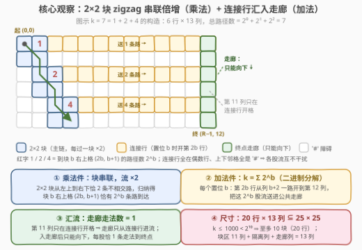
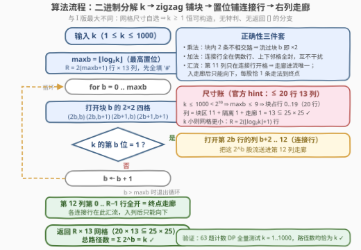

# 创建一个恰好有 K 条路径的网格图 II

- **题目名称**：创建一个恰好有 K 条路径的网格图 II
- **链接**：[3990. 创建一个恰好有 K 条路径的网格图 II](https://leetcode.cn/problems/create-grid-with-exactly-k-paths-ii/)
- **难度**：困难
- **标签**：位运算、数组、数学、组合数学、矩阵

## 1. 题目概述

> ⚠️ 本题为 LeetCode 付费题，题意描述根据官方示例用例与 hints 重建，可能与官方题面有出入（尤其是网格尺寸上限的确切口径）。核心设定与免费的 I 版 [3988](https://leetcode.cn/problems/create-grid-with-exactly-k-paths-i/) 一致，可对照阅读。

给你一个整数 $k$。

请构造一个只包含字符 `'.'` 和 `'#'` 的网格，其中：

- `'.'` 表示空单元格；
- `'#'` 表示障碍物单元格；
- 网格的行数、列数均不超过 $25$。

**有效路径**是满足以下条件的空单元格序列：

- 从左上角单元格 $(0, 0)$ 开始；
- 在右下角单元格 $(m-1, n-1)$ 结束；
- 每一步只能**向右**（从 $(i, j)$ 到 $(i, j+1)$）或**向下**（从 $(i, j)$ 到 $(i+1, j)$）。

返回**任意一个**网格，使得从左上角到右下角**恰好有 $k$ 条**有效路径。

**示例 1**（可行输出之一，$4 \times 13$ 网格）：

```text
输入：k = 2
输出：["..##########.",
       "..##########.",
       "#............",
       "#..#########."]
解释：2 条路径都在块 0 处分成的两股流里（先右后下 / 先下后右），沿第 2 行连接行汇入走廊。
```

**示例 2**（可行输出之一，$4 \times 13$ 网格）：

```text
输入：k = 3
输出：[".............",
       "..##########.",
       "#............",
       "#..#########."]
解释：第 0 行连接行送 2⁰ = 1 条，第 2 行连接行送 2¹ = 2 条，1 + 2 = 3。
```

**约束条件**：

- $1 \le k \le 1000$

> 💡 **审题关键**：① 与 I 版最大的区别：**网格尺寸不再给定**（只限行列各 $\le 25$），输入只剩 $k$，且 $k$ 从 $4$ 上探到 $1000$——「为每个 $k$ 备一块现成积木」的查表法就此破产；② 判定器只数路径条数，**答案不唯一**；③ 尺寸自由 $\Rightarrow$ 任何 $k \ge 1$ 都构造得出来，**没有返回 `[]` 的分支**；④ 官方 hints 明示了 intended 构造：2×2 块串联倍增 + 二进制分解 + 公共走廊，至多 20 行 13 列。

---

## 2. 解题思路

### 2.1 暴力思路

三条死路：

- **枚举网格**：$25 \times 25 = 625$ 格，每格二选一，$2^{625}$ 种组合，天文数字；
- **照搬 I 版查表**：I 版靠「$k=1\sim4$ 各备一块积木」过关，但 $k$ 到 1000 就需要 1000 块积木——而 2×w 全空块只有 $w$ 条路（**线性**增长），想直接铺出 1000 条需要 1000 列，25 列的上限连 $k=25$ 都撑不住；
- **DP 反推**：路径数是全局量，没有高效的「给定 k 反解障碍布局」算法。

构造题的正解是**算术化**：把 $k$ 分解成容易构造的「份量」，再用结构把份量**组装**起来——本题的两个运算是**乘法**（块串联倍增）与**加法**（走廊汇流）。

### 2.2 核心观察：块串联倍增（乘法）+ 连接行汇流（加法）



**① 乘法件：zigzag 串联的 2×2 块**。2×2 全空块从左上角到右下角恰有 **2** 条路（先右后下 / 先下后右）。把块 $b$ 摆在**行 $2b \sim 2b+1$、列 $b \sim b+1$**，块 $b-1$ 的右下角 $(2b-1,\,b)$ 正好在块 $b$ 左上角 $(2b,\,b)$ 的**正上方**——于是主链是「进块 → 二选一 → 出块 → 向下一步 → 进下一块」的 zigzag。归纳可证：

$$\text{到块 } b \text{ 右上格 } (2b,\,b+1) \text{ 的路径数} = 2^b$$

- 基础：块 0 左上角就是起点 $(0,0)$，流数 $1 = 2^0$；
- 归纳：块 $b$ 的左上格 $(2b, b)$ 只能从 $(2b-1, b)$ 向下进入（左侧 $(2b, b-1)$ 已封死），流入 $2^b$ 条；块内从左上到右上恰 1 条 → 右上格 $(2b, b+1)$ 恰 $2^b$ 条。

**② 为什么 zigzag 而不是 3988 的对角阶梯**：zigzag 把每个块**顶行（偶数行）**空出来当「连接行」、**底行（奇数行）**天然充当「隔离行」——倍增链与汇流结构零成本焊接。若像 3988 那样把块沿对角线排（块 $b$ 占行 $b\sim b+1$、列 $b\sim b+1$），连接行会上下紧贴：上一条连接行的流能向下窜进下一条连接行，互相污染计数。

**③ 加法件：二进制分解 + 连接行**。$k = \sum_{b \text{ 置位}} 2^b$。对每个置位 $b$：打开第 $2b$ 行从列 $b+2$ 到 $12$ 的所有格子（$(2b, b+1)$ 本来就开着）。流到 $(2b, b+1)$ 的 $2^b$ 条路在此**二选一**：

- **向下**：继续留在主链，去更深的块继续倍增；
- **向右**：沿连接行离场，一股脑汇入最右侧的公共走廊。

**④ 汇流：终点走廊**。第 $12$ 列整列打开，终点就是 $(R-1,\,12)$。

**不污染论证**（正确性核心，四点）：

- **垂直隔离**：连接行全在偶数行 $2b$，其上、下邻格（奇数行且列 $\ge b+2$）不属于任何块、任何连接行，全是 `'#'` ⇒ 连接行里的流**只能水平向右**，各股流互不干扰；
- **入口唯一**：第 $11$ 列只在连接行处开格 ⇒ 走廊**只从连接行右端进流**，每股携带 $2^b$ 条路；
- **走廊被迫**：第 $12$ 列是最右列，进列后只能向下，到终点恰 1 种走法（途中经过其它连接行的格子也只是路过，无分岔）；
- **死路无害**：主链上一直「向下」不离场的流，走到链尾（块 $\mathit{maxb}$ 右下角）后右、下皆封，自然消亡，不产生路径。

$$\text{总路径数} = \sum_{b \text{ 置位}} \underbrace{2^b}_{\text{连接行送入}} \times \underbrace{1}_{\text{走廊走法}} = k$$

**尺寸账**：$k \le 1000 < 2^{10}$ ⇒ 最高置位 $\mathit{maxb} \le 9$ ⇒ 块占行 $0 \sim 19$ 共 **20 行**；列 $0 \sim 10$ 是块区（11 列），列 11 是隔离列，列 12 是走廊 ⇒ **13 列**。$20 \times 13 \subseteq 25 \times 25$，与官方 hint「at most 20 rows and 13 columns」一致。$k$ 更小时网格随之缩小：$R = 2(\lfloor \log_2 k \rfloor + 1)$，如 $k = 1$ 只需 2 行。

### 2.3 算法流程图



| 步骤 | 操作 | 说明 |
|------|------|------|
| ① | $\mathit{maxb} = \lfloor \log_2 k \rfloor$ | 最高置位决定块数；$R = 2(\mathit{maxb}+1)$，$C = 13$，先全填 `'#'` |
| ② | for $b = 0 \dots \mathit{maxb}$：开块 $b$ 四格 | $(2b,b)$、$(2b,b+1)$、$(2b+1,b)$、$(2b+1,b+1)$ |
| ③ | 若 $k$ 的第 $b$ 位为 1：开连接行 | 第 $2b$ 行的列 $b+2 \sim 12$ |
| ④ | 开终点走廊 | 第 12 列的行 $0 \sim R-1$ |
| ⑤ | 返回网格 | 总路径数 $= \sum_{\text{置位 } b} 2^b = k$，恒有解 |

### 2.4 示例演算

**示例 1：$k = 3 = 2^0 + 2^1$**（官方用例，$\mathit{maxb}=1$，$4 \times 13$）：

```text
.............    行 0：块 0 顶行 + bit0 连接行（列 2..12）
..##########.    行 1：块 0 底行（隔离行）
#............    行 2：块 1 顶行 + bit1 连接行（列 3..12）
#..#########.    行 3：块 1 底行 + 走廊底格 = 终点 (3,12)
```

恰好 3 条路径：

```text
P1（bit0 送 1 条）：(0,0) → (0,1) → (0,2) → … → (0,12) → (1,12) → (2,12) → (3,12)
P2（bit1 送 2 条）：(0,0) → (0,1) → (1,1) → (2,1) → (2,2) → (2,3) → … → (2,12) → (3,12)
P3（bit1 送 2 条）：(0,0) → (1,0) → (1,1) → (2,1) → (2,2) → (2,3) → … → (2,12) → (3,12)
```

死路检验：走到底块 1 右下角 $(3,2)$ 的流，右侧 $(3,3)$、下方均封 ⇒ 消亡；(1,1) 处向下进块 1 的流已在 P2/P3 中数过。总数 $1 + 2 = 3$ ✓。

**示例 2：$k = 10 = 2^1 + 2^3$**（$\mathit{maxb}=3$，$8 \times 13$）：

```text
..##########.
..##########.
#............      ← bit1 连接行：送 2 条
#..#########.
##..########.
##..########.
###..........      ← bit3 连接行：送 8 条
###..#######.
```

总路径数 $= 2 + 8 = 10$ ✓。未置位的 bit0、bit2 对应的第 0、4 行不开连接行，主链经过后继续倍增，不贡献路径。

---

## 3. 参考代码

> 💡 付费题拿不到官方代码片段，以下签名按重建题意取 `createGrid(int k)`，提交时以实际页面签名为准。

### C++

```cpp
class Solution {
  public:
    vector<string> createGrid(int k) {
        int maxb = 31 - __builtin_clz(k);          // 最高置位
        int R = 2 * (maxb + 1), C = 13;
        vector<string> g(R, string(C, '#'));       // 先全部封死
        for (int b = 0; b <= maxb; b++) {
            int r = 2 * b;
            g[r][b] = g[r][b + 1] = '.';           // 块 b 顶行
            g[r + 1][b] = g[r + 1][b + 1] = '.';   // 块 b 底行（隔离行）
            if (k >> b & 1)                        // 置位 b：铺连接行
                for (int c = b + 2; c < C; c++)
                    g[r][c] = '.';
        }
        for (int r = 0; r < R; r++)
            g[r][C - 1] = '.';                     // 第 12 列 = 终点走廊
        return g;
    }
};
```

### Python

```python
class Solution:
    def createGrid(self, k: int) -> List[str]:
        maxb = k.bit_length() - 1                  # 最高置位
        R, C = 2 * (maxb + 1), 13
        g = [["#"] * C for _ in range(R)]          # 先全部封死
        for b in range(maxb + 1):
            r = 2 * b
            for i in (r, r + 1):                   # 块 b 的 2×2 四格
                g[i][b] = g[i][b + 1] = "."
            if k >> b & 1:                         # 置位 b：铺连接行
                for c in range(b + 2, C):
                    g[r][c] = "."
        for r in range(R):                         # 第 12 列 = 终点走廊
            g[r][C - 1] = "."
        return ["".join(row) for row in g]
```

> 💡 **写法要点**：全程无特判、无 `[]` 分支——尺寸自由保证 $k \ge 1$ 恒可构造；`k >> b & 1` 一个位运算决定是否铺连接行。本地用 63 题「不同路径 II」的计数 DP 全量验证 $k = 1 \sim 1000$：路径数均恰为 $k$，网格尺寸 $\le 20 \times 13$，起终点均为 `'.'`。

---

## 4. 复杂度分析

| 维度 | 复杂度 | 说明 |
|------|--------|------|
| 时间 | $O(\log k)$ | 网格 $2(\lfloor\log_2 k\rfloor+1) \times 13$ 格，每格 $O(1)$ 覆写；$k \le 1000$ 时至多 260 格 |
| 空间 | $O(\log k)$ | 输出网格本身；不计输出为 $O(1)$ |
| 数据规模 | $k \le 1000$ | 至多 10 个块、20×13 网格，一次构造即过，无性能压力 |

---

## 5. 扩展：k 更大时的压缩构造

本题 $k \le 1000$，纯二进制展开绰绰有余；若 $k$ 上探 $10^9$（需 30 块 → 60 行，超限），有两条压缩路线：

- **蛇形折叠主链**：主链不必单路纵深。把 zigzag 链折成多段水平铺设，段与段之间用一条**步步被迫的 L 形桥**（走法数 = 1，不改变流数）衔接。$25 \times 25$ 的网格蛇形摆放可容纳上百个 2×2 块，支撑天文数字的 $k$——「乘法件照旧、加法件照旧」，只是链的形状从「一竖」变成「蛇」。
- **因数分解代替二进制**：2×w 全空块恰有 $w$ 条路（线性积木，I 版已证）。把 $k$ 质因数分解 $k = 2^a 3^b 5^c \cdots$，串联 $a$ 个 ×2 块（2×2）、$b$ 个 ×3 块（2×3 全空）、$c$ 个 ×5 块（2×5 全空）……块数 $= \Omega(k)$（带重因数个数），对平滑数远少于 $\log_2 k$；亦可混合：先提小因子、剩余部分二进制展开。
- **反向问题**：若像 I 版那样**限定恰好 $m \times n$** 且 $k$ 很大，就回到了「可行性判定 + 空间编排」的难题（本质是问 $\le m \times n$ 网格能表达的路径数集合），构造与判定都难得多——这正是 I/II 两版难度倒挂（中等/困难）之外更有意思的对比。

---

## 6. 面试要点

**Q1：为什么 zigzag 串联后，块 $b$ 右上格恰有 $2^b$ 条路到达？**

> 归纳。块 $b$ 的左上格 $(2b, b)$ 只能从块 $b-1$ 右下角 $(2b-1, b)$ 向下进入（左邻 $(2b, b-1)$ 已封死），流入 $2^b$ 条；块内左上 → 右上恰 1 条（先右）。基础 $(0,0)$ 流 $1 = 2^0$。关键在「入口唯一」：zigzag 布局让每个块的入口只有上方一格，乘法才成立。

**Q2：各股流为什么不会互相污染？**

> 三道闸门：① 连接行全在偶数行，上、下邻格全是 `'#'`，流只能水平向右；② 第 11 列只在连接行处开格，走廊只从连接行右端进流；③ 第 12 列是最右列，入列后只能向下。任何一条路径要么在某条连接行离场（恰数一次），要么死在主链尾——不存在「串门」路径。

**Q3：总路径数为什么恰好是 $k$，不多不少？**

> 每条完整路径在且仅在一个「离场点」进入走廊：在 $(2b, b+1)$ 处选择向右（$b$ 置位时）。到该格恰 $2^b$ 条前缀路径 × 走廊内 1 种走法 = $2^b$ 条完整路径；不同 $b$ 的离场路径互不相同（前缀终点行不同）。求和 $\sum_{\text{置位 } b} 2^b = k$。没离场的流全部死路，不贡献。

**Q4：20 行 13 列怎么算出来的？$k$ 上限改成 $10^9$ 还能用吗？**

> $k \le 1000 < 2^{10}$ ⇒ 最多 10 个块，块 $b$ 占行 $2b \sim 2b+1$，共 20 行；列 = 块区 11（列 0..10）+ 隔离 1（列 11）+ 走廊 1（列 12）= 13。$10^9 < 2^{30}$ 需要 30 块 → 60 行超限，须蛇形折叠或因数分解压缩（见第 5 节）。

**Q5：与 3988 / 3963 的演进关系？**

> 3963（$k=1$）是「无分叉走廊」；3988（$k \le 4$，尺寸给定）是「$k$ 条路积木 × 1 条路走廊」的**乘法**，积木靠查表；本题（$k \le 1000$，尺寸自由）把乘法升级为「块串联倍增 $2^b$」、再加**加法**（二进制分解 + 汇流走廊），从「枚举积木」进化为「算术构造」——构造题由小到大的标准升级路径。

---

## 7. 同类练习题

- [3988. 创建一个恰好有 K 条路径的网格图 I](https://leetcode.cn/problems/create-grid-with-exactly-k-paths-i/)：本题前传，尺寸给定、$k \le 4$，「积木 + 门 + 走廊」查表构造
- [3963. 构造恰好一条路径的网格](https://leetcode.cn/problems/create-grid-with-exactly-one-path/)：$k = 1$ 特例，L 形无分叉走廊的出处
- [62. 不同路径](https://leetcode.cn/problems/unique-paths/)：全空网格路径数 $\binom{m+n-2}{m-1}$，理解「为什么 2×w 全空块只有 w 条路」
- [63. 不同路径 II](https://leetcode.cn/problems/unique-paths-ii/)：带障碍的路径计数 DP，任意构造的正确性验证器
- [1605. 给定行和列的和求可行矩阵](https://leetcode.cn/problems/find-valid-matrix-given-row-and-column-sums/)：同款构造心法——答案不唯一，找一个好证明的充分构造即可
