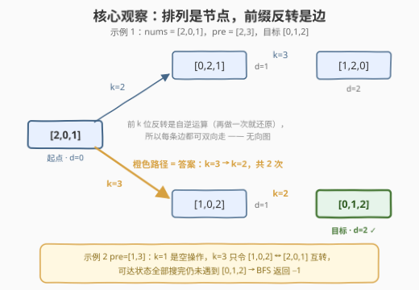
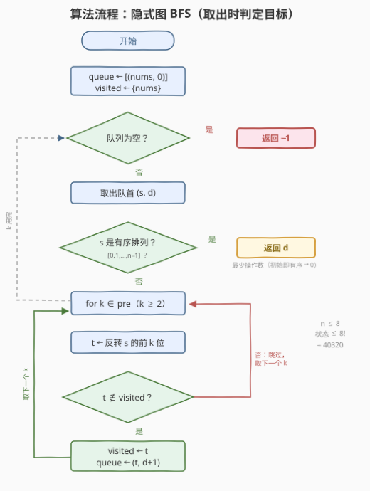

# LeetCode 使用前缀反转对数组进行排序 题解

## 1. 题目概述

- **标题 / 题号**：使用前缀反转对数组进行排序（#3991，medium）
- **链接**：https://leetcode.cn/problems/sort-array-using-prefix-reversals/
- **难度**：中等
- **标签**：广度优先搜索、数组、哈希表、双指针、哈希函数

> ⚠️ 本题为 LeetCode 付费题，题意描述根据官方示例用例与 hints 重建，可能与官方题面有出入。（函数签名 `sortArray(nums, pre)` 取自官方接口 `metaData`；三个示例的输出均已按重建题意独立验证自洽。）

**题意**：给你一个数组 `nums`，它是 $[0, 1, \dots, n-1]$ 的一个**排列**；再给你一个数组 `pre`，其中每个元素表示一种**允许使用的前缀反转长度**。

一次操作：从 `pre` 中任选一个长度 $k$，将 `nums` 的**前 $k$ 个元素反转**（即 $\text{nums}[0..k-1]$ 整体倒序），其余元素不动。

返回将 `nums` 变成**升序排列** $[0, 1, \dots, n-1]$ 所需的**最少操作次数**；若无论怎么操作都无法排好序，返回 $-1$。

**示例 1**：

```text
输入：nums = [2,0,1], pre = [2,3]
输出：2
解释：先取 k=3 反转整个数组，[2,0,1] → [1,0,2]；
     再取 k=2 反转前两位，[1,0,2] → [0,1,2]，共 2 次操作。
```

**示例 2**：

```text
输入：nums = [1,0,2], pre = [1,3]
输出：-1
解释：k=1 反转 1 个元素等于什么都没做；k=3 反转后得 [2,0,1]，
     再反转又回到 [1,0,2]。可达状态只有这两个，永远到不了 [0,1,2]。
```

**示例 3**：

```text
输入：nums = [0,1], pre = [2]
输出：0
解释：数组已经有序，无需任何操作。
```

**约束条件**（依 hints 与示例推断，以官方题面为准）：

- $2 \le n = \text{nums.length} \le 8$
- `nums` 是 $[0, 1, \dots, n-1]$ 的排列
- $1 \le \text{pre.length} \le n$，$1 \le \text{pre}[i] \le n$，`pre` 中元素互不相同

> 💡 **审题关键**：① 「最少操作次数」且每次操作代价相同 → **无权图最短路**，BFS 的标志性措辞；② $n \le 8$ → 排列至多 $8! = 40320$ 个，**状态空间小到可以整张图搜出来**（官方 hint 原文直说）；③ `pre` 是**允许的反转长度清单**——不是任意长度都能翻，这正是与经典煎饼排序（969）的分野，也是答案可能为 $-1$ 的根源；④ $k=1$ 的反转是空操作，可直接跳过。

## 2. 解题思路

### 2.1 暴力思路：枚举操作序列

最直接的想法：从 `nums` 出发做 DFS，每层从 `pre` 里选一个 $k$ 做反转，看多少步后变成有序。问题在于**深度没有上界**——不知道几步够用，操作序列可以无限延长；分支因子 $|\text{pre}|$ 逐层相乘，不加限制就是指数爆炸。而且同一个排列会被不同操作序列反复到达（$k=3$ 转过去、再 $k=3$ 转回来），大量搜索浪费在绕圈上。

问题的本质是：我们关心的不是「操作序列」，而是「**能到达哪些排列、各需几步**」——典型的**隐式图最短路**结构。

### 2.2 核心观察：排列是节点，前缀反转是边



**观察一（状态 = 排列）**：数组在任何操作序列下的取值都是 $[0..n-1]$ 的排列，至多 $8! = 40320$ 个。把每个排列看作图中的一个节点。

**观察二（边 = 一次允许的前缀反转）**：排列 $s$ 选 $k \in \text{pre}$ 反转前 $k$ 位得到排列 $t$，就连一条 $s \to t$ 的边。特别地，**前缀反转是自逆运算**（同样的 $k$ 再做一次就还原），所以每条边都可双向通行——图实质是**无向图**。

**观察三（BFS 首达即最短）**：每条边权都是 1，「最少操作次数」= 起点排列到有序排列的**最短路边数**。BFS 按层扩展，第一次取出目标时的层数 $d$ 就是最少操作数；若队列清空仍未遇到目标，说明目标与起点不连通，返回 $-1$。

> 💡 **一句话总结**：状态空间只有 $8!$ 个排列，把排列当节点、`pre` 里的每种前缀反转当边，从起点做 BFS 找到有序排列的最短路即可——官方 hints 已经把解法「剧透」得明明白白。

### 2.3 算法流程图



| 步骤 | 操作 | 说明 |
|------|------|------|
| ① | `queue ← [(nums, 0)]`，`visited ← {nums}` | 初始状态入队并标记，层数 0 |
| ② | 队列为空？ | 空则全部可达状态已搜完仍未有序 → 返回 $-1$ |
| ③ | 取出队首 `(s, d)` | `d` 即到达 `s` 的最少操作数 |
| ④ | `s` 是有序排列？ | **取出即判定**：是则 `d` 就是答案（初始即有序 → 自然返回 0，无需特判） |
| ⑤ | `for k ∈ pre 且 k ≥ 2` | $k=1$ 反转 1 个元素是空操作，直接跳过 |
| ⑥ | `t ← 反转 s 的前 k 位` | 生成邻居状态 |
| ⑦ | `t ∉ visited`？ | 是则标记并入队 `(t, d+1)`；否则剪枝跳过 |
| ⑧ | 回到 ② | 直到取出目标或队列为空 |

### 2.4 示例演算

**示例 1**：`nums = [2,0,1]`，`pre = [2,3]`，目标 `[0,1,2]`：

| 层 | 新出现的状态 | 由来 |
|----|-------------|------|
| 0 | [2,0,1] | 起点 |
| 1 | [0,2,1]，[1,0,2] | [2,0,1] 分别做 $k=2$、$k=3$ |
| 2 | [1,2,0]，**[0,1,2]** ✓ | [0,2,1] 做 $k=3$；[1,0,2] 做 $k=2$ |

第 2 层取出 `[0,1,2]`，返回 **2**（对应 2.2 图中橙色加粗路径 $k=3 \to k=2$）。

**示例 2**：`nums = [1,0,2]`，`pre = [1,3]`。$k=1$ 是空操作；$k=3$ 让 $[1,0,2] \leftrightarrow [2,0,1]$ 互转。第 0 层 `[1,0,2]`，第 1 层 `[2,0,1]`，之后再无新状态，队列清空 → 返回 **-1**。

**示例 3**：`nums = [0,1]` 已是有序排列，第 0 层出队时 `d = 0` 直接返回 **0**。

## 3. 参考代码

### C++

```cpp
class Solution {
  public:
    int sortArray(vector<int>& nums, vector<int>& pre) {
        int n = nums.size();
        vector<int> target(n);
        iota(target.begin(), target.end(), 0);       // 有序排列 [0,1,…,n−1]

        map<vector<int>, int> dist;                  // 状态 → 最少操作数，兼作 visited
        dist[nums] = 0;
        queue<pair<vector<int>, int>> q;
        q.push({nums, 0});

        while (!q.empty()) {
            auto [s, d] = q.front();
            q.pop();
            if (s == target) return d;               // 取出即判定：首达即最短
            for (int k : pre) {
                if (k < 2) continue;                 // 反转 1 位 = 空操作
                vector<int> t = s;
                reverse(t.begin(), t.begin() + k);   // 前 k 位反转
                if (dist.emplace(t, d + 1).second) { // 未访问过才入队
                    q.push({t, d + 1});
                }
            }
        }
        return -1;                                   // 可达状态全搜完仍无序
    }
};
```

> 💡 **写法要点**：
> - **取出时判定**（而非生成时）：初始就有序的自然返回 0，不需要特判；代价至多多探索一层邻居，可忽略；
> - `dist.emplace(t, d+1).second` 一行完成「查重 + 标记」，比先 `count` 再插入少一次查找；
> - `k < 2` 跳过空操作；`pre` 若含重复元素可先去重（不影响正确性，只省常数）；
> - 状态直接用 `vector<int>` 进 `map` 足够快；追求极致可把排列编码成字符串，或用**康托展开**哈希成 $[0, n!)$ 的整数下标（对应官方标签 Hash Function），visited 退化为定长数组。

### Python

```python
class Solution:
    def sortArray(self, nums: List[int], pre: List[int]) -> int:
        n = len(nums)
        target = tuple(range(n))

        dist = {tuple(nums): 0}                 # 状态 → 最少操作数，兼作 visited
        q = deque([(tuple(nums), 0)])

        while q:
            s, d = q.popleft()
            if s == target:                     # 取出即判定：首达即最短
                return d
            for k in pre:
                if k < 2:                       # 反转 1 位 = 空操作
                    continue
                t = s[:k][::-1] + s[k:]         # 前 k 位反转
                if t not in dist:
                    dist[t] = d + 1
                    q.append((t, d + 1))
        return -1                               # 可达状态全搜完仍无序
```

> 💡 **写法要点**：状态用 `tuple`（可哈希、不可变）；`s[:k][::-1] + s[k:]` 一行完成前缀反转；`dist` 一表两用（距离 + visited）。$n \le 8$ 时全程毫秒级。

## 4. 复杂度分析

| 维度 | 复杂度 | 说明 |
|------|--------|------|
| 时间 | $O(n! \cdot \lvert\text{pre}\rvert \cdot n)$ | 状态 $\le 8! = 40320$，每个状态尝试 $\lvert\text{pre}\rvert \le 8$ 种反转、每次反转 $O(n) = O(8)$，最坏约 $2.6 \times 10^6$ 次基本操作 |
| 空间 | $O(n! \cdot n)$ | visited 与队列存全部可达排列，每个状态 $O(n)$ |
| 答案规模 | $0 \le \text{ans} \le n! - 1$ 或 $-1$ | 答案即最短路长度；$\text{pre}$ 全开（煎饼图）时 $n=8$ 最坏仅 9，受限 `pre` 下更小或不可达 |

## 5. 扩展：不可达的代数解释 & 三个变体

**为什么会出现 −1（群论视角）**：每种「前 $k$ 位反转」都是 $[0..n-1]$ 上的**置换**，可达状态集合 = 由 $\{\text{rev}_k : k \in \text{pre}\}$ 生成的**置换群**作用在初始排列上的**轨道**。轨道可能远小于 $n!$：示例 2 中有效生成元只有 $\text{rev}_3$ 一个，它自身是 2 阶元，轨道 $\{[1,0,2], [2,0,1]\}$ 只有 2 个元素。更精细的判据是**奇偶性不变量**：$\text{rev}_k$ 的奇偶性为 $(-1)^{\lfloor k/2 \rfloor}$（如 $k=2,3$ 是奇置换，$k=4,5$ 是偶置换）。若 `pre` 中所有有效反转都是偶置换，则奇偶性全程不变——奇排列永远变不成偶排列，而目标（恒等置换）是偶排列，直接判 $-1$（这是必要条件而非充分条件，如 $n=4$、$\text{pre}=[4]$、`nums=[1,0,2,3]`）。

**双向 BFS**：前缀反转自逆 → 图无向 → 可从起点与目标**两头同时 BFS**，相遇即得最短路，搜索状态数从单侧的 $O(b^d)$ 降到约 $O(b^{d/2})$。本题 $8!$ 规模用不上，但若 $n$ 放大到 $10 \sim 12$（$10! \approx 3.6 \times 10^6$，$12! \approx 4.8 \times 10^8$）就是标准套路，配合康托展开编码 visited 效果更佳。

**多次询问变体**：若同一组 `pre` 要回答多个不同 `nums` 的询问，可利用无向性**反向**一次性 BFS 出有序排列到全图的距离表，每次询问 $O(1)$ 查表。

**与煎饼排序的联系**：若 $\text{pre} = \{2, 3, \dots, n\}$（长度全开），本题退化为「煎饼排序」的最短路版——任意排列都能排好（答案不再有 $-1$），$n = 8$ 时全图 $40320$ 个状态、最坏答案仅 $9$（煎饼图直径，已实测）。经典题 [969. 煎饼排序](https://leetcode.cn/problems/pancake-sorting/) 只要求给出**任一**可行序列（「先把最大者翻到头、再翻到其位」的构造法，$2(n-1)$ 次内完成）；本题要**最短**，构造性贪心不再适用，隐式图 BFS 才是正解。

## 6. 面试要点

**Q1：为什么这题用 BFS 而不是 DP 或贪心？**

> 状态是排列、转移是固定的一组操作、所有操作代价相同、求最少次数——**无权隐式图单源最短路**的标准形态。贪心（煎饼排序式「先归位最大」）只能保证可行、不保证最短；DP 缺少重叠子问题结构。$n \le 8$ → 状态 $\le 8!$，BFS 完全可承受。

**Q2：返回 −1 的判定依据是什么？需要预先分析可达性吗？**

> 不需要。BFS 队列清空即代表初始排列所在**轨道**的全部状态都扩展完了，仍未遇到有序排列 → 不连通 → $-1$。可达性分析（群轨道、奇偶不变量）只是事后解释，算法本身自动给出答案。

**Q3：visited 应该在入队时还是出队时标记？**

> 本题边权全 1，两种写法都正确。**入队时标记**保证每个状态至多入队一次，队列长度 $\le$ 状态数，是更通用、更省空间的习惯（出队时标记在 0-1 BFS / Dijkstra 等场景会出错或退化）；本文取入队时标记。

**Q4：状态怎么编码？官方标签里的 Hash Function 指什么？**

> Python 用 `tuple` 直接进 `set`/`dict`；C++ 用 `vector<int>` 进 `set`/`map`，或编码成字符串。进阶做法是**康托展开**（Lehmer code）：把排列映射为 $[0, n!)$ 内的整数下标，visited 退化为普通数组——省哈希开销、防卡常，$n$ 更大时是必备优化。

**Q5：k=1 为什么跳过？`pre` 含重复元素有影响吗？**

> 反转前 1 个元素不改变数组，是空操作——不跳过也不会错（visited 天然剪掉），但显式跳过更干净。重复的 $k$ 只会重复生成同一邻居，被 visited 去重，不影响正确性，仅多耗常数，可先去重。

## 同类练习题

| # | 题目 | 与本题的关联 |
|---|------|-------------|
| 969 | [煎饼排序](https://leetcode.cn/problems/pancake-sorting/) | 同一「前缀反转」操作、所有长度可用，只需给出任一可行序列的构造题——体会「可行」与「最短」的难度差异 |
| 752 | [打开转盘锁](https://leetcode.cn/problems/open-the-lock/) | 隐式状态图 BFS 的入门经典，状态是 4 位密码而非排列 |
| 773 | [滑动谜题](https://leetcode.cn/problems/sliding-puzzle/) | 排列状态 + BFS 求最少移动次数，并把「无解判定」做成了考点（逆序数奇偶性） |
| 1460 | [通过反转子数组使两数组相等](https://leetcode.cn/problems/make-two-arrays-equal-by-reversing-subarrays/) | 只问「能否通过反转到达」，理解反转操作下多重集合不变与可达性 |
| 818 | [赛车](https://leetcode.cn/problems/race-car/) | 另一道隐式图 BFS / DP，状态是（位置，速度）二元组，练习状态设计与剪枝 |
