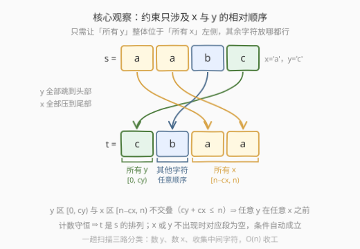
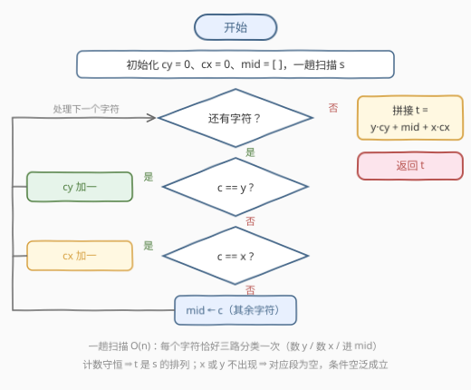

# LeetCode 重新排列字符串以避免字符对 题解

## 1. 题目概述

- **标题 / 题号**：重新排列字符串以避免字符对（#3992，easy）
- **链接**：https://leetcode.cn/problems/rearrange-string-to-avoid-character-pair/
- **难度**：简单
- **标签**：字符串、排序、双指针、计数

**题意**：给你一个字符串 `s` 和两个**不同**的小写英文字母 `x` 和 `y`。重新排列 `s` 中的字符来构造一个新的字符串 `t`，使得：

- `t` 是 `s` 的一个**排列**；
- 在 `t` 中，**所有 `y` 都必须在所有 `x` 之前**。

返回**任意**一个有效的字符串 `t`。

**排列**是对一个字符串中所有字符的重新排列。

**示例 1**：

```text
输入：s = "aabc", x = "a", y = "c"
输出："cbaa"
解释："cbaa" 是 "aabc" 的排列，且每次出现的 'c' 都在每次出现的 'a' 之前。
```

**示例 2**：

```text
输入：s = "dcab", x = "d", y = "b"
输出："cabd"
解释："cabd" 是 "dcab" 的排列，且每次出现的 'b' 都在每次出现的 'd' 之前。
```

**示例 3**：

```text
输入：s = "axe", x = "o", y = "x"
输出："axe"
解释：'o' 没有在字符串中出现，约束自动满足，原串即有效。
```

**约束**：

- $1 \le \text{s.length} \le 100$
- `s` 仅由小写英文字母组成
- `x` 和 `y` 都是小写英文字母，且 $x \ne y$

> 💡 **审题关键**：① 约束只涉及 `x`、`y` **两种字符的相对顺序**，其余 24 种小写字母完全自由；② `x` 或 `y` 可能根本不出现在 `s` 中——此时对应一侧为空集，条件**空泛成立**（示例 3）；③ 题目要「任意一个有效解」——这是**构造题**，判题器校验合法性而非字符串精确匹配，示例输出只是众多合法解之一。

## 2. 解题思路

### 2.1 暴力思路

枚举 `s` 的全部 $n!$ 个排列，逐个检查「所有 `y` 是否都在所有 `x` 之前」。$n \le 100$ 时 $100!$ 是天文数字，完全不可行。事实上哪怕只想「挪动最少的字符」也大可不必——本题只要求**构造出任一合法解**，存在一趟扫描的直接构造。

### 2.2 核心观察：约束只看 x 与 y 的相对顺序 → 三段拼接



**观察一（约束的局部性）**：条件「所有 `y` 在所有 `x` 之前」只对 `x`、`y` 两种字符的出现位置有要求，其余字符既不是 `x` 也不是 `y`，放在任何位置都不影响合法性。一句话：**别管其他 24 种字母，只伺候好这两位**。

**观察二（最极端的合法布局）**：既然中间字符随意，就把布局推到最极端——所有 `y` 堆在字符串**最前面**，所有 `x` 压在**最后面**，其余字符任意序夹在中间。记 $c_y = \text{count}(y)$、$c_x = \text{count}(x)$、`mid` 为去掉 `x`、`y` 后的剩余字符（任意顺序），则：

$$
t = \underbrace{y \cdot c_y}_{\text{y 区 } [0,\, c_y)} \;+\; \underbrace{\text{mid}}_{\text{中间区}} \;+\; \underbrace{x \cdot c_x}_{\text{x 区 } [n - c_x,\, n)}
$$

**正确性三连**：

- **`t` 是 `s` 的排列**：三种成分的字符计数与 `s` 完全一致（计数守恒）；
- **顺序约束成立**：`y` 区占据下标 $[0, c_y)$、`x` 区占据 $[n - c_x, n)$，由 $c_y + c_x \le n$ 知两区**不交叠**且前者整体在左侧；中间区不含任何 `x`、`y`，不参与约束；
- **边界免费**：`x`（或 `y`）不出现在 `s` 中时对应段为空串，「所有 `y` 在所有 `x` 之前」空泛成立，无需任何特判。

一趟线性扫描完成三路分类（数 `y`、数 `x`、收集中间字符），拼接即得答案。

### 2.3 算法流程图



| 步骤 | 操作 | 说明 |
|------|------|------|
| ① | 扫描 `s`，逐字符三路分类 | `c == y` → $c_y$ 加一；`c == x` → $c_x$ 加一；否则进 `mid` |
| ② | 拼接 $y \cdot c_y + \text{mid} + x \cdot c_x$ | 计数守恒保证 `t` 是 `s` 的排列 |
| ③ | 返回 `t` | 任意合法解均被接受 |

### 2.4 示例演算

**示例 1** `s = "aabc"`，`x = 'a'`，`y = 'c'`：扫描得 $c_y = 1$（一个 `'c'`）、$c_x = 2$（两个 `'a'`）、`mid = "b"`；拼接得 `t = "c" + "b" + "aa" = "cbaa"`，与示例输出一致。✓

**示例 2** `s = "dcab"`，`x = 'd'`，`y = 'b'`：$c_y = 1$、$c_x = 1$、`mid = "ca"`；`t = "b" + "ca" + "d" = "bcad"`。与示例输出 `"cabd"` 不同，但同样合法（所有 `'b'` 在所有 `'d'` 之前）——再次印证判题器做的是**合法性校验**而非精确匹配。✓

**示例 3** `s = "axe"`，`x = 'o'`，`y = 'x'`：$c_x = 0$（`'o'` 未出现）、$c_y = 1$、`mid = "ae"`；`t = "x" + "ae" + "" = "xae"`，`x` 段为空使条件自动满足。✓

## 3. 参考代码

### C++

```cpp
class Solution {
  public:
    string rearrangeString(string s, char x, char y) {
        string mid;
        int cy = 0, cx = 0;
        for (char c : s) {
            if (c == y) ++cy;
            else if (c == x) ++cx;
            else mid.push_back(c);
        }
        return string(cy, y) + mid + string(cx, x);
    }
};
```

> 💡 **写法要点**：
> - 一趟扫描**三路分类**：`y` 计数、`x` 计数、其余字符收集，每个字符恰好被处理一次；
> - `string(cy, y)` 用重复构造语法直接生成 `y` 前缀段；
> - $x \ne y$ 保证一个字符不会同时命中两个分支，计数守恒 ⇒ `t` 必为 `s` 的排列，无需事后校验。

### Python

```python
class Solution:
    def rearrangeString(self, s: str, x: str, y: str) -> str:
        mid = [c for c in s if c != x and c != y]
        return y * s.count(y) + ''.join(mid) + x * s.count(x)
```

> 💡 **写法要点**：
> - `str * int` 重复字符、`s.count` 内建计数，三段拼接一行收工；
> - 中间字符先收集进列表再 `join`，避免对不可变字符串反复 `+=`（$n \le 100$ 其实无碍，属习惯性写法）。

## 4. 复杂度分析

| 维度 | 复杂度 | 说明 |
|------|--------|------|
| 时间 | $O(n)$ | 一趟扫描分类 + 一次拼接，每个字符常数次操作 |
| 空间 | $O(n)$ | `mid` 缓冲与结果串；输出本身长 $n$，构造题的 $\Omega(n)$ 下界 |
| 输出规模 | $n$ | `t` 与 `s` 等长且为排列，计数守恒 |

> 💡 对照：第 5 节的排序法为 $O(n \log n)$，双指针就地写法同为 $O(n)$——$n \le 100$ 时三者毫无差别，本题考点在「看出约束只涉及两种字符」这步**建模**，而非复杂度优化。

## 5. 扩展：排序一行流与双指针就地写

**排序法（官方 hint 3）**：把 `s` 整体排序——若 $x < y$ 用**降序**、否则用**升序**：

```python
class Solution:
    def rearrangeString(self, s: str, x: str, y: str) -> str:
        return ''.join(sorted(s, reverse=(x < y)))
```

原理：升序排序中较小字符在前。若 $x < y$，升序会把所有 `x` 排到所有 `y` 之前——**恰好违反**约束，必须降序翻转次序（$y > x$ 自动在前）；若 $x > y$，升序已保证 `y` 在 `x` 之前。布尔参数 `reverse=(x < y)` 把分支压成一行。示例 1（$x = $ `'a'` $< y = $ `'c'`，降序）恰好得到 `"cbaa"`。$O(n \log n)$ 稍逊于计数法，胜在极短。

**双指针写法（对应 Two Pointers 标签）**：预开长度 $n$ 的数组 `t`，写指针 `i` 从头、`j` 从尾出发；扫 `s` 时遇 `y` 写 `t[i++]`、遇 `x` 写 `t[j--]`，其余字符暂存；最后把中间字符依序填进剩余空档：

```cpp
class Solution {
  public:
    string rearrangeString(string s, char x, char y) {
        int n = s.size(), i = 0, j = n - 1;
        string t(n, '?'), mid;
        for (char c : s) {
            if (c == y) t[i++] = c;
            else if (c == x) t[j--] = c;
            else mid.push_back(c);
        }
        for (char c : mid) t[i++] = c;
        return t;
    }
};
```

扫描结束时 `i = cy`、`j = n - c_x - 1`，中间字符恰好填满 $[\,c_y,\; n - c_x)$——三个区域与 2.2 的三段布局**完全一致**，双指针只是三段拼接的「就地化身」：`i` 专职圈定 `y` 区、`j` 专职圈定 `x` 区，两者从两端相向圈地、永不相撞（总写入次数恒为 $n$）。

**变体展望**：若约束升级为「`y` 区与 `x` 区之间至少隔 $k$ 个字符」，三段拼接须在两区之间垫足 `mid` 字符，不足时无解——向「重构字符串」类的间距约束家族过渡（见第 7 节 767 题）。

## 6. 面试要点

**Q1：为什么三段拼接一定合法？**

> 三个事实：① 计数守恒——`y` 前缀、中间段、`x` 后缀三种成分的字符计数与 `s` 完全一致，故 `t` 是排列；② 区域不交叠——`y` 区 $[0, c_y)$ 与 `x` 区 $[n - c_x, n)$ 满足 $c_y \le n - c_x$，前者整体在左；③ 中间区不含 `x`、`y`，与约束无关。合起来即「任意 `y` 的下标 < 任意 `x` 的下标」。

**Q2：`x` 或 `y` 不出现在 `s` 中时怎么处理？**

> 无需特判：对应计数为 0、拼接段为空串。「所有 `y` 都在所有 `x` 之前」当某一侧为空集时是**空泛真**——示例 3 的 `'o'` 根本不在 `s` 里，任何排列都合法。

**Q3：答案与示例输出不同会被判错吗？**

> 不会。题目明确「返回任意一个有效的字符串 `t`」，判题器做的是**合法性校验**（是排列 + 顺序约束），不是字符串精确匹配。例如示例 2 的 `"cabd"` 与本文的 `"bcad"` 都是合法解。

**Q4：排序法为什么排序方向要跟 `x`、`y` 的大小关系挂钩？**

> 升序把小字符排前。若 $x < y$，升序得到「所有 `x` 在所有 `y` 之前」正好**反向**违反约束，须降序；若 $x > y$，升序天然满足。一行 `sorted(s, reverse=(x < y))` 把这个二分支压缩成布尔参数，是「分支变参数」的迷你范例。

**Q5：还能更快吗？**

> 不能。输出本身长为 $n$，$\Omega(n)$ 是构造题的信息论下界，计数法/双指针法均已达到。$n \le 100$ 时任何 $O(n \log n)$ 写法也瞬间完成——本题区分度在建模一步：识别出「约束只涉及两种字符的相对顺序，其余字符全是自由变量」。

## 同类练习题

| # | 题目 | 与本题的关联 |
|---|------|-------------|
| 75 | [颜色分类](https://leetcode.cn/problems/sort-colors/) | 三路分区（0/1/2）原型——本题「`y` \| 其他 \| `x`」正是荷兰国旗三段布局的单次扫描版 |
| 767 | [重构字符串](https://leetcode.cn/problems/reorganize-string/) | 同为「重排满足位置约束」，约束从「两区先后」升级为「逐位相邻不同」，需计数贪心 |
| 451 | [根据字符出现频率排序](https://leetcode.cn/problems/sort-characters-by-frequency/) | 按字符属性重排字符串，分类键从「是否 `x`/`y`」换成出现频率 |
| 345 | [反转字符串中的元音字母](https://leetcode.cn/problems/reverse-vowels-of-a-string/) | 双指针只动元音、辅音不动——「只约束部分字符」的同款思想 |
| 621 | [任务调度器](https://leetcode.cn/problems/task-scheduler/) | 把「字符间隔约束」推到任务冷却场景，构造法与数学法双解 |
