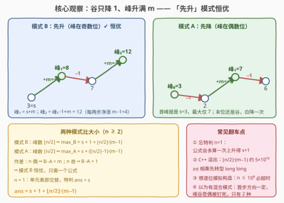
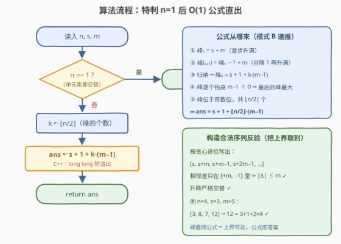

# 交替数列的最大元素

- **题目名称**：交替数列的最大元素
- **链接**：[3993. Maximum Value of an Alternating Sequence](https://leetcode.cn/problems/maximum-value-of-an-alternating-sequence/)
- **难度**：中等
- **标签**：贪心、数学

## 1. 题目概述

给你三个整数 $n$、$s$ 和 $m$。

如果一个长度为 $n$ 的整数序列 $seq$ 满足以下条件，则认为它是**有效**的：

- $seq[0] = s$；
- 序列是**交替**的，即 $seq[0] > seq[1] < seq[2] > \cdots$，或者 $seq[0] < seq[1] > seq[2] < \cdots$；
- 对每对相邻元素，$|seq[i] - seq[i-1]| \le m$。

长度为 1 的序列被认为 是交替的。

返回任何有效序列中可能出现的**最大**元素。

**示例 1**：

```text
输入：n = 4, s = 3, m = 5
输出：12
解释：一个有效的序列是 [3, 8, 7, 12]，序列中的最大元素是 12。
```

**示例 2**：

```text
输入：n = 2, s = 4, m = 3
输出：7
解释：一个有效的序列是 [4, 7]，序列中的最大元素是 7。
```

**约束条件**：

- $1 \le n, s \le 10^9$
- $1 \le m \le 10^5$

> 💡 **审题关键**：① 交替只有两种「相位」——首步方向（先升/先降）一旦选定，每个下标是**峰**（局部高点）还是**谷**（局部低点）就被**奇偶性钉死**，不存在混合模式；② 严格不等 ⇒ 峰→谷**至少降 1**，$|Δ| \le m$ ⇒ 谷→峰**至多升 $m$**，一降一升的净涨幅是 $m-1$；③ $n$ 高达 $10^9$ ⇒ 必然是 $O(1)$ 公式题，逐位构造不可行。

---

## 2. 解题思路

### 2.1 暴力思路：逐位枚举幅度

方向序列被模式钉死后，每个位置只剩「幅度」一个自由度：谷后必升（$+1 \sim +m$）、峰后必降（$-m \sim -1$）。逐位枚举的搜索树是 $O(m^n)$，$n \le 10^9$ 直接爆炸；值域跨度可达 $\pm 10^{14}$，按值 DP 也无从下手。

但结构其实**极度刚性**：最大元素只能出现在**峰**上（谷恒比相邻峰小），而峰值对幅度选择是**单调**的——谷抬得越高，后面的峰越高。这提示贪心 + $O(1)$ 公式。

### 2.2 核心观察：谷降 1、峰升 m，两种模式比大小



**贪心构造**：想让峰值尽量高，每一步都别浪费——谷只降 $1$（严格小于，降 $1$ 就够），峰升满 $m$。于是峰值的递推是：

$$峰_{k+1} = 峰_k - 1 + m \quad\Longleftrightarrow\quad 峰_{k+1} = 峰_k + (m-1)$$

**归纳证明最优性**：任何合法序列中恒有 $峰_{k+1} \le 峰_k - 1 + m$（严格降至少 $1$、升至多 $m$），且贪心构造逐位取等；又因后续约束只与相对差有关，抬高任何一个谷只会让其后所有峰**不降**——逐位贪心即全局最优。

**两种模式分别求最大**（峰逐个抬高 $m-1 \ge 0$，故**最后一个峰最大**）：

- **模式 B（先升，峰在奇数位 $1,3,5,\dots$）**：峰个数 $= \lfloor n/2 \rfloor$，首峰 $= s+m$，归纳得第 $k$ 个峰 $= s + 1 + k(m-1)$：

$$\max_B = s + 1 + \left\lfloor \frac{n}{2} \right\rfloor (m-1)$$

- **模式 A（先降，峰在偶数位 $0,2,4,\dots$）**：峰个数 $= \lceil n/2 \rceil$，首峰就是 $s$，第 $k$ 个峰 $= s + k(m-1)$：

$$\max_A = s + \left(\left\lceil \frac{n}{2} \right\rceil - 1\right)(m-1)$$

**作差比较**：

$$\max_B - \max_A = 1 + \left(\left\lfloor \frac{n}{2} \right\rfloor - \left\lceil \frac{n}{2} \right\rceil + 1\right)(m-1) = \begin{cases} m & n \text{ 为偶数} \\ 1 & n \text{ 为奇数} \end{cases}$$

两种奇偶下都严格为正 ⇒ **模式 B 恒优**，答案只需一个公式。直觉：B 的首峰 $s+m$ 就比 A 的首峰 $s$ 高一截，且两者每两步净增相同（$m-1$），A 的末峰即便是「多出来的那个」也只能把差距缩到 1，追不回来。

> 💡 **一句话**：$n \ge 2$ 时答案 $= s + 1 + \lfloor n/2 \rfloor \cdot (m-1)$；$n = 1$ 时单元素序列即交替，答案就是 $s$（公式代入会凭空多算一次不存在的上升，必须特判）。

### 2.3 算法流程图



| 步骤 | 操作 | 说明 |
|------|------|------|
| ① 读入 | $n, s, m$ | —— |
| ② 特判 | $n = 1$ ? | 是 ⇒ 返回 $s$（长度 1 视为交替） |
| ③ 数峰 | $k \leftarrow \lfloor n/2 \rfloor$ | 模式 B 的峰位于奇数位，共这么多个 |
| ④ 套公式 | $ans \leftarrow s + 1 + k \cdot (m-1)$ | 首峰 $s+m$，其后每峰 $+（m-1）$ |
| ⑤ 返回 | $ans$ | C++ 注意 `long long` |

### 2.4 示例演算

以**示例 1**（$n=4,\ s=3,\ m=5$）演算两种模式（峰值递推：峰升满 $5$、谷降 $1$）：

| 模式 | 贪心序列 | 峰值序列 | 最大值 |
|------|----------|----------|--------|
| B（先升，峰在 $1,3$ 位） | $[3, 8, 7, 12]$ | $8 = 3{+}5$，$12 = 8{-}1{+}5$ | $12$ ✓ |
| A（先降，峰在 $0,2$ 位） | $[3, 2, 7, 6]$ | $3$，$7 = 3{+}4$ | $7$ |

$\max_B - \max_A = 12 - 7 = 5 = m$（$n$ 为偶数），公式 $s + 1 + \lfloor n/2 \rfloor(m-1) = 3 + 1 + 2 \times 4 = 12$ ✓。

**示例 2**（$n=2,\ s=4,\ m=3$）：模式 B 序列 $[4, 7]$，峰只有 $s + m = 7$；公式 $4 + 1 + 1 \times 2 = 7$ ✓（$n$ 偶时 $\max_B - \max_A = m = 3$，即 A 的最大只有 $s=4$）。

---

## 3. 参考代码

### C++

```cpp
class Solution {
public:
    long long maximumValue(int n, int s, int m) {
        if (n == 1) return s;
        return (long long)s + 1 + (long long)(n / 2) * (m - 1);
    }
};
```

### Python

```python
class Solution:
    def maximumValue(self, n: int, s: int, m: int) -> int:
        if n == 1:
            return s
        return s + 1 + (n // 2) * (m - 1)
```

> 💡 **写法要点**：① $\lfloor n/2 \rfloor \cdot (m-1)$ 最大约 $5 \times 10^{13}$，C++ 中 `n/2` 与 `m-1` 都是 `int`，**相乘前必须先转型** `long long`（加法一边是 `long long` 只保得住那一步，乘法这步会先炸）；② 函数签名返回 `long long`、函数名 `maximumValue`，别写成别的；③ 想现场验证公式，可按 2.2 贪心构造 $[s,\ s{+}m,\ s{+}m{-}1,\ s{+}2m{-}1,\ \dots]$ 逐项检查两条件。

---

## 4. 复杂度分析

| 维度 | 复杂度 | 说明 |
|------|--------|------|
| **时间** | $O(1)$ | 一次特判 + 一次乘加 |
| **空间** | $O(1)$ | 无额外存储 |
| **量级判断** | 常数次运算 | $n \le 10^9$ 本身就宣告「模拟必死」；难点全在 2.2 的模式对比与贪心论证上，属于「证明难、实现易」的一行公式题 |

---

## 5. 扩展：从公式回到构造，以及一个变体

### 5.1 输出达到最大值的序列

面试官若追问「给出达到答案的序列」，按贪心逐位写出即可：奇数位（峰）依次为 $s+m,\ s+2m-1,\ s+3m-2,\ \dots$，偶数位（谷，下标 $\ge 2$）取前一个峰 $-1$：

$$[\,s,\ s{+}m,\ s{+}m{-}1,\ s{+}2m{-}1,\ s{+}2m{-}2,\ \dots\,]$$

相邻差只在 $\{+m, -1\}$ 中取值，严格交替与 $|Δ| \le m$ 同时满足——这也正是 2.2 公式「上界可达」的构造性证明。

### 5.2 变体：把「严格交替」放宽为「非严格」

若允许相邻相等（$\ge$ 与 $\le$ 交替），谷就不必降 $1$，可以贴着峰走：峰递推变为 $峰_{k+1} = 峰_k + m$，同法推导得 $n \ge 2$ 时答案 $= s + \lfloor n/2 \rfloor \cdot m$。对比本题：每个谷省下的那 $1$，累积起来恰是 $\lfloor n/2 \rfloor$——「严格性损失」被公式精确量化。

---

## 6. 面试要点

**Q1：为什么只有两种模式，最大值又为什么一定在峰上？**

> 交替条件把相邻比较的方向钉死为 $\uparrow\downarrow\uparrow\cdots$ 或 $\downarrow\uparrow\downarrow\cdots$，首步方向二选一后，峰谷位置由下标奇偶唯一确定。谷恒比相邻峰小，$n \ge 2$ 时任一谷（包括 $s$ 自己当谷）都被某个峰严格超过，故最大值在峰上；峰按 $m-1 \ge 0$ 单调抬升，**最后一个峰**最大。

**Q2：「谷降 1、峰升 m」的贪心怎么严格证明？**

> 放缩 + 归纳：任何合法序列满足 $峰_{k+1} \le 峰_k - 1 + m$（峰→谷严格降至少 1，谷→峰至多升 $m$），贪心构造逐位取等；且抬高任一谷不会使后续任何峰变小（后续约束只依赖相对差），所以逐位取等叠加后全局最优，峰值公式 $峰_k = s + 1 + k(m-1)$ 对模式 B 成立。

**Q3：两种模式为什么要比、比完为什么可以扔掉一种？**

> 峰谷位置随模式不同（奇数位 vs 偶数位），峰的个数也不同（$\lfloor n/2 \rfloor$ vs $\lceil n/2 \rceil$），不能想当然。代数作差：$n$ 偶时 $\max_B - \max_A = m$，$n$ 奇时 $= 1$，恒正 ⇒ 模式 B 恒优，只需保留一个公式。

**Q4：实现上最容易翻车的点？**

> ① 忘特判 $n=1$：公式会多算一次不存在的上升，输出 $s+1$；② C++ 溢出：$\lfloor n/2 \rfloor \cdot (m-1) \approx 5 \times 10^{13}$ 远超 `int`，乘法前先转型 `long long`；③ Python 大整数无此虞，但别把函数名写错（`maximumValue`）。

**Q5：如何快速自证公式而不是靠「背」？**

> 两步：先用小样例心算（$n=2$ 答案必为 $s+m$，$n=3$ 必为 $s+2m-1$），再按 5.1 写出构造序列逐项验证两条件——构造既验证了合法性，又说明上界被取到，公式与构造互为对偶。

---

## 7. 同类练习题

- [376. 摆动序列](https://leetcode.cn/problems/wiggle-subsequence/)（[题解](../0301-0400/376_摆动序列.md)）：同样吃透「峰谷交替」结构——只是从构造换成在给定数组里数最长摆动
- [1144. 递减元素使数组呈锯齿状](https://leetcode.cn/problems/decrease-elements-to-make-array-zigzag/)（[题解](../1101-1200/1144_递减元素使数组呈锯齿状.md)）：锯齿化的代价版——本题「谷降 1」在那里变成「降多少才够」的权衡
- [3916. 锯齿形数组的总数III](https://leetcode.cn/problems/number-of-zigzag-arrays-iii/)（[题解](../3901-4000/3916_锯齿形数组的总数III.md)）：同族计数版——峰谷奇偶被钉死的结构同样是无脑 DP 的钥匙
- [3944. 使数组变为模交替数组的最少操作次数II](https://leetcode.cn/problems/minimum-operations-to-make-array-modulo-alternating-ii/)（[题解](../3901-4000/3944_使数组变为模交替数组的最少操作次数II.md)）：交替条件 + 模约束的操作版，体会「奇偶分桶」的通用拆法
- [1798. 你能构造出连续值的最大数目](https://leetcode.cn/problems/maximum-number-of-consecutive-values-you-can-make/)（[题解](../1701-1800/1798_你能构造出连续值的最大数目.md)）：同为「构造可行序列 + 贪心取极值」的数学贪心骨架
