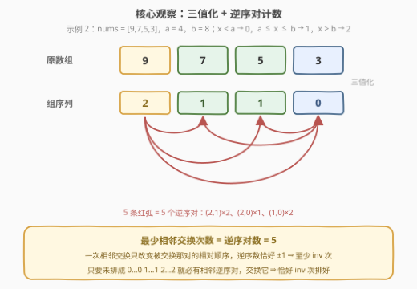
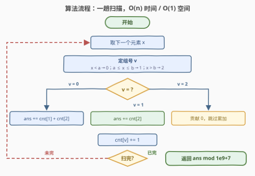

# 划分数组的最少相邻交换次数

- **题目名称**：划分数组的最少相邻交换次数
- **链接**：[3994. 划分数组的最少相邻交换次数](https://leetcode.cn/problems/minimum-adjacent-swaps-to-partition-array/)
- **难度**：中等
- **标签**：贪心、数组

## 1. 题目概述

给你一个整数数组 `nums` 和两个整数 `a`、`b`，满足 $a < b$。如果一个数组可以按顺序分成三个**连续**的部分，并且满足以下条件，则称其为**好数组**：

- 第一部分中的每个元素都**小于** `a`；
- 第二部分中的每个元素都在闭区间 $[a, b]$ 内；
- 第三部分中的每个元素都**大于** `b`。

三个部分**都可以为空**。一次**相邻交换**指交换 `nums` 的两个**相邻**元素。返回使 `nums` 成为好数组所需的**最少**相邻交换次数。由于答案可能非常大，将其对 $10^9 + 7$ 取余后返回。

**示例 1**：

```text
输入：nums = [1,3,2,4,5,6], a = 3, b = 4
输出：1
解释：交换 nums[1] 和 nums[2]，数组变为 [1,2,3,4,5,6]，
     分成 [1,2]、[3,4]、[5,6] 三段，是好数组。
```

**示例 2**：

```text
输入：nums = [9,7,5,3], a = 4, b = 8
输出：5
解释：5 次交换后数组变为 [3,7,5,9]，分成 [3]、[7,5]、[9] 三段。
```

**示例 3**：

```text
输入：nums = [3,7,5,9], a = 4, b = 8
输出：0
解释：数组已经是好数组，无需交换。
```

**约束条件**：

- $1 \le \text{nums.length} \le 10^5$
- $1 \le \text{nums}[i] \le 10^9$
- $1 \le a < b \le 10^9$

> 💡 **审题关键**：① 交换的是**相邻**元素——一次只能挪一步，与「任意位置交换」一次修两个错位完全不同；② 好数组只看每个元素**落在哪一段**，段内元素的具体数值与相对顺序都无所谓；③ 三段连续且可为空，等价于数组整体呈「小–中–大」三段式；④ 答案要**取模**——$n = 10^5$ 时交换次数最多约 $\binom{10^5}{2} \approx 5 \times 10^9$，超出 32 位整数范围。

---

## 2. 解题思路

### 2.1 暴力思路：状态搜索与逐个归位

最直接的想法是把每个数组形态看作节点、每次相邻交换看作边跑 **BFS**，直到首次出现合法三段式。但同段元素彼此等价，状态数仍是组合级别，$n = 10^5$ 直接爆炸。退一步，可以先数出三段各自的长度（每段长度就是该组元素的总数，天然固定），再模拟「把每个错位元素用相邻交换逐步挪到该在的段」——朴素实现是 $O(n^2)$（选择排序式地逐个归位），$10^5$ 规模同样超时。

模拟不仅慢，还说不清「为什么这样挪就是最少」。下面把问题提炼成一个 $O(n)$ 的纯计数公式。

### 2.2 核心观察：三值化 + 逆序对计数



**第一步：数值无关，坍缩成 0/1/2。** 划分条件只区分每个元素属于哪一段：$x < a$ 记为组 $0$，$a \le x \le b$ 记为组 $1$，$x > b$ 记为组 $2$。**同组元素彼此无差别**——第一段里的 $1$ 和 $2$ 互换位置不影响合法性。于是问题坍缩为：把组序列 $g$ 排成非降序 $0\cdots0\,1\cdots1\,2\cdots2$ 所需的最少相邻交换次数。

**第二步：最少相邻交换 = 逆序对数。** 称满足 $i < j$ 且 $g[i] > g[j]$ 的数对为一个**逆序对**，总数记为 $\mathrm{inv}$：

- **下界**：交换相邻两元素**只改变这一对**的相对顺序，与其他所有元素的相对顺序无关。若这对构成逆序，逆序数恰好 $-1$；否则恰好 $+1$。所以每次交换逆序数至多减 1，从 $\mathrm{inv}$ 降到 0 **至少需要 $\mathrm{inv}$ 次**。
- **可达**：只要序列还没排成非降序，就一定存在**相邻**的逆序对（否则所有相邻对都非逆序，整列已然非降），交换它使逆序数恰减 1。归纳可得恰好 $\mathrm{inv}$ 次排好。

两个示例立即验证：示例 2 的组序列 $[2,1,1,0]$ 有 $(2,1)\times2 + (2,0)\times1 + (1,0)\times2 = 5$ 个逆序对 ✓；示例 1 的 $[0,1,0,1,2,2]$ 只有 $1$ 个 ✓；示例 3 的 $[0,1,1,2]$ 是 0 ✓。

$$\text{ans} = \mathrm{inv}(g) = \#\{\, (i,j) \ : \ i < j,\ g[i] > g[j] \,\} \pmod{10^9+7}$$

> 💡 **一句话总结**：先把每个元素按 $a$、$b$ 压成 $0/1/2$ 三个组号，再数**组序列的逆序对**——「前面来了个更大的组号，它迟早得被换过去」，每个这样的配对恰好贡献一次交换。

### 2.3 算法流程图：值域三档 ⇒ 免排序的一趟扫描



通用求逆序对需要归并排序或树状数组（$O(n \log n)$），但组号只有 $\{0,1,2\}$ 三档——**当前值 $v$ 的逆序贡献就是「前面比 $v$ 大的元素个数」**，用三个计数器即可一趟数完：

| 步骤 | 操作 | 说明 |
|------|------|------|
| ① | 遍历每个 $x$，判定组号 $v$ | $x<a \to 0$；$x \le b \to 1$；否则 $\to 2$ |
| ② | 按组号累加贡献 | $v=0$：加 $\text{cnt}[1]+\text{cnt}[2]$；$v=1$：加 $\text{cnt}[2]$；$v=2$：加 $0$ |
| ③ | 更新计数器 $\text{cnt}[v]$ += 1 | 供后续元素统计 |
| ④ | 返回 $\text{ans} \bmod (10^9+7)$ | 时间 $O(n)$、空间 $O(1)$ |

### 2.4 示例演算

以示例 2 `nums = [9,7,5,3], a = 4, b = 8` 为例，组序列为 $[2,1,1,0]$：

| $i$ | $x$ | $v$ | 贡献（前面大于 $v$ 的个数） | 更新后 cnt $[0,1,2]$ |
|-----|-----|-----|------------------------------|----------------------|
| 0 | 9 | 2 | $0$（没有比 2 大的） | $[0,0,1]$ |
| 1 | 7 | 1 | $\text{cnt}[2] = 1$ | $[0,1,1]$ |
| 2 | 5 | 1 | $\text{cnt}[2] = 1$ | $[0,2,1]$ |
| 3 | 3 | 0 | $\text{cnt}[1]+\text{cnt}[2] = 3$ | $[1,2,1]$ |

合计 $0+1+1+3 = 5$，与示例输出一致 ✓。

再走一遍示例 1 `nums = [1,3,2,4,5,6], a = 3, b = 4$，组序列 $[0,1,0,1,2,2]$：

| $i$ | $x$ | $v$ | 贡献 | 更新后 cnt $[0,1,2]$ |
|-----|-----|-----|------|----------------------|
| 0 | 1 | 0 | $0$ | $[1,0,0]$ |
| 1 | 3 | 1 | $\text{cnt}[2] = 0$ | $[1,1,0]$ |
| 2 | 2 | 0 | $\text{cnt}[1]+\text{cnt}[2] = 1$ | $[2,1,0]$ |
| 3 | 4 | 1 | $\text{cnt}[2] = 0$ | $[2,2,0]$ |
| 4 | 5 | 2 | $0$ | $[2,2,1]$ |
| 5 | 6 | 2 | $0$ | $[2,2,2]$ |

合计 $1$ ✓。注意组序列非降时（示例 3）每步贡献都是 0，天然返回 0，**无需特判**。

---

## 3. 参考代码

### C++

```cpp
class Solution {
  public:
    int minAdjacentSwaps(vector<int>& nums, int a, int b) {
        const long long MOD = 1'000'000'007;
        long long cnt[3] = {0, 0, 0};
        long long ans = 0;
        for (int x : nums) {
            int v = (x < a) ? 0 : (x <= b ? 1 : 2);
            if (v == 0)      ans += cnt[1] + cnt[2];  // 前面每个 1/2 都与它构成逆序
            else if (v == 1) ans += cnt[2];           // 前面每个 2 都与它构成逆序
            cnt[v]++;
        }
        return (int)(ans % MOD);
    }
};
```

> 💡 **写法要点**：
> - **边界归属**：第二段是闭区间 $[a,b]$，`x == a` 与 `x == b` 都是组 1。判组顺序「先 `< a`，再 `<= b`，否则」天然覆盖，不会漏；
> - **溢出**：逆序对上界 $\binom{10^5}{2} \approx 5\times10^9 > \text{INT\_MAX}$，必须用 `long long` 累加（全程纯加法，远不到 `long long` 上限），**最后**再取模；
> - 组 2 贡献恒为 0，分支里直接不写，少一次加法。

### Python

```python
class Solution:
    def minAdjacentSwaps(self, nums: list[int], a: int, b: int) -> int:
        MOD = 10**9 + 7
        cnt = [0, 0, 0]
        ans = 0
        for x in nums:
            v = 0 if x < a else (1 if x <= b else 2)
            if v == 0:
                ans += cnt[1] + cnt[2]   # 前面每个 1/2 都与它逆序
            elif v == 1:
                ans += cnt[2]            # 前面每个 2 都与它逆序
            cnt[v] += 1
        return ans % MOD
```

> 💡 **写法要点**：
> - Python 整数无溢出，中途不必取模，返回前 `% MOD` 即可；
> - 三值判断写成链式条件表达式一行搞定；追求更紧凑也可用 `bisect` 在 `[a, b+1]` 上二分定位组号，但直接分支最快最清晰。

---

## 4. 复杂度分析

| 维度 | 复杂度 | 说明 |
|------|--------|------|
| 时间 | $O(n)$ | 一趟扫描，每个元素 $O(1)$ 判组 + $O(1)$ 累加计数 |
| 空间 | $O(1)$ | 仅 `cnt[3]` 三个计数器与一个累加器 |
| 数值 | 累加器需 64 位 | 逆序对上界 $\binom{10^5}{2} \approx 5\times10^9$，超出 `int` 范围，取模后返回 |

---

## 5. 扩展：值域更大与交换规则变体

**组数更多怎么办？** 若划分阈值有 $k$ 个（组号 $0 \dots k-1$），「最少相邻交换 = 逆序对数」依然成立，只是「前面大于 $v$ 的个数」不能再用常数个计数器求和，需离散化后用**树状数组**或**归并排序**统计，复杂度 $O(n \log n)$——本题正是 $k=3$ 时的特例退化。

**换成任意位置交换？** 一次交换可同时修复两个错位，答案大幅缩小为「错位配对」计数，例如 [3936. 将 0 移到末尾的最少交换次数](https://leetcode.cn/problems/minimum-swaps-to-move-zeros-to-end/) 中答案就是目标区里错位元素的个数。

**要给出具体交换序列？** 贪心执行即可：每一步任选一个相邻逆序对交换，逆序数恰减 1，恰好 $\mathrm{inv}$ 步后数组有序，总次数不会超过最优值。

> ⚠️ 三套规则三个模型：相邻交换看**逆序对**（本题）、任意交换看**错位配对计数**、变成指定排列看**置换环**（$n - $ 环数）。面试遇到交换类问题，先把「允许交换什么」问清楚再选模型。

---

## 6. 面试要点

**Q1：为什么最少相邻交换次数恰好等于逆序对数？**

> 下界：交换相邻两元素只改变这一对的相对顺序——构成逆序则逆序数恰 $-1$，否则恰 $+1$，故每次交换逆序数至多减 1，至少要 $\mathrm{inv}$ 次。可达：序列未排好则必有相邻逆序对，交换它恰减 1，归纳可知 $\mathrm{inv}$ 次必能排好。两端夹住，答案唯一。

**Q2：为什么元素的具体数值、同组元素的相对顺序都无关紧要？**

> 划分条件只问「每个元素属于哪一段」。三值化后同组元素完全对称，任何合法终态只要求组序列非降；逆序对只在跨组（严格大于）时产生，同组对贡献为 0，所以组内怎么摆都不影响计数。

**Q3：为什么本题能 $O(n)$，不用归并排序或树状数组？**

> 组号值域只有 $\{0,1,2\}$，「前面大于 $v$ 的个数」分别是 $\text{cnt}[1]+\text{cnt}[2]$、$\text{cnt}[2]$、$0$——至多两个计数器之和，一趟扫描即可，无需任何排序结构。

**Q4：取模有什么坑？**

> $n \le 10^5$ 时逆序对最多约 $5\times10^9$，超出 32 位 `int`：C++ 必须用 `long long` 累加、返回前 `% (10^9+7)`（本题纯加法，中途取模与否都安全，但先累加后取模最简单）；Python 无溢出问题，最后取模即可。

**Q5：$x$ 恰好等于 $a$ 或 $b$ 时归哪一组？**

> 第二段是闭区间 $[a,b]$：$x=a$ 和 $x=b$ 都属于组 1。写判断时先测 `x < a` 再测 `x <= b`，边界天然正确，不必额外分支。

**Q6：本题与「任意交换版分区」的本质区别是什么？**

> 相邻交换一次只能把一个元素挪一步、至多消除一个逆序对；任意交换能让元素「瞬移」、一次修复两个错位。所以相邻版答案是逆序对数（可达 $5\times10^9$ 量级），任意版是错位配对数（至多 $n/2$ 量级），差距悬殊。

---

## 7. 同类练习题

- [3936. 将 0 移到末尾的最少交换次数](https://leetcode.cn/problems/minimum-swaps-to-move-zeros-to-end/)：任意交换版分区计数，对照感受「交换规则」如何改变答案模型
- [2134. 最少交换次数来组合所有的 1 II](https://leetcode.cn/problems/minimum-swaps-to-group-all-1s-together-ii/)：环形数组上「固定目标窗口 + 数窗口外 1」的同款分区计数
- [315. 计算右侧小于当前元素的个数](https://leetcode.cn/problems/count-of-smaller-numbers-after-self/)：逆序对统计的通用姿势（归并/树状数组），值域大时的必备工具
- [493. 翻转对](https://leetcode.cn/problems/reverse-pairs/)：逆序对的变形（$i<j$ 且 $\text{nums}[i] > 2\,\text{nums}[j]$），练归并统计的改造
- [1850. 邻位交换的最小次数](https://leetcode.cn/problems/minimum-adjacent-swaps-to-reach-the-kth-smallest-number/)：相邻交换的另一个经典场景——计算两个排列之间的「距离」
