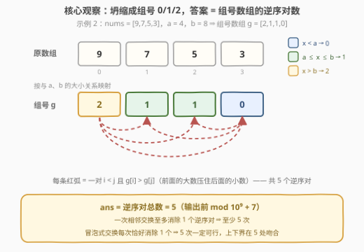
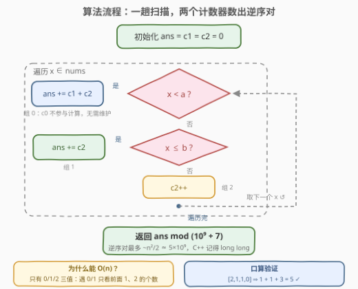

# LeetCode 划分数组的最少相邻交换次数 题解

## 1. 题目概述

- **标题 / 题号**：划分数组的最少相邻交换次数（#3994，medium）
- **链接**：https://leetcode.cn/problems/minimum-adjacent-swaps-to-partition-array/
- **难度**：中等
- **标签**：贪心、数组、逆序对

**题意**：给你一个整数数组 `nums` 和两个整数 `a`、`b`，满足 $a < b$。

如果一个数组可以按顺序分成**三个连续的部分**，且满足以下条件，则称其为**好数组**：

- 第一部分中的每个元素都**小于** $a$；
- 第二部分中的每个元素都在**闭区间** $[a, b]$ 内；
- 第三部分中的每个元素都**大于** $b$。

这三个部分中的任意一个**都可以为空**。

一次**相邻交换**可以交换 `nums` 的两个相邻元素。返回使 `nums` 成为好数组所需的**最少**相邻交换次数。由于答案可能非常大，请将其对 $10^9 + 7$ 取余后返回。

**示例 1**：

```text
输入：nums = [1,3,2,4,5,6], a = 3, b = 4
输出：1
解释：交换 nums[1] 和 nums[2]，数组变为 [1,2,3,4,5,6]，
     可分为 [1,2]、[3,4]、[5,6]，是好数组。
```

**示例 2**：

```text
输入：nums = [9,7,5,3], a = 4, b = 8
输出：5
解释：依次交换可得 [3,7,5,9]，分为 [3]、[7,5]、[9]。
```

**示例 3**：

```text
输入：nums = [3,7,5,9], a = 4, b = 8
输出：0
解释：数组已经是好数组。
```

**约束**：

- $1 \le \text{nums.length} \le 10^5$
- $1 \le \text{nums}[i] \le 10^9$
- $1 \le a < b \le 10^9$

> 💡 **审题关键**：① 三段划分是**连续**的（按下标切三刀），不是挑拣元素，且每段可为空；② 交换限定**相邻**元素——一个元素不能「瞬移」，这正是答案可能与 $n^2$ 同阶、需要取模的原因；③ $x = a$ 与 $x = b$ 都属于第二段的闭区间 $[a, b]$，映射时别把边界划错。

## 2. 解题思路

### 2.1 暴力思路

最朴素的想法是 BFS：把每种数组形态看作节点、每次相邻交换看作边，搜到第一个好数组即停——但状态数是 $n!$ 级别（即使同组元素视为相同也有组合爆炸），完全不可行。

退一步的**正确暴力**是先做下面的组号映射，再双重循环数逆序对：$O(n^2)$ 对 $(i, j)$ 逐一检查。$n \le 10^5$ 时约 $5 \times 10^9$ 次判断，超时；但这个暴力已经触及了问题的本质结构（逆序对），下面只是把它加速。

通用加速武器是归并排序或树状数组，都能 $O(n \log n)$ 数出逆序对——能过，但对本题是杀鸡用牛刀：**值域只有 $\{0, 1, 2\}$ 三个**，一趟扫描、两个计数器就够。

### 2.2 核心观察：组号坍缩 + 逆序对计数



**第一步：数值无关，坍缩成组号。** 定义每个元素的组号：

$$g(x) = \begin{cases} 0, & x < a \\ 1, & a \le x \le b \\ 2, & x > b \end{cases}$$

交换规则（相邻交换）不依赖数值，终态条件只依赖「元素与 $a$、$b$ 的大小关系」——同组的两个元素互换位置，数组的好坏性质毫无变化。因此把每个元素替换成组号后，合法交换序列与合法终态的集合不变，**答案不变**。例如示例 2：`[9,7,5,3]` ⇒ `g = [2,1,1,0]`。

**第二步：好数组 ⟺ 组号非递减。**

- 若 `g` 非递减，它必形如 `0…0 | 1…1 | 2…2`（每段可为空），在下标处切两刀即得合法三段划分；
- 反之，好数组的第一段元素全 $< a$（组号 0）、第二段全在 $[a,b]$（组号 1）、第三段全 $> b$（组号 2），组号自然非递减。

于是问题变成：**把 0/1/2 数组 `g` 变成非递减，最少相邻交换几次？**

**第三步：最少相邻交换 = 逆序对数。** 这是经典结论，下界与构造恰好吻合：

- **下界**：一次相邻交换只交换 $g[i]$ 与 $g[i+1]$，**只改变这一对元素的相对顺序**——若 $g[i] > g[i+1]$，逆序对减 1；否则逆序对不变甚至增加。即每次交换至多消除一个逆序对。非递减终态的逆序对为 0，初态有 $\mathrm{inv}$ 个，故至少需要 $\mathrm{inv}$ 次；
- **构造**：冒泡排序——只要存在相邻的逆序对（$g[i] > g[i+1]$）就交换它，每次恰好消除一个逆序对，且不会产生新的（这正是冒泡排序交换次数的精确定义）。$\mathrm{inv}$ 次后数组非递减。

> ⚠️ 注意同组元素无需交换：它们之间不构成逆序对，稳定版冒泡排序对相等元素不交换，交换次数恰为逆序对数。「最少交换次数」与「终态选哪个非递减排列」无关——逆序对数只由初态决定。

**第四步：三值特性，$O(n)$ 数完。** 只有三种值，无需归并/树状数组。从左到右扫描，维护已扫描部分中组 1、组 2 的个数 $c_1, c_2$：

- 遇到组 **0**：它和**前面每个组 1、组 2** 都构成逆序对 ⇒ `ans += c1 + c2`；
- 遇到组 **1**：它和**前面每个组 2** 构成逆序对 ⇒ `ans += c2`，然后 `c1++`；
- 遇到组 **2**：前面没有更大的值 ⇒ 只 `c2++`。

（$c_0$ 永远不被读取，根本不用维护。）

三个示例验证：

| nums | $g$ | 逆序对 | 期望答案 |
|------|-----|--------|----------|
| `[1,3,2,4,5,6]` | `[0,1,0,1,2,2]` | 1（那对 `1 > 0`） | 1 ✓ |
| `[9,7,5,3]` | `[2,1,1,0]` | 5 | 5 ✓ |
| `[3,7,5,9]` | `[0,1,1,2]` | 0 | 0 ✓ |

> 💡 **一句话总结**：把元素按 $a$、$b$ 映射成 $0/1/2$，答案就是组号数组的**逆序对总数**对 $10^9+7$ 取模；只有三个值，两个计数器一趟扫完。

### 2.3 算法流程图



| 步骤 | 操作 | 说明 |
|------|------|------|
| ① | 初始化 `ans = c1 = c2 = 0` | 只需两个计数器 |
| ② | 遍历每个 `x`，先判 `x < a`（组 0），再判 `x ≤ b`（组 1），否则组 2 | else-if 顺序天然处理闭区间边界 |
| ③ | 组 0：`ans += c1 + c2`；组 1：`ans += c2` 后 `c1++`；组 2：`c2++` | 每个元素只入账一次 |
| ④ | 返回 `ans mod (10⁹ + 7)` | 时间 $O(n)$、空间 $O(1)$ |

### 2.4 示例演算

以示例 2 `nums = [9,7,5,3]`（$a=4, b=8$）逐元素走一遍计数器：

| 步 | $x$ | 组号 $g$ | 更新前 $(c_1, c_2)$ | 本步贡献 | `ans` |
|----|-----|----------|--------------------|----------|-------|
| 1 | 9 | 2 | (0, 0) | 0（只 `c2++`） | 0 |
| 2 | 7 | 1 | (0, 1) | $c_2 = 1$（前面一个 2 压着它） | 1 |
| 3 | 5 | 1 | (1, 1) | $c_2 = 1$（前面还是只有一个 2） | 2 |
| 4 | 3 | 0 | (2, 1) | $c_1 + c_2 = 3$（前面两个 1、一个 2 全压着它） | 5 |

$\text{ans} = 5$，$5 \bmod (10^9+7) = 5$，与示例输出一致 ✓。直观验证：`[2,1,1,0]` 中所有数对 $(i<j)$ 里 $g[i] > g[j]$ 的恰有 $(0,1),(0,2),(0,3),(1,3),(2,3)$ 共 5 对。

## 3. 参考代码

### C++

```cpp
class Solution {
  public:
    int minAdjacentSwaps(vector<int>& nums, int a, int b) {
        const long long MOD = 1'000'000'007LL;
        long long ans = 0, c1 = 0, c2 = 0;   // c0 永远不被读取，无需维护
        for (int x : nums) {
            if (x < a) {
                ans += c1 + c2;              // 组 0：前面所有 1、2 都与它逆序
            } else if (x <= b) {
                ans += c2;                   // 组 1：只有前面的 2 与它逆序
                c1++;
            } else {
                c2++;                        // 组 2：前面没有更大的
            }
            ans %= MOD;
        }
        return (int)ans;
    }
};
```

> 💡 **写法要点**：
> - 逆序对上界 $\binom{n}{2} \approx 5 \times 10^9$，**超出 `int` 范围**（$\approx 2.1 \times 10^9$），`ans` 必须 `long long`；$n \le 10^5$ 时全程不取模最后再取也正确（$5 \times 10^9 < 2^{63}$），但循环内顺手取模是更稳的习惯；
> - `c1`、`c2` 是真实计数（$\le n$），**不要**对它们取模——它们是计数的「原料」，取模后的 `ans` 加上 $2n$ 以内的增量也不会溢出；
> - 判定顺序 `x < a` → `x <= b` → else，闭区间 $[a, b]$ 的两个端点自然落入组 1。

### Python

```python
class Solution:
    def minAdjacentSwaps(self, nums: list[int], a: int, b: int) -> int:
        MOD = 10**9 + 7
        ans = c1 = c2 = 0
        for x in nums:
            if x < a:
                ans += c1 + c2
            elif x <= b:
                ans += c2
                c1 += 1
            else:
                c2 += 1
        return ans % MOD
```

> 💡 **写法要点**：
> - Python 任意精度整数没有溢出问题，最后统一 `% MOD` 即可，循环内取模纯属多余；
> - 同理 `c0` 不需要——遇组 0 时只累加不自增。

## 4. 复杂度分析

| 维度 | 复杂度 | 说明 |
|------|--------|------|
| 时间 | $O(n)$ | 一趟扫描，每个元素常数次比较与累加 |
| 空间 | $O(1)$ | 只有两个计数器与累加器（组号可即时判定，无需建 `g` 数组） |
| 数值 | 逆序对 $\le \binom{n}{2} \approx 5 \times 10^9$ | 超 `int32`，C++ 需 `long long`；输出前对 $10^9+7$ 取模 |

## 5. 扩展：通用逆序对的求法

本题的 $O(n)$ 是「值域只有三个」的特权。若映射后的值域是任意 $m$ 个等级（比如按多个阈值分成 $k$ 段），就得动用通用武器：

- **归并排序**：合并两个有序半区时，右半区元素提前落位，说明左半区剩余元素都与它逆序，顺手累加左半区剩余个数，$O(n \log n)$，也是 [493. 翻转对](https://leetcode.cn/problems/reverse-pairs/) 的标准解法；
- **树状数组（BIT）**：离散化后从右往左（或从左往右）查询「已出现且比当前大/小的个数」，单点更新 + 前缀和查询，$O(n \log n)$，是 [315. 计算右侧小于当前元素的个数](https://leetcode.cn/problems/count-of-smaller-numbers-after-self/) 的标准解法；
- **0/1 特例**：值域只有两个时退化为「遇到 0 就加前面 1 的个数」，即 [3936. 将 0 移到末尾的最少交换次数](https://leetcode.cn/problems/minimum-swaps-to-move-zeros-to-end/) 的相邻交换版变体（3936 题解第 5 节）。

另一个值得记住的对照（3936 题解已详述）：**交换规则决定模型**——任意交换看错位配对计数、相邻交换看逆序对、变到指定排列看置换环。本题取模也值得玩味：答案的最少交换次数本身是真值（约 $5 \times 10^9$），取模只是输出格式；而下界/构造的论证都在真值上进行，与取模无关。

## 6. 面试要点

**Q1：为什么可以把数值直接替换成组号 0/1/2？**

> 交换规则（相邻）与终态条件（三段与 $a$、$b$ 的大小关系）都只依赖组号，与组内具体数值无关。同组元素互换不改变数组好坏，故合法交换序列与合法终态集合在替换后完全一致，最优解不变。

**Q2：为什么「好数组」等价于「组号非递减」？**

> 组号非递减 ⇒ 形如 `0…0|1…1|2…2`，切两刀即得三段；好数组 ⇒ 第一段全组 0、第二段全组 1、第三段全组 2，组号必然非递减。双向成立，且空段（刀贴着切）天然允许。

**Q3：为什么最少相邻交换次数恰好等于逆序对数？**

> 下界：一次相邻交换只改变被交换那一对的相对顺序，至多消除一个逆序对，而终态逆序对为 0；上界：冒泡排序每次交换恰好消除一个逆序对。两者在 $\mathrm{inv}$ 处吻合。同组元素不构成逆序对、也无需交换。

**Q4：怎么从 $O(n \log n)$ 降到 $O(n)$？为什么 $c_0$ 不用维护？**

> 值域只有 $\{0,1,2\}$：遇到 0 时，前面的逆序来源只能是 1 和 2（个数 $c_1 + c_2$）；遇到 1 时来源只有 2（个数 $c_2$）；遇到 2 时无来源。公式里从不出现「前面 0 的个数」，所以 $c_0$ 不需要维护。这是三值逆序对的标准化简。

**Q5：取模和溢出有什么坑？**

> 逆序对上界 $\binom{n}{2} \approx 5 \times 10^9$ 超过 `int32`，C++ 累加器必须 `long long`；计数器 $c_1, c_2 \le n$ 不能取模（是计数原料），`ans` 循环内取模或最后取模均可。注意「最少交换次数 = 逆序对数」的论证在真值上成立，取模仅是输出要求。

**Q6：本题与 75. 颜色分类 的区别是什么？**

> 两者都是 0/1/2 三分区，但 75 用双指针（荷兰国旗）以**任意位置交换**一趟原地排好，输出是数组；本题只允许**相邻交换**、输出最少次数，本质是数逆序对。规则不同、模型不同（见第 5 节的对照表）。

## 同类练习题

| # | 题目 | 与本题的关联 |
|---|------|-------------|
| 75 | [颜色分类](https://leetcode.cn/problems/sort-colors/) | 同为 0/1/2 三分区，荷兰国旗双指针任意位置交换一趟排好，对比本题「相邻交换只数次数」 |
| 315 | [计算右侧小于当前元素的个数](https://leetcode.cn/problems/count-of-smaller-numbers-after-self/) | 逆序对计数的经典题，归并/树状数组通用解法练手 |
| 493 | [翻转对](https://leetcode.cn/problems/reverse-pairs/) | 逆序对变体（$i<j$ 且 $\text{nums}[i] > 2\,\text{nums}[j]$），归并排序求 |
| 1505 | [最多 K 次交换相邻数位后得到的最小整数](https://leetcode.cn/problems/minimum-possible-integer-after-at-most-k-adjacent-swaps-on-digits/) | 相邻交换 = 移动距离/逆序对的贪心应用，树状数组加速 |
| 1850 | [邻位交换的最小位数](https://leetcode.cn/problems/minimum-adjacent-swaps-to-reach-the-kth-smallest-number/) | 变到指定排列的最少相邻交换 = 两排列间的逆序对（Kendall tau 距离） |
