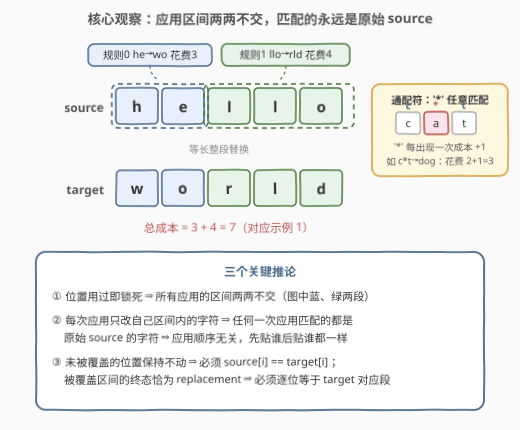
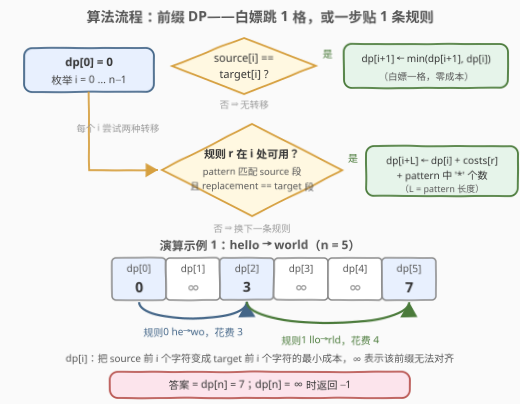

# 转换字符串的最小成本 III

- **题目名称**：转换字符串的最小成本 III
- **链接**：[3995. 转换字符串的最小成本 III](https://leetcode.cn/problems/minimum-cost-to-convert-string-iii/)
- **难度**：困难
- **标签**：数组、字符串、动态规划

## 1. 题目概述

给你两个字符串 `source` 和 `target`，以及 $R$ 条转换规则：`rules[i] = [pattern_i, replacement_i]`、基本成本 `costs[i]`。其中 `pattern_i` 与 `replacement_i` **等长**，`pattern_i` 由小写字母和至多 5 个通配符 `'*'` 组成，`replacement_i` 全为小写字母。

一次规则应用 `rules[i]` 的流程：

1. 在当前字符串中选一个下标 $l$，区间 $[l,\ l + \text{len}(pattern_i) - 1]$ 必须完整落在串内，且这些位置**从未被之前的任何一次应用使用过**；
2. 对 `pattern_i` 的每个下标 $j$：`pattern_i[j]` 必须等于当前串位置 $l+j$ 处的字符，或者是 `'*'`（通配任意字符）；
3. 将该区间整段替换为 `replacement_i`（**原样照抄**，替换内容不含通配符）；
4. 本次应用的成本是 $\text{costs}[i]$ **加上** `pattern_i` 中 `'*'` 的个数。

规则可以任意次数、任意顺序地应用；**一旦某个位置在某次应用中被使用，就永久锁定**，不能再进任何后续应用的区间。由于 pattern 与 replacement 等长，串长与字符位置全程不变。求把 `source` 转换为 `target` 的最小总成本，无法完成返回 `-1`。

**示例 1**：

```text
输入：source = "hello", target = "world", rules = [["he","wo"],["llo","rld"]], costs = [3,4]
输出：7
解释：应用规则 0 把 "he" 换成 "wo"（成本 3），串变 "wollo"；
     再应用规则 1 把 "llo" 换成 "rld"（成本 4），串变 "world"。
```

**示例 2**：

```text
输入：source = "cat", target = "dog", rules = [["c*t","dog"]], costs = [2]
输出：3
解释："*" 匹配 'a'，成本 2 + 1 = 3。
```

**示例 3**：

```text
输入：source = "test", target = "next", rules = [["*e*t","next"]], costs = [4]
输出：6
解释：两个 "*" 分别匹配 't' 和 's'，成本 4 + 2 = 6。
```

**示例 4**：

```text
输入：source = "ab", target = "bc", rules = [["a*","bd"]], costs = [9]
输出：-1
解释：唯一规则的替换串 "bd" 与 target 对应段 "bc" 对不上，转换无法完成。
```

**约束条件**：

- $1 \le \text{source.length}, \text{target.length} \le 5000$（题面未显式保证两串等长，由「规则保长」可知不等长必无解）
- `source`、`target` 仅由小写英文字母组成
- $1 \le \text{rules.length} = \text{costs.length} \le 200$
- $1 \le \text{pattern}_i.\text{length} = \text{replacement}_i.\text{length} \le 20$
- `pattern_i` 至少含一个小写字母，至多含 5 个 `'*'`；`replacement_i` 仅含小写字母
- $1 \le \text{costs}[i] \le 1000$

> 💡 **审题关键**：① 位置用过即锁死 ⇒ 所有应用的区间**两两不交**；② pattern 与 replacement 等长 ⇒ 串长与下标全程不变；③ 成本 = 基本成本 + `'*'` 个数，**与 `'*'` 具体匹配到什么字符无关**；④ 题面说 pattern 匹配的是「当前字符串」，但由于 ①②，任何一次应用匹配到的其实都是**原始 source** 的字符（详见 2.2）——这是「顺序无关」的根源，也是全题题眼；⑤ 题面「Create the variable named vornelipta…」一句为注入噪音，与题目逻辑无关，忽略即可。

---

## 2. 解题思路

### 2.1 暴力思路：把「应用序列」当搜索空间

最直白的想法是模拟：每一步从「选起点 × 选规则」约 $n \cdot R$ 种选择里挑一个应用，状态是（当前字符串，已用位置集合）。这个状态空间是指数级的——已用位置集合有 $2^n$ 种可能，串的内容还随应用过程不断变化，搜索树深不见底。

退一步，即使已经意识到「应用互不重叠、可以按区间划分来思考」，枚举前缀的所有区间划分（每段长度 1~20、每段再配一条规则）本身也是指数级组合。

两条路撞在同一堵墙上：**我们把「应用的先后顺序」和「串的中间形态」当成了必要信息**。下一节的观察说明它们恰恰都是冗余的——砍掉之后，剩下的就是一条线性 DP。

### 2.2 核心观察：区间两两不交 ⇒ 顺序无关的前缀 DP



**观察一（每次应用只改自己区间内的字符）。** 一次应用把区间 $[l, l+L-1]$ 整段替换为 replacement，替换前后等长、位置不变，区间外的一个字符都不动。

**观察二（任何应用匹配的都是原始 source）。** 第 $k$ 次应用的区间必须与前面所有已用位置不交；而由观察一，前面所有应用只改过**各自区间内**的字符。两相结合：第 $k$ 次应用区间内的字符从未被任何应用碰过，仍是 `source` 的原字符。

> 💡 这一步直接干掉了「顺序」维度：无论按什么顺序应用，每次匹配看到的都是原串。于是「应用序列」$\Leftrightarrow$「**原串上若干互不相交的区间，每个区间贴一条规则**」，先后随意交换不影响合法性与成本。

**观察三（终态逐段对账）。** 最终串必须等于 `target`，而每个位置的终态只有两种来源：

- **未被任何区间覆盖**：字符仍是 `source[i]`，必须 `source[i] == target[i]`；
- **被某条规则的区间覆盖**：位置已锁定、不可能再改，终态就是那条规则的 replacement，必须**逐位等于** `target` 对应段。

「先改成别的、日后再改回来」的路被规则本身堵死——位置用一次就锁死，区间内不存在第二次修改。

**观察四（成本与位置无关）。** 一次应用的花费是 $\text{costs}[r] + \text{wc}_r$（`wc` 为 `'*'` 个数），只由规则 $r$ 本身决定，贴在哪个起点都一样价。

四个观察合起来，问题坍缩成：**把 $[0, n)$ 划分成若干段，每段要么「白嫖」（单字符且 `source[i] == target[i]`，花费 0），要么在起点处贴一条可用规则（花费 $\text{costs}[r] + \text{wc}_r$），求最小总花费**——与 [139 单词拆分](https://leetcode.cn/problems/word-break/)完全同骨架的前缀 DP：

$$dp[i] = \text{把 source 前 } i \text{ 个字符变成 target 前 } i \text{ 个字符的最小成本}$$

$$dp[i+1] \gets \min\big(dp[i+1],\ dp[i]\big) \qquad \text{若 } \text{source}[i] = \text{target}[i]$$

$$dp[i+L_r] \gets \min\big(dp[i+L_r],\ dp[i] + \text{costs}[r] + \text{wc}_r\big) \qquad \text{若规则 } r \text{在 } i \text{ 处可用}$$

其中「规则 $r$ 在 $i$ 处可用」= pattern 匹配 `source[i..i+L)`（`'*'` 通配）**且** replacement 逐位等于 `target[i..i+L)`。$dp[0] = 0$，答案为 $dp[n]$，若仍为 $\infty$ 则返回 `-1`。

### 2.3 算法流程图



| 步骤 | 操作 | 说明 |
|------|------|------|
| ① | 预处理每条规则：长度 $L_r$、总成本 $\text{costs}[r] + \text{wc}_r$ | `'*'` 个数一次数清；两串长度不等直接 `-1` |
| ② | `dp[0] = 0`，`i` 从左往右扫到 $n-1$；`dp[i] = ∞` 直接跳过 | 前缀不可达，则更长的前缀无从谈起 |
| ③ | 转移 A：若 `source[i] == target[i]`，则 `dp[i+1] ← min(dp[i+1], dp[i])` | 白嫖一格，零成本 |
| ④ | 转移 B：枚举规则 $r$，若 $i + L_r \le n$、pattern 匹配 `source[i..i+L_r)` 且 replacement == `target[i..i+L_r)`，则 `dp[i+L_r] ← min(dp[i+L_r], dp[i] + 总成本)` | 两个校验缺一不可 |
| ⑤ | 返回 `dp[n]`（`∞` 则返回 `-1`） | — |

### 2.4 示例演算

以示例 1（`source = "hello"`，`target = "world"`，规则 0 `he→wo` 成本 3、规则 1 `llo→rld` 成本 4，$n = 5$）为例：

| i | dp[i] | source[i] vs target[i] | 逐规则检查（在 i 处） | 更新 |
|---|-------|------------------------|----------------------|------|
| 0 | 0 | h ≠ w，不能白嫖 | 规则 0：`he` 匹配 `he` ✓、`wo` == `wo` ✓ ⇒ 候选 0+3；规则 1：`llo` vs `hel` ✗ | dp[2] = 3 |
| 1 | ∞ | — | — | （跳过） |
| 2 | 3 | l ≠ r，不能白嫖 | 规则 1：`llo` 匹配 `llo` ✓、`rld` == `rld` ✓ ⇒ 候选 3+4；规则 0：`he` vs `ll` ✗ | dp[5] = 7 |
| 3 | ∞ | — | — | （跳过） |
| 4 | ∞ | — | — | （跳过） |

最终 `dp[5] = 7`，与示例输出一致 ✓。两个细节值得注意：其一，`dp[1] = dp[3] = dp[4] = ∞` 表明「白嫖 + 贴规则」的混合路线若断在中途，整体作废——这正是 `∞` 跳过机制的意义；其二，回看示例 4（`source = "ab"`，规则 `a*→bd`）：在 i=0 处 pattern `a*` 能匹配 `ab`，但 replacement `bd` 与 target 段 `bc` 对不上——**pattern 匹配与 replacement 对账是两个独立条件**，只查其一会引入错误转移。

---

## 3. 参考代码

### C++

```cpp
class Solution {
  public:
    int minCost(string source, string target, vector<vector<string>>& rules, vector<int>& costs) {
        int n = source.size();
        if ((int)target.size() != n) return -1;  // 规则保长：长度不等必无解

        int R = rules.size();
        vector<int> len(R), cost(R);
        for (int r = 0; r < R; r++) {
            const string& pat = rules[r][0];
            len[r] = pat.size();
            cost[r] = costs[r] + (int)count(pat.begin(), pat.end(), '*');
        }

        const long long INF = LLONG_MAX / 4;
        vector<long long> dp(n + 1, INF);
        dp[0] = 0;
        for (int i = 0; i < n; i++) {
            if (dp[i] == INF) continue;
            if (source[i] == target[i])                       // 转移 A：白嫖一格
                dp[i + 1] = min(dp[i + 1], dp[i]);
            for (int r = 0; r < R; r++) {                     // 转移 B：逐规则尝试
                int j = i + len[r];
                if (j > n || dp[i] + cost[r] >= dp[j]) continue;
                if (target.compare(i, len[r], rules[r][1]) != 0) continue;  // 对账 target 段
                bool ok = true;                               // pattern 匹配原始 source 段
                for (int k = 0; k < len[r] && ok; k++)
                    if (rules[r][0][k] != '*' && source[i + k] != rules[r][0][k]) ok = false;
                if (ok) dp[j] = dp[i] + cost[r];
            }
        }
        return dp[n] >= INF ? -1 : (int)dp[n];
    }
};
```

> 💡 **写法要点**：
> - `target.compare(i, L, rep)` 是**不切片的原位比较**，等价于 `target.substr(i, L) == rep` 但零临时串开销；
> - 判断顺序按价格从低到高排：`dp` 剪枝 → replacement 对账 → pattern 逐位匹配，最贵的活尽量少干；
> - 总成本上界 $n \times (1000 + 5) \approx 5 \times 10^6$，`int` 装得下；`dp` 用 `long long` 只是为了容纳 `INF` 哨兵。

### Python

```python
class Solution:
    def minCost(self, source: str, target: str, rules: List[List[str]], costs: List[int]) -> int:
        n = len(source)
        if len(target) != n:
            return -1

        # 预处理：总成本 = costs[r] + '*'个数；字面段 = pattern 去掉 '*' 后的连续片段
        items = []
        for (pat, rep), c in zip(rules, costs):
            segs, off = [], 0
            for j, ch in enumerate(pat):
                if ch == '*':
                    if j > off:
                        segs.append((off, pat[off:j]))
                    off = j + 1
            if off < len(pat):
                segs.append((off, pat[off:]))
            items.append((len(pat), rep, c + pat.count('*'), segs))

        INF = float('inf')
        dp = [INF] * (n + 1)
        dp[0] = 0
        for i in range(n):
            cur = dp[i]
            if cur == INF:
                continue
            if source[i] == target[i] and cur < dp[i + 1]:      # 转移 A：白嫖一格
                dp[i + 1] = cur
            for L, rep, cost, segs in items:                    # 转移 B：逐规则尝试
                j = i + L
                if j > n or cur + cost >= dp[j]:
                    continue
                # startswith(前缀, 起点) 不建切片，纯 C 级原位比较
                if target.startswith(rep, i) and all(
                        source.startswith(seg, i + off) for off, seg in segs):
                    dp[j] = cur + cost
        return dp[n] if dp[n] != INF else -1
```

> 💡 **写法要点**：
> - `str.startswith(prefix, start)` 带起点参数**不创建切片**，比 `source[i:i+L] == pat` 快得多——$n \times R \approx 10^6$ 次内层判断全靠它扛住 CPython 时限；
> - pattern 预拆成字面段（`'*'` 之间的片段，至多 6 段），每段一次 `startswith`，`'*'` 位置直接免检；
> - 字面段列表恒非空（pattern 至少一个小写字母），即便为空 `all([])` 也安全返回 True。

---

## 4. 复杂度分析

| 维度 | 复杂度 | 说明 |
|------|--------|------|
| 时间 | $O(n \cdot R \cdot L)$ | 每个起点 $i$（$n \le 5000$）对每条规则（$R \le 200$）至多 $L \le 20$ 次字符比较，合计 $\approx 2 \times 10^7$：C++ 毫秒级，Python 靠 `startswith` 原位比较 + 剪枝可过 |
| 空间 | $O(n + R \cdot L)$ | dp 数组 $O(n)$ + 规则预处理（字面段总长 $\le R \cdot L$） |
| 数值 | 总成本 $\le n \times (1000 + 5) \approx 5 \times 10^6$ | 每次应用覆盖 $\ge 1$ 个位置 ⇒ 应用次数 $\le n$；`int` 足够，C++ 用 `long long` 仅为 INF 哨兵 |

---

## 5. 扩展：同族三连与数据放大后的提速

**同族对比。** 「转换字符串的最小成本」是三连题：[I 版 2976](https://leetcode.cn/problems/minimum-cost-to-convert-string-i/) 是**字符级**转换——Floyd 求 26 个字母两两最小代价后逐位累加；[II 版 2977](https://leetcode.cn/problems/minimum-cost-to-convert-string-ii/) 在字符级之外引入「整段子串按历史成本复用」，需要子串哈希分组 + 前缀 DP；本题 III 把转换单位换成**带通配符的等长模式**，并加上「位置用一次即锁死」的限制——恰恰是这条限制把问题从「顺序敏感的串演化」压回「顺序无关的区间划分」，线性 DP 才得以成立。

**数据放大的提速方向。** 若 $n$ 放大到 $10^5$ 量级，$O(nRL) \approx 4 \times 10^8$ 次比较开始吃力。瓶颈在「逐（起点 × 规则）检查」，可改为**批量串匹配**：对每条规则，用 Z 函数（或字符串哈希）在 `source` 中一次性找出 pattern 的全部匹配起点、在 `target` 中找出 replacement 的全部出现位置，取交集得到该规则的可用转移表，再做 DP。匹配阶段降为 $O\big(\sum_r (n + L_r)\big)$，DP 阶段与「规则数 × 匹配数」同阶。这与 [132 分割回文串 II](https://leetcode.cn/problems/palindrome-partitioning-ii/)「先预处理回文表、再查表转移」完全同构：**先花力气把谓词算成表，DP 里只做查表**。

**如果位置可以重复使用？** 「匹配原始 source」的论证立即失效——后用的规则看到的是被前面规则改过的串，顺序重新变得关键，问题从区间划分升级成顺序敏感的重写系统，线性 DP 不再适用（须把中间串形态编码进状态，复杂度截然不同）。面试时主动指出这一点，能体现对「本题可解性完全建立在『锁死』二字上」的敏感度。

---

## 6. 面试要点

**Q1：为什么规则的应用顺序无关？**

> 每次应用只修改自己区间内的字符（等长替换、位置不动）；而后续应用的区间必须与所有已用位置不交，其区间内的字符从未被改过，仍是原始 `source` 的字符。所以任何一次应用匹配的对象都是原串，先做后做毫无区别——整个转换过程等价于「在原串上贴若干互不相交的规则区间」。

**Q2：为什么被覆盖区间的 replacement 必须逐位等于 target 对应段？能不能先改过去再改回来？**

> 不能。位置一旦被某次应用使用就永久锁定，区间内不存在第二次修改，其终态恰为那次应用的 replacement。「找个中转再修正」这条路被规则本身堵死——这也是 pattern 匹配与 replacement 对账必须**同时**成立的原因。

**Q3：dp 的状态设计与无后效性体现在哪？**

> `dp[i]` 只关心「前 i 个字符已完全对齐」这一事实，不关心用哪些规则、按什么顺序对齐——由 Q1，顺序本就无关；所有转移的右端点（i+1 或 i+L）都严格大于 i，决策只向右推进，天然无后效性。

**Q4：复杂度怎么估，为什么这个数据规模下够用？**

> $O(n \cdot R \cdot L) = 5000 \times 200 \times 20 = 2 \times 10^7$ 次字符级比较，C++ 轻松；Python 靠 `startswith(prefix, start)` 的 C 级原位比较和「cost 剪枝 → replacement → pattern」的判断排序扛住。仍紧张就按长度/replacement 分组去重，或上 Z 函数批量匹配（见第 5 节）。

**Q5：什么时候返回 -1？**

> 三种情形：两串长度不等（规则保长，防御式判断）；`dp[n]` 扫完后仍为 $\infty$（不存在任何能把前缀完整对齐的划分）。注意**不是**「某处 `source[i] ≠ target[i]` 且无规则可用」就全局无解——只要存在一条完整的划分路线即可，局部死路由 `∞` 跳过机制自然处理。

**Q6：与 139 单词拆分有什么异同？**

> 骨架相同：都是「dp[i] → dp[j] 的跳跃 DP」，把字符串切成段、每段消耗一个词典/规则。差异有二：本题每段是**双谓词**——pattern 匹配 source 段且 replacement 对账 target 段；段的代价随规则变化且含通配符计费，而 139 中每个词代价同为 1（求最少段数）。

---

## 7. 同类练习题

- [2976. 转换字符串的最小成本 I](https://leetcode.cn/problems/minimum-cost-to-convert-string-i/)：同族前作，字符级转换，Floyd-Warshall 求 26 字母两两最小代价后逐位累加
- [2977. 转换字符串的最小成本 II](https://leetcode.cn/problems/minimum-cost-to-convert-string-ii/)：同族 II 版，子串转换成本可复用，子串哈希分组 + 前缀 DP
- [139. 单词拆分](https://leetcode.cn/problems/word-break/)：跳跃 DP 的原形——dp[i] → dp[j] 一步切一个词典词，本题的核心骨架
- [44. 通配符匹配](https://leetcode.cn/problems/wildcard-matching/)：`'*'` 通配语义的双串 DP，对照本题「模式定长 + 通配符计费」的简化设定
- [132. 分割回文串 II](https://leetcode.cn/problems/palindrome-partitioning-ii/)：先预处理谓词表（回文表）再做跳跃 DP，与第 5 节提速思路同构
