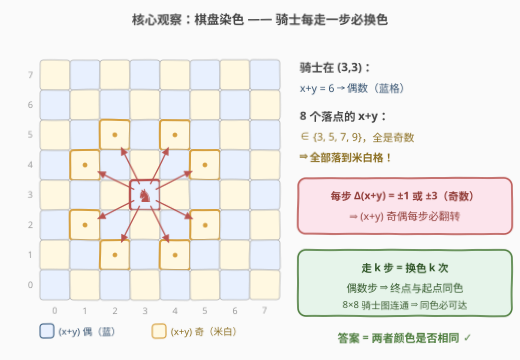

# LeetCode 偶数次骑士移动 题解

## 1. 题目概述

- **标题 / 题号**：偶数次骑士移动（#3996，easy）
- **链接**：https://leetcode.cn/problems/even-number-of-knight-moves/
- **难度**：简单
- **标签**：数组、数学

**题意**：给你两个整数数组 `start` 和 `target`，每个数组的形式均为 `[x, y]`，表示标准 8 x 8 国际象棋棋盘上的一个格子。

如果骑士可以用 **偶数** 次移动从 `start` 到达 `target`，则返回 `true`；否则返回 `false`。

骑士的一次合法移动是：沿一个方向移动两格，再沿与其垂直的方向移动一格（即「日字」移动，从棋盘中间的格子出发有 8 种落点）。

**示例 1**：

```text
输入：start = [1,1], target = [2,2]
输出：true
解释：一种可行序列 (1,1) → (3,2) → (2,4) → (4,3) → (2,2)，共 4 步，4 是偶数。
```

**示例 2**：

```text
输入：start = [4,5], target = [6,6]
输出：false
解释：骑士无法用偶数次移动从 (4,5) 到达 (6,6)。
```

**约束**：

- `start.length == target.length == 2`
- $0 \le \text{start}[i], \text{target}[i] \le 7$

> 💡 **审题关键**：① 问的是「**存在**一条偶数长度的路径」——后文会证明对骑士而言，从 A 到 B 的**所有**路径长度奇偶相同，所以「存在偶数路径」等价于「每条路径都是偶数」；② `start == target` 是合法输入，0 步即达且 0 是偶数；③ 坐标 $0 \le x, y \le 7$，棋盘固定 8×8。

## 2. 解题思路

### 2.1 暴力思路：BFS（格子, 步数奇偶）

把 64 个格子看作节点、骑士移动连边建图。直接 BFS 只记「到没到过」不够——还需区分步数的奇偶，于是把奇偶编进状态：$(格子, p)$，其中 $p$ 为已用步数模 2。初始状态 $(start, 0)$，问 $(target, 0)$ 是否可达；每走一步 $p \to p \oplus 1$。状态总数 $64 \times 2 = 128$，每个状态至多 8 个转移，总代价 $O(64 \times 8)$，常数级。

复杂度没有问题，问题在于**杀鸡用牛刀**：建图、入队、判重，全都为了回答一个本质上只关乎「奇偶」的问题。而奇偶恰好是一个不需要搜索、可以**原地判定**的量。

### 2.2 核心观察：棋盘染色，每步必换色



**观察一（每步翻转颜色）**：骑士一步是 $(\pm 1, \pm 2)$ 或 $(\pm 2, \pm 1)$，于是

$$
\Delta(x+y) \in \{\pm 1, \pm 3\} \quad (\text{全为奇数})
$$

所以 $(x+y) \bmod 2$ **每走一步必然翻转**。按 $(x+y)$ 的奇偶把 64 格染成两色——这正是国际象棋棋盘的黑白格，「马走日必换色」。

**观察二（必要性）**：走 $k$ 步 = 换色 $k$ 次。$k$ 为偶 ⇒ 终点与起点**同色**；$k$ 为奇 ⇒ 终点**异色**。因此偶数步**永远落在**同色格上——奇数步则永远到不了同色格（`start == target` 时 0 步即达；1 步必然离开原色，回不来）。

**观察三（充分性）**：8×8 棋盘的骑士图是**连通**的（任意两格互达，经典事实；一般地 $n \times n$（$n \ge 4$）骑士图连通），且按颜色划分它是**二部图**。任取 $A \to B$ 的两条路径，首尾相接拼成一个闭途径；二部图中每条边都在两色之间往返，闭途径长度必为偶 ⇒ **任意两条 $A \to B$ 路径的长度奇偶相同**。于是「路径长度的奇偶」是被端点颜色唯一锁定的定量：同色格之间既然有路径，这些路径就全是偶数步。

三条观察合并：

$$
\text{偶数步可达} \iff \text{起点与终点同色} \iff (s_x + s_y) \bmod 2 = (t_x + t_y) \bmod 2
$$

> ⚠️ 观察三不可省略：只有「每步换色」（观察一/二）得到的是**必要性**——若骑士图不连通，同色格之间可能根本没有路径（3×3 棋盘的中心格 8 个落点全部越界，是孤点）。8×8 的连通性让「同色」恰好等价于「偶数步可达」。

### 2.3 算法流程图


| 步骤 | 操作 | 说明 |
|------|------|------|
| ① | 计算 $p_1 = (s_x + s_y) \bmod 2$ | 起点「颜色」 |
| ② | 计算 $p_2 = (t_x + t_y) \bmod 2$ | 终点「颜色」 |
| ③ | 比较 $p_1$ 与 $p_2$ | 相同 → `true`；不同 → `false` |

### 2.4 示例演算

- **示例 1**：$(1,1)$ 的 $x+y = 2$（偶）；$(2,2)$ 的 $x+y = 4$（偶）。同色 ⇒ `true`。官方给出的 4 步路径只是**任意一条**——由观察三，从 $(1,1)$ 到 $(2,2)$ 的每条路径都恰是偶数步。
- **示例 2**：$(4,5)$ 的 $x+y = 9$（奇）；$(6,6)$ 的 $x+y = 12$（偶）。异色 ⇒ `false`。骑士无论怎么绕，步数只能是奇数，永远差一步。
- **边界**：`start == target`（如都是 $[0,0]$）：0 步即达，0 是偶数 ⇒ `true`；同色判定对自身天然成立，**无需特判**。

## 3. 参考代码

### C++

```cpp
class Solution {
  public:
    bool canReach(vector<int>& start, vector<int>& target) {
        return (start[0] + start[1]) % 2 == (target[0] + target[1]) % 2;
    }
};
```

> 💡 **写法要点**：
> - 判据只依赖 $x+y$ 的奇偶，与坐标语义（`x` 是行还是列）无关——加法可交换；
> - 非负数下 `% 2` 可换成 `& 1`，按位与略快；
> - 无任何边界分支：`start == target`、对角线、角落格全部被同一条奇偶等式覆盖。

### Python

```python
class Solution:
    def canReach(self, start: List[int], target: List[int]) -> bool:
        return (start[0] + start[1]) % 2 == (target[0] + target[1]) % 2
```

## 4. 复杂度分析

| 维度 | 复杂度 | 说明 |
|------|--------|------|
| 时间 | $O(1)$ | 两次加法、两次取模、一次比较 |
| 空间 | $O(1)$ | 无额外数据结构 |
| BFS 对照 | $O(64 \times 8)$ 时间 / $O(128)$ 空间 | 状态 $(格子, 奇偶)$ 共 128 个；同为常数，但建模、代码量与出错面都大得多 |

## 5. 扩展：BFS 兜底模板与「每步翻转变色」的不变量家族

染色 O(1) 判定依赖两个前提：**① 每步 $(x+y)$ 奇偶翻转**（由移动规则决定）；**② 骑士图连通**（由棋盘大小决定）。任一前提破坏时，退回 BFS（格子, 步数奇偶）：

- **棋盘变小**：3×3 棋盘的中心格是孤点，连通性破坏；
- **规则改变**：若换成「象走对角」，每步 $\Delta(x+y) = \pm 2k$（偶），奇偶**不**翻转——不变量变成「颜色永不改变」，偶数步可达性也不再是一次比较能回答的，须老老实实搜索。

```python
class Solution:
    def canReach(self, start: List[int], target: List[int]) -> bool:
        DIRS = [(1, 2), (1, -2), (-1, 2), (-1, -2),
                (2, 1), (2, -1), (-2, 1), (-2, -1)]
        s = start[0] * 8 + start[1]
        t = target[0] * 8 + target[1]
        vis = [[False] * 2 for _ in range(64)]      # (格子, 步数奇偶)
        q = deque([(s, 0)])
        vis[s][0] = True
        while q:
            c, p = q.popleft()
            if c == t and p == 0:
                return True
            x, y = divmod(c, 8)
            for dx, dy in DIRS:
                nx, ny = x + dx, y + dy
                if 0 <= nx < 8 and 0 <= ny < 8 and not vis[nx * 8 + ny][p ^ 1]:
                    vis[nx * 8 + ny][p ^ 1] = True
                    q.append((nx * 8 + ny, p ^ 1))
        return False
```

> 💡 把「步数奇偶」编进搜索状态是处理「**恰好 / 偶数次到达**」类问题的通用技巧：状态图 $=$ 原图 $\times \{0, 1\}$，凡是「每步必然翻转的二元量」都可以这样降维跟踪（同款手法见 [785. 判断二分图](https://leetcode.cn/problems/is-graph-bipartite/) 的染色判定、[136. 只出现一次的数字](https://leetcode.cn/problems/single-number/) 的异或抵消）。

「发现一个每步必然变化的二元量，把问题坍缩成一次比较」是不变量思想的最小应用，同一家族还有：[1812. 判断国际象棋棋盘中一个格子的颜色](https://leetcode.cn/problems/determine-color-of-a-chessboard-square/)（同款 $(x+y)$ 染色）、[319. 灯泡开关](https://leetcode.cn/problems/bulb-switcher/)（因子成对出现，只有完全平方数被切换奇数次）。

## 6. 面试要点

**Q1：为什么骑士每走一步必换色？**

> 一步移动是 $(\pm 1, \pm 2)$ 或 $(\pm 2, \pm 1)$，$\Delta(x+y) \in \{\pm 1, \pm 3\}$ 全为奇数，所以 $(x+y) \bmod 2$ 每步必翻转。这正是国际象棋「马走日必换黑白格」的代数表达；等价说法：每步 $\lvert \Delta x \rvert + \lvert \Delta y \rvert = 3$ 为奇数。

**Q2：「同色」为什么恰好等价于「偶数步可达」？**

> 两个方向：**必要性**——每步换色，走 $k$ 步换色 $k$ 次，偶数步必落同色格；**充分性**——8×8 骑士图连通，同色格之间必有路径；又因骑士图是二部图，任两条 $A \to B$ 路径拼成偶闭途径 ⇒ 路径长度奇偶唯一，同色格之间的路径只能全是偶数步。二者合并：同色 ⟺ 偶数步可达。

**Q3：`start == target` 需要特判吗？**

> 不需要。0 是偶数，0 步即达；同色判定对自身天然成立（同一格的 $(x+y)$ 奇偶显然相等），一行代码零特判。反过来「恰好 1 步回到自身」反而做不到——一步必换色，落不回原格。

**Q4：换小棋盘或换移动规则，这个 O(1) 判定还成立吗？**

> 奇偶翻转性只依赖「每步 $\lvert \Delta x \rvert + \lvert \Delta y \rvert$ 为奇数」；连通性依赖棋盘尺寸（$n \times n$ 在 $n \ge 4$ 时连通，3×3 的中心格是孤点）。任一被破坏，判定失效，退回 BFS（格子, 步数奇偶），状态数 $2mn$。面试中先问清「棋盘多大、规则是什么」，再决定写一行还是写 BFS。

**Q5：这类「奇偶 / 不变量」思想还能用在哪？**

> 一旦某个二元状态每步（或每个关键事件）必然翻转，路径长度或计数的奇偶就被锁死，「存在性 / 计数」问题常坍缩成 O(1) 判定：本题的棋盘染色、[319. 灯泡开关](https://leetcode.cn/problems/bulb-switcher/) 的因子配对、Nim 博弈的异或和、[785. 判断二分图](https://leetcode.cn/problems/is-graph-bipartite/) 的双色划分，本质都是「找一个必然变化的量」。

## 同类练习题

| # | 题目 | 与本题的关联 |
|---|------|-------------|
| 1812 | [判断国际象棋棋盘中一个格子的颜色](https://leetcode.cn/problems/determine-color-of-a-chessboard-square/) | 同款 $(x+y)$ 奇偶染色，去掉骑士只判格子颜色 |
| 688 | [骑士在棋盘上的概率](https://leetcode.cn/problems/knight-probability-in-chessboard/) | 骑士移动 + 棋盘概率 DP，BFS 状态加一维「剩余步数」 |
| 1197 | [进击的骑士](https://leetcode.cn/problems/minimum-knight-moves/) | 骑士移动 BFS 求最短步数，对照本题「连最短路都不用求」 |
| 785 | [判断二分图](https://leetcode.cn/problems/is-graph-bipartite/) | 把棋盘染色推广到一般图的 DFS/BFS 染色判定 |
| 319 | [灯泡开关](https://leetcode.cn/problems/bulb-switcher/) | 另一个经典奇偶不变量——因子成对出现，只有完全平方数被切换奇数次 |
