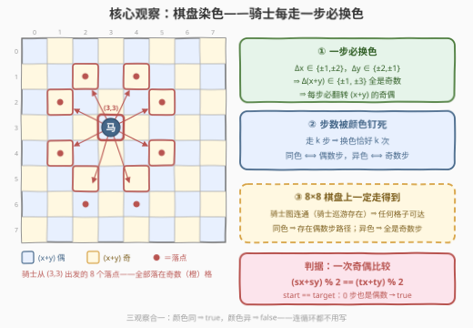
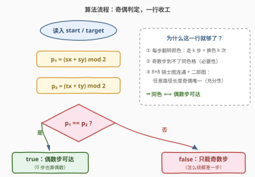

# 偶数次骑士移动

- **题目名称**：偶数次骑士移动
- **链接**：[3996. 偶数次骑士移动](https://leetcode.cn/problems/even-number-of-knight-moves/)
- **难度**：简单
- **标签**：数组、数学

## 1. 题目概述

给你两个整数数组 `start` 和 `target`，均形如 `[x, y]`，表示标准 8×8 国际象棋棋盘上的一个格子。如果骑士可以用**偶数**次移动从 `start` 到达 `target`，返回 `true`；否则返回 `false`。

骑士的一次合法移动：沿一个方向移动两格，再沿与其垂直的方向移动一格（从一个格子出发共 8 种走法）。

**示例 1**：

```text
输入：start = [1,1], target = [2,2]
输出：true
解释：一种可行的移动序列为 (1,1) -> (3,2) -> (2,4) -> (4,3) -> (2,2)，
     骑士经过 4 次移动到达目标位置，4 是偶数，因此返回 true。
```

**示例 2**：

```text
输入：start = [4,5], target = [6,6]
输出：false
解释：骑士无法用偶数次移动从 (4,5) 到达 (6,6)，因此返回 false。
```

**约束条件**：

- `start.length == target.length == 2`
- `0 <= start[i], target[i] <= 7`

> 💡 **审题关键**：① 问的是「**存在某条**偶数步路径」而非「最少多少步」——只问可达性的奇偶，不问具体步数；② $0$ 也是偶数，`start == target` 时答案天然为 `true`；③ 棋盘固定 8×8 且无障碍——这个「足够大」是 O(1) 判据成立的前提（见第 5 节）。

---

## 2. 解题思路

### 2.1 暴力思路

把 64 个格子当节点、骑士一步连一条边，从 `(start, 偶)` 出发做 BFS：状态 = **（格子, 已用步数的奇偶）**，共 $64 \times 2 = 128$ 个，每走一步奇偶位翻转，问 `(target, 偶)` 是否可达。状态数常数级、写起来也短，但本质是「搜索」一个只依赖奇偶性的答案——扫一遍 128 个状态才收工，属于杀鸡用牛刀。本题只问奇偶，存在一次比较的 O(1) 判定。

### 2.2 核心观察：棋盘染色——每走一步必换色



**观察一（一步必换色）**：骑士一步是「一轴 $\pm 2$、垂直轴 $\pm 1$」，因此坐标和的变化量

$$
\Delta(x+y) = (\pm 2) + (\pm 1) \in \{+3,\ +1,\ -1,\ -3\}
$$

四种组合**全是奇数**。按 $x+y$ 的奇偶给格子染色（这正是国际象棋的黑白格），每走一步 $(x+y)$ 的奇偶必翻转——骑士一步之内**永远踩不到同色格**。

**观察二（步数被颜色钉死）**：走 $k$ 步就是换色 $k$ 次，于是

$$
\text{终点与起点同色} \iff k \text{ 为偶数}
$$

**观察三（8×8 上一定走得到）**：前两条只给出必要条件（偶数步到达 ⟹ 同色），还要确认「同色的终点确实存在偶数步路径」。8×8 棋盘的骑士图是**连通**的——任意两格互相可达（骑士巡游 Knight's Tour 的存在性是经典结论）。骑士图又按颜色天然**二部**（每条边跨色），于是：同色格之间必有路径，且**任何**路径长度都是偶数；异色格之间的任何路径都是奇数。必要性 + 充分性齐活，答案坍缩成一次奇偶比较：

$$
\text{answer} = \big[\, (s_x + s_y) \bmod 2 = (t_x + t_y) \bmod 2 \,\big]
$$

> ⚠️ 观察三不可省略：在骑士图不连通的棋盘上（如 1×n 棋盘骑士根本无法移动、3×3 棋盘中心格孤立），「同色」只是必要条件，须退回 BFS（见第 5 节）。

### 2.3 算法流程图



整个算法只有两次加法、两次取模、一次比较：同色返回 `true`（连通性保证存在偶数步路径；`start == target` 时 0 步也是偶数），异色返回 `false`（一切路径都是奇数步）。

### 2.4 示例演算

**示例 1** `start = [1,1]`，`target = [2,2]`：$1+1=2$（偶），$2+2=4$（偶）——同色 ⇒ `true`。官方路径 `(1,1)→(3,2)→(2,4)→(4,3)→(2,2)` 恰好 4 步，途中 $x+y$ 依次为 $2, 5, 6, 7, 4$——奇偶每步翻转、共翻 4 次回到偶数。✓

**示例 2** `start = [4,5]`，`target = [6,6]`：$4+5=9$（奇），$6+6=12$（偶）——异色 ⇒ `false`。骑士每步换色，从奇格出发走任何步数都不可能停在偶格，更谈不上「偶数步到达」。✓

**边界** `start == target`：0 步（偶数）即达，`true`；判据两侧相等天然给出 `true`，无需特判。✓

---

## 3. 参考代码

### C++

```cpp
class Solution {
  public:
    bool canReach(vector<int>& start, vector<int>& target) {
        return (start[0] + start[1]) % 2 == (target[0] + target[1]) % 2;
    }
};
```

### Python

```python
class Solution:
    def canReach(self, start: list[int], target: list[int]) -> bool:
        return (start[0] + start[1]) % 2 == (target[0] + target[1]) % 2
```

> 💡 **写法要点**：
> - 判据只有一行：两侧 `(x+y) % 2` 相等即同色；
> - `0 <= x, y <= 7` 保证坐标合法，无需越界检查；
> - `start == target` 被「同色」自然覆盖（0 步也是偶数），不需要 if 特判。

---

## 4. 复杂度分析

| 维度 | 复杂度 | 说明 |
|------|--------|------|
| 时间 | $O(1)$ | 两次加法、两次取模、一次比较 |
| 空间 | $O(1)$ | 无额外数据结构 |
| 正确性依赖 | 棋盘 8×8 无障碍 | 连通性把「同色 ⇒ 偶数步可达」从必要补成充分；小棋盘/带障碍须退回 BFS |

> 💡 对照：第 2.1 节的 BFS 写法时间 $O(64 \times 2 \times 8)$、空间 $O(128)$——同为常数，但判据版连循环都没有。本题区分度在「看出棋盘染色不变量」这步**建模**，而非编码。

---

## 5. 扩展：BFS（格子 × 奇偶）兜底写法

O(1) 判据的**充分性**依赖骑士图连通。棋盘变小或加障碍后连通性可能失效，「同色」退化为纯必要条件，此时须回到搜索：状态 = (格子, 步数奇偶) 共 $2n^2$ 个，每条骑士边翻转奇偶位：

```python
from collections import deque

class Solution:
    def canReach(self, start: list[int], target: list[int]) -> bool:
        DIRS = [(1, 2), (2, 1), (-1, 2), (-2, 1),
                (1, -2), (2, -1), (-1, -2), (-2, -1)]
        sx, sy = start
        tx, ty = target
        visited = [[[False] * 2 for _ in range(8)] for _ in range(8)]
        visited[sx][sy][0] = True
        q = deque([(sx, sy, 0)])
        while q:
            x, y, par = q.popleft()
            if (x, y) == (tx, ty) and par == 0:
                return True
            for dx, dy in DIRS:
                nx, ny = x + dx, y + dy
                if 0 <= nx < 8 and 0 <= ny < 8 and not visited[nx][ny][par ^ 1]:
                    visited[nx][ny][par ^ 1] = True
                    q.append((nx, ny, par ^ 1))
        return False
```

判据什么时候会失效：

- **1×8 棋盘**：骑士无处可走，只有 `start == target` 可达（0 步）；两枚**不同的**同色格会被判据误报 `true`；
- **3×3 棋盘**：中心格 $(1,1)$ 孤立（8 种走法全越界），从任何格都到不了，判据同样误报；
- **8×8 带障碍**：障碍把棋盘切成多块时，跨块的「同色」目标不可达。

而「每步换色 ⇒ 颜色钉死步数奇偶」这一**必要性**与棋盘大小无关——任意 $n \times m$ 棋盘、任意障碍分布，异色目标永远不可能偶数步到达，这部分结论永真。

**变体展望**：若追问「**最少**偶数步」，BFS 首次抵达 `(target, 偶)` 的层数即答案；若棋盘无界（坐标可到 $[-300, 300]$），就是 1197「进击的骑士」的最短路模型（见第 7 节）。

---

## 6. 面试要点

**Q1：为什么骑士每走一步必换色？**

> 一步 = 一轴 $\pm 2$、另一轴 $\pm 1$，$\Delta(x+y) \in \{\pm 1, \pm 3\}$ 四种组合全是奇数 ⇒ $(x+y)$ 奇偶每步翻转。按奇偶染色就是国际象棋的黑白格，这是**与棋盘尺寸无关的不变量**。

**Q2：「同色」为什么是充分的——一定存在偶数步路径？**

> 骑士图按颜色天然二部（每条边跨色），8×8 上骑士图又**连通**（骑士巡游存在，也可 BFS 枚举 64 格验证）。连通 + 二部 ⟹ 同色顶点之间必有路径，且所有路径长度同奇偶——全是偶数。

**Q3：`start == target` 需要特判吗？**

> 不需要。0 也是偶数，原地不动即达；判据两侧相等天然返回 `true`。同理也覆盖「绕一圈回到原点」的 4 步环。

**Q4：把棋盘换成 3×3 或加障碍，一行判据还对吗？**

> 必要性永真：异色 ⟹ 不可能偶数步到达。充分性依赖连通性：3×3 中心格孤立、1×n 根本走不动、障碍切块都会出现「同色但不可达」，须退回 BFS（格子 × 奇偶，$2n^2$ 状态）。

**Q5：如何向面试官证明 8×8 骑士图连通？**

> 三选一：① 引用骑士巡游（访问全部 64 格的 Hamilton 路径）的经典存在性；② 现场跑一次 BFS，从任一格出发 64 格全达；③ 构造性论证——骑士可用两步走出一格「对角小步」，如 $(x,y) \to (x{+}2,\,y{+}1) \to (x{+}1,\,y{-}1)$ 净移动 $(1,-1)$，配合边界微调即可挪到棋盘上任何格。

---

## 7. 同类练习题

- [688. 骑士在棋盘上的概率](https://leetcode.cn/problems/knight-probability-in-chessboard/)：同一张骑士移动图上做 DP，从「可达性奇偶」升级为「k 步后仍在棋盘上的概率」
- [935. 骑士拨号器](https://leetcode.cn/problems/knight-dialer/)：骑士走法构成的稀疏图上数路径条数，图结构与本题完全同源
- [1197. 进击的骑士](https://leetcode.cn/problems/minimum-knight-moves/)：无界棋盘上求骑士最少步数，第 5 节 BFS 的正统用法
- [1551. 使数组中所有元素相等的最小操作数](https://leetcode.cn/problems/minimum-operations-to-make-array-equal/)：同为「对称配对 + 奇偶性」一步洞察替代搜索的数学题
- [810. 黑板异或游戏](https://leetcode.cn/problems/chalkboard-xor-game/)：用奇偶不变量判定博弈胜负，不变量思想的高阶应用
