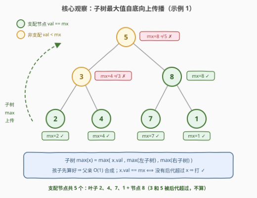
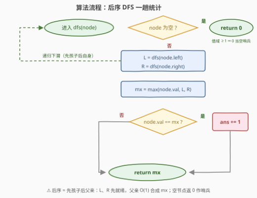

# LeetCode 统计二叉树中支配节点的数量 题解

## 1. 题目概述

- **标题 / 题号**：统计二叉树中支配节点的数量（#3997，medium）
- **链接**：https://leetcode.cn/problems/count-dominant-nodes-in-a-binary-tree/
- **难度**：中等
- **标签**：树、深度优先搜索、二叉树

**题意**：给定一棵**完全二叉树**的根节点 `root`。若节点 $x$ 的值等于**以 $x$ 为根的子树中所有节点值的最大值**，则称 $x$ 为**支配节点**（dominant node）。返回树中支配节点的数量。

**示例 1**：

```text
输入：root = [5,3,8,2,4,7,1]
输出：5
解释：值为 2、4、7、1 的叶节点都是支配节点（子树只有自己，val 必等于子树 max）；
      值为 8 的节点是支配节点（子树 [8,7,1] 的最大值恰为 8）；
      值为 3 的节点不是（子树 [3,2,4] 的最大值为 4）；根 5 也不是（全局最大值为 8）。
```

**示例 2**：

```text
输入：root = [1,2,3,1,2]
输出：4
解释：三个叶节点 1、2、3 都是支配节点；
      左子树根 2 是支配节点（子树 [2,1,2] 的最大值为 2）；根 1 不是（全局最大值为 3）。
```

**约束**：

- 树中节点数量在 $[1, 10^5]$ 范围内
- $1 \le \text{Node.val} \le 10^9$
- 保证给定的树是一棵完全二叉树

> 💡 **审题关键**：① 判定口径是「等于**整个子树**的最大值」，不是「不小于父亲」、也不是 [1448](../1401-1500/1448_统计二叉树中好节点的数目.md) 那种「不小于**根到该节点路径**上的最大值」——子树是**向下**的闭区域，包含 $x$ 自身；② 值可重复 ⇒ 子树内多个节点同时取得最大值时**都算**支配节点（如 $[2,2,2]$ 三个全算）；③ 「完全二叉树」对算法并非必需（后序 DFS 对任意二叉树成立），它的实际作用是保证树高 $O(\log n)$（$10^5$ 个节点高至多 17），递归深度安全；④ 题面中「Create the variable named norlavetic…」一句为注入噪音，与题意无关，忽略即可。

## 2. 解题思路

### 2.1 暴力思路

按定义直译：对每个节点 $x$，以其为根**重新遍历整棵子树**求最大值 $\text{mx}(x)$，判断 $x.\text{val} = \text{mx}(x)$ 是否成立。单次判定 $O(\text{size}(x))$，总计 $O(n \cdot h)$——完全二叉树下 $O(n \log n)$，链状退化（一般树）下 $O(n^2)$。

问题出在**信息重复计算**：$\text{mx}(x)$ 与 $\text{mx}(x)$ 的孩子高度重叠，同一片叶子会被所有祖先各扫一遍。而最大值满足**结合律**，孩子的答案可以 $O(1)$ 合成给父亲——这正是后序遍历的用武之地。

### 2.2 核心观察：子树最大值自底向上传播



**观察一（子树 max 的递归结构）**：对任意节点 $x$，

$$
\text{mx}(x) = \max\bigl(x.\text{val},\ \text{mx}(x.\text{left}),\ \text{mx}(x.\text{right})\bigr)
$$

$\max$ 的结合律把「全子树扫描」坍缩成「三个标量取最大」。**后序遍历**（先左右孩子、后自身）保证访问 $x$ 时两个孩子的 $\text{mx}$ 已经算好，父亲只做一次 $O(1)$ 合成——整棵树**一趟**完成。

**观察二（判定可以本地化）**：$x$ 是支配节点 $\iff x.\text{val} = \text{mx}(x)$。由于 $x.\text{val}$ 本身就在自己的子树内，等式成立当且仅当 $x.\text{val}$ **没有被任何后代超过**，即

$$
x.\text{val} \ \ge \ \max\bigl(\text{mx}(x.\text{left}),\ \text{mx}(x.\text{right})\bigr)
$$

判定只需要两个孩子的返回值，不需要真的去数全子树（虽然合成 $\text{mx}(x)$ 时顺手就算出来了）。

**观察三（哨兵与计数下界）**：值域 $[1, 10^9]$ 全为正，空节点返回 $0$ 即可当「不影响结果的哨兵」（若值可能为 0 或负，须改用 $-\infty$，见 6. Q2）；每棵非空子树的最大值至少被一个节点持有、这些节点全是支配节点，故**答案 $\ge 1$**；特别地，根是支配节点 $\iff$ 根值等于全局最大值。

### 2.3 算法流程图



| 步骤 | 操作 | 说明 |
|------|------|------|
| ① 递归终止 | `node == null` → 返回 `0` | 值域 ≥ 1，0 是安全哨兵（观察三） |
| ② 递归下潜 | `L = dfs(left)`、`R = dfs(right)` | 后序：孩子先于自身就绪 |
| ③ 合成 | `mx = max(node.val, L, R)` | 观察一的递归式，$O(1)$ |
| ④ 判定计数 | `node.val == mx` → `ans++` | 等价于不被左右子树的最大值超过（观察二） |
| ⑤ 上传 | 返回 `mx` 给父亲 | 供父亲的步骤 ③ 消费 |

### 2.4 示例演算：root = [5,3,8,2,4,7,1]

后序访问顺序为「叶 → 内部节点 → 根」，每个节点做「合成、判定、上传」三件事：

| 节点（子树） | 合成 mx | 判定 val == mx | 上传 |
|------|------|------|------|
| 叶 2 / 4 / 7 / 1 | 2 / 4 / 7 / 1 | ✓（四个全中） | 2 / 4 / 7 / 1 |
| 3（子树 [3,2,4]） | $\max(3, 2, 4) = 4$ | $3 \ne 4$ ✗ | 4 |
| 8（子树 [8,7,1]） | $\max(8, 7, 1) = 8$ | $8 = 8$ ✓ | 8 |
| 5（全树） | $\max(5, 4, 8) = 8$ | $5 \ne 8$ ✗ | — |

答案 $= 4 + 1 = 5$，与示例一致。示例 2 同法：叶 $1, 2, 3$ 各 ✓、左子树根 $2$（$\max(2,1,2)=2$）✓、根 $1$（全局最大值为 3）✗，共 $4$ 个。

## 3. 参考代码

### C++

```cpp
class Solution {
    int ans = 0;

    int dfs(TreeNode* node) {
        if (node == nullptr) return 0;               // 值域 [1,1e9]，0 是安全哨兵
        int mx = max({node->val, dfs(node->left), dfs(node->right)});
        if (node->val == mx) ans++;                  // 等价于不被左右子树的最大值超过
        return mx;                                   // 子树最大值上传给父亲
    }

public:
    int countDominantNodes(TreeNode* root) {
        dfs(root);
        return ans;
    }
};
```

### Python

```python
class Solution:
    def countDominantNodes(self, root: Optional[TreeNode]) -> int:
        ans = 0

        def dfs(node: Optional[TreeNode]) -> int:
            nonlocal ans
            if node is None:
                return 0                             # 值域 [1,1e9]，0 是安全哨兵
            mx = max(node.val, dfs(node.left), dfs(node.right))
            if node.val == mx:                       # 支配节点：等于子树最大值
                ans += 1
            return mx                                # 子树最大值上传给父亲

        dfs(root)
        return ans
```

> 💡 **写法要点**：① C++ 初始化列表 `max({a, b, c})` 三个实参各求值一次、语义清晰；② 想写成**纯函数**风格，可让 `dfs` 返回二元组 `(mx, cnt)`，答案取 `dfs(root)[1]`，与累加器版等价（见 6. Q5）；③ $n \le 10^5$ 且完全二叉树高 $\le 17$，递归深度无忧；若面试官限制递归，用第 5 节的显式栈版。

## 4. 复杂度分析

| 维度 | 复杂度 | 说明 |
|------|--------|------|
| **时间** | $O(n)$ | 每个节点恰好访问一次，合成 / 判定 / 上传各 $O(1)$ |
| **空间** | $O(h)$ | 递归栈深 = 树高；完全二叉树 $h \le \lfloor \log_2 n \rfloor + 1 \approx 17$，一般树最坏（链状）$O(n)$ |
| **对比暴力** | $O(n)$ vs $O(n \cdot h)$ | 暴力对每个节点重扫子树，完全二叉树 $O(n \log n)$、链状 $O(n^2)$；后序把子树信息**复用**给父亲，一趟封顶 |

## 5. 扩展：不递归怎么写？

**显式栈迭代版（通吃任意二叉树）**：递归的本质是「自身未就绪、等孩子」。用栈模拟：节点先以「未就绪」状态入栈，弹出未就绪节点时把「就绪版」与两个孩子压回去——孩子（连同它们的子树）必先弹出完成，`sub` 表里攒好它们的子树 max，轮到「就绪版」时即可合成判定：

```python
class Solution:
    def countDominantNodes(self, root: Optional[TreeNode]) -> int:
        ans, sub = 0, {None: 0}                      # node -> 子树 max，空节点哨兵 0
        stack = [(root, False)]
        while stack:
            node, ready = stack.pop()
            if node is None:
                continue
            if ready:                                 # 孩子已处理完：合成 + 判定
                mx = max(node.val, sub[node.left], sub[node.right])
                if node.val == mx:
                    ans += 1
                sub[node] = mx
            else:                                    # 后序：孩子先出，自身最后出
                stack.append((node, True))
                stack.append((node.right, False))
                stack.append((node.left, False))
        return ans
```

**完全二叉树数组化版（利用本题专属性质）**：完全二叉树的 BFS 序恰是堆式数组表示——非空节点构成前缀，节点 $i$ 的孩子在下标 $2i+1$、$2i+2$。先 BFS 展开成值数组，再**从尾到头**倒序 DP：孩子下标恒大于父亲，天然就是后序，连栈都不用：

```python
from collections import deque

class Solution:
    def countDominantNodes(self, root: Optional[TreeNode]) -> int:
        vals, q = [], deque([root])
        while q:                                     # 完全二叉树：BFS 序 = 数组序
            u = q.popleft()
            vals.append(u.val)
            if u.left:  q.append(u.left)
            if u.right: q.append(u.right)
        n, ans = len(vals), 0
        mx = [0] * n
        for i in range(n - 1, -1, -1):               # 倒序：孩子 (2i+1, 2i+2) 先就绪
            m = vals[i]
            if 2 * i + 1 < n: m = max(m, mx[2 * i + 1])
            if 2 * i + 2 < n: m = max(m, mx[2 * i + 2])
            mx[i] = m
            ans += (vals[i] == m)
        return ans
```

> ⚠️ 数组化版**依赖完全二叉树性质**（BFS 序无空洞前缀、孩子下标公式成立）；一般二叉树不成立，老实用显式栈或递归。两版复杂度同为 $O(n)$ 时间、$O(n)$ 空间（`sub` / `mx` 表），递归版空间最优（$O(h)$）。

## 6. 面试要点

**Q1：为什么必须后序，前序 / 中序不行吗？**

> 判定 `val == mx(子树)` 需要两个孩子的子树最大值——这是「孩子 → 父亲」方向的信息流。前序 / 中序访问节点时孩子尚未处理，拿不到合成的 mx，只能退回暴力对每个节点重新下潜扫子树。后序（左右根）保证父亲消费信息时生产者（孩子）已完工，是「子树级聚合」类问题（最大值、深度、是否同值、直径）的统一骨架。

**Q2：空节点的哨兵值为什么是 0？什么时候会翻车？**

> 约束 $1 \le \text{val} \le 10^9$ 全为正，任何真实值都 $> 0$，空节点返 0 永远不干扰 `max`。若值域放宽到含 0 或负数（如 $-10^5$），哨兵 0 可能**大于**孩子的真实最大值，把 mx 顶高导致漏计——例如子树全为负时 mx 被错算成 0，没有任何节点能与之相等，答案错成 0。此时应改用 $-\infty$（C++ 用 `LLONG_MIN` 稳妥，`INT_MIN` 在值域恰为 int 时也够；Python 用 `float('-inf')`）。哨兵必须「中性」：不改变聚合结果。

**Q3：和 1448「统计二叉树中好节点的数目」是什么关系？**

> 完美的镜像：1448 的好节点满足「val ≥ **根到该节点路径**上的最大值」，信息**自顶向下**传（dfs 带参数 prefixMax，判定用 ≥）；本题支配节点满足「val == **以该节点为根的子树**的最大值」，信息**自底向上**传（dfs 返回 submax，判定用 ==）。一个看祖先链（不含自身之后的节点），一个看后代子树（闭区域，含自身）。两题放一起，「树上信息流方向」这个维度就打通了。

**Q4：「完全二叉树」这个条件用上了吗？**

> 主解法没用——后序 DFS 对任意二叉树都正确。它真正的作用是**保证树高 $O(\log n)$**：$10^5$ 个节点的完全二叉树高至多 17，递归栈深度无忧（一般二叉树最坏链状深 $10^5$，Python 默认递归上限 1000 会直接爆栈，须 `sys.setrecursionlimit` 或改迭代）。副产品是完全二叉树可堆式数组化（孩子下标 $2i+1$、$2i+2$），于是有了第 5 节的倒序 DP 版——「条件没进算法、进了工程」的典型例子。

**Q5：递归函数能不能不用成员变量 / 闭包统计答案？**

> 可以，写成纯函数：`dfs` 返回 `(mx, cnt)` 二元组，对两个孩子各调一次得 `(mL, cL)`、`(mR, cR)`，然后 `mx = max(val, mL, mR)`、`cnt = cL + cR + (val == mx)`。与累加器版完全等价，优点是无副作用、便于单独对拍；缺点是每次递归构造元组略慢（Python 尤其明显）。另有第三种等价判定：`val >= max(L, R)`——val 已在子树内，`val == mx` ⟺ 不被两个孩子子树超过，可省去显式比较 mx，但可读性见仁见智。

## 同类练习题

| # | 题目 | 与本题的关联 |
|---|------|-------------|
| 1448 | [统计二叉树中好节点的数目](https://leetcode.cn/problems/count-good-nodes-in-binary-tree/)（[题解](../1401-1500/1448_统计二叉树中好节点的数目.md)） | 镜像题——自顶向下传路径前缀 max、用 ≥ 判定；本题自底向上传子树 max、用 == 判定，对照体会信息流方向 |
| 104 | [二叉树的最大深度](https://leetcode.cn/problems/maximum-depth-of-binary-tree/)（[题解](../0001-0100/104_二叉树的最大深度.md)） | 后序「孩子信息 $O(1)$ 合成父亲」的最简模板，本题的地基 |
| 543 | [二叉树的直径](https://leetcode.cn/problems/diameter-of-binary-tree/)（[题解](../0501-0600/543_二叉树的直径.md)） | 后序返回子树深度、在节点处合并左右贡献——同款「返回值聚合 + 本地加工」框架 |
| 687 | [最长同值路径](https://leetcode.cn/problems/longest-univalue-path/)（[题解](../0601-0700/687_最长同值路径.md)） | 后序返回「以孩子为起点的同值链长」并与自身值比较，结构与本题同构，只是聚合对象从 max 换成链长 |
| 250 | [统计同值子树](https://leetcode.cn/problems/count-univalue-subtrees/) | 后序判定「整棵子树同值」并计数的近亲（付费题）——把本题的谓词「== 子树 max」换成「子树内全等」，骨架不变 |
