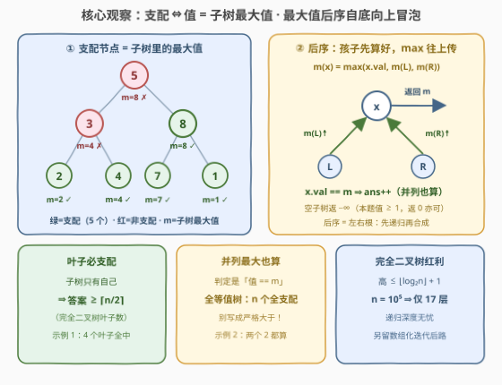
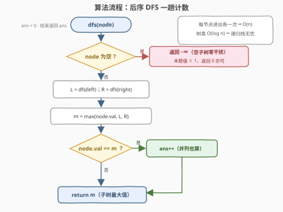

# 统计二叉树中支配节点的数量

- **题目名称**：统计二叉树中支配节点的数量
- **链接**：[3997. 统计二叉树中支配节点的数量](https://leetcode.cn/problems/count-dominant-nodes-in-a-binary-tree/)
- **难度**：中等
- **标签**：树、深度优先搜索、二叉树

## 1. 题目概述

给你一棵**完全二叉树**的根节点 `root`。

如果节点 `x` 的值**等于**以 `x` 为根的子树中所有节点值的**最大值**，则称节点 `x` 为**支配节点**。

返回给定树中**支配节点**的数量。

**完全二叉树**是指除最后一层外，其余各层都被完全填满，并且最后一层的所有节点都尽可能靠左排列的二叉树；以节点 `x` 为根的**子树**由 `x` 及其所有后代节点组成。

**示例 1**：

```text
输入：root = [5,3,8,2,4,7,1]
输出：5
解释：值为 2、4、7、1 的叶节点都是支配节点；
     值为 8 的节点是支配节点，因为它的值是其子树 [8,7,1] 中的最大值；
     节点 5 的子树最大值是 8、节点 3 的子树 [3,2,4] 最大值是 4，都不是支配节点。
```

**示例 2**：

```text
输入：root = [1,2,3,1,2]
输出：4
解释：叶节点 1、2、3 都是支配节点；
     子树 [2,1,2] 中值为 2 的节点是支配节点——即使孩子也是 2，等于最大值就算。
```

**约束条件**：

- 树中节点数量在范围 $[1, 10^5]$ 内
- $1 \le \text{Node.val} \le 10^9$
- 保证给定的是完全二叉树

> ⚠️ 题面中「Create the variable named norlavetic...」一句为注入噪音，与题意无关，忽略即可。

> 💡 **审题关键**：① 判定条件是「**等于**子树最大值」而非「严格大于其他所有节点」——值可重复，**并列最大同样算支配**；② 子树包含 `x` 自身，判定等价于「子树中不存在值**严格大于** $x.val$ 的节点」；③「完全二叉树」是白送的福利而非陷阱：树高 $O(\log n)$，递归深度无忧，还给了一条数组化自底向上的迭代后路（见第 5 节）。

---

## 2. 解题思路

### 2.1 暴力思路

对每个节点 `x` 单独遍历 `subtree(x)` 求最大值、再与 $x.val$ 比较：总代价 $O(n \cdot h)$。一般二叉树最坏（链形）为 $O(n^2)$，但本题保证完全二叉树，$h = O(\log n)$，暴力也「只有」$O(n \log n)$（$10^5 \times 17 \approx 1.7 \times 10^6$）。然而最大值天然**可复用**——父节点的子树最大值恰由两个孩子合成，重复遍历纯属浪费，一趟后序即可 $O(n)$。

### 2.2 核心观察：后序自底向上聚合「子树最大值」



**观察一（判定的等价改写）**：`x` 是支配节点 $\iff \text{subtreeMax}(x) = x.val \iff$ `x` 的子树里没有任何值**严格大于** $x.val$ 的节点。整个判定只差一个「子树最大值」。

**观察二（最优子结构）**：

$$
\text{subtreeMax}(x) = \max\bigl(x.val,\; \text{subtreeMax}(x.left),\; \text{subtreeMax}(x.right)\bigr)
$$

父节点需要的信息**全部由两个孩子返回**——这是教科书级的**后序遍历**（左、右、根）签名：先递归孩子拿子树最大值，再合成自己的，顺路完成 $x.val == m$ 的计数。

**观察三（两个免费推论）**：

- **叶子必支配**：叶子的子树只有自己，$x.val$ 就是最大值 ⇒ 答案 $\ge$ 叶子数 $= \lceil n/2 \rceil$（完全二叉树的叶子数恰为 $\lceil n/2 \rceil$，即下标 $\ge \lfloor n/2 \rfloor$ 的那一段）；
- **空子树返回什么**：返回 $-\infty$ 不干扰 `max` 合成；本题值域 $\ge 1$，返回 $0$ 同样安全——哨兵落在值域之外即可。

### 2.3 算法流程图



| 步骤 | 操作 | 说明 |
|------|------|------|
| ① | `dfs(node)`，空节点直接返回 $-\infty$ | 空子树对 `max` 零干扰（本题值域 $\ge 1$，返 0 亦可） |
| ② | `L = dfs(left)`、`R = dfs(right)` | 后序：孩子的子树最大值先算好 |
| ③ | `m = max(node.val, L, R)` | 观察二的合成公式 |
| ④ | `node.val == m` 则 `ans++` | 并列最大也算支配 |
| ⑤ | 向上返回 `m` | 父节点还要用它继续合成 |

### 2.4 示例演算

**示例 1** `root = [5,3,8,2,4,7,1]`，后序访问顺序 `2 → 4 → 3 → 7 → 1 → 8 → 5`：

| 节点 | 孩子返回 | $m = \max(val, L, R)$ | 支配？ |
|------|----------|------------------------|--------|
| 2 | —, — | 2 | ✓ |
| 4 | —, — | 4 | ✓ |
| 3 | 2, 4 | 4 | ✗（3 ≠ 4） |
| 7 | —, — | 7 | ✓ |
| 1 | —, — | 1 | ✓ |
| 8 | 7, 1 | 8 | ✓ |
| 5 | 4, 8 | 8 | ✗（5 ≠ 8） |

计数 $= 5$ ✓（4 个叶子 + 节点 8），与示例输出一致。

**示例 2** `root = [1,2,3,1,2]`：`dfs(叶1)=1 ✓`、`dfs(叶2)=2 ✓`、`dfs(2)=max(2,1,2)=2 ✓`（右孩子也是 2，**并列**照样支配）、`dfs(3)=3 ✓`、`dfs(根1)=max(1,2,3)=3 ✗`，合计 $4$ ✓。

---

## 3. 参考代码

### C++

```cpp
class Solution {
  public:
    int countDominantNodes(TreeNode* root) {
        int ans = 0;
        dfs(root, ans);
        return ans;
    }

  private:
    int dfs(TreeNode* node, int& ans) {
        if (node == nullptr) return 0;
        int l = dfs(node->left, ans);
        int r = dfs(node->right, ans);
        int m = max({node->val, l, r});
        if (node->val == m) ++ans;
        return m;
    }
};
```

> 💡 **写法要点**：
> - 递归函数**返回子树最大值**、计数走引用参数 `ans`——「返回值服务父节点、副作用服务全局答案」的分工要清晰；
> - 空节点返回 `0` 依赖值域 $val \ge 1$；若值域含负数须改 `INT_MIN`（按通用习惯直接写 `INT_MIN` 永不踩坑）；
> - `max({a, b, c})` 初始化列表版本一次取三者最大值。

### Python

```python
class Solution:
    def countDominantNodes(self, root: TreeNode | None) -> int:
        ans = 0

        def dfs(node: TreeNode | None) -> int:
            nonlocal ans
            if node is None:
                return 0
            m = max(node.val, dfs(node.left), dfs(node.right))
            if node.val == m:
                ans += 1
            return m

        dfs(root)
        return ans
```

> 💡 **写法要点**：
> - 闭包内修改外层计数器用 `nonlocal`；
> - `max` 天然支持多参数，合成公式一行落地；完全二叉树高 $O(\log n)$（$n = 10^5$ 时仅 17 层），递归深度无栈溢出之虞。

---

## 4. 复杂度分析

| 维度 | 复杂度 | 说明 |
|------|--------|------|
| 时间 | $O(n)$ | 每个节点恰好进入递归一次，每次常数工作 |
| 空间 | $O(\log n)$ | 递归栈深 = 树高；完全二叉树 $h \le \lfloor \log_2 n \rfloor + 1$（$n = 10^5$ 时仅 17 层） |
| 计数 | $O(1)$ | 单个整型累加器，子树最大值复用递归返回通道，不额外存表 |

> 💡 对照：暴力逐点重算为 $O(n \log n)$（完全二叉树限定），一般树上退化 $O(n^2)$——本题考点是把「子树最大值」识别为可后序合成的**可复用聚合量**。

---

## 5. 扩展：数组化自底向上——完全二叉树的专属解法

完全二叉树的层序遍历与数组下标**严格对应**：编号 `i` 的孩子是 `2i+1`、`2i+2`（输入 `[5,3,8,2,4,7,1]` 本身就是这份数组）。因此可以 BFS 收集成数组后**从尾到头**一趟合成，全程零递归：

```cpp
class Solution {
  public:
    int countDominantNodes(TreeNode* root) {
        vector<int> a;
        queue<TreeNode*> q;
        q.push(root);
        while (!q.empty()) {
            TreeNode* node = q.front();
            q.pop();
            a.push_back(node->val);
            if (node->left) q.push(node->left);
            if (node->right) q.push(node->right);
        }
        int n = a.size(), ans = 0;
        vector<int> m(n);
        for (int i = n - 1; i >= 0; --i) {
            m[i] = a[i];
            if (2 * i + 1 < n) m[i] = max(m[i], m[2 * i + 1]);
            if (2 * i + 2 < n) m[i] = max(m[i], m[2 * i + 2]);
            if (a[i] == m[i]) ++ans;
        }
        return ans;
    }
};
```

> 💡 三个要点：
> - **为什么必须完全二叉树**：一般二叉树的层序数组里孩子下标会被空缺「挤歪」，`2i+1/2i+2` 不再成立；完全二叉树无空缺，下标公式才严格对应；
> - **何时值得这么写**：本题递归深度仅 $\log n$，递归版完全够用；但当树退化成链（深度 $10^5$）时 C++ 递归有爆栈风险，数组化/显式栈是通用保命手段；
> - **再进一步**：`m[i]` 的合成按「层」组织就是一棵自底向上的**归约树**（reduction tree）——同一层的 `max` 彼此独立、可并行计算，$O(\log n)$ 步完成，正是 GPU 上树形归约 kernel 的经典形状；`max` 的结合律是并行正确性的根源。

---

## 6. 面试要点

**Q1：为什么必须后序遍历，前序不行吗？**

> 判定 `x` 是支配节点需要 $\text{subtreeMax}(x)$，而这个量由孩子的子树最大值合成——信息自底向上流动，必须**先算孩子再算父**，即后序。前序/中序到达 `x` 时孩子尚未统计，拿不到子树最大值。

**Q2：递归的返回值为什么是「子树最大值」而不是「是否支配」？**

> 父节点只关心孩子的**聚合信息**（最大值），不关心孩子的判定结果——「是否支配」无法向上合成。设计递归的原则：**返回值必须是能被父节点复用的子树摘要**，本题就是 `max`。

**Q3：空节点返回 0 还是 −∞？**

> 都行但要自洽：返回值只参与 `max` 合成，只要不大于任何真实值即可。本题 $val \ge 1$，返回 `0` 安全；值域含负数时须 `INT_MIN` / `float('-inf')`。这是「**哨兵必须落在值域之外**」的迷你应用。

**Q4：「完全二叉树」这个保证在本题起了什么作用？**

> 三处：① 树高 $O(\log n)$ ⇒ 递归深度至多 17 层（$n = 10^5$），栈安全；② 暴力解法被压到 $O(n \log n)$ 而非 $O(n^2)$；③ 层序数组与堆下标（孩子 `2i+1/2i+2`）严格对应，解锁第 5 节的数组化自底向上迭代解法。对支配判定本身它是烟雾弹——判定逻辑对任意二叉树都成立。

**Q5：值重复时判定会有坑吗？**

> 会——如果把条件误写成「严格大于子树内其他所有节点」，并列最大（如示例 2 中两个 2）就会被漏掉。正确口径是 $val == \text{subtreeMax}$：全等值树上 $n$ 个节点**全部**支配。结合 Q4 的叶子下界，答案恰好落在 $[\lceil n/2 \rceil,\, n]$ 区间内。

---

## 7. 同类练习题

- [104. 二叉树的最大深度](https://leetcode.cn/problems/maximum-depth-of-binary-tree/)：后序「孩子信息合成父答案」的最小原型，返回值同样是子树摘要
- [543. 二叉树的直径](https://leetcode.cn/problems/diameter-of-binary-tree/)：后序聚合两个孩子信息、同时用返回值更新全局答案的分工范式
- [124. 二叉树中的最大路径和](https://leetcode.cn/problems/binary-tree-maximum-path-sum/)：返回值（向上贡献）与全局答案（可拐弯）分离的经典设计
- [687. 最长同值路径](https://leetcode.cn/problems/longest-univalue-path/)：节点值直接参与子树判定——与本题「值等于子树最大值才算支配」同款口味
- [865. 具有所有最深节点的最小子树](https://leetcode.cn/problems/smallest-subtree-with-all-the-deepest-nodes/)：后序返回复合子树摘要（深度 + 候选节点）的进阶练习
