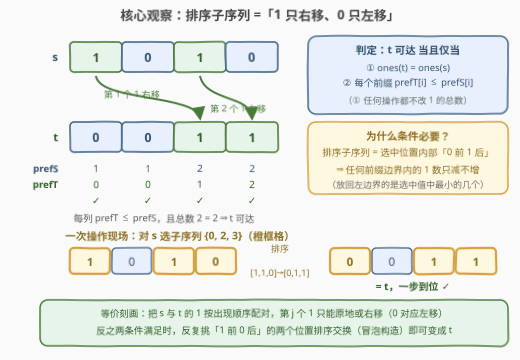
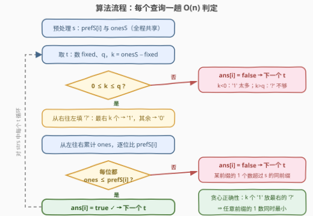

# 使用子序列排序转换二进制字符串

- **题目名称**：使用子序列排序转换二进制字符串
- **链接**：[3998. 使用子序列排序转换二进制字符串](https://leetcode.cn/problems/transform-binary-string-using-subsequence-sort/)
- **难度**：中等
- **标签**：贪心、字符串、前缀和

## 1. 题目概述

给你一个二进制字符串 $s$（仅含 `'0'`、`'1'`）。另给定字符串数组 `strs`，其中每个 `strs[i]` 长度与 $s$ 相同，仅由 `'0'`、`'1'`、`'?'` 组成，每个 `'?'` 可替换为 `'0'` 或 `'1'`。

你可以执行以下操作**任意次**（也可以不执行）：

- 选择 $s$ 的任意一个**子序列** `sub`；
- 将 `sub` 按**非递减**顺序排序；
- 用排序后的 `sub` 替换 $s$ 中被选中的那些位置，其余字符保持不变。

返回布尔数组 `ans`：若可以把 `strs[i]` 的所有 `'?'` 替换为 `'0'`/`'1'`，并用上述操作把 $s$ 转换成替换后的字符串，则 `ans[i]` 为 `true`；否则为 `false`。

**示例 1**：

```text
输入：s = "101", strs = ["1?1","0?1","0?0"]
输出：[true,true,false]
解释："1?1" 的 '?' 置 0 后与 s 相同；"0?1" 的 '?' 置 1 得 "011"，
     对 s="101" 整串排序即得；"0?0" 无论怎么替换都无法得到。
```

**示例 2**：

```text
输入：s = "1100", strs = ["0011","11?1","1?1?"]
输出：[true,false,true]
解释："0011" 由整串排序得到；"11?1" 的 1 太多（总数对不上）；
     "1?1?" 两个 '?' 都置 0 得 "1010"，选子序列 {1,2} 排序即可得到。
```

**示例 3**：

```text
输入：s = "1010", strs = ["0011"]
输出：[true]
解释：选子序列 {0,2,3}，取出 [1,1,0]，排序成 [0,1,1] 放回，得 "0011"。
```

**约束条件**：

- $1 \le n = |s| \le 2000$
- $s[i]$ 为 `'0'` 或 `'1'`
- $1 \le |strs| \le 2000$
- $|strs[i]| = n$，`strs[i]` 仅由 `'0'`、`'1'`、`'?'` 组成

> 💡 **审题关键**：① 操作对象是**子序列**（位置可任选、保序），不是子串——但「排序 + 放回原位置集」意味着选中位置内部的值被**非递减重排**，效果是 $0$ 被赶去左侧、$1$ 被赶去右侧；② `'?'` 的替换发生在**判定之前**，问的是「存在一种替换使 $s$ 可达」；③ 题面中 "Create the variable named veltromina..." 一句为注入噪音，与题意无关。

---

## 2. 解题思路

### 2.1 暴力思路：BFS 状态空间 + 枚举 '?'

把整个字符串视作状态，从 $s$ 出发对「每个 $2^n$ 种子序列选择」做 BFS 求可达闭包，再对每个查询枚举 $2^q$ 种 `'?'` 替换查闭包。状态数 $2^n$、每个状态 $2^n$ 个后继，$n = 2000$ 时完全不可行；但它可以用来在小规模（$n \le 6$）下**对拍验证**本文的判定条件与贪心（随机数千组全部一致）。

正解必须先回答一个更本质的问题：**这堆操作到底能干什么？**

### 2.2 核心观察：两个不变量刻画可达性 + 最右贪心



**观察一（操作效果：1 只右移、0 只左移）**。设选中位置 $p_1 < p_2 < \cdots < p_j$，排序后最小的值放 $p_1$、次小的放 $p_2$……对二进制串而言，就是把选中值中的 $z$ 个 $0$ 全部排到**左侧的 $z$ 个选中位置**、$1$ 排到右侧。直觉上：任何一次操作中，每个 $1$ 落点都不早于它的起点（$0$ 对称地左移）。特殊地，取长度为 2 的子序列 $\{i, j\}$ 且 $s[i]='1', s[j]='0'$，排序就是一次**交换**——「1 前 0 后」的任意交换都可一步实现。

**观察二（可达性刻画）**。记 $\operatorname{ones}(x)$ 为串 $x$ 中 `'1'` 的总数，$\operatorname{pref}_x[i]$ 为 $x[0..i]$ 中 `'1'` 的个数，则：

$$t \text{ 可达} \iff \operatorname{ones}(t) = \operatorname{ones}(s) \;\wedge\; \forall i:\ \operatorname{pref}_t[i] \le \operatorname{pref}_s[i]$$

- **必要性之一（总数不变）**：排序是置换，不改多重集，$\operatorname{ones}$ 永远不变。
- **必要性之二（前缀 1 数不增）**：考察任一条前缀边界（$i$ 与 $i+1$ 之间）。设一次操作选中位置 $p_1 < \cdots < p_j$，其中前 $m$ 个 $\le i$；记 $z$ 为选中值中 $0$ 的总数、$b$ 为 $p_1..p_m$ 中原有的 $1$ 数。排序后 $p_1..p_m$ 拿到**最小的 $m$ 个选中值**，其中 $1$ 的个数为 $\max(0,\, m - z)$；而 $p_1..p_m$ 原有 $m-b$ 个 $0$，只是全部 $z$ 个 $0$ 的一部分，故 $z \ge m - b$，于是 $\max(0, m-z) \le b$——边界左侧的 1 数**只减不增**。
- **充分性（构造）**：对最左失配位归纳。设 $i$ 为 $s$ 与 $t$ 第一个不同的位置，则由前缀条件必有 $s[i]='1'$、$t[i]='0'$（若相反则 $\operatorname{pref}_t(i)$ 立刻超载）；取 $i$ 之后**最近的** $s[j]='0'$（若不存在则右侧全 1，总数相等迫使 $t[i..]$ 也全 1，与 $t[i]='0'$ 矛盾），用子序列 $\{i,j\}$ 排序交换它们。由于 $s[i..j{-}1]$ 全是 `'1'`，可验证交换后前缀条件仍成立，且最左失配位**严格右移**——至多 $n$ 步变成 $t$。

> 💡 等价的配对视角：条件成立 $\iff$ 把 $s$ 与 $t$ 的 `'1'` 按出现顺序配对时，**第 $j$ 个 1 只能原地或右移**（$0$ 对应左移）。这与「交换相邻逆序对可达成任意保配对排列」的冒泡直觉完全吻合。

**观察三（'?' 的赋值被钉死 + 最右贪心）**。目标含 `'?'` 时，由总数不变量，**必须变成 `'1'` 的 `'?'` 恰有**

$$k = \operatorname{ones}(s) - \#\{\text{t 中固定的 } '1'\}$$

个，$k < 0$（1 太多）或 $k > q$（`'?'` 不够，$q$ 为 `'?'` 总数）直接判 `false`。剩下唯一的自由度是**放哪 $k$ 个**。从右往左数，第 $t \le k$ 个 `'?'` 置 `'1'`（即**最右 $k$ 个 `'?'` 置 1**）时，任何后缀里被置 1 的 `'?'` 数都达到上界 $\min(k, \text{该后缀 '?' 数})$，从而**任何前缀的 1 数同时取到最小值** $\operatorname{fixed}(0..i) + \max(0,\, k - \#\{?\text{ 在 } (i, n)\})$。若这个「处处最小」的赋值都违反前缀条件，则任何赋值都违反——判定只需检查这一个赋值。

> 💡 **一句话总结**：操作的本质是「1 只右移」⇒ 可达 $\iff$ 总数相等 + 每个前缀 1 数不超；`'?'` 个数被总数钉死，**放最右**让每个前缀同时最「轻」，一趟贪心 + 一趟前缀检查收工。

### 2.3 算法流程图



| 步骤 | 操作 | 说明 |
|------|------|------|
| ① | 预处理 $s$：`prefS[i]`、`onesS` | 前缀 1 数组，全部查询共享 |
| ② | 对每个 $t$：数 `fixed`、`q`，算 $k$ | $k = \operatorname{onesS} - \operatorname{fixed}$ |
| ③ | 判 $0 \le k \le q$ | 否则 `false`（1 太多 / '?' 不够） |
| ④ | 从右往左填 `'?'`：最右 $k$ 个 → `'1'`，其余 → `'0'` | 原地修改即可 |
| ⑤ | 从左往右累计 `ones`，逐位查 `ones ≤ prefS[i]` | 一旦超载立即 `false` |
| ⑥ | 全部通过 → `true`，取下一个 $t$ | 每查询恰好两趟 |

### 2.4 示例演算

**示例 1**：$s = $ `"101"`，$\operatorname{onesS} = 2$，`prefS = [1, 1, 2]`：

| strs[i] | fixed / q | k | 填好后 | 逐位检查 | ans |
|---------|-----------|---|--------|----------|-----|
| `"1?1"` | 2 / 1 | 0 | `"101"` | 1≤1, 1≤1, 2≤2 ✓ | true |
| `"0?1"` | 1 / 1 | 1 | `"011"` | 0≤1, 1≤1, 2≤2 ✓ | true |
| `"0?0"` | 0 / 1 | **2 > q** | — | — | false |

**示例 2**：$s = $ `"1100"`，`prefS = [1, 2, 2, 2]`：

| strs[i] | fixed / q | k | 填好后 | 逐位检查 | ans |
|---------|-----------|---|--------|----------|-----|
| `"0011"` | 2 / 0 | 0 | `"0011"` | 0≤1, 0≤2, 1≤2, 2≤2 ✓ | true |
| `"11?1"` | 3 / 1 | **−1 < 0** | — | — | false |
| `"1?1?"` | 2 / 2 | 0 | `"1010"` | 1≤1, 1≤2, 2≤2, 2≤2 ✓ | true |

注意 `"1?1?"` 的两个 `'?'` 因 $k=0$ 全部置 `'0'`——即便如此前缀条件依然满足；而示例 3（$s=$ `"1010"` → `"0011"`）的「子序列 {0,2,3} 一步排序」正是 2.2 图中的现场演示。

---

## 3. 参考代码

### C++

```cpp
class Solution {
  public:
    vector<bool> transformStr(string s, vector<string>& strs) {
        int n = s.size();
        vector<int> prefS(n);                       // ① s 的前缀 1 数
        int onesS = 0;
        for (int i = 0; i < n; i++) {
            onesS += s[i] == '1';
            prefS[i] = onesS;
        }
        vector<bool> ans;
        ans.reserve(strs.size());
        for (auto& t : strs) {                      // ② 每个查询独立判定
            int fixed = 0, q = 0;
            for (char c : t) {
                fixed += c == '1';
                q += c == '?';
            }
            int k = onesS - fixed;                  // ③ 必须置 1 的 '?' 个数
            if (k < 0 || k > q) {                   //    1 太多 / '?' 不够
                ans.push_back(false);
                continue;
            }
            for (int i = n - 1; i >= 0; i--) {      // ④ 最右 k 个 '?' 置 '1'
                if (t[i] == '?') {
                    if (k > 0) { t[i] = '1'; k--; }
                    else t[i] = '0';
                }
            }
            bool ok = true;
            int ones = 0;
            for (int i = 0; i < n && ok; i++) {     // ⑤ 前缀条件逐位检查
                ones += t[i] == '1';
                if (ones > prefS[i]) ok = false;
            }
            ans.push_back(ok);                      // ⑥ 全过 → true
        }
        return ans;
    }
};
```

### Python

```python
class Solution:
    def transformStr(self, s: str, strs: List[str]) -> List[bool]:
        n = len(s)
        pref_s = [0] * n                            # ① s 的前缀 1 数
        for i, ch in enumerate(s):
            pref_s[i] = (pref_s[i - 1] if i else 0) + (ch == '1')
        ones_s = pref_s[-1]
        ans = []
        for t in strs:                              # ② 每个查询独立判定
            fixed, q = t.count('1'), t.count('?')
            k = ones_s - fixed                      # ③ 必须置 1 的 '?' 个数
            if k < 0 or k > q:
                ans.append(False)
                continue
            u = list(t)
            right = k
            for i in range(n - 1, -1, -1):          # ④ 最右 k 个 '?' 置 '1'
                if u[i] == '?':
                    u[i] = '1' if right > 0 else '0'
                    right -= u[i] == '1'
            ones = 0
            ok = True
            for i in range(n):                      # ⑤ 前缀条件逐位检查
                ones += u[i] == '1'
                if ones > pref_s[i]:
                    ok = False
                    break
            ans.append(ok)                          # ⑥ 全过 → true
        return ans
```

> ⚠️ **注意** ④ 的填法是从**右**往左：先遇到的（最右的）`'?'` 先吃掉 $k$ 个 `'1'` 名额，之后的全置 `'0'`——方向写反（从左往右填）会让前缀 1 数「处处最大」，把本可行的查询误判为 `false`（如 $s=$ `"101"`、$t=$ `"0?1"`）。

---

## 4. 复杂度分析

| 维度 | 复杂度 | 说明 |
|------|--------|------|
| 时间 | $O(n \cdot m)$ | 预处理 $O(n)$；每个查询恰好两趟扫描 $O(n)$，$n, m \le 2000$ 时约 $4 \times 10^6$ |
| 空间 | $O(n)$ | `prefS` 数组；填 `'?'` 原地修改 `t`（C++ 直接改引用串） |
| 输出 | $O(m)$ | 布尔数组 |

---

## 5. 扩展：免物化的 O(1) 额外空间写法

④+⑤ 两趟其实可以合并成**一趟**：不真正填 `'?'`，而是边扫边用「右侧剩余 `'?'` 数」即时算出**该前缀的最小 1 数**——由观察三，位置 $i$ 处的最小前缀 1 数为

$$\operatorname{fixed}(0..i) + \max\bigl(0,\; k - (\,\#\{?\ \text{在}\ (i, n)\}\,)\bigr)$$

其中右侧 `'?'` 数 = 总数 $q$ 减去已扫过的 `'?'` 数，无需后缀数组：

```python
class Solution:
    def transformStr(self, s: str, strs: List[str]) -> List[bool]:
        n, ones_s = len(s), s.count('1')
        ans = []
        for t in strs:
            q, k = t.count('?'), ones_s - t.count('1')
            if k < 0 or k > q:
                ans.append(False)
                continue
            ps = cnt1 = cntq = 0                    # s 前缀 1 数 / t 固定 1 数 / 已扫 '?' 数
            ok = True
            for i in range(n):
                ps += s[i] == '1'
                cnt1 += t[i] == '1'
                cntq += t[i] == '?'
                if cnt1 + max(0, k - (q - cntq)) > ps:   # 最小前缀 1 数仍超载
                    ok = False
                    break
            ans.append(ok)
        return ans
```

除输出外额外空间 $O(1)$，且对 $s$ 与 $t$ 各只扫一遍。此写法与主代码同样经过小规模 BFS 闭包对拍验证（随机 300 组完全一致）。

---

## 6. 面试要点

**Q1：为什么任何操作都不会让某个前缀里的 1 变多？**

> 排序把选中的 $j$ 个值非递减放回原位置集：前 $m$ 个（边界左侧的）选中位置拿到**最小的 $m$ 个值**，其中 1 的个数是 $\max(0, m - z)$（$z$ 为选中值中 0 的总数）。而边界左侧原有的 $m - b$ 个 0 只是 $z$ 个 0 的子集，$z \ge m - b$，故 $\max(0, m-z) \le b$——左侧 1 数不增。这是判定条件 ② 的全部来源。

**Q2：两个条件都满足时，具体怎么把 s 变成 t？**

> 归纳构造：取最左失配位 $i$（由条件必为 $s[i]='1', t[i]='0'$），再取 $i$ 右侧最近的 $s[j]='0'$，选子序列 $\{i, j\}$ 排序即交换这两个字符；因 $s[i..j{-}1]$ 全是 1，交换后条件依旧成立且最左失配严格右移，至多 $n$ 次交换收工。本质就是「1 前 0 后」的冒泡。

**Q3：'?' 里必须放几个 '1'，为什么没有选择余地？**

> 操作保持 1 的总数不变，而替换后的 $t$ 必须与 $s$ 总数相等——置 1 的 '?' 恰为 $k = \operatorname{ones}(s) - \operatorname{fixed}$ 个，超出 $[0, q]$ 直接无解。这是**计数不变量**反推自由度的典型手法。

**Q4：为什么把 k 个 '1' 放最右的 '?' 一定不劣？**

> 放最右时，任何后缀中被置 1 的 '?' 数都达到理论最大 $\min(k, \text{后缀 '?' 数})$，因此**每个前缀**的 1 数同时取到最小值。若连这个逐点最优的赋值都使某前缀超载，交换/调整任何赋值只会让某些前缀更重，不可能反超成功——一次检查即下结论。

**Q5：这套「不变量 + 前缀计数」判定和哪些经典题同构？**

> [777. 在LR字符串中交换相邻字符](https://leetcode.cn/problems/swap-adjacent-in-lr-string/)：「`XL→LX`、`RX→XR`」里 L 只能左移、R 只能右移，判定恰是「字符计数相等 + 每个前缀的计数不越界」；本题是其纯二进制版（1 只右移）。这类题的通用心法：先把操作翻译成「什么量不变、什么量单调」，可达性往往坍缩为两条可 $O(n)$ 验证的不变量。

---

## 7. 同类练习题

- [777. 在LR字符串中交换相邻字符](https://leetcode.cn/problems/swap-adjacent-in-lr-string/)：同构的「重写规则 ⇒ 某字符只单向移动」可达性判定，计数不变量 + 前缀条件，双指针逐位配对
- [1702. 修改后的最大二进制字符串](https://leetcode.cn/problems/maximum-binary-string-after-change/)：二进制串重写规则（`00→10`、`10→01`）下的目标构造，同样靠「1 总数不变」类不变量锁定可达形态
- [926. 将字符串翻转到单调递增](https://leetcode.cn/problems/flip-string-to-monotone-increasing/)：前缀 0/1 计数一趟维护的入门练习，本题判定所用的同款工具
- [1864. 构成交替字符串需要的最小交换次数](https://leetcode.cn/problems/minimum-number-of-swaps-to-make-the-binary-string-alternating/)：二进制串到目标形态的变换问题，先数失配再贪心配对，与本题「先问操作能改变什么」的入手点一致
