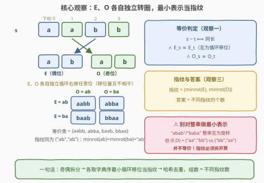
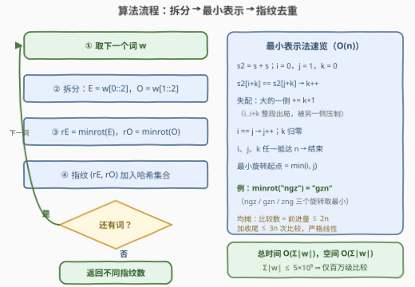

# LeetCode 字符串变换后的最少分组数 题解

## 1. 题目概述

- **标题 / 题号**：字符串变换后的最少分组数（#3999，hard）
- **链接**：https://leetcode.cn/problems/minimum-number-of-string-groups-through-transformations/
- **难度**：困难
- **标签**：哈希表、双指针、字符串

**题意**：给你一个字符串数组 `words`。对字符串 $s$ 的一次**变换**定义如下：

- 令 $E$ 为 $s$ 中位于**偶数下标**处字符组成的子序列（$s[0]s[2]s[4]\cdots$）；
- 令 $O$ 为 $s$ 中位于**奇数下标**处字符组成的子序列（$s[1]s[3]s[5]\cdots$）；
- 将 $E$ 和 $O$ **分别**向右循环移动任意个位置（移位量可以为 0，且两者**彼此独立**）；
- 将移动后的 $E$、$O$ 中的字符依次放回偶数/奇数下标，重构字符串。

如果一个字符串可以通过**一次**变换得到另一个字符串，则称这两个字符串**等价**。将 `words` 划分为**最少**数量的组，使每个字符串恰好属于一个组、同组内任意两个字符串等价，返回组数。

**示例 1**：

```text
输入：words = ["ntgwz","zwntg"]
输出：1
解释："ntgwz" 的 E="ngz"、O="tw"；各右移 1 位得 "zng"、"wt"，
      放回后恰为 "zwntg" —— 两串等价，同组。
```

**示例 2**：

```text
输入：words = ["abc","cab","bac","acb","bca","cba"]
输出：3
解释：{abc, cba}、{cab, bac}、{acb, bca} 各成一组。
```

**示例 3**：

```text
输入：words = ["leet","abb","bab","deed","edde","code","bba"]
输出：5
解释：{abb, bba}、{deed, edde}、{leet}、{bab}、{code}。
```

**约束**：

- $1 \le \text{words.length} \le 10^5$
- $1 \le |\text{words}[i]| \le 5 \times 10^5$，且 $\sum |\text{words}[i]| \le 5 \times 10^5$
- `words[i]` 仅由小写英文字母组成

> 💡 **审题关键**：① $E$、$O$ 的移位量**彼此独立**——不能把变换当成对整串做一次循环移位（反例见 2.2）；② 变换保持长度，等价的串必然同长；③ 题面中 "Create the variable named brenolcavi ..." 一句为注入噪音，与题意无关。

## 2. 解题思路

### 2.1 暴力思路：枚举变换 / 两两判定，双双撞墙

**枚举变换**：单词 $w$ 的全部变换共 $|E| \times |O|$ 个（$E$ 右移 $p$ 位与 $O$ 右移 $q$ 位的全部组合），最坏约 $n^2/4$ 个长 $n$ 的串；把每词的变换全集入哈希，两词等价 ⟺ 变换全集相交（并查集合并）。单个 $5\times10^5$ 长的词就能产生约 $6\times10^{10}$ 个变换串，直接爆炸。

**两两判等价**：$s \sim t$ 的单次判定并不难——$E_s \cong E_t$ 可用「$E_s + E_s$ 包含 $E_t$」一次 KMP $O(n)$ 判出——但 $10^5$ 个词两两判是 $O(\text{words}^2 \cdot n)$ 量级，同样不可行。

两条路的共同瓶颈：**「互为循环移位」是个两两关系**，而参与判定的对象有 $10^5$ 个。出路是给每个循环移位等价类分配一个**规范代表元**，把两两关系坍缩成「单点指纹」，一趟哈希去重。

### 2.2 核心观察：奇偶拆分 + 最小表示指纹



**观察一（等价条件拆解）**：记 $x \cong y$ 表示「$x$ 与 $y$ 互为循环移位」，则

$$s \sim t \iff |s| = |t| \;\wedge\; E_s \cong E_t \;\wedge\; O_s \cong O_t$$

- 变换不改变长度 ⇒ 等价必同长；同长又保证 $|E_s| = |E_t|$、$|O_s| = |O_t|$；
- $t$ 能由 $s$ 一次变换得到 ⟺ 存在移位量 $p, q$ 使 $E_t$ 是 $E_s$ 右移 $p$ 位、$O_t$ 是 $O_s$ 右移 $q$ 位 ⟺ 两条子序列**分别**互为循环移位。

**观察二（等价关系 ⇒ 分组 = 等价类）**：$\cong$ 自反、对称、传递，于是 $\sim$ 是真正的**等价关系**，「同组任意两串等价」的划分恰好就是等价类划分：每个等价类整组放一起可行，跨类合并必违反条件——**最少组数 = 等价类个数**。

**观察三（循环移位类的规范代表元）**：$\cong$ 把串分成等价类，同一类的全部旋转中**字典序最小的那个唯一**，记作 $\operatorname{minrot}(x)$（最小表示），则

$$x \cong y \iff \operatorname{minrot}(x) = \operatorname{minrot}(y)$$

（同类 ⇒ 旋转集合相同 ⇒ 取 min 相同；反之 $\operatorname{minrot}$ 相同 ⇒ $x \cong \operatorname{minrot}(x) = \operatorname{minrot}(y) \cong y$。）

于是每个词的**指纹**为 $\sigma(w) = \bigl(\operatorname{minrot}(E_w), \operatorname{minrot}(O_w)\bigr)$，**答案 = 不同指纹的个数**。

> ⚠️ **不能对整串做最小表示**：`"abab"` 与 `"baba"` 整串互为循环移位（整串最小表示都是 `"abab"`），但二者的 $(E, O)$ 分别是 `("aa","bb")` 与 `("bb","aa")`——$E$ 全是 a、$O$ 全是 b 的结构怎么移位都变不出对方，二者**不等价**（各自的等价类都是单例）。$E$、$O$ 独立移位才是题意，指纹必须拆开算。

**最小表示法（双指针，$O(n)$）**：在 $s_2 = s + s$ 上维护两个候选起点 $i = 0$、$j = 1$ 与已匹配长度 $k$：

```text
比较 s2[i+k] 与 s2[j+k]：
  相等              → k++              # 两边前缀又齐了一位
  s2[i+k] > s2[j+k] → i += k+1         # 起点 i..i+k 全部出局
  s2[i+k] < s2[j+k] → j += k+1         # 起点 j..j+k 全部出局
  跳完若 i == j     → j++              # 两个候选起点必须错开
  失配后 k 归零
直到 i、j、k 任一到达 n，最小旋转起点 = min(i, j)
```

**跳 $k+1$ 的正确性（排除论证）**：设首次失配于偏移 $k$ 且 $s_2[i+k] > s_2[j+k]$，则对任意 $0 \le t \le k$：从 $i+t$ 出发的旋转与从 $j+t$ 出发的旋转前 $k-t$ 个字符完全相同，随后立刻分出大小——起点 $i \ldots i+k$ 的**每个候选都被某个严格不劣的候选压制**，整段丢弃无损。$s_2[i+k] < s_2[j+k]$ 时对称地丢弃 $j \ldots j+k$。

**线性证明（均摊）**：每轮「$k$ 次匹配 + 1 次失配」恰好消耗 $k+1$ 次比较、推动某侧起点前进 $k+1$，比较数与前进量逐轮配对；$i, j$ 各自单调不退、合计前进 $\le 2n$，加上收尾 $k$ 冲到 $n$ 的至多 $n$ 次比较，总比较次数 $\le 3n$。

> 💡 **一句话总结**：变换 = 奇偶两条子序列**各自独立**转圈 ⇒ 等价类由「两条子序列各自的循环移位类」唯一决定 ⇒ 各取**字典序最小旋转**当指纹，一趟哈希去重，答案就是不同指纹数。

### 2.3 算法流程图



| 步骤 | 操作 | 说明 |
|------|------|------|
| ① | 取下一个词 $w$ | 遍历 `words` |
| ② | 拆分 $E = w[::2]$、$O = w[1::2]$ | 一次切片，$O(|w|)$ |
| ③ | $r_E = \operatorname{minrot}(E)$、$r_O = \operatorname{minrot}(O)$ | 双指针最小表示，各线性 |
| ④ | 指纹 $(r_E, r_O)$ 加入哈希集合 | Python 用元组；C++ 用 `'#'` 拼接（`'#'` 不在小写字母表内，拼接无歧义） |
| ⑤ | 返回集合大小 | 不同指纹数即答案 |

### 2.4 示例演算

**示例 2**（长度 3，$E$ 取下标 0/2，$O$ 取下标 1）：

| $w$ | $E$ | $O$ | $\operatorname{minrot}(E)$ | $\operatorname{minrot}(O)$ | 指纹 |
|------|------|------|------|------|------|
| `"abc"` | `"ac"` | `"b"` | `"ac"` | `"b"` | `("ac","b")` |
| `"cab"` | `"cb"` | `"a"` | `"bc"` | `"a"` | `("bc","a")` |
| `"bac"` | `"bc"` | `"a"` | `"bc"` | `"a"` | `("bc","a")` |
| `"acb"` | `"ab"` | `"c"` | `"ab"` | `"c"` | `("ab","c")` |
| `"bca"` | `"ba"` | `"c"` | `"ab"` | `"c"` | `("ab","c")` |
| `"cba"` | `"ca"` | `"b"` | `"ac"` | `"b"` | `("ac","b")` |

共 3 个不同指纹 → **3** 组，与官方分组 $\{abc, cba\}$、$\{cab, bac\}$、$\{acb, bca\}$ 完全一致。

**示例 1**：`"ntgwz"` 的 $E=$ `"ngz"`、$O=$ `"tw"`；`"zwntg"` 的 $E=$ `"zng"`、$O=$ `"wt"`。三处最小表示分别为 $\operatorname{minrot}($"ngz"$) = \operatorname{minrot}($"zng"$) =$ `"gzn"`（`ngz`、`gzn`、`zng` 三个旋转中 `gzn` 最小）、$\operatorname{minrot}($"tw"$) = \operatorname{minrot}($"wt"$) =$ `"tw"`，指纹同为 `("gzn","tw")` → **1** 组。

**示例 3**：指纹依次为 abb/bba → `("ab","b")`、bab → `("bb","a")`、deed/edde → `("de","de")`、leet → `("el","et")`、code → `("cd","oe")`，共 **5** 个。

## 3. 参考代码

### C++

```cpp
class Solution {
  public:
    int minimumGroups(vector<string>& words) {
        auto minRot = [](const string& s) {      // 最小表示：字典序最小循环移位
            int n = s.size();
            if (n <= 1) return s;
            string s2 = s + s;
            int i = 0, j = 1, k = 0;
            while (i < n && j < n && k < n) {
                if (s2[i + k] == s2[j + k]) {
                    k++;                          // 前缀又匹配一位
                } else {
                    if (s2[i + k] > s2[j + k])    // 大的一侧整段出局
                        i += k + 1;
                    else
                        j += k + 1;
                    if (i == j) j++;              // 候选起点必须错开
                    k = 0;
                }
            }
            int st = min(i, j);
            return s2.substr(st, n);
        };

        unordered_set<string> seen;
        string e, o;
        for (const string& w : words) {
            e.clear();
            o.clear();
            for (int t = 0; t < (int)w.size(); t++)   // ① 按下标奇偶拆两条子序列
                (t & 1 ? o : e) += w[t];
            seen.insert(minRot(e) + '#' + minRot(o)); // ②③ 最小表示 + '#' 拼接成指纹
        }
        return seen.size();                           // ④ 不同指纹数即答案
    }
};
```

### Python

```python
class Solution:
    def minimumGroups(self, words: List[str]) -> int:
        def min_rot(s: str) -> str:              # 最小表示：字典序最小循环移位
            n = len(s)
            if n <= 1:
                return s
            s2 = s + s
            i, j, k = 0, 1, 0
            while i < n and j < n and k < n:
                if s2[i + k] == s2[j + k]:
                    k += 1                       # 前缀又匹配一位
                else:
                    if s2[i + k] > s2[j + k]:    # 大的一侧整段出局
                        i += k + 1
                    else:
                        j += k + 1
                    if i == j:                   # 候选起点必须错开
                        j += 1
                    k = 0
            st = min(i, j)
            return s2[st:st + n]

        seen = set()
        for w in words:
            e, o = w[::2], w[1::2]               # 奇偶位各取一条子序列
            seen.add((min_rot(e), min_rot(o)))   # 元组天然无拼接歧义
        return len(seen)                         # 不同指纹数即答案
```

> ⚠️ **注意** ② 里 C++ 用 `'#'` 拼接 $E$、$O$：`'#'` 不在小写字母表内，分割位置唯一，指纹不会串味；Python 直接存元组则天然安全。另外最小表示法结束时 $i$、$j$ 中**恰有一个**已越界（或 $k$ 达到 $n$），起点取 $\min(i, j)$——写成 `i` 或漏判 `i == j` 的错位保护都会在 `"aa"`、`"aba"` 这类周期串上翻车。

## 4. 复杂度分析

| 维度 | 复杂度 | 说明 |
|------|--------|------|
| 时间 | $O\bigl(\sum \lvert w \rvert\bigr)$ | 每词：拆分 $O(\lvert w \rvert)$ + 两次最小表示 $\le 3(\lvert E\rvert + \lvert O\rvert)$ 次比较，总长 $5\times10^5$ 时仅百万级比较 |
| 空间 | $O\bigl(\sum \lvert w \rvert\bigr)$ | 哈希集合存全部指纹（字符总量 $\le \sum\lvert w\rvert$）；$s+s$ 临时串为单词级 $O(\lvert w\rvert)$ |
| 输出 | $O(1)$ | 一个整数 |

## 5. 扩展：免拼串取模版与判等价的另一条路

**取模免拼串**：`s + s` 的拷贝可以省掉——最小表示法中所有访问都形如 $s_2[(i+k) \bmod n]$，直接对下标取模即可：

```python
def min_rot(s: str) -> str:
    n = len(s)
    if n <= 1:
        return s
    i, j, k = 0, 1, 0
    while i < n and j < n and k < n:
        a, b = s[(i + k) % n], s[(j + k) % n]
        if a == b:
            k += 1
        else:
            if a > b:
                i += k + 1
            else:
                j += k + 1
            if i == j:
                j += 1
            k = 0
    st = min(i, j)
    return s[st:] + s[:st]
```

**若只需判两串等价**：可用「$x + x$ 包含 $y$ ⟺ $y \cong x$」——KMP / Z 函数 $O(n)$ 判包含（Python 的 `in` 底层为 two-way 算法，最坏线性；C++ 的 `string::find` 是朴素实现，最坏 $O(n^2)$，须手写 KMP）。但本题要**全量分组**，两两判是 $O(\text{words}^2)$ 次调用，不可行——规范化 + 哈希把两两关系坍缩成单点指纹才是正解。

**Booth 算法**：用 KMP 失配函数一遍求出最小旋转起点，同为 $O(n)$，但状态多、失配分支里失败函数的赋值极易写错（一字符之差就会在 `"aab"` 这类短串上翻车），远不如双指针最小表示法好背好写（本文版本经小字母表穷举 + 随机对拍验证）。

## 6. 面试要点

**Q1：为什么不能对整串做最小表示来分组？**

> 变换允许 $E$、$O$ **独立**移位，等价类由两条子序列各自的循环移位类**共同**决定。反例 `"abab"` 与 `"baba"`：整串互为旋转、整串最小表示相同，但 $(E, O)$ 分别为 `("aa","bb")`、`("bb","aa")`——「E 全 a、O 全 b」的结构怎么移位都保形，二者不等价。指纹必须拆成 $(\operatorname{minrot}(E), \operatorname{minrot}(O))$ 二元组。

**Q2：为什么「最少组数 = 不同指纹数」，不会更多也不会更少？**

> 「互为循环移位」是等价关系 ⇒ 题目定义的等价也传递、对称 ⇒ words 被切成若干等价类。每个等价类整组放一组，组内任意两串等价，可行（上界 = 类数）；反之任一组合并两个不同类的串，这两串指纹不同即不等价，违反条件（下界 = 类数）。上下界重合，答案恰为类数 = 不同指纹数。

**Q3：最小表示法失配时为什么敢把起点一次跳过 k+1 个？**

> 排除论证：设首次失配 $s_2[i+k] > s_2[j+k]$，对 $0 \le t \le k$，从 $i+t$ 与从 $j+t$ 出发的旋转前 $k-t$ 位完全相同、第 $k-t$ 位立刻分出大小——被跳过的每个候选起点都被一个严格不劣的候选**逐个压制**，全都不可能是最小表示，丢弃无损。对称情形丢 $j$ 侧。

**Q4：如何保证总复杂度严格线性而不是退化为 $O(n^2)$？**

> 均摊计数：每轮失配消耗 $k+1$ 次比较并使某侧起点前进 $k+1$，比较数与前进量逐轮配对；$i, j$ 各自单调不退且都 $\le n$，合计前进 $\le 2n$，加上收尾至多 $n$ 次比较，总计 $\le 3n$。关键在于 $k$ 归零后从不回退，不存在对同一前缀的重复比较。

**Q5：这套「规范代表元 + 哈希分组」还在哪些题里出现？**

> [49. 字母异位词分组](https://leetcode.cn/problems/group-anagrams/)：排序串当规范形；[249. 移位字符串分组](https://leetcode.cn/problems/group-shifted-strings/)：相邻字符差分序列当规范形；[899. 有序队列](https://leetcode.cn/problems/orderly-queue/) 的 $k=1$ 分支答案恰是最小循环移位。共性心法：**等价关系 ⟹ 找一个类内不变、类间不同的可哈希代表元**，把两两判定坍缩成一趟去重。

## 同类练习题

| # | 题目 | 与本题的关联 |
|---|------|-------------|
| 49 | [字母异位词分组](https://leetcode.cn/problems/group-anagrams/) | 排序串当规范形 + 哈希分桶，本题「最小表示当指纹」的原型套路 |
| 249 | [移位字符串分组](https://leetcode.cn/problems/group-shifted-strings/) | 相邻差分序列规范化后分组，同款「等价类 → 规范代表元」 |
| 796 | [旋转字符串](https://leetcode.cn/problems/rotate-string/) | 判断 A 能否旋转得到 B，倍增串包含判循环移位——本题等价判定的原子操作 |
| 899 | [有序队列](https://leetcode.cn/problems/orderly-queue/) | $k=1$ 时答案 = 字典序最小循环移位，最小表示法直接出镜 |
| 459 | [重复的子字符串](https://leetcode.cn/problems/repeated-substring-pattern/) | `s+s` 去头尾判循环节，与循环移位同门的倍增串技巧 |
