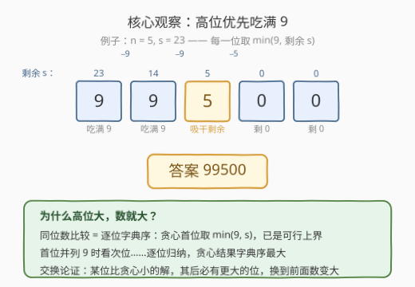
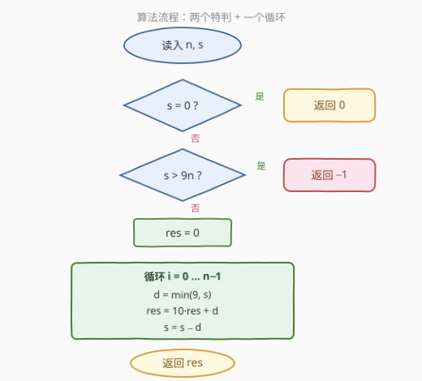

# 给定数位和的最大整数

- **题目名称**：给定数位和的最大整数
- **链接**：[4000. 给定数位和的最大整数](https://leetcode.cn/problems/largest-integer-with-given-digit-sum/)
- **难度**：简单
- **标签**：贪心、数学

## 1. 题目概述

给你两个非负整数 `n` 和 `s`。返回满足下述条件的**最大**整数：

- 最多有 `n` 位数字；
- 其各位数字之和等于 `s`。

如果不存在这样的整数，则返回 `-1`。

**示例 1**：

```text
输入：n = 2, s = 9
输出：90
解释：最多由 2 位数字组成且各位数字之和为 9 的最大整数是 90。
```

**示例 2**：

```text
输入：n = 2, s = 19
输出：-1
解释：不存在最多由 2 位数字组成且各位数字之和为 19 的整数，因此答案为 -1。
```

**示例 3**：

```text
输入：n = 5, s = 0
输出：0
解释：唯一一个各位数字之和为 0 的非负整数是 0。
```

**约束条件**：

- $1 \le n \le 5$
- $0 \le s \le 100$

> 💡 **审题关键**：①「最多 $n$ 位」不是「恰好 $n$ 位」——但 $s \ge 1$ 时最优解一定用满 $n$ 位（正整数比较位数优先，位数多的必更大，如 $30000 > 9999$）；② 返回类型是 **int**，$n \le 5$ 时答案 $\le 99999$，无溢出风险；③ $s$ 上界 100 而 $9n \le 45$，所以 $-1$ 分支真实存在，不是摆设。

---

## 2. 解题思路

### 2.1 暴力思路

$n \le 5$ 意味着候选整数只有 $0 \sim 10^n - 1$ 共至多 $10^5$ 个。从大到小枚举，第一个数位和等于 $s$ 的数即为答案；扫完仍没有则返回 $-1$。总代价 $O(10^n \cdot n) \approx 5 \times 10^5$。

规模小到暴力都合法，恰恰暗示存在**结构性解法**：数位和固定时，数的大小完全由「数位怎么排布」决定——这是可以一步贪心构造的。

### 2.2 核心观察：高位优先吃满 9



**可行性两刀**：

- **$s > 9n$ 无解**：$n$ 个数位、每个至多 9，数位和的上界是 $9n$，超出直接返回 $-1$；
- **$s = 0$ 平凡**：非负整数中数位和为 0 的只有 $0$，答案即 $0$。

**最优性（$1 \le s \le 9n$ 时）——从高位到低位，每位取 $\min(9, \text{剩余 } s)$**：

- **整数比较规则**：正整数先比位数，位数相同再从最高位起逐位比较（字典序）。$s \ge 1$ 保证贪心首位 $\min(9, s) \ge 1$，构造出的是恰好 $n$ 位的数（末尾允许补零）——「位数最大」这一层直接锁定；
- **逐位取上界**：每一位在「剩余数位和」约束下取到可行上界 $\min(9, s_{\text{rem}})$。若某个可行解在这一位取了更小的数字，由于总和相同，其后必有某位取更大——**交换论证**：把小数字后移、大数字前移，数只会变大。归纳可得贪心结果在所有可行解中**字典序最大**，即数值最大。

例如 $n = 5, s = 23$：首位取 $\min(9, 23) = 9$（剩 14），次位取 9（剩 5），第三位取 5（剩 0），后两位补 0，得 $99500$。任何数位和为 23 的数，首位不足 9 即出局；首位也是 9 的，次位再比……逐位被贪心压制。

### 2.3 算法流程图



| 步骤 | 操作 | 说明 |
|------|------|------|
| ① | 特判 $s = 0$ | 返回 $0$ |
| ② | 特判 $s > 9n$ | 数位和上界 $9n$，超出返回 $-1$ |
| ③ | 初始化 $res = 0$ | 用整数累乘累加拼接，无需字符串 |
| ④ | 循环 $n$ 次：$d = \min(9, s)$，$res = 10 \cdot res + d$，$s \mathrel{-}= d$ | 高位优先吃满 9，剩余量向后传递 |
| ⑤ | 返回 $res$ | $s \ge 1$ 时首位必非零，天然无前导零问题 |

### 2.4 示例演算

以 $n = 5, s = 23$ 走一遍完整流程：

| 位次 | 剩余 $s$ | $d = \min(9, s)$ | 拼接后 $res$ |
|------|----------|------------------|--------------|
| 第 1 位 | 23 | 9 | 9 |
| 第 2 位 | 14 | 9 | 99 |
| 第 3 位 | 5 | 5 | 995 |
| 第 4 位 | 0 | 0 | 9950 |
| 第 5 位 | 0 | 0 | 99500 |

答案 $99500$。再核对官方示例：$n=2, s=9 \to$ 首位 $\min(9,9)=9$、次位 0，得 $90$ ✓；$n=2, s=19 > 18 = 9 \times 2 \to -1$ ✓；$n=5, s=0 \to$ 特判返回 $0$ ✓。

---

## 3. 参考代码

### C++

```cpp
class Solution {
  public:
    int largestInteger(int n, int s) {
        if (s == 0) return 0;
        if (s > 9 * n) return -1;
        int res = 0;
        for (int i = 0; i < n; ++i) {
            int d = min(9, s);
            res = res * 10 + d;
            s -= d;
        }
        return res;
    }
};
```

> 💡 **写法要点**：
> - 用整数累乘拼接（$res = 10 \cdot res + d$）比字符串拼接更直接，且 $n \le 5$ 时结果 $\le 99999$，`int` 安全；
> - $s \ge 1$ 时首位 $d = \min(9, s) \ge 1$，天然无前导零，无需额外处理。

### Python

```python
class Solution:
    def largestInteger(self, n: int, s: int) -> int:
        if s == 0:
            return 0
        if s > 9 * n:
            return -1
        res = 0
        for _ in range(n):
            d = min(9, s)
            res = res * 10 + d
            s -= d
        return res
```

---

## 4. 复杂度分析

| 维度 | 复杂度 | 说明 |
|------|--------|------|
| 时间 | $O(n)$ | 循环 $n \le 5$ 次，每次 $O(1)$ |
| 空间 | $O(1)$ | 只用常数个变量 |
| 值域 | 答案 $\le 99999$ | $s > 9n$ 全走 $-1$ 分支，合法答案最大是 $n = 5, s = 45$ 的 $99999$，`int` 轻松容纳 |

---

## 5. 扩展：对偶问题——数位和固定的最小整数

同一副骨架反着用：求「恰好 $n$ 位、数位和为 $s$」的**最小**整数时，把 9 尽量往低位塞、高位留最小——首位须 $\ge 1$，取 $\max(1,\; s - 9(n-1))$，其余各位从高到低取 $\max(0,\; s_{\text{rem}} - 9 \cdot \text{剩余位数})$。例如 $n = 3, s = 10$：首位 $\max(1, 10 - 18) = 1$（剩 9），次位 $\max(0, 9 - 9) = 0$（剩 9），末位 9，得 $109$。

「最大」与「最小」的唯一区别是**分配方向**：最大化把额度往高位赶，最小化把额度往低位赶——本质都是「在数位约束下逐位取极端」的贪心。

---

## 6. 面试要点

**Q1：什么时候无解？**

> 当且仅当 $s > 9n$：$n$ 个数位每个至多 9，数位和上界是 $9n$。另外 $s = 0$ 是平凡解——非负整数中数位和为 0 的只有 $0$ 本身（正整数的数位和至少为 1）。

**Q2：贪心「高位优先吃满 9」为什么正确？**

> 两层。第一层（位数）：$s \ge 1$ 时贪心首位 $\min(9, s) \ge 1$，结果是恰好 $n$ 位的数，而位数多的正整数必大于位数少的，位数维度已最优。第二层（字典序）：逐位交换论证——设某可行解与贪心首次在第 $i$ 位不同，可行解该位更小，因总和相同其后必有某位更大；把大数字换到第 $i$ 位、小数字后移，数严格变大，故原解非最优。归纳得贪心逐位最大。

**Q3：$s = 0$ 为什么要特判？**

> 对返回 **int** 的本题，不特判数值上也对——循环每位取 $\min(9, 0) = 0$，拼出 $00000$ 数值即 $0$。但若接口改为返回**字符串**，会得到 `"00000"`，必须特判剪成 `"0"`。显式特判表达意图更清晰，也顺便覆盖了字符串场景。

**Q4：结果会溢出吗？**

> 不会。$s \le 100$ 而 $9n \le 45$，$s > 45$ 的输入全走 $-1$ 分支；合法答案最大是 $n = 5, s = 45$ 的 $99999$，`int`（乃至 `int16` 以上的常规选择）都安全。

**Q5：暴力也能过，为什么还写贪心？**

> $n \le 5$ 时枚举 $10^5$ 个数确实能过，但贪心 $O(n)$ 不仅更快，还揭示了「数位和固定 $\Rightarrow$ 逐位取上界」的结构性规律。同类题如 [738. 单调递增的数字](https://leetcode.cn/problems/monotone-increasing-digits/) 的 $n$ 高达 $10^9$，暴力直接超时，构造性解法才是通用武器。

---

## 7. 同类练习题

- [179. 最大数](https://leetcode.cn/problems/largest-number/)：另一种「让数最大」的贪心——自定义比较器决定拼接顺序
- [402. 移掉 K 位数字](https://leetcode.cn/problems/remove-k-digits/)：对偶方向，删字符使剩余数最小，同属数位贪心
- [670. 最大交换](https://leetcode.cn/problems/maximum-swap/)：一次交换使数最大，同款「大数字往前挪」的直觉
- [738. 单调递增的数字](https://leetcode.cn/problems/monotone-increasing-digits/)：从低位向高位传递借位的数位构造贪心
- [2578. 最小和分割](https://leetcode.cn/problems/split-with-minimum-sum/)：数位重排求最小和，「额度往哪边分配」的同款思维
