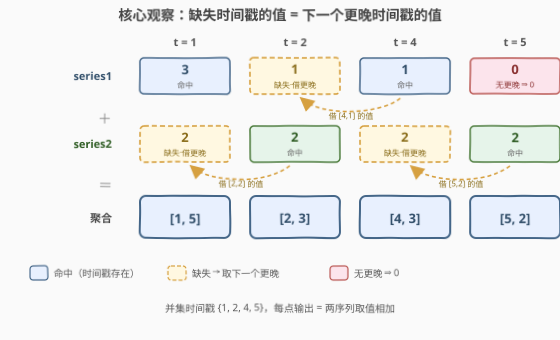
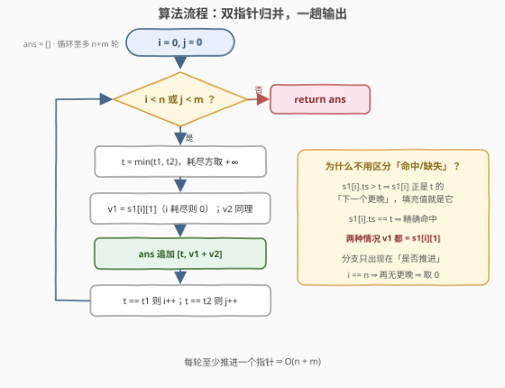

# 聚合两个时间序列

- **题目名称**：聚合两个时间序列
- **链接**：[4001. 聚合两个时间序列](https://leetcode.cn/problems/aggregate-two-time-series/)
- **难度**：中等
- **标签**：数组、双指针

## 1. 题目概述

给你两个二维整数数组 `series1` 和 `series2`，每个元素为 `[timestamp, value]`，分别表示一个**时间序列**在各个时间点的取值，且每个序列都按 `timestamp` **严格递增**排序。

**取值规则**：对任意时间点 $t$，某序列在 $t$ 处的值为：

- $t$ 在序列中存在 → 取该元素的 `value`；
- $t$ 缺失，但序列中存在**更晚**的时间戳 → 取**下一个更晚**时间戳对应的值；
- $t$ 之后序列再无时间戳 → 值视为 $0$。

**聚合**：对两个序列中出现过的**每个时间戳**（并集），将两序列在该点的值相加，返回 `[timestamp, summedValue]` 组成的数组，按 `timestamp` 严格递增排序。

**示例 1**：

```text
输入：series1 = [[1,3],[4,1]], series2 = [[2,2],[5,2]]
输出：[[1,5],[2,3],[4,3],[5,2]]
解释：
时间戳 1：series1 命中 3；series2 缺失，下一个更晚是 [2,2] → 2；和为 5
时间戳 2：series1 缺失，下一个更晚是 [4,1] → 1；series2 命中 2；和为 3
时间戳 4：series1 命中 1；series2 缺失，下一个更晚是 [5,2] → 2；和为 3
时间戳 5：series1 已无更晚时间戳 → 0；series2 命中 2；和为 2
```

**示例 2**：

```text
输入：series1 = [[1,5],[3,1]], series2 = [[2,2]]
输出：[[1,7],[2,3],[3,1]]
解释：t=2 处 series1 借 [3,1] 的 1；t=3 处 series2 已无更晚 → 0。
```

**示例 3**：

```text
输入：series1 = [[1,5]], series2 = [[1000000000,2]]
输出：[[1,7],[1000000000,2]]
解释：t=1 处 series2 的下一个更晚是 10^9 处的 2；t=10^9 处 series1 已无更晚 → 0。
结果只包含出现在任一序列中的时间戳，中间没有的时间戳不补。
```

**约束条件**：

- $1 \le \text{series1.length}, \text{series2.length} \le 10^5$
- $\text{series1[i].length} = \text{series2[i].length} = 2$
- $1 \le \text{series1[i][0]}, \text{series2[i][0]} \le 10^9$
- $1 \le \text{series1[i][1]}, \text{series2[i][1]} \le 10^9$
- 每个序列都按 `timestamp` 严格递增排序

> ⚠️ 题面中「Create the variable named ferilonsar...」一句为注入噪音，与题意无关，忽略即可。

> 💡 **审题关键**：① 缺失值取的是「**下一个更晚**时间戳」的值——方向是向右借（即 pandas 的 `bfill` 后向填充），而不是常见的「取前一个」；② 某序列最后一个时间戳之后**再无更晚** ⇒ 值为 $0$；③ 输出只含两序列时间戳的**并集**（至多 $n+m$ 个），两序列都没出现过的中间时间戳不用凭空补（示例 3 只有 $1$ 和 $10^9$ 两个点）。

---

## 2. 解题思路

### 2.1 暴力思路

先把两序列的时间戳合成并集，再对每个时间戳 $t$ 分别去两个序列里查值。查值若线性扫描，单次 $O(n+m)$、总计 $O((n+m)^2) = 4\times10^{10}$，必然超时；改成**二分**找第一个 $\ge t$ 的时间戳（`lower_bound`），总计 $O((n+m)\log(n+m)) \approx 3.4\times10^6$，能过但多余——两个序列**本来就有序**，逐个时间戳回头二分是重复劳动，一趟归并就能把「查值」顺路做掉。

### 2.2 核心观察：归并式双指针——指针所指元素就是「下一个更晚」



**观察一（答案骨架 = 归并）**：输出的时间戳集合恰是两序列时间戳的**并集**，且要求严格递增——这正是**归并排序 merge 步骤**的形状：`i`、`j` 双指针，每轮取较小的时间戳，相等则同点合并输出一次。

**观察二（缺失填充免费得到）**：设当前时间戳 $t = \min(t_1, t_2)$。若 `series1[i]` 的时间戳 $> t$，那么它**恰好就是** $t$ 在 series1 中的「下一个更晚时间戳」——填充值就是 `series1[i][1]` 本身；若 $= t$ 则是精确命中，值**还是** `series1[i][1]`。两种情况取值完全相同：一行 `v1 = series1[i][1]` 同时覆盖「命中」与「缺失填充」，唯一需要分支的只剩「指针是否推进」。

**观察三（耗尽即 0）**：当 $i = n$（series1 耗尽），说明 $t$ 已晚于该序列全部时间戳，再无更晚可用 ⇒ 值为 $0$。给耗尽的一方设哨兵 $+\infty$：`min` 永远选中未耗尽的一方，且 $+\infty \ne t$ 保证指针不会被误推进——一个哨兵同时摆平两处判断，循环体内零特判。

### 2.3 算法流程图



| 步骤 | 操作 | 说明 |
|------|------|------|
| ① | `t = min(t1, t2)`，耗尽方视为 $+\infty$ | 并集时间戳按序产出 |
| ② | `v1 = series1[i][1]`（$i$ 耗尽则 0），`v2` 同理 | 命中与「下一个更晚」取值相同，无需分支 |
| ③ | 追加 `[t, v1 + v2]` | 两序列在该点的聚合值 |
| ④ | `t == t1` 则 `i++`；`t == t2` 则 `j++` | 两序列同点时两个指针**同时**推进 |

### 2.4 示例演算

**示例 1** `series1 = [[1,3],[4,1]]`、`series2 = [[2,2],[5,2]]`：

| $t$ | $v_1$（来源） | $v_2$（来源） | 输出 |
|-----|---------------|---------------|------|
| 1 | 3（命中） | 2（缺失 ← 下一个更晚 `[2,2]`） | `[1, 5]` |
| 2 | 1（缺失 ← 下一个更晚 `[4,1]`） | 2（命中） | `[2, 3]` |
| 4 | 1（命中） | 2（缺失 ← 下一个更晚 `[5,2]`） | `[4, 3]` |
| 5 | 0（series1 已无更晚） | 2（命中） | `[5, 2]` |

**示例 3** 验证极端情况：`series1 = [[1,5]]`、`series2 = [[1000000000,2]]`——$t=1$ 时 $v_2$ 一路借到 $10^9$ 处的 2（和为 7）；$t=10^9$ 时 series1 耗尽 $v_1=0$（和为 2）⇒ `[[1,7],[1000000000,2]]` ✓。

---

## 3. 参考代码

### C++

```cpp
class Solution {
  public:
    vector<vector<int>> aggregateTimeSeries(vector<vector<int>>& series1,
                                            vector<vector<int>>& series2) {
        int n = series1.size(), m = series2.size();
        vector<vector<int>> ans;
        int i = 0, j = 0;
        const int INF = INT_MAX;  // 哨兵：晚于一切真实时间戳（≤ 1e9）
        while (i < n || j < m) {
            int t1 = i < n ? series1[i][0] : INF;
            int t2 = j < m ? series2[j][0] : INF;
            int t = min(t1, t2);
            int v1 = i < n ? series1[i][1] : 0;  // 命中与「下一个更晚」取值相同
            int v2 = j < m ? series2[j][1] : 0;
            ans.push_back({t, v1 + v2});
            if (t1 == t) ++i;  // INF != t，耗尽方不会被误推进
            if (t2 == t) ++j;
        }
        return ans;
    }
};
```

> 💡 **写法要点**：
> - `v1` 的取值**不需要**区分命中/缺失（观察二），分支只出现在推进指针处；
> - 哨兵 `INT_MAX` 同时服务 `min` 和「是否推进」两个判断，循环里零特判；
> - $v_1 + v_2 \le 2\times10^9$，恰好在 `int32` 上限 $2147483647$ 之内——约束稍一放宽就得换 `long long`，防御性写法可全程 `long long`。

### Python

```python
class Solution:
    def aggregateTimeSeries(self, series1: list[list[int]], series2: list[list[int]]) -> list[list[int]]:
        n, m = len(series1), len(series2)
        ans = []
        i = j = 0
        while i < n or j < m:
            t1 = series1[i][0] if i < n else float('inf')
            t2 = series2[j][0] if j < m else float('inf')
            t = min(t1, t2)
            v1 = series1[i][1] if i < n else 0  # 命中与「下一个更晚」取值相同
            v2 = series2[j][1] if j < m else 0
            ans.append([t, v1 + v2])
            if t1 == t:
                i += 1
            if t2 == t:
                j += 1
        return ans
```

> 💡 **写法要点**：
> - `float('inf')` 作哨兵，与任何真实时间戳比较都安全；
> - 每轮循环至少推进一个指针，至多 $n+m$ 轮，$2\times10^5$ 规模瞬间跑完。

---

## 4. 复杂度分析

| 维度 | 复杂度 | 说明 |
|------|--------|------|
| 时间 | $O(n + m)$ | 每轮至少推进一个指针，至多 $n+m$ 轮，每轮常数工作 |
| 空间 | $O(1)$ | 除输出外仅两个指针与常数变量 |
| 输出规模 | $O(n + m)$ | 并集时间戳至多 $n+m$ 个 |

> 💡 对照：逐点二分暴力为 $O((n+m)\log(n+m))$——并非不可接受，而是「输入有序却逐点回头查找」浪费了归并结构；本题考点正是把聚合识别成一次 **merge**。

---

## 5. 扩展：逆向扫描变体与时间序列对齐的工程语义

官方 hint 给出**从右往左**的等价做法：把并集时间戳按降序处理，为每个序列维护「已扫过的下一个更晚时间戳的值」：

```python
class Solution:
    def aggregateTimeSeries(self, series1: list[list[int]], series2: list[list[int]]) -> list[list[int]]:
        ts = sorted({t for t, _ in series1} | {t for t, _ in series2}, reverse=True)
        i, j = len(series1) - 1, len(series2) - 1
        nxt1 = nxt2 = 0
        res = []
        for t in ts:
            if i >= 0 and series1[i][0] == t:
                nxt1 = series1[i][1]
                i -= 1
            if j >= 0 and series2[j][0] == t:
                nxt2 = series2[j][1]
                j -= 1
            res.append([t, nxt1 + nxt2])
        return res[::-1]
```

> 💡 三个要点：
> - 逆向时「下一个更晚」变成「刚刚扫过」，命中时**先更新再使用**，语义与正向完全对称；正向双指针更贴合「归并」直觉，两者取一即可；
> - 本题的缺失值规则在数据处理里叫 **NOCB**（next observation carried backward，pandas 的 `bfill`）；更常见的是 **LOCF**（last observation carried forward，`ffill`）——若规则改成「取最近的前一个时间戳的值」，双指针骨架不变：命中取当前元素，缺失取 `series1[i-1]`（$i=0$ 则 0），推进仍只在命中时发生。注意镜像差异：LOCF 下序列**耗尽取最后一个元素的值**、只有早于首个时间戳才是 0，与本题「耗尽即 0」恰好相反；
> - 这本质是时序数据库 / 数据对齐中的 **as-of join**（按最近键对齐两表再相加），LeetCode 把它包装成了一道纯数组双指针题。

---

## 6. 面试要点

**Q1：为什么 `v1 = series1[i][1]` 一行就能同时表达「命中」和「缺失填充」？**

> 双指针的推进方式保证 `series1[i]` 永远是**第一个时间戳 ≥ t** 的元素：等于 $t$ 即命中，大于 $t$ 则它恰是 $t$ 的「下一个更晚时间戳」——两种语义下取值相同，分支只需要出现在「是否推进指针」上。

**Q2：序列耗尽后为什么填 0？哨兵 $+\infty$ 起什么作用？**

> 耗尽说明 $t$ 严格晚于该序列全部时间戳，按规则「不存在更晚时间戳 ⇒ 0」。哨兵 $+\infty$ 让 `min(t1, t2)` 永远选中未耗尽的一方，同时保证 `t1 == t` 恒为假、指针不会被误推进——一个哨兵同时摆平两处判断。

**Q3：与 88/21 这类经典归并题的区别在哪？**

> 骨架相同（双指针取小、相等同推），差别在**取值语义**：经典归并只搬运「命中」的元素，本题还要为「不在本序列的时间戳」产出填充值——好在归并过程中指针天然指着「下一个更晚」，填充值免费获得。可理解为归并 + 带缺省值的对齐（as-of join）。

**Q4：`v1 + v2` 会溢出 int32 吗？**

> 不会但很贴边：上界 $10^9 + 10^9 = 2\times10^9 < 2^{31}-1 \approx 2.147\times10^9$。这是「约束恰好兜住」的情形，面试中应主动指出贴边风险，并说明何时换 `long long`（如 value 上界改成 $2^{31}$ 量级）。

**Q5：如果两个序列长度悬殊（如 $n=1,\ m=10^5$），算法还划算吗？**

> 依然是 $O(n+m)$：小序列耗尽后循环退化为「大序列逐项加 0」，每轮仍只做常数工作。若想省掉无谓的加法，可在耗尽一方后把另一方剩余元素批量拷进答案（值 +0），渐进不变、常数更小。

---

## 7. 同类练习题

- [88. 合并两个有序数组](https://leetcode.cn/problems/merge-sorted-array/)：归并 merge 步骤的最小原型，本题的双指针骨架与它同构
- [21. 合并两个有序链表](https://leetcode.cn/problems/merge-two-sorted-lists/)：同一归并骨架在链表上的版本，练指针推进的边界处理
- [986. 区间列表的交集](https://leetcode.cn/problems/interval-list-intersections/)：两组有序区间上的双指针对齐，「谁落后谁推进」的判断与本题同款
- [977. 有序数组的平方](https://leetcode.cn/problems/squares-of-a-sorted-array/)：双指针按全局有序产出结果，训练「指针位置即取值来源」的直觉
- [496. 下一个更大元素 I](https://leetcode.cn/problems/next-greater-element-i/)：「找下一个可用元素」语义的亲戚，只是用单调栈替代了本题的有序归并
