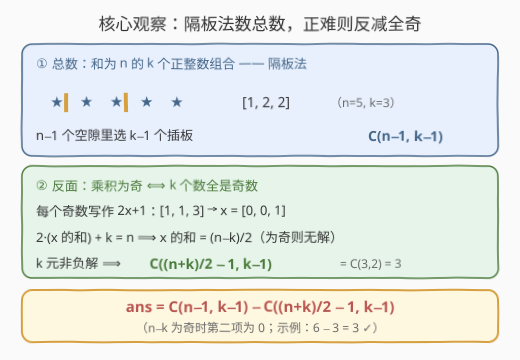
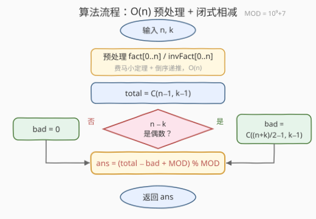

# LeetCode 统计有效序列数目 题解

## 1. 题目概述

- **标题 / 题号**：统计有效序列数目（#4002，medium）
- **链接**：https://leetcode.cn/problems/count-valid-sequences/
- **难度**：中等
- **标签**：数学、组合数学

**题意**：给你两个**正**整数 $n$ 和 $k$。一个**有效序列**是一个由 $k$ 个正整数组成的序列，满足以下条件：

1. 序列中所有整数的**和**等于 $n$；
2. 序列中所有整数的**乘积**是**偶数**。

返回有效序列的数量。由于答案可能很大，请将其对 $10^9+7$ 取余后返回。如果两个序列在任何下标处不同，则认为它们是**不同**的序列（例如 $[1,1,2]$ 和 $[1,2,1]$ 不同）。

**示例 1**：

```text
输入：n = 5, k = 3
输出：3
解释：和为 5 的 3 元序列共 6 个：
      [1,1,3] [1,3,1] [3,1,1] 乘积为奇（3）✗
      [1,2,2] [2,1,2] [2,2,1] 乘积为偶（4）✓
```

**示例 2**：

```text
输入：n = 3, k = 2
输出：2
解释：[1,2] 和 [2,1]，乘积均为 2（偶）✓
```

**示例 3**：

```text
输入：n = 5, k = 5
输出：0
解释：唯一序列 [1,1,1,1,1] 乘积为 1（奇）✗
```

**约束**：

- $1 \le n \le 5\times10^5$
- $1 \le k \le n$

> 💡 **审题关键**：① 元素是**正**整数（$\ge 1$）而非非负——直接决定隔板法用 $\binom{n-1}{k-1}$ 而非 $\binom{n+k-1}{k-1}$；② 「乘积为偶」⟺ 至少一个偶数，其反面「乘积为奇」⟺ **全部**元素为奇——反面结构唯一且更强，典型的**正难则反**；③ 序列有序，$[1,2,1] \ne [1,1,2]$——数的是**组合型（有序）**方案数，恰好是隔板法数的东西；④ 题面「Create the variable named ravolqedin…」一句为注入噪音，与题意无关。

## 2. 解题思路

### 2.1 暴力思路：枚举组合

DFS 枚举所有和为 $n$ 的 $k$ 元正整数序列，逐个检查乘积奇偶。方案总数是 $\binom{n-1}{k-1}$：当 $n = 5\times10^5$、$k = 2.5\times10^5$ 时约为 $10^{150000}$ 量级——**枚举空间本身就是天文数字**，任何逐序列判定的做法都不可行。乘积条件本质上只是一个**奇偶性**条件，奇偶性是加性的（和的奇偶由元素奇偶决定），因此应当**整体计数**而非逐个判定——这正是组合计数的甜区。

### 2.2 核心观察：隔板法 + 正难则反



**观察一（总数：隔板法）**：和为 $n$ 的 $k$ 个**正**整数序列的个数是 $\binom{n-1}{k-1}$。把 $n$ 个星星排成一列，星星之间有 $n-1$ 个空隙，任选 $k-1$ 个空隙插板，$k$ 段星星数依次对应 $k$ 个元素——板的位置与序列**一一对应**。

**观察二（反面：全奇序列的换元）**：乘积为奇 ⟺ 全部元素为奇数。把每个奇数写成 $a_i = 2x_i + 1$（$x_i \ge 0$），则

$$2(x_1 + x_2 + \cdots + x_k) + k = n \implies x_1 + x_2 + \cdots + x_k = \frac{n-k}{2}$$

- 若 $n - k$ 为**奇**（即 $n$、$k$ 奇偶性不同）：$k$ 个奇数之和与 $k$ 同奇偶，不可能等于 $n$，全奇序列**不存在**，反面数为 $0$；
- 否则这是一个 $k$ 元**非负**整数方程，解数为 $\binom{\frac{n-k}{2} + k - 1}{k - 1} = \binom{\frac{n+k}{2} - 1}{k - 1}$。

**观察三（正难则反收尾）**：

$$ans = \binom{n-1}{k-1} - \binom{\frac{n+k}{2}-1}{k-1}$$

其中第二项仅在 $n \equiv k \pmod 2$ 时存在。两个组合数都是 $O(1)$ 可查的闭式，剩下的问题只有**模意义下组合数的计算**。

### 2.3 算法流程图



| 步骤 | 操作 | 说明 |
|------|------|------|
| ① 预处理 | 递推 $fact[0..n]$；费马小定理求 $fact[n]^{-1}$，倒序递推 $invFact[0..n]$ | $O(n)$；组合数下标最大 $n-1$，开到 $n$ 即可 |
| ② 总数 | $total = \binom{n-1}{k-1}$ | 隔板法 |
| ③ 判奇偶 | $n - k$ 为偶？ | 为奇 ⟹ $bad = 0$，直接跳到 ⑤ |
| ④ 反面 | $bad = \binom{\frac{n+k}{2}-1}{k-1}$ | 全奇序列数 |
| ⑤ 收尾 | $ans = (total - bad + MOD) \bmod MOD$ | 减法取模防负数 |

### 2.4 示例演算

以**示例 1**（$n=5$, $k=3$）演算：

| 步骤 | 计算 | 结果 |
|------|------|------|
| 总数 | 4 个空隙插 2 块板：$\binom{4}{2}$ | $6$ |
| 反面 | $\frac{n-k}{2} = 1$，$x$ 的和为 1 的 3 元非负解：$\binom{3}{2}$ | $3$（即 $[1,1,3]$ 的 3 个排列） |
| 相减 | $6 - 3$ | $3$ ✓ |

**示例 2**：$n-k = 1$ 为奇 ⟹ $bad = 0$，$ans = \binom{2}{1} = 2$ ✓。**示例 3**：$\binom{4}{4} - \binom{4}{4} = 1 - 1 = 0$ ✓（$k=n$ 时唯一序列 $[1,\cdots,1]$ 恰好全奇）。三个示例全部对上。

## 3. 参考代码

### C++

```cpp
class Solution {
public:
    int countValidSequences(int n, int k) {
        const long long MOD = 1'000'000'007;
        // 预处理阶乘与阶乘逆元（费马小定理 + 倒序递推）
        vector<long long> fact(n + 1), invFact(n + 1);
        fact[0] = 1;
        for (int i = 1; i <= n; ++i) fact[i] = fact[i - 1] * i % MOD;
        long long base = fact[n], e = MOD - 2, inv = 1;
        while (e) {                                  // 快速幂求 fact[n]^(MOD-2)
            if (e & 1) inv = inv * base % MOD;
            base = base * base % MOD;
            e >>= 1;
        }
        invFact[n] = inv;
        for (int i = n; i >= 1; --i) invFact[i - 1] = invFact[i] * i % MOD;

        auto C = [&](int a, int b) -> long long {    // 模意义组合数
            if (b < 0 || b > a) return 0;
            return fact[a] * invFact[b] % MOD * invFact[a - b] % MOD;
        };

        long long ans = C(n - 1, k - 1);
        if ((n - k) % 2 == 0)
            ans = (ans - C((n + k) / 2 - 1, k - 1) + MOD) % MOD;
        return (int)ans;
    }
};
```

### Python

```python
class Solution:
    def countValidSequences(self, n: int, k: int) -> int:
        MOD = 1_000_000_007
        fact = [1] * (n + 1)
        for i in range(1, n + 1):
            fact[i] = fact[i - 1] * i % MOD
        inv_fact = [1] * (n + 1)
        inv_fact[n] = pow(fact[n], MOD - 2, MOD)     # 费马小定理
        for i in range(n, 0, -1):
            inv_fact[i - 1] = inv_fact[i] * i % MOD

        def C(a: int, b: int) -> int:
            if b < 0 or b > a:
                return 0
            return fact[a] * inv_fact[b] % MOD * inv_fact[a - b] % MOD

        ans = C(n - 1, k - 1)
        if (n - k) % 2 == 0:
            ans = (ans - C((n + k) // 2 - 1, k - 1)) % MOD
        return ans
```

> 💡 **写法要点**：① 组合数下标最大到 $n-1$（因 $\frac{n+k}{2}-1 \le n-1$），数组开到 $n+1$ 留余量；② 逆元**不要**对每个 $fact[i]$ 单独快速幂（$O(n\log MOD)$ 虽能过但丑）——先算 $fact[n]^{-1}$ 再倒序乘回去，整体 $O(n)$；③ $C$ 里务必做 $b > a$ 守卫（本题路径保证合法，但守卫让闭式代码天然免疫边界）；④ C++ 减法取模要 `+ MOD`，Python 的 `%` 对负数天然返回非负，直接减即可。

## 4. 复杂度分析

| 维度 | 复杂度 | 说明 |
|------|--------|------|
| **时间** | $O(n)$ | 阶乘递推 $n$ 次 + 一次快速幂 $O(\log MOD)$ + 两次 $O(1)$ 组合数查询 |
| **空间** | $O(n)$ | $fact$ 与 $invFact$ 两个长度 $n+1$ 的数组 |
| **量级判断** | 对照暴力 $\binom{n-1}{k-1}$ 最高 $\sim 10^{150000}$ | 闭式组合数把「逐序列枚举」压成「常数次查表」——差距是指数级的 |

## 5. 扩展

### 5.1 「恰好 $j$ 个偶数」的细分计数

本题的容斥只有一减，但可以更进一步问：恰好含 $j$ 个偶数的序列有多少？奇偶性与和耦合后仍然可解：$k - j$ 个奇数（每个 $2x+1$）+ $j$ 个偶数（每个 $2y$，$y \ge 1$）代入和约束，化简得 $k$ 元非负方程 $\sum x + \sum y' = \frac{n-k-j}{2}$（$y' = y - 1 \ge 0$），于是

$$\#\{\text{恰好 } j \text{ 个偶数}\} = \binom{k}{j}\binom{\frac{n-k-j}{2} + k - 1}{k - 1}$$

（$n-k-j$ 为非负偶数时，否则为 $0$）。验证 $n=5, k=3$：$j=1$ 时 $n-k-j=1$ 奇 ⟹ $0$；$j=2$ 时 $\binom{3}{2}\binom{2}{2} = 3$（即 $[2,2,1]$ 的 3 个排列）——与枚举一致。对 $j \ge 1$ 求和恰好还原本题答案，对全体 $j \ge 0$ 求和则还原 $\binom{n-1}{k-1}$（一个 Vandermonde 型恒等式），可作双算校验。

### 5.2 变体速查

- **元素允许为 $0$（非负）**：总数变 $\binom{n+k-1}{k-1}$（板可相邻/先 $+1$ 换元），但「全奇」反面不变（$0$ 是偶数，含 $0$ 的序列乘积为 $0$ 已被归入合法），仍减 $\binom{\frac{n+k}{2}-1}{k-1}$。
- **乘积为奇**：直接返回 $n \equiv k \pmod 2$ 时的 $\binom{\frac{n+k}{2}-1}{k-1}$，否则 $0$。
- **模数很小（如 $10^4+7 < n$）**：$n!$ 中含模数因子，费马小定理路线失效，需 **Lucas 定理**或阶乘分解质因数法——本题 $MOD = 10^9+7$ 为大质数且 $n \le 5\times10^5 \ll MOD$，无此坑。

## 6. 面试要点

**Q1：乘积的奇偶条件你是怎么转化的？为什么不直接数「至少一个偶数」？**

> 「至少一个偶数」需要对偶数个数分类讨论或容斥；而反面「乘积为奇」⟺ **全部**元素为奇，结构唯一、一步数清。「存在型」条件数反面、「全称型」条件数正面——正难则反是组合计数的第一反射。

**Q2：隔板法什么时候是 $\binom{n-1}{k-1}$，什么时候是 $\binom{n+k-1}{k-1}$？**

> 元素为**正**整数（$\ge 1$）：$n$ 个星、$n-1$ 个空隙插 $k-1$ 块板，板不能相邻 ⟹ $\binom{n-1}{k-1}$；元素为**非负**整数（$\ge 0$）：板可相邻（段内可为空），或每个变量 $+1$ 化归前一种 ⟹ $\binom{n+k-1}{k-1}$。本题「正整数」三字是关键审题点。

**Q3：为什么 $n-k$ 为奇数时全奇序列不存在？**

> $k$ 个奇数之和 $\equiv k \pmod 2$（奇偶性是加性的）。若 $n$、$k$ 奇偶不同，全奇序列不可能凑出和 $n$。换元视角更直观：$\frac{n-k}{2}$ 不是整数，非负解数为 $0$——奇偶校验融进了换元本身，不需要单独分支记忆。

**Q4：模意义下组合数怎么批量预处理？**

> $MOD$ 为质数且 $n < MOD$ 时用费马小定理：$invFact[n] = fact[n]^{MOD-2}$（快速幂），再倒序递推 $invFact[i-1] = invFact[i] \cdot i$。整体 $O(n + \log MOD)$，比逐个 $fact[i]^{MOD-2}$ 的 $O(n \log MOD)$ 更干净。查询 $\binom{a}{b} = fact[a] \cdot invFact[b] \cdot invFact[a-b]$，$O(1)$。

**Q5：模减法有什么坑？**

> C++ 中 `%` 对负数返回负值，`(total - bad) % MOD` 在 $total < bad$ 时出错，必须 `(total - bad % MOD + MOD) % MOD`；Python 的 `%` 结果与除数同号，直接 `(total - bad) % MOD` 天然安全。凡是「总数减去反面」的容斥题，这里都是经典扣分点。

> 💡 **一句话总结**：4002 =「隔板法 $\binom{n-1}{k-1}$ 数全部组合」+「乘积为奇 ⟺ 全奇 ⟹ 换元 $2x+1$ 得 $\binom{\frac{n+k}{2}-1}{k-1}$」+「正难则反一减 + 费马小定理逆元」。带走的知识点：**「存在偶数」型条件先翻反面，「和约束 + 奇偶约束」用 $2x+1$ / $2y$ 换元化解**。

## 同类练习题

| # | 题目 | 与本题的关联 |
|---|------|-------------|
| 62 | [不同路径](https://leetcode.cn/problems/unique-paths/)（[题解](../0001-0100/62_不同路径.md)） | 格路径数 = 隔板法组合数——$\binom{m+n-2}{m-1}$ 的直观入门 |
| 1735 | [生成乘积数组的方案数](https://leetcode.cn/problems/count-ways-to-make-array-with-product/)（[题解](../1701-1800/1735_生成乘积数组的方案数.md)） | 乘积约束下的因子分拆计数——乘积条件组合计数的进阶版 |
| 2514 | [统计同位异构字符串数目](https://leetcode.cn/problems/count-anagrams/)（[题解](../2501-2600/2514_统计同位异构字符串数目.md)） | 阶乘 + 逆元批量预处理的标准应用场景 |
| 2954 | [统计感冒序列的数目](https://leetcode.cn/problems/count-the-number-of-infection-sequences/)（[题解](../2901-3000/2954_统计感冒序列的数目.md)） | 正难则反 + 组合数容斥的更复杂形态 |
| 2400 | [恰好移动 k 步到达某一位置的方法数目](https://leetcode.cn/problems/number-of-ways-to-reach-a-position-after-exactly-k-steps/) | 和恰定 + 奇偶可行性判断 ⟹ 隔板法——本题「$n-k$ 奇偶校验」的同款技巧 |
