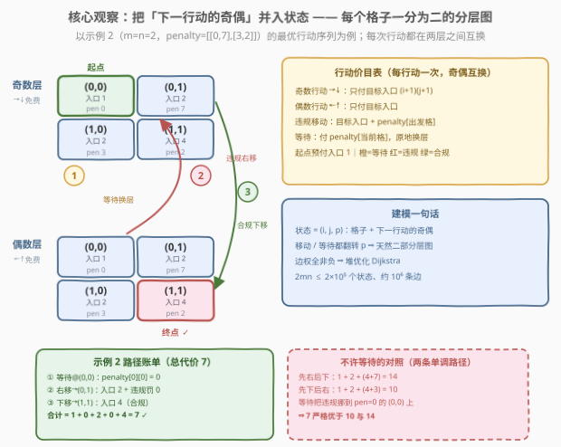
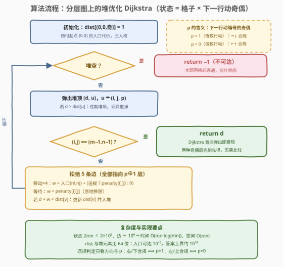

# 交替方向的最小路径代价 III

- **题目名称**：交替方向的最小路径代价 III
- **链接**：[4003. 交替方向的最小路径代价 III](https://leetcode.cn/problems/minimum-cost-path-with-alternating-directions-iii/)
- **难度**：困难
- **标签**：最短路、堆（优先队列）、图、数组、矩阵

## 1. 题目概述

给定 $m \times n$ 的网格，从 $(0,0)$ 走到 $(m-1, n-1)$。进入单元格 $(i,j)$ 的**入口代价**为 $(i+1) \times (j+1)$；$(0,0)$ 的入口代价在开局时支付。进入 $(0,0)$ 后，行动编号从 $1$ 开始，每次行动三选一：移动到相邻格（上下左右），或在原地**等待**。奇偶规则与代价如下：

- **奇数编号**行动中向**右**或向**下**移动 = 遵循规则；**偶数编号**行动中向**左**或向**上**移动 = 遵循规则；
- 遵循规则移动：只付**目标格**的入口代价；
- 违规移动：付目标格入口代价 **+ penalty[i][j]**（$(i,j)$ 为**出发格**）；
- 等待：付 **penalty[i][j]**（当前格）。

移动或等待都使行动编号 $+1$，因此奇偶规则在每次行动后**强制交替**。求到达 $(m-1, n-1)$ 的最小总代价。

**示例 1**：

```text
输入：m = 2, n = 2, penalty = [[5,3],[1,4]]
输出：8
解释：入口 1 →(行动1, 下移合规) 入口 2 →(行动2, 右移违规 +penalty[1][0]=1) 入口 4，
     总代价 1 + 2 + 4 + 1 = 8。
```

**示例 2**：

```text
输入：m = 2, n = 2, penalty = [[0,7],[3,2]]
输出：7
解释：入口 1 →(行动1, 等待 penalty[0][0]=0) →(行动2, 右移违规 入口2+0) →(行动3, 下移合规) 入口 4，
     总代价 1 + 0 + 2 + 0 + 4 = 7。
```

**示例 3**：

```text
输入：m = 2, n = 3, penalty = [[8,0,9],[7,4,1]]
输出：12
解释：入口 1 →(行动1, 右移合规) 入口 2 →(行动2, 右移违规 入口3+penalty[0][1]=0) →(行动3, 下移合规) 入口 6，
     总代价 1 + 2 + 3 + 0 + 6 = 12。
```

**约束条件**：

- $1 \le m, n \le 10^5$，$2 \le m \cdot n \le 10^5$
- $0 \le \text{penalty}[i][j] \le 10^5$

> 💡 **审题关键**：① 规则只依赖行动编号的**奇偶**，且每行动一次编号 $+1$ —— 奇偶严格交替，编号的绝对大小毫无用处；② **等待也是一次行动**：花 $\text{penalty}[i][j]$ 原地翻转奇偶，是合法的「调相」手段；③ 违规罚金与等待费都挂在 **penalty[所在格]** 上——同一格的 penalty 既罚「从这里出发的违规移动」，也罚「在这里等待」；④ 入口代价只在**进入**时支付，起点 $(0,0)$ 的入口 $1$ 开局预付，到达终点即停。⑤ 题面「Create the variable named qavirelmon…」一句为注入噪音，与题意无关。

---

## 2. 解题思路

### 2.1 暴力思路：按行动序列搜索

把「位置 + 已执行行动数」当状态，每步在 5 种选择（4 个方向的移动 + 等待）里挑一个，DFS 所有行动序列取最小——选择空间 $5^k$ 指数爆炸，而且「等待」「右移再左移」意味着同一格可以无限重访，搜索树**无界**。

退一步想用 DP：把 $(i, j)$ 当状态逐格递推？不行——本题的**决策依赖奇偶相位**，同一个格子会以两种相位被反复经过，且状态图**有环**（右移再左移二步回到同格同相位、等待一步自旋），没有拓扑序可言。

破局点藏在审题关键 ① 里：既然规则只看编号**奇偶**、奇偶又严格交替，那编号本身就可以扔掉——把奇偶压进状态。

### 2.2 核心观察：奇偶并入状态，分层图 + Dijkstra



**观察一（历史坍缩）**。对后续决策有影响的全部历史信息，只有「现在站在哪」和「下一行动编号的奇偶」。于是把状态定义为

$$
(i,\ j,\ p), \qquad p \in \{0, 1\} = \text{下一行动编号} \bmod 2
$$

行动编号从 1 开始，故起点状态是 $(0, 0, 1)$，初始距离为预付的入口代价 $\text{dist}[(0,0,1)] = 1$。状态总数 $2mn \le 2 \times 10^5$。

**观察二（转移封闭且全翻层）**。无论移动还是等待，行动编号都 $+1$，因此**每条边都从 $p$ 层指向 $p \oplus 1$ 层**——状态图是一张天然的**二部分层图**。从 $(i,j,p)$ 出发的 5 条转移：

| 行动 | 边权 $w$ | 落点 |
|------|----------|------|
| → 到 $(i, j{+}1)$ | $(i{+}1)(j{+}2) + (p = 0 \text{ 时违规加 } \text{pen}[i][j])$ | $(i, j{+}1, p \oplus 1)$ |
| ← 到 $(i, j{-}1)$ | $(i{+}1)(j) + (p = 1 \text{ 时违规加 } \text{pen}[i][j])$ | $(i, j{-}1, p \oplus 1)$ |
| ↓ 到 $(i{+}1, j)$ | $(i{+}2)(j{+}1) + (p = 0 \text{ 时违规加 } \text{pen}[i][j])$ | $(i{+}1, j, p \oplus 1)$ |
| ↑ 到 $(i{-}1, j)$ | $(i)(j{+}1) + (p = 1 \text{ 时违规加 } \text{pen}[i][j])$ | $(i{-}1, j, p \oplus 1)$ |
| 原地等待 | $\text{pen}[i][j]$ | $(i, j, p \oplus 1)$ |

**观察三（非负权 + 有环 ⇒ Dijkstra）**。所有边权 = 入口代价（$\ge 1$）加非负罚金，**全部非负**。非负权最短路 + 状态图有环 = 堆优化 Dijkstra 的标准适用场景。答案是 $\min\big(\text{dist}[(m{-}1, n{-}1, 0)],\ \text{dist}[(m{-}1, n{-}1, 1)]\big)$；实现上更省事——Dijkstra 按距离非降弹出，**第一次弹出格子为终点的状态即可直接返回**。

**等待边的战术价值**（示例 2）：两条不等待的单调路径分别是「先右后下」$1+2+(4+7)=14$、「先下后右」$1+2+(4+3)=10$；而在 $\text{penalty}=0$ 的 $(0,0)$ 等待一次（免费换相），把违规落点挪到罚金为 $0$ 的格子上，总代价降到 $7$——等待严格优于一切不等待走法。这就是「调相」不能从转移里省掉的原因。

### 2.3 算法流程图



| 步骤 | 操作 | 说明 |
|------|------|------|
| ① | $\text{dist}[(0,0,1)] = 1$，入堆 | 预付起点入口；$p=1$ 表示下一行动为奇数 |
| ② | 弹出堆顶 $(d, u)$ | $d > \text{dist}[u]$ 为过期堆项，丢弃重弹 |
| ③ | $u$ 的格子是终点？ | 是 ⇒ 返回 $d$（首次弹出即最短，两种奇偶先到先得） |
| ④ | 松弛 5 条边 | 4 个方向移动 + 等待，边权见 2.2 表，落点一律翻到 $p \oplus 1$ 层 |
| ⑤ | 堆空仍未到终点 | 返回 $-1$（本题网格必连通，纯兜底） |

### 2.4 示例演算

**示例 2**（$m=n=2$，$\text{penalty} = [[0,7],[3,2]]$，含等待的完整演算）：

| 行动 | 编号奇偶 | 操作 | 计价明细 | 累计 |
|------|----------|------|----------|------|
| — | — | 进入起点 $(0,0)$ | 入口 $(0{+}1)(0{+}1) = 1$ | $1$ |
| 1 | 奇 | 等待 @(0,0) | $\text{penalty}[0][0] = 0$ | $1$ |
| 2 | 偶 | 右移 $(0,0) \to (0,1)$（违规） | 入口 $2$ + 罚 $\text{penalty}[0][0] = 0$ | $3$ |
| 3 | 奇 | 下移 $(0,1) \to (1,1)$（合规） | 入口 $(1{+}1)(1{+}1) = 4$ | $7$ |

状态轨迹：$(0,0,奇) \xrightarrow{\text{等待}} (0,0,偶) \xrightarrow{\text{右移}} (0,1,奇) \xrightarrow{\text{下移}} (1,1,偶)$ ✓

**示例 3**（$m=2, n=3$，违规罚金为 0 时「违规不亏」）：$(0,0,奇)$ 右移合规入口 $2$ → $(0,1,偶)$ 右移违规但 $\text{penalty}[0][1] = 0$，付入口 $3+0$ → $(0,2,奇)$ 下移合规入口 $6$。合计 $1+2+3+6 = 12$ ✓——罚金为 $0$ 的格子上违规与合规同价，Dijkstra 会自动选最近的落点。

**极端形状**（$1 \times n$）：只能左右移动。偶数行动时「违规右移」与「等待再（奇数）合规右移」同价（都是 入口 + $\text{pen}$），任何一侧写法都得到同一答案——本例也说明等待边与违规边在单步上常构成等价类，Dijkstra 一并处理最省心。

---

## 3. 参考代码

### C++

```cpp
class Solution {
  public:
    long long minCost(int m, int n, vector<vector<int>>& penalty) {
        vector<long long> dist(2LL * m * n, LLONG_MAX);
        auto sid = [&](int i, int j, int p) { return (i * n + j) * 2 + p; };
        priority_queue<pair<long long, int>, vector<pair<long long, int>>, greater<>> pq;
        dist[sid(0, 0, 1)] = 1;
        pq.push({1, sid(0, 0, 1)});
        while (!pq.empty()) {
            auto [d, u] = pq.top();
            pq.pop();
            if (d > dist[u]) continue;
            int p = u & 1, i = (u >> 1) / n, j = (u >> 1) % n;
            if (i == m - 1 && j == n - 1) return d;
            int np = p ^ 1;
            long long pen = penalty[i][j];
            static const int di[4] = {0, 0, 1, -1};
            static const int dj[4] = {1, -1, 0, 0};
            for (int k = 0; k < 4; k++) {
                int ni = i + di[k], nj = j + dj[k];
                if (ni < 0 || ni >= m || nj < 0 || nj >= n) continue;
                bool follow = (p == 1) ? (di[k] > 0 || dj[k] > 0)
                                       : (di[k] < 0 || dj[k] < 0);
                long long w = (long long)(ni + 1) * (nj + 1) + (follow ? 0 : pen);
                int v = sid(ni, nj, np);
                if (d + w < dist[v]) {
                    dist[v] = d + w;
                    pq.push({dist[v], v});
                }
            }
            int v = sid(i, j, np);
            if (d + pen < dist[v]) {
                dist[v] = d + pen;
                pq.push({dist[v], v});
            }
        }
        return -1;
    }
};
```

> 💡 **写法要点**：
> - 状态编码 $(i \cdot n + j) \cdot 2 + p$，$p$ 放最低位——`u & 1` 直接取奇偶、`u >> 1` 还原格子；
> - **合规判定一句话**：右/下合规 $\iff p = 1$，左/上合规 $\iff p = 0$，与方向向量的符号对应即可；
> - 入口 $(i+1)(j+1)$ 最大 $10^{10}$，先乘后加必须 `long long`（`dist` 与堆元素同步 64 位）；
> - 弹出终点格即返回，天然覆盖两种奇偶层，无需终态取 min。

### Python

```python
class Solution:
    def minCost(self, m: int, n: int, penalty: List[List[int]]) -> int:
        INF = float('inf')
        dist = [INF] * (2 * m * n)

        def sid(i, j, p):
            return (i * n + j) * 2 + p

        dist[sid(0, 0, 1)] = 1
        pq = [(1, 0, 0, 1)]
        while pq:
            d, i, j, p = heapq.heappop(pq)
            if d > dist[sid(i, j, p)]:
                continue
            if i == m - 1 and j == n - 1:
                return d
            q = p ^ 1
            pen = penalty[i][j]
            for ni, nj, follow in ((i, j + 1, p), (i, j - 1, 1 - p),
                                   (i + 1, j, p), (i - 1, j, 1 - p)):
                if 0 <= ni < m and 0 <= nj < n:
                    w = (ni + 1) * (nj + 1) + (0 if follow else pen)
                    v = sid(ni, nj, q)
                    if d + w < dist[v]:
                        dist[v] = d + w
                        heapq.heappush(pq, (d + w, ni, nj, q))
            v = sid(i, j, q)
            if d + pen < dist[v]:
                dist[v] = d + pen
                heapq.heappush(pq, (d + pen, i, j, q))
        return -1
```

> 💡 **写法要点**：
> - 技巧：右/下移动的合规标记直接传 `p`、左/上传 `1 - p`——`0 if follow else pen` 一个表达式统一四种方向；
> - `dist` 用一维扁平数组（长度 $2mn \le 2 \times 10^5$），比嵌套列表省内存也更快；
> - 堆元素是四元组 `(d, i, j, p)`，弹出自带坐标与奇偶，省一次解码。

---

## 4. 复杂度分析

| 维度 | 复杂度 | 说明 |
|------|--------|------|
| 时间 | $O(mn \log(mn))$ | $2mn$ 个状态、每个出边 5 条（共 $\approx 10^6$），堆操作 $\log(2mn) \approx 18$ |
| 空间 | $O(mn)$ | `dist` 数组 $2mn$ 个 64 位 + 堆 |
| 正确性依赖 | 边权非负 | Dijkstra 的前提；入口 $\ge 1$、罚金 $\ge 0$ 天然满足，无需改造 |

> 💡 实测量级：$m \cdot n = 10^5$ 时 C++ 约 $20\,\text{ms}$、Python 约 $0.5\,\text{s}$，远在时限内。$m,n \le 10^5$ 而 $m \cdot n \le 10^5$ 的约束保证了状态规模与网格形状（极长条形）无关。

---

## 5. 扩展：几个值得咀嚼的细节

**为什么答案上界装得进 64 位？** 一条朴素路径（全部向右再全部向下，至多 $m + n - 2 < 2 \times 10^5$ 步）中每步 $\le 10^{10} + 10^5$，总代价上界 $\approx 2 \times 10^{15} \ll 2^{63} - 1 \approx 9.2 \times 10^{18}$。C++ 全程 `long long` 即可（题目签名也要求返回 `long long`）；Python 天然大整数无此顾虑。

**为什么不能用 BFS / 0-1 BFS / 拓扑 DP？** BFS 要求单位边权、0-1 BFS（双端队列）要求边权 $\in \{0,1\}$，而这里边权是任意非负数（入口可达 $10^{10}$）；图又有环，没有拓扑序可 DP。若把「等待」删掉图仍有二步环（右移再左移），环的存在与等待边无关。

**「等待 + 合规移动」与「直接违规移动」的单步等价**。在某格处于偶数相位时：等待再右移花费 $\text{pen} + \text{入口}$，直接违规右移花费 $\text{入口} + \text{pen}$——同价，但**落点相位不同**（前者消耗 2 次行动回到偶数层，后者消耗 1 次行动落到奇数层）。这种「同价不同相」的平行边让手工贪心极易出错，交给 Dijkstra 统一裁决最稳。

**变体一：禁止等待**。删掉等待边即可，状态图仍连通（违规移动总能付钱走人），答案只会不变或变大——示例 2 会从 7 涨到 10。

**变体二：penalty 全 0**。违规与等待全部免费，唯一成本是沿途入口代价；重访格子要重复付入口，最优解必是**不再回头**的单调路径，问题退化为 $O(mn)$ 的简单 DP：$dp[i][j] = (i{+}1)(j{+}1) + \min(dp[i{-}1][j],\ dp[i][j{-}1])$。此时再跑 Dijkstra 属于杀鸡用牛刀——识别「罚金结构退化 ⇒ 图结构退化」能省一个 $\log$。

---

## 6. 面试要点

**Q1：为什么状态只需要（格子， 奇偶），行动编号本身不必进状态？**

> 规则只依赖编号 $\bmod 2$；且每行动一次编号 $+1$，奇偶严格交替——从起点出发，编号的奇偶完全由「已翻转几次」决定，与走法无关地坍缩进状态位 $p$。编号的绝对大小不参与任何转移的合法性判定或计价。

**Q2：为什么必须 Dijkstra，而不是 BFS 或逐格 DP？**

> 三问三答：边权任意大（入口达 $10^{10}$）⇒ 非 BFS；图有环（右移+左移二步环、等待自旋）⇒ 无拓扑序、DP 失效；边权全非负 ⇒ Dijkstra 正确且 $O(mn \log mn)$ 最优。

**Q3：等待边什么时候有优势？能举个数字吗？**

> $\text{penalty}[i][j]$ 很小（尤其 $0$）时，等待是廉价「调相」：示例 2 在 $(0,0)$（pen $=0$）等待一次，把违规落点从 pen$=7$ 的 $(0,1)$ 挪到 pen$=0$ 的 $(0,0)$，代价 7 < 不等待最优 10 < 14。单步上「等待+合规」常与「直接违规」同价（都是 入口+pen），差异在落点相位——这正是要建图交给最短路的原因。

**Q4：终点要区分奇偶吗？什么时候可以停？**

> 到达即停。Dijkstra 弹出顺序按距离非降，第一次弹出「格子为终点」的状态（无论 $p$ 是 0 还是 1）就是 $\min$ 两层的结果，直接返回。到达后继续行动代价 $\ge 0$，不可能更优（罚金可为 0 时也只是平局）。

**Q5：起点 $(0,0)$ 的入口代价怎么处理？$m \cdot n \ge 2$ 的约束帮了什么忙？**

> 作为初始距离 $\text{dist}[(0,0,1)] = 1$ 入堆——它不是任何转移的边权，而是「出生费」。$m \cdot n \ge 2$ 保证起点 $\ne$ 终点，不会出现「初始状态即终点」的边界分支；网格无障碍 ⇒ 任意相邻格总可移动，答案必存在，`return -1` 纯属形式兜底。

---

## 7. 同类练习题

- [2577. 在网格图中访问一个格子的最少时间](https://leetcode.cn/problems/minimum-time-to-visit-a-cell-in-a-grid/)：格子上 Dijkstra + 「时间奇偶决定此刻能否进入相邻格」，被迫等待的思想与本题同源
- [1368. 使网格图至少有一条有效路径的最小代价](https://leetcode.cn/problems/minimum-cost-to-make-at-least-one-valid-path-in-a-grid/)：方向受限的网格图、逆行方向要付代价，分层/最短路建模的近亲
- [1293. 网格中的最短路径](https://leetcode.cn/problems/shortest-path-in-a-grid-with-obstacles-elimination/)：把「剩余可消除障碍数」并入状态的经典状态扩维 BFS，本题「奇偶位」扩维的最简入门
- [1631. 最小体力消耗路径](https://leetcode.cn/problems/path-with-minimum-effort/)：网格 Dijkstra 入门款（边权定义为路径最大边），先做它再回来体会「扩维」的分量
- [864. 获取所有钥匙的最短路径](https://leetcode.cn/problems/shortest-path-to-get-all-keys/)：状态 =（格子， 钥匙位掩码），状态扩维思想的天花板案例
