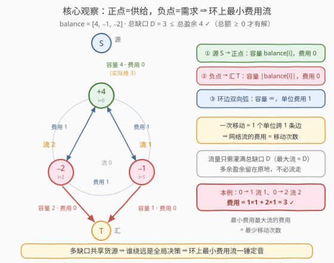
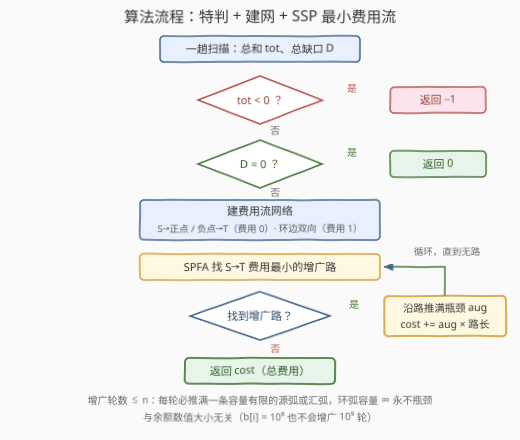

# 使循环数组余额非负的最少移动次数 II

- **题目名称**：使循环数组余额非负的最少移动次数 II
- **链接**：[4004. 使循环数组余额非负的最少移动次数 II](https://leetcode.cn/problems/minimum-moves-to-balance-circular-array-ii/)
- **难度**：困难
- **标签**：图、数组、数学、最小费用流

## 1. 题目概述

> ⚠️ 本题为 LeetCode 付费题，题意描述根据官方示例用例与 hints 重建，可能与官方题面有出入。

给定长度为 $n$ 的**环形**数组 `balance`，`balance[i]` 是第 $i$ 个人的净余额。**一次移动**中，一个人可以将**正好 1 个单位**的余额转移给他的左邻居或右邻居（首尾相邻）。

求使**每个人**的余额都**非负**所需的**最少**移动次数；无法实现则返回 `-1`。

与 [3776. 使循环数组余额非负的最少移动次数](https://leetcode.cn/problems/minimum-moves-to-balance-circular-array/)（I 版）唯一的区别：**不再保证「至多一个负余额」**——数组中可以有任意多个缺口。I 版的排序贪心随之失效，这正是本题升为困难、官方 hints 直接指向最小费用流的原因。

**示例 1**：

```text
输入：balance = [-1, 2, -1]
输出：2
解释：1 号各送 1 个单位给左邻居 0 号、右邻居 2 号，每个单位恰好走 1 步，终态 [0, 0, 0]。
```

**示例 2**：

```text
输入：balance = [4, -1, -2]
输出：3
解释：0 号送 1 个单位给 1 号（1 步）、送 2 个单位给 2 号（首尾相邻，各 1 步），终态 [1, 0, 0]。
```

**示例 3**：

```text
输入：balance = [-3, -3, 5]
输出：-1
解释：总额 −1 < 0，怎么搬都填不平。
```

**约束条件**（付费题，按官方 hints 与 I 版风格推断）：

- $1 \le n \le$ 数百 $\sim$ 数千（官方 hints 明示最小费用流，$n$ 为费用流可处理规模，远小于 I 版的 $10^5$）；
- $-10^9 \le \text{balance}[i] \le 10^9$，答案需 64 位整数。

> 💡 **审题关键**：① 计费口径是「**单位 × 步数**」——把 1 个单位从 $i$ 搬到 $j$，每跨一条边计 1 次移动；② 只约束**最终态**非负，中间过程随便；③ 每次移动只是把钱换个口袋，**总额守恒**——总额 $< 0$ 必返 −1；④ 本题灵魂在**多缺口 + 双向环 + 盈余可留**：货源怎么分、谁走顺时针谁走逆时针，是全局决策，局部贪心无从下手。

---

## 2. 解题思路

### 2.1 暴力思路：I 版贪心为什么失效

I 版的核心是「单缺口 ⇒ 按环距标价的**选购**题」。多缺口时最自然的两种推广都是错的：

- **逐缺口选购**：每个缺口各自按环距从近到远拿货；
- **全局最近配对**：每轮撮合掉环距最小的一对供需。

反例 `balance = [3, -2, 3, 0, 0, -3]`（$n = 6$，总缺口 $D = 5$，缺口在 1、5，货源在 0、2）：

| 方案 | 过程 | 代价 |
|------|------|------|
| 逐缺口选购 | 先填缺口 1：从 0 号拿 2（$d=1$）；再填缺口 5：0 号只剩 1（$d=1$）、差 2 只能从 2 号绕 $d=3$ | $2 + 1 + 6 = 9$ |
| 全局最近配对 | 先撮合 (0,1)×2、(0,5)×1，再被迫 (2,5)×2 | $2 + 1 + 6 = 9$ |
| **最优** | **2 号送 2 个单位给左邻 1 号，0 号送 3 个单位给左邻 5 号** | $\mathbf{2 + 3 = 5}$ |

失效根源：缺口 1、5 都挨着货源 0，但 0 的搭档 2 号只能廉价服务缺口 1——**「谁该让出近货源」取决于全局**，局部最近原则无法回答。至于把整个余额向量当状态做 BFS/Dijkstra，规模指数级，只配当对拍器。需要的是一个**天然全局最优**的工具。

### 2.2 核心观察：供需运输 ⇒ 环上最小费用流



把 I 版 2.1 里那句「建模正确但对单缺口是牛刀」的建模请回来，这次牛刀正好合手：

**观察一（守恒定生死）**：总额 $< 0$ 时任何终态总额仍 $< 0$，必有人为负，返回 `-1`；总额 $\ge 0$ 时总盈余 $\ge$ 总缺口，且环上处处连通，货物总能送到，**必有解**。

**观察二（供需视角）**：正余额点 $i$ 是**供给** `balance[i]`，负余额点 $j$ 是**需求** $|\text{balance}[j]|$。一个单位从 $i$ 搬到 $j$ 沿环逐跳走，每跨一条边计 1 次移动——**运费 = 走过的边数**。总额 $> 0$ 时多出的单位可以**原地不动**（不计费），等价于「每个供给点自愿决定发出多少」。

**观察三（费用流建网）**：

| 弧 | 容量 | 单位费用 | 含义 |
|----|------|----------|------|
| 源 $S \to$ 正点 $i$ | $\text{balance}[i]$ | 0 | $i$ 至多发出自己的余额 |
| 负点 $j \to$ 汇 $T$ | $\|\text{balance}[j]\|$ | 0 | $j$ 恰好需要补齐缺口 |
| 相邻点双向弧 | $\infty$ | 1 | 1 个单位跨 1 条边 = 1 次移动 |

跑一遍**最小费用最大流**：总额 $\ge 0$ 保证最大流恰为 $D$（所有负点弧灌满），其总费用即最少移动次数。

> 💡 **正确性两方向**：**下界**——任何可行移动序列中，每条边上「双向通过量之和 $\ge$ 净流量绝对值」，而各边净流量恰好构成网络中一个流量 $D$ 的可行整流，故移动次数 $\ge \sum_i |y_i| \ge$ 该流费用 $\ge$ 最小费用。**可达**——最小费用流存在整数最优解（网络矩阵全单模），把它分解成一条条「供给点 $\to$ 沿环 $\to$ 需求点」的单位路径逐条执行：途经者「收到即转发」，任何时刻发送者手中都握着该单位，终态恰好全非负。

> 💡 **总额 $> 0$ 的多余盈余不需要任何特殊处理**：网络只要求灌满所有负点弧（流量 $= D$），正点弧可以不满——「不满」就是「留在原地」，零费用且合法。

### 2.3 算法流程图



采用 **SSP（连续最短路）版费用流**：SPFA 在残量网络中找 $S \to T$ 费用最小的增广路，沿路推满瓶颈容量，费用累加「瓶颈 × 路长」，直到无路可走。

**增广轮数 $\le n$**：环弧容量 $\infty$ 永不构成瓶颈，每轮增广至少推满一条容量有限的源弧或汇弧，而这样的弧总共 $\le n$ 条——与余额数值大小无关，$b[i] = 10^9$ 也不会增广 $10^9$ 轮。

### 2.4 示例演算

以示例 2 `[4, -1, -2]` 走全流程（$D = 3$）：

| 轮 | SPFA 最短增广路 | 路长 | 瓶颈 | 费用增量 | 剩余缺口 |
|----|----------------|------|------|----------|----------|
| ① | $S \to 0 \to 1 \to T$ | 1 | $\min(4, \infty, 1) = 1$ | 1 | 2 |
| ② | $S \to 0 \to 2 \to T$（0 与 2 在环上相邻！） | 1 | $\min(3, \infty, 2) = 2$ | 2 | 0 |

合计费用 $3$ ✓。终态 `[1, 0, 0]`——0 号发出的 3 个单位各走 1 步到达 1、2 号，剩下 1 个单位留在原地。

示例 1 `[-1, 2, -1]`（$D = 2$）：① $S \to 1 \to 0 \to T$ 推 1；② $S \to 1 \to 2 \to T$ 推 1，各 1 步，合计 $2$ ✓。示例 3 `[-3, -3, 5]`：总额 $-1 < 0$，直接返回 `-1` ✓。2.1 的反例 `[3, -2, 3, 0, 0, -3]`：增广两轮（$2 \to 1$ 推 2、$0 \to 5$ 推 3）得 $5$，两个贪心的 $9$ 均非最优 ✓。

---

## 3. 参考代码

### C++

```cpp
class Solution {
  public:
    long long minMoves(vector<int>& balance) {
        int n = (int)balance.size();
        long long tot = 0, need = 0;                  // 总和、总缺口
        for (int x : balance) {
            tot += x;
            if (x < 0) need -= x;
        }
        if (tot < 0) return -1;                       // 总量为负：无解
        if (need == 0) return 0;                      // 已全非负

        int S = n, T = n + 1;
        struct Edge { int to; long long cap; int cost, rev; };
        vector<vector<Edge>> g(n + 2);
        auto addEdge = [&](int u, int v, long long cap, int cost) {
            g[u].push_back({v, cap, cost, (int)g[v].size()});
            g[v].push_back({u, 0, -cost, (int)g[u].size() - 1});
        };
        long long sup = 0;                            // 总盈余 = 环弧“无穷”容量
        for (int x : balance) if (x > 0) sup += x;
        for (int i = 0; i < n; ++i) {
            if (balance[i] > 0) addEdge(S, i, balance[i], 0);   // 源 -> 正点
            else if (balance[i] < 0) addEdge(i, T, -balance[i], 0); // 负点 -> 汇
            if (n > 1) {
                addEdge(i, (i + 1) % n, sup, 1);      // 环边双向，费用 1
                addEdge((i + 1) % n, i, sup, 1);
            }
        }

        long long cost = 0;
        while (true) {                                // SSP：SPFA 找最短增广路
            vector<long long> dist(n + 2, LLONG_MAX);
            vector<int> inq(n + 2, 0), pv(n + 2), pe(n + 2);
            deque<int> q;
            dist[S] = 0; q.push_back(S); inq[S] = 1;
            while (!q.empty()) {
                int u = q.front(); q.pop_front(); inq[u] = 0;
                for (int i = 0; i < (int)g[u].size(); ++i) {
                    Edge& e = g[u][i];
                    if (e.cap > 0 && dist[u] + e.cost < dist[e.to]) {
                        dist[e.to] = dist[u] + e.cost;
                        pv[e.to] = u; pe[e.to] = i;
                        if (!inq[e.to]) { inq[e.to] = 1; q.push_back(e.to); }
                    }
                }
            }
            if (dist[T] == LLONG_MAX) break;
            long long aug = LLONG_MAX;
            for (int v = T; v != S; v = pv[v]) aug = min(aug, g[pv[v]][pe[v]].cap);
            for (int v = T; v != S; v = pv[v]) {
                Edge& e = g[pv[v]][pe[v]];
                e.cap -= aug; g[e.to][e.rev].cap += aug;
            }
            cost += aug * dist[T];
        }
        return cost;
    }
};
```

### Python

```python
class Solution:
    def minMoves(self, balance: List[int]) -> int:
        n = len(balance)
        tot = sum(balance)
        need = -sum(x for x in balance if x < 0)      # 总缺口
        if tot < 0:
            return -1                                 # 总量为负：无解
        if need == 0:
            return 0                                  # 已全非负

        S, T = n, n + 1
        g = [[] for _ in range(n + 2)]                # [to, cap, cost, rev]

        def add(u, v, cap, cost):
            g[u].append([v, cap, cost, len(g[v])])
            g[v].append([u, 0, -cost, len(g[u]) - 1])

        sup = sum(x for x in balance if x > 0)        # 总盈余 = 环弧“无穷”容量
        for i, x in enumerate(balance):
            if x > 0:
                add(S, i, x, 0)                       # 源 -> 正点
            elif x < 0:
                add(i, T, -x, 0)                      # 负点 -> 汇
            if n > 1:
                add(i, (i + 1) % n, sup, 1)           # 环边双向，费用 1
                add((i + 1) % n, i, sup, 1)

        cost = 0
        while True:                                   # SSP：SPFA 找最短增广路
            dist = [float('inf')] * (n + 2)
            dist[S] = 0
            inq = [False] * (n + 2)
            pv = [0] * (n + 2)
            pe = [0] * (n + 2)
            q = deque([S])
            inq[S] = True
            while q:
                u = q.popleft()
                inq[u] = False
                du = dist[u]
                for i, e in enumerate(g[u]):
                    if e[1] > 0 and du + e[2] < dist[e[0]]:
                        dist[e[0]] = du + e[2]
                        pv[e[0]] = u
                        pe[e[0]] = i
                        if not inq[e[0]]:
                            inq[e[0]] = True
                            q.append(e[0])
            if dist[T] == float('inf'):
                break
            aug = float('inf')
            v = T
            while v != S:
                aug = min(aug, g[pv[v]][pe[v]][1])
                v = pv[v]
            v = T
            while v != S:
                e = g[pv[v]][pe[v]]
                e[1] -= aug
                g[e[0]][e[3]][1] += aug
                v = pv[v]
            cost += aug * dist[T]
        return cost
```

> ⚠️ **溢出提醒**：答案量级 $\approx$ 总缺口 $\times$ 环距 $\approx 10^9 \times n/2$——C++ 全程 `long long`；环弧容量用「总盈余」充当 $\infty$（任何弧上的流量不会超过总盈余）即可，不必引入魔法大数。

---

## 4. 复杂度分析

| 维度 | 复杂度 | 说明 |
|------|--------|------|
| 时间复杂度 | $O(n^2)$（最坏 $O(n^3)$） | 增广 $\le n$ 轮（每轮必推满一条源弧/汇弧）；每轮 SPFA 在 $O(n)$ 条弧上松弛，通常近 $O(n)$，Bellman-Ford 退化时最坏 $O(n \cdot E)$ |
| 空间复杂度 | $O(n)$ | 邻接表约 $3n$ 条弧 + SPFA 的距离/前驱数组 |

> 💡 本题 $n$ 为官方费用流规模（数百~数千量级），上表绰绰有余；若数据放大到 $10^5$ 且**总额恰为 0**，可换第 5 节的 $O(n \log n)$ 闭式。

---

## 5. 扩展：总额 = 0 时的 O(n log n) 闭式

总额 $= 0$ 时终态被锁死：$\sum \text{终态} = \sum \text{初始} = 0$ 且各项 $\ge 0$ ⟹ **终态全 0**。设 $y_i$ 为边 $(i, i{+}1)$ 上的**净顺时针流量**，节点守恒 $b_i + y_{i-1} - y_i = 0$ 给出 $y_i = y_{i-1} + b_i$，沿环解得

$$y_i = c + S_i,\qquad S_i = \sum_{j \le i} b_j$$

其中常数 $c$（整体环流）平移不改变任何节点余额。总代价 $\sum_i |y_i| = \sum_i |S_i - c|$，在 $c =$ 前缀和的**中位数**处取最小：

$$\text{ans} = \sum_{i=0}^{n-1} \bigl|S_i - \operatorname{median}(S)\bigr|$$

```python
class Solution:
    def minMoves(self, balance: List[int]) -> int:
        if sum(balance) < 0:
            return -1
        S, acc = [], 0
        for x in balance:
            acc += x
            S.append(acc)
        S.sort()
        m = S[len(S) // 2]
        return sum(abs(v - m) for v in S)
```

> ⚠️ **总额 $> 0$ 时不能直接套**：「剩余单位放在哪」本身是决策——如 `[2, 2, -1, -1]`（总额 2）套闭式得 3，真值是 2（剩余 2 个单位要**拆开**留在 0、1 两点，各送 1 个单位给 2、3 号）。这正是费用流网络自动回答的问题，一般情况请回到第 3 节。

顺带一提：I 版（3776）就是本建模在「单缺口」下的贪心特例——按环距标价、先近后远地选购；一旦缺口多于一个，「选购」退化成全局运输，费用流才是正解。

---

## 6. 面试要点

1. **什么时候返回 −1？总额 ≥ 0 为什么必有解？**

   每次移动只是把钱换个口袋，**总额守恒**——总额 $< 0$ 时任何终态必有人为负。总额 $\ge 0$ ⟹ 总盈余 $\ge$ 总缺口，环上处处连通，货总能逐跳送达。

2. **「一次移动 = 费用 1 的弧」这个建模怎么论证正确？**

   下界：任何移动序列在每条边上「双向通过量之和 $\ge$ 净流量绝对值」，净流量构成流量 $D$ 的可行流，故次数 $\ge$ 最小费用；可达：整数最优流分解成单位路径逐条执行，收到即转发，终态全非负。

3. **总额 > 0 的多余盈余怎么处理？**

   什么都不用做：费用流只要求灌满所有负点弧（最大流 $= D$），正点弧不满即「留在原地」，天然零费用。

4. **增广次数为什么与余额大小无关？**

   环弧容量 $\infty$ 永不成为瓶颈，每轮增广至少推满一条容量有限的源弧或汇弧，这样的弧 $\le n$ 条，故 $\le n$ 轮——容量 $10^9$ 也不会增广 $10^9$ 次。

5. **哪些量会溢出 32 位？**

   费用累加与 `aug × dist`：量级 $\approx 10^9 \times n/2$；C++ 必须全程 `long long`，Python 整数无虞。

6. **总额 = 0 有没有更快的做法？总额 > 0 呢？**

   总额 = 0 时终态全 0，各边净流量被前缀和钉死（差一个可平移的环流常数），取中位数即闭式，$O(n \log n)$（第 5 节）；总额 $> 0$ 时剩余放置是自由度，闭式失效，回费用流。

> 💡 **一句话总结**：总额守恒定生死（−1 / 可行）；正点为源、负点为汇、环边双向单价 1，**最小费用最大流的费用就是最少移动次数**；SSP 每轮推满一条有限弧，$\le n$ 轮收工；总额恰为 0 时还可坍缩成「前缀和取中位数」的闭式。

---

## 7. 同类练习题

- [3776. 使循环数组余额非负的最少移动次数](https://leetcode.cn/problems/minimum-moves-to-balance-circular-array/)：本题 I 版，单缺口坍缩成按环距标价的贪心选购，体会「特例能贪心、一般须流」的分界
- [2463. 最小移动总距离](https://leetcode.cn/problems/minimum-total-distance-traveled/)：供给-需求运输的费用流/贪心双解经典，横向对比建模范式
- [517. 超级洗衣机](https://leetcode.cn/problems/super-washing-machines/)：线性版多缺口搬运，答案 = 前缀净流量绝对值的最大值
- [979. 在二叉树中分配硬币](https://leetcode.cn/problems/distribute-coins-in-binary-tree/)：树上版「过剩流向缺口」，每条边流量之和即总移动数
- [134. 加油站](https://leetcode.cn/problems/gas-station/)：环形数组可行性扫描入门，培养环上方向感
