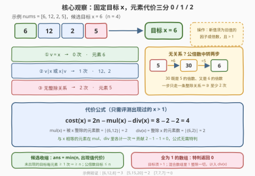
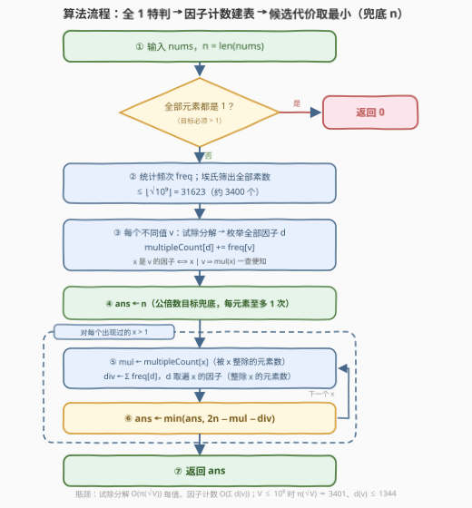

# LeetCode 使数组中所有元素相等的最小操作数 III 题解

## 1. 题目概述

- **标题 / 题号**：使数组中所有元素相等的最小操作数 III（#4005，hard）
- **链接**：https://leetcode.cn/problems/minimum-operations-to-make-array-equal-iii/
- **难度**：困难
- **标签**：数组、哈希表、数学、计数、数论

> ⚠️ 本题为 LeetCode 付费题，题意描述根据官方示例用例与 hints 重建，可能与官方题面有出入。

**题意**：给你一个长度为 $n$ 的整数数组 `nums`。一次操作中，你可以选择任意下标 $i$，将 `nums[i]` 替换为 **`nums[i]` 的某个因子或某个倍数**（替换后的值必须大于 $1$）。

返回使数组中**所有元素相等**的**最小**操作次数。

**示例 1**：

```text
输入：nums = [6,12,8]
输出：3
解释：以 6 为目标：12÷2 变 6（1 次）；8 与 6 无整除关系，先 ×3 变 24、再 ÷4 变 6（2 次），共 3 次。
      也可以全体变 2 或 24，同样 3 次；可以证明 3 次是最少的。
```

**示例 2**：

```text
输入：nums = [5,15,20]
输出：2
解释：以 5 为目标：15÷3 变 5、20÷4 变 5，各 1 次，共 2 次。
```

**示例 3**：

```text
输入：nums = [7,7,7]
输出：0
解释：所有元素已经相等，无需操作。
```

**约束条件**（按 hints 推断）：

- $1 \le \text{nums.length} \le 10^5$
- $1 \le \text{nums[i]} \le 10^9$

> 💡 **审题关键**：① 一步操作只能沿**一条整除关系**走——新值要么整除旧值、要么被旧值整除，别无选择；② 最终的公共值必须**大于 $1$**（官方 hint 明确「distinct targets greater than 1」），因此**全为 1 的数组**要单独处理、答案为 $0$；③ 各元素变换互不影响，总代价 = 逐元素代价之和——这是把「最优化」坍缩成「计数」的支点。

## 2. 解题思路

### 2.1 暴力思路

「换哪个元素、换成什么」看似组合爆炸，但元素之间互不干扰，先拆成两问：**选定目标 $x$，逐元素付账**。于是：

- 枚举目标 $x$：值域高达 $10^9$，直接枚举不现实；退一步枚举「所有元素的因子与倍数」作候选，再对每个候选**全量扫描**数组求代价——$O(\lvert S \rvert \cdot n)$。候选集 $\lvert S \rvert$ 轻松上万（$10^9$ 以内单个数的因子最多 $1344$ 个，$10^5$ 个元素的因子并集可达百万级），总运算量 $10^{12}$ 级。

瓶颈有二：**候选太多**、每个候选还要**重复扫数组**。下面两个观察分别解决它们。

### 2.2 核心观察：代价三分 + 候选收缩 + 因子计数



**观察一（固定目标 $x > 1$，逐元素代价只有 $0 / 1 / 2$ 三档）**：

- $v = x$：$0$ 次；
- $v \mid x$ 或 $x \mid v$：$1$ 次（直接替换，一步到位）；
- 否则：$2$ 次——取 $L = \mathrm{lcm}(v, x)$，则 $v \to L \to x$，两步都沿整除关系走。

下界同样清楚：$1$ 次操作只能沿一条整除关系走，与 $x$ 无关系的元素一步到不了 $x$；$0$ 步更要求本来就相等。三档封顶，与 $x$ 的具体大小无关。

**观察二（代价公式，相等元素的计数自动抵消）**：设 $\mathrm{mul}(x)$ 为**被 $x$ 整除**的元素个数（$x \mid v$），$\mathrm{div}(x)$ 为**整除 $x$** 的元素个数（$v \mid x$）。与 $x$ 相等的元素在两个计数里**各出现一次**，逐元素求和后：

$$
\mathrm{cost}(x) = 2n - \mathrm{mul}(x) - \mathrm{div}(x)
$$

验证：相等元素 $2 - 1 - 1 = 0$；只整除 $x$ 的 $2 - 0 - 1 = 1$；只被整除的 $2 - 1 - 0 = 1$；无关系的 $2 - 0 - 0 = 2$。✓

**观察三（候选收缩，夹逼出「出现过的值」）**：

- **上界**：取全体元素的一个公倍数 $M$（$> 1$）为目标，每个元素至多 $1$ 次 $\Rightarrow \mathrm{ans} \le n$；
- **下界**：$x$ 不在 `nums` 中出现 $\Rightarrow$ 每个元素都 $\ne x$、至少 $1$ 次 $\Rightarrow \mathrm{cost}(x) \ge n$。

两式夹逼得：**只在「数组中出现过的值（$> 1$）」里挑目标，再用 $n$ 兜底**：

$$
\mathrm{ans} = \min\Big(n,\; \min_{x \in \text{不同值},\; x > 1} \mathrm{cost}(x)\Big)
$$

> ⚠️ 别丢掉 $n$ 兜底：例如 `nums = [6, 10, 15]`，三个候选两两无整除关系，$\mathrm{cost}$ 全是 $4 > n = 3$，真正的最优是「全体变公倍数 $30$」，答案 $3$。另外**全为 1 的数组**因「目标必须 $> 1$」无候选可试，特判返回 $0$（本来就全相等，若不特判会错误返回兜底值 $n$）。

**观察四（因子计数，预处理后免扫数组）**：两个计数都不必逐候选重扫数组：

- 对每个**不同值** $v$ 分解质因数、枚举其全部因子 $d$，执行 $\text{multipleCount}[d] \mathrel{+}= \mathrm{freq}(v)$——因 $x \mid v \iff x$ 是 $v$ 的因子，$\text{multipleCount}[x]$ 恰是 $\mathrm{mul}(x)$；
- $\mathrm{div}(x) = \sum_{d \mid x} \mathrm{freq}(d)$——把 $x$ 的因子表上的频次加起来（$1$ 整除一切，元素 $1$ 天然计入）。

### 2.3 算法流程图



| 步骤 | 操作 | 说明 |
|------|------|------|
| ① | 判定「全为 1」 | 目标必须 $> 1$，全 1 已相等，返回 $0$ |
| ② | 统计频次 `freq`；筛出 $\le \lfloor\sqrt{10^9}\rfloor = 31623$ 的素数表 | 约 $3401$ 个素数，供试除分解 |
| ③ | 每个不同值 $v$：试除分解 → 枚举因子 $d$，`multipleCount[d] += freq[v]` | 顺带缓存每个出现值的因子表 |
| ④ | `ans ← n` | 公倍数目标兜底，无需显式构造 lcm |
| ⑤ | 每个出现值 $x > 1$：$\mathrm{mul} \leftarrow$ `multipleCount[x]`，$\mathrm{div} \leftarrow \sum_{d \mid x} \mathrm{freq}[d]$ | 两次查询各 $O(d(x))$ |
| ⑥ | `ans ← min(ans, 2n − mul − div)`，遍历完返回 `ans` | — |

### 2.4 示例演算

以示例 1 `nums = [6, 12, 8]`（$n = 3$）走全流程。因子表：$6 \to \{1,2,3,6\}$、$12 \to \{1,2,3,4,6,12\}$、$8 \to \{1,2,4,8\}$。累加得 `multipleCount`：$6 \to 2$（来自 $6, 12$）、$12 \to 1$、$8 \to 1$、$2 \to 3$、……

| 候选 $x$ | $\mathrm{mul}(x)$（被 $x$ 整除） | $\mathrm{div}(x)$（整除 $x$） | $\mathrm{cost} = 6 - \mathrm{mul} - \mathrm{div}$ |
|---------|------|------|------|
| 6 | $\lvert\{6,12\}\rvert = 2$ | $\lvert\{6\}\rvert = 1$ | **3** |
| 12 | $\lvert\{12\}\rvert = 1$ | $\lvert\{6,12\}\rvert = 2$ | **3** |
| 8 | $\lvert\{8\}\rvert = 1$ | $\lvert\{8\}\rvert = 1$ | 4 |

$\mathrm{ans} = \min(3,\; 3, 3, 4) = 3$ ✓（对应方案：$12 \to 6$ 一步、$8 \to 24 \to 6$ 两步）。

再看兜底生效的场景 `nums = [6, 10, 15]`：三个候选的 $\mathrm{mul} = \mathrm{div} = 1$，$\mathrm{cost}$ 全为 $2 \cdot 3 - 1 - 1 = 4$；而 $n = 3$ 兜底更小（全体变公倍数 $30$，每个元素一次），答案 $3$。✓ 示例 2 `[5,15,20]`：$x = 5$ 时 $\mathrm{mul} = 3$（$5, 15, 20$ 都被 $5$ 整除）、$\mathrm{div} = 1$，$\mathrm{cost} = 6 - 3 - 1 = 2$ ✓；示例 3 `[7,7,7]`：$x = 7$ 时 $\mathrm{mul} = \mathrm{div} = 3$，$\mathrm{cost} = 6 - 3 - 3 = 0$ ✓。

## 3. 参考代码

### C++

```cpp
class Solution {
  public:
    int minOperations(vector<int>& nums) {
        int n = nums.size();
        bool allOne = true;
        for (int v : nums)
            if (v != 1) { allOne = false; break; }
        if (allOne) return 0;                    // 目标必须 > 1，全 1 已相等

        unordered_map<int, int> freq;
        for (int v : nums) ++freq[v];

        // 筛出 <= sqrt(1e9) 的全部素数，供试除分解
        const int LIM = 31623;
        vector<int> primes;
        vector<bool> comp(LIM + 1, false);
        for (int i = 2; i <= LIM; ++i) {
            if (!comp[i]) {
                primes.push_back(i);
                for (long long j = 1LL * i * i; j <= LIM; j += i) comp[j] = true;
            }
        }

        // 由质因数分解生成 x 的全部因子
        auto divisorsOf = [&](int x) {
            vector<int> ds = {1};
            int t = x;
            for (int p : primes) {
                if (1LL * p * p > t) break;      // 用缩小后的 t 提前退出
                if (t % p) continue;
                int e = 0;
                while (t % p == 0) { t /= p; ++e; }
                int base = ds.size();
                long long pe = 1;
                for (int k = 0; k < e; ++k) {
                    pe *= p;
                    for (int i = 0; i < base; ++i) ds.push_back(ds[i] * (int)pe);
                }
            }
            if (t > 1) {                          // 剩下的大于 sqrt(x) 的质因子
                int base = ds.size();
                for (int i = 0; i < base; ++i) ds.push_back(ds[i] * t);
            }
            return ds;
        };

        unordered_map<int, int> mulCnt;          // mulCnt[x] = 被 x 整除的元素个数
        unordered_map<int, vector<int>> divOf;   // 每个出现值的因子表
        for (auto& [v, c] : freq) {
            auto ds = divisorsOf(v);
            for (int d : ds) mulCnt[d] += c;
            divOf.emplace(v, move(ds));
        }

        int ans = n;                             // 公倍数目标兜底：每元素至多 1 次
        for (auto& [x, c] : freq) {
            if (x <= 1) continue;
            int mul = mulCnt[x];
            int div = 0;
            for (int d : divOf[x]) {
                auto it = freq.find(d);
                if (it != freq.end()) div += it->second;
            }
            ans = min(ans, 2 * n - mul - div);
        }
        return ans;
    }
};
```

> 💡 **写法要点**：
> - 试除分解用 `p * p > t`（缩小后的 `t`）判提前退出，平均远快于扫全素数表；余下的 `t > 1` 必是超过 $\sqrt{x}$ 的质因子；
> - 因子表含 $1$ 与 $x$ 自身——$1$ 整除一切（元素 $1$ 自动计入 $\mathrm{div}$）、$x$ 计入相等元素，与公式的「重叠计数抵消」恰好对齐；
> - `ans` 初值 $n$ 即公倍数兜底，**无需显式构造 lcm**（可能溢出）；代价上界 $2n \le 2 \times 10^5$，`int` 安全。

### Python

```python
class Solution:
    def minOperations(self, nums: List[int]) -> int:
        n = len(nums)
        if all(v == 1 for v in nums):
            return 0

        freq = Counter(nums)

        # 筛出 <= sqrt(1e9) 的全部素数
        LIM = 31623
        comp = bytearray(LIM + 1)
        primes = []
        for i in range(2, LIM + 1):
            if not comp[i]:
                primes.append(i)
                for j in range(i * i, LIM + 1, i):
                    comp[j] = 1

        def divisors(x: int) -> list:
            ds = [1]
            t = x
            for p in primes:
                if p * p > t:
                    break
                if t % p:
                    continue
                e = 0
                while t % p == 0:
                    t //= p
                    e += 1
                base = ds[:]
                pe = 1
                for _ in range(e):
                    pe *= p
                    ds += [d * pe for d in base]
            if t > 1:                       # 剩下的大于 sqrt(x) 的质因子
                ds += [d * t for d in ds[:]]
            return ds

        mul_cnt = defaultdict(int)          # mul_cnt[x] = 被 x 整除的元素个数
        div_of = {}
        for v, c in freq.items():
            ds = divisors(v)
            div_of[v] = ds
            for d in ds:
                mul_cnt[d] += c

        ans = n                             # 公倍数目标兜底
        for x in freq:
            if x <= 1:
                continue
            mul = mul_cnt[x]
            div = sum(freq[d] for d in div_of[x] if d in freq)
            ans = min(ans, 2 * n - mul - div)
        return ans
```

> 💡 **写法要点**：`divisors` 内层生成因子时先快照 `base = ds[:]`，再按质因子的各次幂扩展，避免边遍历边修改；`bytearray` 筛比 `list` 省内存也更快。

## 4. 复杂度分析

| 维度 | 复杂度 | 说明 |
|------|--------|------|
| 时间 | $O\big(\lvert D\rvert \cdot \pi(\sqrt{V}) + \sum_{v \in D} d(v)\big)$ | $D$ 为不同值集合、$V \le 10^9$：筛 $O(\sqrt{V})$；每个不同值试除至多 $\pi(\sqrt{V}) \approx 3401$ 次（遇因子即缩小，平均远快于此）；因子生成与计数合计 $\sum d(v)$，$10^9$ 以内 $d(v) \le 1344$ |
| 空间 | $O\big(\sum_{v \in D} d(v)\big)$ | `multipleCount` 哈希表 + 每个出现值的因子表 |
| 值域 | $\mathrm{cost} \le 2n \le 2 \times 10^5$ | `int` 足够，无溢出风险 |

> ⚠️ 理论最坏（$10^5$ 个互异的 $10^9$ 级质数）试除约 $3.4 \times 10^8$ 次除法，C++ 可过、Python 偏紧；实际数据下分解会提前终止，远快于该上界。

## 5. 扩展：系列前作与「目标能否为 1」的变体

- 本题是「使数组中所有元素相等的最小操作数」系列 III：[1551. 使数组中所有元素相等的最小操作数](https://leetcode.cn/problems/minimum-operations-to-make-array-equal/)（等差数组 ±1/±2 操作，中位数公式一步出答案）、[2541. 使数组中所有元素相等的最小操作数 II](https://leetcode.cn/problems/minimum-operations-to-make-array-equal-ii/)（差值计数 + $k$ 整除性判定）走的都是「操作可交换、按差值计数」的路子；III 把操作换成整除关系后，**逐元素代价三档**成为新的骨架。
- **若规则放宽允许目标为 $1$**（即允许把元素换成 $1$）：候选里补上 $x = 1$，$\mathrm{cost}(1) = n - \mathrm{freq}(1)$（每个非 $1$ 元素一步变 $1$），一行改动。官方 hints 的口径是目标大于 $1$，本文按此重建——这也是「全 $1$ 特判」存在的原因。

## 6. 面试要点

**Q1：为什么固定目标后每个元素的代价只有 0/1/2 三档？**

> 一次操作把 $v$ 换成 $u$，当且仅当 $u \mid v$ 或 $v \mid u$——一步只能沿一条整除关系走。于是 $v = x$ 零步；$v \mid x$ 或 $x \mid v$ 一步直达；无关系时经 $\mathrm{lcm}(v, x)$ 中转两步，且不可能更少（一步到 $x$ 隐含整除关系）。三档封顶，与 $x$ 的具体大小无关——这正是能把代价写成计数公式的前提。

**Q2：候选目标为什么收缩到「数组中出现过的值 > 1」？为什么还要用 n 兜底？**

> 未出现的目标使每个元素都 $\ne x$，逐元素至少 $1$ 次，总代价 $\ge n$；而全体元素的任一公倍数 $M > 1$ 让每个元素至多 $1$ 次（$v \mid M$ 一步直达），总代价 $\le n$。两式夹逼：比 $n$ 更优的解只可能出自出现过的值，故 $\mathrm{ans} = \min(n, \min_{\text{出现值 } x > 1} \mathrm{cost}(x))$。典型触发场景：元素两两无整除关系（如 $[6,10,15]$），出现值的代价全高于 $n$，最优解是「全体变公倍数」。

**Q3：mul(x) 与 div(x) 如何避免逐候选重扫数组？**

> 预处理：对每个不同值 $v$ 分解质因数、枚举全部因子 $d$，累加 $\text{multipleCount}[d] \mathrel{+}= \mathrm{freq}(v)$。因 $x \mid v \iff x$ 是 $v$ 的因子，$\text{multipleCount}[x]$ 即「被 $x$ 整除的元素数」$\mathrm{mul}(x)$；$\mathrm{div}(x)$ 则把 $x$ 的因子表上的频次求和（$1$ 整除一切，元素 $1$ 自动计入）。每个候选的代价查询 $O(d(x))$，总计 $O(\sum_v d(v))$。

**Q4：相等元素在代价公式里为什么不用特判？**

> $\mathrm{cost}(x) = 2n - \mathrm{mul}(x) - \mathrm{div}(x)$ 中，等于 $x$ 的元素同时被两个计数各记一次，贡献 $2 - 1 - 1 = 0$ 恰好抵消——把「三档代价求和」展开成「总数减计数」时，重叠计数反而消掉了特判分支，公倍数兜底之外的整个流程没有任何 if 分支处理相等情形。

**Q5：全为 1 的数组为什么特判返回 0？混合数组里的 1 呢？**

> 目标必须大于 $1$，而大于 $1$ 的元素永远变不成 $1$（$1$ 不是合法新值）。全 $1$ 数组本来就全体相等，直接返回 $0$；若不特判，候选集（出现值中 $> 1$ 的部分）为空，会错误地返回兜底值 $n$。混合数组里元素 $1$ 无需特判：$1$ 整除一切目标 $x$，逐元素代价恒为 $1$，且 $1$ 出现在每个 $x$ 的因子表里，$\mathrm{div}(x)$ 自动把它数进去。

## 同类练习题

| # | 题目 | 与本题的关联 |
|---|------|-------------|
| 1551 | [使数组中所有元素相等的最小操作数](https://leetcode.cn/problems/minimum-operations-to-make-array-equal/) | 系列 I，等差数组 ±1/±2 操作，中位数公式一步出答案 |
| 2541 | [使数组中所有元素相等的最小操作数 II](https://leetcode.cn/problems/minimum-operations-to-make-array-equal-ii/) | 系列 II，差值计数 + $k$ 整除性判定，同款「逐元素独立付账」骨架 |
| 952 | [按公因数计算最大组件大小](https://leetcode.cn/problems/largest-component-size-by-common-factor/) | 分解质因数 + 并查集，与本题「枚举因子建表」同款预处理 |
| 1819 | [序列中不同最大公约数的数目](https://leetcode.cn/problems/number-of-different-subsequences-gcds/) | 枚举候选值 + 倍数验证，候选收缩思路同源 |
| 2183 | [统计可以被 K 整除的下标对数目](https://leetcode.cn/problems/count-array-pairs-divisible-by-k/) | gcd 因子计数，`multipleCount` 的孪生套路 |
