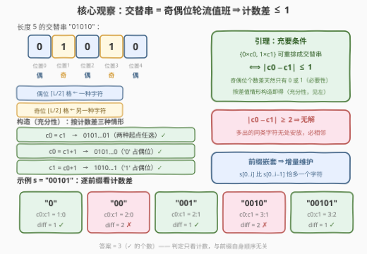
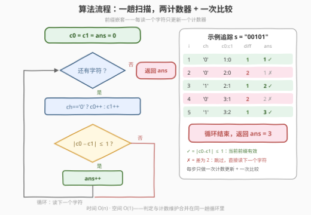

# 统计有效前缀数目

- **题目名称**：统计有效前缀数目
- **链接**：[4006. 统计有效前缀数目](https://leetcode.cn/problems/count-valid-prefixes/)
- **难度**：简单
- **标签**：字符串、计数

## 1. 题目概述

给你一个**二进制**字符串 $s$（仅由 `'0'` 和 `'1'` 组成）。

如果 $s$ 的某个**前缀**的字符可以**重新排列**成一个**交替**字符串，那么该前缀被认为是**有效**的。返回 $s$ 中有效前缀的数量。

- **前缀**：从字符串开头延伸到其内任意点的子字符串；
- **交替**：字符串中没有两个相邻字符相等。

**示例 1**：

```text
输入：s = "00101"
输出：3
解释：有效前缀是 "0"（本身交替）、"001"（重排成 "010"）、"00101"（重排成 "01010"）。
```

**示例 2**：

```text
输入：s = "101"
输出：3
解释：所有前缀都已经交替。
```

**约束条件**：

- $1 \le |s| \le 100$
- $s$ 仅由 `'0'`、`'1'` 组成

> 💡 **审题关键**：① 问的是**重排后能否交替**，与前缀自身的顺序无关——只与前缀里 `'0'`/`'1'` 的**个数**有关；② 前缀按终点 $i$ 共有 $n$ 个（$s[0..i]$），逐个判定即可，而前缀彼此嵌套，计数可以**增量维护**；③ 长度 1 的前缀天然交替，永远有效。

---

## 2. 解题思路

### 2.1 暴力思路：逐前缀重数

对每个终点 $i$，重新扫描 $s[0..i]$ 数出 $c_0, c_1$，再判定能否重排成交替串（判法见 2.2）。时间 $O(n^2)$，$n \le 100$ 时最多 $10^4$ 次字符访问，也能通过；更朴素的「枚举每个前缀的全排列」则是 $O(2^L \cdot L)$ 的指数级，仅可作对拍。

正解的关键是注意到：**前缀是嵌套的**——$s[0..i]$ 只比 $s[0..i-1]$ 多一个字符，两个计数器各加一步即可，判定条件本身也是 $O(1)$ 的。

### 2.2 核心观察：交替 ⟺ 奇偶位轮流值班 ⟺ 计数差 ≤ 1



**引理**：一个长度为 $L$ 的多重集（$c_0$ 个 `'0'`、$c_1$ 个 `'1'`）能重排成交替串 $\iff$ $|c_0 - c_1| \le 1$。

- **必要性**：交替串中字符按位置**轮流出现**——位置 $0, 2, 4, \dots$（偶位）全是一种字符，位置 $1, 3, 5, \dots$（奇位）全是另一种。偶位共 $\lceil L/2 \rceil$ 个、奇位共 $\lfloor L/2 \rfloor$ 个，两种字符的计数差恰为 $\lceil L/2 \rceil - \lfloor L/2 \rfloor \in \{0, 1\}$。
- **充分性（构造）**：$c_0 = c_1$ 时排成 `0101…01`；$c_0 = c_1 + 1$ 时把 `'0'` 放偶位、`'1'` 放奇位得 `0101…0`；$c_1 = c_0 + 1$ 对称排成 `1010…1`。重排不改变多重集，这三种构造覆盖了 $|c_0-c_1|\le 1$ 的全部情形。

于是每个前缀的合法性坍缩成**一次计数差比较**；从左往右扫一遍，维护 $c_0, c_1$，每读一个字符就判一次 $|c_0 - c_1| \le 1$ 并累加答案。

> 💡 **一句话总结**：交替只关心奇偶位各放谁——奇偶位个数天然至多差 1，所以「能重排成交替」$\iff$「两种字符个数至多差 1」；前缀嵌套 ⇒ 计数增量维护，一趟扫描收工。

### 2.3 算法流程图



| 步骤 | 操作 | 说明 |
|------|------|------|
| ① | 初始化 `c0 = c1 = ans = 0` | 两个字符计数器 + 答案 |
| ② | 读入下一个字符 `ch` | 从左到右一趟 |
| ③ | `ch == '0'` 则 `c0++`，否则 `c1++` | 前缀计数增量维护 |
| ④ | 判断 $\|c_0 - c_1\| \le 1$ | 是 → `ans++`（当前前缀有效） |
| ⑤ | 字符读完？否 → 回到 ② | 是 → 返回 `ans` |

### 2.4 示例演算

**示例 1**：$s = $ `"00101"`：

| 前缀 | 新读入 | $c_0$ | $c_1$ | $|c_0-c_1|$ | 有效 |
|------|--------|-------|-------|-------------|------|
| `"0"` | `'0'` | 1 | 0 | 1 | ✓ |
| `"00"` | `'0'` | 2 | 0 | 2 | ✗（两个 0 必相邻） |
| `"001"` | `'1'` | 2 | 1 | 1 | ✓（重排 `010`） |
| `"0010"` | `'0'` | 3 | 1 | 2 | ✗ |
| `"00101"` | `'1'` | 3 | 2 | 1 | ✓（重排 `01010`） |

共 3 个有效前缀，与示例一致。**示例 2**（`"101"`）：三个前缀的计数差依次为 $1, 0, 1$，全部有效，答案 3。

---

## 3. 参考代码

### C++

```cpp
class Solution {
  public:
    int countValidPrefixes(string s) {
        int c0 = 0, c1 = 0, ans = 0;
        for (char ch : s) {                 // ② 从左到右一趟
            (ch == '0' ? c0 : c1)++;        // ③ 前缀计数增量维护
            if (abs(c0 - c1) <= 1) ans++;   // ④ 引理判定，有效则计数
        }
        return ans;
    }
};
```

### Python

```python
class Solution:
    def countValidPrefixes(self, s: str) -> int:
        c0 = c1 = ans = 0
        for ch in s:                        # ② 从左到右一趟
            if ch == '0':
                c0 += 1                     # ③ 前缀计数增量维护
            else:
                c1 += 1
            if abs(c0 - c1) <= 1:           # ④ 引理判定，有效则计数
                ans += 1
        return ans
```

> ⚠️ **注意**：判定的是**重排后**的可达性而非前缀本身已交替——`"001"` 自身不交替但有效。另一个易错点是只判 `c0 == c1` 或漏掉长度为奇数的前缀（差恰为 1 时多数字符占偶位即可）。

---

## 4. 复杂度分析

| 维度 | 复杂度 | 说明 |
|------|--------|------|
| 时间 | $O(n)$ | 每个字符处理一次：一次计数器更新 + 一次常数比较 |
| 空间 | $O(1)$ | 仅 `c0 / c1 / ans` 三个整型变量 |
| 暴力对照 | $O(n^2)$ | 逐前缀重数；$n \le 100$ 也能过，但不具扩展性 |

---

## 5. 扩展：从「二进制交替」到一般字母表

本题判据是经典「**相邻不等重排**」条件的二进制特例。对任意字母表的多重集，能重排成相邻两两不等 $\iff$ **最大出现次数** $\text{maxfreq} \le \lceil L/2 \rceil$（偶位放众数、其余轮流填奇位，即 [767. 重构字符串](https://leetcode.cn/problems/reorganize-string/) 的贪心依据）。二进制下 $L > 1$ 时「相邻不等」与「交替」等价，而 $\text{maxfreq} \le \lceil L/2 \rceil$ 恰好展开成 $|c_0 - c_1| \le 1$——两个判据在同一处汇合。

若题目进一步要求**输出**重排结果：$c_0 \ge c_1$ 时从偶位开始填 `'0'`、奇位填 `'1'`（对称情形交换），构造与判定同阶，$O(n)$。

---

## 6. 面试要点

**Q1：为什么「可重排成交替」等价于「两种字符计数差 ≤ 1」？**

> 必要性：交替串中偶位（$\lceil L/2 \rceil$ 个）全是一种字符、奇位（$\lfloor L/2 \rfloor$ 个）全是另一种，计数差只能是 0 或 1。充分性：按「众数占偶位、另一种占奇位」显式构造即可，差为 0 时两种起点任选。

**Q2：为什么一趟扫描就够，不需要对每个前缀重新计数？**

> 前缀按终点嵌套：$s[0..i]$ 与 $s[0..i-1]$ 只差一个字符。从左往右扫时，把当前字符累进 $c_0$ 或 $c_1$，就得到了当前前缀的全套计数信息——这是**前缀计数的增量性**，与一维前缀和 $O(1)$ 递推同源。

**Q3：如果改成统计有效「子串」的数目，怎么做？**

> 子串不再嵌套，需枚举左右端点：固定左端点向右扩，计数仍是增量维护，整体 $O(n^2)$；判定照旧 $|c_0-c_1|\le1$。可对照 [1525. 字符串分割的好方法数目](https://leetcode.cn/problems/number-of-good-ways-to-split-a-string/) 的前缀/后缀计数骨架。

**Q4：本题判定和 767. 重构字符串是什么关系？**

> 767 的条件 $\text{maxfreq} \le \lceil L/2 \rceil$ 是一般字母表版本；二进制下它恰好等价于 $|c_0 - c_1| \le 1$（$L>1$ 时「相邻不等」⟺「交替」）。本题可视作 767 在二进制多重集上的退化特例，判定条件也从贪心构造坍缩成一次比较。

**Q5：长度为 1 的前缀为什么一定有效？**

> 单字符没有相邻对，天然满足「无两个相邻字符相等」；对应到计数视角即 $|1-0|=1 \le 1$。边界情形由判据自动覆盖，无需特判——好判据应让边界免检。

---

## 7. 同类练习题

- [767. 重构字符串](https://leetcode.cn/problems/reorganize-string/)：一般字母表的「相邻不等重排」，条件 $\text{maxfreq} \le \lceil L/2 \rceil$ 是本题引理的推广
- [1864. 构成交替字符串需要的最小交换次数](https://leetcode.cn/problems/minimum-number-of-swaps-to-make-the-binary-string-alternating/)：把「能否交替」推进到「交换距离目标交替串多远」，同用计数差定可行性
- [1525. 字符串分割的好方法数目](https://leetcode.cn/problems/number-of-good-ways-to-split-a-string/)：前缀/后缀字符计数逐位置判定合法性的同款骨架
- [1224. 最大相等频率](https://leetcode.cn/problems/maximum-equal-frequency/)：一趟扫描动态维护前缀字符计数并逐位回答询问的高阶练习
- [621. 任务调度器](https://leetcode.cn/problems/task-scheduler/)：「计数决定排布」思想的调度版——出现最多的任务钉住框架，其余轮转填充
