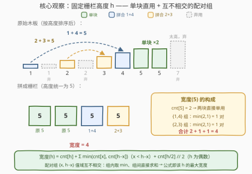
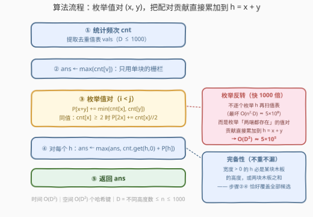

# LeetCode 栅栏的最宽宽度 题解

## 1. 题目概述

- **标题 / 题号**：栅栏的最宽宽度（#4007，hard）
- **链接**：https://leetcode.cn/problems/widest-possible-fence/
- **难度**：困难
- **标签**：数组、哈希表、计数、枚举

**题意**：给你一个整数数组 `planks`，其中 `planks[i]` 表示第 $i$ 块木板的高度，每块木板的宽度为 1 个单位。

你想要用木板建造一个栅栏，栅栏中的**所有木板必须具有相同的高度** $h$。可选的用料方式有两种：

- **直接使用**一块原本的木板（高度即 `planks[i]`）；
- **拼接**两块**不同的**原始木板成一块新木板，其高度等于这两块木板的高度之和。

每块原始木板**最多只能使用一次**，且**不需要**使用所有原始木板。返回可以建造的栅栏的**最大可能宽度**（即栅栏中木板的块数）。

**示例 1**：

```text
输入：planks = [1,3,2,5,7,5,4,2,1]
输出：4
解释：可以得到四块高度为 5 的木板：
     planks[3] = 5（直接使用）
     planks[5] = 5（直接使用）
     planks[0] + planks[6] = 1 + 4 = 5
     planks[1] + planks[2] = 3 + 2 = 5
     因此，最大宽度为 4。
```

**示例 2**：

```text
输入：planks = [2,3,7]
输出：1
解释：即使组合两块不同的原始木板，也不可能形成两块高度相同的木板。
     由于不需要使用所有的原始木板，任选一块木板作为栅栏即可，答案为 1。
```

**约束**：

- $1 \le \text{planks.length} \le 1000$
- $1 \le \text{planks[i]} \le 10^9$

> 💡 **审题关键**：①「两块**不同的**原始木板」约束的是**下标**不同而非高度不同——两块同高木板也可以拼（此时要求该高度至少出现 2 次）；② 每块至多用一次、不必全用 ⇒ 答案至少为 1（任选一块单用）；③ 木板只能**拼高**、不能砍低，高度大于 $h$ 的木板对目标高度 $h$ 完全无用；④ $n \le 1000$ 而值域高达 $10^9$——提示按**值**做哈希计数，而不是开值域桶。

## 2. 解题思路

### 2.1 暴力思路

最直接的想法是先把「候选高度」找出来再逐一验证：

- 栅栏高度 $h$ 要么等于某块木板的高度（单用），要么等于两块木板的和（拼接）——候选集 $=$ 全体 $\text{planks[i]}$ $\cup$ 全体 $\text{planks[i]} + \text{planks[j]}$（$i \ne j$），多达 $O(n^2) \approx 5 \times 10^5$ 个；
- 对每个候选 $h$，再扫描一遍所有出现过的不同高度 $x$，查 $h - x$ 是否存在并统计配对数——每个 $h$ 花费 $O(D)$（$D$ 为不同高度的个数，$\le n$）。

总计 $O(n^2 \cdot D)$，$n = D = 1000$ 时约 $5 \times 10^8$ 次哈希操作：C++ 勉强、Python 必超时。瓶颈在于：**绝大多数候选 $h$ 根本凑不出任何数对**（这要求 $x$ 与 $h-x$ 同时存在），但暴力仍然为它付满了 $O(D)$ 的扫描费。

### 2.2 核心观察：固定高度 h，宽度 = 单块 + 互不相交的配对组



**观察一（高度恰为 $h$ 的木板只能单用）**：若一块高度恰为 $h$ 的木板想参与拼接，搭档的高度必须是 $h - h = 0$，而 $\text{planks[i]} \ge 1$，不存在。因此这 $\text{cnt}[h]$ 块木板**全部直接单用**，每块贡献宽度 1，且不与任何配对抢料——**单用与拼合天然解耦**。

**观察二（配对组互不相交，组内取 min 即最优）**：高度 $x < h$（$x \ne h$）的木板，只可能与高度为 $h - x$ 的木板配成一对。于是所有能参与配对的木板按高度被划分进互不相交的**配对组** $\{x,\ h-x\}$（$x < h - x$）：

- 组内每凑成一对，宽度 +1；同高度木板完全可互换，故最大对数 $= \min(\text{cnt}[x],\ \text{cnt}[h-x])$；
- $h$ 为偶数时 $x = h/2$ 的组**组内自配**，最大对数 $= \lfloor \text{cnt}[h/2] / 2 \rfloor$；
- 高度 $> h$ 的木板既不能单用也不能配对，直接弃用；组与组之间值域不相交，**谁也抢不到别组的木板**，直接求和即全局最优。

$$\text{width}(h) = \underbrace{\text{cnt}[h]}_{\text{单块}} + \sum_{x < h - x} \min\bigl(\text{cnt}[x],\ \text{cnt}[h-x]\bigr) + \underbrace{\bigl\lfloor \text{cnt}[h/2] / 2 \bigr\rfloor}_{h \text{ 为偶数时}}$$

**观察三（枚举反转，$O(D^2)$ 收官）**：与其「枚举 $h$ 再找数对」，不如**反过来枚举值对**——对 cnt 键表中每对不同的值 $x < y$，它只可能为目标高度 $h = x + y$ 贡献 $\min(\text{cnt}[x], \text{cnt}[y])$ 对；对每个 $\text{cnt}[x] \ge 2$ 的值，为 $h = 2x$ 贡献 $\lfloor \text{cnt}[x]/2 \rfloor$ 对。把这些贡献累加进哈希表 $P$，最后：

$$\text{ans} = \max\Bigl(\ \max_v \text{cnt}[v],\ \max_{h \in P}\ \bigl(\text{cnt}.get(h, 0) + P[h]\bigr)\Bigr)$$

值对至多 $\binom{D}{2} + D \approx 5 \times 10^5$ 个，每个 $O(1)$ 累加——**枚举结构本身就保证了「两端都存在」**，这正是比暴力快三个数量级的原因。完备性：宽度 $> 0$ 的 $h$ 必是某块木板的高度（被 $\max_v \text{cnt}[v]$ 覆盖）或两块木板之和（被 $P$ 的键覆盖），不重不漏。

> 💡 **一句话总结**：单用与拼合解耦、配对组按值域天然分家 ⇒ 每个目标高度 $h$ 的最大宽度有**闭式计数**；再把「枚举 $h$ 找数对」反转成「枚举值对记账到 $h$」，$O(D^2)$ 一趟收工。

### 2.3 算法流程图



| 步骤 | 操作 | 说明 |
|------|------|------|
| ① | `cnt ← Counter(planks)`，`vals ← sorted(cnt)` | $D \le n \le 1000$ 个不同高度 |
| ② | `ans ← max(cnt.values())` | 全部单块的栅栏；天然覆盖 $n = 1$ 的边界 |
| ③ | 枚举值对 $x < y$：`P[x+y] += min(cnt[x], cnt[y])`；`cnt[x] ≥ 2` 时 `P[2x] += cnt[x] // 2` | 核心步骤，$O(D^2)$ 次累加 |
| ④ | 对每个 $h \in P$：`ans ← max(ans, cnt.get(h, 0) + P[h])` | 单块与拼合合并 |
| ⑤ | 返回 `ans` | —— |

### 2.4 示例演算

**示例 1**：`planks = [1,3,2,5,7,5,4,2,1]`，频次表 $\text{cnt} = \{1{:}2,\ 2{:}2,\ 3{:}1,\ 4{:}1,\ 5{:}2,\ 7{:}1\}$（$D = 6$）。

枚举全部值对，把贡献累加进 $P$（下表按目标高度 $h$ 汇总）：

| $h$ | 来源值对 | $P[h]$ | $\text{cnt}[h]$（单块） | 宽度 |
|-----|----------|--------|------------------|------|
| 2 | (1,1) | 1 | 0 | 1 |
| 3 | (1,2) | 2 | 1 | 3 |
| 4 | (1,3), (2,2) | 1+1 | 1 | 3 |
| **5** | (1,4), (2,3) | 1+1 | **2** | **4** ★ |
| 6 | (1,5), (2,4) | 2+1 | 0 | 3 |
| **7** | (2,5), (3,4) | 2+1 | **1** | **4** ★ |
| 8 | (1,7), (3,5) | 1+1 | 0 | 2 |
| 9 | (2,7), (4,5) | 1+1 | 0 | 2 |
| 10 | (3,7), (5,5) | 1+1 | 0 | 2 |
| 11 | (4,7) | 1 | 0 | 1 |
| 12 | (5,7) | 1 | 0 | 1 |

单块最大宽度为 $\max \text{cnt} = 2$；与上表合并，答案为 $\mathbf{4}$。注意 $h=5$（两块单用 + 一对 $1{+}4$ + 一对 $2{+}3$）与 $h=7$（单用 7 + 两对 $2{+}5$ + 一对 $3{+}4$）**并列**达到 4——最优解不必唯一。

**示例 2**：`planks = [2,3,7]`，三个值各出现一次。值对 $(2,3), (2,7), (3,7)$ 分别给 $P[5], P[9], P[10]$ 各贡献 1，没有同值对；每个候选高度宽度均为 $0 + 1 = 1$，单块也是 1，答案为 $\mathbf{1}$。

## 3. 参考代码

### C++

```cpp
class Solution {
  public:
    int maximumWidth(vector<int>& planks) {
        unordered_map<long long, int> cnt;
        for (int p : planks) ++cnt[p];

        vector<pair<long long, int>> vals(cnt.begin(), cnt.end());  // (值, 频次)
        sort(vals.begin(), vals.end());
        int m = vals.size();

        int ans = 0;
        for (auto& [v, c] : vals) ans = max(ans, c);        // ② 全部单块

        unordered_map<long long, int> P;                    // P[h]：可拼出的对数
        for (int i = 0; i < m; ++i) {
            auto [x, cx] = vals[i];
            if (cx >= 2) P[2 * x] += cx / 2;                // ③ 两块同高 x+x
            for (int j = i + 1; j < m; ++j) {
                auto [y, cy] = vals[j];
                P[x + y] += min(cx, cy);                    // ③ 两块异高 x+y
            }
        }
        for (auto& [h, p] : P) {                            // ④ 单块 + 拼合
            auto it = cnt.find(h);
            ans = max(ans, p + (it != cnt.end() ? it->second : 0));
        }
        return ans;                                         // ⑤
    }
};
```

> 💡 **写法要点**：
> - 哈希键用 `long long`：$h = x + y$ 最大 $2 \times 10^9$，距 `INT_MAX`（约 $2.147 \times 10^9$）只差约 7%——`int` 恰好装得下但纯属贴边飞行，换 `long long` 一劳永逸；
> - 查询用 `find` 而非 `operator[]`，避免为不存在的 $h$ 悄悄插入零值条目；
> - 答案上界为 $n \le 1000$（宽度不可能超过木板总数），返回 `int` 安全。

### Python

```python
from collections import Counter

class Solution:
    def maximumWidth(self, planks: List[int]) -> int:
        cnt = Counter(planks)
        vals = sorted(cnt)
        ans = max(cnt.values())                    # ② 全部单块

        P = {}                                     # P[h]：可拼出的对数
        m = len(vals)
        for i in range(m):
            x = vals[i]
            if cnt[x] >= 2:                        # ③ 两块同高 x+x
                P[2 * x] = P.get(2 * x, 0) + cnt[x] // 2
            for j in range(i + 1, m):              # ③ 两块异高 x+y
                y = vals[j]
                P[x + y] = P.get(x + y, 0) + min(cnt[x], cnt[y])

        for h, p in P.items():                     # ④ 单块 + 拼合
            ans = max(ans, cnt.get(h, 0) + p)
        return ans                                 # ⑤
```

> 💡 **写法要点**：
> - `Counter` 一次建表；`vals = sorted(cnt)` 直接对键排序，天然保证 $x < y$ 每对只枚举一次；
> - `P.get(k, 0)` / `cnt.get(h, 0)` 兜住缺省 0，无需预填充；
> - Python 大整数无忧，唯一要操心的是别把「枚举值对」写成「枚举 $h$ 再扫值表」——后者是 $5 \times 10^8$ 次操作的超时写法。

## 4. 复杂度分析

| 维度 | 复杂度 | 说明 |
|------|--------|------|
| 时间 | $O(D^2)$ | $D$ 为不同高度个数（$\le n \le 1000$）；值对枚举至多 $\binom{D}{2} + D \approx 5 \times 10^5$ 次 $O(1)$ 累加 |
| 空间 | $O(D^2)$ | $P$ 的键数上界同值对数；$\text{cnt}$ 仅 $O(D)$ |
| 答案规模 | $\le n \le 1000$ | 栅栏宽度不超过木板总数，`int` 足够；但中间量 $h = x + y \le 2 \times 10^9$，C++ 建议用 `long long` 承接 |

实测最坏情形（1000 个互不相同的高度，约 $5 \times 10^5$ 次累加）纯 Python 约 0.34s，轻松通过。

## 5. 扩展：变体与推广

**变体一（允许拼接多于两块）**：若允许把任意多块木板接成一块（高度为任意子集和），问题变为「把 multiset 划分成若干不相交子集、每个子集和恰为 $h$，最大化块数」——这是子集和/装箱味道的组合问题，值域一大便不再有本题这样的多项式闭式。**「至多拼两块」的限制正是宽度公式可加、可 $O(D^2)$ 完成的根本原因**。

**变体二（必须用完所有木板）**：判定是否存在 $h$ 使全部木板各得其所——即 $\max_h \text{width}(h) = n$，用同一公式一遍判定即可。

**变体三（输出具体方案）**：给步骤③的累加记录「来源值对」，步骤④确定最优 $h$ 后，按 $\min$ 配额逐值对实际取木板下标，即可还原每块栅栏木板的用料方案，复杂度不变。

## 6. 面试要点

**Q1：高度恰为 $h$ 的木板为什么一定全部单用、绝不参与拼接？**

> 若它参与拼接，搭档高度须为 $h - h = 0$，而题目保证 $\text{planks[i]} \ge 1$，矛盾。因此 $\text{cnt}[h]$ 块全部单用，每块白赚宽度 1，且与拼合互不抢料——单用与拼合天然解耦，这是宽度公式可以直接「加」的前提。

**Q2：为什么组内取 min、组间直接求和就是最大宽度？会不会存在跨组更优的方案？**

> 值为 $x$（$x < h$，$x \ne h$）的木板只可能与值为 $h - x$ 的木板配成和为 $h$ 的对，故配对组 $\{x, h-x\}$ 按值域两两不相交，跨组根本无法配对；组内同值木板完全可互换，每凑一对宽度 +1，最大对数即 $\min(\text{cnt}[x], \text{cnt}[h-x])$（$x = h/2$ 时组内自配取 $\lfloor \text{cnt}/2 \rfloor$）。各组独立取最优再求和即全局最优。

**Q3：候选高度为什么只需「木板值 + 两木板值之和」？枚举其它高度会怎样？**

> 宽度 $> 0$ 的 $h$，要么有单块（$\text{cnt}[h] > 0$），要么至少有一对木板和恰为 $h$。前者由「② 单块初始化」覆盖，后者由「③ 值对枚举」覆盖；其余 $h$ 宽度必为 0，枚举它们是纯浪费。

**Q4：「枚举 h 再扫值表」与「枚举值对」的复杂度差在哪里？**

> 候选 $h$ 多达 $O(n^2)$ 个（两两之和），每个再 $O(D)$ 扫值表查 $h - x$ 是否存在，最坏 $O(n^2 D) \approx 5 \times 10^8$；反过来直接在 cnt 的键上枚举值对，「两端都存在」由枚举结构天然保证，每对 $O(1)$ 记账到 $h = x + y$，总计 $O(D^2) \approx 5 \times 10^5$——快三个数量级。本质是把「存在性检查」从外层循环挪进了枚举方式本身。

**Q5：实现上有哪些边界与溢出坑？**

> ① $h = x + y$ 最大 $2 \times 10^9$，距 `INT_MAX` 仅约 7%，C++ 哈希键与中间量用 `long long`；② $n = 1$ 时值对循环不执行，`max(cnt.values())` 兜底为 1；③ 两块同高木板拼接要求该高度出现 $\ge 2$ 次，`cnt[x] // 2` 在 $\text{cnt}[x] = 1$ 时自然为 0；④ 高度大于 $h$ 的木板直接弃用，无需显式判断——它们根本不会出现在和为 $h$ 的值对里。

## 同类练习题

| # | 题目 | 与本题的关联 |
|---|------|-------------|
| 1679 | [K 和数对的最大数目](https://leetcode.cn/problems/max-number-of-k-sum-pairs/) | 「和为定值的数对贪心配对」入门版，$\min(\text{cnt}[x], \text{cnt}[k-x])$ 计数的操作型原型 |
| 2006 | [差的绝对值为 K 的数对数目](https://leetcode.cn/problems/count-number-of-pairs-with-absolute-difference-k/) | 按值哈希 + 数对计数的另一形态（$\|x - y\| = k$） |
| 454 | [四数相加 II](https://leetcode.cn/problems/4sum-ii/) | 把「枚举一半 + 哈希累计另一半贡献」推广到四元组 |
| 1814 | [统计一个数组中好对子的数目](https://leetcode.cn/problems/count-nice-pairs-in-an-array/) | 先把元素变形为规范键（$\text{nums[i]} - \text{rev}(\text{nums[i]})$）再做同值数对计数 |
| 1 | [两数之和](https://leetcode.cn/problems/two-sum/) | 哈希查「目标和 − 当前值」的起点；本题相当于每对值都在为目标高度记账 |
