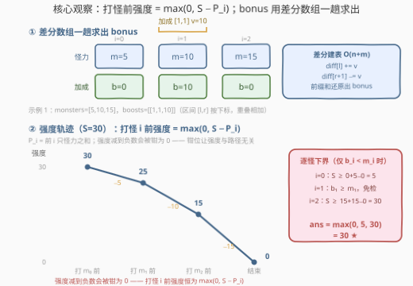
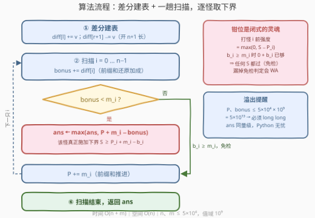

# LeetCode 击败所有怪物的最小初始强度 题解

## 1. 题目概述

- **标题 / 题号**：击败所有怪物的最小初始强度（#4008，medium）
- **链接**：https://leetcode.cn/problems/minimum-initial-strength-to-defeat-all-monsters/
- **难度**：中等
- **标签**：贪心、数组、前缀和、差分数组、二分查找

**题意**：给你一个整数数组 `monsters`，其中 `monsters[i]` 表示第 $i$ 个怪物的强度。

再给你一个二维整数数组 `boosts`，其中 `boosts[i] = [l_i, r_i, v_i]` 表示：与下标落在 $[l_i, r_i]$ 内的任意怪物战斗时，你的**临时加成**会增加 $v_i$。加成范围可以重叠，对同一只怪物**全部生效、直接相加**。

你以某个**非负**初始强度出发，从左到右依次与每只怪物战斗。对下标 $i$：

1. 记 `bonus` 为适用于怪物 $i$ 的所有加成值之**和**；
2. 只有当**当前强度 + bonus ≥ monsters[i]** 时，你才能击败该怪物；
3. 击败后当前强度减少 $\text{monsters}[i]$；若变为**负数，则钳为 0**。

临时加成**仅用于第 2 步的判定**，不会以任何其他方式改变你的当前强度。返回击败所有怪物所需的**最小**初始强度。

**示例 1**：

```text
输入：monsters = [5,10,15], boosts = [[1,1,10]]
输出：30
解释：S=30 时——打 m₀ 前 30(+0) ≥ 5，胜后 25；打 m₁ 前 25(+10) ≥ 10，胜后 15；
     打 m₂ 前 15(+0) ≥ 15，胜后 0。S=29 时最后一战只剩 14 必败，故最小初始强度为 30。
```

**示例 2**：

```text
输入：monsters = [5,10,15], boosts = [[1,2,10],[1,2,5]]
输出：5
解释：下标 1、2 处两个加成叠加 bonus=15。S=5 时——打 m₀ 前 5(+0) ≥ 5，胜后 0；
     打 m₁ 前 0(+15) ≥ 10，胜后仍 0；打 m₂ 前 0(+15) ≥ 15，胜后 0。
```

**约束**：

- $1 \le \text{monsters.length} \le 5 \times 10^4$
- $1 \le \text{monsters[i]} \le 10^9$
- $0 \le \text{boosts.length} \le 5 \times 10^4$
- $\text{boosts[i]} = [l_i, r_i, v_i]$，$0 \le l_i \le r_i < \text{monsters.length}$，$1 \le v_i \le 10^9$

> 💡 **审题关键**：① 加成**只参与判定、不进结算**——它不累入强度、也不被消耗，同一区间对其中每只怪各自完整生效；② 强度**下限钳位在 0**：钳位只会帮玩家（后面的怪相对更好打），也正是强度能写成闭式的关键；③ $n$、$m$ 均为 $5 \times 10^4$、值域 $10^9$ ⇒ 需要 $O(n+m)$ 级算法，且前缀和、加成总和上界 $5 \times 10^{13}$，32 位整型必溢出。

## 2. 解题思路

### 2.1 暴力思路

最直接的做法是**枚举初始强度 $S$ 再模拟**：$S$ 的可行域是 $[0,\ \Sigma \text{monsters}]$（$S = \Sigma$ 时任意时刻强度 $\max(0, S - P_i) \ge m_i$，必胜），每次模拟 $O(n)$，总计 $O(n \Sigma) \approx 2.5 \times 10^{18}$，完全不可行。

一个立刻可得的改进是**二分答案**：若 $S$ 能通关，则任何 $S' > S$ 也能通关（强度随 $S$ 逐点单调不减，见第 5 节），于是二分 $S$、每次 $O(n)$ 模拟判定，共 $O(n \log \Sigma) \approx 2.3 \times 10^6$，可以通过。但它每次判定都要从头模拟整条战斗链，仍未榨干本题的结构——**每个时刻的强度其实有闭式**，判定根本不需要模拟。

### 2.2 核心观察：强度闭式 + 差分求 bonus + 逐怪下界取 max



**观察一（bonus 是区间加，差分数组一趟求出）**：`boosts` 就是「若干区间每个位置统一加值，最后问每个位置的总和」的标准模板（同 [1109. 航班预订统计](https://leetcode.cn/problems/corporate-flight-bookings/)）：令 $\text{diff}[l_i] \mathrel{+}= v_i$、$\text{diff}[r_i+1] \mathrel{-}= v_i$，从左往右前缀和还原即得每只怪的加成 $b_i$，$O(n+m)$ 一步到位。

**观察二（打怪前的强度有闭式）**：记 $P_i = \sum_{j<i} \text{monsters}[j]$（前 $i$ 只怪力之和，$P_0 = 0$）。断言：**打怪 $i$ 之前的强度恰为 $\max(0,\ S - P_i)$**，与中间怎么打完全无关。归纳证明：$i = 0$ 时强度为 $S = \max(0, S - P_0)$；若打怪 $i$ 前强度为 $\max(0, S - P_i)$，则击败后

$$\max\bigl(0,\ \max(0,\, S-P_i) - m_i\bigr) = \max\bigl(0,\ S-P_i-m_i,\ -m_i\bigr) = \max\bigl(0,\ S-P_{i+1}\bigr)$$

（末步用了 $m_i \ge 0$）。直观地说：**钳位发生在"已经减完"之后**，等价于把整条 $S - P$ 折线的负半部分整体抬到 $0$——路径信息被完全吸收进前缀和，任意时刻的强度只由 $S$ 与 $P_i$ 决定。

**观察三（逐怪下界，免检怪不设卡）**：击败条件为 $\max(0, S - P_i) + b_i \ge m_i$，按 $b_i$ 与 $m_i$ 的大小分两类：

- 若 $b_i \ge m_i$：左边 $\ge 0 + b_i \ge m_i$ **恒成立**——该怪对 $S$ **没有任何约束**（免检）；
- 若 $b_i < m_i$：需要 $\max(0, S - P_i) \ge m_i - b_i > 0$，这迫使 $S > P_i$，条件化为 $S \ge P_i + (m_i - b_i)$。

所有怪给出的下界取最大即答案：

$$\text{ans} = \max\Bigl(0,\ \max_{i:\, b_i < m_i} \bigl(P_i + m_i - b_i\bigr)\Bigr)$$

> ⚠️ **常见 WA**：把公式"统一"成 $\max_i\bigl(P_i + \max(0,\ m_i - b_i)\bigr)$ 会对免检怪错误地要求 $S \ge P_i$。反例：`monsters = [5,5], boosts = [[0,1,5]]`——真实答案是 $0$（每战 $0 + 5 \ge 5$，钳位后强度始终为 0），而"统一式"给出 $P_1 + 0 = 5$。免检判断 $b_i < m_i$ **不能省**。

> 💡 **一句话总结**：差分数组 $O(n+m)$ 求出每只怪的加成 $b_i$；钳位让强度闭式化为 $\max(0, S - P_i)$，于是每只怪独立给出一个下界 $S \ge P_i + m_i - b_i$（仅当 $b_i < m_i$），全部取 max 即答案。

### 2.3 算法流程图



| 步骤 | 操作 | 说明 |
|------|------|------|
| ① | `diff[l] += v`，`diff[r+1] -= v` | 差分建表，长度开 $n+1$ 防 $r+1$ 越界 |
| ② | 从左到右扫描 $i = 0 \dots n-1$：`bonus += diff[i]` | 前缀和还原当前怪的加成 |
| ③ | 判断 `bonus < monsters[i]`？ | 免检判定：$b_i \ge m_i$ 的怪不设卡 |
| ④ | 是 ⇒ `ans = max(ans, pre + m_i − bonus)` | 累积下界 $S \ge P_i + m_i - b_i$ |
| ⑤ | `pre += monsters[i]`，进入下一只 | 维护前缀和 $P$ |
| ⑥ | 扫描结束，返回 `ans` | `ans` 初值 0 天然兜底"全部免检"情形 |

### 2.4 示例演算

**示例 1**：`monsters = [5,10,15]`，`boosts = [[1,1,10]]` ⇒ $b = [0, 10, 0]$：

| $i$ | $m_i$ | $b_i$ | $P_i$ | 免检？ | 下界 $P_i + m_i - b_i$ |
|-----|-------|-------|-------|--------|------------------------|
| 0 | 5 | 0 | 0 | 否 | $0 + 5 - 0 = 5$ |
| 1 | 10 | 10 | 5 | **是**（$b \ge m$） | —— |
| 2 | 15 | 0 | 15 | 否 | $15 + 15 - 0 = 30$ ★ |

$\text{ans} = \max(0,\ 5,\ 30) = \mathbf{30}$。

**示例 2**：`monsters = [5,10,15]`，`boosts = [[1,2,10],[1,2,5]]` ⇒ $b = [0, 15, 15]$：

| $i$ | $m_i$ | $b_i$ | $P_i$ | 免检？ | 下界 $P_i + m_i - b_i$ |
|-----|-------|-------|-------|--------|------------------------|
| 0 | 5 | 0 | 0 | 否 | $0 + 5 - 0 = 5$ |
| 1 | 10 | 15 | 5 | **是** | —— |
| 2 | 15 | 15 | 15 | **是** | —— |

$\text{ans} = \max(0,\ 5) = \mathbf{5}$。注意第 2 只怪：虽然 $S = 5 < P_2 = 15$、裸强度早已归零，但 $0 + 15 \ge 15$ 照样通关——这正是"免检怪不设卡"的意义，也是统一式在此翻车的原因。

## 3. 参考代码

### C++

```cpp
class Solution {
  public:
    long long minInitialStrength(vector<int>& monsters, vector<vector<int>>& boosts) {
        int n = monsters.size();
        vector<long long> diff(n + 1, 0);              // ① 差分建表
        for (const auto& b : boosts) {
            diff[b[0]] += b[2];
            diff[b[1] + 1] -= b[2];
        }

        long long ans = 0, pre = 0, bonus = 0;
        for (int i = 0; i < n; ++i) {                  // ② 一趟扫描
            bonus += diff[i];                          //    还原怪 i 的加成
            if (bonus < monsters[i])                   // ③④ 仅 b < m 的怪设卡
                ans = max(ans, pre + monsters[i] - bonus);
            pre += monsters[i];                        // ⑤ 前缀和推进
        }
        return ans;                                    // ⑥
    }
};
```

> 💡 **写法要点**：
> - `pre`、`bonus` 上界均为 $5 \times 10^4 \times 10^9 = 5 \times 10^{13}$，差分表与所有中间量必须用 `long long`（返回类型恰为 `long long`）；
> - `diff` 开 $n+1$ 长度，$r = n-1$ 时 `r+1 = n` 不越界；
> - 免检判断 `bonus < monsters[i]` 是正确性的命门（见 2.2 的 WA 反例）：省掉它两个官方示例照样能过，隐藏用例必挂。

### Python

```python
class Solution:
    def minInitialStrength(self, monsters: List[int], boosts: List[List[int]]) -> int:
        n = len(monsters)
        diff = [0] * (n + 1)                     # ① 差分建表
        for l, r, v in boosts:
            diff[l] += v
            diff[r + 1] -= v

        ans = pre = bonus = 0
        for i, m in enumerate(monsters):         # ② 一趟扫描
            bonus += diff[i]                     #    还原怪 i 的加成
            if bonus < m:                        # ③④ 仅 b < m 的怪设卡
                ans = max(ans, pre + m - bonus)
            pre += m                             # ⑤ 前缀和推进
        return ans                               # ⑥
```

> 💡 **写法要点**：
> - 三个滚动变量 `ans / pre / bonus` 一趟维护，无需显式的 bonus 数组与前缀和数组；
> - `boosts` 为空时 `bonus` 恒为 0，每只怪都设卡，答案退化为 $\max_i (P_i + m_i) = \Sigma \text{monsters}$——没有任何加成时，确实需要初始"血条"扛住全部怪力总和。

## 4. 复杂度分析

| 维度 | 复杂度 | 说明 |
|------|--------|------|
| 时间 | $O(n + m)$ | 差分建表 $O(m)$ + 单趟扫描 $O(n)$ |
| 空间 | $O(n)$ | 差分数组（长度 $n+1$）；其余为 $O(1)$ 滚动变量 |
| 中间量规模 | $\le 5 \times 10^{13}$ | $P_i$、$b_i$ 均可达 $5 \times 10^4 \times 10^9$，C++ 必须 `long long`；答案同量级，Python 大整数无忧 |

## 5. 扩展：二分答案 + O(n) 模拟的保底写法

闭式依赖"强度规则"足够简单。一旦规则被改复杂——比如击败后按比例回血、加成用一次即消失、怪物顺序可选等——$\max(0, S - P_i)$ 这类闭式便会失效，此时**二分答案 + 模拟**是万能保底。本题的可行性关于 $S$ 单调：记 $f_i(S)$ 为打怪 $i$ 前的强度，$f_0(S) = S$ 关于 $S$ 递增，而 $f_{i+1} = \max(0, f_i - m_i)$ 保持单调（单调函数与 $\max$、减法复合仍单调），故「$S$ 能通关」是向上封闭的集合，可以二分：

```python
class Solution:
    def minInitialStrength(self, monsters: List[int], boosts: List[List[int]]) -> int:
        n = len(monsters)
        diff = [0] * (n + 1)
        for l, r, v in boosts:
            diff[l] += v
            diff[r + 1] -= v

        def ok(S: int) -> bool:                  # O(n) 模拟判定
            s, bonus = S, 0
            for i, m in enumerate(monsters):
                bonus += diff[i]
                if s + bonus < m:
                    return False
                s = max(0, s - m)
            return True

        lo, hi = 0, sum(monsters)                # S = Σ 必胜，上界紧
        while lo < hi:
            mid = (lo + hi) // 2
            if ok(mid):
                hi = mid
            else:
                lo = mid + 1
        return lo
```

复杂度 $O(n \log \Sigma)$，$\Sigma \le 5 \times 10^{13}$ 时约 46 轮判定。对比主解法的 $O(n+m)$：闭式解每只怪只"看一眼"，二分解每只怪要被反复看 46 遍——**结构能闭式化时永远优先闭式**。

## 6. 面试要点

**Q1：打怪 $i$ 前的强度为什么恰是 $\max(0, S - P_i)$？钳位难道不会让强度依赖战斗路径吗？**

> 归纳证明（见 2.2）：转移 $\max(0, \max(0, S - P_i) - m_i) = \max(0, S - P_{i+1})$ 用到了 $m_i \ge 0$。直观理解：钳位发生在减法**之后**，等价于把 $S - P$ 折线的负半部分整体抬到 $0$——无论中途在哪些点被钳，之后每一步的强度都与公式一致。路径依赖被前缀和完全吸收，这正是"逐怪独立设卡"的前提。

**Q2：$b_i \ge m_i$ 的怪为什么完全免检？能不能把所有怪统一写成 $S \ge P_i + \max(0, m_i - b_i)$？**

> 免检：判定式左边 $\ge 0 + b_i \ge m_i$，与 $S$ 无关恒真。统一写法**错误**：它对免检怪强加了 $S \ge P_i$，而钳位后 $S < P_i$ 也可能通关。反例 `monsters=[5,5], boosts=[[0,1,5]]`：真实答案 0，统一式给 5。免检判断必须显式写出。

**Q3：二分答案为什么可行？什么情况下应该放弃闭式改用二分？**

> 可行性（「$S$ 能通关」）关于 $S$ 单调：$f_0(S) = S$ 递增，$f_{i+1} = \max(0, f_i - m_i)$ 保持单调，故可行集向上封闭，二分合法。当强度规则复杂到无法闭式化（回血、加成消耗、可选顺序等）时，二分 + 模拟是 $O(n \log \Sigma)$ 的保底解。

**Q4：有哪些溢出与边界坑？**

> ① $P_i$、$b_i$ 上界 $5 \times 10^{13}$，C++ 差分表与前缀和必须 `long long`；② `diff` 开 $n+1$，`r+1 = n` 不越界；③ `boosts` 为空 ⇒ 答案 = $\Sigma \text{monsters}$（每只怪都设卡）；④ $n = 1$ ⇒ 答案 $\max(0, m_0 - b_0)$；⑤ 答案非负，`ans` 初值 0 天然兜底"所有怪全免检"的情形（如示例 2 再叠一个覆盖 0 号怪的加成即得 0）。

**Q5：为什么 boosts 适合差分数组？**

> 三要素齐备：**区间统一加值**（$[l, r]$ 内每点 +v）、**修改全部离线给出**（不需要边查询边修改）、**只要最终每点的总和**。这正是差分的适用模板；若改成在线（边给区间边问某点），就得换树状数组/线段树了。

## 同类练习题

| # | 题目 | 与本题的关联 |
|---|------|-------------|
| 1109 | [航班预订统计](https://leetcode.cn/problems/corporate-flight-bookings/) | 差分数组「区间加 + 前缀和还原」的模板题，本题 boosts 的处理与之完全同构 |
| 174 | [地下城游戏](https://leetcode.cn/problems/dungeon-game/) | 同主题「最小初始血量」，但血量沿途增减且必须从后往前 DP——对比体会"强度可闭式化"与"必须动态规划"的分界线 |
| 875 | [爱吃香蕉的珂珂](https://leetcode.cn/problems/koko-eating-bananas/) | 二分答案 + O(n) 单调判定的原型，即本题第 5 节扩展解法的套路 |
| 1011 | [在 D 天内送达包裹的能力](https://leetcode.cn/problems/capacity-to-ship-packages-within-d-days/) | 二分"能力值/初始资源"的另一形态，单调性论证方式与本题一致 |
| 871 | [最低加油次数](https://leetcode.cn/problems/minimum-number-of-refueling-stops/) | 旅程资源单调消耗 + 途中补给的"最小初始资源"亲戚，决策结构不同但题感相近 |
