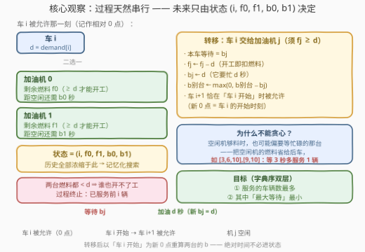
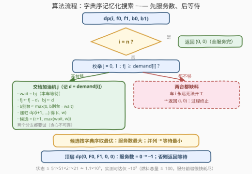

# 最小化最大可能等待时间

- **题目名称**：最小化最大可能等待时间
- **链接**：[4009. 最小化最大可能等待时间](https://leetcode.cn/problems/minimum-possible-maximum-waiting-time/)
- **难度**：困难
- **标签**：记忆化搜索、数组、动态规划

## 1. 题目概述

给你一个整数数组 `demand`，其中 `demand[i]` 是第 $i$ 辆车需要的燃料量。同时给你一个长度为 2 的整数数组 `fuel`，表示**恰好两个**加油机（编号 0 和 1）的初始可用燃料量。

车辆按**递增下标顺序**被允许加油：第 0 辆车在时刻 0 被允许；对每个 $i > 0$，第 $i$ 辆车**恰好**在第 $i-1$ 辆车**开始加油**时被允许。加油过程遵循：

- 每个加油机一次**最多只能服务一辆车**；
- 只有当加油机**空闲**且剩余燃料**至少**为 `demand[i]` 时，车辆才能在该加油机开始加油；
- 车辆等待所选加油机空闲后**立即**开始加油，**不能切换加油机**，也不能在加油机空闲后故意拖延；
- 给一辆车加油需要 `demand[i]` 秒，并将该加油机的剩余燃料减少 `demand[i]`；
- 一旦开始，加油过程不能被中断；
- 当两个加油机都空闲时，若没有任何一个加油机的剩余燃料至少为 `demand[i]`，过程终止，无法再服务更多车辆。

车辆的**等待时间**指从它被允许加油到实际开始加油之间的时间。在**最大化被服务车辆数量**的所有分配方案中，返回所有被服务车辆中**最大等待时间的最小可能值**。如果没有车辆可以被服务，返回 `-1`。

**示例 1**：

```text
输入：demand = [6,8,4,6,5], fuel = [16,13]
输出：6
解释：
      车辆  被允许时间  开始时间  加油机  开始前燃料(机0,机1)  等待
        0        0         0       0        (16, 13)          0
        1        0         0       1        (10, 13)          0
        2        0         6       0        (10, 5)           6
        3        6        10       0        (6, 5)            4
        4       10        10       1        (0, 5)            0
全部 5 辆车都得到服务，最大等待时间为 6。
总需求 29 = 16 + 13 恰好用尽两台燃料，故机 0 必须服务 {6,4,6}、机 1 必须服务 {8,5}，
车 2 必须等机 0 在时刻 6 空闲——任何服务全部 5 辆车的方案，最大等待都不可能小于 6。
```

**示例 2**：

```text
输入：demand = [10,15], fuel = [12,17]
输出：0
解释：时刻 0 两台加油机都空闲且够料，两辆车各占一台、都无需等待。
```

**示例 3**：

```text
输入：demand = [10,5], fuel = [8,8]
输出：-1
解释：时刻 0 两台燃料都不足 10，没有任何车辆被服务。
```

**约束条件**：

- $1 \le \text{demand.length} \le 50$
- $1 \le \text{demand[i]} \le 20$
- $\text{fuel.length} = 2$，$1 \le \text{fuel[j]} \le 50$

> 💡 **审题关键**：①「第 $i$ 辆车恰在前一辆**开始**时被允许」⇒ 时间轴被前车锚定，决策严格一辆接一辆串行推进；②「不能换机、不能故意拖延」⇒ 每辆车的决策就是「承诺给 0 号机还是 1 号机」，方案空间是 $2^n$ 的承诺序列；③ 燃料**只减不增** ⇒ 「现在两台都不够」=「永远都不够」，等待救不了缺料；④ 目标是**字典序双层**优化：先最多服务、再最小化最大等待；⑤ 微妙但关键：即使有空闲且够料的机器，车辆也**允许**去等忙碌的那台（把空闲机器的燃料省给后车）——这正是贪心失效、必须搜索的原因。

---

## 2. 解题思路

### 2.1 暴力思路

每辆车只有在「所选加油机空闲且够料」时才能开工，而它又不能换机、不能拖延——所以一个完整的分配方案就是**给每辆车指定一台加油机的承诺序列** $(j_0, j_1, \dots, j_{n-1})$。

暴力做法：枚举全部 $2^n$ 个承诺序列，逐个**模拟**——维护两台加油机的空闲时刻与剩余燃料，按题意推进（车 $i$ 的开始时刻 $=$ 其允许时刻与所选机器空闲时刻的较大者，等待即差值），统计每个方案的（服务数，最大等待）；最后在服务数最大者中取等待最小。$n = 50$ 时 $2^{50} \approx 10^{15}$，完全不可行。

模拟单个方案本身只需 $O(n)$，瓶颈全在「方案太多且大量殊途同归」——这正是记忆化的切入点。

### 2.2 核心观察：五元组状态 + 字典序记忆化



**观察一（马尔可夫性，一切浓缩为五元组）**：当车 $i$ 被允许的那一刻，后续所有可能的发展只取决于：

$$\bigl(\ i,\ \ f_0,\ f_1,\ \ b_0,\ b_1\ \bigr)$$

其中 $i$ 是当前轮到哪辆车，$f_j$ 是加油机 $j$ 的剩余燃料，$b_j$ 是加油机 $j$ **距空闲还需多少秒**——注意这是**以车 $i$ 的允许时刻为 0 点的相对量**。理由：燃料只在开工时扣减；「车 $i+1$ 恰在车 $i$ 开始时被允许」把整个时间轴平移到车 $i$ 的开始时刻，绝对时间从此不需要出现在状态里。

于是转移（把车 $i$ 交给加油机 $j$，要求 $f_j \ge \text{demand[i]}$）：

- 本车**等待** $= b_j$；
- $f_j \leftarrow f_j - \text{demand[i]}$（开工即扣料）；
- $b_j \leftarrow \text{demand[i]}$（从车 $i+1$ 的 0 点看，它要忙 $\text{demand[i]}$ 秒）；
- $b_{\text{别台}} \leftarrow \max(0,\ b_{\text{别台}} - b_j)$（时间轴平移 $b_j$）。

若两台燃料都 $< \text{demand[i]}$，则车 $i$ **永远**无法开工（燃料不增），后车也永远不会被允许——过程终止，已服务的恰是前 $i$ 辆，返回 $(i,\ 0)$。

**观察二（状态空间小得离谱）**：

- 已服务的车恰是前缀 $0..i-1$，故 $f_0 + f_1 = F_0 + F_1 - \sum_{k<i}\text{demand[k]}$ **由 $i$ 唯一确定** ⇒ $f_1$ 由 $(i, f_0)$ 派生，燃料维度砍掉一半；
- $b_j \le 20$：车 $i$ 被允许时，刚接了车 $i-1$ 的那台恰需再忙 $\text{demand[i-1]} \le 20$ 秒；另一台的剩余忙碌也不超过其最后一个客户的 $\text{demand} \le 20$（开工时刻单调不减），且转移只产生「$\text{demand[i]}$」或「旧值减小的下取整」，归纳成立。

状态数上界 $51 \times 51 \times 21 \times 21 \approx 1.1 \times 10^6$；实测可达状态仅 $\sim 10^3$ 量级——燃料总量 $\le 100$，能服务的车很快耗尽燃料，递归深度天然被截断。

**观察三（字典序 DP 成立）**：每个状态返回二元组 $(c, w)$：从该车起**最多还能服务几辆**、以及在该前提下能取得的**最小最大等待**。两个目标沿路径分别按「$+1$」与「$\max$」复合，且复合对字典序（$c$ 降序、$w$ 升序）**单调**——子问题换一个不劣的方案，拼上当前步后仍不劣。因此每状态存一个二元组做字典序最优即可，无需维护 Pareto 前沿。

> 💡 **一句话总结**：过程天然串行、时间轴被前车锚定 ⇒ 未来浓缩为五元组 $(i, f_0, f_1, b_0, b_1)$；「先服务数、后等待」的字典序记忆化搜索，状态实测只有 $10^3$ 级，一遍收工。

### 2.3 算法流程图



| 步骤 | 操作 | 说明 |
|------|------|------|
| ① | `dp(i, f0, f1, b0, b1)` | 记忆化搜索，返回 (最大服务数, 最小最大等待) |
| ② | 边界：`i == n` → `(0, 0)` | 所有车处理完，等待的 max 单位元是 0 |
| ③ | 枚举 $j \in \{0,1\}$，若 $f_j \ge \text{demand[i]}$ | 两个分支**都要试**——等忙碌机器可能为后车省料 |
| ④ | 计算 `wait = bj`，递归转移后的新五元组 | $f_j$ 扣料、$b_j \leftarrow d$、别台 $b$ 减 `wait`（下取 0） |
| ⑤ | 候选 $= (\text{子}c + 1,\ \max(\text{wait}, \text{子}w))$ | 服务数 +1，等待沿路径取 max |
| ⑥ | 字典序合并候选：先 $c$ 大、并列再 $w$ 小 | 两台都缺料则无候选，返回 `(i, 0)` |
| ⑦ | 顶层 `dp(0, F0, F1, 0, 0)` | 服务数为 0 → 返回 `-1`；否则返回 $w$ |

### 2.4 示例演算

**示例 1**：`demand = [6,8,4,6,5], fuel = [16,13]`。初始状态 $(i=0,\ f=(16,13),\ b=(0,0))$，按最优方案逐车转移：

| 决策 | 依据（$d$ 与燃料） | 等待 | 转移后 $(f_0, f_1)$ | 转移后 $(b_0, b_1)$ |
|------|-------------------|------|--------------------|--------------------|
| 车 0 → 机 0 | $d=6 \le 16$ | 0 | $(10,\ 13)$ | $(6,\ 0)$ |
| 车 1 → 机 1 | $d=8 \le 13$ | 0 | $(10,\ 5)$ | $(6,\ 8)$ |
| 车 2 → 机 0 | $d=4 \le 10$ | **6** | $(6,\ 5)$ | $(4,\ 2)$ |
| 车 3 → 机 0 | $d=6 \le 6$ | 4 | $(0,\ 5)$ | $(6,\ 0)$ |
| 车 4 → 机 1 | $d=5 \le 5$ | 0 | $(0,\ 0)$ | $(6,\ 5)$ |

5 辆全部服务，最大等待 $= \max(0,0,6,4,0) = 6$。核对第二行转移：车 1 交给机 1 后 $b_1 \leftarrow 8$，$b_0 \leftarrow \max(0, 6-0) = 6$——机 0 还在忙车 0 的 6 秒原样保留；第三行车 2 选机 0，等待恰为 $b_0 = 6$，随后 $b_1 \leftarrow \max(0, 8-6) = 2$，体现了「时间轴平移 $b_j$」的记账规则。

**为什么不能小于 6**：总需求 $6+8+4+6+5 = 29 = 16 + 13$ 恰好等于燃料总量，服务全部 5 辆必须**用尽**两台燃料，唯一分拆是机 0 ← {6,4,6}、机 1 ← {8,5}。车 2（$d=4$）只能等机 0，而机 0 最早在时刻 6（做完车 0 的 6 秒）空闲，故任何全服务方案的最大等待 $\ge 6$。

**反例演算（贪心为何失效）**：`demand = [3,6,10], fuel = [9,10]`。车 0 选机 0（3 秒）后，车 1 面对空闲够料的机 1（燃料 10）与忙碌的机 0（还需 3 秒、燃料 6）：

- **贪心（选空闲的机 1）**：燃料变为 $(6, 4)$，车 2（$d=10$）两台都不够 ⇒ 只服务 2 辆；
- **最优（等机 0 3 秒）**：燃料变为 $(0, 10)$，车 2 用机 1 立即开工 ⇒ 服务 3 辆，最大等待 3。

「少等待」与「省燃料」正面冲突，局部最优无法保证全局服务数——必须两个分支都搜索。

---

## 3. 参考代码

### C++

```cpp
class Solution {
  public:
    int minMaxWaitingTime(vector<int>& demand, vector<int>& fuel) {
        int n = demand.size();
        int F0 = fuel[0], F1 = fuel[1];
        vector<int> pre(n + 1, 0);                        // 前缀和：f1 由 (i, f0) 派生
        for (int i = 0; i < n; ++i) pre[i + 1] = pre[i] + demand[i];

        // 记忆化 [i][f0][b0][b1] → {最大服务数, 最小最大等待}
        vector<vector<vector<vector<short>>>> cMemo(
            n + 1, vector<vector<vector<short>>>(
                51, vector<vector<short>>(21, vector<short>(21, -1))));
        vector<vector<vector<vector<short>>>> wMemo(
            n + 1, vector<vector<vector<short>>>(
                51, vector<vector<short>>(21, vector<short>(21, 0))));

        function<pair<short, short>(int, int, int, int)> dp =
            [&](int i, int f0, int b0, int b1) -> pair<short, short> {
            if (i == n) return {0, 0};                    // ② 边界
            short& c = cMemo[i][f0][b0][b1];
            short& w = wMemo[i][f0][b0][b1];
            if (c != -1) return {c, w};
            int f1 = F0 + F1 - pre[i] - f0;
            int bestC = 0, bestW = 0;
            for (int j = 0; j < 2; ++j) {                 // ③ 两台都试
                int fj = j == 0 ? f0 : f1;
                int bj = j == 0 ? b0 : b1;
                if (fj < demand[i]) continue;             // 缺料：永远开不了工
                auto sub = j == 0
                    ? dp(i + 1, f0 - demand[i], demand[i], max(0, b1 - bj))
                    : dp(i + 1, f0, max(0, b0 - bj), demand[i]);
                int candC = sub.first + 1;                // ⑤ 服务数 +1
                int candW = max(bj, (int)sub.second);     // ⑤ 等待取 max
                if (candC > bestC || (candC == bestC && candW < bestW)) {
                    bestC = candC;                        // ⑥ 字典序取优
                    bestW = candW;
                }
            }
            c = bestC;                                    // 无候选 → (0,0)：终止
            w = bestW;
            return {c, w};
        };

        auto [bestCars, bestWait] = dp(0, F0, 0, 0);      // ⑦ 顶层
        return bestCars > 0 ? bestWait : -1;
    }
};
```

> 💡 **写法要点**：
> - 记忆化只存 $(i, f_0, b_0, b_1)$ 四维——$f_1 = F_0 + F_1 - \text{pre}[i] - f_0$ 由前缀和**派生**，省一半空间；
> - `short` 足矣：服务数 $\le 50$、等待 $\le 20$（等待必是某台的剩余忙碌时间，而 $b \le \text{demand} \le 20$）；
> - `-1` 作「未访问」哨兵，配合引用 `short& c` 使读写都走同一存储位；
> - `max(0, b − wait)` 的下取 0 不可省：另一台可能早于本车开工就已空闲。

### Python

```python
from functools import lru_cache
from typing import List


class Solution:
    def minMaxWaitingTime(self, demand: List[int], fuel: List[int]) -> int:
        n = len(demand)
        F0, F1 = fuel

        @lru_cache(maxsize=None)
        def dp(i: int, f0: int, f1: int, b0: int, b1: int):
            # ① 返回 (从车 i 起最大可服务数, 该前提下最小最大等待)
            if i == n:                                   # ② 边界
                return 0, 0
            best = None
            for j in range(2):                           # ③ 两台都试
                fj, bj = (f0, b0) if j == 0 else (f1, b1)
                if fj < demand[i]:                       # 缺料：永远开不了工
                    continue
                d = demand[i]
                if j == 0:                               # ④ 转移
                    c, w = dp(i + 1, f0 - d, f1, d, max(0, b1 - bj))
                else:
                    c, w = dp(i + 1, f0, f1 - d, max(0, b0 - bj), d)
                cand = (c + 1, max(bj, w))               # ⑤ 服务数+1, 等待取max
                if (best is None or cand[0] > best[0]
                        or (cand[0] == best[0] and cand[1] < best[1])):
                    best = cand                          # ⑥ 字典序取优
            return best if best is not None else (0, 0)  # 无候选：过程终止

        cars, wait = dp(0, F0, F1, 0, 0)                 # ⑦ 顶层
        return wait if cars > 0 else -1
```

> 💡 **写法要点**：
> - `lru_cache` 直接吃五元组，无需手动派生 $f_1$——实测可达状态仅 $\sim 10^3$，缓存开销可忽略；
> - `best is not None` 判断「两台都缺料」的终止分支，返回 `(0, 0)` 中 0 是 `max` 的单位元，不污染祖先的等待合并；
> - 递归深度 $\le 51$，无栈溢出之虞。

---

## 4. 复杂度分析

| 维度 | 复杂度 | 说明 |
|------|--------|------|
| 时间 | $O(n \cdot F \cdot D^2)$ | $F = 51$（$f_0$ 取值数）、$D = 21$（$b \in [0,20]$），即 $\le 51 \times 51 \times 21 \times 21 \approx 1.1 \times 10^6$ 状态、每状态 $O(1)$ 双分支转移；实测可达状态仅 $\sim 10^3$（燃料总量 $\le 100$ 限制服务前缀长度，且 $b_0, b_1$ 中必有一个等于 $\text{demand[i-1]}$） |
| 空间 | $O(n \cdot F \cdot D^2)$ | C++ 记忆化表约 $51 \times 51 \times 21 \times 21 \times 2$ 个 `short`（约 4.6 MB）；Python `lru_cache` 实测仅缓存 $\sim 10^3$ 项 |
| 答案规模 | 服务数 $\le 50$，等待 $\le 20$ | 等待必为某台的剩余忙碌时间 $b_j$，而 $b_j \le \max \text{demand} \le 20$，返回 `int` 绰绰有余 |

实测最坏规模（$n = 50$、`demand` 全 20、`fuel = [50,50]`）两种语言均在毫秒级完成。

---

## 5. 扩展：变体与推广

**变体一（$k$ 台加油机）**：状态推广为 $(i,\ f_0..f_{k-1},\ b_0..b_{k-1})$，$b_j \le 20$ 依旧成立，状态数 $O(n \cdot F^k \cdot D^k)$——$k = 3$ 时仍可跑，$k$ 再大就需要按「服务的车数不超过 $(F_0 + F_1 + \cdots) / \min d$」做更强的剪枝或换思路（如轮廓线 DP）。

**变体二（最小化总等待）**：把「沿路径取 $\max$」换成「沿路径求和」，$\max$ 单位元 0 换成和单位元 0，字典序双层退化成单层「先服务数、再总等待」或直接按 $(\text{服务数}, \text{总等待})$ 字典序——复合单调性同样成立，框架原样可用。

**变体三（允许拖延开工）**：若车辆可以在机器空闲后故意等（题目明令禁止），等待时间就不再被 $b_j$ 唯一确定，「承诺序列」模型失效，问题退化为带释放时间的双机调度，状态需要引入绝对时刻或另行建模。

---

## 6. 面试要点

**Q1：为什么「两台燃料都不够」就断定过程终止，而不是等某台忙完再试？**

> 燃料只在开工时扣减、从不增加。车 $i$ 被允许时若两台燃料都 $< \text{demand[i]}$，则**未来任何时刻**它们依然不够——等待救得了忙碌，救不了缺料。题面终止条件写的是「两台都空闲时」，但「所选机器忙完后才发现缺料」的车同样永远无法开工，且后车永远不会被允许，效果完全等同终止：已服务的恰是某个前缀。

**Q2：状态里为什么可以不存绝对时间？**

> 「车 $i+1$ 恰在车 $i$ 开始时被允许」把时间轴锚定在前车的**开始时刻**。把忙碌时长全部写成相对量（$b_j$ = 距空闲秒数），每次转移后统一减去本次等待 $b_j$（下取 0）即完成平移。绝对时间从状态中彻底消失，是状态能压到五元组的关键一步。

**Q3：$b_j$ 为什么不超过 20？**

> 车 $i$ 被允许的时刻恰是车 $i-1$ 开工的时刻，因此刚接了车 $i-1$ 的那台剩余忙碌时间恰为 $\text{demand[i-1]} \le 20$；另一台的剩余忙碌时间不超过其最后一个客户的 $\text{demand} \le 20$（各车开工时刻单调不减）。归纳地看，转移产生的新 $b$ 只能是 $\text{demand[i]}$（$\le 20$）或旧 $b$ 减小取 0，上界始终成立。

**Q4：先最大化服务数、再最小化最大等待，两个目标会不会互相打架导致 DP 不成立？**

> 不会。两指标沿路径分别按「$+1$」与「$\max$」复合，且该复合对字典序（服务数降序、等待升序）单调：子问题换一个不劣的方案，拼上当前步后整体仍不劣。所以每个状态只需保存一个二元组做字典序最优，无需维护 Pareto 前沿，更不用两次搜索。

**Q5：为什么不能贪心——比如每次选等待最小的，或燃料最合适的机器？**

> 反例 `demand = [3,6,10], fuel = [9,10]`：车 1 若贪心选空闲够料的机 1（等待 0），车 2（$d=10$）将两台都缺料，只服务 2 辆；而让车 1 **等忙碌的机 0 共 3 秒**、把机 1 的 10 燃料完整留给车 2，则能服务 3 辆（最大等待 3）。「省燃料」与「少等待」会正面冲突，局部最优无法保证全局服务数，必须记忆化搜索把两个分支都试遍。

---

## 7. 同类练习题

- [1723. 完成所有工作的最短时间](https://leetcode.cn/problems/find-minimum-time-to-finish-all-jobs/)：把任务分配给若干工人、最小化最大工作时长——同款「分配 + min-max」母题（回溯剪枝/状压 DP）
- [2305. 公平分发饼干](https://leetcode.cn/problems/fair-distribution-of-cookies/)：分给 k 个孩子、最小化最大所得，回溯剪枝入门版
- [1986. 完成任务的最少工作时间段](https://leetcode.cn/problems/minimum-number-of-work-sessions-to-finish-the-tasks/)：会话容量有限、任务逐个安置，状态记录「剩余容量/忙碌窗口」的思想与本题的 $(f, b)$ 状态同源
- [410. 分割数组的最大值](https://leetcode.cn/problems/split-array-largest-sum/)：min-max 经典题，二分答案与 DP 双解法对照
- [1011. 在 D 天内送达包裹的能力](https://leetcode.cn/problems/capacity-to-ship-packages-within-d-days/)：二分答案 + 贪心判定的代表题，体会与状态 DP 的路线差异
