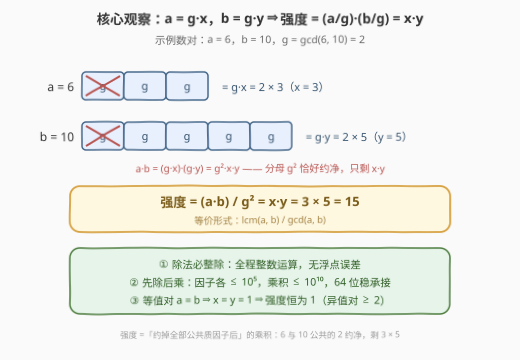
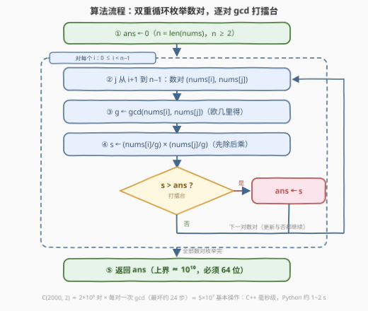

# 数对的最大强度

- **题目名称**：数对的最大强度
- **链接**：[4010. 数对的最大强度](https://leetcode.cn/problems/maximize-pair-strength-using-gcd/)
- **难度**：简单
- **标签**：数组、数学、枚举、数论

## 1. 题目概述

给你一个整数数组 `nums`。选择**恰好一对**不同下标 $i$ 和 $j$（$i \ne j$，但允许 $\text{nums}[i] = \text{nums}[j]$）。该数对的**强度**定义为：

$$\frac{\text{nums}[i] \times \text{nums}[j]}{\gcd(\text{nums}[i],\ \text{nums}[j])^2}$$

返回所有可能数对中的**最大**强度。其中 $\gcd(a, b)$ 表示 $a$ 和 $b$ 的**最大公约数**。

**示例 1**：

```text
输入：nums = [2,3,5]
输出：15
解释：选 i=1, j=2：(3 × 5) / gcd(3,5)² = 15 / 1 = 15，为所有数对中的最大值。
```

**示例 2**：

```text
输入：nums = [4,6,8]
输出：12
解释：选 i=1, j=2：(6 × 8) / gcd(6,8)² = 48 / 4 = 12，为所有数对中的最大值。
```

**示例 3**：

```text
输入：nums = [3,3]
输出：1
解释：选 i=0, j=1：(3 × 3) / gcd(3,3)² = 9 / 9 = 1，唯一数对。
```

**约束条件**：

- $2 \le \text{nums.length} \le 2000$
- $1 \le \text{nums[i]} \le 10^5$

> 💡 **审题关键**：①「不同**下标**」允许取值相等——等值对合法，但其强度恒为 1；② 分数形式只是记号，强度**必为正整数**（分母必然约净），全程可用整数运算；③ $n \le 2000$ ⇒ 数对至多 $\binom{2000}{2} \approx 2 \times 10^6$ 个，**暴力枚举即正解**（官方 hint 也明示 "Try every pair"）；④ 唯一的实现陷阱：$a \cdot b$ 可达 $10^{10}$，32 位乘法当场溢出。

---

## 2. 解题思路

### 2.1 暴力思路：枚举所有数对——它本身就是正解

数据规模替我们做好了决定：$n \le 2000$ ⇒ 数对至多 $\binom{2000}{2} = 1{,}999{,}000 \approx 2 \times 10^6$ 个，每个数对算一次 gcd（欧几里得算法单次最坏约 24 步），总计 $5 \times 10^7$ 量级的基本操作——**不需要任何剪枝或预处理，双重循环就是预期解法**。

于是真正的问题只剩一个：给定一对 $(a, b)$，如何把强度**算得又对又稳**？按定义直接写 $(a \cdot b) / (g \cdot g)$ 有两个坑：

- **溢出**：$a \cdot b$ 与 $g^2$ 都能到 $10^{10}$，远超 32 位 `int` 上限 $\approx 2.1 \times 10^9$；
- **除法语义**：会不会除不尽？要不要转浮点？——实际上永远除得尽（见下），引入浮点纯属自找精度麻烦。

### 2.2 核心观察：提取 g 之后，强度 = (a/g)·(b/g)



设 $g = \gcd(a, b)$，把公因子拎出来，写 $a = g \cdot x$、$b = g \cdot y$（此时 $\gcd(x, y) = 1$）。代入定义：

$$\text{强度} = \frac{a \cdot b}{g^2} = \frac{(g \cdot x)(g \cdot y)}{g^2} = x \cdot y = \frac{a}{g} \cdot \frac{b}{g}$$

**推论一（整除性）**：$a \cdot b = g^2 \cdot x \cdot y$，分母 $g^2$ 必然约净——强度恒为正整数，**全程整数运算，零浮点误差**。

**推论二（实现姿势）**：先除后乘 $(a/g) \cdot (b/g)$——两个因子各自 $\le 10^5$，乘积 $\le 10^{10}$，64 位整数稳稳承接；比「先乘 $a \cdot b$ 再除」的中间量更小，是值域更紧时依然安全的通用写法。

**推论三（等值对恒为 1，异值对 ≥ 2）**：$a = b$ 时 $g = a$，$x = y = 1$，强度恒为 1；$a \ne b$ 时 $x \ne y$ 且均为正整数，乘积 $\ge 2$。⇒ 只要数组里存在两个不同的值，**最优解必出自异值对**（$\ge 2 > 1$）；全数组同一个值时答案恰为 1。这是第 5 节去重优化的依据。

**推论四（等价形式）**：$x \cdot y = \dfrac{\text{lcm}(a,b)}{\gcd(a,b)}$——公因子 $g$ 在分子分母「上下各约一次」，强度衡量的正是**约掉全部公共质因子之后**的乘积。

验证示例 2：$a=6,\ b=10$（若在 $[4,6,8]$ 中另取 $6,8$ 同理）：$g=2$，$x=3,\ y=5$，强度 $= 15$。而 $[4,6,8]$ 的最优对 $(6,8)$：$g=2$，$3 \times 4 = 12$ ✓。

> 💡 **一句话总结**：把 $a, b$ 各拆成「公因子 $g$ × 剩余部分」，强度就是剩余部分的乘积 $x \cdot y$——除法必整除、先除后乘不溢出、等值对恒为 1；剩下的就是诚实的 $O(n^2 \log V)$ 枚举。

### 2.3 算法流程图



| 步骤 | 操作 | 说明 |
|------|------|------|
| ① | `ans ← 0` | $n \ge 2$ 保证至少一对、强度 $\ge 1$，无需哨兵初值 |
| ② | 双重循环枚举 $i < j$ | 至多 $\binom{2000}{2} \approx 2 \times 10^6$ 对 |
| ③ | $g \leftarrow \gcd(\text{nums}[i],\ \text{nums}[j])$ | 欧几里得，单次最坏约 24 步（值域内最坏是相邻斐波那契数） |
| ④ | $s \leftarrow (\text{nums}[i]/g) \times (\text{nums}[j]/g)$ | 先除后乘，全程整数、64 位 |
| ⑤ | 若 $s > \text{ans}$ 则更新 | 打擂台 |
| ⑥ | 返回 `ans` | 上界 $\approx 10^{10}$：C++ 用 `long long`，Python 无忧 |

### 2.4 示例演算

**示例 2**：`nums = [4,6,8]`，三个数对逐一代入 $(a/g) \cdot (b/g)$：

| 数对 $(a, b)$ | $g=\gcd(a,b)$ | $a/g$ | $b/g$ | 强度 $x \cdot y$ |
|--------------|---------------|-------|-------|------------------|
| (4, 6) | 2 | 2 | 3 | 6 |
| (4, 8) | 4 | 1 | 2 | 2 |
| (6, 8) | 2 | 3 | 4 | **12** ★ |

答案为 $\mathbf{12}$——注意最优对 $(6, 8)$ 恰好不含最大值 $8$ 单独与最小值 $4$ 的组合，也不含全局最大值两两组合 $(4,8)$：**「贪心地只看最大/最小元素」没有任何依据，必须老实枚举**。

**示例 1**：`nums = [2,3,5]` 两两互质（$g=1$），强度退化为普通乘积：$2 \times 3 = 6$、$2 \times 5 = 10$、$3 \times 5 = 15$，答案 $\mathbf{15}$。

**示例 3**：`nums = [3,3]` 是等值对：$g = 3$，$x = y = 1$，强度 $\mathbf{1}$——正数数组的强度下界。

---

## 3. 参考代码

### C++

```cpp
class Solution {
  public:
    long long maxPairStrength(vector<int>& nums) {
        int n = nums.size();
        long long ans = 0;                                  // ①
        for (int i = 0; i < n; ++i)
            for (int j = i + 1; j < n; ++j) {               // ② 枚举数对
                long long g = std::gcd(nums[i], nums[j]);   // ③
                ans = max(ans, (nums[i] / g) * (nums[j] / g));  // ④ 先除后乘
            }
        return ans;                                         // ⑥
    }
};
```

> 💡 **写法要点**：
> - `std::gcd` 来自 `<numeric>`（C++17），也可用 GNU 的 `__gcd`；
> - **`g` 声明为 `long long` 不只是为了承接 gcd 结果**——它让 `nums[i] / g` 的类型整体提升为 64 位，后面的乘法在 `long long` 上进行。若 `g` 用 `int`，`(a/g) * (b/g)` 是 `int × int`，**在赋值给 `long long` 之前就已按 32 位溢出（UB）**：例如两个互质的 $99989 \times 99991 \approx 10^{10}$；
> - `ans` 初始化 0 即可：$n \ge 2$ 保证至少一对、强度 $\ge 1$，首个数对必然更新它。

### Python

```python
from math import gcd

class Solution:
    def maxPairStrength(self, nums: List[int]) -> int:
        n = len(nums)
        ans = 0                                        # ①
        for i in range(n):
            a = nums[i]
            for j in range(i + 1, n):                  # ② 枚举数对
                b = nums[j]
                g = gcd(a, b)                          # ③ C 实现的欧几里得
                s = (a // g) * (b // g)                # ④ 先除后乘
                if s > ans:                            # ⑤ 打擂台
                    ans = s
        return ans                                     # ⑥
```

> 💡 **写法要点**：
> - `math.gcd` 是 C 实现，单次调用约百纳秒；$2 \times 10^6$ 对的纯 Python 循环实测约 1~2 s，足够通过（本题 hint 预期的就是暴力）；
> - 把 `nums[i]` 提为局部变量 `a`、用 `if` 展开打擂台，都是省常数的写法；重复值很多时可用第 5 节的去重版进一步提速；
> - Python 整数无溢出，`//` 对正数即整除，天然安全。

---

## 4. 复杂度分析

| 维度 | 复杂度 | 说明 |
|------|--------|------|
| 时间 | $O(n^2 \log V)$ | $\binom{2000}{2} \approx 2 \times 10^6$ 对 × 每对一次欧几里得（值域 $V = 10^5$ 内最坏约 24 步、平均约 10 步）≈ $5 \times 10^7$ 基本操作：C++ 毫秒级、Python 约 1~2 s |
| 空间 | $O(1)$ | 仅若干标量，无额外数据结构 |
| 结果规模 | $\le 10^{10}$ | $(a/g) \cdot (b/g) \le 10^5 \times 10^5$（$g=1$ 时取到），必须 64 位：C++ `long long`，Python 原生整数 |

---

## 5. 扩展：去重优化与变体

**去重版（重复值多时提速）**：由推论三——等值对强度恒为 1、任何异值对强度 $\ge 2$——可先对**值**去重，只枚举不同值组成的数对；全部相等时特判返回 1。设不同值个数 $D$，复杂度从 $O(n^2 \log V)$ 降为 $O(D^2 \log V)$：

```python
from math import gcd
from itertools import combinations

class Solution:
    def maxPairStrength(self, nums: List[int]) -> int:
        vals = sorted(set(nums))
        if len(vals) == 1:              # 全相等：等值对强度恒为 1
            return 1
        def strength(a: int, b: int) -> int:
            g = gcd(a, b)
            return (a // g) * (b // g)
        return max(strength(a, b) for a, b in combinations(vals, 2))
```

**变体一（输出最优数对下标）**：打擂台更新 `ans` 时同步记录 $(i, j)$ 即可，复杂度不变。

**变体二（求所有数对强度之和）**：逐对统计的 $O(n^2)$ 在 $n$ 大时失效，可换「按公因子批量记账」：把 $1/g^2$ 用狄利克雷卷积展开为 $\sum_{d \mid g} c(d)$（$c$ 可筛表预处理），则 $\sum_{i<j} \text{强度} = \sum_d c(d) \cdot \frac{(\sum_{d \mid a_i} a_i)^2 - \sum_{d \mid a_i} a_i^2}{2}$，对每个 $d$ 枚举倍数求和，值域 $V$ 时 $O(V \log V)$ 级——数论题里「枚举 gcd + 容斥」的标准套路。

---

## 6. 面试要点

**Q1：$(a \cdot b) / g^2$ 为什么一定是整数？可以用浮点除法吗？**

> 设 $g = \gcd(a,b)$，则 $a = g \cdot x$、$b = g \cdot y$，$a \cdot b = g^2 \cdot x \cdot y$ 被 $g^2$ 整除——分母必然约净，强度恒为正整数。浮点除法在 $10^{10}$ 量级虽大多能精确表示（`double` 有 53 位尾数），但完全没必要引入精度心智负担，整数除法零误差且更快。

**Q2：本题的溢出点在哪里？怎么防？**

> 三处 $10^{10}$ 量级的量：$a \cdot b$（$g=1$ 时）、$g^2$（等值对 $g$ 最大 $10^5$）、$(a/g) \cdot (b/g)$（两互质大数）。32 位 `int` 上限 $2.1 \times 10^9$ 全部击穿。防法：C++ 全程 `long long`；最稳的写法是「先除后乘」$(a/g) \cdot (b/g)$——因子各 $\le 10^5$，中间量最小。一个隐蔽坑：若 `g` 声明为 `int`，即使 `ans` 是 `long long`，`(a/g)*(b/g)` 仍按 `int` 相乘当场溢出——把 `g` 声明为 64 位，除法结果随之类型提升，一举两得。

**Q3：等值对为什么可以整类跳过？什么时候不能跳？**

> $a = b \Rightarrow g = a \Rightarrow x = y = 1 \Rightarrow$ 强度恒为 1；而任何异值对 $x \ne y$、均为正整数，强度 $\ge 2$。所以只要数组存在两个不同值，最优解 $\ge 2 > 1$，等值对（哪怕成千上万对）可全部无视；仅当**全部元素相同**时答案才是 1，特判返回即可。

**Q4：$O(n^2 \log V)$ 具体多大？Python 会不会超时？**

> $\binom{2000}{2} \approx 2 \times 10^6$ 对；欧几里得在 $V = 10^5$ 内最坏约 24 步（最坏情形是相邻斐波那契数，$F_{25} = 75025$），随机数对平均约 10 步。总计 $\sim 5 \times 10^7$ 基本操作：C++ 毫秒级；Python 循环开销为主但 `math.gcd` 是 C 实现，实测约 1~2 s，在题目限时内——这正是官方 hint 明示暴力的原因。

**Q5：强度还有哪些等价形式？什么信号提示往这条化简上想？**

> $x \cdot y = (a/g) \cdot (b/g) = \text{lcm}(a,b) / \gcd(a,b)$。信号是「**gcd 的幂出现在分母**」或「乘积除以 gcd 的组合」——把 $a, b$ 按 $g$ 拆开写成 $g \cdot x$、$g \cdot y$，分数立刻坍缩成整式；这一拆同时也是证明整除性、估计值域上界的统一抓手。

---

## 7. 同类练习题

- [1979. 找出数组的最大公约数](https://leetcode.cn/problems/find-greatest-common-divisor-of-array/)：欧几里得入门——最小值与最大值的 gcd
- [1071. 字符串的最大公因子](https://leetcode.cn/problems/greatest-common-divisor-of-strings/)：gcd 从数推广到串的周期结构
- [2447. 最大公因数等于 K 的子数组数目](https://leetcode.cn/problems/number-of-subarrays-with-gcd-equal-to-k/)：gcd 沿子数组向左扩展时「只减不增」的性质 + 枚举右端点
- [914. 卡牌分组](https://leetcode.cn/problems/x-of-a-kind-in-a-deck-of-cards/)：所有频次的 gcd 决定能否整组等分
- [2197. 替换数组中的非互质数](https://leetcode.cn/problems/replace-non-coprime-numbers-in-array/)：栈中相邻两数 $\gcd > 1$ 时反复合并至两两互质
