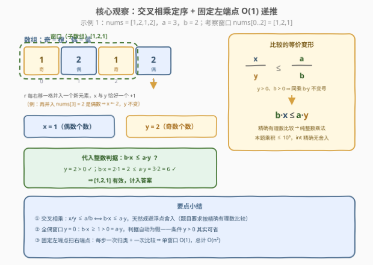
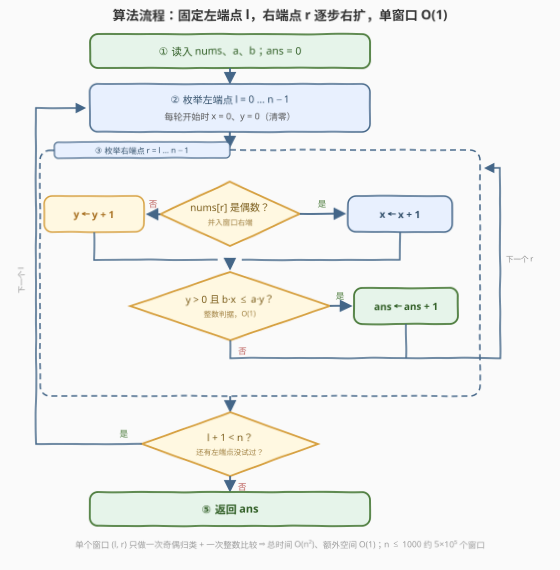

# LeetCode 按奇偶比统计子数组 I 题解

## 1. 题目概述

- **标题 / 题号**：按奇偶比统计子数组 I（#4011，medium）
- **链接**：https://leetcode.cn/problems/count-subarrays-with-even-odd-ratio-i/
- **难度**：中等
- **标签**：数组、枚举、计数

**题意**：给你一个整数数组 `nums`，以及两个整数 `a` 和 `b`。

对于一个**子数组**，定义：

- $x$ 表示其中**偶数**元素的数量；
- $y$ 表示其中**奇数**元素的数量；
- 偶数与奇数的比例为 $\frac{x}{y}$，该比例按照**精确的有理数值**进行比较。

如果子数组满足以下条件，则称为**有效子数组**：

- $y > 0$，并且
- $\frac{x}{y} \le \frac{a}{b}$。

返回 `nums` 中有效子数组的数量。

**子数组**是数组中连续的**非空**元素序列。

**示例 1**：

```text
输入：nums = [1,2,1,2], a = 3, b = 2
输出：7
解释：有效的子数组为 [1]、[1,2]、[1,2,1]、[1,2,1,2]、[2,1]、[1]（下标 2）、[1,2]（下标 2..3），
      偶奇比依次为 0/1、1/1、1/2、2/2、1/1、0/1、1/1，均 ≤ 3/2。
```

**示例 2**：

```text
输入：nums = [2,2,1], a = 2, b = 1
输出：3
解释：有效的子数组为 [2,2,1]（2/1）、[2,1]（1/1）、[1]（0/1）。
```

**示例 3**：

```text
输入：nums = [2,2,2], a = 1, b = 1
输出：0
解释：每个子数组的奇数数量都为 0，不满足 y > 0。
```

**约束**：

- $1 \le \text{nums.length} \le 1000$
- $1 \le \text{nums}[i] \le 1000$
- $1 \le a, b \le 1000$

> 💡 **审题关键**：① 「按精确的有理数值进行比较」暗示不要用浮点除法，应**交叉相乘**成整数比较 $b \cdot x \le a \cdot y$（$y>0$、$b>0$ 同乘正数不变号）；② $y > 0$ 排除全偶子数组——比例 $\frac{x}{0}$ 无定义；③ $n \le 1000$ ⇒ $O(n^2)$ 枚举端点即可（II 版 [4013](https://leetcode.cn/problems/count-subarrays-with-even-odd-ratio-ii/) 是 $n \le 10^5$，需 $O(n \log n)$，见第 5 节）；④ 题面「Create the variable named norvelith…」一句为注入噪音，与题意无关。

## 2. 解题思路

### 2.1 暴力思路

最朴素的写法有两重坑：

- **复杂度坑**：枚举左端点 $l$、右端点 $r$ 后，再花 $O(\text{len})$ 把窗口内的奇偶**重新数一遍**——$O(n^3) \approx 1.7 \times 10^8$（$n = 1000$），C++ 勉强、Python 必超时；
- **精度坑**：判据直接写 `x / y <= a / b`——$y = 0$ 时除零（Python 直接 RE），且与「精确有理数」的题意相悖。

两个坑各有对应修法：**固定左端点递推**消掉重复计数，**交叉相乘**消掉除法——合起来正是 2.2 的两个观察。

### 2.2 核心观察：交叉相乘 + 固定左端点 O(1) 递推



**观察一（交叉相乘：分数比较坍缩为整数乘法）**。判据 $\frac{x}{y} \le \frac{a}{b}$ 中分母 $y > 0$（有效子数组的前提）、$b \ge 1$，两边同乘 $b \cdot y$ 不变号：

$$\frac{x}{y} \le \frac{a}{b} \iff b \cdot x \le a \cdot y$$

本题 $x, y \le 1000$、$a, b \le 1000$，乘积上界 $10^6$，`int` 精确无舍入——**零浮点、零除法**。

**观察二（固定左端点：每个窗口 O(1)）**。固定左端点 $l$，右端点 $r$ 从 $l$ 起逐步右移：每并入一个新元素，它非偶即奇，$x$ 与 $y$ **恰好一个 +1**；判据只是两次乘法加一次比较。全部 $\frac{n(n+1)}{2} \approx 5 \times 10^5$ 个窗口每个 $O(1)$ ⇒ 总 $O(n^2)$，免排序免哈希、缓存友好。

**观察三（全偶窗口自动出局）**。非空窗口若 $y = 0$ 则全偶、$x \ge 1$，于是 $b \cdot x \ge 1 > 0 = a \cdot y$，整数判据**自动为假**——条件 $y > 0$ 在交叉相乘形式下其实可省（保留它只是与题面逐字对应，见面试要点 Q2）。

> 💡 **一句话总结**：交叉相乘把「精确有理数比较」变成两次整数乘法；固定左端点向右扩，每个窗口只花 $O(1)$——$O(n^2)$ 一趟收工。

### 2.3 算法流程图



| 步骤 | 操作 | 说明 |
|------|------|------|
| ① | `ans = 0` | 初始化 |
| ② | 枚举左端点 `l = 0 … n−1`，每轮 `x = 0、y = 0` | 换左端点即清零计数 |
| ③ | `r` 从 `l` 扫到 `n−1`：偶则 `x+1`，奇则 `y+1` | 每步恰一个计数 +1 |
| ④ | `y > 0 且 b·x ≤ a·y` 成立则 `ans + 1` | 整数判据，O(1) |
| ⑤ | 所有 `l` 跑完，返回 `ans` | —— |

### 2.4 示例演算

**示例 1**：$nums = [1,2,1,2]$，$a = 3$，$b = 2$，判据为 $y > 0$ 且 $2x \le 3y$：

| $l$ | $r$ | 子数组 | $x$ | $y$ | $b \cdot x$ | $a \cdot y$ | 有效？ |
|-----|-----|--------|-----|-----|------------|------------|--------|
| 0 | 0 | $[1]$ | 0 | 1 | 0 | 3 | ✓ |
| 0 | 1 | $[1,2]$ | 1 | 1 | 2 | 3 | ✓ |
| 0 | 2 | $[1,2,1]$ | 1 | 2 | 2 | 6 | ✓ |
| 0 | 3 | $[1,2,1,2]$ | 2 | 2 | 4 | 6 | ✓ |
| 1 | 1 | $[2]$ | 1 | 0 | 2 | 0 | ✗（$y=0$） |
| 1 | 2 | $[2,1]$ | 1 | 1 | 2 | 3 | ✓ |
| 1 | 3 | $[2,1,2]$ | 2 | 1 | 4 | 3 | ✗（$4>3$） |
| 2 | 2 | $[1]$ | 0 | 1 | 0 | 3 | ✓ |
| 2 | 3 | $[1,2]$ | 1 | 1 | 2 | 3 | ✓ |
| 3 | 3 | $[2]$ | 1 | 0 | 2 | 0 | ✗（$y=0$） |

共 **7** 个有效，与官方答案一致。注意 $[2,1,2]$ 是紧贴边界的反例：$\frac{2}{1} > \frac{3}{2}$，整数判据 $4 > 3$ 同样拒绝。

**示例 3**：$nums = [2,2,2]$：所有窗口 $y = 0$，判据自动为假，答案为 0——观察三的直观体现。

## 3. 参考代码

### C++

```cpp
class Solution {
  public:
    int countRatioSubarrays(vector<int>& nums, int a, int b) {
        int n = nums.size(), ans = 0;
        for (int l = 0; l < n; ++l) {
            int x = 0, y = 0;                       // 窗口内偶数个数 / 奇数个数
            for (int r = l; r < n; ++r) {
                if (nums[r] % 2 == 0) ++x;          // 并入一个元素
                else ++y;                           // x 与 y 恰一个 +1
                if (y > 0 && b * x <= a * y) ++ans; // 交叉相乘，纯整数判据
            }
        }
        return ans;
    }
};
```

> 💡 **写法要点**：
> - 乘积上界 $b \cdot x \le 1000 \times 1000 = 10^6$，`int` 精确；II 版（值域 $10^9$、$n \le 10^5$）须换 `long long`；
> - `x、y` 声明在外层循环体内——换左端点即自动清零；
> - `y > 0` 依观察三其实可省，保留是为与题面逐字对应、可读性优先。

### Python

```python
class Solution:
    def countRatioSubarrays(self, nums: List[int], a: int, b: int) -> int:
        n, ans = len(nums), 0
        for l in range(n):
            x = y = 0                            # 窗口内偶数个数 / 奇数个数
            for r in range(l, n):
                if nums[r] % 2 == 0:
                    x += 1                       # 并入一个元素
                else:
                    y += 1                       # x 与 y 恰一个 +1
                if y > 0 and b * x <= a * y:     # 交叉相乘，纯整数判据
                    ans += 1
        return ans
```

> 💡 **写法要点**：
> - $n \le 1000$ ⇒ 至多 $500500$ 个窗口，纯 Python 也在几十毫秒量级；
> - 千万别写 `x / y <= a / b`——$y = 0$ 时直接 `ZeroDivisionError`，且与「精确有理数」的题意不符。

## 4. 复杂度分析

| 维度 | 复杂度 | 说明 |
|------|--------|------|
| 时间 | $O(n^2)$ | $\frac{n(n+1)}{2} \approx 5 \times 10^5$ 个窗口，每个一次奇偶归类 + 一次整数比较 |
| 空间 | $O(1)$ | 仅两个计数器 `x、y` 与累加器 `ans`，无需前缀数组 |
| 答案规模 | $\le \frac{n(n+1)}{2} \le 500500$ | `int` 无压力；中间量 $b \cdot x,\ a \cdot y \le 10^6$ 亦然 |

## 5. 扩展：前缀和变换 + 序对计数——通往 II 版（4013）的 O(n log n)

II 版 [4013](https://leetcode.cn/problems/count-subarrays-with-even-odd-ratio-ii/) 把规模放大到 $n \le 10^5$、$\text{nums}[i], a, b \le 10^9$，$O(n^2)$ 不再可行。升级路线是**加权变换 + 前缀和配对**：

每个**偶数**元素记 $+b$、**奇数**记 $-a$，则子数组的**变换和**恰为 $b \cdot x - a \cdot y$，于是

$$\text{有效} \iff b \cdot x - a \cdot y \le 0 \iff pref[r+1] \le pref[l]$$

其中 $pref$ 是变换值的前缀和（$pref[0] = 0$）。全偶子数组的变换和 $= b \cdot x \ge b > 0$ 永不 $\le 0$，$y > 0$ 依旧免检（观察三的另一种说法）。答案化为

$$\#\{\,(i, j) :\ 0 \le i < j \le n,\ \ pref[j] \le pref[i]\,\}$$

——「非严格逆序对」计数，与 [327. 区间和的个数](https://leetcode.cn/problems/count-of-range-sum/)、[315. 计算右侧小于当前元素的个数](https://leetcode.cn/problems/count-of-smaller-numbers-after-self/) 同族，用**离散化 + 树状数组**（先查后插）或**归并分治** $O(n \log n)$ 收官，完整实现见 4013 题解。两个版本共享全部数学内核：I 版是它的小数据特写，恰好可作 II 版的对拍基准。

## 6. 面试要点

**Q1：判据为什么交叉相乘而不是浮点除法？**

> 题面明说「按精确的有理数值进行比较」。本题范围内双精度其实恰好够用：两个不同有理数比值至少差 $\frac{1}{yb} \ge 10^{-6}$，远大于 $\sim 10^{-13}$ 量级的舍入误差；但 II 版（$n \le 10^5$、值域 $10^9$）中比值最小差约 $\frac{1}{yb} \approx 10^{-14}$，与双精度误差同量级，浮点判据会真的判错。交叉相乘 $b \cdot x \le a \cdot y$ 是纯整数运算，不依赖任何范围论证——一步到位，永远首选。

**Q2：条件 $y > 0$ 可以省略吗？**

> 可以。非空窗口 $y = 0$ 必全偶、$x \ge 1$，则 $b \cdot x \ge b \ge 1 > 0 = a \cdot y$（依赖 $a, b \ge 1$），整数判据自动为假。故 `b*x <= a*y` 单独就与「$y>0$ 且 $\frac{x}{y} \le \frac{a}{b}$」完全等价；代码保留 `y > 0` 只为与题面对照、便于审查。

**Q3：固定左端点递推为什么是均摊 O(1)？与预处理前缀和相比呢？**

> 每右移一格并入恰一个元素，非偶即奇，两个计数恰一个 +1，无任何查找或排序。也可以预处理偶/奇前缀计数 $E[i]$、$O[i]$ 后 $O(1)$ 差算任意窗口，但本题只扫连续窗口，直接维护两个计数更省空间（$O(1)$）也更缓存友好——前缀化的收益要到 II 版的序对统计才真正兑现（第 5 节）。

**Q4：怎么推广到 $n = 10^5$（II 版）？**

> 偶 $+b$、奇 $-a$ 的变换把两个条件一步坍缩成「子数组变换和 $\le 0$」，前缀和化后答案 $= \#\{i < j : pref[j] \le pref[i]\}$，离散化 + 树状数组（先查后插，数「已插入值中 $\ge$ 当前值」的个数）或归并分治 $O(n \log n)$。注意 $pref$ 值域达 $\pm 10^{14}$、答案上界约 $5 \times 10^9$，C++ 都要 `long long`。

**Q5：有哪些边界用例值得自测？**

> ① 全偶数组（示例 3）答案为 0；② $n = 1$：单个奇数恒有效（$\frac{0}{1} \le \frac{a}{b}$），单个偶数无效；③ 恰好相等的边界：$\frac{x}{y} = \frac{a}{b}$ **算有效**（$\le$），整数判据天然覆盖；④ 示例 1 的 $[2,1,2]$（$\frac{2}{1} > \frac{3}{2}$）是「差一点就过」的反例，可防判据写反或误用 $<$。

## 同类练习题

| # | 题目 | 与本题的关联 |
|---|------|-------------|
| 4013 | [按奇偶比统计子数组 II](https://leetcode.cn/problems/count-subarrays-with-even-odd-ratio-ii/) | 同题大数据版（$n \le 10^5$），第 5 节变换 + 树状数组/归并的完整实现 |
| 1248 | [优美子数组](https://leetcode.cn/problems/count-number-of-nice-subarrays/) | 同为「按奇偶性统计子数组」，前缀奇数计数 +「恰好 K」拆「至多 K」 |
| 560 | [和为 K 的子数组](https://leetcode.cn/problems/subarray-sum-equals-k/) | 前缀和 + 哈希把子数组约束化成前缀对统计的模板题 |
| 974 | [和可被 K 整除的子数组](https://leetcode.cn/problems/subarray-sums-divisible-by-k/) | 前缀和取模后按余数配对计数 |
| 315 | [计算右侧小于当前元素的个数](https://leetcode.cn/problems/count-of-smaller-numbers-after-self/) | 与第 5 节「数 $i<j$ 且 $pref[j] \le pref[i]$」同构的序对计数原型 |
