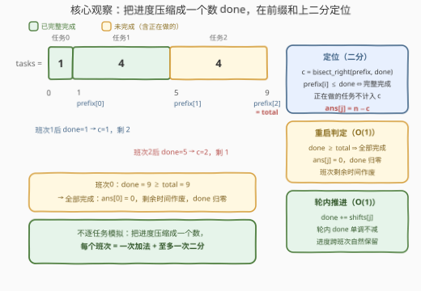
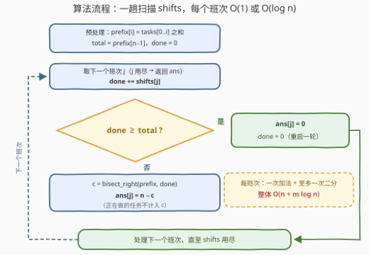

# LeetCode 统计每个班次结束后的未完成任务数 题解

## 1. 题目概述

- **标题 / 题号**：统计每个班次结束后的未完成任务数（#4012，medium）
- **链接**：https://leetcode.cn/problems/count-of-unfinished-tasks-after-each-shift/
- **难度**：中等
- **标签**：数组、二分查找、前缀和

**题意**：给你两个整数数组 `tasks` 和 `shifts`：

- `tasks[i]` 表示完成第 $i$ 个任务所需的时间；
- `shifts[j]` 表示第 $j$ 个班次可用的时间。

任务**必须按从左到右的顺序**处理，班次依次进行，规则如下：

- **延续处理**：如果一个任务在当前班次内没有完成，下一个班次会从该任务的**相同进度位置**继续处理；
- **重新开始**：如果某个班次内完成了**所有**任务，该班次立即结束，**剩余时间被丢弃**，下一个班次重新从第 0 个任务开始。

如果一个任务尚未被完全完成，则认为该任务是**未完成**的——**这包括当前正在执行中的任务**。返回整数数组 `ans`，其中 `ans[j]` 表示第 $j$ 个班次结束后剩余的未完成任务数量。

**示例 1**：

```text
输入：tasks = [1,4,4], shifts = [9,1,4]
输出：[0,2,1]
解释：
班次 0：全部任务共需 1+4+4 = 9 单位时间，恰好全部完成，未完成任务数为 0。
班次 1：重新从任务 0 开始。该班次有 1 单位时间，任务 0 完成，未完成任务数为 2。
班次 2：从任务 1 的当前位置继续。该班次有 4 单位时间，任务 1 完成，未完成任务数为 1。
```

**示例 2**：

```text
输入：tasks = [2,3,4], shifts = [20,4,5]
输出：[0,2,0]
解释：
班次 0：全部任务共需 9 单位时间，全部完成，剩余 11 单位时间被忽略。
班次 1：从任务 0 重新开始。4 单位时间完成任务 0，任务 1 完成一部分，未完成为 2。
班次 2：从任务 1 继续。剩余所需 1+4 = 5 单位，恰好全部完成，未完成为 0。
```

**示例 3**：

```text
输入：tasks = [4,2], shifts = [3,6,1]
输出：[2,0,2]
解释：
班次 0：3 单位时间只把任务 0 做了 3/4，未完成为 2。
班次 1：继续任务 0，剩余 1+2 = 3 单位恰好全部完成，未完成为 0。
班次 2：从任务 0 重新开始，1 单位时间只完成 1/4，未完成为 2。
```

**约束**：

- $1 \le \text{tasks.length} \le 10^5$
- $1 \le \text{shifts.length} \le 10^5$
- $1 \le \text{tasks[i]} \le 10^9$
- $1 \le \text{shifts[i]} \le 10^9$

> 💡 **审题关键**：①「未完成 = 没有完全做完」，**正在执行中的任务也算未完成**——只有当累计工作量恰好达到某个前缀和边界时，该任务才算完成；② 班次内全部完成时**剩余时间作废**：不结转、也不提前开始下一轮；③ 两个数组长度都达 $10^5$、元素达 $10^9$，总工作量 $\le 10^{14}$，C++ 必须用 64 位整数。

## 2. 解题思路

### 2.1 暴力思路

最直接的模拟：维护「当前做到第 $i$ 个任务、该任务剩余量 $\text{rem}[i]$」，每个班次从当前进度向右逐任务推进——任务做完就 $i{+}{+}$，时间耗尽就停下；若 $i$ 走到 $n$，则 $\text{ans}[j] = 0$ 并把进度重置到任务 0。

单轮推进没问题，问题在总量：**每个班次都可能完整扫过全部 $n$ 个任务**。例如所有 $\text{shifts}[j]$ 都不小于 $\text{total}$ 时，$m$ 个班次各走 $O(n)$ 步，总计 $O(n \cdot m) \approx 10^{10}$，必然超时。瓶颈在于：**逐任务推进把「进度」摊开在指针上，回答一个班次要付 $O(n)$ 的步行费**——而每个班次的答案其实只由「本轮累计做了多少工作量」这一个数决定。

### 2.2 核心观察：进度压缩成一个数，在前缀和上二分



**观察一（轮内状态由一个数唯一决定）**：任务严格从左到右处理、未完成任务的进度跨班次延续，因此从上一次重启起，已完成的工作量在时间轴上是一段连续区间 $[0, \text{done}]$——已做完任务的全部耗时，加上正在做的任务的部分耗时。指针 $(i, \text{rem}[i])$ 是它的冗余展开：**知道 `done` 就知道一切**。

**观察二（已完成任务数 = 前缀和上二分）**：完成前 $c$ 个任务恰好需要 $\text{prefix}[c-1]$ 的时间，其中 $\text{prefix}$ 是 `tasks` 的前缀和。于是已完整完成的任务数为

$$c = \#\{\,i : \text{prefix}[i] \le \text{done}\,\} = \text{bisect\_right}(\text{prefix},\ \text{done})$$

恰好卡在边界（$\text{done} = \text{prefix}[i]$）的任务 $i$ **已完整完成**，计入 $c$；正在进行的任务满足 $\text{prefix}[i] > \text{done}$，不计入——**这正是「正在做的也算未完成」的体现**。答案即 $\text{ans}[j] = n - c$。

**观察三（重启判定 $O(1)$）**：$\text{done} \ge \text{total}$（$\text{total} = \text{prefix}[n-1]$）当且仅当所有任务完成，此时 $\text{ans}[j] = 0$，班次剩余时间按题意作废，`done` 归零、下一班次从任务 0 重启。

> 💡 **一句话总结**：不逐任务走——把进度压缩成一个数 `done`，每个班次只做**一次加法 + 至多一次二分**。

### 2.3 算法流程图



| 步骤 | 操作 | 说明 |
|------|------|------|
| ① | 建前缀和 `prefix`，`total = prefix[n-1]`，`done = 0` | $O(n)$ 预处理 |
| ② | 对每个班次 $j$：`done += shifts[j]` | 累计本轮工作量 |
| ③ | 若 `done >= total`：`ans[j] = 0`，`done = 0` | 全部完成，剩余时间作废 |
| ④ | 否则 `c = bisect_right(prefix, done)`，`ans[j] = n - c` | $O(\log n)$ 二分定位 |
| ⑤ | 扫描结束返回 `ans` | —— |

### 2.4 示例演算

**示例 1**：`tasks = [1,4,4]` → `prefix = [1,5,9]`，`total = 9`，`n = 3`：

| 班次 $j$ | shifts[j] | done（更新后） | 判定 | $c$ = bisect_right(prefix, done) | ans[j] |
|---------|-----------|---------------|------|----------------------------------|--------|
| 0 | 9 | 9 | $9 \ge 9$ → 全部完成 | —（不二分） | **0**，done 归零 |
| 1 | 1 | 1 | $1 < 9$ | prefix ≤ 1 的有 $\{1\}$ → $c=1$ | $3-1=$ **2** |
| 2 | 4 | $1+4=5$ | $5 < 9$ | prefix ≤ 5 的有 $\{1,5\}$ → $c=2$ | $3-2=$ **1** |

**示例 3**（体会「正在做的任务算未完成」）：`tasks = [4,2]` → `prefix = [4,6]`，`total = 6`：

- 班次 0：done $= 3 < 6$，prefix ≤ 3 的没有 → $c = 0$，ans $= 2$（任务 0 做了一半也算未完成）；
- 班次 1：done $= 3+6 = 9 \ge 6$ → ans $= 0$，done 归零（班次富余的 3 单位时间作废）；
- 班次 2：done $= 1 < 6$，$c = 0$ → ans $= 2$。输出 $[2,0,2]$ ✓。

## 3. 参考代码

### C++

```cpp
class Solution {
  public:
    vector<int> countTasks(vector<int>& tasks, vector<int>& shifts) {
        int n = tasks.size(), m = shifts.size();
        vector<long long> prefix(n);                     // ① 前缀和
        prefix[0] = tasks[0];
        for (int i = 1; i < n; ++i) prefix[i] = prefix[i - 1] + tasks[i];
        long long total = prefix[n - 1];

        vector<int> ans;
        ans.reserve(m);
        long long done = 0;                              // 本轮累计工作量
        for (int s : shifts) {                           // ②
            done += s;
            if (done >= total) {                         // ③ 全部完成：剩余时间作废
                ans.push_back(0);
                done = 0;                                //    重启一轮
            } else {                                     // ④ 二分定位
                int c = upper_bound(prefix.begin(), prefix.end(), done) - prefix.begin();
                ans.push_back(n - c);
            }
        }
        return ans;                                      // ⑤
    }
};
```

> 💡 **写法要点**：
> - `prefix`、`total`、`done` 一律 `long long`：$\text{total} \le 10^5 \times 10^9 = 10^{14}$，`int` 必溢出；
> - `upper_bound` 的语义与 `bisect_right` 一致——返回**第一个大于 done** 的位置，恰为满足 $\text{prefix}[i] \le \text{done}$ 的元素个数 $c$；
> - 归零分支用 `done = 0` 而非 `done -= total`：班次富余时间按题意作废，不结转。

### Python

```python
from bisect import bisect_right
from itertools import accumulate

class Solution:
    def countTasks(self, tasks: List[int], shifts: List[int]) -> List[int]:
        n = len(tasks)
        prefix = list(accumulate(tasks))          # ① 前缀和
        total = prefix[-1]

        ans = []
        done = 0                                  # 本轮累计工作量
        for s in shifts:                          # ②
            done += s
            if done >= total:                     # ③ 全部完成：剩余时间作废
                ans.append(0)
                done = 0                          #    重启一轮
            else:                                 # ④ 二分定位
                c = bisect_right(prefix, done)
                ans.append(n - c)
        return ans                                # ⑤
```

> 💡 **写法要点**：
> - `accumulate` 默认不带初值 0，`prefix[i]` 恰为完成前 $i+1$ 个任务的耗时，与二分语义严格对齐；
> - Python 大整数无溢出之忧，唯一要操心的是分支结构：**先判 `done >= total`、再二分**，让「重启归零」与「二分定位」两条路径互斥清晰，还省掉重启班次的二分开销。

## 4. 复杂度分析

| 维度 | 复杂度 | 说明 |
|------|--------|------|
| 时间 | $O(n + m \log n)$ | 前缀和 $O(n)$；每个班次一次加法 $O(1)$ + 至多一次二分 $O(\log n)$ |
| 空间 | $O(n)$（不计返回值） | 前缀和数组；`done`、`total` 为标量 |
| 数值范围 | $\text{total} \le 10^{14}$ | $10^5 \times 10^9$，C++ 需 64 位整数；Python 天然无溢出 |

$n = m = 10^5$ 时总计约 $10^5 \times 17 \approx 1.7 \times 10^6$ 次基本操作，量级上远低于时限。

## 5. 扩展：均摊指针的陷阱与在线变体

**为什么不用「单调指针」代替二分？** 轮内 `done` 单调不减，指向「下一个待做任务」的指针确实只前进，看似可均摊到 $O(n + m)$。但**重启把指针打回 0**：取 `tasks` 全为 1（$\text{total} = n$）、`shifts` 全为 $n/2$，则每两个班次走完一轮、每轮指针前进 $O(n)$ 步，共 $O(m)$ 轮，总计 $O(n \cdot m) \approx 5 \times 10^9$——重启破坏了均摊条件。二分的代价与指针位置无关，每个班次**稳定** $O(\log n)$，这正是放弃均摊、选择二分的理由。

**变体（在线查询）**：若问题改为「任意时刻给出任意 `done`，询问未完成任务数」，前缀和 + 二分天然支持在线回答。模拟的指针是**过程性**状态（只能一步步走），前缀和的定位是**随机访问性**状态（一次二分直达）——这是本题解法与模拟的本质分野。

**变体（剩余时间结转）**：若规则改为「班次内完成所有任务后，剩余时间继续用于下一轮」，则重启时不归零而扣减：$k = \lfloor \text{done} / \text{total} \rfloor$，`done -= k * total`（中间虚拟走完的每一轮答案都为 0）。注意必须用除法一次扣完——若写成 `while done >= total: done -= total` 循环扣减，在 `total = 1`、`shifts[j] = 10^9` 时要扣 $10^9$ 次。

## 6. 面试要点

**Q1：为什么一轮（两次重启之间）的完整状态可以压缩成一个数 `done`？**

> 任务严格按 $0 \to n-1$ 顺序处理，且未完成任务的进度跨班次保留，因此从本轮重启起已完成的工作量在时间轴上是连续的一段 $[0, \text{done}]$：已做完任务的全部耗时 + 正在做任务的部分耗时。指针 $(i, \text{rem}[i])$ 只是这段区间的冗余展开，`done` 才是状态的极小表示。

**Q2：「正在执行中的任务也算未完成」在二分里如何体现？**

> $c = \text{bisect\_right}(\text{prefix}, \text{done})$ 只统计 $\text{prefix}[i] \le \text{done}$ 的任务：正在做的任务满足 $\text{prefix}[i] > \text{done}$（还差一点），不计入 $c$，因此留在 $n - c$ 里。特别地，`done` 恰等于 $\text{prefix}[i]$ 时任务 $i$ **恰好做完**、计入 $c$——边界语义与题意「尚未被完全完成才算未完成」严格一致。

**Q3：重启判定为什么是 `done >= total` 而不是 `>`？剩余时间去哪了？**

> `done == total` 表示恰好在班末完成最后一个任务，同样属于「班次内完成了所有任务」，答案为 0。`done > total` 时富余的 $\text{done} - \text{total}$ 单位按题意**丢弃**——班次一旦做完所有任务立即结束，不提前开工下一轮，所以是归零 `done = 0` 而不是结转 `done -= total`。

**Q4：用均摊单调指针代替二分可行吗？**

> 轮内 `done` 单调不减、指针只前进，看似均摊 $O(n+m)$；但**重启把指针打回起点**，均摊被破坏。构造 `tasks` 全 1、`shifts` 全 $n/2$：每两班次走完一轮、每轮 $O(n)$ 步、共 $O(m)$ 轮，总计 $O(n \cdot m)$。二分与指针位置无关，每班次稳定 $O(\log n)$——「稳定」比「均摊」在这里更值钱。

**Q5：实现上有哪些溢出与边界坑？**

> ① $\text{total} \le 10^{14}$，C++ 前缀和与 `done` 必须 `long long`；② 未重启时 `done` 会累加多个班次，最大 $\text{total} - 1 + 10^9 < 2^{63}$，安全；③ 答案 $\le n \le 10^5$，`int` 足够；④ `tasks` 长度为 1 时 `prefix` 只有一个元素，二分照常工作；⑤ 每个班次都可能触发重启（如 `shifts` 全 ≥ `total`），两个分支必须互斥且完整。

## 同类练习题

| # | 题目 | 与本题的关联 |
|---|------|-------------|
| 1894 | [找到需要补充粉笔的学生编号](https://leetcode.cn/problems/find-the-student-that-will-replace-the-chalk/) | 前缀和 + 二分定位「累计消耗落点」，本题的单轮简化版 |
| 2389 | [和有限的最长子序列](https://leetcode.cn/problems/longest-subsequence-with-limited-sum/) | 排序 + 前缀和 + 对每个询问二分计数，与本题同构 |
| 2055 | [蜡烛之间的盘子](https://leetcode.cn/problems/plates-between-candles/) | 前缀和预处理 + 二分找边界回答区间询问 |
| 2080 | [区间内查询数字的频率](https://leetcode.cn/problems/range-frequency-queries/) | 按值建下标有序表，二分回答区间计数 |
| 303 | [区域和检索 - 数组不可变](https://leetcode.cn/problems/range-sum-query-immutable/) | 前缀和基本功，本题的第一块积木 |
