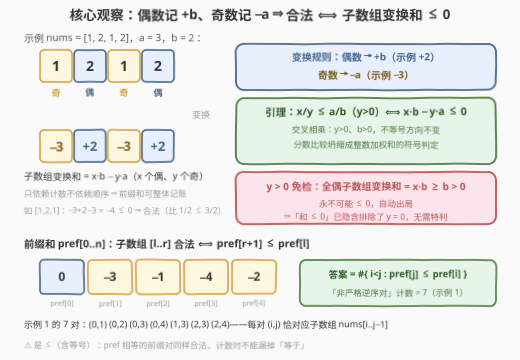
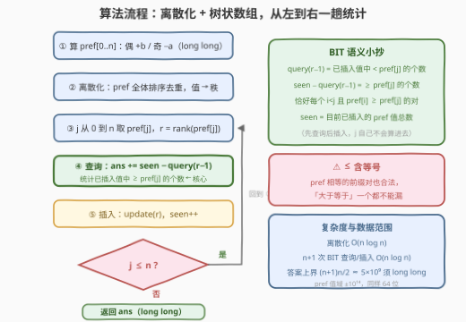

# 按奇偶比统计子数组 II

- **题目名称**：按奇偶比统计子数组 II
- **链接**：[4013. 按奇偶比统计子数组 II](https://leetcode.cn/problems/count-subarrays-with-even-odd-ratio-ii/)
- **难度**：困难
- **标签**：树状数组、前缀和、归并排序、数组

## 1. 题目概述

给你一个整数数组 `nums` 和两个整数 `a`、`b`。对于一个**子数组**，设：

- $x$：其中**偶数**元素的数量；
- $y$：其中**奇数**元素的数量；
- 偶奇比定义为 $\frac{x}{y}$，按**精确有理数值**比较。

子数组是**有效**的，当且仅当：

1. $y > 0$，并且
2. $\frac{x}{y} \le \frac{a}{b}$。

返回有效子数组的数量。

**示例 1**：

```text
输入：nums = [1,2,1,2], a = 3, b = 2
输出：7
解释：有效的子数组为 [1]、[1,2]、[1,2,1]、[1,2,1,2]、[2,1]、[1]（下标 2）、[1,2]（下标 2..3），
      偶奇比依次为 0/1、1/1、1/2、2/2、1/1、0/1、1/1，均 ≤ 3/2。
```

**示例 2**：

```text
输入：nums = [2,2,1], a = 2, b = 1
输出：3
解释：有效的子数组为 [2,2,1]（2/1）、[2,1]（1/1）、[1]（0/1）。
```

**示例 3**：

```text
输入：nums = [2,2,2], a = 1, b = 1
输出：0
解释：每个子数组的奇数数量都为 0，不满足 y > 0。
```

**约束条件**：

- $1 \le \text{nums.length} \le 10^5$
- $1 \le \text{nums}[i] \le 10^9$
- $1 \le a, b \le 10^9$

> 💡 **审题关键**：① 「按精确有理数值比较」暗示**不能**用浮点除法（有精度风险），而应**交叉相乘**：$y>0$、$b>0$ 时 $\frac{x}{y} \le \frac{a}{b} \iff x \cdot b - y \cdot a \le 0$——分数比较坍缩为整数的**加权和符号判定**；② 条件 $y>0$ 其实是「免费的」，下面 2.2 会证明它被 $\le 0$ 自动蕴含；③ $n \le 10^5$ 说明 I 版（[4011](https://leetcode.cn/problems/count-subarrays-with-even-odd-ratio-i/)，$n \le 1000$）的 $O(n^2)$ 枚举在此不可行，需要 $O(n \log n)$ 的**前缀和 + 序对统计**。④ 题面「Create the variable named mervanilto…」一句为注入噪音，与题意无关。

---

## 2. 解题思路

### 2.1 暴力思路：枚举端点增量计数

固定左端点 $l$，右端点 $r$ 从 $l$ 向右扩张，沿途增量维护 $(x, y)$，判定 $x \cdot b \le y \cdot a$。一共 $\frac{n(n+1)}{2}$ 个子数组，$n \le 1000$ 的 I 版可以过；II 版 $n = 10^5$ 时约 $5 \times 10^9$ 次判定，必然超时。

突破口在于把**逐子数组判定**改写为**逐前缀和配对**：子数组的奇偶计数是「区间计数」，而区间计数天然可以前缀和化。

### 2.2 核心观察：奇偶加权变换 + 前缀和配对



**第一步：奇偶坍缩为加权步长**。定义变换：偶数元素记 $+b$，奇数元素记 $-a$。于是一个子数组的**变换和**恰为

$$
\sum = x \cdot b - y \cdot a .
$$

**引理**：子数组有效 $\iff$ 其变换和 $\le 0$。

- 由交叉相乘（$y > 0$、$b > 0$，不等号方向不变）：$\frac{x}{y} \le \frac{a}{b} \iff x \cdot b \le y \cdot a \iff x \cdot b - y \cdot a \le 0$；
- 若 $y = 0$（全偶子数组），则变换和 $= x \cdot b \ge b > 0$，**不可能** $\le 0$——所以「和 $\le 0$」已经自动排除了 $y = 0$，条件 $y>0$ **免检**，无需任何特判。

**第二步：前缀和配对**。令 $pref[0] = 0$，$pref[j] = \sum_{i<j} (\text{第 } i \text{ 项的变换值})$。子数组 $nums[l..r]$ 的变换和为 $pref[r+1] - pref[l]$，于是

$$
nums[l..r] \text{ 有效} \iff pref[r+1] \le pref[l].
$$

答案就是满足 $0 \le i < j \le n$ 且 $pref[j] \le pref[i]$ 的**有序对** $(i, j)$ 个数——一个「非严格逆序对」计数问题，与逆序对、[327. 区间和的个数](https://leetcode.cn/problems/count-of-range-sum/) 同族，用**树状数组（BIT）**或**归并分治**在 $O(n \log n)$ 内解决。

> 💡 **一句话总结**：偶 $+b$、奇 $-a$ 的变换把「偶奇比 $\le \frac{a}{b}$ 且 $y>0$」一步坍缩成「子数组变换和 $\le 0$」（全偶子数组和恒正，$y>0$ 免检），再前缀和化成 $pref[j] \le pref[i]$ 的对数统计——离散化 + 树状数组一趟扫描收工。

### 2.3 算法流程图：离散化 + 树状数组



| 步骤 | 操作 | 说明 |
|------|------|------|
| ① | 计算 $pref[0..n]$：偶 $+b$、奇 $-a$ | 值域 $\pm 10^{14}$，用 64 位整数 |
| ② | 离散化：全体 $pref$ 排序去重，建立「值 → 秩」映射 | BIT 只认 $[1, m]$ 的下标 |
| ③ | $j$ 从 $0$ 到 $n$，取 $r = \text{rank}(pref[j])$ | 先查询后插入 |
| ④ | `ans += seen - query(r-1)` | 统计**已插入**值中 $\ge pref[j]$ 的个数，即 $i<j$ 且 $pref[i] \ge pref[j]$ 的对 |
| ⑤ | `update(r)`，`seen++` | 把 $pref[j]$ 计入 BIT |
| ⑥ | $j$ 扫完？否 → 回 ③ | 是 → 返回 `ans` |

其中 `query(r-1)` 是 BIT 前缀和 = 已插入值中**严格小于** $pref[j]$ 的个数；`seen` 是已插入总数；两者相减恰为「大于等于」的个数——**不能**把相减写成 `query(m) - query(r)`，那是「严格大于」，会把相等的前缀对漏掉。

### 2.4 示例演算

**示例 1**：$nums = [1,2,1,2]$，$a=3$，$b=2$。变换数组为 $[-3, +2, -3, +2]$，前缀和 $pref = [0, -3, -1, -4, -2]$。从左到右扫描，对每个 $j$ 数出满足 $i < j$ 且 $pref[i] \ge pref[j]$ 的 $i$：

| $j$ | $pref[j]$ | 合法的 $i$（$pref[i] \ge pref[j]$） | 新增对数 | 累计答案 |
|-----|-----------|-------------------------------------|---------|---------|
| 0 | $0$ | —（左侧为空） | 0 | 0 |
| 1 | $-3$ | $\{0\}$ | 1 | 1 |
| 2 | $-1$ | $\{0\}$ | 1 | 2 |
| 3 | $-4$ | $\{0,1,2\}$ | 3 | 5 |
| 4 | $-2$ | $\{0,2\}$ | 2 | 7 |

每对 $(i,j)$ 恰对应子数组 $nums[i..j-1]$：如 $(1,3)$ 对应 $nums[1..2]=[2,1]$，变换和 $= pref[3] - pref[1] = -1 \le 0$ 合法；$(2,4)$ 对应 $nums[2..3]=[1,2]$，变换和 $= pref[4] - pref[2] = -1$ 合法。共 7 个，与示例一致。

**示例 2**：$nums=[2,2,1]$，$a=2$，$b=1$。变换 $[+1,+1,-2]$，$pref=[0,1,2,0]$。合法对 $(i,j)$：$(0,3),(1,3),(2,3)$（$pref[3]=0 \le 0,1,2$），共 3，对应子数组 $[2,2,1]$、$[2,1]$、$[1]$。

**示例 3**：$nums=[2,2,2]$，$a=1$，$b=1$。变换 $[+1,+1,+1]$，$pref=[0,1,2,3]$ 严格递增，不存在 $pref[j] \le pref[i]$，答案 0——正是「全偶子数组自动出局」的体现。

---

## 3. 参考代码

### C++

```cpp
class Solution {
  public:
    long long countRatioSubarrays(vector<int>& nums, int a, int b) {
        int n = nums.size();
        vector<long long> pref(n + 1);                       // ① 前缀和
        for (int i = 0; i < n; ++i)
            pref[i + 1] = pref[i] + (nums[i] % 2 == 0 ? b : -a);

        vector<long long> vals(pref);                        // ② 离散化
        sort(vals.begin(), vals.end());
        vals.erase(unique(vals.begin(), vals.end()), vals.end());
        int m = vals.size();
        vector<int> bit(m + 1);

        auto update = [&](int i) {
            for (; i <= m; i += i & -i) bit[i]++;
        };
        auto query = [&](int i) {                            // 已插入值中秩 ≤ i 的个数
            int s = 0;
            for (; i > 0; i -= i & -i) s += bit[i];
            return s;
        };

        long long ans = 0, seen = 0;
        for (int j = 0; j <= n; ++j) {                       // ③ 从左到右扫描
            int r = lower_bound(vals.begin(), vals.end(), pref[j]) - vals.begin() + 1;
            ans += seen - query(r - 1);                      // ④ ≥ pref[j] 的旧值个数
            update(r);                                       // ⑤ 插入 pref[j]
            ++seen;
        }
        return ans;
    }
};
```

### Python

```python
class Solution:
    def countRatioSubarrays(self, nums: list[int], a: int, b: int) -> int:
        pref = [0]                                    # ① 前缀和：偶 +b / 奇 −a
        for x in nums:
            pref.append(pref[-1] + (b if x % 2 == 0 else -a))

        vals = sorted(set(pref))                      # ② 离散化
        m = len(vals)
        rank = {v: i + 1 for i, v in enumerate(vals)}
        bit = [0] * (m + 1)

        def update(i):
            while i <= m:
                bit[i] += 1
                i += i & -i

        def query(i):
            s = 0
            while i > 0:
                s += bit[i]
                i -= i & -i
            return s

        ans = seen = 0
        for v in pref:                                # ③④⑤ 先查询后插入
            r = rank[v]
            ans += seen - query(r - 1)                # ≥ v 的旧值个数
            update(r)
            seen += 1
        return ans
```

> ⚠️ **注意**：① 答案上界 $\frac{(n+1)n}{2} \approx 5 \times 10^9$ 超出 `int`，必须用 `long long`；② 前缀和值域约 $\pm 10^{14}$ 同样要 64 位；③ 相减是 `seen - query(r-1)`（大于等于），若误写成「严格大于」或「小于等于」会漏掉 $pref$ 相等的对——第 4 节前的说明务必看清。

---

## 4. 复杂度分析

| 维度 | 复杂度 | 说明 |
|------|--------|------|
| 时间 | $O(n \log n)$ | 离散化排序 $O(n \log n)$ + $n+1$ 次 BIT 查询/插入各 $O(\log n)$ |
| 空间 | $O(n)$ | 前缀和数组、离散化表、BIT 各 $O(n)$ |
| 暴力对照 | $O(n^2)$ | 枚举端点增量计数；$n \le 10^5$ 时约 $5 \times 10^9$ 次判定不可行 |

---

## 5. 扩展：归并分治与 O(n) 特化

**归并分治（免离散化）**。对 $pref[0..n]$ 做归并排序，合并左右两个**已各自排好序**的半段时，对右半每个元素统计左半中「$\ge$ 它」的个数（双指针单调推进，相等情况计入），随后正常归并。整体 $O(n \log n)$、无需离散化，是 [493. 翻转对](https://leetcode.cn/problems/reverse-pairs/)、[327. 区间和的个数](https://leetcode.cn/problems/count-of-range-sum/) 的同款骨架；树状数组版则胜在代码短、可在线。

**桶计数特化**。若变换步长是 $\pm 1$（即 $a = b = 1$），相邻前缀和差恒 $\pm 1$，可用「随机游走桶计数」做到 $O(n)$：维护 `cnt[v]` 与标量 `less`，上台阶整桶平移、下台阶先减 `cur` 再回补——这正是 [3739. 统计主要元素子数组数目 II](https://leetcode.cn/problems/count-subarrays-with-majority-element-ii/) 的做法。本题步长为 $+b / -a$（一般不等），相邻差不是常数，桶计数失效，只能走 $O(n \log n)$ 路线。

---

## 6. 面试要点

**Q1：为什么交叉相乘不会翻转不等号方向？**

> 除式两边同乘正数不变号：$y > 0$、$b > 0$ 是题目保证（$y>0$ 是有效子数组的前提，$b \ge 1$），因此 $\frac{x}{y} \le \frac{a}{b} \iff x \cdot b \le y \cdot a$ 严格成立。反之若允许 $y = 0$ 时交叉相乘，会把「比例无定义」误判成 $x \cdot b \le 0$ 的假命题——这正是 $y>0$ 条件的隐性作用。

**Q2：条件 $y > 0$ 为什么不需要在代码里特判？**

> 全偶子数组的变换和 $= x \cdot b \ge b > 0$，永远不满足「和 $\le 0$」，会被主判定自动排除。数学上「和 $\le 0$」$\Rightarrow$「$y > 0$」，故引理中的 $\iff$ 已完整覆盖两个原始条件——好判据应让边界免检。

**Q3：为什么不能像 560（和为 K 的子数组）那样用哈希表 $O(n)$ 计数？**

> 560 的条件是 $pref[j] - pref[i] = k$ 的**相等关系**，哈希表一次查找即可；本题是 $pref[j] \le pref[i]$ 的**序关系**，需要回答「已插入值中有多少 $\ge$ 当前值」这种**排名查询**，哈希只管相等、无序可查，必须借助 BIT/线段树/归并分治这类维护序的结构，付出 $O(\log n)$ 单次代价。

**Q4：BIT 里「先查询后插入」的次序为什么不能反？**

> 查询统计的是 $i < j$ 的对：若先插入 $pref[j]$ 再查询，会把 $(j, j)$ 自身（$pref[j] \le pref[j]$ 恒真）也数进去，答案多出 $n+1$。先查后插保证扫描到 $j$ 时 BIT 里只装着下标 $< j$ 的前缀和。

**Q5：`seen - query(r-1)` 与「严格大于」「小于等于」两种写法错在哪？**

> `query(r-1)` 数的是严格小于 $pref[j]$ 的已插入值。合法条件含等号（$\le$），所以要数「$\ge$」，即 `seen - query(r-1)`；若数成「严格大于」（`query(m) - query(r)`）会漏掉相等对，数成「$\le$」（`query(r)`）会把方向搞反——本题相等前缀对大量出现（如 $pref[0] = pref[3] = 0$ 的示例 2），错漏必现。

---

## 7. 同类练习题

- [4011. 按奇偶比统计子数组 I](https://leetcode.cn/problems/count-subarrays-with-even-odd-ratio-i/)：同题小数据版（$n \le 1000$），$O(n^2)$ 枚举端点即可，可作本题的暴力对拍基准
- [327. 区间和的个数](https://leetcode.cn/problems/count-of-range-sum/)：前缀和 + 归并/BIT 统计满足大小关系的前缀对，本题的「区间」版同款骨架
- [315. 计算右侧小于当前元素的个数](https://leetcode.cn/problems/count-of-smaller-numbers-after-self/)：树状数组做「序对」逐位置计数的原型题
- [493. 翻转对](https://leetcode.cn/problems/reverse-pairs/)：归并分治统计跨半对，本题第 5 节的免离散化替代引擎
- [3739. 统计主要元素子数组数目 II](https://leetcode.cn/problems/count-subarrays-with-majority-element-ii/)：$\pm 1$ 变换的前缀和上升对计数，步长恒 $\pm 1$ 时可桶计数 $O(n)$——对照本题步长 $+b/-a$ 只能走 $O(n \log n)$
