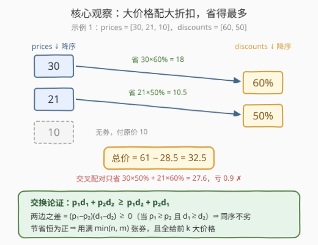
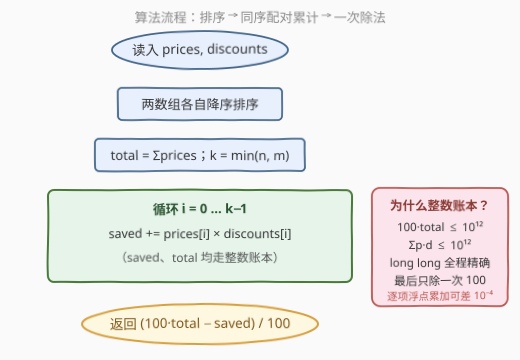

# 应用折扣后的最低总价

- **题目名称**：应用折扣后的最低总价
- **链接**：[4014. 应用折扣后的最低总价](https://leetcode.cn/problems/minimum-total-price-after-applying-discounts/)
- **难度**：中等
- **标签**：贪心、排序、数组

## 1. 题目概述

给你两个整数数组 `prices` 和 `discounts`。`prices[i]` 表示第 $i$ 件商品的价格，`discounts[j]` 表示一个折扣百分比。你可以按照以下规则使用折扣：

- 每个折扣**最多**只能用于一件商品；
- 每件商品**最多**只能使用一个折扣；
- 商品也可以不使用任何折扣。

如果将 $d\%$ 的折扣应用于价格为 $p$ 的商品，则其最终价格为 $p \cdot (100-d)/100$，最终价格**不进行四舍五入**。请以最优方式分配折扣，返回所有商品最终价格之和的**最小值**。与实际答案误差在 $10^{-5}$ 以内的结果都将被接受。

**示例 1**：

```text
输入：prices = [10,30,21], discounts = [50,60]
输出：32.50000
解释：60% 券给 30（付 12），50% 券给 21（付 10.5），10 不用券，合计 32.5。
```

**示例 2**：

```text
输入：prices = [100,70], discounts = [10,40,50]
输出：92.00000
解释：50% 券给 100（付 50），40% 券给 70（付 42），10% 券弃用，合计 92。
```

**示例 3**：

```text
输入：prices = [7,3,9], discounts = [100,100]
输出：3.00000
解释：两张 100% 券给 9 和 7（各付 0），3 不用券，合计 3。
```

**约束条件**：

- $1 \le \text{prices.length},\ \text{discounts.length} \le 10^5$
- $1 \le \text{prices[i]} \le 10^5$
- $1 \le \text{discounts[j]} \le 100$

> 💡 **审题关键**：①「每折扣至多一件、每件至多一折扣」= **一对一配对**——本质是商品与折扣的二分图匹配，但代价是**乘积**结构，有排序贪心精确解；② 最终价格不四舍五入、容差 $10^{-5}$ ⇒ 返回 `double`，**怎么累加**直接决定精度（见 2.3）；③ $d \ge 1$ ⇒ 任何券用在任何商品上都严格省钱，不存在「券多得要挑剔弃用」的边界（但**哪张券给哪件商品**大有讲究）。

---

## 2. 解题思路

### 2.1 暴力思路

把折扣分给商品是一个一对一分配问题：枚举「哪些商品用券 × 哪张券给谁」，组合数 $C(n,k)\cdot k!$ 直接爆炸。退一步建模为**二分图最小权匹配**，匈牙利算法 / 最小费用最大流 $O(n^3)$，在 $n = m = 10^5$ 规模下同样不可行。

但注意到代价的特殊结构：一张 $d\%$ 的券用在价格 $p$ 上，**省下的钱恰好是 $p \cdot d / 100$**——「省多少」只依赖这一对 $(p, d)$ 的乘积。这个可分解性正是贪心的入口。

### 2.2 核心观察：总价最小 ⟺ 节省最大，排序不等式定配对



**第一步（目标转换）**：设用券配对集合为 $M$，则

$$\text{总价} = \sum_i p_i \;-\; \sum_{(i,j)\in M} \frac{p_i \cdot d_j}{100}$$

$\sum p_i$ 是常量，所以**最小化总价 ⟺ 最大化总节省** $\sum p_i d_j$——问题变成「选一个配对方案，让乘积和最大」。

**第二步（同序配对最优——交换论证）**：设 $p_1 \ge p_2$ 且 $d_1 \ge d_2$，则

$$\bigl(p_1 d_1 + p_2 d_2\bigr) - \bigl(p_1 d_2 + p_2 d_1\bigr) = (p_1 - p_2)(d_1 - d_2) \ge 0$$

即**大价格配大折扣、小价格配小折扣，总不劣于交叉配对**。任何包含「交叉」的方案都能经有限次交换变成同序方案且节省不减——这正是**排序不等式**（同序和 ≥ 乱序和 ≥ 逆序和）的内容。于是最优方案是：两数组各自降序排序后，第 $i$ 大价格配第 $i$ 大折扣。

**第三步（用几张券、给谁）**：节省 $p \cdot d / 100 > 0$ 恒为正，多配一对纯赚，所以恰好配 $k = \min(n, m)$ 对；券多于商品时弃掉小券（大券必选——否则把小券换成大券不亏），商品多于券时券全给**前 $k$ 大价格**（由同序配对直接得出）。

> 💡 **一句话总结**：省多少 = $p \cdot d$ 的乘积 ⇒ 排序不等式说「同序配对最大」⇒ 双双降序、对位相乘、用满 $\min(n,m)$ 对，剩下的商品付原价。

### 2.3 算法流程图



| 步骤 | 操作 | 说明 |
|------|------|------|
| ① | 两数组各自**降序排序** | $O(n\log n + m\log m)$，贪心正确性的载体 |
| ② | $k \leftarrow \min(n, m)$，$\text{total} \leftarrow \sum p_i$ | 整数账本，`long long` |
| ③ | 循环 $i = 0 \dots k-1$：$\text{saved} \mathrel{+}= p_i \cdot d_i$ | 仍是整数账本，乘积 $\le 10^7$ |
| ④ | 返回 $(100 \cdot \text{total} - \text{saved}) / 100$ | **只在最后做一次除法** |

> ⚠️ **精度陷阱（本题隐藏考点）**：若写成 `ans += prices[i] * (100 - d[i]) / 100.0` 逐项浮点累加，$10^5$ 项的舍入误差在对抗数据下可达 $10^{-4}$ 量级（实测 `prices=[99999]*1e5, discounts=[1]*1e5` 时偏差 0.0177），**超过 $10^{-5}$ 容差**。整数账本 $100 \cdot \text{total}$ 与 $\text{saved}$ 均 $\le 10^{12} < 2^{53}$，全程精确，最后只做一次除法，误差 $\le 1\ \text{ulp} \approx 10^{-6}$。

### 2.4 示例演算

**示例 1**：`prices = [10,30,21]`、`discounts = [50,60]`。降序得 $p = [30,21,10]$、$d = [60,50]$，$k = 2$：

| 商品价格 | 配对折扣 | 最终价格 | 节省 |
|----------|----------|----------|------|
| 30 | 60% | $30 \times 0.4 = 12$ | 18 |
| 21 | 50% | $21 \times 0.5 = 10.5$ | 10.5 |
| 10 | 无券 | 10 | 0 |

总价 $= 61 - 28.5 = 32.5$ ✓。若交叉配对（30 配 50%、21 配 60%）只省 $15 + 12.6 = 27.6$，亏 0.9——交换论证的活体演示。

**示例 2**：$p = [100,70]$、$d = [50,40,10]$，$k = 2$，弃小券 10%：$100 \times 0.5 + 70 \times 0.6 = 50 + 42 = 92$ ✓。

**示例 3**：$p = [9,7,3]$、$d = [100,100]$，$k = 2$：$9 \to 0$、$7 \to 0$、3 付原价，总价 $3$ ✓。

---

## 3. 参考代码

### C++

```cpp
class Solution {
  public:
    double minPrice(vector<int>& prices, vector<int>& discounts) {
        sort(prices.rbegin(), prices.rend());        // ① 降序
        sort(discounts.rbegin(), discounts.rend());  // ① 降序

        long long total = 0;
        for (int p : prices) total += p;             // ② 整数账本 ≤ 10^10

        long long saved = 0;                         // ③ Σ p·d ≤ 10^12
        int k = min(prices.size(), discounts.size());
        for (int i = 0; i < k; ++i)
            saved += 1LL * prices[i] * discounts[i];

        return (100.0 * total - saved) / 100.0;      // ④ 只除一次
    }
};
```

> 💡 **写法要点**：
> - `1LL * prices[i] * discounts[i]`：单项乘积 $\le 10^5 \times 100 = 10^7$ 不大，但养成显式提升的习惯更稳；
> - `100.0 * total - saved`：两个操作数 $\le 10^{12} < 2^{53}$，转 `double` 无损，随后只做一次除法；
> - 切勿逐项 `/100.0` 浮点累加——误差可积到 $10^{-4}$（见 2.3 的 ⚠️）。

### Python

```python
class Solution:
    def minPrice(self, prices: List[int], discounts: List[int]) -> float:
        prices.sort(reverse=True)        # ① 降序
        discounts.sort(reverse=True)     # ① 降序

        total = sum(prices)              # ② 整数账本（大整数，天然精确）
        saved = sum(p * d for p, d in zip(prices, discounts))  # ③ zip 自动取前 k 对
        return (100 * total - saved) / 100                     # ④ 只除一次
```

> 💡 **写法要点**：
> - `zip(prices, discounts)` 自动在较短数组处截断，恰好就是「前 $k$ 大价格配前 $k$ 大折扣」，连 `min` 都不用显式写；
> - Python 整数任意精度，`100 * total - saved` 完全精确，仅最后 `/100` 产生一次浮点舍入。

---

## 4. 复杂度分析

| 维度 | 复杂度 | 说明 |
|------|--------|------|
| 时间 | $O(n \log n + m \log m)$ | 两次排序占主导；配对累计线性 |
| 空间 | $O(1)$ | 原地排序（忽略排序递归栈），只新增 `total`/`saved`/`k` 三个变量 |
| 精度 | 误差 $\le 1\ \text{ulp} \approx 10^{-6}$ | 整数账本 $\le 10^{12} < 2^{53}$ 精确可表示，仅最后一次除法舍入，$\ll 10^{-5}$ 容差 |

---

## 5. 扩展：当「一对一」被打破

**变体一（折扣可叠加）**：若一件商品可以用多张券（连乘折扣），交换论证立刻失效——券的**边际节省**随商品已挂的折扣变化，不再是独立的 $p \cdot d$。问题退化为「把 $m$ 张券划分给 $n$ 件商品」的划分型优化，简单排序配对不再显然最优，需要按 $\log(1 - d/100)$ 之类的变换另起炉灶。**本题贪心的命根子就是「一对一配对 + 乘积可分解」这两个条件**。

**变体二（最少用券数达标）**：改为「总价 $\le T$ 的前提下最少用几张券」——同序配对仍是最省的用券次序（前 $t$ 大价格配前 $t$ 大折扣是**任意 $t$ 张券的最大节省**），对配对前缀做二分或线性扫描即可，贪心骨架原封不动。

**推广（何时排序配对通用）**：目标形如 $\sum f(p_i)\, g(d_{\sigma(i)})$（$f, g$ 同向单调）时，排序不等式保证同序配对最优——本题是 $f = \text{id}, g = \text{id}$ 的特例；而一旦目标函数不再可分解（如 $p + d$、$p^d$），就要回到匹配建模。

---

## 6. 面试要点

**Q1：为什么「最小化总价」能转成「最大化节省」？**

> 总价 $= \sum p_i - \sum_{\text{配对}} p_i d_j / 100$，其中 $\sum p_i$ 是与分配方案无关的常量。减号后面这一项就是总节省，所以两个目标完全等价，转过去之后「乘积最大」的结构才暴露出来。

**Q2：交换论证怎么一句话说清？**

> 设 $p_1 \ge p_2$、$d_1 \ge d_2$，则 $p_1 d_1 + p_2 d_2 - (p_1 d_2 + p_2 d_1) = (p_1 - p_2)(d_1 - d_2) \ge 0$——把任意方案里的「大价格配小折扣」换成同序配对，总节省不降；有限次交换后得到全同序方案，即降序对位相乘。

**Q3：为什么一定用满 $\min(n, m)$ 张券、且只给前 $k$ 大价格？**

> 节省 $p \cdot d / 100$ 恒正，多配一对纯赚，所以配满 $k = \min(n, m)$ 对；由排序不等式，$k$ 对的最大乘积和恰是「前 $k$ 大价格 × 前 $k$ 大折扣」的对位乘积——券多时弃小券、商品多时小商品不用券，都是这同一条结论的推论。

**Q4：浮点精度上有什么坑？**

> 逐项 `p*(100-d)/100.0` 浮点累加 $10^5$ 项，舍入误差可积到 $10^{-4}$（超过容差，实测有反例）；正确姿势是**整数账本**——$100 \cdot \sum p$ 与 $\sum p d$ 均 $\le 10^{12}$，`long long`/Python 大整数精确，最后只做一次除法，误差 $\le 1$ ulp。这是「容差题」里最值得主动提的工程细节。

**Q5：和 455 分发饼干 / 870 优势洗牌 有何异同？**

> 三者都是「排序 + 配对」贪心，配对**方向由目标函数决定**：本题乘积节省要**同序**（大配大）；870 优势洗牌要最大化赢的局数，走**错位**配对（田忌赛马：下等马消耗对方上等马）；455 则是「能满足才配」的贪心分发。交换论证是三者统一的证明工具，方向差异全在「交换后哪个量变大」。

---

## 7. 同类练习题

- [455. 分发饼干](https://leetcode.cn/problems/assign-cookies/)：排序 + 同序配对的入门版（大饼干喂大胃口），能满足才配
- [870. 优势洗牌](https://leetcode.cn/problems/advantage-shuffle/)：排序配对的「田忌赛马」错位版——配对方向与本题相反
- [1877. 数组中最大数对和的最小值](https://leetcode.cn/problems/minimize-maximum-pair-sum-in-array/)：排序后首尾配对最小化最大对和——min-max 目标下的另一种配对方向
- [881. 救生艇](https://leetcode.cn/problems/boats-to-save-people/)：排序 + 双指针，最重配最轻的载量约束配对
- [2144. 打折购买糖果的最小开销](https://leetcode.cn/problems/minimum-cost-of-buying-candies-with-discount/)：另一种「打折」结构——买二赠一，排序后弃最小值
