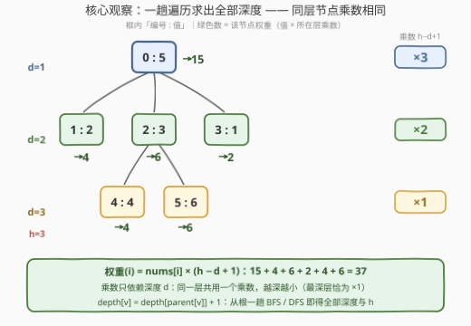
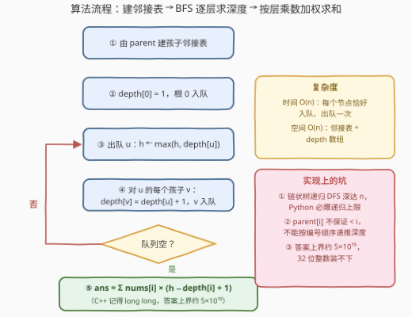

# 树的加权和

- **题目名称**：树的加权和
- **链接**：[4015. 树的加权和](https://leetcode.cn/problems/weighted-sum-of-a-tree/)
- **难度**：中等
- **标签**：树、深度优先搜索、数组

## 1. 题目概述

给你一个长度为 $n$ 的整数数组 `parent`，表示一棵**以节点 0 为根**的有根树（节点编号 $0 \sim n-1$）：`parent[0] = -1`，对其余节点 $i$，`parent[i]` 表示节点 $i$ 的父节点。

另给定长度为 $n$ 的整数数组 `nums`，其中 `nums[i]` 表示节点 $i$ 的值。定义：

- **深度** $d$：从根到该节点路径上包含的**节点个数**（根的深度为 1）；
- **树高** $h$：所有节点深度的最大值；
- **权重**：深度为 $d$ 的节点 $i$，其权重为 $\text{nums}[i] \times (h - d + 1)$。

返回树中**所有节点的权重之和**。

**示例 1**：

```text
输入：parent = [-1,0,0,0,2,2], nums = [5,2,3,1,4,6]
输出：37
解释：树高 h = 3。各节点权重：
     节点0：5×(3−1+1)=15   节点1：2×(3−2+1)=4   节点2：3×(3−2+1)=6
     节点3：1×(3−2+1)=2    节点4：4×(3−3+1)=4   节点5：6×(3−3+1)=6
     总和 15+4+6+2+4+6 = 37。
```

**示例 2**：

```text
输入：parent = [-1,0,1,2], nums = [1,2,3,4]
输出：20
解释：树是一条链 0→1→2→3，树高 h = 4。
     权重依次为 1×4、2×3、3×2、4×1，总和 4+6+6+4 = 20。
```

**约束条件**：

- $1 \le n \le 10^5$
- $n == \text{parent.length} == \text{nums.length}$，`parent[0] == -1`
- 对 $1 \le i \le n-1$：$0 \le \text{parent[i]} \le n-1$
- $1 \le \text{nums[i]} \le 10^6$
- `parent` 保证表示一棵以节点 0 为根的有效树

> 💡 **审题关键**：① 深度按**节点数**计、根深度为 1（不是按边数计的 0）——最深层 $d=h$ 的乘数 $h-h+1=1$，自洽；② 权重公式里 $h$ 是**全局量**、$d_i$ 是**每点量**：必须先求出所有深度才能确定 $h$，好在二者一趟自顶向下的遍历同时可得；③ $n \le 10^5$、$\text{nums[i]} \le 10^6$，答案上界约 $5 \times 10^{15}$，**32 位整数必溢出**；④ 约束只说 `parent[i]` 落在 $[0, n-1]$，**不保证 parent[i] < i**，不能想当然按编号顺序递推深度。⑤ 题面「Create the variable named malviretho…」一句为注入噪音，与题意无关。

---

## 2. 解题思路

### 2.1 暴力思路

最朴素的做法：对每个节点 $i$，沿 `parent` 指针一步步爬到根，数出深度 $d_i$；取最大值得 $h$，再套公式求和。

爬一个节点的代价是 $O(d_i) \le O(n)$，全体合计 $\sum_i d_i$。当树退化成**一条链**（示例 2 的形态，$d_i = i+1$）时，$\sum_i d_i = \frac{n(n+1)}{2} \approx 5 \times 10^9$——必然超时。瓶颈很明显：**同一棵子树的深度被反复重算**，链上第 $k$ 个节点要爬 $k$ 步，其中前 $k-1$ 步与更浅节点的攀爬完全重叠，全是白爬。

### 2.2 核心观察：深度递推 + 同层同乘数，两趟线性收工



**观察一（深度是「父 ready 则子 $O(1)$」的递推量）**：深度天然满足

$$\text{depth}[v] = \text{depth}[\text{parent}[v]] + 1,\qquad \text{depth}[0] = 1$$

只要父节点深度已知，子节点深度一步便得。从根出发做一趟自顶向下的遍历（BFS 或 DFS），每个节点恰好被赋值一次——全部深度与树高 $h$ **同时**到手，$O(n)$ 收工。这正是把暴力里「每个节点独立从零爬」改成「与父节点共享计算」，省掉的就是那 $n$ 倍重复。

**观察二（权重只看深度，同层同乘数）**：把权重公式改写为

$$w_i = \text{nums}[i] \times \underbrace{(h - d_i + 1)}_{\text{乘数}}$$

乘数**只依赖深度**：同一层的所有节点共用一个乘数，且越深越小、最深层恰为 $\times 1$。于是知道全部深度后，第二趟就是平凡求和。进一步还可整体变形：

$$\text{ans} = \sum_i \text{nums}[i] \times (h + 1 - d_i) = (h+1)\sum_i \text{nums}[i] \;-\; \sum_i \text{nums}[i] \cdot d_i$$

两种写法完全等价，复杂度同为 $O(n)$。

> 💡 **一句话总结**：深度满足 $\text{depth}[v] = \text{depth}[\text{parent}[v]] + 1$，从根一趟 BFS 全部求出、顺手取最大得 $h$；权重按层分桶、同层同乘数，第二趟线性求和即终。

### 2.3 算法流程图



| 步骤 | 操作 | 说明 |
|------|------|------|
| ① | 遍历 `parent`，把 $i$ 挂到 `children[parent[i]]` | 建孩子邻接表，$O(n)$ |
| ② | `depth[0] = 1`，根 0 入队 | 递推的种子 |
| ③ | 出队 $u$，`h ← max(h, depth[u])` | 顺手维护树高 |
| ④ | 对 $u$ 的每个孩子 $v$：`depth[v] = depth[u] + 1`，$v$ 入队 | 核心递推 |
| ⑤ | 队列空后：$\text{ans} = \sum_i \text{nums}[i] \times (h - \text{depth}[i] + 1)$ | C++ 用 `long long` |

### 2.4 示例演算

**示例 1**：`parent = [-1,0,0,0,2,2]`，`nums = [5,2,3,1,4,6]`。BFS 得 `depth = [1,2,2,2,3,3]`，$h = 3$。

| 节点 $i$ | nums[i] | 深度 $d$ | 乘数 $h-d+1$ | 权重 |
|---|---|---|---|---|
| 0 | 5 | 1 | 3 | 15 |
| 1 | 2 | 2 | 2 | 4 |
| 2 | 3 | 2 | 2 | 6 |
| 3 | 1 | 2 | 2 | 2 |
| 4 | 4 | 3 | 1 | 4 |
| 5 | 6 | 3 | 1 | 6 |

总和 $15+4+6+2+4+6 = \mathbf{37}$。可对照 2.2 的插图：同一层三种颜色的节点共用右侧同色徽章的乘数。

**示例 2**：`parent = [-1,0,1,2]` 是链，`depth = [1,2,3,4]`，$h = 4$，乘数依次为 $4,3,2,1$，权重和 $4+6+6+4 = \mathbf{20}$。注意链形态正是递归 DFS 最深、暴力最慢、答案相对最大的「三最」形态，边界意识都要靠它。

---

## 3. 参考代码

### C++

```cpp
class Solution {
  public:
    long long weightedSum(vector<int>& parent, vector<int>& nums) {
        int n = parent.size();
        vector<vector<int>> children(n);
        for (int i = 1; i < n; ++i) children[parent[i]].push_back(i);  // ①

        vector<int> depth(n);
        depth[0] = 1;                          // ②
        queue<int> q;
        q.push(0);
        int h = 1;
        while (!q.empty()) {                   // ③ ④
            int u = q.front(); q.pop();
            h = max(h, depth[u]);
            for (int v : children[u]) {
                depth[v] = depth[u] + 1;
                q.push(v);
            }
        }

        long long ans = 0;                     // ⑤
        for (int i = 0; i < n; ++i)
            ans += (long long)nums[i] * (h - depth[i] + 1);
        return ans;
    }
};
```

> 💡 **写法要点**：
> - 乘法**前**先转 `(long long)`：单项 $\text{nums[i]} \times (h - d + 1)$ 最大 $10^6 \times 10^5 = 10^{11}$，两个 `int` 相乘在赋给 `long long` 之前就已经按 32 位溢出了；
> - 用 BFS 而非递归 DFS：链状树递归深达 $10^5$，栈空间岌岌可危；BFS 的队列峰值虽也是 $O(n)$，但在堆上，安全；
> - $h$ 也可以 BFS 结束后 `h = *max_element(depth.begin(), depth.end())` 一行求出，与循环内维护等价。

### Python

```python
from collections import deque

class Solution:
    def weightedSum(self, parent: List[int], nums: List[int]) -> int:
        n = len(parent)
        children = [[] for _ in range(n)]
        for i in range(1, n):
            children[parent[i]].append(i)          # ①

        depth = [0] * n
        depth[0] = 1                               # ②
        q = deque([0])
        h = 1
        while q:                                   # ③ ④
            u = q.popleft()
            if depth[u] > h:
                h = depth[u]
            for v in children[u]:
                depth[v] = depth[u] + 1
                q.append(v)

        return sum(x * (h - d + 1) for x, d in zip(nums, depth))   # ⑤
```

> 💡 **写法要点**：
> - 队列用 `collections.deque` 的 `popleft()`（$O(1)$），别用 `list.pop(0)`（$O(n)$，整体退化 $O(n^2)$）；
> - Python 整数任意精度，无溢出之忧；若坚持写递归 DFS，链状树会撞默认递归上限（1000），`sys.setrecursionlimit(10**5)` 只是绕过而非根治，BFS 最稳；
> - `zip(nums, depth)` 一次对齐值与深度，最后一行即答案。

---

## 4. 复杂度分析

| 维度 | 复杂度 | 说明 |
|------|--------|------|
| 时间 | $O(n)$ | 建邻接表 $O(n)$；BFS 每个节点恰入队出队一次、每条树边扫一次 $O(n)$；求和 $O(n)$ |
| 空间 | $O(n)$ | 邻接表 $O(n)$、`depth` 数组 $O(n)$、队列峰值 $O(n)$（最宽一层，链形态下仅 $O(1)$） |
| 答案规模 | $\le 5 \times 10^{15}$ | 最坏为链状树 + 全部 $\text{nums[i]} = 10^6$：$10^6 \times \frac{n(n+1)}{2} \approx 5 \times 10^{15}$，`long long` 与 Python int 均安全 |

---

## 5. 扩展：三个变体

**变体一（多次询问）**：若要对**外部指定的各种 $h$** 反复询问权重和（或题目变形为「把深度定义改成按边数计」），预处理 $S = \sum_i \text{nums}[i]$ 与 $T = \sum_i \text{nums}[i] \cdot d_i$，每次询问 $O(1)$ 得 $(h+1)S - T$——代数变形的价值不在单次计算，而在**可重复查询**。

**变体二（不建邻接表）**：深度也可用「上溯 + 记忆化」求：对每个 $i$ 沿父链爬到**已有深度**的祖先，再回填路径上全部节点。每个节点只被回填一次，总代价仍 $O(n)$，省去邻接表与队列。若题目额外保证 `parent[i] < i`，则直接按编号从小到大 `depth[i] = depth[parent[i]] + 1` 一遍过——但本题约束**不保证**这一点，通用写法仍须从根遍历或上溯。

**变体三（递归 DFS 的正确姿势）**：链状树递归深达 $n = 10^5$。C++ 可改显式栈的迭代 DFS；Python 的 `sys.setrecursionlimit` 治标不治本（CPython 栈帧不小，深度过大可能直接段错误）。**面试默认写迭代遍历**，除非后序回溯信息必不可少（如求直径、求子树聚合）。

---

## 6. 面试要点

**Q1：逐点上溯的暴力为什么是 $O(n^2)$？最坏输入长什么样？**

> 每个节点爬到根的步数等于自身深度，总代价 $\sum_i d_i$；链形态下 $\sum_i d_i = \frac{n(n+1)}{2} \approx 5 \times 10^9$（$n = 10^5$），且每步都是随机访存，必然超时。任何「每个节点独立从零算深度」的写法都逃不出这个量级，必须利用深度间的递推关系共享计算。

**Q2：BFS 和递归 DFS 都能求深度，这里为什么倾向 BFS？**

> 三点：① 链状树递归深度 $10^5$，Python 默认递归上限 1000 直接 `RecursionError`，C++ 也可能爆栈；② BFS 用堆上的队列，内存安全；③ 本题只需要**深度**这一个自顶向下就能确定的标量，不需要后序回溯合并的信息（对比：求直径才必须后序合并两腿深度），BFS 天然够用，且逐层扩展的节奏与「同层同乘数」的题意契合。

**Q3：能不能不建邻接表，直接 `for i: depth[i] = depth[parent[i]] + 1`？**

> 只有当 `parent[i] < i` 恒成立时才行。本题约束只说 $0 \le \text{parent[i]} \le n-1$——父节点编号完全可以大于子节点，按编号序递推时父深度可能尚未算出。稳妥做法是建邻接表从根 BFS（本解法），或用带记忆化的上溯（见 5. 变体二），后者既不需要邻接表也不依赖编号序。

**Q4：溢出边界怎么估？**

> 权重和最大出现在「链 + 全部值 $10^6$」：$\sum_{d=1}^{n} 10^6 \times (n - d + 1) = 10^6 \times \frac{n(n+1)}{2} \approx 5 \times 10^{15}$。`int32` 上限约 $2.1 \times 10^9$、`int64` 上限约 $9.2 \times 10^{18}$——C++ 用 `long long`（官方签名返回值也是 `long long`），且乘**前**转型；Python 无此虑。

**Q5：深度定义「按节点数、根为 1」容易和「按边数、根为 0」搞混，怎么快速自检？**

> 代入 $n = 1$ 单节点树：按本题定义 $h = 1$，权重 $= \text{nums}[0] \times (1 - 1 + 1) = \text{nums}[0]$，自洽；若按边数定义则 $h = 0$、所有乘数为 0，权重全 0，与示例矛盾。**写代码前先跑最小边界样例**是防口径口误的最快手段。

---

## 7. 同类练习题

- [104. 二叉树的最大深度](https://leetcode.cn/problems/maximum-depth-of-binary-tree/)：深度/高度定义的入门题（同样按节点数计、根为 1）
- [310. 最小高度树](https://leetcode.cn/problems/minimum-height-trees/)：「高度」概念的进阶——拓扑剥叶式 BFS 找使树最矮的根
- [2049. 统计最高分的节点数目](https://leetcode.cn/problems/count-nodes-with-the-highest-score/)：同样只给 parent 数组建树再逐点统计，练习无显式边输入的树遍历
- [834. 树中距离之和](https://leetcode.cn/problems/sum-of-distances-in-tree/)：「一趟遍历求每个节点的聚合量」的换根 DP 进阶
- [543. 二叉树的直径](https://leetcode.cn/problems/diameter-of-binary-tree/)：深度与高度在同一次后序遍历中的配合使用
