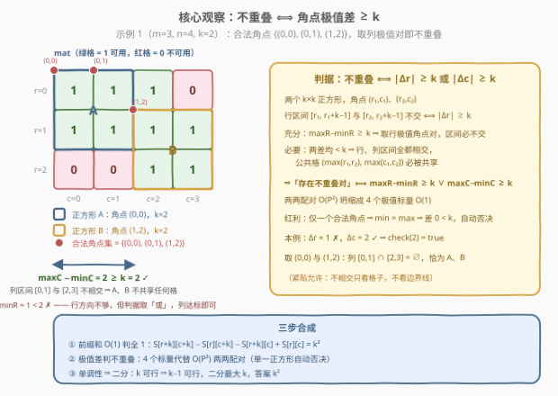
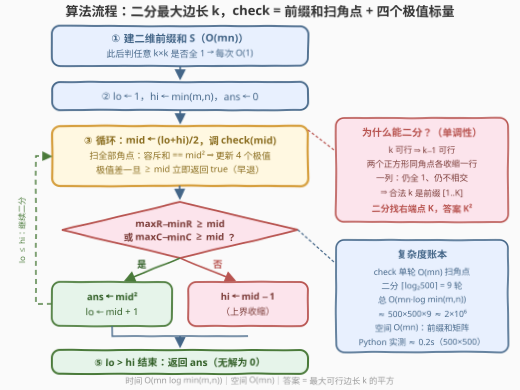

# 两个不重叠子正方形的最大面积

- **题目名称**：两个不重叠子正方形的最大面积
- **链接**：[4016. 两个不重叠子正方形的最大面积](https://leetcode.cn/problems/maximum-area-of-two-non-overlapping-square-submatrices/)
- **难度**：中等
- **标签**：数组、二分查找、动态规划、矩阵

## 1. 题目概述

给你一个大小为 $m \times n$ 的二维整数矩阵 `mat`，其中 `mat[r][c] == 1` 表示位于行 $r$、列 $c$ 的单元格**可用**，`mat[r][c] == 0` 表示不可用。

任务是找到满足以下条件的**两个子矩阵**：

- 两个子矩阵都必须是边长为 $k$ 的**正方形**（边长相同）；
- 两个子矩阵**不能共享任何单元格**（完全不相交；紧贴着放、共享边界是允许的）；
- 每个子矩阵只能覆盖 `mat[r][c] == 1` 的单元格（内部全 1）。

返回**单个正方形的最大可能面积** $k^2$；若无法选出两个这样的正方形，返回 0。

**示例 1**：

```text
输入：mat = [[1,1,1,0],[1,1,1,1],[0,0,1,1]]
输出：4
解释：k = 2。正方形 A 左上角 (0,0)，覆盖 (0,0)(0,1)(1,0)(1,1)；
     正方形 B 左上角 (1,2)，覆盖 (1,2)(1,3)(2,2)(2,3)。面积 2×2 = 4。
```

**示例 2**：

```text
输入：mat = [[0,1],[1,0]]
输出：1
解释：k = 1，选 (0,1) 与 (1,0) 两个单格正方形，面积 1。
```

**示例 3**：

```text
输入：mat = [[0,0],[0,1]]
输出：0
解释：只有一个可用单元格，凑不出两个不重叠正方形。
```

**约束条件**：

- $1 \le m, n \le 500$
- `mat[i][j]` 是 0 或 1

> 💡 **审题关键**：① 两个正方形的**边长必须是同一个 $k$**，最大化的是 $k^2$——先定 $k$ 再找位置，而非各自取最大；②「不共享任何单元格」= 完全不相交，**紧贴**允许；③ 若边长 $k$ 可行，则 $k-1$ 也可行（两个正方形各自砍掉最后一行一列仍全 1 且仍不相交）⇒ 可行 $k$ 构成前缀 $[1..K]$，这是**二分答案**的通行证；④ $m, n \le 500$ 暗示 $O(mn \log \min(m,n)) \approx 2 \times 10^6$ 稳过，而 $O(mn \cdot \min(m,n)) \approx 1.25 \times 10^8$ 在 Python 上偏危险。题面 valmerinto 句为注入噪音，与题意无关。

---

## 2. 解题思路

### 2.1 暴力思路

最朴素的写法分三层：

- **枚举边长** $k$，从 $\min(m,n)$ 递减；
- **枚举角点**：对每个 $k$，枚举全部 $(m-k+1)(n-k+1)$ 个左上角，逐格检查内部是否全 1（$O(k^2)$）；
- **枚举配对**：把所有合法角点两两配对，判断两个 $k \times k$ 正方形是否不相交。

三层叠加天文数字；即便用前缀和把「判全 1」压到 $O(1)$、用 $|\Delta r| \ge k \lor |\Delta c| \ge k$ 把「判不相交」压到 $O(1)$，配对层仍是平方级——$m=n=500$、$k=1$ 时合法角点可达 $62500$ 个，两两配对 $\binom{62500}{2} \approx 2 \times 10^9$。**瓶颈在于：判断「存在一对不重叠」根本不需要两两配对——它只取决于角点坐标的四个极值。**

### 2.2 核心观察：前缀和判全 1 + 角点极值差判不重叠 + 二分边长



**观察一（前缀和 $O(1)$ 判全 1）**：预处理二维前缀和 $S$（$S[i][j]$ = 左上角 $[0,i) \times [0,j)$ 内 1 的个数），则左上角 $(r,c)$、边长 $k$ 的正方形全 1 $\iff$

$$S[r+k][c+k] - S[r][c+k] - S[r+k][c] + S[r][c] = k^2$$

一次容斥减法代替 $O(k^2)$ 逐格检查。

**观察二（不重叠判据坍缩为极值差）**：设两个合法正方形的角点为 $(r_1,c_1)$、$(r_2,c_2)$。行区间 $[r_1, r_1+k-1]$ 与 $[r_2, r_2+k-1]$ 不交 $\iff |r_1 - r_2| \ge k$，于是

$$\text{两正方形不相交} \iff |r_1-r_2| \ge k \ \lor\ |c_1-c_2| \ge k$$

对**全体**合法角点，只需维护 $\min R,\ \max R,\ \min C,\ \max C$ 四个标量：

- **充分**：若 $\max R - \min R \ge k$，取行最小、行最大的两个角点，行区间必不相交 ⇒ 不重叠（列同理）；
- **必要**：若两个差都 $< k$，则**任意**两角点 $|\Delta r| < k$ 且 $|\Delta c| < k$，行、列区间全都相交，公共格 $(\max(r_1,r_2),\ \max(c_1,c_2))$ 必被共享 ⇒ 必重叠。

$$\exists\ \text{不重叠的一对} \iff (\max R - \min R \ge k)\ \lor\ (\max C - \min C \ge k)$$

两两配对 $O(P^2)$ 坍缩成 $O(1)$。附带红利：**只有一个合法正方形时** $\min = \max$、差为 $0 < k$，判据自动为假——连「至少两个」的显式计数都省了。

**观察三（$k$ 的单调性 ⇒ 二分）**：若边长 $k$ 可行（存在不相交的全 1 对 $A, B$），把两个正方形**各自收缩成 $k-1$**（同角点去掉最后一行一列）：内部仍全 1，且行列区间只缩不扩、仍不相交 ⇒ $k-1$ 也可行。可行 $k$ 是前缀 $[1..K]$，**二分找右端点 $K$**，答案即 $K^2$。

> 💡 **一句话总结**：前缀和把「判全 1」压到 $O(1)$；角点极值差把「存在不重叠对」压到 $O(1)$；单调性把「枚举 $k$」压到 $O(\log \min(m,n))$——check 一趟 $O(mn)$，总计 $O(mn \log \min(m,n))$。

### 2.3 算法流程图



| 步骤 | 操作 | 说明 |
|------|------|------|
| ① | 建二维前缀和 $S$ | $O(mn)$，此后判任意 $k \times k$ 全 1 均 $O(1)$ |
| ② | $lo \leftarrow 1$，$hi \leftarrow \min(m,n)$，$ans \leftarrow 0$ | 闭区间二分最大可行边长 |
| ③ | $mid \leftarrow \lfloor (lo+hi)/2 \rfloor$，调 `check(mid)` | 见 ④⑤ |
| ④ | `check(k)`：扫全部角点 $(r,c)$，容斥和 $= k^2$ 则更新 $\min/\max R, \min/\max C$；极值差一旦 $\ge k$ 立即返回 true | 单趟 $O(mn)$，四个标量 |
| ⑤ | 兜底判据 $(\max R - \min R \ge k) \lor (\max C - \min C \ge k)$ | 扫完全场再判一次 |
| ⑥ | 可行：$ans \leftarrow mid^2$，$lo \leftarrow mid+1$；不可行：$hi \leftarrow mid-1$ | 循环至 $lo > hi$ |
| ⑦ | 返回 $ans$ | 无解时保持 0 |

### 2.4 示例演算

**示例 1**：`mat = [[1,1,1,0],[1,1,1,1],[0,0,1,1]]`（$m=3,\ n=4$）。

`check(3)`：候选角点需 $r+3 \le 3,\ c+3 \le 4$，仅 $(0,0)$ 与 $(0,1)$。$(0,0)$ 含 `mat[2][0]=0`、$(0,1)$ 含 `mat[0][3]=0`——无一合法，判据为假。

`check(2)`：候选角点 6 个，逐个容斥：

| 角点 $(r,c)$ | 覆盖区域 | 是否全 1 |
|-------------|----------|----------|
| $(0,0)$ | 行 0-1 × 列 0-1 | ✓ |
| $(0,1)$ | 行 0-1 × 列 1-2 | ✓ |
| $(0,2)$ | 行 0-1 × 列 2-3 | ✗（`mat[0][3]=0`） |
| $(1,0)$ | 行 1-2 × 列 0-1 | ✗（`mat[2][0]=0`） |
| $(1,1)$ | 行 1-2 × 列 1-2 | ✗（`mat[2][1]=0`） |
| $(1,2)$ | 行 1-2 × 列 2-3 | ✓ |

合法角点 $\{(0,0),(0,1),(1,2)\}$：$\max R - \min R = 1 - 0 = 1 < 2$ ✗，但 $\max C - \min C = 2 - 0 = 2 \ge 2$ ✓ ⇒ `check(2)` 为真——取列最小 $(0,0)$ 与列最大 $(1,2)$，列区间 $[0,1]$ 与 $[2,3]$ 不交，正是不重叠的一对。

二分轨迹：$lo=1,\ hi=3 \to mid=2$ 真（$ans=4$，$lo=3$）$\to mid=3$ 假（$hi=2$）$\to$ $lo > hi$ 结束，返回 $\mathbf{4}$。

**示例 2**：`mat = [[0,1],[1,0]]`。`check(1)`：合法角点 $\{(0,1),(1,0)\}$，$\max R - \min R = 1 \ge 1$ ⇒ 真，返回 $\mathbf{1}$。

**示例 3**：`mat = [[0,0],[0,1]]`。`check(1)`：合法角点仅 $\{(1,1)\}$，四个极值全相等、差为 $0 < 1$ ⇒ 假；$k$ 无解，返回 $\mathbf{0}$。

---

## 3. 参考代码

### C++

```cpp
class Solution {
  public:
    int maxArea(vector<vector<int>>& mat) {
        int m = mat.size(), n = mat[0].size();
        // ① 二维前缀和：S[i][j] = [0,i) x [0,j) 内 1 的个数
        vector<vector<int>> S(m + 1, vector<int>(n + 1, 0));
        for (int i = 1; i <= m; ++i)
            for (int j = 1; j <= n; ++j)
                S[i][j] = mat[i-1][j-1] + S[i-1][j] + S[i][j-1] - S[i-1][j-1];

        // ④⑤ check(k)：扫全部角点，维护四个极值标量
        auto check = [&](int k) -> bool {
            int minR = INT_MAX, maxR = -1, minC = INT_MAX, maxC = -1;
            for (int r = 0; r + k <= m; ++r) {
                const auto &St = S[r], &Sb = S[r + k];   // 提出两行，省两次寻址
                for (int c = 0; c + k <= n; ++c) {
                    if (Sb[c+k] - St[c+k] - Sb[c] + St[c] == k * k) {
                        minR = min(minR, r); maxR = max(maxR, r);
                        minC = min(minC, c); maxC = max(maxC, c);
                        if (maxR - minR >= k || maxC - minC >= k)
                            return true;                 // 差只增不减，可提前收工
                    }
                }
            }
            if (maxR < 0) return false;                  // 一个合法角点都没有
            return (maxR - minR >= k) || (maxC - minC >= k);
        };

        // ②⑥ 闭区间二分最大可行边长
        int lo = 1, hi = min(m, n), ans = 0;
        while (lo <= hi) {
            int mid = lo + (hi - lo) / 2;
            if (check(mid)) { ans = mid * mid; lo = mid + 1; }
            else hi = mid - 1;
        }
        return ans;                                      // ⑦ 无解保持 0
    }
};
```

> 💡 **写法要点**：
> - 前缀和定义在左闭右开 $[0,i) \times [0,j)$，角点 $(r,c)$ 边长 $k$ 的容斥四项恰为 $S[r+k][c+k] - S[r][c+k] - S[r+k][c] + S[r][c]$，全程无 ±1 修正；
> - `check` 内 `S[r]`、`S[r+k]` 提成引用，内层循环每次省两次二维寻址；
> - 极值差在扫描中只增不减，一旦达标立即 `return true` 早退；
> - 答案上界 $\min(m,n)^2 \le 250000$、前缀和上界 $mn \le 250000$，`int` 全程安全。

### Python

```python
class Solution:
    def maxArea(self, mat: List[List[int]]) -> int:
        m, n = len(mat), len(mat[0])
        # ① 二维前缀和
        S = [[0] * (n + 1) for _ in range(m + 1)]
        for i in range(1, m + 1):
            Si, Si1, row = S[i], S[i - 1], mat[i - 1]
            for j in range(1, n + 1):
                Si[j] = row[j - 1] + Si1[j] + Si[j - 1] - Si1[j - 1]

        # ④⑤ check(k)：扫全部角点，维护四个极值标量
        def check(k: int) -> bool:
            kk = k * k
            minR = minC = m + n
            maxR = maxC = -1
            for r in range(m - k + 1):
                St, Sb = S[r], S[r + k]              # 提出两行，省二维寻址
                for c in range(n - k + 1):
                    if Sb[c + k] - St[c + k] - Sb[c] + St[c] == kk:
                        if r < minR: minR = r
                        if r > maxR: maxR = r
                        if c < minC: minC = c
                        if c > maxC: maxC = c
                        if maxR - minR >= k or maxC - minC >= k:
                            return True              # 差只增不减，提前收工
            if maxR < 0:                             # 无合法角点
                return False
            return maxR - minR >= k or maxC - minC >= k

        # ②⑥ 闭区间二分最大可行边长
        lo, hi, ans = 1, min(m, n), 0
        while lo <= hi:
            mid = (lo + hi) // 2
            if check(mid):
                ans = mid * mid
                lo = mid + 1
            else:
                hi = mid - 1
        return ans                                   # ⑦ 无解保持 0
```

> 💡 **写法要点**：内层每格 4 次下标 + 3 次加减，纯 Python 最坏 $500 \times 500 \times 9 \approx 2 \times 10^6$ 次内循环；`Si/Si1/row`（建表）与 `St/Sb`（查询）两组行别名是主要提速手段，实测最坏约 0.21s。⚠️ 别把早退条件写成扫完才判——密集 1 矩阵下早退能省大半扫描。

---

## 4. 复杂度分析

| 维度 | 复杂度 | 说明 |
|------|--------|------|
| 时间 | $O(mn \log \min(m,n))$ | 前缀和 $O(mn)$ + 二分 $\lceil \log_2 500 \rceil = 9$ 轮 check、每轮扫全部角点 $O(mn)$；合计 $\approx 2 \times 10^6$ |
| 空间 | $O(mn)$ | 二维前缀和矩阵 |
| 答案规模 | $\le \min(m,n)^2 \le 250000$ | 中间量前缀和 $\le mn \le 250000$，全程 `int` 安全 |

实测最坏情形（500×500 随机 0/1）纯 Python 约 0.21s，轻松通过。

---

## 5. 扩展：免二分版、DP 判全 1 与变体

**免二分版**：$k$ 从 $\min(m,n)$ 递减、首个可行即答案，正确性同源（可行 $k$ 是前缀）。复杂度 $O(mn \cdot \min(m,n)) \approx 1.25 \times 10^8$——C++ 可过、Python 危险；二分正是把「逐级试探」压成 $\log$ 轮的关键一步。

**DP 判全 1**：也可用 221 题的经典 DP 替代前缀和——$f[i][j]$ = 以 $(i,j)$ 为**右下角**的最大全 1 正方形边长（$f[i][j] = \min(f[i-1][j],\ f[i][j-1],\ f[i-1][j-1]) + 1$），则角点 $(r,c)$ 对 $k$ 合法 $\iff f[r+k-1][c+k-1] \ge k$。两种判定等价：前缀和更直白，DP 顺带求出单个最大正方形边长。

**变体（边长可不同）**：若两个正方形边长可以不同、改为最大化**总面积**，极值差判据失效（不等长时 $|\Delta r| \ge k$ 的 $k$ 不再统一）。此时应改用**分割线**思路：两个不相交正方形必存在一条水平线或垂直线将其分开（行区间不交 ⟺ 水平线可分、列区间不交 ⟺ 垂直线可分），枚举分割线并配合「完全落入单侧区域的最大正方形」的四个方向前缀最值即可。

---

## 6. 面试要点

**Q1：为什么可以二分边长 $k$？**

> 单调性（收缩论证）：若 $k$ 可行，取那对不相交正方形，各自保留同角点的 $k-1$ 子正方形——内部仍全 1，行列区间只缩不扩、依然不相交，故 $k-1$ 也可行。可行 $k$ 构成前缀 $[1..K]$，闭区间二分找右端点即可。

**Q2：「存在不重叠的一对」为什么只需四个极值标量？**

> 双向论证。充分：$\max R - \min R \ge k$ 时取行最小/行最大两个角点，行区间 $[r_1, r_1+k-1]$ 与 $[r_2, r_2+k-1]$ 必不交；必要：两差均 $< k$ 时任意两角点行、列区间全都相交，公共格 $(\max(r_1,r_2), \max(c_1,c_2))$ 必被共享。故判据 $\iff (\max R - \min R \ge k) \lor (\max C - \min C \ge k)$，$O(P^2)$ 配对坍缩为 $O(1)$。

**Q3：只有一个合法正方形时会误判吗？**

> 不会。此时 $\min = \max$，两个极值差都是 $0 < k$（$k \ge 1$），判据自动为假；零个合法角点时用哨兵值（如 $\max R = -1$）单独兜底。「至少两个」的显式计数可以完全省略。

**Q4：前缀和判全 1 怎么写才不出 ±1 事故？**

> 把 $S[i][j]$ 定义成左闭右开 $[0,i) \times [0,j)$ 的计数，角点 $(r,c)$ 边长 $k$ 的正方形恰好覆盖 $[r, r+k) \times [c, c+k)$，容斥式 $S[r+k][c+k] - S[r][c+k] - S[r+k][c] + S[r][c]$ 四项下标全不带 ±1；判定条件是**等于** $k^2$ 而非「大于 0」。

**Q5：这题和「各自找最大正方形再拼」有什么区别？**

> 题目要求两个正方形**边长相同**（同一个 $k$）且返回**单个**正方形面积 $k^2$——先定 $k$ 再找位置，$k$ 的可行性与位置选择解耦后，二分与极值差判据才有用武之地。若改成边长自由、求总面积最大，则退化为分割线 + 区域最值（见第 5 节），两题套路完全不同。

---

## 7. 同类练习题

- [221. 最大正方形](https://leetcode.cn/problems/maximal-square/)（[题解](../0201-0300/221_最大正方形.md)）：单个正方形版，DP / 前缀和判全 1 的基础模板
- [1277. 统计全为 1 的正方形子矩阵](https://leetcode.cn/problems/count-square-submatrices-with-all-ones/)（[题解](../1201-1300/1277_统计全为1的正方形子矩阵.md)）：把「判一个」推广为「数所有」，同源 DP
- [1139. 最大的以 1 为边界的正方形](https://leetcode.cn/problems/largest-1-bordered-square/)（[题解](../1101-1200/1139_最大的以1为边界的正方形.md)）：前缀和判正方形区域属性的另一形态（判边界而非判全 1）
- [1504. 统计全 1 子矩形](https://leetcode.cn/problems/count-submatrices-with-all-ones/)（[题解](../1501-1600/1504_统计全1子矩形.md)）：矩形版全 1 子块计数，前缀和与其他技巧结合
- [875. 爱吃香蕉的珂珂](https://leetcode.cn/problems/koko-eating-bananas/)（[题解](../0801-0900/875_爱吃香蕉的珂珂.md)）：二分答案入门——「可行性单调」是二分的通行证，本题的 $k$ 单调性与之同款
