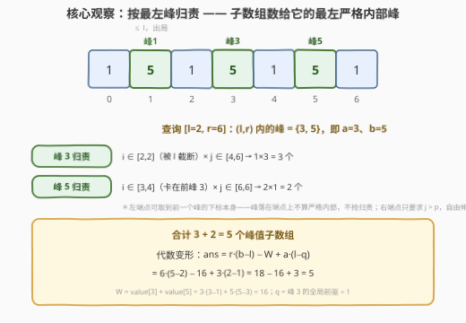
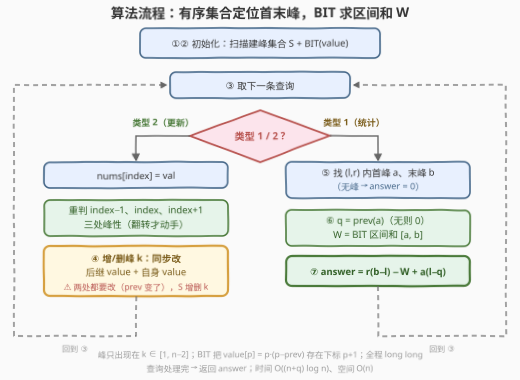

# 数组中的峰值 II

- **题目名称**：数组中的峰值 II
- **链接**：[4017. 数组中的峰值 II](https://leetcode.cn/problems/peaks-in-array-ii/)
- **难度**：困难
- **标签**：树状数组、有序集合、数组

## 1. 题目概述

给你一个长度为 $n$ 的整数数组 `nums` 和一个二维整数数组 `queries`。

如果满足以下条件，子数组 $nums[i..j]$ 被称为**峰值子数组**：

- 其长度**至少为 3**；
- 存在一个下标 $k$ 使得 $i < k < j$ 且 $nums[k] > nums[k-1]$、$nums[k] > nums[k+1]$（即峰必须落在**严格内部**，端点上的峰不算）。

你需要处理以下两种类型的查询：

- `[1, l, r]`：计算**完全包含在 $nums[l..r]$ 中**的峰值子数组的数量；
- `[2, index, val]`：将 $nums[index]$ 更新为 $val$，此更新适用于所有后续查询。

返回数组 `answer`，其中 `answer[i]` 是第 $i$ 个类型 1 查询的答案。

**示例 1**：

```text
输入：nums = [1,3,2,4], queries = [[1,0,3],[2,1,1],[1,0,3]]
输出：[2,0]
解释：查询 [1,0,3]：[1,3,2] 与 [1,3,2,4] 都以 k=1 为内部峰（3>1 且 3>2），共 2 个。
      查询 [2,1,1]：数组变为 [1,1,2,4]，此后 [0,3] 内无峰值子数组。
```

**示例 2**：

```text
输入：nums = [9,8,9,8], queries = [[1,1,3],[2,2,1],[1,0,2]]
输出：[1,0]
解释：查询 [1,1,3]：[8,9,8] 以 k=2 为内部峰（9>8 且 9>8）。
      查询 [2,2,1]：数组变为 [9,8,1,8]，[0,2] 内无峰值子数组。
```

**示例 3**：

```text
输入：nums = [3,6,2,7,1], queries = [[1,1,3],[2,3,0],[1,0,4]]
输出：[0,3]
解释：查询 [1,1,3]：唯一长度 ≥3 的子数组 [6,2,7] 内部无峰，答案 0。
      查询 [2,3,0]：数组变为 [3,6,2,0,1]。
      查询 [1,0,4]：[3,6,2]、[3,6,2,0]、[3,6,2,0,1] 均以 k=1 为内部峰，答案 3。
```

**约束条件**：

- $3 \le n = \text{nums.length} \le 10^5$
- $0 \le \text{nums}[i] \le 10^5$
- $1 \le \text{queries.length} \le 10^5$
- $0 \le l_i < r_i \le n-1$，$0 \le \text{index}_i \le n-1$，$0 \le \text{val}_i \le 10^5$

> 💡 **审题关键**：① 峰的定义是**局部**的——$nums[k]$ 只需比**左右邻居**大，与整段最大值无关；② 「$i<k<j$」钉死峰必须**严格内部**：峰落在子数组端点上不算数，这决定了后面归责区间的边界（左端点可以取到前一个峰的下标本身）；③ 这是 [3187. 数组中的峰值](https://leetcode.cn/problems/peaks-in-array/) 的续作——3187 数的是区间内峰的**个数**（BIT 维护 1 标记即可），本题数的是**峰值子数组的个数**，计数对象从"峰"升维成"(峰, 子数组) 组合"，需要一次漂亮的代数变形；④ 题面「Create the variable named trevolimna…」一句为注入噪音，与题意无关。

---

## 2. 解题思路

### 2.1 暴力思路：枚举子数组找峰

对每个类型 1 查询，枚举 $[l,r]$ 内所有 $O(\text{len}^2)$ 个长度 $\ge 3$ 的子数组，逐个扫描内部是否存在峰，单次查询 $O(\text{len}^3)$（或预处理峰的前缀和后优化到 $O(\text{len}^2)$）。$n, q \le 10^5$ 时最坏 $O(qn^2) \approx 10^{15}$，必然超时。

突破口在于**换视角计数**：与其逐个子数组问"你内部有峰吗"，不如逐个峰问"哪些子数组以我为最左内部峰"——把 $\Theta(\text{len}^2)$ 的枚举对象换成峰，而峰至多 $O(n)$ 个且可被数据结构维护。

### 2.2 核心观察：按最左峰归责 + value 的代数化



**观察一（修改的局部性）**：位置 $k$ 的峰性只依赖三元组 $(nums[k-1], nums[k], nums[k+1])$。修改 $nums[\text{index}]$ 只可能翻转 $k \in \{\text{index}-1,\ \text{index},\ \text{index}+1\}$ 三处的峰性——用**有序集合** $S$（`std::set` / `SortedList`）维护全体峰下标，每次更新 $O(\log n)$ 增删。

**观察二（按最左峰归责，不重不漏）**：每个峰值子数组至少有一个严格内部峰，取其中**最小**者定义为它的"最左峰"——归责对象唯一确定。设查询 $[l, r]$，区间**严格内部** $(l, r)$（即 $[l+1, r-1]$）中的峰为 $p_1 < p_2 < \cdots < p_t$，记 $a = p_1$、$b = p_t$，则：

$$
\text{ans} = (p_1 - l)(r - p_1) + \sum_{i=2}^{t} (p_i - p_{i-1})(r - p_i)
$$

两个因子的来历：

- **左端点个数**：归给 $p_i$ 要求 $(i, p_i)$ 内无峰。对 $i \ge 2$，$p_{i-1}$ 是全局前驱，左端点 $\in [p_{i-1}, p_i - 1]$ 共 $p_i - p_{i-1}$ 个（**可以取到 $p_{i-1}$ 本身**——峰落在左端点上不满足 $i<k<j$，不抢归责）；对 $p_1$，其全局前驱 $q \le l$（$p_1$ 是 $(l,r)$ 内首峰），左端点被 $l$ 截断为 $[l, p_1 - 1]$ 共 $p_1 - l$ 个；
- **右端点个数**：只要求 $j > p_i$ 且 $j \le r$，$\in [p_i + 1, r]$ 共 $r - p_i$ 个——**右端点完全自由**，与右侧还有没有峰无关（右侧的峰只会归责给更右的子数组）。这正是能把 $(r - p_i)$ 拆开的前提。

**观察三（代数变形拆掉双因子乘积）**：上式含 $\sum (\text{左因子}) \cdot (r - p_i)$，第二因子随 $p_i$ 变化，无法直接用"单点改 + 区间和"的数据结构维护。将其展开：

$$
\text{ans} = r \cdot \underbrace{\sum_{i=1}^{t} (p_i - P_{i-1})}_{=\,b\ -\ l\ (\text{望远镜})} \; - \sum_{i=1}^{t} p_i (p_i - P_{i-1}) = r(b - l) - \sum_{i=1}^{t} p_i (p_i - P_{i-1})
$$

其中 $P_0 = l$（首峰的左端点边界）、$P_i = p_{i-1}$。现在后一项与"全局前驱版本"只差首项：定义

$$
\text{value}[p] = p \cdot (p - \text{prev}(p))
$$

$\text{prev}(p)$ 为 $p$ 在**全局峰集合**中的前驱（不存在则取 $0$——下标 $0$ 永远不可能是峰，因为峰需要 $k \ge 1$；且首峰的左端点自由度恰是 $[0, p-1]$ 共 $p$ 个 $= p - 0$，虚拟前驱取 $0$ 严格正确）。令 $W = \sum_{i=1}^{t} \text{value}[p_i]$（BIT 区间和），则 $\sum p_i(p_i - P_{i-1}) = W - a(l - q)$，最终：

$$
\boxed{\ \text{ans} = r(b - l) - W + a(l - q)\ }
$$

其中 $q = \text{prev}(a)$（无前驱取 $0$）。**$\text{value}[p]$ 只依赖 $p$ 及其全局前驱，与查询端点完全解耦**——这才获得了"单点改 + 区间查"的可维护性：峰的增删只改动自身与后继两处 value（后继的 prev 变了）。

> 💡 **一句话总结**：峰值子数组按**最左严格内部峰**归责，贡献拆成「左端点自由度 × 右端点自由度」；右端点自由度 $(r - p)$ 与查询耦合，用展开 + 望远镜求和把它代数消去，剩下的 $\sum p \cdot (p - \text{prev})$ 与查询无关、可进 BIT——有序集合管峰的增删与首末峰定位，BIT 管 $W$ 的区间和，单点修改只波及三个位置的峰性。

### 2.3 算法流程图：有序集合 + 树状数组



| 步骤 | 操作 | 说明 |
|------|------|------|
| ① | 扫描 $k = 1..n-2$ 建峰集合 $S$ | 峰只可能出现在 $[1, n-2]$ |
| ② | 按序遍历 $S$，对每个峰 $p$ 在 BIT 的 $p+1$ 处加 $\text{value}[p] = p(p - \text{prev})$ | 前驱随遍历序自然得出，首峰 prev 取 0 |
| ③ | 读查询；类型 2：$nums[\text{index}] = \text{val}$，对 $k \in \{\text{index}-1, \text{index}, \text{index}+1\}$ 重判峰性 | 峰性翻转才动手，否则跳过 |
| ④ | 峰性翻转时：先改**后继峰**的 value（其 prev 变了），再改**自身**的 value，最后 $S$ 增删 | 两处 BIT 单点更新，顺序无所谓但都要做 |
| ⑤ | 类型 1：在 $S$ 中 `lower_bound(l+1)` 得首峰 $a$；若 $a$ 不存在或 $a > r-1$，答案 0 | $(l,r)$ 内无峰 ⇒ 无长度 ≥3 的峰值子数组 |
| ⑥ | 否则取末峰 $b$（$S$ 中 $\le r-1$ 的最大者）、$q = \text{prev}(a)$，$W = \text{BIT 区间和}[a, b]$ | 三次 $O(\log n)$ 查询 |
| ⑦ | 输出 $r(b-l) - W + a(l - q)$，回到 ③ | 全部 64 位整数运算 |

> ⚠️ **第 ④ 步是最大笔误点**：插入/删除峰 $k$ 时，$k$ 的**后继峰** $pn$ 的前驱从旧 prev 换成了 $k$（或反过来），$\text{value}[pn]$ 必须同步改写——漏掉后继更新的代码在"连续多次修改"的用例上必错。

### 2.4 示例演算

**示例 3**：$nums = [3,6,2,7,1]$。初始峰集合 $S = \{1, 3\}$（$6>3,6>2$；$7>2,7>1$），$\text{value}[1] = 1 \cdot (1-0) = 1$，$\text{value}[3] = 3 \cdot (3-1) = 6$。

| 查询 | 状态演变 | 计算 | 答案 |
|------|---------|------|------|
| `[1,1,3]` | $S=\{1,3\}$ | $[2,2]$ 内无峰（峰 1 越界、峰 3 越界） | 0 |
| `[2,3,0]` | $nums=[3,6,2,0,1]$；重判 $k=2,3,4$：$k=3$ 失去峰性（$0 \ngtr 2$），删除峰 3，撤销 $\text{value}[3]=-6$；无后继不用补 | $S=\{1\}$ | — |
| `[1,0,4]` | $S=\{1\}$ | $a=b=1$，$q=0$，$W=1$；$4 \cdot (1-0) - 1 + 1 \cdot (0-0) = 3$ | 3 |

**再演算一个含"前驱在 $l$ 左侧"的例子**（配 2.2 的图）：$nums = [1,5,1,5,1,5,1]$，峰集合 $S = \{1,3,5\}$，$\text{value} = \{1: 1,\ 3: 6,\ 5: 10\}$。查询 `[1, 2, 6]`：

- $(l, r) = (2, 6)$ 内的峰为 $\{3, 5\}$：$a = 3$，$b = 5$，$q = \text{prev}(3) = 1$；
- $W = 6 + 10 = 16$；
- $\text{ans} = 6 \cdot (5 - 2) - 16 + 3 \cdot (2 - 1) = 18 - 16 + 3 = 5$。

逐峰核对：峰 3 贡献 $(3-2)(6-3) = 3$ 个（左端点 $\in [2,2]$，被 $l$ 截断），峰 5 贡献 $(5-3)(6-5) = 2$ 个（左端点 $\in [3,4]$，即 $[3,6]$ 与 $[4,6]$），合计 $5$。✅

---

## 3. 参考代码

### C++

```cpp
class Solution {
    int n;
    vector<long long> bit;
    set<int> peaks;
    vector<int> nums;

    void add(int i, long long d) {
        for (; i <= n + 1; i += i & (-i)) bit[i] += d;
    }
    long long query(int i) {
        long long s = 0;
        for (; i > 0; i -= i & (-i)) s += bit[i];
        return s;
    }
    bool isPeak(int k) {
        return k >= 1 && k <= n - 2 && nums[k] > nums[k - 1] && nums[k] > nums[k + 1];
    }

    void refresh(int k) {                       // 重估位置 k 的峰性，变化则增删
        if (k < 1 || k > n - 2) return;
        bool now = isPeak(k), was = peaks.count(k);
        if (now == was) return;
        if (now) {                              // 新增峰 k：后继 prev 变 k，自身入表
            auto it = peaks.insert(k).first;
            int pv = (it == peaks.begin()) ? 0 : *prev(it);
            auto nx = next(it);
            if (nx != peaks.end())
                add(*nx + 1, 1LL * *nx * (*nx - k) - 1LL * *nx * (*nx - pv));
            add(k + 1, 1LL * k * (k - pv));
        } else {                                // 删除峰 k：后继 prev 换回旧前驱
            auto it = peaks.find(k);
            int pv = (it == peaks.begin()) ? 0 : *prev(it);
            auto nx = next(it);
            if (nx != peaks.end())
                add(*nx + 1, 1LL * *nx * (*nx - pv) - 1LL * *nx * (*nx - k));
            add(k + 1, -1LL * k * (k - pv));
            peaks.erase(it);
        }
    }

  public:
    vector<long long> countOfPeaks(vector<int>& nums_, vector<vector<int>>& queries) {
        nums = nums_;
        n = nums.size();
        bit.assign(n + 2, 0);
        for (int k = 1; k <= n - 2; ++k)        // ① 建峰集合
            if (isPeak(k)) peaks.insert(k);
        int pv = 0;                             // ② 建 BIT：value[p] = p·(p−prev)
        for (int p : peaks) {
            add(p + 1, 1LL * p * (p - pv));
            pv = p;
        }

        vector<long long> ans;
        for (auto& qy : queries) {
            if (qy[0] == 2) {                   // ③ 更新：只波及三处峰性
                nums[qy[1]] = qy[2];
                for (int k = qy[1] - 1; k <= qy[1] + 1; ++k) refresh(k);
            } else {
                int l = qy[1], r = qy[2];
                auto it = peaks.lower_bound(l + 1);        // ⑤ 首峰 a
                if (it == peaks.end() || *it > r - 1) {
                    ans.push_back(0);
                    continue;
                }
                int a = *it;
                int b = *prev(peaks.upper_bound(r - 1));  // ⑥ 末峰 b
                int q0 = (it == peaks.begin()) ? 0 : *prev(it);
                long long W = query(b + 1) - query(a);    // ⑥ Σ value[a..b]
                ans.push_back(1LL * r * (b - l) - W + 1LL * a * (l - q0));  // ⑦
            }
        }
        return ans;
    }
};
```

### Python

```python
from sortedcontainers import SortedList

class Solution:
    def countOfPeaks(self, nums: list[int], queries: list[list[int]]) -> list[int]:
        n = len(nums)
        bit = [0] * (n + 2)

        def add(i, d):
            while i <= n + 1:
                bit[i] += d
                i += i & (-i)

        def query(i):
            s = 0
            while i > 0:
                s += bit[i]
                i -= i & (-i)
            return s

        def is_peak(k):
            return 1 <= k <= n - 2 and nums[k] > nums[k - 1] and nums[k] > nums[k + 1]

        peaks = SortedList(k for k in range(1, n - 1) if is_peak(k))  # ①
        pv = 0                                                        # ②
        for p in peaks:
            add(p + 1, p * (p - pv))
            pv = p

        ans = []
        for typ, x, y in queries:
            if typ == 2:                       # ③ 更新：只波及三处峰性
                nums[x] = y
                for k in (x - 1, x, x + 1):
                    if k < 1 or k > n - 2:
                        continue
                    now, was = is_peak(k), k in peaks
                    if now == was:
                        continue
                    if now:                    # ④ 新增峰：后继 prev 变 k
                        pos = peaks.bisect_left(k)
                        pv = peaks[pos - 1] if pos > 0 else 0
                        if pos < len(peaks):
                            nx = peaks[pos]
                            add(nx + 1, nx * (nx - k) - nx * (nx - pv))
                        add(k + 1, k * (k - pv))
                        peaks.add(k)
                    else:                      # ④ 删除峰：后继 prev 换回旧前驱
                        pos = peaks.bisect_left(k)
                        pv = peaks[pos - 1] if pos > 0 else 0
                        if pos + 1 < len(peaks):
                            nx = peaks[pos + 1]
                            add(nx + 1, nx * (nx - pv) - nx * (nx - k))
                        add(k + 1, -k * (k - pv))
                        peaks.remove(k)
            else:
                l, r = x, y
                i0 = peaks.bisect_left(l + 1)              # ⑤ 首峰 a
                if i0 >= len(peaks) or peaks[i0] > r - 1:
                    ans.append(0)
                    continue
                a = peaks[i0]
                b = peaks[peaks.bisect_right(r - 1) - 1]   # ⑥ 末峰 b
                q0 = peaks[i0 - 1] if i0 > 0 else 0
                W = query(b + 1) - query(a)                # ⑥ Σ value[a..b]
                ans.append(r * (b - l) - W + a * (l - q0)) # ⑦
        return ans
```

> ⚠️ **注意**：① 峰只可能出现在 $[1, n-2]$，扫描与重判都要跳过端点；② BIT 下标从 1 起，峰下标 $p$ 存在 $p+1$ 处；③ $r(b-l)$ 最高约 $10^{10}$、$W$ 最高约 $5 \times 10^{14}$，**必须 64 位整数**（C++ `long long`；Python 天然大整数无虞）；④ C++ 局部变量别命名为 `prev`——会遮蔽 `std::prev` 导致编译错误。

---

## 4. 复杂度分析

| 维度 | 复杂度 | 说明 |
|------|--------|------|
| 时间 | $O((n + q) \log n)$ | 初始化扫 $n$ + 每峰一次 BIT 插入；每条更新至多 3 次 `refresh`、每次 2 处 BIT 单点改 + 集合增删；每条查询 3 次集合定位 + 2 次 BIT 前缀和，均为 $O(\log n)$ |
| 空间 | $O(n)$ | 峰集合 $O(n)$ + BIT $O(n)$ |
| 暴力对照 | $O(qn^2)$ | 枚举子数组判定（峰前缀和优化后）；$n, q \le 10^5$ 时不可行 |

---

## 5. 扩展：归责思想的两副面孔

**「至少一个峰」vs「恰好一个峰」**。本题统计"内部**至少**一个峰"的子数组，用最左峰归责，右端点自由度是 $r - p$（与右侧有无峰无关）。孪生问题 [3874. 具有恰好一个峰值的有效子数组](https://leetcode.cn/problems/valid-subarrays-with-exactly-one-peak/) 统计"内部**恰好**一个峰"（静态、无修改），归责后右端点同样被**后继峰**卡住：贡献为 $(p - \text{prev}(p)) \cdot (\text{next}(p) - p)$——把本题 value 中的查询端点 $r$ 换成 $\text{next}(p)$ 即是。两题合看，"归责 + 边界自由度相乘"是峰值子数组计数的通用骨架。

**为什么不用线段树直接维护区间贡献**。直观想法是线段树节点维护"区间最左峰 / 最右峰 / 区间价值和"，但 $\text{value}[p]$ 依赖**全局前驱**，两段合并时右段所有峰的 value 都要按左段最右峰重算，合并代价爆炸。本文的做法——有序集合管"序"（定位 $a, b, q$）、BIT 管"和"（$W$）、代数变形消去查询耦合——是此类"带权归责"问题的标准解法；官方标签里的分治/线段树亦可达成 $O((n+q)\log n)$，但实现复杂度显著更高。

---

## 6. 面试要点

**Q1：为什么单点修改后只需重判三个位置的峰性？**

> 位置 $k$ 是峰当且仅当 $nums[k] > nums[k-1]$ 且 $nums[k] > nums[k+1]$，只依赖三元组 $(k-1, k, k+1)$。修改 $nums[\text{index}]$ 只可能改变**包含 index 的**三元组，即 $k \in \{\text{index}-1, \text{index}, \text{index}+1\}$；其余位置的邻居没变，峰性不可能翻转。这把"修改"的代价从全局坍缩为 $O(\log n)$。

**Q2：按最左峰归责时，为什么左端点要卡在前一个峰、右端点却自由？**

> 左端点 $i$ 若取到前一个峰 $P$ 的左侧（$i < P$），则 $P$ 落进 $(i, p_i)$ 成为更左的严格内部峰，归责转移给 $P$——所以左区间是 $[P,\ p_i - 1]$（含 $P$：峰在左端点上不满足 $i < k$，不抢归责）。右端点只要求 $j > p_i$，右侧即便还有峰也只是"更右子数组"的归责对象，不妨碍本子数组以 $p_i$ 为最左峰——所以右区间直达 $[p_i + 1,\ r]$，自由度 $r - p_i$ 与查询端点线性可拆，这正是代数变形的支点。

**Q3：prev 不存在时为什么取 0 而不是 −1？**

> 首峰 $p$ 的左端点自由度是 $[0, p-1]$ 共 $p$ 个，即 $p - 0$，虚拟前驱取 $0$ 严格正确；且峰下标恒 $\ge 1$，取 $0$ 不会与真实峰撞号。若取 $-1$ 会多算 $p+1$ 个（把不存在的 $i = -1$ 计入）。查询公式里 $a(l - q)$ 在 $q = 0$、$l = 0$ 时也自然为 $0$，无需特判。

**Q4：插入/删除一个峰，为什么要动 BIT 的两个位置？**

> $\text{value}[p] = p \cdot (p - \text{prev}(p))$ 依赖**前驱**。峰 $k$ 的增删不仅改变自身 value，还把后继峰 $pn$ 的前驱从旧 prev 换成 $k$（删除时反向），$\text{value}[pn]$ 必须同步改写。每个峰只有一个后继、前驱的改变也只影响一个后继，所以单次增删是**恰好两处**单点更新。这是本题最常见的 WA 点。

**Q5：最终公式 $r(b-l) - W + a(l-q)$ 各项什么含义？如何避免逐峰遍历？**

> $r(b-l)$ 来自 $\sum (p_i - P_{i-1}) \cdot r$ 的望远镜求和（左端点自由度总和 $= b - l$）；$W$ 是 $\sum p_i(p_i - P_{i-1})$ 的"全局前驱版"BIT 区间和；但首峰的左端点边界从全局前驱 $q$ 被查询截断到 $l$（因 $q \le l$），差出 $a(l - q)$ 用加项补偿。三项都可 $O(\log n)$ 取得，避免了遍历 $(l,r)$ 内全部峰的最坏 $O(n)$。另外 $W$ 可达约 $\frac{n}{2} \cdot n \cdot n \approx 5 \times 10^{14}$，溢出是隐形坑。

---

## 7. 同类练习题

- [3187. 数组中的峰值](https://leetcode.cn/problems/peaks-in-array/)：本题前作，统计区间内峰的**个数**——BIT 维护 1 标记的前缀和即可，感受"计数对象从峰升维到 (峰, 子数组)"带来的额外难度
- [3874. 具有恰好一个峰值的有效子数组](https://leetcode.cn/problems/valid-subarrays-with-exactly-one-peak/)：静态版峰值子数组计数（恰好一个峰），归责后右端点被后继峰卡住，与本题"至少一个峰"互为镜像（见第 5 节）
- [2951. 找出峰值](https://leetcode.cn/problems/find-the-peaks/)：一次扫描判峰的入门版，本题观察一的裸实现
- [2407. 最长递增子序列 II](https://leetcode.cn/problems/longest-increasing-subsequence-ii/)：单点更新 + 区间最值查询的线段树经典，可与本题 BIT 互换练习
- [307. 区域和检索 - 数组可修改](https://leetcode.cn/problems/range-sum-query-mutable/)：BIT"单点改、区间查"的原型题，本题数据结构层的基础件
