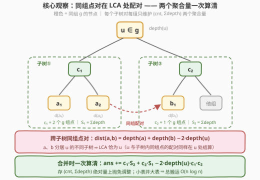
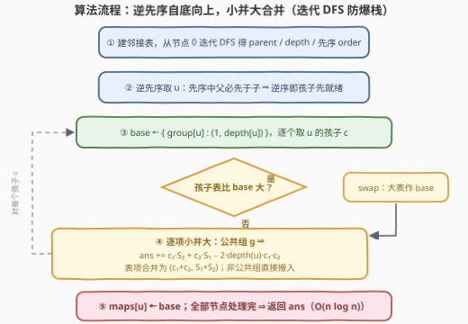

# LeetCode 树组的交互代价总和 II 题解

## 1. 题目概述

- **标题 / 题号**：树组的交互代价总和 II（#4018，hard）
- **链接**：https://leetcode.cn/problems/total-sum-of-interaction-cost-in-tree-groups-ii/
- **难度**：困难
- **标签**：树、深度优先搜索、数组、排序

> ⚠️ 本题为 LeetCode 付费题，题意描述根据官方示例用例与 hints 重建（题干与姐妹题 [3786. 树组的交互代价总和](https://leetcode.cn/problems/total-sum-of-interaction-cost-in-tree-groups/) 一致，仅约束不同），可能与官方题面有出入。

**题意**：给你一个整数 $n$ 和一棵包含 $n$ 个节点、编号从 $0$ 到 $n-1$ 的无向树。树由长度为 $n-1$ 的二维数组 `edges` 表示，`edges[i] = [u_i, v_i]` 表示节点 $u_i$ 与 $v_i$ 之间存在一条无向边。

同时给定长度为 $n$ 的整数数组 `group`，其中 `group[i]` 表示分配给节点 $i$ 的组标签。若 `group[u] == group[v]`，则认为节点 $u$ 和 $v$ 属于**同一组**。

**交互代价**定义为节点 $u$ 和 $v$ 之间唯一路径上的**边数**。

返回所有满足条件的**无序**节点对 $(u, v)$（其中 $u \ne v$ 且 `group[u] == group[v]`）的交互代价之和。如果没有这样的节点对，返回 $0$。

**示例 1**：

```text
输入：n = 3, edges = [[0,1],[1,2]], group = [1,1,1]
输出：4
解释：所有节点都属于组 1，节点对的交互代价：
     (0,1)=1，(1,2)=1，(0,2)=2，总和 1+1+2 = 4。
```

**示例 2**：

```text
输入：n = 3, edges = [[0,1],[1,2]], group = [3,2,3]
输出：2
解释：节点 0 和 2 同属组 3，交互代价为 2；节点 1 独占组 2，无有效点对。
```

**示例 3**：

```text
输入：n = 4, edges = [[0,1],[0,2],[0,3]], group = [1,1,4,4]
输出：3
解释：组 1 点对 (0,1) 代价 1；组 4 点对 (2,3) 代价 2；总和 3。
```

**示例 4**：

```text
输入：n = 2, edges = [[0,1]], group = [1,2]
输出：0
解释：两节点分属不同组，无有效点对。
```

**约束条件**（重建口径）：

- $1 \le n \le 10^5$
- `edges.length == n - 1`，`edges[i] = [u_i, v_i]`，$0 \le u_i, v_i \le n-1$，输入保证是一棵有效的树
- `group.length == n`，$1 \le \text{group[i]} \le 10^5$（**组标签无小上界**——这是与 I 版的本质差异，官方 hints 给出的虚树 / 启发式合并两条解法路线正为此设计）

> 💡 **审题关键**：① 距离按**边数**计（每条边权重视作 1）；② 求的是**同组点对**的距离和，不是全部点对；③ 与姐妹题 3786（组标签 $\le 20$）相比，II 版组标签规模放开到与 $n$ 同阶——I 版「每条边维护 20 个组计数器」的一趟 DFS 在 II 中开不出数组、退化 $O(n^2)$，必须换思路；④ 答案上界：全树同组 + 链形态时 $\sum_{i<j}(j-i) = \binom{n+1}{3} \approx 1.7 \times 10^{14}$（$n=10^5$），**32 位整数必溢出**；⑤ $n$ 可达 $10^5$，链形态递归 DFS 深度爆栈，须迭代遍历。

## 2. 解题思路

### 2.1 暴力思路

最朴素：枚举全部同组点对，逐对求距离（爬父链或 LCA）。$n = 10^5$ 时点对数量级 $5 \times 10^9$，必然超时。

姐妹题 I（3786）的做法是**逐边贡献**：删去任意一条树边 $e$，树裂成两个连通块，若某个组 $g$ 在一侧有 $x$ 个节点、全树共 $k$ 个节点，则该组恰有 $x \cdot (k - x)$ 个点对的路径**穿过** $e$，边 $e$ 对答案的贡献为 $\sum_g x_g \cdot (k_g - x_g)$。I 版组标签 $\le 20$，单趟 DFS 递推「子树内各组计数」即可，$O(20n)$。

II 版组标签无小上界：逐边贡献式依然成立，但「子树内各组计数」只能用**哈希表**维护，而朴素地自底向上逐项合并，链形态下表长 $1+2+\cdots+n$，总代价 $O(n^2)$。瓶颈清晰：**组数太多，计数器开不出来**。

### 2.2 核心观察：在 LCA 处配对，$(\text{cnt}, \Sigma\text{depth})$ 一条式子结算全部跨子树点对



**观察一（每个点对恰在其 LCA 处结算一次）**：自底向上看节点 $u$——$u$ 各孩子子树**内部**的同组点对已在更深处被结算，剩下没算的只有**跨子树**的点对：$a$ 在某个孩子子树、$b$ 在另一个孩子子树（或 $b$ 就是 $u$ 本身）。这些点对的公共祖先恰为 $u$。于是把 $u$ 处的各子集合两两合并，每合并一次就结算「新跨出」的点对——全树每个同组点对**恰被计入一次**。

**观察二（距离拆成深度差）**：跨 $u$ 配对的点对满足

$$\text{dist}(a,b) = \text{depth}(a) + \text{depth}(b) - 2 \cdot \text{depth}(u)$$

**观察三（聚合量一条式子算清）**：给每个子树集合、每个组 $g$ 只维护两个数——点数 $c$ 与**深度和** $S$（组内各节点 `depth` 之和）。合并两侧时，组 $g$ 的全部 $c_1 c_2$ 个跨点对的距离和**不需要逐对算**：

$$\sum_{\substack{a \in \text{侧}_1 \\ b \in \text{侧}_2}} \text{dist}(a,b) = c_1 S_2 + c_2 S_1 - 2 \cdot \text{depth}(u) \cdot c_1 c_2$$

每个组 $O(1)$ 结算。注意存的是 $\Sigma\text{depth}$ 这个**绝对量**而非「到子树根的距离和」——后者每上抛一层全体 $+c$，逐层调整的代价无法摊销；深度是全局量，上抛免维护。

**怎么合并才快（启发式合并）**：每个节点一张哈希表 `group → (cnt, Σdepth)`。把孩子的表并入父表时**永远把小的并进大的**：一个表项每被搬运一次，它所在表的规模至少翻倍，故每个表项至多被搬运 $\lceil \log_2 n \rceil \approx 17$ 次，总代价 $O(n \log n)$——这正是组标签无上界也扛得住的关键。

> 💡 **一句话总结**：同组点对在 LCA 处「两侧相遇、恰结算一次」；每侧只留 $(\text{cnt}, \Sigma\text{depth})$ 两个聚合量，跨子树距离和 $c_1 S_2 + c_2 S_1 - 2\,\text{depth}(u)\, c_1 c_2$ 一条式子算清；小表并大表把总代价压到 $O(n \log n)$。

### 2.3 算法流程图



| 步骤 | 操作 | 说明 |
|------|------|------|
| ① | 建邻接表；从节点 0 迭代 DFS | 求出 `parent`、`depth` 与**先序序列** `order`，$O(n)$，迭代防链爆栈 |
| ② | 按 `order` **逆序**逐点处理 $u$ | 先序中父必先于子 ⇒ 逆序保证「孩子先于父亲」就绪，天然的后序合并序 |
| ③ | `base ← {group[u]: (1, depth[u])}` | $u$ 自己先入表，作为合并的种子 |
| ④ | 逐个孩子 $c$：若其表更大先 `swap`（小并大），再逐项并入 | 公共组结算贡献并合并表项；非公共组直接搬入 |
| ⑤ | `maps[u] ← base`，处理下一个节点 | 全部节点完成后返回 `ans` |

### 2.4 示例演算

**示例 1**：`n = 3, edges = [[0,1],[1,2]], group = [1,1,1]`。以 0 为根，`depth = [0,1,2]`，先序 `order = [0,1,2]`，逆序处理 $u = 2, 1, 0$：

| 处理节点 | base（并入前） | 并入的孩子表 | 公共组结算 | 贡献 |
|---|---|---|---|---|
| $u=2$ | $\{1: (1,2)\}$ | —（叶子无孩子） | — | $0$ |
| $u=1$ | $\{1: (1,1)\}$ | $\{1: (1,2)\}$ | $1 \cdot 2 + 1 \cdot 1 - 2 \cdot 1 \cdot 1 \cdot 1 = 1$ | $1$ |
| $u=0$ | $\{1: (1,0)\}$ | $\{1: (2,3)\}$ | $2 \cdot 0 + 1 \cdot 3 - 2 \cdot 0 \cdot 2 \cdot 1 = 3$ | $3$ |

总和 $1 + 3 = \mathbf{4}$ ✓。$u=1$ 处结算点对 $(1,2)$（距离 1）；$u=0$ 处一次结算 $(0,1)$、$(0,2)$（距离 $1+2=3$）——聚合量的威力：两点对一趟算清。

**示例 2**：`group = [3,2,3]`。$u=2$ 得 $\{3:(1,2)\}$；$u=1$ 自身 $\{2:(1,1)\}$ 与孩子表无公共组、贡献 $0$；$u=0$ 自身 $\{3:(1,0)\}$ 并入孩子表 $\{2:(1,1),\,3:(1,2)\}$，组 2 无公共贡献 $0$，组 3 结算 $1 \cdot 0 + 1 \cdot 2 - 0 = 2$。总和 $\mathbf{2}$ ✓。

## 3. 参考代码

### C++

```cpp
class Solution {
  public:
    long long interactionCosts(int n, vector<vector<int>>& edges, vector<int>& group) {
        vector<vector<int>> adj(n);
        for (auto& e : edges) {
            adj[e[0]].push_back(e[1]);
            adj[e[1]].push_back(e[0]);
        }
        // ① 迭代先序 DFS：parent / depth / order（链深 1e5，不递归）
        vector<int> parent(n, -1), depth(n, 0), order;
        order.reserve(n);
        vector<char> seen(n, 0);
        vector<int> st = {0};
        seen[0] = 1;
        while (!st.empty()) {
            int u = st.back(); st.pop_back();
            order.push_back(u);
            for (int v : adj[u]) if (!seen[v]) {
                seen[v] = 1; parent[v] = u; depth[v] = depth[u] + 1;
                st.push_back(v);
            }
        }
        vector<vector<int>> children(n);
        for (int v = 1; v < n; ++v) children[parent[v]].push_back(v);

        // ②~⑤ 逆先序（孩子先于父亲）自底向上合并
        using Map = unordered_map<int, pair<long long, long long>>; // 组 -> (cnt, Σdepth)
        vector<Map> maps(n);
        long long ans = 0;
        for (int i = n - 1; i >= 0; --i) {
            int u = order[i];
            maps[u][group[u]] = {1, depth[u]};               // ③ 自身入表
            for (int c : children[u]) {                      // ④ 逐孩子并入
                if (maps[u].size() < maps[c].size()) maps[u].swap(maps[c]); // 小并大
                Map& big = maps[u];
                Map& small = maps[c];
                long long du = 2LL * depth[u];
                for (auto& [g, pr] : small) {
                    long long c1 = pr.first, s1 = pr.second;
                    auto it = big.find(g);
                    if (it != big.end()) {                   // 公共组：一条式子结算
                        long long c2 = it->second.first, s2 = it->second.second;
                        ans += c1 * s2 + c2 * s1 - du * c1 * c2;
                        it->second = {c1 + c2, s1 + s2};
                    } else {
                        big.emplace(g, pr);                  // 新组：直接搬入
                    }
                }
                Map().swap(maps[c]);                         // 及时释放孩子表
            }
        }
        return ans;
    }
};
```

> 💡 **写法要点**：
> - `maps[u].swap(maps[c])` 交换后 `big`/`small` 引用仍绑定原容器、内容已互换——「大表作底、小表逐项并入」一次判断完成，无须真正搬动大表；
> - 乘法先转 `long long`：单项 $c_1 S_2 \le 10^5 \times (10^5 \times 10^5) = 10^{15}$，`du * c1 * c2` 已声明 `long long` 故安全；
> - 遍历 `small` 时向 `big` 插入不失效 `small` 的迭代器（两个不同容器），这是本写法成立的前提；
> - `Map().swap(maps[c])` 立即释放孩子表内存，峰值空间 $O(n)$。

### Python

```python
class Solution:
    def interactionCosts(self, n: int, edges: List[List[int]], group: List[int]) -> int:
        adj = [[] for _ in range(n)]
        for u, v in edges:
            adj[u].append(v)
            adj[v].append(u)

        # ① 迭代先序 DFS：parent / depth / order（链深 1e5，不递归）
        parent = [-1] * n
        depth = [0] * n
        order = []
        seen = [False] * n
        seen[0] = True
        st = [0]
        while st:
            u = st.pop()
            order.append(u)
            for v in adj[u]:
                if not seen[v]:
                    seen[v] = True
                    parent[v] = u
                    depth[v] = depth[u] + 1
                    st.append(v)

        children = [[] for _ in range(n)]
        for v in order[1:]:
            children[parent[v]].append(v)

        # ②~⑤ 逆先序（孩子先于父亲）自底向上合并
        maps = [None] * n
        ans = 0
        for u in reversed(order):
            base = {group[u]: [1, depth[u]]}                # ③ 自身入表
            for c in children[u]:                           # ④ 逐孩子并入
                m = maps[c]
                if len(m) > len(base):                      # 小并大：大表作底
                    base, m = m, base
                for g, (c1, s1) in m.items():
                    e = base.get(g)
                    if e is not None:                       # 公共组：一条式子结算
                        c2, s2 = e
                        ans += c1 * s2 + c2 * s1 - 2 * depth[u] * c1 * c2
                        base[g] = [c1 + c2, s1 + s2]
                    else:
                        base[g] = [c1, s1]
                maps[c] = None                              # 及时释放孩子表
            maps[u] = base
        return ans
```

> 💡 **写法要点**：
> - `base, m = m, base` 只交换两个局部名字：交换后 `base` 指向大表、`m` 指向小表，`maps[c]` 仍持有原对象，置 `None` 即可丢弃；
> - `reversed(order)` 天然保证孩子先于父亲（先序中父必先于子），无需显式后序栈；
> - Python 整数任意精度，无溢出之忧；实测 $n = 10^5$ 链 / 完全二叉树 / 星形全同组均在 0.3 秒内。

## 4. 复杂度分析

| 维度 | 复杂度 | 说明 |
|------|--------|------|
| 时间 | $O(n \log n)$ | 建树与 DFS $O(n)$；启发式合并中每个表项至多被搬运 $\lceil \log_2 n \rceil$ 次（每次搬运所在表规模至少翻倍），合计 $O(n \log n)$ 次哈希操作 |
| 空间 | $O(n)$ | 任意时刻存活的表项总数 $\le n$（每个节点恰贡献 1 项）；邻接表、`parent`/`depth`/`order` 各 $O(n)$ |
| 答案规模 | $\le \binom{n+1}{3} \approx 1.7 \times 10^{14}$ | 最坏为全树同组 + 链形态：$\sum_{i<j}(j-i)$；`long long` 与 Python int 均安全，`int32` 必溢出 |

## 5. 扩展：官方 hints 的另一条路线——逐边贡献 + 虚树

官方 hints 还给出一条按组局部处理的路线，与上面的全局合并互为镜像。

**逐边贡献视角**（2.1 已提）：删去树边 $e$ 后树裂成两块，组 $g$ 在两块中各有 $x$ 与 $k - x$ 个节点，则恰有 $x \cdot (k - x)$ 个同组点对的路径穿过 $e$——

$$\text{ans} = \sum_{\text{边 } e} \; \sum_{g} x_g(e) \cdot \bigl(k_g - x_g(e)\bigr)$$

I 版（组数 $\le 20$）用单趟 DFS 逐边维护 20 个计数器即可；II 版组数无界，改**逐组**处理。

**虚树（虚树 = 关键点 + 相邻 LCA 的压缩树）**：对每个组 $g$（设其 $k$ 个节点按 **DFS 进序**排序为 $u_1, \dots, u_k$）：

1. 把 $u_1, \dots, u_k$ 依次入栈，遇到「栈顶不再是当前点祖先」时弹出并接入 **$\text{lca}(u_i, u_{i+1})$**——相邻两点的 LCA 集合（至多 $k-1$ 个，可证覆盖全部两两 LCA）加上 $k$ 个关键点，构成至多 $2k-1$ 个点的虚树；
2. 虚树的每条边 $(p, v)$ 压缩了原树上一段长 $\text{depth}(v) - \text{depth}(p)$ 的**垂直链**：链上每条原树边切下的两侧，组 $g$ 的节点数都是「$v$ 的虚子树内 $x$ 个 vs 其余 $k - x$ 个」；
3. 于是这条压缩边的贡献为 $x \cdot (k - x) \cdot (\text{depth}(v) - \text{depth}(p))$，其中 $x$ 在虚树上一次子树求和即得。

总复杂度：预处理（进序、深度、倍增 LCA）$O(n \log n)$，逐组 $O(k \log n)$，因 $\sum_g k_g = n$，合计 $O(n \log n)$。

**两法对比**：复杂度同阶。启发式合并是**全局一趟**后序遍历 + 哈希表，代码短、常数小，本解采用；虚树**按组局部**处理，思想在「关键点子集上的树问题」（多次询问、斯坦纳树等）中通用，值得掌握。另有一个工程细节：把全部节点按 DFS 进序扫描入各组桶，桶内天然有序，可省掉逐组排序。

## 6. 面试要点

**Q1：本题与姐妹题 3786 的本质区别是什么？为什么原解法直接失效？**

> I 版 `group[i] ≤ 20`：任意子树「各组计数」是一张 20 格小表，单趟 DFS 递推每条边的贡献 $\sum_g x_g (k_g - x_g)$ 即 $O(20n)$。II 版组标签与 $n$ 同阶，计数器数组开不出来，改哈希表后朴素自底向上合并最坏 $O(n^2)$（链形态表长 $1+2+\cdots+n$）。**约束的变化（值域放大）导致数据结构降级**，这是 II 版唯一但致命的考点。

**Q2：为什么每个同组点对恰好被统计一次？**

> 点对 $(a, b)$ 的路径必经 $\text{lca}(a,b) = u$，且 $a$、$b$ 分居 $u$ 的不同孩子子树（或一端就是 $u$）。合并过程在 $u$ 处把含有 $a$ 与 $b$ 的两个子集合并入同表时结算该点对——这一时刻全树唯一；$u$ 以下更深处的合并不涉及跨 $u$ 的点对，$u$ 以上更浅处的合并中 $a$、$b$ 已同表，不再「新跨出」。故不重不漏。

**Q3：为什么维护 $\Sigma\text{depth}$ 而不是「到子树根的距离和」？**

> 「到子树根的距离和」是相对量：孩子表上抛到父亲时每项要整体 $+c$，逐层调整的代价无法摊销。$\Sigma\text{depth}$ 是绝对量，任何深度合并都无需调整；代价仅是结算公式里多减一项 $2\,\text{depth}(u)\, c_1 c_2$。**能用绝对量就别用相对量**，与树上前缀和的取舍同理。

**Q4：启发式合并为什么是 $O(n \log n)$？**

> 每次合并把小表逐项搬进大表。站在单个表项的角度：它每被搬运一次，所在表的规模至少翻倍（从「较小一方」进入「较大一方」），而表长上界 $n$，故至多被搬运 $\lceil \log_2 n \rceil \approx 17$ 次；表项总数 $n$，总搬运 $O(n \log n)$。注意摊销对象是**表项**而非节点——一个节点只贡献一个表项，但表项会在合并中迁移。

**Q5：实现层面有哪些坑？**

> ① 链深 $10^5$：递归 DFS 爆栈（Python 默认上限 1000），用显式栈迭代先序 + **逆先序**处理（先序中父必先于子 ⇒ 逆序即孩子先于父亲，免写后序栈）；② 答案与中间量 $c_1 S_2$ 均超 `int32`，C++ 乘法前转 `long long`；③ 合并时向大表插入不能失效正在遍历的小表迭代器（两容器独立，天然安全，但要意识到这个前提）；④ 孩子表用完立即释放，峰值内存 $O(n)$。

## 同类练习题

| # | 题目 | 与本题的关联 |
|---|------|-------------|
| 3786 | [树组的交互代价总和](https://leetcode.cn/problems/total-sum-of-interaction-cost-in-tree-groups/) | 本题的姐妹题 I，组标签 $\le 20$，单趟 DFS + 每边 20 个计数器即可，对照体会约束差异如何改变解法 |
| 834 | [树中距离之和](https://leetcode.cn/problems/sum-of-distances-in-tree/) | 「全部点对」距离和的换根 DP 经典题，与本题「分组点对」的合并法互为镜像 |
| 1519 | [子树中同标签的节点数](https://leetcode.cn/problems/number-of-nodes-in-the-sub-tree-with-the-same-label/) | 标签限定 26 个小写字母的子树计数版，即 I 版思路的入门形态 |
| 3553 | [包含要求路径的最小带权子图 II](https://leetcode.cn/problems/minimum-weighted-subgraph-with-the-required-paths-ii/) | 同一距离拆解式 $\text{dist} = d_u + d_v - 2 d_{\text{lca}}$ 的树上应用 |
| 236 | [二叉树的最近公共祖先](https://leetcode.cn/problems/lowest-common-ancestor-of-a-binary-tree/) | LCA 概念入门，「点对在 LCA 处结算」的地基 |
