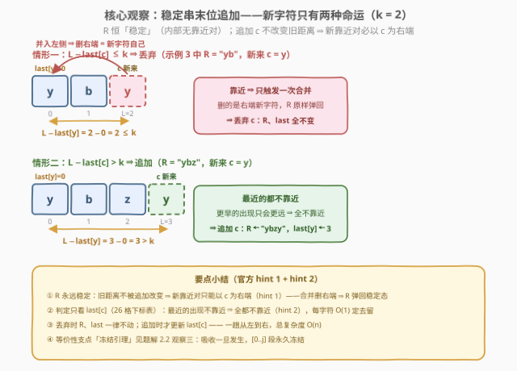
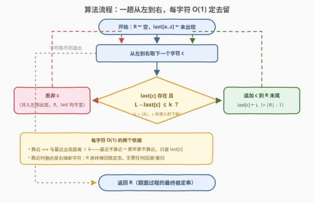

# LeetCode 合并靠近字符 II 题解

## 1. 题目概述

- **标题 / 题号**：合并靠近字符 II（#4019，medium）
- **链接**：https://leetcode.cn/problems/merge-close-characters-ii/
- **难度**：中等
- **标签**：哈希表、字符串、模拟、贪心

> ⚠️ 本题为 LeetCode 付费题，题意描述根据官方示例用例与 hints 重建，可能与官方题面有出入。

**题意**：给你一个由小写英文字母组成的字符串 `s` 和一个整数 `k`。

在**当前**字符串 `s` 中，如果两个**相同**字符之间的下标距离**至多为 `k`**，则认为它们是**靠近**的。

当两个字符**靠近**时，右侧的字符会**合并到左侧**（右侧字符被删除、左侧保留）。合并操作逐个发生，每次合并后字符串都会更新，直到无法再进行合并为止。

返回执行所有可能合并后的**最终字符串**。

**注意**：如果可以进行多次合并，请始终选择**左侧下标最小**的那一对进行合并；如果多对字符共享最小的左侧下标，请选择**右侧下标最小**的那一对进行合并。

本题为 [3853. 合并靠近字符](https://leetcode.cn/problems/merge-close-characters/)（$n \le 100$，按题面顺序直接模拟）的**数据放大版**：题意与示例完全相同，考点是把 $O(n^2)$ 级模拟换成 $O(n)$ 一趟扫描。

**示例 1**：

```text
输入：s = "abca", k = 3
输出："abc"
解释：下标 0 和 3 处的 'a' 靠近（3 − 0 = 3 ≤ k），右侧 'a' 并入左侧，得 "abc"；
      之后不再有靠近的相同字符，过程结束。
```

**示例 2**：

```text
输入：s = "aabca", k = 2
输出："abca"
解释：下标 0 和 1 处的 'a' 靠近（1 − 0 = 1 ≤ k），并入左侧得 "abca"；
      剩余两个 'a' 相距 3 > k = 2，不再合并。
```

**示例 3**：

```text
输入：s = "yybyzybz", k = 2
输出："ybzybz"
解释：y(0,1) 靠近 → 并入得 "ybyzybz"；此时 y(0,2) 靠近（2 − 0 = 2 ≤ k）→ 并入得 "ybzybz"；
      之后 y 相距 3、b 相距 3、z 相距 3，均 > k，过程结束。
```

**约束条件**（付费题未公开，按题系惯例推断）：

- $1 \le |s| \le 10^5$ 级（本解法为线性，对更大规模同样成立）
- $1 \le k$（$k$ 超过串长时的退化形态见第 5 节）
- `s` 由小写英文字母组成

> 💡 **审题关键**：① 合并**只删右侧字符**、左侧保留——不是「双字符消去」，与 1047 那族栈题本质不同；② 距离是**当前字符串**中的下标距离——每次删除都让后方字符左移，可能制造出新的靠近对，这正是模拟必须反复重扫的原因；③ 题面「最左对优先」把过程**确定性化**，且顺序**真的影响结果**（`"abaca", k = 2`：规定顺序得 `"abca"`，先并右对得 `"abc"`）——所以不能随便自选合并顺序，II 版的考点就是证明「从左到右增量构造」与规定顺序**殊途同归**（见 2.2 观察三）；④ 官方 hint 已给出路线：hint 1 = 从左到右维护前缀结果串、新合并必以新字符为右端；hint 2 = 每个字母只记最后出现下标，距离 $\le k$ 则丢弃。

## 2. 解题思路

### 2.1 暴力思路

照题面顺序模拟（即 I 版 3853 的解法）：每轮扫描全串，找字典序最小的靠近对 $(i, j)$ 并删掉 $s[j]$。借助「每个字符下一个出现位置」的哈希，单轮 $O(n)$；但**每删一个字符，后方全体左移，所有距离重新洗牌**，必须整轮重扫，至多删 $n-1$ 轮 ⇒ $O(n^2)$。

$n \le 100$ 的 I 版轻松；$n = 10^5$ 时 $\sim 10^{10}$ 不可行。瓶颈不在找对，而在**删除的连锁反应逼你从头再来**——下面两个观察把它彻底拆掉。

### 2.2 核心观察：稳定串 + 末位吸收（一趟 O(n) 增量构造）



**观察一（末位吸收：新合并只能以新字符为右端）**。从左到右逐字符处理，维护「已处理前缀的最终结果」$R$，归纳保证 $R$ 恒**稳定**（内部无任何靠近对）。在 $R$ 末尾追加新字符 $c$ **不改变旧字符之间的距离** ⇒ 旧对依旧不靠近，新出现的靠近对必以 $c$ 为**右端**（$c$ 后面没有字符）。而合并删的恰是右端 ⇒ 唯一可能的合并删的就是 $c$ 自己，$R$ 原样弹回。于是每个新字符只有两种命运：

- $c$ 与 $R$ 中 **$c$ 的最后一次出现**距离 $\le k$ ⇒ **丢弃** $c$（$R$、`last` 全不变）；
- 否则 $R \cdot c$ 仍稳定 ⇒ **追加** $c$，更新 $\text{last}[c]$。

**观察二（只查每个字母的 last 出现下标）**。设 $L = |R|$（$c$ 将落入的下标）、$j = \text{last}[c]$。若 $L - j > k$，则 $c$ 更早的出现只会更远 ⇒ 一律不靠近；若 $L - j \le k$，按「最左对优先」选出的合并对可能是**更早**的靠近出现，但其右端仍是新字符 $c$，**删的都是 $c$**，结局相同。因此 26 个字母的一张 `last` 下标表即可 $O(1)$ 定去留——这正是官方 hint 2。

**观察三（正确性：增量构造 ≡ 题面规定顺序——冻结引理）**。题面的合并顺序是全局「最左对优先」，并非逐前缀处理；而 `"abaca", k=2` 说明顺序敏感、系统不合流，等价性需要论证。设某时刻过程状态为 $q \cdot c$（$q$ 为已处理部分的当前形态，$c$ 挂在末尾），且被选中的合并对是 $(j, |q|)$——即 $c$ 并入 $q[j]$：

> **冻结引理**：此刻 $q$ 中**不存在左下标 $\le j$ 的靠近对**——左下标 $< j$ 的靠近对字典序更小、会被先选（矛盾）；左下标 $= j$ 的靠近对要求 $j$ 之后还有 $c$，而 $(j,|q|)$ 是最左对本身就迫使 $j$ 是 $c$ 在 $q$ 中的最后一次出现（若中间还有 $c$ 于 $j'$，则 $(j, j')$ 更小，矛盾）。于是此后每次合并删去的右端位置必 $> j$——因为 $[0..j]$ 段内任何字符对的距离从此时起**永不改变**（删除只发生在 $j$ 右侧），而它们此刻都不靠近，就永远不会靠近。归纳即得 $q[0..j]$ **永久冻结**：$q[j]$ 处的 $c$ 活到最后，且 $j$ 之后再无 $c$ ⇒ 在前缀的最终结果 $D(q)$ 中，$c$ 的最后一次出现仍在 $j$，距离 $|D(q)| - j \le |q| - j \le k$。

配合两条平凡方向，闭合成完整的等价性：

- **若 $c$ 与 $D(\text{前缀})$ 中 $\text{last}[c]$ 靠近**：反设过程从未删 $c$——$c$ 挂尾时任何含 $c$ 的靠近对都以 $c$ 为右端，不删 $c$ 说明这类对从未当选，前缀部分按原轨道跑到 $D(\text{前缀})$，终态 $D(\text{前缀}) \cdot c$ 必须稳定 ⇒ $c$ 与所有出现都不靠近，矛盾 ⇒ $c$ 必被删，终态 $= D(\text{前缀})$。
- **若不靠近**：前缀跑完到 $D(\text{前缀})$，$D(\text{前缀}) \cdot c$ 稳定 ⇒ 终态 $= D(\text{前缀}) \cdot c$。

三条合起来：**过程终态 $D(p \cdot c) \in \{D(p),\ D(p) \cdot c\}$，且分支恰由「$c$ 是否与 $D(p)$ 的 $\text{last}[c]$ 靠近」决定**——与贪心规则逐字吻合。对前缀长度归纳，增量构造的结果就是题面过程的最终串。（除上述论证外，另以 700 万组穷举对拍——$\{a,b\}$ 串长 $\le 14$、$\{a,b,c\}$ 串长 $\le 11$、全部 $k$——与规定顺序模拟零差异。）

> 💡 **一句话总结**：结果串永远稳定，新字符要么被左侧同名锚点吸收（$L - \text{last}[c] \le k$，串弹回原样），要么安全追加——一张 26 格 `last` 表，一趟 $O(n)$ 收工。

### 2.3 算法流程图



| 步骤 | 操作 | 说明 |
|------|------|------|
| ① | `R ← ""`，`last[c] ← 未出现` | 结果串与 26 格下标表初始化 |
| ② | 从左到右取下一字符 `c` | $L \leftarrow \|R\|$（`c` 将落入的下标） |
| ③ | `last[c]` 存在且 `L − last[c] ≤ k`？ | $O(1)$ 判定；只查最近出现即可 |
| ④ | 是 ⇒ **丢弃** `c` | 并入左侧出现：`R`、`last` 均不变 |
| ⑤ | 否 ⇒ **追加** `c`，`last[c] ← L` | 只有追加才更新 `last` |
| ⑥ | 字符取尽 ⇒ 返回 `R` | $R$ 即题面过程的最终稳定串 |

### 2.4 示例演算

**示例 3**：$s = $ `yybyzybz`，$k = 2$，判据 $L - \text{last}[c] \le 2$：

| 读入 | $R$（处理前） | $L$ | last[y] | last[b] | last[z] | 判定 | $R$（处理后） |
|------|--------------|-----|---------|---------|---------|------|--------------|
| y | — | 0 | — | — | — | 无出现 → 追加 | `y` |
| y | `y` | 1 | 0 | — | — | $1-0=1 \le 2$ → 丢弃 | `y` |
| b | `y` | 1 | 0 | — | — | 无出现 → 追加 | `yb` |
| y | `yb` | 2 | 0 | 1 | — | $2-0=2 \le 2$ → 丢弃 | `yb` |
| z | `yb` | 2 | 0 | 1 | — | 无出现 → 追加 | `ybz` |
| y | `ybz` | 3 | 0 | 1 | 2 | $3-0=3 > 2$ → 追加 | `ybzy` |
| b | `ybzy` | 4 | 3 | 1 | 2 | $4-1=3 > 2$ → 追加 | `ybzyb` |
| z | `ybzyb` | 5 | 3 | 4 | 2 | $5-2=3 > 2$ → 追加 | `ybzybz` |

最终 **`ybzybz`** ✓——与题面顺序模拟（3853 示例 3 官方解释：y(0,1) 并 → y(0,2) 并）殊途同归。注意第 4 行：新 `y` 与 `last[y]=0` 恰好距离 $2 = k$，**含等号**算靠近，别写成严格小于；第 6 行起前两次丢弃已把 `R` 压短，距离天然以「幸存者坐标」计算——这正是增量构造免去重扫的原因。

## 3. 参考代码

### C++

```cpp
class Solution {
  public:
    string mergeCharacters(string s, int k) {
        string res;
        res.reserve(s.size());
        array<int, 26> last;
        last.fill(-1);                        // -1 = 该字母尚未出现
        for (char ch : s) {
            int c = ch - 'a';
            int L = res.size();               // 新字符将落入的下标
            if (last[c] >= 0 && L - last[c] <= k)
                continue;                     // 靠近：并入左侧出现，丢弃新字符
            res.push_back(ch);                // 不靠近：追加并记录
            last[c] = L;
        }
        return res;
    }
};
```

> 💡 **写法要点**：
> - `last` 只在**追加**时更新；丢弃分支什么都不动——$R$ 弹回稳定态，全部 `last` 依旧有效；
> - `L - last[c]` 与 $k$ 均 $\le n$，`int` 无压力；`reserve` 避免反复扩容；
> - 付费题未公开函数签名，此处沿用题系 I 版（3853 `mergeCharacters(s, k)`），以实际提交页为准。

### Python

```python
class Solution:
    def mergeCharacters(self, s: str, k: int) -> str:
        last: dict[str, int] = {}
        res: list[str] = []
        for ch in s:
            j = last.get(ch)
            if j is not None and len(res) - j <= k:
                continue                      # 靠近：新字符被左侧锚点吸收
            res.append(ch)
            last[ch] = len(res) - 1           # 只有追加才更新 last
        return ''.join(res)
```

> 💡 **写法要点**：用 `list` 累积、最后一次 `join`，别在循环里 `res += ch`（每次拼接整体复制，最坏 $O(n^2)$）；`dict.get` 返回 `None` 天然区分「未出现」与下标 0。

## 4. 复杂度分析

| 维度 | 复杂度 | 说明 |
|------|--------|------|
| 时间 | $O(n)$ | 每字符一次哈希查询（$O(1)$）+ 一次减法比较，无重扫无回溯 |
| 空间 | $O(n + \lvert\Sigma\rvert)$ | 结果串 $O(n)$ + 26 格 `last` 表；$\lvert\Sigma\rvert = 26$ |
| 输出规模 | $\le n$ | 只删不增，`reserve` 后无额外拷贝 |

## 5. 扩展：退化形态、对拍与「双删」变体

**① $k \ge n$ 的退化**：任意两处相同字符初始距离 $\le n-1 \le k$，全部靠近——贪心退化为**保序去重**：每个字符只保留首次出现。示例 1 的 $k = 3 = n-1$ 已是边界形态（`abca → abc`）。可作实现正确性的快速自检。

**② 用 I 版做对拍基准**：3853（$n \le 100$）的「最左对优先」模拟是现成的暴力基准，与本解法随机对拍即可验证实现（本文的等价性论证亦以 700 万组穷举对拍佐证）。这也是付费题题意重建的标准姿势：官方 hints 给算法路线，同系 I 版给题面与基准。

**③ 若改成「双删」会怎样**：设变体规则为靠近的两字符**同时删除**（更接近 1047 的「消除」族）。此时左侧锚点会消失，`last` 表不再够用——吸收会连锁牵动更早的出现，需回到栈式结构（栈中维护幸存字符 + 每层的「距离」信息），本题的单删红利（冻结）不复存在。对照着写一遍，能更深刻体会「**只删右端**」才是本题可 $O(n)$ 的根源。

## 6. 面试要点

**Q1：合并顺序为什么会影响结果？本题贪心为何又与规定顺序一致？**

> 反例 `"abaca", k=2`：规定顺序先并最左对 (0,2) 得 `abca`；先并右对 (2,4) 则得 `abc`——重写系统不合流，顺序敏感。贪心等价性的支点是**冻结引理**：吸收发生的那一刻（$c$ 并入 $q[j]$），$q$ 中不存在左下标 $\le j$ 的靠近对，此后所有删除都发生在 $j$ 右侧，$[0..j]$ 段永久冻结——$q[j]$ 处的锚点活到最后。由此 $D(p \cdot c)$ 的分支恰与贪心判据一致，归纳收口。

**Q2：为什么只需检查 c 的最后一次出现，而不是所有出现？**

> 单调性：更早的出现只会更远。最近的都不靠近 ⇒ 全都不靠近；最近的靠近时，「最左对优先」可能选中更早的靠近出现对，但删的都是右端新字符 $c$，结局相同。故 26 格 `last` 表足够，每字符 $O(1)$。

**Q3：与 1047（删除字符串中的所有相邻重复项）一族的本质区别？**

> 同：都把「全局反复消除」坍缩成「一趟增量构造 + 新字符处的 $O(1)$ 局部判定」。异：1047 是**相邻 + 双删** ⇒ 新字符与栈顶同型则双双出栈，需要栈；本题是**距离 $\le k$ + 单删** ⇒ 左侧锚点不动，连栈都不用，一张 `last` 表足矣。此外 1047 的消除顺序无关（合流），本题顺序敏感——增量构造的合法性必须靠冻结引理单独论证，不能照搬。

**Q4：丢弃字符时需要更新什么信息吗？**

> 什么都不用。$R$ 未变 ⇒ 所有 `last` 依旧有效；也只有追加才需要更新 `last[c]`。这是单删规则的红利：合并只发生在「右端 = 新字符」处，已入串的字符永不被删（冻结引理），不存在栈题里「弹掉左锚点引发连锁」的问题。

**Q5：有哪些边界用例值得自测？**

> ① $k \ge n$：答案 = 保序去重串；② 全同字符 `"aaaa"`（任意 $k \ge 1$）：答案 `"a"`——每个后续字符都被首个锚点吸收；③ $n = 1$：原样返回；④ 距离恰为 $k$：**含等号**算靠近（示例 1 的 $3 \le 3$、示例 3 的 $2 \le 2$），判别式勿写 `$<$`；⑤ `"aabca", k=2`：丢弃后 `last[a]` 仍指向保留下来的那个 `a`（下标 0），第 5 个字符据此正确判出距离 3。

## 同类练习题

| # | 题目 | 与本题的关联 |
|---|------|-------------|
| 3853 | [合并靠近字符](https://leetcode.cn/problems/merge-close-characters/) | 本题 I 版（$n \le 100$），「最左对优先」逐轮模拟 $O(n^2)$，可作本题的暴力对拍基准 |
| 1047 | [删除字符串中的所有相邻重复项](https://leetcode.cn/problems/remove-all-adjacent-duplicates-in-string/) | 相邻**双删**的栈式增量构造——顺序无关族，与本题「距离单删」互为镜像 |
| 1209 | [删除字符串中的所有相邻重复项 II](https://leetcode.cn/problems/remove-all-adjacent-duplicates-in-string-ii/) | 栈 + 计数器把「连续 m 个」消除坍缩成栈顶 $O(1)$ 判定 |
| 1544 | [整理字符串](https://leetcode.cn/problems/make-the-string-great/) | 大小写配对的相邻消除，同为「新字符只与栈顶交互」的栈族 |
| 316 | [去除重复字母](https://leetcode.cn/problems/remove-duplicate-letters/) | 同样靠「每个字母最后出现位置」的 $O(1)$ 哈希决策，但目标是最小字典序 |
