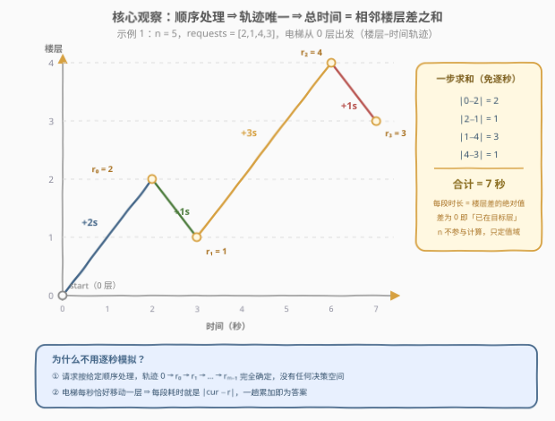
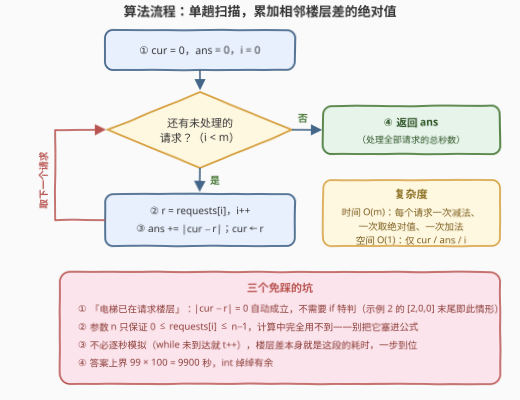

# LeetCode 电梯请求I 题解

## 1. 题目概述

- **标题 / 题号**：电梯请求I（#4020，easy）
- **链接**：https://leetcode.cn/problems/elevator-requests-i/
- **难度**：简单
- **标签**：数组、模拟

**题意**：给你一个整数 `n`，表示一栋楼房的楼层数，楼层编号从 `0` 到 `n - 1`。

同时给你一个整数数组 `requests`，表示楼层请求的**序列**。

一部电梯初始在 `0` 层，遵循以下规则：

- 电梯**每秒移动一层**；
- 电梯**按给定的顺序**处理请求；
- 如果电梯已经在请求的楼层，则**不需要移动**；
- 处理完一个请求后，电梯立即开始向下一个请求的楼层移动。

返回处理所有请求所需的**总时间**（以秒为单位）。

**示例 1**：

```text
输入：n = 5, requests = [2,1,4,3]
输出：7
解释：0→2 花 2 秒，2→1 花 1 秒，1→4 花 3 秒，4→3 花 1 秒，总计 2+1+3+1 = 7 秒。
```

**示例 2**：

```text
输入：n = 3, requests = [2,0,0]
输出：4
解释：0→2 花 2 秒，2→0 花 2 秒，最后请求的 0 层电梯已在，花 0 秒，总计 4 秒。
```

**约束**：

- $1 \le n \le 100$
- $1 \le \text{requests.length} \le 100$
- $0 \le \text{requests}[i] \le n - 1$

> 💡 **审题关键**：① 请求**按给定顺序**处理、电梯每秒恰好移动一层——轨迹完全确定，没有任何决策空间，这是与「电梯请求 II」（顺序自选）的本质区别；② 「已在请求楼层不需移动」就是差值为 $0$ 的特例；③ 参数 $n$ 只用来保证 $0 \le \text{requests}[i] \le n-1$，**计算中用不到**。

## 2. 解题思路

### 2.1 暴力思路：逐秒模拟

最"忠实于题面"的写法是**逐秒模拟**：维护当前时间 $t$ 与当前楼层 `cur`，对每个请求目标 `r`，只要 `cur != r` 就每秒向 `r` 挪一层、$t{+}{+}$：

```text
for r in requests:
    while cur != r:
        cur += (1 if r > cur else -1)
        t += 1
```

正确性没问题，复杂度 $O(m \cdot n)$（$m$ 个请求、每段最多 $n-1$ 秒）。本题 $m, n \le 100$，最多约 $10^4$ 步也能过，但它把「匀速直线运动」拆成了一秒一秒地数——**每段的耗时其实由起止楼层唯一确定**，根本不需要逐秒走。

### 2.2 核心观察：总时间 = 相邻楼层差的绝对值之和



**观察一（轨迹唯一）**。请求按给定顺序处理，电梯的运动轨迹被完全锁定为

$$0 \;\to\; r_0 \;\to\; r_1 \;\to\; \cdots \;\to\; r_{m-1}$$

没有任何"先去哪层"的选择——模拟即可，无需搜索或贪心。

**观察二（匀速 ⇒ 差值即时长）**。电梯每秒恰好移动一层，所以从楼层 $a$ 移动到楼层 $b$ 的耗时就是 $|a - b|$ 秒（方向 irrelevant，上行下行同价）。于是

$$\text{ans} \;=\; |0 - r_0| + \sum_{i=1}^{m-1} \left| r_{i-1} - r_i \right| \;=\; \sum_{i=0}^{m-1} \left| \text{cur}_i - r_i \right|$$

其中 $\text{cur}_i$ 是处理第 $i$ 个请求前的电梯楼层（$\text{cur}_0 = 0$）。特别地，「已在请求楼层不需移动」对应 $|\text{cur}_i - r_i| = 0$，**绝对值天然覆盖，无需特判**（示例 2 的 `[2,0,0]` 末尾就是这种情形）。

**观察三（$n$ 不参与计算）**。$n$ 只界定楼层值域 $0 \le \text{requests}[i] \le n-1$，答案公式里没有它——别把 $n$ 塞进任何计算。

> 💡 **一句话总结**：轨迹唯一 + 每秒一层 ⇒ 每段耗时就是楼层差的绝对值；一趟扫描累加 $|\text{cur} - r|$，顺手把 `cur` 更新为 $r$，即为答案。

### 2.3 算法流程图



| 步骤 | 操作 | 说明 |
|------|------|------|
| ① | `cur = 0`，`ans = 0`，`i = 0` | 电梯初始在 0 层 |
| ② | 取 `r = requests[i]`，`i++` | 按给定顺序处理 |
| ③ | `ans += abs(cur - r)`，`cur = r` | 差值即该段秒数；已在目标层时差为 0 |
| ④ | 重复 ②③ 直到请求耗尽，返回 `ans` | 单趟 $O(m)$ |

### 2.4 示例演算

**示例 1**：$n = 5$，$\text{requests} = [2,1,4,3]$：

| 请求 $r$ | 处理前楼层 | 移动 | 耗时 | 处理后楼层 |
|---------|-----------|------|------|-----------|
| 2 | 0 | 0→2 | $\|0-2\| = 2$ | 2 |
| 1 | 2 | 2→1 | $\|2-1\| = 1$ | 1 |
| 4 | 1 | 1→4 | $\|1-4\| = 3$ | 4 |
| 3 | 4 | 4→3 | $\|4-3\| = 1$ | 3 |

合计 $2 + 1 + 3 + 1 = \mathbf{7}$ 秒，与官方答案一致。

**示例 2**：$n = 3$，$\text{requests} = [2,0,0]$：

| 请求 $r$ | 处理前楼层 | 耗时 | 处理后楼层 |
|---------|-----------|------|-----------|
| 2 | 0 | $\|0-2\| = 2$ | 2 |
| 0 | 2 | $\|2-0\| = 2$ | 0 |
| 0 | 0 | $\|0-0\| = 0$（已在目标层，免特判） | 0 |

合计 $2 + 2 + 0 = \mathbf{4}$ 秒。

## 3. 参考代码

### C++

```cpp
class Solution {
  public:
    int elevatorRequests(int n, vector<int>& requests) {
        int cur = 0, ans = 0;          // 电梯当前楼层 / 总时间
        for (int r : requests) {
            ans += abs(cur - r);       // 每段耗时 = 楼层差绝对值
            cur = r;                   // 电梯到达请求楼层
        }
        return ans;
    }
};
```

> 💡 **写法要点**：
> - 参数 `n` 在计算中用不到（只保证值域合法），形参保留即可；
> - 答案上界 $99 \times 100 = 9900$，`int` 绰绰有余；
> - 「已在请求楼层」时 `abs(cur - r) == 0`，天然免特判。

### Python

```python
class Solution:
    def elevatorRequests(self, n: int, requests: list[int]) -> int:
        cur, ans = 0, 0                # 电梯当前楼层 / 总时间
        for r in requests:
            ans += abs(cur - r)        # 每段耗时 = 楼层差绝对值
            cur = r                    # 电梯到达请求楼层
        return ans
```

> 💡 **写法要点**：也可以用 `itertools.accumulate` 一行流——`sum(abs(a - b) for a, b in zip([0] + requests, requests))`，但显式循环的可读性更好。

## 4. 复杂度分析

| 维度 | 复杂度 | 说明 |
|------|--------|------|
| 时间 | $O(m)$ | $m = \text{requests.length}$，每个请求一次减法、一次取绝对值、一次加法 |
| 空间 | $O(1)$ | 仅 `cur` / `ans` 两个变量（Python 另有循环变量 `r`） |
| 答案规模 | $\le 9900$ | 至多 $100$ 段、每段 $\le n - 1 \le 99$ 秒，`int` 无压力 |

## 5. 扩展：电梯请求 II（4023）——顺序自选时的最小总惩罚

同系列的 [4023. 电梯请求 II](https://leetcode.cn/problems/elevator-requests-ii/)（困难）把"无决策"改成"全决策"：

- 所有请求在时间 $0$ **同时**发出，楼层互不相同；
- **处理顺序由你决定**；
- 在时间 $t$ 处理的请求贡献 $t$ 点惩罚，求**最小总惩罚**；规模升到 $n \le 10^9$、$m \le 1500$。

此时"按序模拟"失效，轨迹不再唯一——这正是排序 + DP 的舞台：把请求楼层**排序**后，最优策略必然是从 `start` 出发不断向左或向右"吃掉"一段**连续**的已排序楼层（跳着走必然亏，因为晚处理的请求惩罚更大，应先处理近的）。设 $dp[l][r]$ 表示已处理完排序后区间 $[l, r]$ 的最小惩罚，每次从区间左端向左扩一格或从右端向右扩一格，转移时把"区间内所有请求的完成时刻"整体结算（经典"时间平移"技巧：扩展一步耗时 $d$，等价于已处理集合的总惩罚各加 $d$，用 `区间长度 × d` 计入）。总复杂度 $O(m^2)$。

两个版本的分野值得体会：**I 版考"读清规则后一步到位"，II 版考"决策空间上的区间 DP"**——同一部电梯，规则一字之差，难度从简单跳到困难。

## 6. 面试要点

**Q1：为什么总时间等于相邻楼层差的绝对值之和？**

> 两个前提合起来：① 请求按给定顺序处理 ⇒ 轨迹 $0 \to r_0 \to \cdots \to r_{m-1}$ 完全确定；② 电梯每秒恰好移动一层 ⇒ 每段耗时 $=$ 路程 $= |\Delta\text{楼层}|$。把各段相加即得答案。两个前提缺一不可——II 版（4023）打破了前提①，答案就不再有闭式，需要 DP。

**Q2：「电梯已在请求楼层不需移动」需要写 if 特判吗？**

> 不需要。此时 $|\text{cur} - r| = 0$，绝对值公式自动给出 0 秒——示例 2 的 `[2,0,0]` 末尾就是现成的验证用例。识别"边界情形已被通式覆盖"是简化代码的常用思维。

**Q3：参数 $n$ 有什么用？**

> 只用于约束值域 $0 \le \text{requests}[i] \le n - 1$，计算中完全不出现。面试中主动指出"这个参数是干什么的、为什么用不到"，是审题清晰的信号；反过来，把 $n$ 写进公式（比如乘 $n$ 或对 $n$ 取模）必错。

**Q4：逐秒模拟（`while cur != r` 每秒挪一层）和差值累加差在哪？**

> 正确性等价，复杂度不同：逐秒模拟 $O(m \cdot n)$，差值累加 $O(m)$。本题规模下两者都能过，但"匀速直线运动的耗时由起止位置唯一决定"这一步简化，正是模拟题里最常见的优化直觉；面试时应直接给出 $O(m)$ 版本，逐秒版可作为反面参照口述。

**Q5：会不会溢出？哪些边界值得自测？**

> 不会。$m \le 100$ 段、每段 $\le n - 1 \le 99$ 秒，答案 $\le 9900$，`int` 足够；但若像 II 版那样 $n \le 10^9$，单段可达 $10^9$、$m \le 1500$ 段，C++ 就要换 `long long`。自测用例：① `requests = [0]`（起点即目标，答案 0）；② 连续重复楼层如 `[2,0,0]`（差 0 段）；③ 严格交替 `[1,0,1,0]`（反复横跳，答案最大化）。

## 同类练习题

| # | 题目 | 与本题的关联 |
|---|------|-------------|
| 4023 | [电梯请求 II](https://leetcode.cn/problems/elevator-requests-ii/) | 同系列困难版，请求同时发出、顺序自选，排序 + 区间 DP 最小化总惩罚（见第 5 节） |
| 2073 | [买票需要的时间](https://leetcode.cn/problems/time-needed-to-buy-tickets/) | 同样是"按序处理 + 时间累积"的纯模拟，注意每秒的减法语义 |
| 874 | [模拟行走机器人](https://leetcode.cn/problems/walking-robot-simulation/) | 按指令逐步模拟朝向与位置，体会"忠实模拟"与"一步折叠"的取舍 |
| 2515 | [环形数组中到目标字符串的最短距离](https://leetcode.cn/problems/shortest-distance-to-target-string-in-a-circular-array/) | 同为"距离 = 差的绝对值"，环形上还要取 $\min(d, n-d)$ |
| 860 | [柠檬水找零](https://leetcode.cn/problems/lemonade-change/) | 按序处理事件流、维护少量状态的模拟模板题 |
