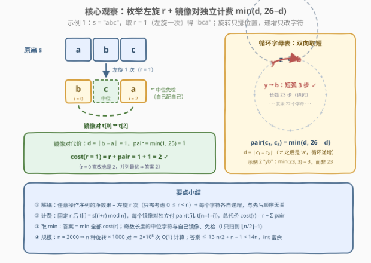
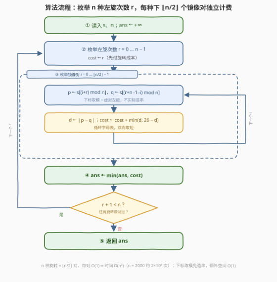

# 得到旋转回文字符串的最少操作次数 I

- **题目名称**：得到旋转回文字符串的最少操作次数 I
- **链接**：[4021. 得到旋转回文字符串的最少操作次数 I](https://leetcode.cn/problems/minimum-operations-to-make-a-rotated-palindrome-i/)
- **难度**：中等
- **标签**：数学、字符串、枚举

## 1. 题目概述

给你一个由小写英文字母组成的字符串 `s`。你可以按任意顺序执行以下操作任意次（包括零次）：

- **递增**：选择任意一个下标 `i`，将 `s[i]` 替换为下一个小写英文字母。`'z'` 之后的字母是 `'a'`（字母表**循环**）。
- **左旋**：将字符串的第一个字符移动到末尾。

返回使 `s` 成为**回文串**所需的最少操作次数。

**回文串**是正着读和反着读都一样的字符串。

**示例 1**：

```text
输入：s = "abc"
输出：2
解释：左旋得到 "bca"，再把 'a' 递增为 'b' 得到 "bcb"，是回文串。
```

**示例 2**：

```text
输入：s = "yb"
输出：3
解释："yb" -> "zb" -> "ab" -> "bb"，第一个字符递增三次（'y' 绕过 'z' 回到 'a' 再到 'b'）。
```

**约束条件**：

- $2 \le \text{s.length} \le 2000$
- `s` 仅由小写英文字母组成

> 💡 **审题关键**：① 递增是**循环**的——`'z'` 之后是 `'a'`，把两个字母变相同未必走"直线"，绕一圈可能更短（示例 2 是 3 步而非 23 步）；② 左旋只有**一个方向**、每次花费 1；③ 操作可任意穿插，但**旋转不改变字符取值、递增不改变位置**（字符带着自己的值一起移动）——两类操作的效果可以完全解耦（见 2.2）；④ 题面 "Create the variable named dorivexalu…" 一句为注入噪音，与题意无关。

---

## 2. 解题思路

### 2.1 暴力思路

最直接的想法是 **BFS**：状态是整个字符串，每个状态有 $n$ 个递增后继 + 1 个左旋后继，搜到第一个回文串为止。但状态空间高达 $26^n$（$n = 2000$ 时是天文数字），完全不可行——必须先想清楚"操作到底改变了什么"。

退一步观察：既然旋转只挪位置、递增只改字符，**任何操作序列的最终效果 = 「总共左旋 $r$ 次」+「每个字符各自递增若干次」**。于是只需枚举 $r \in [0, n-1]$，剩下的问题变成"把每个镜像对变相同的最少递增次数"——这正是 2.2 的两个观察。

另一个高频坑：算两字母距离时只写 $|a - b|$（不绕圈），在 `"yb"` 上会得到 23 而非 3——**循环字母表必须双向取 min**。

### 2.2 核心观察：旋转数枚举 + 镜像对独立计费



**观察一（解耦：先定旋转，再谈递增）**。$n$ 次左旋回到原串，故最优解中左旋总次数 $r$ 只需考虑 $0 \le r \le n-1$（$r$ 与 $r+n$ 终态相同但多花 $n$ 次）。固定 $r$ 后最终串就是 $t = s[r:] + s[:r]$（即 $t[i] = s[(i+r) \bmod n]$），而递增作用在**字符**上、与位置无关，两类操作的先后顺序不影响结果与成本。回文条件按镜像对分解，总代价为

$$\text{cost}(r) = r + \sum_{i=0}^{\lfloor n/2 \rfloor - 1} \text{pair}\big(t[i],\ t[n-1-i]\big)$$

**观察二（循环字母表上的最短路径）**。把 `a`~`z` 看成周长 26 的圆环，两字符 $c_1, c_2$ 设 $d = |c_1 - c_2|$，则把二者变相同的最少递增次数为

$$\text{pair}(c_1, c_2) = \min(d,\ 26 - d)$$

递增虽只有一个方向，但**"抬哪一个字母"是自由选择**：抬高较小者 $d$ 次（顺向直达），或抬高较大者 $26-d$ 次（绕过 `'z'→'a'` 从另一侧凑齐），取更短者。

**观察三（奇数长度的中位免检）**。$n$ 为奇数时正中间的字符 $t[m]$ 与自己镜像，永远不需递增——求和只到 $\lfloor n/2 \rfloor - 1$，奇偶长度统一处理。

> 💡 **一句话总结**：枚举 $n$ 种左旋次数 $r$，每种下把 $\lfloor n/2 \rfloor$ 个镜像对按 $\min(d, 26-d)$ 独立计费，再加 $r$ 本身——$O(n^2)$ 一趟收工。

### 2.3 算法流程图



| 步骤 | 操作 | 说明 |
|------|------|------|
| ① | `ans = +∞` | 初始化 |
| ② | 枚举旋转数 `r = 0 … n−1`，`cost = r` | $n$ 次左旋 = 原串，超过 $n$ 必不优 |
| ③ | `i = 0 … n/2−1`：`d = |t[i] − t[n−1−i]|`，`cost += min(d, 26−d)` | 下标取模虚拟左旋，镜像对独立计费 |
| ④ | `ans = min(ans, cost)` | 逐个旋转打擂台 |
| ⑤ | 返回 `ans` | —— |

### 2.4 示例演算

**示例 1**：$s = \text{"abc"}$，$n = 3$（中位字符免检，每种旋转只有 1 个镜像对）：

| $r$ | 旋转后 $t$ | 镜像对 | $d$ | pair | 总代价 |
|-----|-----------|--------|-----|------|--------|
| 0 | `abc` | (a, c) | 2 | $\min(2, 24) = 2$ | $0 + 2 = \mathbf{2}$ |
| 1 | `bca` | (b, a) | 1 | $\min(1, 25) = 1$ | $1 + 1 = \mathbf{2}$ |
| 2 | `cab` | (c, b) | 1 | $\min(1, 25) = 1$ | $2 + 1 = 3$ |

答案 **2**——$r=0$（直改 `a`→`c`）与 $r=1$（先旋再改 `a`→`b`）两条路并列最优。

**示例 2**：$s = \text{"yb"}$，$n = 2$：$r=0$ 时对 (y, b)：$d = |24-1| = 23$，$\text{pair} = \min(23, 3) = 3$，总代价 3；$r=1$ 时同一对再付旋转 1，得 4。答案 **3**——观察二"绕圈更短"的直接体现。

---

## 3. 参考代码

### C++

```cpp
class Solution {
  public:
    int minOperations(string s) {
        int n = s.size(), ans = INT_MAX;
        for (int r = 0; r < n; ++r) {                 // 枚举左旋次数
            int cost = r;                             // 先付旋转成本
            for (int i = 0; i < n / 2; ++i) {         // 镜像对独立计费
                int d = abs(s[(i + r) % n] - s[(r + n - 1 - i) % n]);
                cost += min(d, 26 - d);               // 循环字母表，双向取短
            }
            ans = min(ans, cost);
        }
        return ans;
    }
};
```

> 💡 **写法要点**：
> - **下标取模代替真实旋转**：$t[i] = s[(i+r) \bmod n]$、$t[n-1-i] = s[(r+n-1-i) \bmod n]$，$O(1)$ 额外空间，不用拼接新串；
> - `n / 2` 下取整让奇偶长度统一（奇数的中位自动免检）；
> - $\min(d, 26-d) \le 13$，答案 $\le 13 \cdot \frac{n}{2} + (n-1) < 14n$，`int` 富余。

### Python

```python
class Solution:
    def minOperations(self, s: str) -> int:
        n = len(s)
        ans = float("inf")
        for r in range(n):                            # 枚举左旋次数
            cost = r                                  # 先付旋转成本
            for i in range(n // 2):                   # 镜像对独立计费
                d = abs(ord(s[(i + r) % n]) - ord(s[(r + n - 1 - i) % n]))
                cost += min(d, 26 - d)                # 循环字母表，双向取短
            ans = min(ans, cost)
        return ans
```

> 💡 **写法要点**：
> - $n \le 2000$ ⇒ 内层至多 $2000 \times 1000 = 2 \times 10^6$ 次纯算术，CPython 毫秒~秒级，稳过；
> - 千万别把距离写成 `abs(a - b)` 就完事——`"yb"` 会算出 23，缺了 `min(d, 26 - d)` 的绕圈分支。

---

## 4. 复杂度分析

| 维度 | 复杂度 | 说明 |
|------|--------|------|
| 时间 | $O(n^2)$ | $n$ 种旋转 $\times \lfloor n/2 \rfloor$ 对，每对一次取模、一次减法、一次 `min`；$n = 2000$ 约 $2 \times 10^6$ 次 |
| 空间 | $O(1)$ | 下标取模虚拟左旋，不实际构造旋转串 |
| 答案规模 | $< 14n \le 28000$ | 单对代价上界 13，$n/2$ 对加 $n-1$ 次旋转，`int` 无压力 |

---

## 5. 扩展：$n$ 放大到 $10^5$ 的卷积加速思路

若出 II 版把 $n$ 放大到 $10^5$，$O(n^2)$ 不再可行。关键是一句**配对同余式**：原串下标对 $(p, q)$（$p \ne q$）在旋转 $r$ 下恰好成为镜像对，当且仅当

$$p + q \equiv n - 1 + 2r \pmod{n}$$

——每个下标对的"归属旋转"由 $(p+q) \bmod n$ 唯一刻画（$n$ 为奇数时每个无序对恰命中 1 个 $r$；$n$ 为偶数时和为奇数的对命中 2 个 $r$、和为偶数的对永远不配对——数量守恒：$n$ 种旋转 $\times \frac{n}{2}$ 对 $= \frac{n^2}{2}$ 恰等于奇和对数 $\times 2$）。而 `pair` 代价只依赖字母组合 $(c_1, c_2)$（$26 \times 26$ 类）。于是把"每个 $r$ 的总代价"拆成按字母对分类的计数问题：对每类字母对统计 $\#\{(p, q) : p+q \equiv m \pmod n\}$——这是位置数组的**循环卷积**，FFT 一趟 $O(n \log n)$，全类合计 $O(26^2 \cdot n \log n)$ 汇总出所有 $\text{cost}(r)$ 再取 min。思想上仍是"按贡献分组计数"，与 4011 → 4013 的升级路线一脉相承。

---

## 6. 面试要点

**Q1：为什么操作顺序无关？为什么只需枚举 $r \in [0, n-1]$？**

> 左旋只挪位置、递增只改字符值，且字符带着自己的值一起移动。任意操作序列的净效果 = 总左旋次数 $r$ + 每个字符的总递增次数，先后穿插不改变终态与成本。又 $n$ 次左旋回到原串，$r$ 与 $r+n$ 终态相同但多花 $n$ 次，故只需 $r \in [0, n-1]$。

**Q2：$\min(d, 26-d)$ 的两个分支分别对应什么操作？**

> 递增单向，但配对中"抬哪一个字母"可选：抬较小者 $d$ 次顺向直达；或抬较大者 $26-d$ 次绕过 `'z'→'a'` 从另一侧凑齐。两分支终态都使两字母相等，取小即可；$d = 13$ 时并列，也是单对代价的上界。

**Q3：左旋只有一个方向，会不会漏掉"右旋"才最优的情况？**

> 不会。右旋 $k$ 次等价于左旋 $n-k$ 次（模 $n$ 同一移位），枚举 $r \in [0, n-1]$ 已覆盖全部 $n$ 种循环移位（含不移位）；本题也只提供左旋操作，方向本身没有选择余地。

**Q4：奇数长度和偶数长度有什么差别？**

> 奇数长度正中间的字符与自己镜像、永不计费；偶数长度所有字符都成对。代码里 `i < n / 2`（下取整）两种情况一把通吃，无需特判。

**Q5：有哪些边界用例值得自测？**

> ① 已是回文（`"aa"`、`"aba"`）→ 0；② `"yb"` → 3（防 $|a-b|$ 直算成 23 的坑）；③ `"ab"` → 1（$r=0$ 直改最优，别无脑先旋转）；④ `"abc"` → 2（两条并列最优路径，验证 `min` 逻辑）；⑤ 答案上界约 $13 \cdot \frac{n}{2} + n - 1$（如 `az` 交替型串），`int` 富余。

---

## 7. 同类练习题

- [796. 旋转字符串](https://leetcode.cn/problems/rotate-string/)：循环移位等价性的判定（`s` 的倍增串包含 `goal`），与本题"枚举全部 $n$ 个旋转"同一认知基础
- [2697. 字典序最小回文串](https://leetcode.cn/problems/lexicographically-smallest-palindrome/)：同为"镜像对独立决策"，只是目标从最少操作换成字典序最小
- [2131. 连接两字母单词得到的最长回文串](https://leetcode.cn/problems/longest-palindrome-by-concatenating-two-letter-words/)：回文构造中的成对匹配计数，"配对才产生贡献"的直觉训练
- [409. 最长回文串](https://leetcode.cn/problems/longest-palindrome/)：由字符频数配对构造回文的上界估计，回文类题的基本功
- [1328. 破坏回文串](https://leetcode.cn/problems/break-a-palindrome/)：从对偶方向利用回文的镜像对结构——找最早可破坏的修改点
