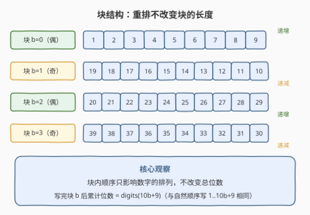
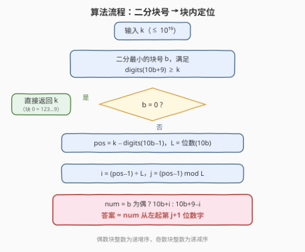
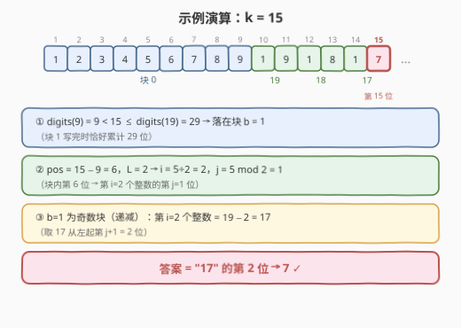

# 无限字符串里第K个数字

- **题目名称**：无限字符串里第K个数字
- **链接**：[4022. K-th Digit in Infinite String](https://leetcode.cn/problems/k-th-digit-in-infinite-string/)
- **难度**：中等
- **标签**：数学、二分查找

## 1. 题目概述

给定一个整数 $k$。构造一个**无限**字符串：把所有**正**整数的十进制表示不加分隔符地拼接起来，但拼接方式按"块"组织——对每个非负整数 $b$，**块 $b$** 包含整数 $10b$ 到 $10b+9$：

- 若 $b$ 为**偶数**，按**递增**顺序拼接（$10b,\ 10b+1,\ \dots,\ 10b+9$）；
- 若 $b$ 为**奇数**，按**递减**顺序拼接（$10b+9,\ 10b+8,\ \dots,\ 10b$）。

由于 $0$ 不是正整数，块 $0$ 实际只贡献 `"123456789"`。因此字符串开头为：

```text
123456789 19 18 17 16 15 14 13 12 11 10 20 21 22 ... 29 39 38 ... 30 ...
```

返回该字符串的**第 $k$ 位数字**（下标从 $1$ 开始）。

**示例 1**：

```text
输入：k = 4
输出：4
解释：字符串开头为 "123456789.."，第 4 位数字是 '4'。
```

**示例 2**：

```text
输入：k = 15
输出：7
解释：字符串开头为 "123456789191817.."，第 15 位数字是 '7'。
```

**示例 3**：

```text
输入：k = 11
输出：9
解释：字符串开头为 "12345678919.."，第 11 位数字是 '9'。
```

**约束条件**：

- $1 \le k \le 10^{15}$

> ⚠️ 注意 $k$ 上限是 $10^{15}$，远超 `int` 范围，中间的位数累计值也会超过 `int`，必须使用 64 位整数。

## 2. 解题思路

### 2.1 暴力思路

最直接的做法是**逐块模拟**：从块 $0$ 开始，把每个块的 10 个整数转成字符串累加，直到累计长度覆盖 $k$，再在块内定位。

问题在于规模：$k = 10^{15}$ 时，答案所在整数的量级约为 $10^{13}$（写完 $1 \sim 10^{14}$ 的总位数约 $1.26 \times 10^{15}$），需要扫过约 $7 \times 10^{13}$ 个块。即使每块 $O(1)$ 判断也要上万亿次操作，必然超时。必须让"跳过一整段块"变成 $O(1)$ 或 $O(\log)$——这正是数学计数 + 二分的用武之地。

### 2.2 核心观察：重排不改变块长，累计位数可解析计算

**观察一：块内顺序只影响排列，不改变长度。**

无论块 $b$ 按递增还是递减拼接，它都恰好把整数 $10b, 10b+1, \dots, 10b+9$ 各写一遍。因此：

> **写完块 $b$ 时，字符串累计使用的位数 = 按自然顺序写出 $1 \sim 10b+9$ 的总位数**，记作 $\mathrm{digits}(10b+9)$。

顺序信息只影响"块内是哪 10 个数字的哪种排法"，完全不影响"块边界在全局第几位"。

**观察二：$\mathrm{digits}(x)$ 可以按位数分层 $O(\log x)$ 求出。**

$d$ 位正整数的区间是 $[10^{d-1}, 10^d - 1]$，共 $9 \times 10^{d-1}$ 个，贡献 $9 \times 10^{d-1} \times d$ 位。把 $x$ 覆盖到的每个完整数位段累加、最后一段截断即可：

$$
\mathrm{digits}(x) = \sum_{d \ge 1} d \cdot \left( \min(x,\ 10^d - 1) - 10^{d-1} + 1 \right)
$$

（对 $x$ 未覆盖的段，该项为 $0$。）

**观察三：$f(b) = \mathrm{digits}(10b+9)$ 关于 $b$ 单调递增 → 可二分。**

于是可以**二分出最小的块号 $b$** 使 $f(b) \ge k$，把问题从"全局第 $k$ 位"收缩到"块 $b$ 内第几位"。



### 2.3 算法流程

设二分得到目标块 $b$，块内 1-indexed 位置为：

$$
\mathrm{pos} = k - \mathrm{digits}(10b - 1)
$$

（块 $b-1$ 结束于整数 $10b-1$，故 $\mathrm{digits}(10b-1)$ 是块 $b$ 之前的累计位数；$b = 0$ 时 $\mathrm{pos} = k$。）

- **$b = 0$**：块内就是 `"123456789"`，第 $k$ 位即数字 $k$ 本身，直接返回。
- **$b \ge 1$**：块内 10 个整数**位数相同**，记 $L = \mathrm{len}(10b)$（因为块从 $10$ 的倍数开始，而 $10$ 的幂恰好是某个块的起点，块 $[10b, 10b+9]$ 不会跨越数位边界）。于是：
  - $i = \left\lfloor \dfrac{\mathrm{pos}-1}{L} \right\rfloor$ —— 块内第 $i$ 个整数（0-indexed）；
  - $j = (\mathrm{pos}-1) \bmod L$ —— 该整数从左起第 $j$ 位（0-indexed）；
  - 偶数块递增：第 $i$ 个整数为 $10b + i$；奇数块递减：第 $i$ 个整数为 $10b + 9 - i$。

答案即该整数十进制表示的第 $j$ 位。



### 2.4 示例演算

以 $k = 15$ 为例走一遍完整流程：



1. $\mathrm{digits}(9) = 9 < 15 \le \mathrm{digits}(19) = 29$ → 目标块 $b = 1$（奇数块）；
2. $\mathrm{pos} = 15 - 9 = 6$，$L = 2$ → $i = \lfloor 5/2 \rfloor = 2$，$j = 5 \bmod 2 = 1$；
3. 奇数块第 $i = 2$ 个整数 $= 19 - 2 = 17$，取其从左起第 $j+1 = 2$ 位 → **7** ✓。

## 3. 参考代码

### C++

```cpp
class Solution {
public:
    int kthDigit(long long k) {
        // digits(x)：按自然顺序写出 1..x 的总位数，O(log x)
        auto digits = [](long long x) -> long long {
            long long total = 0, d = 1, start = 1;
            while (start <= x) {
                long long end = min(x, start * 10 - 1);
                total += (end - start + 1) * d;
                start *= 10;
                ++d;
            }
            return total;
        };

        // 二分最小块 b，使 digits(10b+9) >= k（k<=1e15 时 b 不超过 ~1e13）
        long long lo = 0, hi = 20000000000000LL;
        while (lo < hi) {
            long long mid = lo + (hi - lo) / 2;
            if (digits(10 * mid + 9) >= k) hi = mid;
            else lo = mid + 1;
        }
        long long b = lo;

        long long pos = (b == 0) ? k : k - digits(10 * b - 1);
        if (b == 0) return (int)pos;            // 块 0 就是 "123456789"

        long long L = to_string(10 * b).size(); // 块内每个整数的位数
        long long i = (pos - 1) / L;            // 块内第 i 个整数（0-indexed）
        long long j = (pos - 1) % L;            // 从左起第 j 位（0-indexed）
        long long num = (b % 2 == 0) ? 10 * b + i      // 偶块递增
                                     : 10 * b + 9 - i; // 奇块递减
        return to_string(num)[j] - '0';
    }
};
```

### Python

```python
class Solution:
    def kthDigit(self, k: int) -> int:
        def digits(x: int) -> int:  # 写出 1..x 的总位数，O(log x)
            total, d, start = 0, 1, 1
            while start <= x:
                end = min(x, start * 10 - 1)
                total += (end - start + 1) * d
                start *= 10
                d += 1
            return total

        lo, hi = 0, 2 * 10 ** 13  # 二分最小块 b，使 digits(10b+9) >= k
        while lo < hi:
            mid = (lo + hi) // 2
            if digits(10 * mid + 9) >= k:
                hi = mid
            else:
                lo = mid + 1
        b = lo

        pos = k if b == 0 else k - digits(10 * b - 1)
        if b == 0:
            return pos  # 块 0 就是 "123456789"

        L = len(str(10 * b))       # 块内每个整数的位数
        i, j = divmod(pos - 1, L)  # 第 i 个整数、从左起第 j 位
        num = 10 * b + (i if b % 2 == 0 else 9 - i)
        return int(str(num)[j])
```

## 4. 复杂度分析

| 维度 | 复杂度 | 说明 |
|------|--------|------|
| 时间 | $O(\log^2 k)$ | 二分 $O(\log k)$ 次，每次 `digits()` 遍历 $O(\log k)$ 个数位段；$k = 10^{15}$ 时约几十次循环，可视为常数级 |
| 空间 | $O(1)$ | 仅常数个变量（`to_string` 的 $O(\log k)$ 字符串可忽略） |

> 💡 之所以是 $\log^2$ 而非 $\log$，是因为二分的每一层都重新计算一遍 `digits()`。对 $k \le 10^{15}$ 的量级这完全够用；若追求理论最优可参考第 5 节的免二分写法。

## 5. 扩展：免二分的 $O(\log k)$ 定位

二分并非必需。注意到**块长为 $L$ 的块（$L \ge 2$）恰好连续出现 $9 \times 10^{L-2}$ 个**：例如 2 位块是 $b \in [1, 9]$（整数 $10 \sim 99$），3 位块是 $b \in [10, 99]$（整数 $100 \sim 999$），每块贡献 $10L$ 位。于是可以按 $L = 1, 2, 3, \dots$ 逐段用乘法整段扣除：

$$
\text{段内总位数} = 9 \times 10^{L-2} \times 10L
$$

一旦某段装不下剩余的 $k$，就直接解出块号 $b = 10^{L-2} + \lfloor \text{剩余偏移} / (10L) \rfloor$，再走同样的块内定位。整个过程只有 $O(\log k)$ 个段，每段 $O(1)$。

另外，本题与经典的 **Champernowne 常数**定位（[400. 第 N 个数字](https://leetcode.cn/problems/nth-digit/)）同源：400 题相当于"全部块都递增"的特例，数位分层计数的 `digits()` 函数完全复用；本题只是在此基础上多了"块内奇偶交替重排"这层包装。

## 6. 面试要点

**Q1：为什么二分的对象是"块号"而不是直接二分"整数"？**

　　因为块内的拼接顺序被奇偶重排过，全局第 $k$ 位与自然顺序的数位无法直接对应；但在"块"这个粒度上，无论块内怎么排，块的总长不变，累计位数 $f(b) = \mathrm{digits}(10b+9)$ 单调且可解析计算，所以只能在块粒度二分，块内再用顺序规则定位。

**Q2：为什么块 $b \ge 1$ 内 10 个整数的位数一定相同？**

　　块从 $10b$（10 的倍数）开始，而 $10$ 的幂（$10, 100, 1000, \dots$）恰好都是某个块的起点，因此块区间 $[10b, 10b+9]$ 不会跨越数位边界。例如块 $9$ 是 $90 \sim 99$（全 2 位），块 $10$ 是 $100 \sim 109$（全 3 位）。

**Q3：`digits(x)` 怎么 $O(\log x)$ 计算？**

　　按数位分层：$d$ 位正整数共 $9 \times 10^{d-1}$ 个、每个贡献 $d$ 位。对每个完整数位段整段累加，$x$ 所在的最后一段用 $\min(x, 10^d - 1)$ 截断。

**Q4：块 $0$ 为什么要特判？**

　　块 $0$ 理论上对应整数 $0 \sim 9$，但 $0$ 不是正整数，实际只贡献 `"123456789"` 共 9 位、每数 1 位；而通用公式 `pos = k - digits(10b-1)` 在 $b=0$ 时无意义，第 $k$ 位恰好就是数字 $k$ 本身。

**Q5：$k \le 10^{15}$，中间量会溢出吗？**

　　二分上界处的累计位数约 $3 \times 10^{15}$，加上 $10b$ 等中间量都不超过 $10^{15}$ 量级，用 `long long` / Python int 均安全；但 32 位 `int`（上限约 $2.1 \times 10^9$）一定会溢出，C++ 实现中所有位数、块号、位置变量都必须是 64 位。

## 7. 同类练习题

- [400. 第 N 个数字](https://leetcode.cn/problems/nth-digit/)：本题的"无重排"特例，`digits()` 数位分层计数完全同源，建议先做。
- [878. 第 N 个神奇数字](https://leetcode.cn/problems/nth-magical-number/)：同样是"计数函数单调 → 二分第 N 个满足者"的套路。
- [1201. 丑数 III](https://leetcode.cn/problems/ugly-number-iii/)：二分 + 容斥计数函数，与本题的 `digits()` 扮演相同角色。
- [793. 阶乘函数后 K 个零](https://leetcode.cn/problems/preimage-size-of-factorial-zeroes-function/)：构造数学计数函数 + 二分边界判定的经典练习。
- [1011. 在 D 天内送达包裹的能力](https://leetcode.cn/problems/capacity-to-ship-packages-within-d-days/)：二分答案的同型思维（本仓库已有题解），体会"单调性 → 可二分"的通用性。
