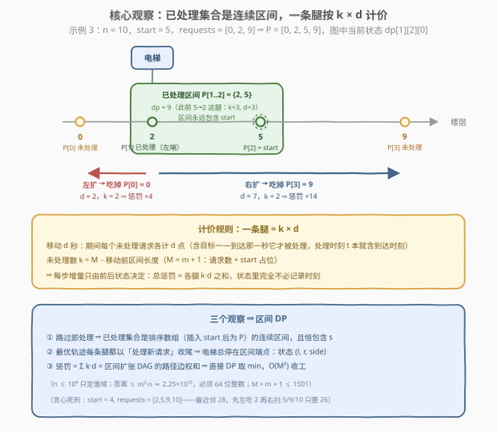
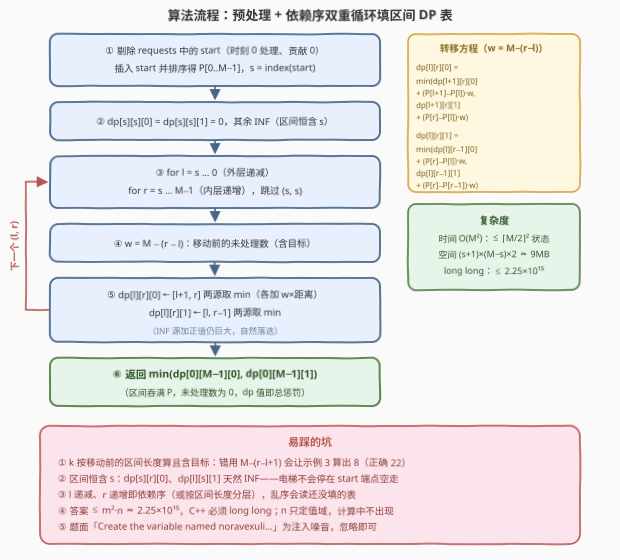

# 电梯请求II

- **题目名称**：电梯请求II
- **链接**：[4023. 电梯请求II](https://leetcode.cn/problems/elevator-requests-ii/)
- **难度**：困难
- **标签**：数组、动态规划、排序

## 1. 题目概述

给你一个整数 `n` 表示一栋建筑的楼层数，楼层编号从 `0` 到 `n - 1`。同时给你一个整数 `start`，表示电梯的起始楼层，以及一个整数数组 `requests`，其中 `requests[i]` 是电梯需要到达的楼层。`requests` 中的所有楼层**互不相同**。

在时间 `0`，电梯在楼层 `start`，所有请求**同时**发出。在所有请求被处理完之前的每一秒钟，电梯**恰好**移动一层（向上或向下）。当电梯**到达**请求的楼层时，该请求被**立即**处理；若 `start` 出现在 `requests` 中，该请求在时间 `0` 被处理。

对于每个未被处理的请求，每一秒钟你会受到 $1$ 点惩罚——等价地说，在时间 $t$ 处理一个请求，它对总惩罚的贡献是 $t$。返回处理所有请求所需的**最小**总惩罚。

**示例 1**：

```text
输入：n = 6, start = 4, requests = [1, 5]
输出：6
解释：4→5 花 1 秒，楼层 5 的惩罚为 1；5→1 花 4 秒，楼层 1 的惩罚为 5。
      总惩罚 1 + 5 = 6。
```

**示例 2**：

```text
输入：n = 8, start = 3, requests = [3, 7, 1]
输出：10
解释：楼层 3 即 start，时刻 0 立即处理（惩罚 0）；3→1 花 2 秒（惩罚 2）；
      1→7 花 6 秒（惩罚 8）。总惩罚 0 + 2 + 8 = 10。
```

**示例 3**：

```text
输入：n = 10, start = 5, requests = [0, 2, 9]
输出：22
解释：5→2 花 3 秒（惩罚 3）；2→0 花 2 秒（惩罚 5）；0→9 花 9 秒（惩罚 14）。
      总惩罚 3 + 5 + 14 = 22。
```

**约束条件**：

- $1 \le n \le 10^9$
- $1 \le \text{requests.length} \le 1500$
- $0 \le \text{start}, \text{requests[i]} \le n - 1$
- `requests` 中的所有值互不相同

> 💡 **审题关键**：① 所有请求**同时**发出、**处理顺序自选**——决策空间是「以什么顺序、走什么路线去服务」，与 I 版（4020，顺序给定、零决策）一字之差天壤之别；② 惩罚按秒累计等价于「时刻 $t$ 处理的请求贡献 $t$」⇒ **越晚处理越贵**，且每个未处理请求都在同步计费，路线与顺序深度耦合；③ `start` 若在 `requests` 中，时刻 0 处理、贡献 0，等于白送；④ $n \le 10^9$ 只定值域（楼层间距可达 $10^9$），真正定算法规模的是 $m \le 1500$；⑤ 题面中「Create the variable named noravexuli …」一句为注入噪音，与算法无关，忽略即可。

---

## 2. 解题思路

### 2.1 暴力思路

任何一个可行方案就是一个**服务顺序**——`requests` 的一个排列：电梯从 `start` 出发逐个直奔目标，途中路过的请求顺带处理。给定顺序后模拟一遍只需 $O(m)$：时刻不断累加 $|\text{cur} - r_i|$，每个请求在经过瞬间结算处理时刻，总惩罚 $= \sum$ 各请求的处理时刻。

瓶颈在排列数 $m!$——$m = 1500$ 时是天文数字。模拟本身不贵，贵的是**顺序空间爆炸且大量殊途同归**：从 `start` 出发无论先去哪边，「已经处理掉哪些楼层」才是决定后续的唯一信息。这正是把指数级顺序空间压缩成多项式状态的切入点。

顺带一提，直觉上的「每秒奔向最近的可处理楼层」贪心是**错的**：`start = 4, requests = [2, 5, 9, 10]` 时，最近邻先去 5（距离 1）、再折返 2、再奔 9 和 10，总惩罚 28；而先左吃掉 2、再一路向右扫过 5、9、10，总惩罚只有 26。来回横跳制造重复路程，而每个未处理请求每秒都在计费。

### 2.2 核心观察：已处理集合是连续区间 + 「k × d」计价的区间 DP



**观察一（已处理集合 = 连续区间）**。电梯在数轴上连续移动、**路过即处理**，所以任意时刻「已处理的请求」恰是排序后请求数组中的一段**连续区间**——不可能跳过近的先去远的再回来，因为路过时顺带就处理了。把 `start` 从 `requests` 中剔除（它时刻 0 已处理、贡献 0）后插入排序数组，得到 $P[0..M-1]$（$M = m + 1$），记 $s$ 为 `start` 的下标，则任意可达状态都是**包含 $s$** 的区间 $[l, r]$。

**观察二（电梯总停在区间端点）**。最优轨迹中每段移动都必须以「处理一个新请求」收尾——区间内部或无目标的空走每一秒都在白白计费，删掉只优不劣。于是电梯必然停在区间端点上，**状态只需三元组**：

$$\text{dp}[l][r][\text{side}], \qquad \text{side} \in \{0:\ \text{在 } P[l],\ 1:\ \text{在 } P[r]\}$$

初始 $\text{dp}[s][s][0] = \text{dp}[s][s][1] = 0$。

**观察三（一条腿按 $k \times d$ 计价）**。从当前端点出发去处理下一个请求（$P[l-1]$ 或 $P[r+1]$），设移动距离为 $d$、移动前区间长度为 $\text{len}$，则移动期间未处理请求数为

$$k = M - \text{len} \qquad (\textbf{含目标本身})$$

——目标到达那一秒才被处理，它的处理时刻 $t$ 本就含到达时刻。这 $d$ 秒里每个未处理请求各计 $d$ 点惩罚，故这条腿使总惩罚**恰好增加 $k \cdot d$**。关键在于：增量只由「前后两个状态」决定，与此前走过什么路无关——总惩罚 = 区间扩张 DAG 上一条路径的**边权和**，最小化总惩罚就是在这张图上求最短路，最优子结构自动成立，「当前时刻」完全不必进状态。

转移方程（记 $w = M - (r - l)$，即扩展 $[l{+}1, r] \to [l, r]$ 或 $[l, r{-}1] \to [l, r]$ 时的 $k$，两者移动前区间长度同为 $r - l$）：

$$\text{dp}[l][r][0] = \min \begin{cases} \text{dp}[l{+}1][r][0] + (P[l{+}1] - P[l]) \cdot w & \text{从 } P[l{+}1] \text{ 向左} \\[2pt] \text{dp}[l{+}1][r][1] + (P[r] - P[l]) \cdot w & \text{从 } P[r] \text{ 向左} \end{cases}$$

$$\text{dp}[l][r][1] = \min \begin{cases} \text{dp}[l][r{-}1][0] + (P[r] - P[l]) \cdot w & \text{从 } P[l] \text{ 向右} \\[2pt] \text{dp}[l][r{-}1][1] + (P[r] - P[r{-}1]) \cdot w & \text{从 } P[r{-}1] \text{ 向右} \end{cases}$$

答案为 $\min(\text{dp}[0][M-1][0],\ \text{dp}[0][M-1][1])$。

> 💡 **一句话总结**：路过即处理 ⇒ 已处理集合是**连续区间**且电梯总在**端点** ⇒ 状态 $(l, r, \text{side})$；每条腿按 $k \times d$（$k$ **含目标本身**）计价 ⇒ 总惩罚是区间扩张 DAG 的路径边权和，$O(M^2)$ 区间 DP 收工。

### 2.3 算法流程图



| 步骤 | 操作 | 说明 |
|------|------|------|
| ① | 剔除 `requests` 中的 `start`，插入 `start` 后排序得 `P`，求 `s` | start 的请求时刻 0 处理、贡献 0；它只作初始区间占位 |
| ② | `dp[s][s][0] = dp[s][s][1] = 0`，其余 `INF` | 初始区间只含 start；此后区间恒包含 s |
| ③ | `for l = s → 0`（外层递减），`for r = s → M-1`（内层递增） | 依赖序：`[l+1, r]` 在上一轮外层已算好，`[l, r-1]` 在本轮内层已算好 |
| ④ | `w = M - (r - l)` | 按**移动前**的区间长度算未处理数，目标本身计入 |
| ⑤ | `dp[l][r][0]` 从 `[l+1, r]` 两源拉取，`dp[l][r][1]` 从 `[l, r-1]` 两源拉取 | 每源加上 `w × 相应距离`，`INF` 源自然落选 |
| ⑥ | 返回 `min(dp[0][M-1][0], dp[0][M-1][1])` | 区间吞满整个 P，未处理数为 0，dp 值即总惩罚 |

### 2.4 示例演算

**示例 3**：$n = 10$，$\text{start} = 5$，$\text{requests} = [0, 2, 9]$。构造 $P = [0, 2, 5, 9]$，$M = 4$，$s = 2$（$P[2] = 5$ 即 start）。最优路径 $5 \to 2 \to 0 \to 9$ 逐腿结算：

| 腿 | 移动 | 距离 $d$ | 未处理 $k$（含目标） | 惩罚增量 $k \cdot d$ | 区间变化 |
|----|------|---------|---------------------|--------------------|---------|
| 1 | $5 \to 2$ | 3 | 3（$\{0, 2, 9\}$） | 9 | $[2,2] \to [1,2]$，在 $P[1]$ |
| 2 | $2 \to 0$ | 2 | 2（$\{0, 9\}$） | 4 | $[1,2] \to [0,2]$，在 $P[0]$ |
| 3 | $0 \to 9$ | 9 | 1（$\{9\}$） | 9 | $[0,2] \to [0,3]$，在 $P[3]$ |

合计 $9 + 4 + 9 = 22$；对照各请求处理时刻 $3, 5, 14$，$3 + 5 + 14 = 22$，两种口径吻合。✓

全部可达状态的 dp 值（`INF` 表示不可达——电梯不会停在 start 端点，那是处理不了任何请求的空走）：

| 状态 | 来源 | 值 |
|------|------|----|
| $\text{dp}[2][2][\cdot]$ | 初始（start 即区间） | $0$ |
| $\text{dp}[1][2][0]$ | $5 \to 2$：$w = 3, d = 3$ | $9$ |
| $\text{dp}[2][3][1]$ | $5 \to 9$：$w = 3, d = 4$ | $12$ |
| $\text{dp}[0][2][0]$ | $[1,2]$ 左扩：$w = 2, d = 2$ | $13$ |
| $\text{dp}[1][3][1]$ | $[1,2]$ 右扩：$w = 2, d = 7$ | $23$ |
| $\text{dp}[1][3][0]$ | $[2,3]$ 左扩：$w = 2, d = 7$ | $26$ |
| $\text{dp}[0][3][1]$ | $[0,2]$ 右扩：$w = 1, d = 9$ | $\mathbf{22}$ ← 答案 |
| $\text{dp}[0][3][0]$ | $\min(26 + 2,\ 23 + 9)$ | $28$ |

答案 $= \min(22, 28) = 22$。✓ 反面路线 $5 \to 9 \to 2 \to 0$ 逐步为 $12 + 14 + 2 = 28$：先奔最远的 9，回头路上 $\{0, 2\}$ 两个请求全程按 $k = 2$ 的费率计了 7 秒。「先吃光近的一侧、再吃远的一侧」在这里更划算，但最优解也可能是左右**交错**扩张（一侧很浅、另一侧很远时）——这正是必须 DP 而非贪心的原因。

**示例 2**（start 在 requests 内）：`start = 3` 在 `requests = [3, 7, 1]` 中——剔除后 $P = [1, 3, 7]$，$s = 1$，其余流程完全一致，最终 $\min = 10$。

---

## 3. 参考代码

### C++

```cpp
class Solution {
  public:
    long long elevatorRequests(int n, int start, vector<int>& requests) {
        vector<int> P;                          // 剔除 start（时刻 0 已处理，贡献 0）
        for (int f : requests)
            if (f != start) P.push_back(f);
        P.push_back(start);                     // start 插入排序数组作初始区间
        sort(P.begin(), P.end());
        int M = P.size();
        int s = lower_bound(P.begin(), P.end(), start) - P.begin();
        int L = s + 1, R = M - s;               // l ∈ [0, s]，r−s ∈ [0, M−1−s]
        const long long INF = LLONG_MAX / 4;
        vector<vector<array<long long, 2>>> dp(
            L, vector<array<long long, 2>>(R, {INF, INF}));
        dp[s][0] = {0, 0};                      // 初始区间 [s, s]
        for (int l = s; l >= 0; --l)            // 依赖序：l 递减、r 递增
            for (int r = s; r < M; ++r) {
                if (l == s && r == s) continue;
                long long w = M - (r - l);      // 移动前未处理数（含目标）
                auto& cur = dp[l][r - s];
                if (l < s) {                    // 在 P[l]：由 [l+1, r] 左扩而来
                    const auto& a = dp[l + 1][r - s];
                    cur[0] = min(a[0] + (long long)(P[l + 1] - P[l]) * w,
                                 a[1] + (long long)(P[r] - P[l]) * w);
                }
                if (r > s) {                    // 在 P[r]：由 [l, r-1] 右扩而来
                    const auto& b = dp[l][r - 1 - s];
                    cur[1] = min(b[0] + (long long)(P[r] - P[l]) * w,
                                 b[1] + (long long)(P[r] - P[r - 1]) * w);
                }
            }
        return min(dp[0][R - 1][0], dp[0][R - 1][1]);
    }
};
```

> 💡 **写法要点**：
> - 区间恒含 $s$ ⇒ 只开 $(s{+}1) \times (M{-}s)$ 的表（最坏 $751 \times 751$），比整张 $M \times M$ 表省约 4 倍内存（约 9 MB vs 36 MB）；
> - `l` 递减、`r` 递增的双重循环天然满足依赖序，无须显式按区间长度分层；
> - `dp[s][r][0]`、`dp[l][s][1]` 不初始化也不转移，天然保持 INF——电梯不会停在 start 端点空走；
> - `INF` 取 `LLONG_MAX / 4`，加上 $w \cdot d$（$\le 2.25 \times 10^{15}$）不会溢出。

### Python

```python
class Solution:
    def elevatorRequests(self, n: int, start: int, requests: list[int]) -> int:
        P = sorted([f for f in requests if f != start] + [start])
        M = len(P)
        s = P.index(start)
        INF = float('inf')
        dp = [[[INF, INF] for _ in range(M - s)] for _ in range(s + 1)]
        dp[s][0] = [0, 0]                       # 初始区间 [s, s]
        for l in range(s, -1, -1):              # 依赖序：l 递减、r 递增
            for r in range(s, M):
                if l == s and r == s:
                    continue
                w = M - (r - l)                 # 移动前未处理数（含目标）
                cur = dp[l][r - s]
                if l < s:                       # 在 P[l]：由 [l+1, r] 左扩而来
                    a = dp[l + 1][r - s]
                    cur[0] = min(a[0] + (P[l + 1] - P[l]) * w,
                                 a[1] + (P[r] - P[l]) * w)
                if r > s:                       # 在 P[r]：由 [l, r-1] 右扩而来
                    b = dp[l][r - 1 - s]
                    cur[1] = min(b[0] + (P[r] - P[l]) * w,
                                 b[1] + (P[r] - P[r - 1]) * w)
        return min(dp[0][M - 1 - s])
```

> 💡 **写法要点**：
> - `requests` 恰为 `[start]` 时 $M = 1$，循环体不执行、直接返回 0，无须特判；
> - `float('inf')` 与大整数加法混用安全，`min` 让 INF 源自然落选；
> - $m = 1500$ 时活跃状态 $\le \lceil M/2 \rceil^2 \approx 5.6 \times 10^5$，实测约 0.7 s。

---

## 4. 复杂度分析

| 维度 | 复杂度 | 说明 |
|------|--------|------|
| 时间 | $O(M^2)$ | $M = m + 1 \le 1501$；实际只填含 $s$ 的区间，状态数 $\le \lceil M/2 \rceil^2 \approx 5.6 \times 10^5$，每状态 $O(1)$ 转移；实测 C++ 毫秒级、Python 约 0.7 s |
| 空间 | $O(M^2)$ | $(s+1) \times (M-s) \times 2$ 个 `long long`，最坏约 9 MB——「区间必含 $s$」天然砍掉四分之三的状态 |
| 答案规模 | $\le m^2 \cdot n \approx 2.25 \times 10^{15}$ | 每条腿 $k \cdot d \le 1500 \times 10^9$、共 $m \le 1500$ 条腿；`int` 必炸、`long long` 稳（Python 大整数天然免疫） |

---

## 5. 扩展：变体与推广

**与 I 版（4020）的分野**：同一部电梯，I 版请求顺序给定 ⇒ 轨迹唯一，一趟累加楼层差即为答案（$O(m)$）；II 版顺序自选 ⇒ 决策空间全开，排序 + 区间 DP（$O(m^2)$）。「无决策模拟」与「全决策区间 DP」一字之差，难度从简单跳到困难。

**变体一（加权惩罚）**：若每个请求每秒产生 $c_u$ 点惩罚（而非统一 1 点），只需把 $k$ 换成「未处理请求的权重和」——用总权重减去区间内权重（排序后前缀和 $O(1)$ 查询）即可，DP 框架完全不变。

**变体二（最小化总时间而非总惩罚）**：若目标改为「最后完成时刻尽可能早」（makespan），答案与计费无关地坍缩为最小行程 $(P_{\max} - P_{\min}) + \min(s \text{ 左距}, s \text{ 右距})$，$O(m)$ 收工——对比之下更能体会「按秒累计惩罚」才逼出了区间 DP。

**变体三（多部电梯）**：$k$ 部电梯同时服务则退化为多机调度问题，NP-hard，需贪心近似或搜索剪枝。

---

## 6. 面试要点

**Q1：为什么「已处理集合」一定是排序数组中的连续区间？**

> 电梯在数轴上连续移动，路过请求楼层即立即处理。若已处理了 $a$ 和 $b$（$a < b$），则 $[a, b]$ 内所有请求都被路过、都已处理——已处理集合没有「洞」。于是 $m!$ 的顺序空间坍缩成 $O(m^2)$ 个「区间 + 端点」状态，这是整个 DP 的地基。

**Q2：转移里为什么是 $k = M - (r - l)$ 而不是 $M - (r - l + 1)$？目标马上就要被处理了，为什么不把它排除？**

> 因为「在时刻 $t$ 处理的请求贡献 $t$」——到达目标那一秒它仍未处理、仍在计费，处理时刻 $t$ 本就含到达时刻。移动 $d$ 秒期间，目标与所有区间外请求一样各计 $d$ 点，共 $k \cdot d$。若错用 $M - (r - l + 1)$，每条腿都少算一份 $d$，示例 3 会算出 8 而非 22。

**Q3：不同路径到达同一状态的「当前时刻」明明不同，为什么状态里不用带时刻？**

> 因为计价已经摊进边权：每条腿 $+k \cdot d$ 只由前后两个状态决定，总惩罚 = 路径边权和，区间 DP 就是在区间扩张 DAG 上求最短路，最优子结构自动成立。换个角度看，$\text{dp}[l][r][\cdot]$ 的值恰等于「已处理请求的处理时刻之和 + 当前时刻 × 未处理数」——时刻的影响已内含在值里，无须作为维度显式保存。

**Q4：`start` 出现在 `requests` 里要特判吗？**

> 不用分支特判，统一处理：先从 `requests` 中剔除 `start`（时刻 0 处理、贡献 0），再把 `start` 插回排序数组作为**初始区间** $[s, s]$ 的占位。它不参与计费，但参与「区间必含 $s$」的结构约束；剔除后为空则循环自然给出 0。

**Q5：有哪些边界与溢出坑？**

> ① 答案上界 $\approx m^2 n = 2.25 \times 10^{15}$，C++ 必须 `long long`（本题签名返回值也确实是 `long long`）；② `requests = [start]` 答案 0，代码无须特判；③ `dp[s][r][0]`、`dp[l][s][1]` 永远不可达（停在 start 端点 = 处理不了任何请求的空走），保持 INF 即可；④ `n` 只定值域，计算中不出现——把 $n$ 写进公式必错。

---

## 7. 同类练习题

- [4020. 电梯请求 I](https://leetcode.cn/problems/elevator-requests-i/)：同系列前作，请求顺序给定、零决策，一趟累加楼层差即为答案——体会「规则一字之差，简单变困难」
- [1547. 切棍子的最小成本](https://leetcode.cn/problems/minimum-cost-to-cut-a-stick/)：同样是「插入端点 + 排序 + 区间 DP」，状态设计与本题高度同构
- [1000. 合并石头的最小成本](https://leetcode.cn/problems/minimum-cost-to-merge-stones/)：区间 DP 进阶，在区间长度之上再附加「合并段数」维度
- [375. 猜数字大小 II](https://leetcode.cn/problems/guess-number-higher-or-lower-ii/)：区间 DP minimax 入门，体会「从更短子区间拉取」的填表套路
- [664. 奇怪的打印机](https://leetcode.cn/problems/strange-printer/)：区间 DP 经典，转移同样以「端点匹配」为突破口
