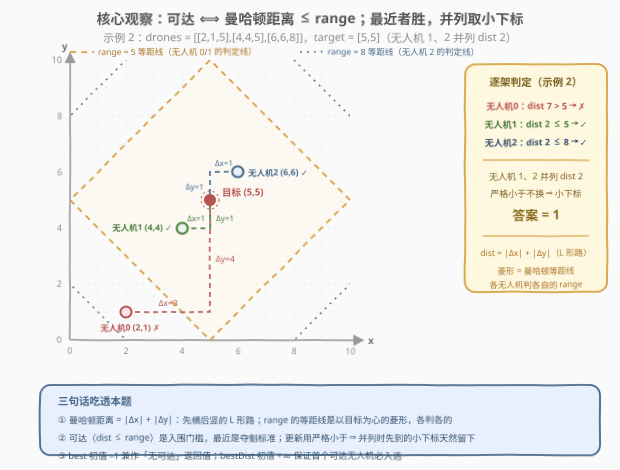
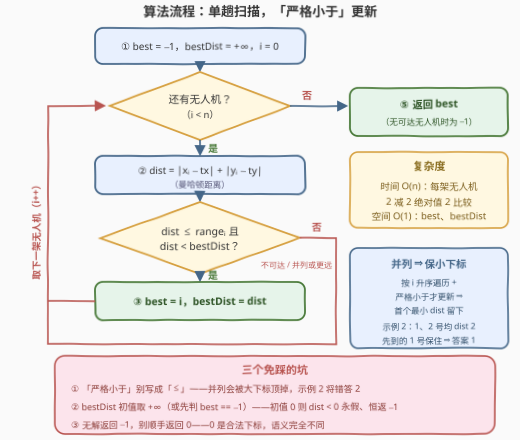

# LeetCode 最近的可用无人机 题解

## 1. 题目概述

- **标题 / 题号**：最近的可用无人机（#4024，easy）
- **链接**：https://leetcode.cn/problems/nearest-available-drone/
- **难度**：简单
- **标签**：数组、枚举

**题意**：给你一个二维整数数组 `drones`，其中 `drones[i] = [xi, yi, rangei]` 表示第 `i` 架无人机的横坐标、纵坐标和飞行范围。

另给你一个整数数组 `target = [tx, ty]`，表示目标的坐标。

如果无人机 `drones[i]` 的坐标与目标坐标之间的**曼哈顿距离**小于或等于其 `rangei`，则该无人机**能够到达**目标。

返回能够到达目标且与目标之间曼哈顿距离**最小**的无人机的**下标**。如果存在多个符合条件的无人机，则返回其中**最小**的下标。如果没有无人机能够到达目标，则返回 `-1`。

两个坐标 $(x_i, y_i)$ 和 $(x_j, y_j)$ 之间的曼哈顿距离为 $|x_i - x_j| + |y_i - y_j|$。

**示例 1**：

```text
输入：drones = [[0,0,8],[2,2,9]], target = [3,4]
输出：1
解释：drones[0] 距目标 |0−3|+|0−4| = 7 ≤ 8，可达；drones[1] 距目标 |2−3|+|2−4| = 3 ≤ 9，可达且更近，答案为 1。
```

**示例 2**：

```text
输入：drones = [[2,1,5],[4,4,5],[6,6,8]], target = [5,5]
输出：1
解释：drones[0] 距目标 7 > 5，不可达；drones[1] 与 drones[2] 距目标均为 2，并列最近，取小下标 1。
```

**示例 3**：

```text
输入：drones = [[4,4,5]], target = [8,6]
输出：-1
解释：drones[0] 距目标 |4−8|+|4−6| = 6 > 5，没有无人机能够到达目标。
```

**约束**：

- $1 \le \text{drones.length} \le 100$
- $\text{drones}[i] = [x_i, y_i, \text{range}_i]$
- $-25 \le x_i, y_i, t_x, t_y \le 25$
- $1 \le \text{range}_i \le 100$

> 💡 **审题关键**：① 可达是**入围门槛**（$\text{dist} \le \text{range}_i$），最近是**夺魁标准**，两步缺一不可——range 之外的无人机再近也不参与比较；② 距离并列时取**小下标**；③ 全军覆没返回 $-1$，而 $0$ 是合法下标，两者别混淆。

## 2. 解题思路

### 2.1 暴力思路：先收集再排序

最直接的写法是两步走：第一趟把所有「可达」无人机的 $(\text{dist}, i)$ 收集起来，按 $\text{dist}$ 升序、$\text{dist}$ 相同按下标升序排序，取首元素；收集结果为空则返回 $-1$。

正确性没有问题，但排序引入了 $O(n \log n)$ 的开销和一份临时空间，而且「只需要最小值」的题根本不需要全序——一次比较就能决出冠军。

另一变体是两趟扫描：第一趟求出可达无人机的最小 $\text{dist}$，第二趟找第一个等于该值的下标。虽已是 $O(n)$，但要扫两遍、还得特判空集，仍不如单趟优雅。

### 2.2 核心观察：单趟扫描 + 严格小于更新



**观察一（判定即两次减法一次加法）**。无人机 $i$ 是否可达只取决于

$$\text{dist}_i = |x_i - t_x| + |y_i - t_y| \;\le\; \text{range}_i$$

几何上，把所有到目标曼哈顿距离等于 $r$ 的点连起来，是一个斜 45° 的**菱形**（所谓"曼哈顿圆"）——每架无人机用自己的 $\text{range}_i$ 画自己的菱形，自己落在自己的菱形边上或内部即可达。示例 2 中无人机 0 的 dist 7 恰好落在「半径 5」与「半径 8」两圈等距线之间：换成 range 8 它就可达，可惜它的 range 只有 5，出局。

**观察二（严格小于 ⇒ 并列天然保小下标）**。按下标从小到大遍历，仅当 $\text{dist} < \text{bestDist}$ 时才更新。于是：

- 后来的并列者（$\text{dist} = \text{bestDist}$）不满足严格小于，**不替换**先到的；
- 而先到的天然是更小下标——示例 2 中无人机 1、2 均 dist 2，先到的 1 号留到最后，答案 1 白送。

**观察三（$-1$ 免特判）**。`best` 初始化为 $-1$、`bestDist` 初始化为 $+\infty$：只要有任何可达无人机，`best` 就会被更新；一趟结束 `best` 仍是 $-1$，恰好就是题目要求的「无可达」返回值。

> 💡 **一句话总结**：一趟扫描，$\text{dist} = |x - t_x| + |y - t_y|$；`dist <= range` 且 `dist < bestDist` 才更新——严格小于把「并列取小下标」变成免费的。

### 2.3 算法流程图



| 步骤 | 操作 | 说明 |
|------|------|------|
| ① | `best = -1`，`bestDist = +∞`，`i = 0` | $-1$ 兼作「无可达」哨兵 |
| ② | `dist = abs(xi - tx) + abs(yi - ty)` | 曼哈顿距离 |
| ③ | 若 `dist <= rangei` 且 `dist < bestDist`：更新 | 严格小于 ⇒ 并列保小下标 |
| ④ | 遍历结束，返回 `best` | 可能是下标，也可能是 $-1$ |

### 2.4 示例演算

**示例 2**：`drones = [[2,1,5],[4,4,5],[6,6,8]]`，`target = [5,5]`：

| 下标 i | 位置 | dist | range | 可达？ | dist < bestDist？ | best / bestDist |
|-------|------|------|-------|--------|-------------------|-----------------|
| 0 | (2,1) | $3+4 = 7$ | 5 | $7 > 5$ ✗ | ——（未入围） | $-1$ / $+\infty$ |
| 1 | (4,4) | $1+1 = 2$ | 5 | $2 \le 5$ ✓ | $2 < +\infty$ ✓ | **1** / 2 |
| 2 | (6,6) | $1+1 = 2$ | 8 | $2 \le 8$ ✓ | $2 < 2$ ✗（并列） | 1 / 2（不换） |

返回 $\mathbf{1}$，与官方答案一致——无人机 2 的并列挑战被「严格小于」挡在门外。

**示例 3**：`drones = [[4,4,5]]`，`target = [8,6]`：$\text{dist} = 4 + 2 = 6 > 5$，无人入围，`best` 始终为 $-1$，返回 $\mathbf{-1}$。

## 3. 参考代码

### C++

```cpp
class Solution {
  public:
    int nearestDrone(vector<vector<int>>& drones, vector<int>& target) {
        int n = drones.size();
        int best = -1;             // 最优无人机下标；-1 兼作「无可达」哨兵
        int bestDist = INT_MAX;    // 对应的曼哈顿距离
        for (int i = 0; i < n; i++) {
            int dist = abs(drones[i][0] - target[0]) + abs(drones[i][1] - target[1]);
            if (dist <= drones[i][2] && dist < bestDist) {  // 严格小于 ⇒ 并列保小下标
                best = i;
                bestDist = dist;
            }
        }
        return best;
    }
};
```

> 💡 **写法要点**：
> - 两个条件合并进一个 `if`：先入围（`≤ range`）再夺魁（`< bestDist`）；
> - `dist` 上界 $|{-25} - 25| + |{-25} - 25| = 100$，`int` 无压力；
> - 若把夺魁写成 `<=`，就必须额外判 `best == -1` 才能避免并列被大下标顶掉——不如直接用严格小于省事。

### Python

```python
class Solution:
    def nearestDrone(self, drones: list[list[int]], target: list[int]) -> int:
        best, best_dist = -1, float('inf')
        for i, (x, y, r) in enumerate(drones):
            dist = abs(x - target[0]) + abs(y - target[1])
            if dist <= r and dist < best_dist:   # 严格小于 ⇒ 并列保小下标
                best, best_dist = i, dist
        return best
```

> 💡 **写法要点**：解包 `(x, y, r)` 比三次下标访问更可读；`float('inf')` 与任意整数比较均安全。也可以写 `min` 一行流，但 tuple 比较加上空集处理反而绕，显式循环最清晰。

## 4. 复杂度分析

| 维度 | 复杂度 | 说明 |
|------|--------|------|
| 时间 | $O(n)$ | 每架无人机 2 次减法、2 次取绝对值、2 次比较 |
| 空间 | $O(1)$ | 仅 `best` / `bestDist`（Python 另有循环变量） |
| 值域 | $\le 100$ | $\text{dist} \le 2 \times 50 = 100$，`int` 足够 |

## 5. 扩展：大规模下的「最近曼哈顿距离」

本题 $n \le 100$，一趟扫描足矣。若规模放大，曼哈顿距离的经典技巧是**旋转坐标系**：令 $u = x + y$、$v = x - y$，则两点曼哈顿距离等于新坐标系下的**切比雪夫距离** $\max(|\Delta u|, |\Delta v|)$。对「**最远**」曼哈顿距离，只需维护 $u, v$ 各自的最大最小值即可 $O(1)$ 查询（参见 [3968. 移动后的最大曼哈顿距离](https://leetcode.cn/problems/maximum-manhattan-distance-after-all-moves/)）。

但「**最近**」没有这种好性质——最小化 $\max$ 无法拆成端点维护，大规模静态最近邻通常要上 **K-D 树**（$O(n \log n)$ 建树、单次查询均摊 $O(\log n)$）；本题还叠加了 range 资格筛选，更是超出模板范畴。规模即难度：$n \le 100$ 时，朴素枚举就是最优解。

## 6. 面试要点

**Q1：为什么「严格小于」能自动处理并列取小下标？**

> 因为按下标升序遍历：先到的并列者先把 `bestDist` 定格在最小值，后来的并列者满足 `dist == bestDist` 但不满足 `dist < bestDist`，不会触发更新。若写成「小于等于」，后来的大下标会顶掉先到的小下标——示例 2 将错答 2。

**Q2：可达判定和最近判定能合并吗？**

> 能，`dist <= range && dist < bestDist` 一个 `if` 即可。语义上是「资格筛选 + 择优」两层：range 外的无人机距离再小也和答案无关。两个条件都是无副作用的谓词，合并后用 `&&` 短路，书写顺序无差；但口述时讲清两层结构是加分项。

**Q3：bestDist 为什么初始化为 +∞ 而不是 0？**

> 更新条件是 `dist < bestDist`，初值取 0 时 `dist ≥ 0` 永假，一架都选不中、恒返 −1。$+\infty$ 保证首个可达无人机必被选中，也就免掉了 `best == -1` 的特判分支。

**Q4：曼哈顿距离的等距线是什么形状？和欧氏距离有何不同？**

> 以中心为原点，$|x| + |y| = r$ 是斜 45° 的菱形（顶点在坐标轴上），而欧氏距离是圆。只能沿网格横竖移动时（本题语义），曼哈顿距离才是真实步数。坐标系旋转 45°（$u = x+y$、$v = x-y$）后，曼哈顿距离变切比雪夫距离 $\max(|\Delta u|, |\Delta v|)$，菱形变正方形——这是处理曼哈顿距离问题的常用变换。

**Q5：有哪些值得自测的边界用例？**

> ① 无人机恰好在目标上：dist 0，只要 range ≥ 1（题目保证）必入选，验证「严格小于不会误杀 0」；② 全部不可达：返回 −1 而非 0；③ 并列最近：验证小下标胜出；④ range 恰好等于 dist：边界是包含的（≤），不能写成 <。

## 同类练习题

| # | 题目 | 与本题的关联 |
|---|------|-------------|
| 1779 | [找到最近的有相同 X 或 Y 坐标的点](https://leetcode.cn/problems/find-nearest-point-that-has-the-same-x-or-y-coordinate/) | 同为「曼哈顿距离最近 + 并列取小下标」的单趟扫描模板 |
| 973 | [最接近原点的 K 个点](https://leetcode.cn/problems/k-closest-points-to-origin/) | 距离排序/快速选择取前 K，用距离平方作比较键 |
| 1266 | [访问所有点的最小时间](https://leetcode.cn/problems/minimum-time-visiting-all-points/) | 切比雪夫距离（可走对角线）逐段累加，与曼哈顿对比记忆 |
| 2515 | [环形数组中到目标字符串的最短距离](https://leetcode.cn/problems/shortest-distance-to-target-string-in-a-circular-array/) | 一维环形上的最近距离，$\min(d, n-d)$ 取向 |
| 3968 | [移动后的最大曼哈顿距离](https://leetcode.cn/problems/maximum-manhattan-distance-after-all-moves/)（[题解](../3901-4000/3968_移动后的最大曼哈顿距离.md)） | 最远曼哈顿距离的坐标系旋转技巧（见第 5 节） |
