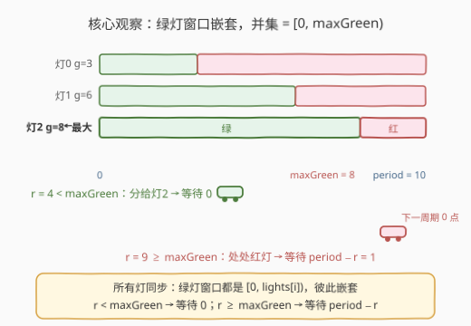
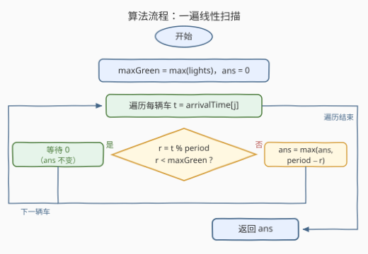

# LeetCode 交通灯的最大等待时间 题解

## 1. 题目概述

- **标题 / 题号**：交通灯的最大等待时间（#4025，medium）
- **链接**：https://leetcode.cn/problems/minimize-the-maximum-waiting-time-at-synchronized-traffic-lights/
- **难度**：中等
- **标签**：贪心、数组

**题意**：给你一个整数 `period` 和一个整数数组 `lights`，其中 `lights[i]` 表示第 $i$ 个交通信号灯**绿灯阶段**的持续时间（秒）。

在时刻 0，所有交通信号灯**同时**从绿灯阶段开始运行，且周期同步：每个周期的持续时间恰好为 `period` 秒。因此第 $i$ 个灯的红灯阶段持续 $period - lights[i]$ 秒。

另给你一个整数数组 `arrivalTime`，其中 `arrivalTime[j]` 表示第 $j$ 辆汽车的到达时间（秒）。

每辆汽车必须被分配到**恰好一个**交通信号灯；多辆汽车可以共用同一盏灯。绿灯亮起时，任意数量的汽车都可以同时通过同一盏灯，汽车之间不会互相阻挡或造成延误。

对于分配到第 $i$ 个灯的汽车 $j$，令 $r = arrivalTime[j] \bmod period$：

- 若 $r < lights[i]$，其等待时间为 $0$；
- 否则，其等待时间为 $period - r$。

一种分配方案的**惩罚值**是所有汽车等待时间中的**最大值**。返回可能得到的**最小惩罚值**。

**示例 1**：

```text
输入：period = 8, lights = [2,3], arrivalTime = [2,5,8,11]
输出：5
解释：一种最优方案：
      车 0 (r=2)  分给灯 1 (g=3)：2 < 3，等待 0
      车 1 (r=5)  分给灯 0 (g=2)：5 ≥ 2，等待 8−5 = 3
      车 2 (r=0)  分给灯 0 (g=2)：0 < 2，等待 0
      车 3 (r=3)  分给灯 0 (g=2)：3 ≥ 2，等待 8−3 = 5
      惩罚值 = max(0, 3, 0, 5) = 5，已是最小。
```

**示例 2**：

```text
输入：period = 10, lights = [3,6,8], arrivalTime = [4,9,15]
输出：1
解释：三辆车全部分给灯 2 (g=8)：
      车 0 (r=4 < 8) 等待 0；车 1 (r=9 ≥ 8) 等待 10−9 = 1；车 2 (r=5 < 8) 等待 0。
      惩罚值 = 1。注意 r=9 的车无论分给哪盏灯都要等 1 秒——时刻 9 所有灯都是红灯。
```

**示例 3**：

```text
输入：period = 5, lights = [2], arrivalTime = [2,3,4,5,6]
输出：3
解释：只有一盏灯：r = [2,3,4,0,1]，其中 r=2,3,4 ≥ 2 需等待 3, 2, 1；r=0,1 < 2 等待 0。
      惩罚值 = 3。
```

**约束**：

- $2 \le period \le 10^9$
- $1 \le lights.length \le 10^4$
- $1 \le lights[i] \le period - 1$
- $1 \le arrivalTime.length \le 10^5$
- $1 \le arrivalTime[j] \le 10^9$

> 💡 **审题关键**：① 灯**没有容量限制**、汽车互不阻挡 ⇒ 一辆车选哪盏灯**完全不影响**其他车的等待，「整体分配」退化为「逐车独立最优」；② 所有灯**同步起步** ⇒ 各灯绿灯窗口都是 $[0,\ lights[i])$，**彼此嵌套**；③ 每辆车的等待只有两档——$0$（赶上某盏绿灯）或 $period - r$（处处红灯，与选哪盏无关）；④ 目标是 **min-max**（最小化最大等待）。

## 2. 解题思路

### 2.1 暴力思路

最直接的想法：枚举每辆车分给哪盏灯，共 $m^n$ 种组合（$m = lights.length$，$n = arrivalTime.length$），对每个方案模拟求最大等待再取最小——$m^n$ 天文数字，完全不可行。

退一步：既然车与车独立，逐辆车在 $m$ 盏灯里挑等待最小的那盏。注意等待函数只有两种取值（$0$ 或 $period-r$），逐车扫 $m$ 盏灯是 $O(nm) = 10^5 \times 10^4 = 10^9$ 次运算——Python 必然超时，C++ 也非常勉强。更重要的是，这种做法**没有利用等待函数的结构**：车 $j$ 能否等待 0，只取决于「是否存在某盏灯满足 $r < lights[i]$」，与具体是哪盏灯无关。

### 2.2 核心观察：只看最大绿灯 maxGreen



三个层层递进的观察：

**观察一（决策独立）**：灯没有容量限制，绿灯期间任意多辆车可同时通过，车与车互不干扰。因此一辆车的选择不会改变其他任何车的等待——$n$ 辆车的联合分配问题退化为**每辆车各自取最优**，答案就是逐车最优等待的最大值。

**观察二（窗口嵌套）**：所有灯同步从时刻 0 变绿，所以灯 $i$ 在每个周期内的绿灯窗口是 $[0,\ lights[i])$、红灯窗口是 $[lights[i],\ period)$。这些窗口**一个套一个**（$lights[i]$ 越大窗口越长），它们的并集恰好是

$$[0,\ \max_i lights[i]) = [0,\ maxGreen)$$

也就是说，绿得最久的那盏灯「覆盖」了所有其他灯的绿灯窗口。

**观察三（等待只有两档）**：对 $r = t \bmod period$：

- 若 $r < maxGreen$：把车分给绿灯最长的那盏灯，等待为 $0$；
- 若 $r \ge maxGreen$：**所有灯此刻都是红灯**，且它们的下一个绿灯都要等到下一周期的 0 点——无论分给谁，等待都是 $period - r$。

> 💡 **一句话总结**：每辆车独立决策，而决策结果只由 $maxGreen$ 一个数决定——
> $$ans = \max_j \begin{cases} 0, & r_j < maxGreen \\ period - r_j, & r_j \ge maxGreen \end{cases}$$

### 2.3 算法流程图



先花 $O(m)$ 求出 $maxGreen$，再花 $O(n)$ 扫一遍所有车：$r < maxGreen$ 的车直接跳过（等待 0 不影响 max 的结果），否则用 $period - r$ 更新答案。

### 2.4 示例演算

以示例 1 为例：`period = 8, lights = [2,3]`，故 $maxGreen = 3$：

| 车 | $t$ | $r = t \bmod 8$ | $r < 3$ ? | 等待 |
|----|-----|-----------------|-----------|------|
| 0  | 2   | 2               | 是        | 0    |
| 1  | 5   | 5               | 否        | 3    |
| 2  | 8   | 0               | 是        | 0    |
| 3  | 11  | 3               | 否        | 5    |

$ans = \max(0, 3, 0, 5) = 5$，与官方答案一致。对照官方解释：官方把 $r=2$ 的车 0 分给了灯 0（而非最大的灯 1）——两者等待同为 0，印证了「等待为 0 时分给哪盏绿灯都一样」；而 $r=3$ 的车 3 落在 $[maxGreen, period) = [3, 8)$ 的全红区，等待 $8-3=5$ 无从减免，这正是答案 5 的来源。

## 3. 参考代码

### C++

```cpp
class Solution {
  public:
    int minPenalty(int period, vector<int>& lights, vector<int>& arrivalTime) {
        int maxGreen = *max_element(lights.begin(), lights.end());
        int ans = 0;
        for (int t : arrivalTime) {
            int r = t % period;
            if (r >= maxGreen) {          // 全红：等待 period - r，与选灯无关
                ans = max(ans, period - r);
            }                             // 否则分给最大的灯，等待 0，跳过
        }
        return ans;
    }
};
```

### Python

```python
from typing import List


class Solution:
    def minPenalty(self, period: int, lights: List[int], arrivalTime: List[int]) -> int:
        max_green = max(lights)
        ans = 0
        for t in arrivalTime:
            r = t % period
            if r >= max_green:            # 全红：等待 period - r，与选灯无关
                ans = max(ans, period - r)
        return ans
```

> ⚠️ **注意** 判断条件是 `r >= maxGreen` 而非 `r > maxGreen`：$r = maxGreen$ 时刚好错过最大那盏灯的绿灯（窗口是左闭右开的 $[0, maxGreen)$），必须等待 $period - r$。示例 3 中 $r = 2 = lights[0]$ 的车等待 $3$，正是这个边界。

## 4. 复杂度分析

| 维度 | 复杂度 | 说明 |
|------|--------|------|
| 时间 | $O(n + m)$ | $O(m)$ 求 `maxGreen` + $O(n)$ 一遍扫描所有车 |
| 空间 | $O(1)$ | 仅常数个额外变量（不含输入） |
| 数值范围 | `int` 足够 | $period,\ arrivalTime[j] \le 10^9 < 2^{31}$，无溢出风险 |

## 5. 扩展：变体与推广

**变体一（灯不同步，各有相位）**：若每盏灯有自己的起始相位 $\varphi_i$，绿灯窗口变为圆上的任意区间 $[\varphi_i,\ \varphi_i + g_i) \bmod period$，嵌套结构消失，「只看 maxGreen」的捷径失效。独立性仍在——每辆车单独取 $\min_i$ 等待，但「零等待判定」变成圆上的区间覆盖问题（可排序 + 前缀统计），非零等待需查询圆上**最近的下一个绿灯起点**。

**变体二（最小化总等待）**：把目标从「最大等待」换成「总等待」，结构完全不变——每辆车的等待依旧只由 $maxGreen$ 决定，把 `max` 换成累加即可，仍是一遍扫描。

**变体三（每盏灯有容量 $k$）**：若绿灯期间每盏灯最多放行 $k$ 辆，车与车的独立性被破坏——同周期到达的车会争抢同一盏灯的配额。需要把车按 $r$ 排序后做贪心安置，或回到经典 min-max 套路：二分答案 + 贪心判定可行性。

## 6. 面试要点

**Q1：为什么每辆车可以独立选灯，不需要全局统筹？**

> 灯没有容量限制、绿灯期间任意多车可同时通过、车互不阻挡——一辆车的分配**不改变**其他任何车的等待时间。联合优化的目标又是逐车等待的 $\max$，因此「先逐车取最小、再整体取最大」就是全局最优。

**Q2：为什么只需关心 maxGreen，其余 $m-1$ 盏灯全是「废灯」？**

> 所有灯同步从 0 变绿，绿灯窗口是嵌套区间 $[0, lights[i])$，最大那盏的窗口覆盖其余所有窗口。于是「存在某盏灯此刻是绿灯」⇔「$r < maxGreen$」；需要等待 0 时分给最大的灯即可，其余灯不提供任何额外可通行时刻。

**Q3：$r \ge maxGreen$ 时，把车分给不同的灯会有区别吗？**

> 不会。此刻所有灯都是红灯，且它们下一个绿灯统一始于下一周期的 0 点，等待一律是 $period - r$，与所选灯无关——这正是「分配」维度可以彻底扔掉的原因。

**Q4：什么时候答案是 0？**

> 当且仅当每辆车都满足 $arrivalTime[j] \bmod period < maxGreen$。代码中 `ans` 初始化为 0（$\max$ 的单位元），全绿灯时循环不更新，自然返回 0。

**Q5：如果把「同步」条件去掉，本题会难在哪里？**

> 嵌套结构消失，绿灯窗口散布在圆上：零等待要看 $r$ 是否落在任一窗口内（区间覆盖），非零等待要找最近的下一个绿灯起点（圆上最近端点查询）。独立性还在，但单靠一个 `max` 聚合不再够用，需要排序/扫描等圆上几何手段（见第 5 节变体一）。

## 同类练习题

| # | 题目 | 与本题的关联 |
|---|------|-------------|
| 2594 | [修车的最少时间](https://leetcode.cn/problems/minimum-time-to-repair-cars/) | 同为「最小化最大等待」，但需二分答案 + 贪心判定，对照本题「独立决策直接贪心」的捷径何时失效 |
| 2064 | [分配给商店的最多商品的最小值](https://leetcode.cn/problems/minimized-maximum-of-products-distributed-to-any-store/) | 分配 + min-max 的二分答案代表题，体会本题因独立性免去二分的幸运之处 |
| 1870 | [准时到达的列车最小时速](https://leetcode.cn/problems/minimum-speed-to-arrive-on-time/) | 交通场景下的单调性 + 二分最小化，与本题的「一遍贪心」互为补充 |
| 1011 | [在 D 天内送达包裹的能力](https://leetcode.cn/problems/capacity-to-ship-packages-within-d-days/) | min-max 经典题，掌握「猜答案 + 贪心验证」的通用套路 |
