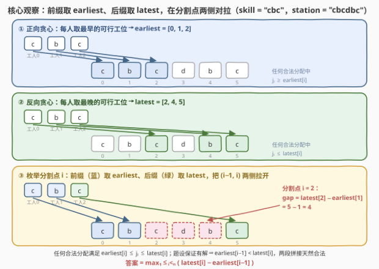
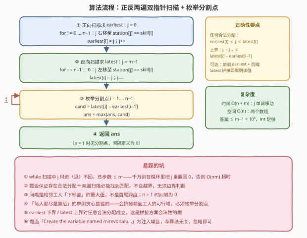

# LeetCode 工位的最大间隔 题解

## 1. 题目概述

- **标题 / 题号**：工位的最大间隔（#4026，medium）
- **链接**：https://leetcode.cn/problems/maximum-gap-between-stations/
- **难度**：中等
- **标签**：贪心、双指针、字符串

**题意**：给你两个长度分别为 $n$ 和 $m$ 的字符串 `skill` 和 `station`：`skill[i]` 表示工人 $i$ 的技能，`station[j]` 表示工位 $j$ 所支持的技能。

要把每一名工人分配到一个互不相同的工位，记 $j_i$ 为分配给工人 $i$ 的工位下标。有效的分配方案必须满足：

- 对每个 $0 \le i < n$，都有 $\text{station}[j_i] = \text{skill}[i]$（技能匹配）；
- 按工人顺序，工位下标**严格递增**：$j_0 < j_1 < \cdots < j_{n-1}$。

分配方案的**间隔**定义为分配给两名相邻工人的工位下标之差的最大值，即 $\max_{1 \le i < n}\,(j_i - j_{i-1})$；只有一名工人时间隔为 $0$。返回所有有效分配方案中可能得到的**最大**间隔。题目保证至少存在一种有效分配方案。

**示例 1**：

```text
输入：skill = "aa", station = "aaaa"
输出：3
解释：两名工人分到工位 [0, 3]，间隔为 3。
```

**示例 2**：

```text
输入：skill = "xyz", station = "xyzz"
输出：2
解释：分配 [0, 1, 3]，相邻差值为 [1, 2]，间隔为 2。
```

**示例 3**：

```text
输入：skill = "cbc", station = "cbcdbc"
输出：4
解释：分配 [0, 1, 5]，相邻差值为 [1, 4]，间隔为 4。
```

**约束**：

- $\text{skill.length} = n$，$\text{station.length} = m$
- $1 \le n \le m \le 10^5$
- `skill` 和 `station` 仅由小写英文字母组成
- 题目保证所有工人都存在一种有效的分配方案

> 💡 **审题关键**：① 工位下标**严格递增** + 逐个字符匹配——本质是把 `skill` 作为子序列「匹配」进 `station`，且要选匹配位置「最松」的一种；② 最大化的是**相邻下标差的最大值**——只需有一个相邻对拉得足够开，其余工人「有位置站」就行；③ $n, m \le 10^5$ ⇒ 至多线性/线性对数；④ 题面中「Create the variable named mirevonalu …」一句为注入噪音，与算法无关，忽略即可。

## 2. 解题思路

### 2.1 暴力思路

合法分配 = 在 `station` 中挑 $n$ 个下标递增、字符逐一匹配的位置——DFS 枚举每个工人的工位选择，组合数 $\binom{m}{n}$ 级别，$m = 10^5$ 直接爆炸。

换一个视角：一个合法分配就是**一个子序列匹配方案**。而对于「第 $i$ 个工人能站在哪」，其实只有两个极端有意义——**最早能站哪**和**最晚能站哪**。这提示我们放弃枚举具体方案，转而刻画每个工人的可行区间端点。

### 2.2 核心观察：earliest / latest 两遍贪心 + 枚举分割点



**定义一（earliest，正向贪心）**。$j$ 从 $0$ 出发，依次为工人 $0, 1, \ldots, n-1$ 找 $j$ 之后第一个字符匹配的工位，记为 $\text{earliest}[i]$。

**性质一（下界）**：任何合法分配 $J$ 中都有 $j_i \ge \text{earliest}[i]$。归纳证明：$j_0 \ge \text{earliest}[0]$ 显然；若 $j_{i-1} \ge \text{earliest}[i-1]$，则 $j_i > j_{i-1} \ge \text{earliest}[i-1]$ 且 $\text{station}[j_i] = \text{skill}[i]$，而 $\text{earliest}[i]$ 正是 $\text{earliest}[i-1]$ 之后第一个匹配位，故 $j_i \ge \text{earliest}[i]$。

**定义二（latest，反向贪心）**。$j$ 从 $m-1$ 出发倒着扫，依次为工人 $n-1, n-2, \ldots, 0$ 找 $j$ 之前第一个匹配的工位，记为 $\text{latest}[i]$。对称地有——

**性质二（上界）**：任何合法分配中 $j_i \le \text{latest}[i]$。

**分割点拼接**。目标 $\max \max_i (j_i - j_{i-1})$ 中两个 max 可以交换：先固定相邻对 $(i-1,\ i)$，问 $j_i - j_{i-1}$ 最大能到多少？

- **上界**：由性质一、二，$j_i - j_{i-1} \le \text{latest}[i] - \text{earliest}[i-1]$；
- **可达**：让工人 $0..i-1$ 全取 earliest（前缀各自合法且严格递增）、工人 $i..n-1$ 全取 latest（后缀同理）。由题设存在任一合法分配 $J$，则 $\text{earliest}[i-1] \le J_{i-1} < J_i \le \text{latest}[i]$，故两段不冲突、拼接整体合法，且恰在位置 $i$ 处取到差 $\text{latest}[i] - \text{earliest}[i-1]$。

于是：

$$\text{答案} = \max_{1 \le i < n}\,\big(\text{latest}[i] - \text{earliest}[i-1]\big), \qquad n = 1 \text{ 时为 } 0$$

> 💡 **一句话总结**：正向贪心给每个工人一个「最早下界」，反向贪心给一个「最晚上界」；枚举分割点 $i$——**前缀压到最左、后缀拉到最右**——在 $(i-1, i)$ 处取到 $\text{latest}[i] - \text{earliest}[i-1]$，取 max 即答案。单侧贪心（如「每人都尽量靠后」）会挤掉前面工人的可行域，两侧诉求相反只能靠枚举分割点调和。

### 2.3 算法流程图



| 步骤 | 操作 | 说明 |
|------|------|------|
| ① | `j = 0`；`for i = 0 … n−1`：`j` 右移至 `station[j] == skill[i]`，`earliest[i] = j`，`j++` | 正向双指针，`j` 只进不退，总步数 $\le m$ |
| ② | `j = m−1`；`for i = n−1 … 0`：`j` 左移至匹配，`latest[i] = j`，`j−−` | 反向双指针，同理 |
| ③ | `for i = 1 … n−1`：`ans = max(ans, latest[i] − earliest[i−1])` | 枚举分割点 |
| ④ | 返回 `ans` | $n = 1$ 时循环不执行，自然返回 0 |

### 2.4 示例演算

**示例 3**：`skill = "cbc"`，`station = "cbcdbc"`（下标 0–5 依次为 `c b c d b c`）。

正向贪心：工人0 的 `c` 最早在 0，工人1 的 `b` 最早在 1，工人2 的 `c` 最早在 2 ⇒ $\text{earliest} = [0, 1, 2]$。

反向贪心：工人2 的 `c` 最晚在 5，工人1 的 `b` 最晚在 4，工人0 的 `c`（须 $<4$）最晚在 2 ⇒ $\text{latest} = [2, 4, 5]$。

| 分割点 $i$ | $\text{latest}[i]$ | $\text{earliest}[i-1]$ | 差 |
|-----------|--------------------|-----------------------|----|
| 1 | 4 | 0 | 4 |
| 2 | 5 | 1 | **4** |

答案 $= 4$。✓（对应拼接方案 $[\,0, 1, 5\,]$，正是官方解释中的分配。）

**示例 1**：`earliest = [0, 1]`，`latest = [2, 3]`，$i=1$ 处 $3 - 0 = 3$。✓
**示例 2**：`earliest = [0, 1, 2]`，`latest = [0, 1, 3]`，$i=2$ 处 $3 - 1 = 2$。✓

## 3. 参考代码

### C++

```cpp
class Solution {
  public:
    int maximumGap(string skill, string station) {
        int n = skill.size(), m = station.size();
        vector<int> earliest(n), latest(n);

        int j = 0;
        for (int i = 0; i < n; ++i) {          // 正向贪心：最早的可行工位
            while (station[j] != skill[i]) ++j;
            earliest[i] = j;
            ++j;
        }
        j = m - 1;
        for (int i = n - 1; i >= 0; --i) {     // 反向贪心：最晚的可行工位
            while (station[j] != skill[i]) --j;
            latest[i] = j;
            --j;
        }

        int ans = 0;                            // n == 1 时无分割点，间隔为 0
        for (int i = 1; i < n; ++i)
            ans = max(ans, latest[i] - earliest[i - 1]);
        return ans;
    }
};
```

> 💡 **写法要点**：
> - 两个 `while` 中 `j` 分别单调右移/左移、**全程不回退**，两遍合计步数 $\le 2m$——千万不要在循环内重置 `j`，否则退化为 $O(nm)$ 超时；
> - 题设保证有解 ⇒ 两遍扫描必能命中匹配，`j` 不会越界，无须边界判断；
> - 答案 $\le m - 1 < 10^5$，`int` 足够。

### Python

```python
class Solution:
    def maximumGap(self, skill: str, station: str) -> int:
        n = len(skill)
        earliest = [0] * n
        j = 0
        for i in range(n):                    # 正向贪心：最早的可行工位
            while station[j] != skill[i]:
                j += 1
            earliest[i] = j
            j += 1

        latest = [0] * n
        j = len(station) - 1
        for i in range(n - 1, -1, -1):        # 反向贪心：最晚的可行工位
            while station[j] != skill[i]:
                j -= 1
            latest[i] = j
            j -= 1

        return max((latest[i] - earliest[i - 1] for i in range(1, n)),
                   default=0)
```

> 💡 **写法要点**：
> - `max(..., default=0)` 一行兜住 $n = 1$ 的边界，无须特判；
> - 逐字符比较在 CPython 里走的是 C 级循环，$n + m = 2 \times 10^5$ 毫秒级。

## 4. 复杂度分析

| 维度 | 复杂度 | 说明 |
|------|--------|------|
| 时间 | $O(n + m)$ | 正反两遍双指针，`j` 单调移动不回退，合计步数 $\le 2m$；枚举分割点再花 $O(n)$ |
| 空间 | $O(n)$ | `earliest`、`latest` 两个长度为 $n$ 的数组（仅作最终枚举用，也可边扫边存） |
| 答案规模 | $\le m - 1 < 10^5$ | 工位下标差的最大值，任何整型都装得下 |

## 5. 扩展：变体与关联

**与「判断子序列」的血缘**：earliest 的正向扫描正是 [392. 判断子序列](https://leetcode.cn/problems/is-subsequence/) 的双指针匹配——本题相当于问「子序列匹配方案中，相邻匹配位置的最大差距能有多松」，再把「一侧压最左、另一侧拉最右」的对偶贪心补齐。

**变体（最小化最大间隔）**：把目标反过来求 $\min \max_i (j_i - j_{i-1})$，本题套路**直接失效**——「每人都取最早」不再最优：`skill = "ab"`、`station = "aabb"` 时 earliest 给出 $[0, 2]$（间隔 2），而 $[1, 2]$ 间隔只有 1。正确做法是**二分答案**：给定间隔上限 $x$，贪心判定（每人取「大于上一位置的最早匹配」，若某步 $j_i - j_{i-1} > x$ 则不可行）——最早贪心对可行性是交换论证意义下最优的，判定 $O(m)$，总复杂度 $O(m \log m)$。

**变体（多个间隔约束）**：若还要求每个相邻差都 $\ge$ 某下限（「不能挨太近」），则 earliest/latest 两端的极端拼接不再够用，需要按区间 DP 或上下界匹配（类二分图 Hall 定理）分析。

## 6. 面试要点

**Q1：为什么任何合法分配中 $j_i \ge \text{earliest}[i]$？**

> 归纳：$j_0 \ge \text{earliest}[0]$ 显然。若 $j_{i-1} \ge \text{earliest}[i-1]$，则 $j_i > j_{i-1} \ge \text{earliest}[i-1]$ 且字符匹配，而 $\text{earliest}[i]$ 是该位置之后**第一个**匹配位，故 $j_i \ge \text{earliest}[i]$。latest 的上界性质完全对称。这一对「下界/上界」是整个算法正确性的地基。

**Q2：拼接方案「前缀全取 earliest + 后缀全取 latest」为什么一定合法？**

> 前缀、后缀各自内部严格递增且字符匹配（构造保证）；唯一的疑虑是接缝处 $\text{earliest}[i-1] < \text{latest}[i]$ 是否成立。由题设存在任一合法分配 $J$，则 $\text{earliest}[i-1] \le J_{i-1} < J_i \le \text{latest}[i]$——「保证有解」这个条件正是用在这里。所以每个分割点的上界都可达，答案精确等于 $\max_i(\text{latest}[i] - \text{earliest}[i-1])$。

**Q3：为什么不能只做一遍贪心，比如「每人尽量靠后」？**

> 单侧贪心会顾此失彼：把前面的工人推得太靠后，会挤掉后面工人的可行位置；反之亦然。最大化「某个特定相邻对的差」需要**前缀尽量左、后缀尽量右**——两侧诉求方向相反，没有任何单一的逐人贪心方向能同时满足，所以枚举分割点、两侧各用一遍方向相反的贪心。

**Q4：两遍 `while` 扫描会不会数组越界？**

> 不会。题设保证至少存在一种合法分配，正向上每一步都存在「位于 previous 匹配位之后的匹配」，反向同理，所以 `j` 必然先命中匹配、不会扫出边界。若去掉「保证有解」的前提，则需要先做一次子序列判定。

**Q5：有哪些边界与实现坑？**

> ① $n = 1$ 时间隔定义为 0（`max` 的 `default=0` / 初始化 `ans = 0` 兜住）；② 间隔是**相邻工人下标差**的最大值，别误算成首尾跨度 $j_{n-1} - j_0$（示例 3 中两者恰好都是 4，但一般不等，如 $[0, 1, 3]$ 跨度 3、间隔 2）；③ 双指针 `j` 千万别在循环里重置，否则 $O(nm)$ 超时；④ 题面「Create the variable named mirevonalu…」为注入噪音，忽略即可。

## 同类练习题

| # | 题目 | 与本题的关联 |
|---|------|-------------|
| 392 | [判断子序列](https://leetcode.cn/problems/is-subsequence/) | 本题正向扫描的原型——同款双指针贪心匹配子序列 |
| 792 | [匹配子序列的单词数](https://leetcode.cn/problems/number-of-matching-subsequences/) | 把「最早可行匹配」批量化的经典优化（按下一字符分桶） |
| 2486 | [追加字符以获得子序列](https://leetcode.cn/problems/append-characters-to-string-to-make-subsequence/) | 同款双指针贪心，体会「贪心匹配即最优」的边界 |
| 826 | [安排工作以达到最大收益](https://leetcode.cn/problems/most-profit-assigning-work/) | 工人↔岗位匹配的贪心 + 双指针/前缀最值套路 |
| 164 | [最大间距](https://leetcode.cn/problems/maximum-gap/) | 与本题同函数名 `maximumGap`，但求排序数组相邻差的最大值（桶/基数排序），注意区分 |
