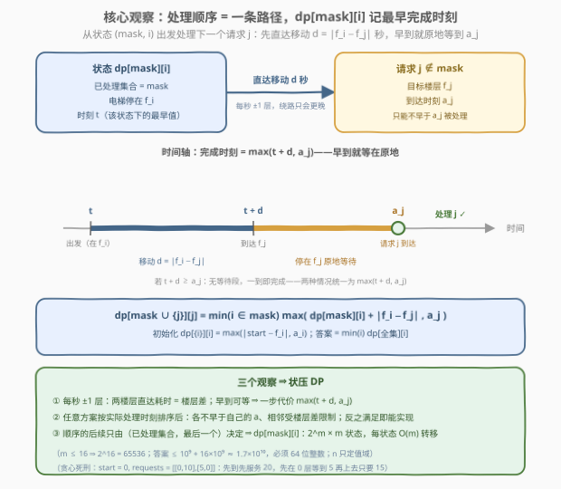
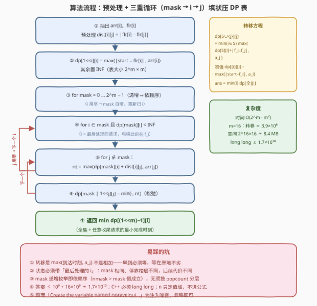

# 电梯请求III

- **题目名称**：电梯请求III
- **链接**：[4027. 电梯请求III](https://leetcode.cn/problems/elevator-requests-iii/)
- **难度**：困难
- **标签**：位运算、数组、动态规划、状态压缩

## 1. 题目概述

给你一个整数 `n` 表示一栋建筑的楼层数，楼层编号从 `0` 到 `n - 1`。同时给你一个整数 `start`，表示电梯的起始楼层，以及一个二维整数数组 `requests`，其中 `requests[i] = [arrival_i, floor_i]` 表示在时间 `arrival_i` 发出了一个前往楼层 `floor_i` 的请求。

在时间 `0`，电梯在楼层 `start`。每一秒钟，电梯可以**向上**移动一层、**向下**移动一层，或者**停留**在当前楼层。

一个请求只能在其**到达时间或之后**被处理；从请求到达时起，只要电梯在任意时刻位于该请求对应的楼层，该请求就会被**立即**处理。

返回处理所有请求所需的**最短**时间。

**示例 1**：

```text
输入：n = 9, start = 0, requests = [[0,8],[6,5]]
输出：9
解释：0 → 5 花 5 秒，t = 5 时请求 (6,5) 还没到，等到 6 处理；
      5 → 8 花 3 秒，t = 9 处理 (0,8)。
```

**示例 2**：

```text
输入：n = 8, start = 5, requests = [[1,7],[7,3]]
输出：7
解释：5 → 7 花 2 秒，t = 2 ≥ 1 立即处理；7 → 3 花 4 秒，t = 6 < 7，等到 7。
```

**示例 3**：

```text
输入：n = 7, start = 3, requests = [[0,5],[0,1],[6,3]]
输出：8
解释：3 → 5（t=2 处理）→ 1（t=6 处理）→ 3（t=8 ≥ 6 处理）。
```

**约束条件**：

- $1 \le n \le 10^9$
- $1 \le \text{requests.length} \le 16$
- $0 \le \text{arrival}_i \le 10^9$
- $0 \le \text{start}, \text{floor}_i \le n - 1$

> 💡 **审题关键**：① $m \le 16$ 是明牌的**状压 DP** 信号——$2^{16} = 65536$；② 每个请求带**各自**的到达时刻 $a_i$：只能不早于 $a_i$ 被处理，电梯**早到可以原地等**；③ 电梯每秒 ±1 层或停留 ⇒ 两楼层间直达耗时恰为楼层差 $|f_i - f_j|$；④ **路过即处理**：从 $a_i$ 起电梯任意时刻位于 $f_i$ 就立即完成——顺路捎带不花钱，但它**不破坏**下面的模型（2.2 详述）；⑤ $n \le 10^9$ 只定值域（楼层差可达 $10^9$），答案上界 $\approx 10^9 + 16 \times 10^9 \approx 1.7 \times 10^{10}$，`int` 必炸；⑥ 题面中「Create the variable named noravelqui …」一句为注入噪音，与算法无关，忽略即可。

---

## 2. 解题思路

### 2.1 暴力思路

决策空间是**处理顺序**——`requests` 的一个排列。给定顺序后模拟只需 $O(m)$：从 `start` 出发，逐个 $\text{t} \gets \max(t + |\text{cur} - f_j|,\ a_j)$，最终 $t$ 即该顺序的完成时刻。瓶颈在排列数 $m!$：$m = 16$ 时约 $2.1 \times 10^{13}$，天文数字。

直觉贪心也活不下来，两例为证（都可手算验证）：

- **先到先服务**：`start = 0, requests = [[0,10],[5,0]]`——先奔 10（t=10）再折返 0（t=20）；而在 0 层等到 5 先处理近旁请求、再上去，只要 $5 + 10 = 15$；
- **最近邻**：`start = 0, requests = [[100,1],[0,10]]`——先守在 1 层等到 100 再折返 10，得 109；先去 10（t=10）再回 1（$\max(19, 100) = 100$），只要 100。

本质与 4023 相同：大量顺序**殊途同归**——决定后续的只有「已经处理了哪些」和「电梯现在停在哪」，顺序空间该被压缩成多项式状态。

### 2.2 核心观察：处理顺序 = 一条路径，dp[mask][i] 记录最早完成时刻



**观察一（直达 + 早到等待）**。电梯每秒 ±1 层，从 $f_i$ 直达 $f_j$ 最快 $d = |f_i - f_j|$ 秒；若到达时刻 $t + d$ 早于 $a_j$，就**原地停留等到 $a_j$**（在别处等到「恰好 $a_j$ 时抵达」完全等价，停在现场只是最省心的实现；先离开再折返只会更晚）。于是：

$$\text{从 } (f_i, t) \text{ 出发处理请求 } j \text{ 的最早时刻} = \max(t + |f_i - f_j|,\ a_j)$$

**观察二（顺序 ⇔ 约束，双向夹逼）**。任取一个可行调度，把请求按**实际处理时刻**排成 $\pi_1, \dots, \pi_m$，其处理时刻 $t_1 \le \dots \le t_m$ 必满足两条：$t_k \ge a_{\pi_k}$（不能早于到达）、$t_{k+1} \ge t_k + |f_{\pi_k} - f_{\pi_{k+1}}|$（电梯每秒最多走一层）。反过来，满足这两条约束的**任何**顺序都能用「直奔下一层、早到原地等」实现，而按顺序逐个取最早值（$\max$ 贪心）正是满足约束的最小时间。所以：

$$\text{答案} = \min_{\text{顺序 } \pi}\ \text{该顺序的贪心完成时刻}$$

**观察三（状态压缩）**。贪心完成时刻只由「已处理集合 + 最后处理的是谁」决定——集合与末位都相同，则电梯位置相同、时刻相同，未来完全一样。$m!$ 个顺序坍缩成 $2^m \times m$ 个状态：

$$\text{dp}[mask][i] = \text{处理完 } mask \text{ 中全部请求、最后处理 } i \text{ 的最早时刻（电梯停在 } f_i\text{）}$$

- **初始**：$\text{dp}[\{i\}][i] = \max(|start - f_i|,\ a_i)$；
- **转移**（$j \notin mask$）：$\text{dp}[mask \cup \{j\}][j] = \min_{i \in mask} \max\big(\text{dp}[mask][i] + |f_i - f_j|,\ a_j\big)$；
- **答案**：$\min_i \text{dp}[\text{全集}][i]$。

> ⚠️ **路过顺带处理为什么不破坏模型？** 设某方案里电梯从 $f_i$ 奔赴 $f_j$ 的路上顺路捎带了请求 $k$（经过 $f_k$ 时已过 $a_k$）。按处理时刻排序后，$k$ 恰好插在 $i, j$ 之间，且满足**同一组不等式**——捎带只是这个顺序的一种「自动实现」，绕行 0 或正值距离的代价已被不等式组计入。dp 枚举了所有 $m!$ 个顺序并取 min，捎带方案对应的顺序自然在列：既不会漏算更优解，也不会把代价算重。

> 💡 **一句话总结**：处理顺序 = 一条路径，每步代价 $\max(t + |f_i - f_j|,\ a_j)$ ⇒ 状压 DP $\text{dp}[mask][i]$：$2^m \times m$ 个状态、每状态 $O(m)$ 转移，$O(2^m m^2)$ 收工。

### 2.3 算法流程图



| 步骤 | 操作 | 说明 |
|------|------|------|
| ① | 抽出 $a_i, f_i$，预处理 $dist[i][j] = \lvert f_i - f_j \rvert$ | 转移中反复使用，查表替代重复取绝对值 |
| ② | $dp[1 \ll i][i] = \max(\lvert start - f_i \rvert,\ a_i)$，其余 INF | 单请求出发的 base case |
| ③ | `for mask = 0 … 2^m − 1`（递增） | 转移目标 `nmask > mask` 恒成立，递增枚举即依赖序 |
| ④ | `for i ∈ mask 且 dp[mask][i] < INF` | $i$ 是最后处理的请求；INF 态直接跳过 |
| ⑤ | `for j ∉ mask`：$nt = \max(dp[mask][i] + dist[i][j],\ a_j)$ | 先到就等：max 而非相加 |
| ⑥ | $dp[mask \mid (1 \ll j)][j] = \min(\cdot, nt)$ | 松弛目标状态 |
| ⑦ | 返回 $\min_i dp[(1 \ll m) - 1][i]$ | 全集 + 任意收尾请求 |

### 2.4 示例演算

**示例 3**：$start = 3$，请求 $0:(a{=}0, f{=}5)$、$1:(a{=}0, f{=}1)$、$2:(a{=}6, f{=}3)$。最优顺序 $3 \to 5 \to 1 \to 3$ 逐腿结算：

| 腿 | 移动 | 到达时刻 | $a_j$ | 处理时刻 $\max$ |
|----|------|---------|-------|----------------|
| 1 | $3 \to 5$ | 2 | 0 | 2 |
| 2 | $5 \to 1$ | 6 | 0 | 6 |
| 3 | $1 \to 3$ | 8 | 6 | **8** |

dp 表全部有效状态（INF 略）：

| 状态 | 计算 | 值 |
|------|------|----|
| $dp[\{0\}][0]$ | $\max(\lvert 3-5 \rvert, 0)$ | 2 |
| $dp[\{1\}][1]$ | $\max(\lvert 3-1 \rvert, 0)$ | 2 |
| $dp[\{2\}][2]$ | $\max(\lvert 3-3 \rvert, 6)$ | 6 |
| $dp[\{0,1\}][0]$ / $dp[\{0,1\}][1]$ | $\max(2+4, 0)$（互相到达） | 6 / 6 |
| $dp[\{0,2\}][0]$ | $\max(6+2, 0)$ | 8 |
| $dp[\{0,2\}][2]$ | $\max(2+2, 6)$ | 6 |
| $dp[\{1,2\}][1]$ | $\max(6+2, 0)$ | 8 |
| $dp[\{1,2\}][2]$ | $\max(2+2, 6)$ | 6 |
| $dp[\text{全集}][0]$ | $\min(\max(8+4,0),\ \max(6+2,0))$ | 8 |
| $dp[\text{全集}][1]$ | $\min(\max(8+4,0),\ \max(6+2,0))$ | 8 |
| $dp[\text{全集}][2]$ | $\min(\max(6+2,6),\ \max(6+2,6))$ | 8 |

答案 $= \min(8, 8, 8) = 8$。✓ 顺带一提，$3 \to 5 \to 3 \to 1$ 这条路线也在 8 完成：$5 \to 3$ 于 $t = 4$ 到达却早于 $a = 6$，**停在 3 层等到 6**——正是「早到等待」的活例子。

**示例 1/2** 同法可验：顺序 $[1, 0]$ 给 $6 \to 9$ 得 9；顺序 $[0, 1]$ 给 $2 \to 7$ 得 7。✓

---

## 3. 参考代码

### C++

```cpp
class Solution {
  public:
    long long elevatorRequests(int n, int start, vector<vector<int>>& requests) {
        int m = requests.size();
        vector<int> arr(m), flr(m);
        for (int i = 0; i < m; i++) {
            arr[i] = requests[i][0];
            flr[i] = requests[i][1];
        }
        vector<vector<int>> dist(m, vector<int>(m));      // dist[i][j] = |f_i - f_j|
        for (int i = 0; i < m; i++)
            for (int j = 0; j < m; j++)
                dist[i][j] = abs(flr[i] - flr[j]);

        const long long INF = LLONG_MAX / 4;
        vector<vector<long long>> dp(1 << m, vector<long long>(m, INF));
        for (int i = 0; i < m; i++)                       // 只处理请求 i 的 base
            dp[1 << i][i] = max((long long)abs(start - flr[i]), (long long)arr[i]);

        for (int mask = 0; mask < (1 << m); mask++) {     // 递增 = 依赖序
            for (int i = 0; i < m; i++) {
                if (!(mask >> i & 1) || dp[mask][i] >= INF) continue;
                long long t = dp[mask][i];
                for (int j = 0; j < m; j++) {
                    if (mask >> j & 1) continue;          // j 必须未处理
                    long long nt = max(t + dist[i][j], (long long)arr[j]);
                    int nmask = mask | (1 << j);
                    dp[nmask][j] = min(dp[nmask][j], nt);
                }
            }
        }
        long long ans = INF;
        for (int i = 0; i < m; i++)
            ans = min(ans, dp[(1 << m) - 1][i]);
        return ans;
    }
};
```

> 💡 **写法要点**：
> - `INF` 取 `LLONG_MAX / 4`：有效值最大约 $1.7 \times 10^{10}$，转移中加 `dist`（$\le 10^9$）既不溢出也不会与 INF 混淆；
> - `nmask > mask` 恒成立 ⇒ mask 递增枚举天然满足依赖序，无须按 `popcount` 分层；
> - $m \le 16$：表 $65536 \times 16$ 个 `long long` 约 8.4 MB，三重循环至多 $2^m \cdot m^2 \approx 1.7 \times 10^7$ 次基本操作，毫秒级。

### Python

```python
class Solution:
    def elevatorRequests(self, n: int, start: int, requests: list[list[int]]) -> int:
        m = len(requests)
        arr = [r[0] for r in requests]
        flr = [r[1] for r in requests]
        dist = [[abs(a - b) for b in flr] for a in flr]
        INF = float('inf')
        dp = [[INF] * m for _ in range(1 << m)]
        for i in range(m):                          # 只处理请求 i 的 base
            dp[1 << i][i] = max(abs(start - flr[i]), arr[i])
        for mask in range(1 << m):                  # 递增 = 依赖序
            row = dp[mask]
            for i in range(m):
                t = row[i]
                if t == INF:
                    continue
                di = dist[i]
                free = (~mask) & ((1 << m) - 1)     # 未处理请求集合
                while free:
                    jb = free & -free               # 最低位
                    free ^= jb
                    j = jb.bit_length() - 1
                    nt = t + di[j]
                    if nt < arr[j]:                 # 早到原地等
                        nt = arr[j]
                    nrow = dp[mask | jb]
                    if nt < nrow[j]:
                        nrow[j] = nt
        return min(dp[-1])
```

> 💡 **写法要点**：
> - 用 `free = ~mask & FULL` + lowbit 枚举未处理请求，比逐位 `mask >> j & 1` 测试少扫一半以上的位；
> - 有效转移总数 $\sum_{\text{mask}} \lvert mask \rvert \cdot (m - \lvert mask \rvert) = m(m-1)2^{m-2} \approx 3.9 \times 10^6$（$m = 16$），实测秒级内通过；
> - `dp[-1]` 即全集行；$m = 1$ 时循环自然退化，直接返回 $\max(\lvert start - f_0 \rvert, a_0)$，无须特判。

---

## 4. 复杂度分析

| 维度 | 复杂度 | 说明 |
|------|--------|------|
| 时间 | $O(2^m \cdot m^2)$ | $m \le 16$：状态 $2^m \cdot m \approx 10^6$，总转移 $m(m-1)2^{m-2} \approx 3.9 \times 10^6$；C++ 毫秒级、Python 数秒 |
| 空间 | $O(2^m \cdot m)$ | $65536 \times 16$ 个状态，C++ `long long` 约 8.4 MB |
| 答案规模 | $\le 10^9 + 16 \times 10^9 \approx 1.7 \times 10^{10}$ | 任何一条腿 $\le n - 1$ 秒、共 $m - 1$ 条腿，最后一个请求再等到 $a \le 10^9$；`int` 必炸，必须 64 位（Python 大整数天然免疫） |

---

## 5. 扩展：电梯三部曲的分野与推广

**与 I / II 版的分野**：同一部电梯——I（4020）顺序给定、零决策，$O(m)$ 一趟模拟；II（4023）所有请求**同时**到达、按秒计费、顺序自选 ⇒ 「路过即处理」逼出**连续区间**结构，$O(m^2)$ 区间 DP；III（本题）请求**分散到达**、只求 makespan ⇒ 电梯可能路过某层时请求尚未到达，回头还得再来，**区间结构失效**，只剩 $m \le 16$ 这根救命稻草 ⇒ 状压 DP $O(2^m m^2)$。

**变体（所有 $a_i = 0$）**：等待项消失，答案坍缩为经典的「走遍所有楼层的最短时间」$(\max f - \min f) + \min(start - \min f,\ \max f - start)$，$O(m)$——先扫近的一端、再一鼓作气扫到另一端。

**推广（更大的 $m$）**：$2^m$ 状态在 $m > 25$ 后彻底不可行；一般形式的「带时间窗 TSP」是 NP-hard，$m \le 16$ 正是出题人留给状压的空间。若请求有额外结构（如 II 版的同时到达），应退回利用结构的多项式算法。

---

## 6. 面试要点

**Q1：为什么想到状压 DP？**

> 两个信号叠加：$m \le 16$（$2^{16}$ 可枚举）+「顺序自选、求最优」的调度本质。决策是处理顺序，而「已处理集合 + 当前位置」相同的一切未来完全一致——$m!$ 的顺序空间坍缩成 $2^m \times m$ 个状态。

**Q2：状态为什么必须带「最后处理的请求 i」，只有 mask 不够吗？**

> mask 只说明「处理了哪些」，没说明「电梯现在停在哪」——停在哪个 $f_i$ 直接决定奔赴下一个请求的耗时。带上 $i$ 后状态才自洽，这与 847 题（访问所有节点的最短路径）的 $(mask, node)$ 完全同构。时刻不必进状态：同一 $(mask, i)$ 下时刻越早未来越优，只保留最小值即可。

**Q3：转移里为什么是 max 而不是加法？早到等待为什么一定不劣？**

> $\max(t + d, a_j)$：路上 $d$ 秒，若早于 $a_j$ 到达就在目标楼层等到 $a_j$。等待地点不影响完成时刻——在别处掐点出发与早到停在现场结果相同；而先离开再折返只会更晚或相等。max 恰是该顺序下完成 $j$ 的最早时刻，等待被「藏」进了取 max 里。

**Q4：路过请求楼层顺带处理了它，模型为什么不漏解？**

> 捎带只是某种处理顺序的自动实现：按实际处理时刻排序，被捎带的请求恰好插在途经两站之间，且满足同一组不等式（不早于各自到达时刻、相邻移动受限）。dp 枚举全部顺序取 min，捎带对应的顺序在列——不会漏掉更优方案，也不会重复计费。

**Q5：溢出和边界要注意什么？**

> ① 答案上界 $\approx 10^9 + 16 \times 10^9 \approx 1.7 \times 10^{10}$：C++ 全程 `long long`（本题签名返回值就是 `long long`）；② $m = 1$ 直接返回 $\max(\lvert start - f_0 \rvert, a_0)$，代码无须特判；③ 多个请求同楼层时 $dist = 0$，转移自动处理（先完成一个，另一个原地等或立即完成）；④ 某请求楼层恰为 `start` 且 $a = 0$ 时 base 值为 0；⑤ INF 哨兵要经得起「加距离」不溢出——取 `LLONG_MAX / 4`。

---

## 7. 同类练习题

- [4020. 电梯请求I](https://leetcode.cn/problems/elevator-requests-i/)：同系列首作，顺序给定、零决策，$O(m)$ 模拟——三部曲的「地板」
- [4023. 电梯请求II](https://leetcode.cn/problems/elevator-requests-ii/)：同系列次作，同时到达 + 按秒计费 ⇒ 区间 DP——对比本题体会「到达时刻分散」如何摧毁区间结构
- [847. 访问所有节点的最短路径](https://leetcode.cn/problems/shortest-path-visiting-all-nodes/)：$(mask, 最后位置)$ 状态设计 + BFS，与本题 dp 状态同构
- [943. 最短超级串](https://leetcode.cn/problems/find-the-shortest-superstring/)：TSP 式 $dp[mask][i]$，转移同样「只看最后拼接的是谁」
- [1494. 并行课程II](https://leetcode.cn/problems/parallel-courses-ii/)：子集状压 DP，体会 $O(3^m)$ 子集枚举与本题 $O(2^m m^2)$ 转移的差别
